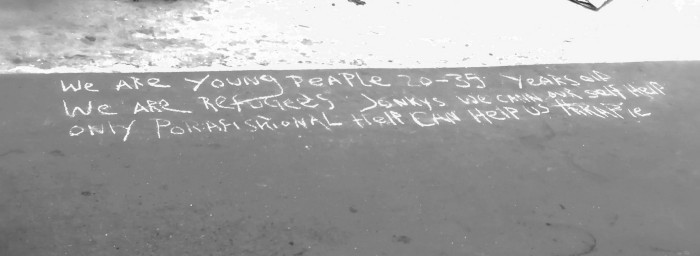

### **بدترین فاجعه ی سال جاری**
#### AYS Weekly News Summary in Persian, July 22–28

### **لیبی**

یک فاجعه ی دیگر در منطقه مدیترانه مرکزی رخ داد و دو قایق در ساحل لیبی در اطراف خمس واژگون شدند و ۳۰۰ نفر را در معرض خطر قرار دادند \. نیمی از آن‌ها هنوز مفقود هستند و از غرق شدن می‌ترسند ، در حالی که ۱۴۵ نفر نجات داده شدند و به قلمرو لیبی برده شدند \.

این بدترین فاجعه در دریا تا سال ۲۰۱۹ را نشان می‌دهد \.

در عین حال ، این فاجعه رخ داد ، پارلمان ایتالیا دکرتوسیکورزا ، که توسط سالووینی پیشنهاد شده بود را تصویب کرد ، که باید یا توسط سناتو در اواسط ماه آگوست تصویب یا رد شود \. در صورتی که این حکم به قانون تبدیل شود ، یک حمله دیگر به قوانین بشردوستانه و حرکت شبه فاشیستی برای این کشور و خطری برای عملیات‌های سار خواهد بود \.

■■■■■■■■■■■■■■ 
> **[Jeff Crisp](https://twitter.com/JFCrisp) @ Twitter Says:** 

> > But why did it take so long, so many deaths and such suffering, for this consensus to be reached? 
And - and even bigger question - will that consensus lead to concrete action? 

> **Tweeted at [2019-07-22 18:26:08](https://twitter.com/jfcrisp/status/1153370658027560961).** 

■■■■■■■■■■■■■■ 

### **مراکش**

خشونت بیشتری علیه مردم در حال مهاجرت در شهر نادر \. پلیس به نام امنیت اروپا یورش برد و اموال مردم را از بین برد \.
### **یونان**
### **ساموس**

مهاجران در مقر پلیس چانیا باید فورا ً آزاد شوند \. دو هفته پیش ، مهاجران در کلاس‌های زبان و فعالیت‌های دیگر در یک مرکز محلی شرکت کردند که به عنوان پناهگاه برای آن‌ها دو برابر شد و در ایستگاه پلیس به عنوان یک حرکت تابستانی برای “ پاک‌سازی “ شهر برای فصل تابستان بازداشت شدند \.

اطلاعات بیشتری در اینجا پیدا کنید \.

بعد از ورود بوسنی به بوسنی و هرزگووین ، مهاجران حق ثبت قصد خود برای گرفتن پناهندگی را دارند ، بنابراین به آن‌ها اجازه می‌دهد تا ۱۴ روز قبل از اینکه به طور رسمی درخواست پناهندگی کنند یا کشور را ترک کنند ، به طور قانونی در کشور بمانند \. تا کنون ، از ابتدای سال ۲۰۱۶ ، تنها 1,600 نفر از پناهندگان موفق به ثبت ادعای خود شده‌اند که کم‌تر از ۵ % از کل افراد تازه‌وارد شامل هستند\. \( منبع : کمیساریای عالی پناهندگان سازمان ملل در بوسنی \) \. نیاز به ثبت یک آدرس موقت در بوسنی یک مانع کلیدی برای این مساله است \.

شرایط برای هر کسی در بوسنی هنوز در داخل یا خارج از اردوگاه‌های رسمی وحشتناک است \. بسیاری از مردم هنگامی که در شهر of ، حتی زمانی که یک کارت کمپ دارند ، به اردوگاه بدنام ووتسیاک منتقل می‌شوند \. ما همه کسانی را تشویق می‌کنیم که خشونت را تحمل کرده‌اند تا ما را بنویسند تا بتوانیم چنین مواردی را گزارش کنیم \.

### **اسلوونی**

حتی با وجود این که اسلونی اعلام کرده‌است که یک دیوار در امتداد مرز ایتالیا نخواهد ساخت ، حداقل نه قبل از این که ببینیم نتایج استقرار گشت‌های مرزی مختلط چه هستند ، که به کار ماموران مرزی کمک می‌کند تا به کار ماموران مرزی کمک کنند ، با وسایل نقلیه زرهی و وسایل نقلیه زرهی و احداث یک حصار سیم‌خاردار برای ۴۰ کیلومتر دیگر \.
### دیپورتی ها

تعداد رو به افزایشی از اخراج از اتریش و آلمان در روزه‌ای گذشته وجود دارد \. پی‌گیری برخی از صفحات فیس بوک که در مورد این تمرین هشدار می‌دهند خوب است : از اواسط ماه ژوئیه ، خانواده‌های افغان در سوئد علیه تبعید قریب‌الوقوع به افغانستان اعتراض کرده‌اند \. آن‌ها در حال حاضر شبکه‌ای به نام Liv utangranser \( زندگی بدون مرزها \) را تشکیل دادند و خواستار اجرای حقوق زنان و کودکان و پایان فوری اخراج خانواده‌ها به افغانستان شدند \.

**اخبار بیشتری به انگلیسی در صفحه رسانه ما در دسترس است \. در مواردی که شما سوالاتی دارید و یا مایلید برخی اطلاعات مربوط به روند پناهندگی شما یا کشور مورد نظر را منتشر کنید , لطفا ً برای نوشتن پیغام روی فیس بوک یا نوشتن یک ایمیل به آر\.یو\.س تردید نکنید**

[**areyousyrious@gmail\.com**](mailto:areyousyrious@gmail.com)

_Converted [Medium Post](https://medium.com/are-you-syrious/%D8%A8%D8%AF%D8%AA%D8%B1%DB%8C%D9%86-%D9%81%D8%A7%D8%AC%D8%B9%D9%87-%DB%8C-%D8%B3%D8%A7%D9%84-%D8%AC%D8%A7%D8%B1%DB%8C-d23cc3c3432) by [ZMediumToMarkdown](https://github.com/ZhgChgLi/ZMediumToMarkdown)._
