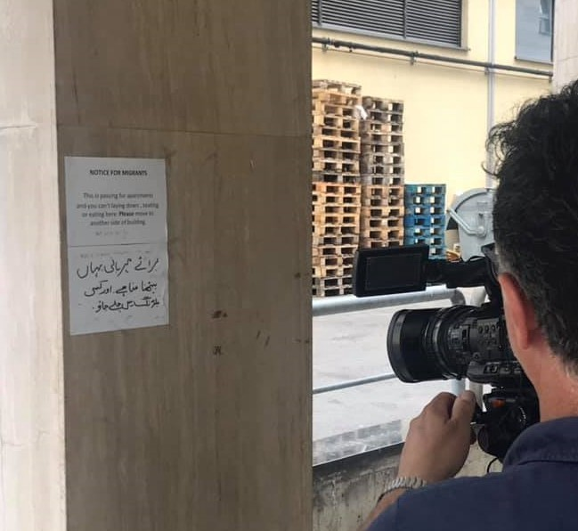

### شروط أكثر صرامة للواصليين حديثا
#### AYS Weekly News Summary in Arabic, July 1–7

### **لبنان**
#### السلطات تزيد من الضغط على اللاجئين السوريين لمغادرة البلاد

هدمت القوات المسلحة اللبنانية حوالي ٢٠ مأوى للاجئين السوريين في ١ يوليو / تموز ، بدعوى أنها لم تمتثل لقوانين الإسكان القائمة منذ فترة طويلة ، ولكنها غير مدعومة إلى حد كبير ، حسب تقرير هيومن رايتس ووتش\.

> يجب النظر إلى هذه الحملة على انتهاكات قانون الإسكان على حقيقتها ، وهو ضغط غير شرعي على اللاجئين السوريين لمغادرة لبنان لدى الكثير من المتضررين أسباب حقيقية للخوف من العودة إلى سوريا ، بما في ذلك الاعتقالات والتعذيب وسوء المعاملة على أيدي اللاجئين\. فروع المخابرات السورية “\(بيل فريليك ، مدير حقوق اللاجئين في هيومن رايتس ووتش\) 

إن قانون الإسكان لعام ٢٠٠٤ ، والذي نادراً ما يتم تنفيذه حتى الآن — يُستخدم الآن ضد ٣٥٠٠ إلى ٣٦٠٠ عائلة لاجئة في عرسال \(حوالي نصف الملاجئ في المنطقة\) وأيضًا في وادي البقاع وبعلبك وهيرميل\.
### **تركيا**

اللغة المعادية لسوريا تستمر فقط بعد انتخابات اسطنبول\. تم إعدام بعض السوريين بعد ظهور ادعاءات كاذبة عن صبي سوري دون السن القانونية قام بمضايقة فتاة تركية دون السن القانونية\. تركيا ليست بلدًا ثالثًا آمنًا للاجئين ، وقد أصبح من المستحيل تقريبًا على السوريين العبور إلى تركيا\. المزيد هنا\.
### **اليونان**

أصدرت\(معلومات اللاجئيين\) دليلًا مفيدًا في تصفح القانون اليوناني ذي الصلة وطرق الحصول على الرعاية الطبية للعنف القائم على النوع الاجتماعي\. الدليل متوفر بالعديد من اللغات ويشرح أشكالًا مختلفة من العنف القائم على النوع الاجتماعي\. يمكنك العثور على النسخة الإنجليزية هنا وانتقل إلى الأعلى “En” لتغيير اللغات\.

### **صربيا**

تم إحصاء ٦٥٥ شخصًا في المنتزهات والشوارع القريبة في منطقة سافامالا في بلغراد ، وأفادت إنفو بارك بأعلى قمة في الأسبوع الماضي\. خلال عطلة نهاية الأسبوع السابقة ، منعت السلطات الهنغارية ١٣٣ شخصًا من دخول البلاد بصورة غير قانونية ، وتم اعتراض معظمهم \(١٠٩\) داخل الأراضي المجرية\.

أفادوا أن أربعة قاصرين غير مصحوبين بذويهم من أفغانستان تم ترحيلهم بالقوة إلى صربيا من المجر تركوا ليناموا بقسوة في بلغراد ، حيث لم تكن هناك أماكن متاحة في ميكاليست\.

هناك عدد متزايد من الأشخاص الذين يصلون إلى صربيا ، ولكن لا تتوفر مكانات جديدة ، لذلك يتم ترك معظم الناس في الخارج
### **البوسنة**
#### فوجيك ، أخطر مخيم للاجئين في أوروبا

فوجيك هو المكان الذي يتم فيه أخذ جميع الأشخاص الموجودين خارج المعسكرات الرسمية في الوقت الحالي\. وهي تقع في ضواحي بيهاتش ، في منطقة خطرة ، حيث الناس ليس لديهم أشياء أساسية وليس لديهم حرية الحركة\. يرجى الاطلاع على إصدارات الملخص الأسبوعية الجديدة السابقة للحصول على تفاصيل حول فوجيك \.

نشرت قصص البلقان فيديو على “معسكر” فوجيك :

**الوافدون الجدد في توزلا**
#### **متطوع محلي يتحدث عن الوافدين الجدد إلى توزلا**

كثيرون من القصر ، ويلجأ الكثيرون أيضًا إلى طلب المال في الشوارع ، لأنهم لا يملكون المزيد من الأموال لمواصلة السفر\. الدعم المقدم لا يكفي: الصليب الأحمر لا ينشط إلا في الصباح ، ويقدم المتطوعون المحليون المساعدة والطعام في المساء\. تقدم المنظمة غير الحكومية الدعم الأساسي للأطفال والقصر\. جميع الناس ينامون بصعوبة وليس لديهم خيار آخر سوى الغسيل في النهر\.

بعد تقارير سابقة من متطوعين في \(ا ي س\)، يصر مكتب اللجوء المحلي على منع الأشخاص الذين يصطفون في طوابير في الخارج لشحن هواتفهم في المبنى\. بالفعل في يونيو تم إزالة جميع المقابس من المناطق المشتركة للمباني\. الآن أصبح الناس مهددين بإخراج هواتفهم إذا حاولوا شحنها في المقابس المتبقية\.
### **ايطاليا**

في مدينة فنتيميليا الإيطالية ، يتزايد عدد طالبي اللجوء الذين تم إعادتهم من بلدان أوروبية أخرى إلى إيطاليا\.

السبب وراء عمليات العودة هو نظام دبلن ٣ ، الذي يضع البلد الذي يدخل البلد الأول في الاتحاد الأوروبي في مهمة تنفيذ عملية اللجوء\. غالبًا ما تكون إيطاليا غير قادرة على تلبية طلب البلدان الأخرى لاستعادة اللاجئين في الوقت المناسب\. نظرًا لعدم اعتبار الرد في الوقت المناسب موافقة ، فقد تكون المسؤولية بالنسبة للعديد من العائدين في الواقع مع دولة أخرى\.

كما ذكرنا سابقًا ، أعادت ألمانيا ١٢٠٠ شخص إلى إيطاليا في غضون ستة أشهر \(١١١٤ فقط بين نوفمبر ٢٠١٨ومارس ٢٠١٩\) \. هذا لا يزال يحدث بانتظام\. من ناحية أخرى ، تم قبول طلبات أكثر إيجابية من إيطاليا إلى ألمانيا في نفس الفترة ، مقارنة بفترة الثلاثة أشهر السابقة \(٣٥٤٠ مقابل ٢٦٢٩\) \. مقارنة باليونان \(التي وقعت اتفاقًا مع ألمانيا\) ، في الفترة ما بين يناير ومارس ، بينما تم نقل ٥٥٧ شخصًا إلى إيطاليا ، تم نقل أربعة منهم فقط إلى أثينا\.

### **فرنسا**

كان هناك ارتفاع في عدد العائلات التي لديها أطفال وأطفال في الآونة الأخيرة في منطقة كاليه ، وهناك حاجة ملحة للمتطوعين الذين لديهم خبرة في العمل في طب الأطفال ، خاصة إذا كانوا يتحدثون اللغات التي يتحدث بها معظم الناس \(العربية ، الفارسية ، الكردية، الرنسية ، الإنجليزية \. \. \) \.

لمعرفة المزيد حول كيفية المشاركة وكيفية التبرع ، يرجى الاطلاع على موقع الويب الخاص بها

: [https://www\.f\-a\-s\-t\.eu/](https://www.f-a-s-t.eu/) \.
#### **البحر الأبيض المتوسط**
#### ثمانون شخصا يخشى موتهم بعد غرق السفينة

تحطمت سفينة تحمل أكثر من ٨٠ شخصا قبالة سواحل تونس بالقرب من جرجيس يوم الأربعاء الماضي\. نقل هذه المعلومات الناشط والمتطوع في الهلال الأحمر التونسي شمس الدين مرزوق ، الذي صرح أن خمسة أشخاص فقط نجوا من الحطام\. توفي أحد المصابين في المستشفى في وقت سابق اليوم ، وفقا لمرزوق\.
### **اسبانيا**

عثر على طوافتين تحملان ما يقرب من ١٢٠ شخصًا على متن طائرات تابعة للجيش على ساحل إسبانيا\. اعترض قارب الحرس المدني الإسباني “ريو مينو “ طوافة أخرى تقل ١١ شخصًا\.

تقوم إسبانيا بتشديد موقفها تجاه الأشخاص الذين وصلوا حديثًا في منطقتي سبتة ومليلية\.

**يتوفر الكثير من الأخبار باللغة الإنجليزية يوميًا على صفحتنا في موقع الميديوم**

**في حال كان لديك أسئلة أو ترغب في نشر معلومات معينة ذات صلة بإجراءات اللجوء أو بلد اخباره مهمة ، يرجى عدم التردد في الكتابة إلينا — إما عن طريق إرسال رسالة إلينا على فيسبوك أو إرسال بريد إلكتروني إلى**

_Converted [Medium Post](https://medium.com/are-you-syrious/%D8%B4%D8%B1%D9%88%D8%B7-%D8%A3%D9%83%D8%AB%D8%B1-%D8%B5%D8%B1%D8%A7%D9%85%D8%A9-%D9%84%D9%84%D9%88%D8%A7%D8%B5%D9%84%D9%8A%D9%8A%D9%86-%D8%AD%D8%AF%D9%8A%D8%AB%D8%A7-f700d29dfed2) by [ZMediumToMarkdown](https://github.com/ZhgChgLi/ZMediumToMarkdown)._
