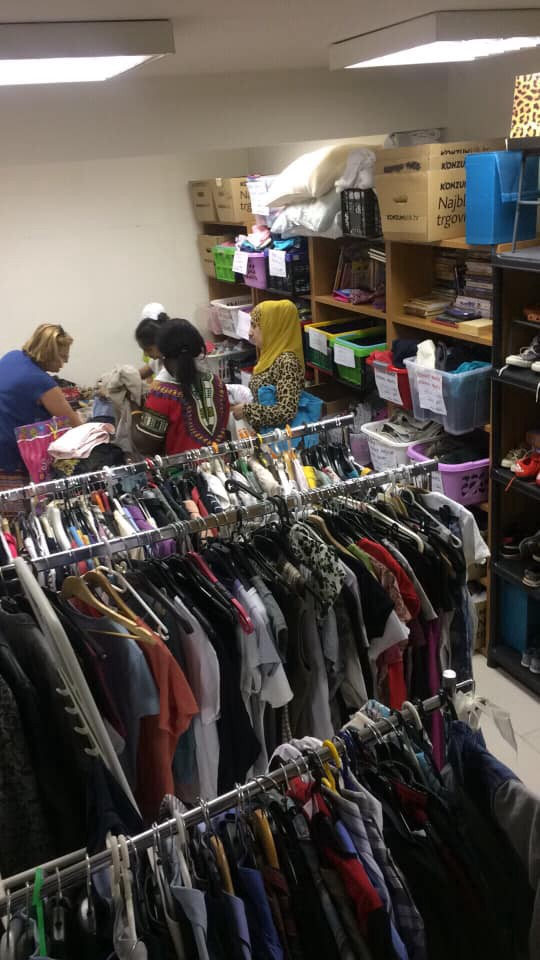

### به گفته دادگاه آلمان ، ماموریت‌های خواندن به یونان در مرز آلمان و اتریش غیر قانونی است \.
#### AYS Weekly News Summary in Persian, August 12–18

](assets/2a4378d9c8ec/1*WYSzS53_jg6sLnzxw8_I5Q.jpeg)

[SOS MEDITERRANEE Italia](https://www.facebook.com/sosmeditalia/?__xts__%5B0%5D=68.ARBFo7HvHyrtDn4WYzqMscByuX7x_7qow3e7Pjl5kojqh2Sl2cUqQjTGslHrkmO6ze9oGkItDdU4HIrhldvruNth301ihJ0Yd3QSB531fubAogCtM9l7nqjclSnyg7yr1H2BtMLDZoGHQEldmlEftIpI-uljmE0pujxJW5lXyXJ0H9u5_YINV50yXkS1ZUsdWN_w1c3Gn3j6_lY41yn3Y6Q2ULrUuwivtV_IIEIgWnoUwVLL_QyZsMicLbf4TQSqVck4ls0yTzEtgrAB5WnbqIE3XmyxHf1xQQtvnPEag8Xyz3WSvStM-JeMcAVxAle3GDQ1l8IbCob6Dv6DNRhlUeNWzK7Em1LN-PMbwuJ6tDZ61cX27gXRAiRll4YQTu3O22b6GFWv238L3FhEwqBHst4NOhv3kI3on2575vzoVv5aZuZXlURm7he6m9p_tZB77A6Fc8sr5GPmw6I290NcSvZUq7tV8k2t5OTCtx_TwXd7Qcjb93UCENNw3wI8QQ&__tn__=k%2AF&tn-str=k%2AF)
### **بوسنی**

در یک به روز رسانی از کمپ ووتسیاک : “ حدود ۱۰ نفر از مردانی که از کشور اخراج شده بودند، بسته به اینکه چقدر به کمک و امنیت نیاز داریم ، با ما در چادر آمبولانس کار می‌کنند \. آن‌ها داوطلبانی هستند ، درست مثل ما \.” در حدود ۵۰۰ یورو در روز هزینه دارد تا آمبولانس را اداره کند \. در اینجا ببینید که چگونه می‌توانید به آن‌ها کمک کنید\.

 \)](assets/2a4378d9c8ec/0*6y3B0K4_4brQg3wC)

\(Tuzla…Photo by [Senad Cupo](https://www.facebook.com/photo.php?fbid=10217297649526575&set=gm.394302207950416&type=3&theater&ifg=1) \)
### **کرواسی**

فروشگاه آزاد آر\.یو\.س در زاگرب به دنبال داوطلبان است — اگر شما در زاگرب زندگی کنید و یا برای پیدا کردن خودتان در زاگرب بسر ببرید و دوست داشته باشید که حتی برای یک روز دست به دست هم دهید — به ما بگویید \!

شواهد بیشتری از روش‌های وحشیانه پلیس کرواسی این مرد جوان سعی داشت از بوسنی به کرواسی رد شود \. پلیس شش بار به او شلیک کرد ، اما او را از دست داد \. به سوی پاهای او شلیک می‌کردند \. آن‌ها سگ‌ها را در مقابل او رها کردند و در نتیجه پاهایش به شدت گاز گرفته شد \. پلیس پول او \( ۳۰۰ یورو \) و ۱۲ پلیس را با استفاده از باتوم برقی مورد ضرب و شتم قرار داد \. آن‌ها شارژر موبایل را دور انداختند و تلفنش را شکستند \. پس از اینکه به بوسنی رفت ، نتوانست زخم خود را چک کند ، چون از ورود به بیمارستان در بیهاچ خودداری کرد \.

در اینجا بیشتر بخوانید \( در زبان ایتالیایی \) \.

زخم‌های اخیر که توسط یک پزشک داوطلب در توزلا به اثر رسیده‌اند با ضربه روحی سازگار هستند : \( عکس \) اطلاعات مفید برای کسانی که ممکن است خودشان را در مرز ایتالیا و فرانسه پیدا کنند :

### **یونان**

همچنین طبق گزارش هفتگی قایق اژه : ۸۶ قایق در هفته گذشته توسط گارد ساحلی ترکیه متوقف شدند ، اما ۱۶۰۷ مردم به این جزایر رسیدند \. اینجا بیشتر یاد بگیرید \.
### **اسکاتلند**

حدود ۳۰۰ نفر در شهر گلاسکو منتظر اخراج هستند \. در یک حرکت جدید از سوی دفتر مرکزی ، مقامات در حال تغییر قفل پناهندگان به منظور وادار کردن آن‌ها به خارج از کشور هستند \. این کمپین حذف در اوایل سال گذشته هنگامی مورد انتقاد قرار گرفت که این سیاست‌ها اجرا شدند ، که به همین دلیل است که آن‌ها تا کنون یک وقفه ایجاد کرده‌اند \. بیشتر اینجا \( به زبان انگلیسی \) اطلاعات بیشتری پیدا کنید \.
### **اتریش**

“ مراکز بازگشت “ در ۱۲۰ پیکر برجسته و سازمان‌هایی از هنر , فرهنگ , علوم و جامعه مدنی بیانیه مشترکی را برای درخواست بسته شدن مراکز بازگشت اتریش آغاز کرده‌است \. شما می‌توانید این بیانیه را \( فقط در زبان آلمانی \) در اینجا پیدا کنید \.

تبعید به افغانستان که قرار است برای تظاهرات اعتراضی روز سپتامبر پناهندگان در وین برگزار شود ، اعلام کرد که پرواز چارتر بعدی به افغانستان در سه شنبه سوم سپتامبر ساعت ۹\.۴۰ بعد از ظهر آغاز خواهد شد \. در ، بلغارستان ، اسلوواکی و اتریش اتباع افغانستان را از مجارستان ، بلغارستان ، اسلواکی و اتریش اخراج خواهند کرد \.
### **آلمان**

به گفته دیوان مونیخ ، “ readmissions “ به یونان در مرز آلمان — اتریش غیر قانونی است ، و بنابراین “ معامله Seehofer “ با یونان و اسپانیا انجام می‌شود \.

این پرونده قانونی به ویژه زمانی آغاز شد که یک شهروند افغان با قطار در ماه مه از مرز عبور کرد و هنگامی که توسط پلیس بازرسی شد ، مشخص شد که این مرد در یونان نفوذ کرده ، بنابراین حق بازگشت را دارد “ \.

پلیس فدرال هیچ امتحان دیگری را انجام نداد \. حتی یک جلسه دادرسی هم در مورد مفهوم مناسب انجام نشد \. پلیس فدرال در این اقدام تنها به آرایش آلمانی — یونانی اشاره کرد و تنها “ اطلاع از ورود “ به یونان را فرستاد \.

پس از اینکه این مرد به همان روز تبعید شد \( و بلافاصله پس از ورودش به یونان زندانی شد \) ، پرونده‌ای قانونی در این پرونده گشوده شد \.

امروز دادگاه مونیخ حکم داد که این مرد باید به آلمان \( در هزینه‌های آلمان \) بازگردانده شود و ورود موقت به کشور را به عنوان یکی از دلایل اصلی ، قطع روند پناهندگی این مرد در یونان پس از بازگشت او اعلام کرد \.

در دابلین سوم ، قاضی گفت :

“ علاوه بر این , این دادگاه نسبت به قانونی بودن و وجود یک اصطلاح “ پیش از دابلین “ شک و تردیدهای قابل‌توجهی دارد \. با فرض یک فرآیند به اصطلاح “ قبل از دابلین “ در مورد متقاضی در واقع در قلمرو یک کشور عضو , حقوق رویه‌ای قضایی متقاضیان تحت مقررات \(مقررات III \) و هدف آن نادیده گرفته می‌شود \. این توضیح می‌دهد که حتی در یک “ امتناع از موقعیت ورود “ , به منظور انتقال یک متقاضی از آلمان به یونان , یک روش دابلین \( امکان پذیرش مجدد امکان برای درمان‌های قانونی با اثر مشکوک \) باید اجرا شود \. به عنوان بخشی از این روند , لازم است که نقض بالقوه حقوق بشر در یونان را بررسی کنیم که می‌تواند منجر به مسئولیت آلمان برای روند پناهندگی شود \. ۳ پارا ی ۲ یا آرت \. ۱۷ تنظیم پارا جهت \( III \) که توسط مقامات اجرایی انجام نشد \.

**اخبار بیشتری به انگلیسی در صفحه رسانه ما در دسترس است \. در مواردی که شما سوالاتی دارید و یا مایلید برخی اطلاعات مربوط به روند پناهندگی شما یا کشور مورد نظر را منتشر کنید , لطفا ً برای نوشتن پیغام روی فیس بوک یا نوشتن یک ایمیل به آر\.یو\.س تردید نکنید**

[**areyousyrious@gmail\.com**](mailto:areyousyrious@gmail.com)

_Converted [Medium Post](https://medium.com/are-you-syrious/%D8%A8%D9%87-%DA%AF%D9%81%D8%AA%D9%87-%D8%AF%D8%A7%D8%AF%DA%AF%D8%A7%D9%87-%D8%A2%D9%84%D9%85%D8%A7%D9%86-%D9%85%D8%A7%D9%85%D9%88%D8%B1%DB%8C%D8%AA-%D9%87%D8%A7%DB%8C-%D8%AE%D9%88%D8%A7%D9%86%D8%AF%D9%86-%D8%A8%D9%87-%DB%8C%D9%88%D9%86%D8%A7%D9%86-%D8%AF%D8%B1-%D9%85%D8%B1%D8%B2-%D8%A2%D9%84%D9%85%D8%A7%D9%86-%D9%88-%D8%A7%D8%AA%D8%B1%DB%8C%D8%B4-%D8%BA%DB%8C%D8%B1-%D9%82%D8%A7%D9%86%D9%88%D9%86%DB%8C-%D8%A7%D8%B3%D8%AA-2a4378d9c8ec) by [ZMediumToMarkdown](https://github.com/ZhgChgLi/ZMediumToMarkdown)._
