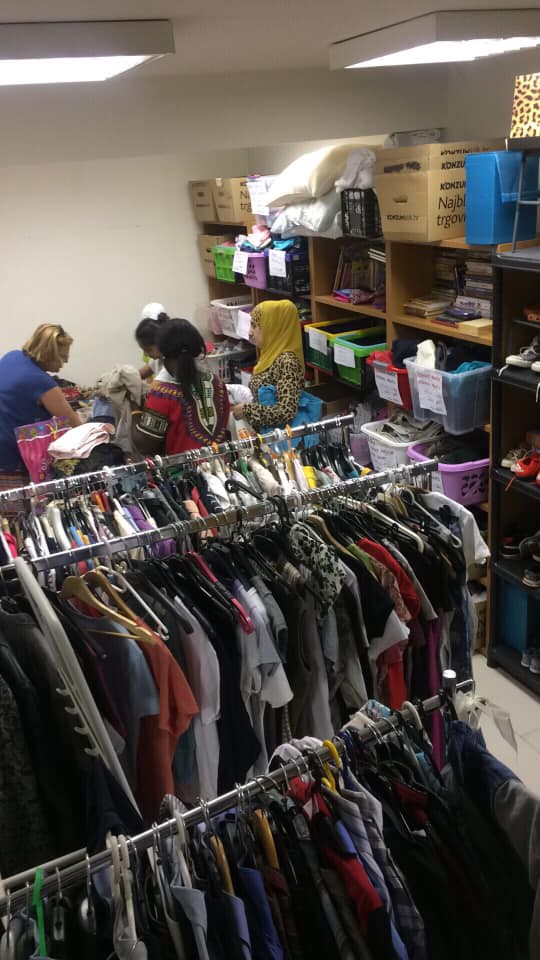

### **تقول المحكمة الألمانية إن عمليات إعادة الدخول إلى اليونان على الحدود الألمانية النمساوية غير قانونية**
#### AYS Weekly News Summary in Arabic, August 12–18

](assets/8cb5ae85f4b6/1*WYSzS53_jg6sLnzxw8_I5Q.jpeg)

[SOS MEDITERRANEE Italia](https://www.facebook.com/sosmeditalia/?__xts__%5B0%5D=68.ARBFo7HvHyrtDn4WYzqMscByuX7x_7qow3e7Pjl5kojqh2Sl2cUqQjTGslHrkmO6ze9oGkItDdU4HIrhldvruNth301ihJ0Yd3QSB531fubAogCtM9l7nqjclSnyg7yr1H2BtMLDZoGHQEldmlEftIpI-uljmE0pujxJW5lXyXJ0H9u5_YINV50yXkS1ZUsdWN_w1c3Gn3j6_lY41yn3Y6Q2ULrUuwivtV_IIEIgWnoUwVLL_QyZsMicLbf4TQSqVck4ls0yTzEtgrAB5WnbqIE3XmyxHf1xQQtvnPEag8Xyz3WSvStM-JeMcAVxAle3GDQ1l8IbCob6Dv6DNRhlUeNWzK7Em1LN-PMbwuJ6tDZ61cX27gXRAiRll4YQTu3O22b6GFWv238L3FhEwqBHst4NOhv3kI3on2575vzoVv5aZuZXlURm7he6m9p_tZB77A6Fc8sr5GPmw6I290NcSvZUq7tV8k2t5OTCtx_TwXd7Qcjb93UCENNw3wI8QQ&__tn__=k%2AF&tn-str=k%2AF)
### **البوسنه**

من معسكر فوسياك: “يعمل حوالي عشرة من الرجال الذين تم ترحيلهم إلى فوسياك معنا في خيمة الإسعاف ,, اعتمادًا على مقدار المساعدة والأمان الذي نحتاجه\. إنهم متطوعون ، مثلنا تمامًا\. “يكلف حوالي ٥٠٠ يورو يوميًا للحفاظ على تشغيل سيارة الإسعاف\. هنا تعلم كيف يمكنك المساعدة\.

 \)](assets/8cb5ae85f4b6/0*uYl1k5VaZe0Xf4Yd)

\(Tuzla…Photo by [Senad Cupo](https://www.facebook.com/photo.php?fbid=10217297649526575&set=gm.394302207950416&type=3&theater&ifg=1) \)
### **كرواتيا**

تبحث \(ار يو سيريس\) في زغرب عن متطوعين — إذا كنت تعيش في زغرب أو تصادف وجودك في زغرب وترغب في المساعدة ، حتى ليوم واحد — أخبرنا بذلك\!

#### المزيد من الأدلة على الأساليب الوحشية للشرطة الكرواتية

هذا الشاب كان يحاول العبور من البوسنة إلى كرواتيا\.

أطلقت الشرطة النار عليه ست مرات ، لكن فاتته\. تم توجيه الطلقات إلى ساقيه\. أطلقوا الكلاب ضده ، مما أدى إلى ساقه بجروح خطيرة\. سرقت الشرطة أمواله \(٣٠٠يورو\) و ١٢ من رجال الشرطة قاموا بضربه باستخدام العصى الكهربائية \. وكسروا هاتفه\. بعد إعادته إلى البوسنة ، لم يتمكن من فحص جرحه ، حيث مُنع من دخول المستشفى في بيهاتش\.

اقرأ المزيد \(باللغة الإيطالية\) هنا\.

تتسق الجروح الأخيرة التي وثقها طبيب متطوع في توزلا مع الصدمة نتيجة للضرب: \(الصورة\)

معلومات مفيدة لأولئك الذين قد يجدون أنفسهم على الحدود الإيطالية الفرنسية
### **اليونان**

أيضًا وفقًا لتقرير قارب اجينا الاسبوعي : تم إيقاف ٨٦ قاربًا من قِبل خفر السواحل التركي الأسبوع الماضي ، ولكن وصل ١٦٠٧ شخصًا إلى الجزر\. المزيد هنا\.
### **أسكتلندا**

حوالي ٣٠٠ شخص ينتظرون الإخلاء في غلاسكو\. في خطوة جديدة من وزارة الداخلية ، تقوم السلطات بتغيير أقفال أماكن إقامة اللاجئين لإجبارهم على الخروج\. تعرضت حملة الإزالة هذه لانتقادات شديدة في وقت سابق من العام الماضي عندما تم تطبيق هذه السياسات ، وهذا هو السبب في أنها اتخذت فجوة حتى الآن\. المزيد هنا [\(باللغة الإنجليزية](https://www.aljazeera.com/indepth/features/hundreds-refugees-live-threat-eviction-glasgow-190815074300235.html?fbclid=IwAR032-oTZxNpSiGqDg-hdPvj3mkTdEDSQA0PXd5w4hS128XdVFENYA1g420) \) \.
### **النمسا**

إغلاق حملة “مراكز العودة”

أطلق أكثر من ١٢٠ شخصية ومنظمة بارزة من الفنون والثقافة والعلوم والمجتمع المدني بيانًا مشتركًا للمطالبة بإغلاق “مراكز العودة” النمساوية\. يمكنك العثور على البيان \(باللغة الألمانية فقط\) هنا\.

عمليات الترحيل إلى أفغانستان مقررة في سبتمبر

أبلغ مخيم اللاجئين في فيينا أن الرحلة التالية المؤجرة إلى أفغانستان ستغادر يوم الثلاثاء الموافق ٣ سبتمبر في الساعة ٩:٤٠ مساءً\. على هذه الرحلة ، ستقوم فرونتكس بترحيل المواطنين الأفغان من المجر وبلغاريا وسلوفاكيا والنمسا\.
### **المانيا**

وفقًا لمحكمة ميونيخ ، فإن “عمليات إعادة القبول” إلى اليونان على الحدود الألمانية النمساوية غير قانونية ، وكذلك “صفقة \(سي هوفر” \)مع اليونان وإسبانيا\.

بدأت القضية القانونية على وجه التحديد عندما عبر مواطن أفغاني هذه الحدود بالقطار في مايو / أيار ، وعند فحصها من قبل الشرطة ، تبين أن الرجل قد أخذ بصمات أصابعه في اليونان ، وبالتالي فهو مؤهل للعودة ، وفقًا “لإجراء ما قبل دبلن” “\.

لم تقم الشرطة الفيدرالية بأي فحص إضافي\. كما لم يتم عقد جلسة استماع بالمعنى الصحيح\. في إجراءاتها ، أشارت الشرطة الفيدرالية فقط إلى الترتيب الألماني اليوناني وأرسلت فقط “إخطارًا برفض الدخول” إلى اليونان\.

بعد ترحيل الرجل في نفس اليوم \(وسجنه في اليونان فور وصوله\) ، تم فتح ملف قانوني في القضية\.

قضت محكمة ميونيخ اليوم بأنه يجب إعادة الرجل إلى ألمانيا \(على نفقة ألمانيا\) ومنحه حق الدخول المؤقت إلى البلاد ، معتبرةً أحد الأسباب الرئيسية ، وهو انقطاع إجراءات لجوء الرجل في اليونان بعد عودته\.

في دبلن ٣ ، قال القاضي:

“علاوة على ذلك ، لدى المحكمة شكوك كبيرة فيما يتعلق بشرعية وجود ما يسمى” إجراء ما قبل دبلن “\. بافتراض ما يسمى “إجراء ما قبل دبلن” في حالة بقاء مقدم الطلب فعليًا في أراضي دولة عضو ، يمكن تجاوز الحقوق الإجرائية الذاتية لمقدمي الطلبات بموجب لائحة دبلن ٣ وهدفها\. وهذا يوضح أنه حتى في حالة “رفض الدخول” ، من أجل نقل مقدم الطلب من ألمانيا إلى اليونان ، يجب تنفيذ إجراء دبلن \(طلب الاستعادة — القبول — إمكانية الحصول على سبل انتصاف قانونية ذات أثر تعليقي\) \. كجزء من هذا الإجراء ، من الضروري دراسة انتهاكات حقوق الإنسان المحتملة في اليونان ، والتي قد تؤدي إلى مسؤولية ألمانيا عن إجراءات اللجوء وفقًا للماده ٣ الفقرة ٢ أو الماده\. ١٧ الفقرة ١ تنظيم دبلن ٣ ، التي لم تفعل ذلك من قبل السلطات بالنيابة
### څنګه کولي شي لا درکه شوي مهاجر و مومي؟

**يتوفر الكثير من الأخبار باللغة الإنجليزية يوميًا على صفحتنا في موقع الميديوم**

**في حال كان لديك أسئلة أو ترغب في نشر معلومات معينة ذات صلة بإجراءات اللجوء أو بلد اخباره مهمة ، يرجى عدم التردد في الكتابة إلينا — إما عن طريق إرسال رسالة إلينا على فيسبوك أو إرسال بريد إلكتروني إلى**

[**areyousyrious@gmail\.com**](mailto:areyousyrious@gmail.com)

_Converted [Medium Post](https://medium.com/are-you-syrious/%D8%AA%D9%82%D9%88%D9%84-%D8%A7%D9%84%D9%85%D8%AD%D9%83%D9%85%D8%A9-%D8%A7%D9%84%D8%A3%D9%84%D9%85%D8%A7%D9%86%D9%8A%D8%A9-%D8%A5%D9%86-%D8%B9%D9%85%D9%84%D9%8A%D8%A7%D8%AA-%D8%A5%D8%B9%D8%A7%D8%AF%D8%A9-%D8%A7%D9%84%D8%AF%D8%AE%D9%88%D9%84-%D8%A5%D9%84%D9%89-%D8%A7%D9%84%D9%8A%D9%88%D9%86%D8%A7%D9%86-%D8%B9%D9%84%D9%89-%D8%A7%D9%84%D8%AD%D8%AF%D9%88%D8%AF-%D8%A7%D9%84%D8%A3%D9%84%D9%85%D8%A7%D9%86%D9%8A%D8%A9-%D8%A7%D9%84%D9%86%D9%85%D8%B3%D8%A7%D9%88%D9%8A%D8%A9-%D8%BA%D9%8A%D8%B1-8cb5ae85f4b6) by [ZMediumToMarkdown](https://github.com/ZhgChgLi/ZMediumToMarkdown)._
