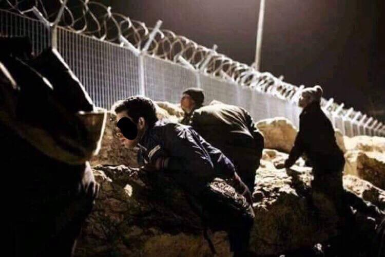
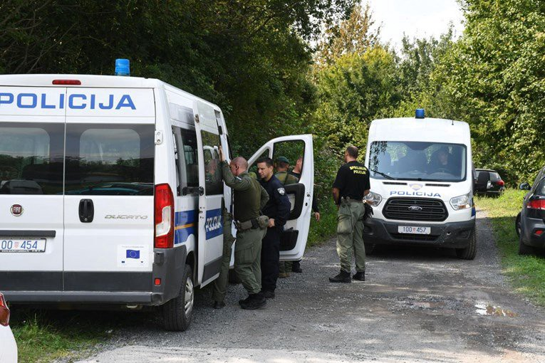
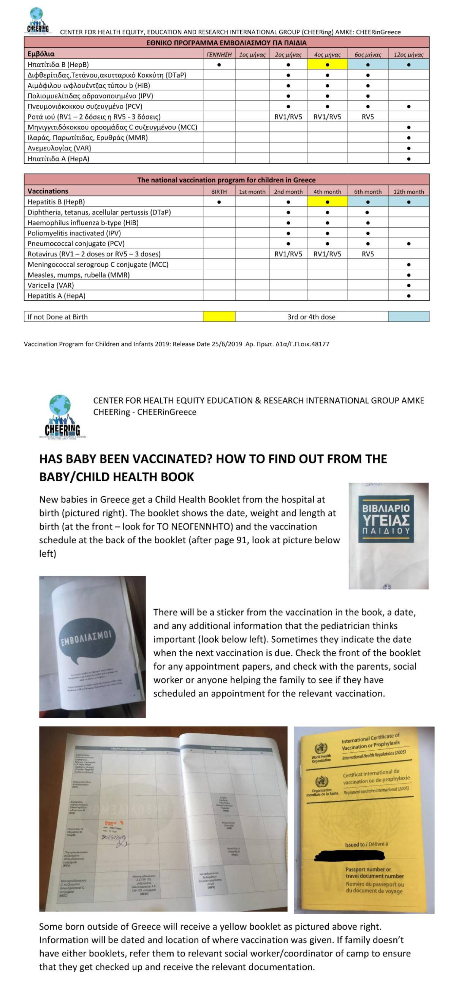
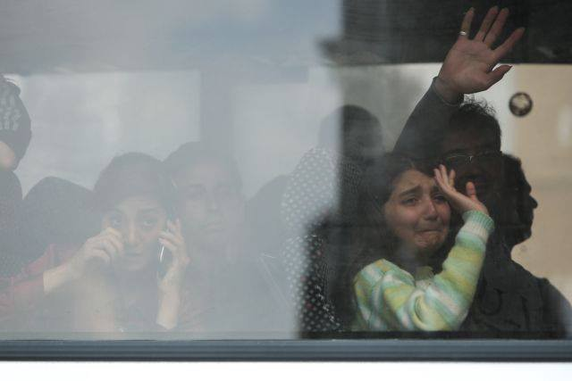
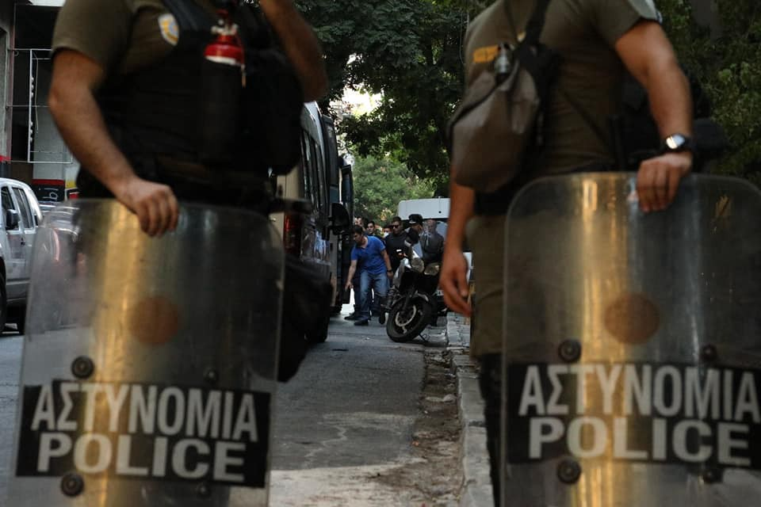
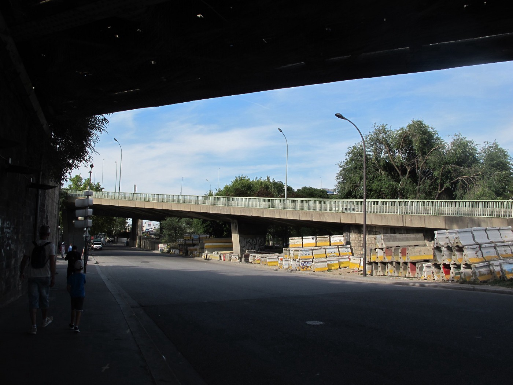

### AYS Daily Digest 24–25/8/19: Woman dies in a smuggler van on Croatian border
#### 10 people survived, smuggler ran away into the minefield // Unaccompanied minor killed in overcrowded Moria camp // More than 100 Syrians still in need of help on Symi island // Bosnian local initiatives need support as they stand in solidarity with people on the move while the government\(s\) fail // Calls for volunteers & more news

People trying to cross Croatian border with Slovenia\. Photo: person on the move

In the middle of the tourist season, refugees seem like the only people who are not welcome in Croatia\. Following an estimated 10,000 illegal pushbacks from Croatia to Bosnia and Herzegovina, Montenegro and Serbia in 2018, people are relying on smugglers in order to reach their desired destinations in the EU\. However, such arrangements can not guarantee safety to anyone\. On Saturday night, a smuggler van fell into the Kupa river while trying to drive away from police pursuit\. The smuggler, allegedly of Serbian origin, ran away through the mine\-suspicious area, while Croatian police officers struggled to save 11 people from drowning\. One woman unfortunately didn’t make it alive\. On Sunday afternoon, three people allegedly connected to smuggling this group of people were arrested while attempting to reach Slovenia by bus\.

Police officers at the site of the tragedy near Slatina Pokupska\. Photo: Pixsell agency

The tragic and unnecessary death of the woman near Slatina Pokupska village can only be seen in the context of Croatian border policy, which resorts to violence instead of respecting basic the human rights of refugees\. Faced with police batons, too many of the smugglers still seem like the only allies who might help them to proceed with their journey\. Even if they manage to pass the Croatian border, the peril lingers while they travel through inaccessible terrain, with more and more informal groups of citizens “monitoring” their movement and reporting them to border police\. At the heavily fenced Croatian border with Slovenia, which is also the entry point into the Schengen area, vigilante groups are openly patrolling and searching for migrants in order to scare them out of Slovenia, or to report them to the Slovenian border police\.

At the moment, there is no indication that the police officer’s actions led to the tragedy, unlike in some previous cases in which [children and adults were shot](ays-daily-digest-31-05-2018-two-refugee-children-shot-by-croatian-police-5c3c811e0f07) or injured in other ways due to the police negligence\.

> _It is estimated that at least 20 people die in Croatia yearly due to dangerous migration routes and human factor\. River Kupa remains deadliest with 15 confirmed drownings since the beginning of the last year, followed by rivers Dobra, Mrežnica and Korana\._ 

It must be noted that there is no reliable statistic to be quoted as many of the deaths remain unconfirmed or not published in the daily updates of the Ministry of Interior, while bodies retrieved from rivers on the Croatian border crossings often remain unidentified\. Activists fear that real number of migrant deaths in Croatia might be higher\.
### Greece
### Unaccompanied minor killed in Moria camp

In the allegedly safe zone of the overcrowded Moria camp on Lesvos, which currently hosts 9,300 people, an unaccompanied 15\-year old boy died and two more were injured in a knife fight that occurred between a group of minors on Saturday evening\. His death occurred shortly after the bigger clash between juvenile groups that reside in Moria\. It is not hard to understand such tragedies would happen if you leave young people in unbearable conditions of a refugee camp where not much has changed since the EU\-Turkey deal which is, ironically, still quoted as a success by EU officials\.

> _Moria currently hosts up to 600 minors, while the total refugee population on Lesvos is estimated over 11,000 people, following the recent surge of arrivals\._ 

**The number of refugee crossings hasn’t been this high since 2016\. 115 boats had reached the Greek Aegean Islands in the first 17 days of August, the SAR teams need support\.**
### Weather warning — Samos & islands
### [Civil Protection warning of “very high risk” for forest fires, Aug 25](l.php?u=https%3A%2F%2Fwww.keeptalkinggreece.com%2F2019%2F08%2F24%2Ffires-greece-risk%2F%3Ffbclid%3DIwAR1VdBy4dlYpJP7l9A8EWJ_IYpLJhHp6BT3HrB4pt8xyiqXwCY6ulPBuX_M&h=AT25Vft_aEbZVW6MHyATiDw1J2mKcwtztPAYGQrkm_oabxOu9SoHqZCVr43m6xXqucBg3BJRCqByBJA26Bk2ve0xETbRI-nIf4GC7wl-7ERMyWV0kz6sxwnmuZdDHbdpyUMp-MzyEzT90w&source=post_page-----e5c673e2faf2----------------------)
### [Greece’s Civil Protection issued a warning about “very high risk” for forest and wild fires for Sunday, August 25th…](l.php?u=https%3A%2F%2Fwww.keeptalkinggreece.com%2F2019%2F08%2F24%2Ffires-greece-risk%2F%3Ffbclid%3DIwAR1VdBy4dlYpJP7l9A8EWJ_IYpLJhHp6BT3HrB4pt8xyiqXwCY6ulPBuX_M&h=AT25Vft_aEbZVW6MHyATiDw1J2mKcwtztPAYGQrkm_oabxOu9SoHqZCVr43m6xXqucBg3BJRCqByBJA26Bk2ve0xETbRI-nIf4GC7wl-7ERMyWV0kz6sxwnmuZdDHbdpyUMp-MzyEzT90w&source=post_page-----e5c673e2faf2----------------------)
#### [l\.facebook\.com](l.php?u=https%3A%2F%2Fwww.keeptalkinggreece.com%2F2019%2F08%2F24%2Ffires-greece-risk%2F%3Ffbclid%3DIwAR1VdBy4dlYpJP7l9A8EWJ_IYpLJhHp6BT3HrB4pt8xyiqXwCY6ulPBuX_M&h=AT25Vft_aEbZVW6MHyATiDw1J2mKcwtztPAYGQrkm_oabxOu9SoHqZCVr43m6xXqucBg3BJRCqByBJA26Bk2ve0xETbRI-nIf4GC7wl-7ERMyWV0kz6sxwnmuZdDHbdpyUMp-MzyEzT90w&source=post_page-----e5c673e2faf2----------------------)

More than 100 Syrians who are still on Symi Island living on the street outside the police station need support\. If you can help, please contact [Rachel Weschen](https://www.facebook.com/rachel.weston?fref=gs&__tn__=%2CdK-R-R&eid=ARAm61pp0eQ113F042pV7LfyOeaZqYWj5emVcK9sxlwIh-yHzZ7KG3qQatL1dvl5rsRiv6YHQVNCyqg2&dti=157689337908512&hc_location=group) who is on the spot trying to secure food for them daily\. Here is what she wrote in her latest report:

> _There are 140 refugees in total today\. 3 pregnant women by my count and a 3 month old baby\. One developmentally disabled 6–7 year old who needs diapers\. I was allowed to visit the second holding facility at the harbor police \(vs port police\) \. Conditions are not good\. Minimal sanitation\. No diapers or formula\. Toddlers walking around in soiled clothes in some cases\._ 

### Alarming number of refugees detained in Greece left with no access to lawyers

Refugee Rights Europe, together with 12 partners, published a new report which describes dire conditions in detention across Greece\. They have documented the lack of legal safeguards, including access to a lawyer, and reports of ill\-treatment by the police\. Full report can be found [here](https://refugeerights.org.uk/wp-content/uploads/2019/08/RRE_NoEndInSight.pdf) \.
### Baby vaccine checker tool

CHEERing works with families to promote and support breastfeeding, and with agencies to train them in optimal infant feeding\. We developed this tool after noticing that many infants are behind on their vaccinations\. When we identify this, we refer the baby to administrators, for example, at the camp or shelter where the baby lives\. Vaccination — like breastfeeding — is a critical, preventive public health measure, especially in emergencies\. We hope this information helps other organizations who work with refugee families in Greece\.

[CHEERing: Centre for Health Equity, Education & Research Int\. Greece](https://www.facebook.com/CHEERinGreece/?ref=gs&__tn__=%2CdkC-R-R&eid=ARCMzc41N5P4I0RONfJI_zk-gBB1I7jXicHsQpSX8goZmAbGm_GP0K_Y5cHFEtxPV3bERQymajxKD3X5&hc_ref=ARSpWUUJ_O1gz0qSOGih3AYto_AyH4WYoIiS3t5gH42tlvc9zmcSx4aP80ZhcGdH8Qc&fref=gs&dti=204202716585823&hc_location=group) have updated the vaccine checker tool to reflect the new Greek vaccination schedule, which was adjusted in the summer of 2019\. They added a visual aid showing where to look in a baby’s health book to see vaccination records\.
### Athens

Photos: Exiled Arizona — @exiledarizona, ST 17, Nikos Christofakis, No Borders

Continuing the previously announced evictions and arrests, 134 prosecuted from Spirou Trikoupi squat were reportedly sent to Petrou Ralli, and 3 from Gare squat to central police in Alexandras\.
### Volunteering

[Zaatar — non\-profit organization](https://www.facebook.com/zaatarngo/?ref=gs&__tn__=%2CdK-R-R&eid=ARCX0wM3gTe4Vx89Dh_WVgI0wxEa4MGZQMRcfg1L08kUaKh227QqTKhYdNhvwjiTf6QeSDcWd3ZNykJr&fref=gs&dti=204202716585823&hc_location=group) is currently looking for volunteers to help at its day centre for refugees located around the Kipseli area of Athens\. They need people to help with the daily running of the centre, to teach language classes, organize social activities, admin support, among other things\. You can find more info about the Zaatar here: [https://zaatarngo\.org/](https://l.facebook.com/l.php?u=https%3A%2F%2Fzaatarngo.org%2F%3Ffbclid%3DIwAR25JCgHzcxMX9QfLX96hf5dr0GCCTom77M0fHcNPRmk2tadGKGCo-dZKvk&h=AT1JmgRCu58VkpolzGJaPzZMXJMknb1mjckEyGqaRbBTTNART-82X8ti6ss782NnDGZBYx4RxXinzhaZ_9H53CPb8nO1_KJt_M-IiFW_XBoeEDBCJqJ4cPRaTM0sfHpktFPrdaXecXNZumImF8c)

Med’EqualiTeam is looking for committed volunteer interpreters to join their medical clinic on Samos in September\.
### CYPRUS

There is a threat of a humanitarian crisis in Cyprus, as Catherine Woollard of the NGO European Council for Refugees and Displaced Persons [warns](https://www.t-online.de/nachrichten/ausland/krisen/id_86326114/fluechtlingskrise-zyperns-hilferuf-an-europa-haben-unsere-grenze-erreicht-.html?fbclid=IwAR0zdAurFqOtBlnXc6Dyi064DdADa_bwobFov_UaPqi5lHBk6ZudSJwkwaA) \.
In 2018, there was an increase of 70 percent in number of asylum requests compared to the previous year, according to Eurostat data\. In the first half of 2019 alone, there were almost 7,000 applications\. The camps in Kokkinotrimithia west of the capital Nicosia and in Kofinou near the port city of Larnaca are crowded, according to Cypriot media\.
The Lebanese coast is around 170 kilometers away and many people arrive directly from there, although Cyprus claims that Turkey is failing as the other side of a dialogue regarding migration\.
### BOSNIA AND HERZEGOVINA

Support the local medical teams in Bosnia and Herzegovina working with people on the move who are outside the “system” and most vulnerable\. 
A team in Tuzla has been assisting people on daily basis for over a year now, non stop\. Here is how you can support them, wherever you are:
### [Health assistance for refugees/migrants in Tuzla/Sarajevo](?fbclid=IwAR3Q7pjmtJVY3RXhfDV9F_V6n6s9zq_zOdQaVEOamnqGDQAGcHRjPMb8WGY&source=post_page-----e5c673e2faf2----------------------)
### [Please help Selma Dzafic: We are volunteers medicin workers who help refugees/migrants every day\. Situation is getting…](?fbclid=IwAR3Q7pjmtJVY3RXhfDV9F_V6n6s9zq_zOdQaVEOamnqGDQAGcHRjPMb8WGY&source=post_page-----e5c673e2faf2----------------------)
#### [social\.fund](?fbclid=IwAR3Q7pjmtJVY3RXhfDV9F_V6n6s9zq_zOdQaVEOamnqGDQAGcHRjPMb8WGY&source=post_page-----e5c673e2faf2----------------------)

In Velika Kladuša, a volunteer who had set up a clinic while there were no MSF and other teams to provide aid to people outside the officials camps, now needs more support\. Contact him directly to find out more: sos\.team\.vk@gmail\.com
### SEARCH AND RESCUE
### Rescue boat Eleonore held at sea since Friday

Claus\-Peter Reisch from the Dresden refugee aid organization Mission Lifeline has been back in the Mediterranean since Friday evening\. According to Lifeline spokesman Axel Steier, the ship is in the Libyan search and rescue zone\. Captain Reisch and a ten\-member crew watched the situation on the ground\. The new ship from Reisch and his friends is called “Eleonore”\. It is reportedly 20 meters long and 5\.50 meters wide\.

Mission Lifeline recently announced its intention to resume its rescue operations in the Mediterranean in August\. The first ship of the Dresdner Verein, the “Lifeline”, had rescued 234 refugees last summer\. After days of uncertainty the ship was allowed to dock in Malta’s capital Valletta, but was then confiscated by Malta’s authorities\. “Lifeline” captain Reisch was fined 10,000 euros by a court in Valletta for alleged false registration of the rescue vessel\.

> _According to MSF, 18\.660 people have died trying to cross Mediterranean sea since 2014\. The real number will probably remain unknown\._ 

### FRANCE
### Paris

A painful detail from one of thousands of human stories across the French capital…

Photo and text: [Chiara Lauvergnac](https://www.facebook.com/chiara.lauvergnac?__tn__=%2Cd%2AF%2AF-R&eid=ARChX5FihUvl4gkYD1fpNu7bGo1nVHp7QoBONA3svrNjS6SCly_IWv6PL0Y4I9fpkqyiNnEkuWVP981P&tn-str=%2AF&hc_location=group_dialog)

> _We spoke to a Somali guy who \(…\) has been in Europe since 2009, his family are in Finland, he has two kids aged 8 and 6 who live with their mother, he has been deported from Finland several times because he has Dublin fingers, sometimes he talks to his kids over the phone, they keep asking him when is he going to come, but to cross the border has became very hard, also to Finland\. It was hot today, he was wearing shorts and a T shirt and his entire body is covered in scars, burns, cuts, I did not have the courage to ask but it looks like the man has been tortured\. He has been to many EU countries, never able to settle anywhere\. No wonder people lose hope\._ 

### GERMANY

Photo: [Unteilbar](https://www.facebook.com/buendnisunteilbar/?__xts__%5B0%5D=68.ARDaW5ReqZYbAro59ptwhvan5ngTOQHMW7nLVQK--CbFsCe7auxyLPkR8zht850deS6hUk0Fu_cBXlQ89gsx2m8sa7JDbDdX72cIgzWqAjHo0UVxjNYWJw0ZA9WA1oH9MNUbE6OgaL9sRGfBNnW0IIPqR_IdTQHsO5vITL78BmaoN0JFgfaCOE2HjscmsmTEcryuOgWl-IG789Z7O5Nt9_4409hLXCcNz5cYB57Ah1AY7bXba3Scd0KofzIjR_DlPjq2hmA5f7TgqbaNILpDUMWXjjXeRHMbgFn5JX1VmyW55kUixAdUxK_uOw0RCMCLLtnMzxVTCRUWj88_Xy_ctAOrAGLM&__tn__=k%2AF&tn-str=k%2AF)

There were a total of 40,000 people present at the march in Dresden, as one of the activists wrote: “a great sign for a solidarity, anti\-fascist and open society and a good life for everyone”\.

**We strive to echo correct news from the ground through collaboration and fairness\. Every effort has been made to credit organisations and individuals with regard to the supply of information, video, and photo material \(in cases where the source wanted to be accredited\) \. Please notify us regarding corrections\.**

**Apart from daily news in English, we also publish weekly summaries in Arabic and Persian\. Find specials in both languages on our [medium site](https://medium.com/are-you-syrious/ays-weekly-in-arabic-and-persian/home?source=post_page---------------------------) \.**

**If there’s anything you want to share or comment, contact us through Facebook, Twitter or write to: areyousyrious@gmail\.com\.**
### [Are You Syrious?](https://medium.com/are-you-syrious?source=post_sidebar--------------------------post_sidebar-)
#### Daily news digests from the field, mainly for volunteers and refugees on the route, but also for journalists and other parties\.

_Converted [Medium Post](https://medium.com/are-you-syrious/ays-daily-digest-24-25-8-19-woman-dies-in-a-smuggler-van-on-croatian-border-ef62dd7540a3) by [ZMediumToMarkdown](https://github.com/ZhgChgLi/ZMediumToMarkdown)._
