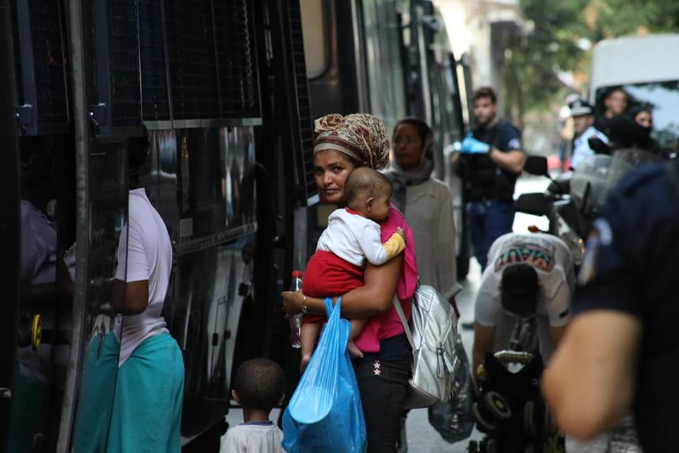
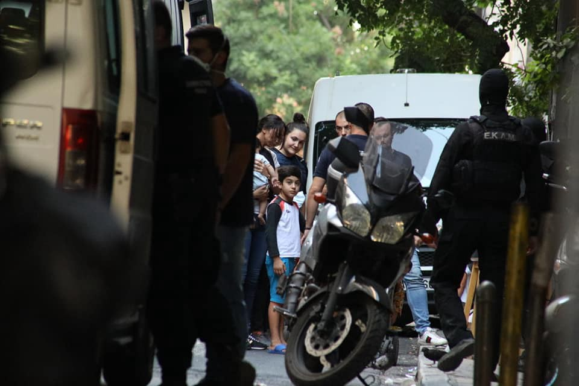
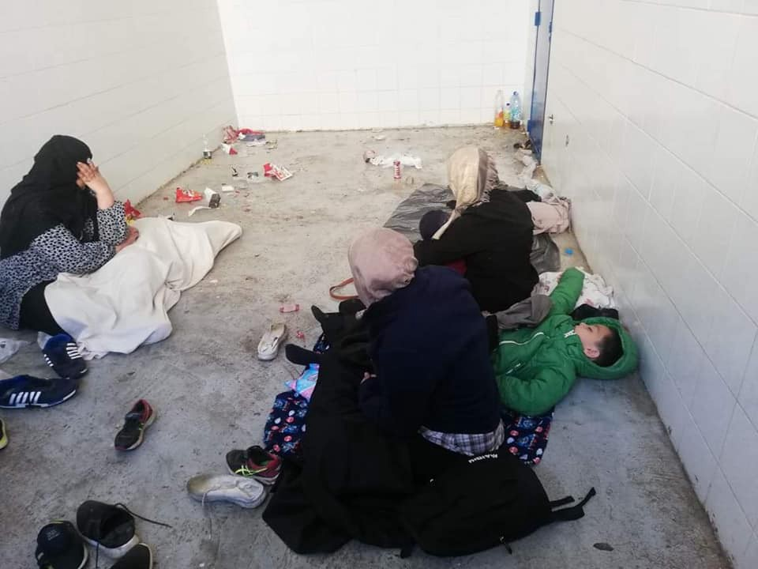

### AYS Daily Digest 26/8/19: Police raids displace 143 people in Exarcheia, Athens
#### _6 people died in car crash in Greece // Military heightened in Morocco // Music from Libyan detention centre // Police in Croatia continue to detain people in the infamous garage before pushing them back to Bosnia and Herzegovina_

](assets/3941c5119e19/1*uIHxrcDVthnkE15iD8tWqA.jpeg)

Photo by [Spirou Trikoupi 17](https://www.facebook.com/spiroutrikoupi17/?__xts__%5B0%5D=68.ARBPhXD1rC3czgbGAlP4-J-s4-rxHMFR3znfDjiLkhRRSLIvMRd3cBKCvdXRYfZzaVLfbJ-9usjd-93y5zI5NVF8Rr-Omq_rnMqNlklju5Ff8EJCzPITyyCl7p5tD9NgsyLFIUJwV6SMsNLsYgEUVIfNRHiPjGmcAAczXuTVlT_lFDITjaKw_HHJ0IP6SfNZUMGkCFwd7ieQHDzwaxbH2sfGfMeeHuFMUOMHe-OfTc2CoDmpK3NSk0A99MbXTYLQT0adsQP8wvfs9FH7_-LI1Y9Yizr9beBtErifePRJsHEv5KWep8TFkevdr_MbtbL2W7RTXgh2ZdySaWzp3KuOAHU&__tn__=k%2AF&tn-str=k%2AF)
### Feature: Police Raids displace 143 people in Exarcheia, Athens

Monday morning, police raided squats in Exarcheia, Athens; [the desired effect](https://twitter.com/exiledarizona/status/1165873714568867840) was to remove anyone without identification in order to clear out refugees and destabilize the anarchist movement\. The brutal outcome was that [143 people](https://www.keeptalkinggreece.com/2019/08/26/exarchia-police-refugees-squats) , including a large number of children, were forced to leave their homes and were sent to Aliens Directorate\.

](assets/3941c5119e19/1*FlwV3m5BwYBGy66vfz3KGw.jpeg)

Photos by [Spirou Trikoupi 17](https://www.facebook.com/spiroutrikoupi17/?__xts__%5B0%5D=68.ARBPhXD1rC3czgbGAlP4-J-s4-rxHMFR3znfDjiLkhRRSLIvMRd3cBKCvdXRYfZzaVLfbJ-9usjd-93y5zI5NVF8Rr-Omq_rnMqNlklju5Ff8EJCzPITyyCl7p5tD9NgsyLFIUJwV6SMsNLsYgEUVIfNRHiPjGmcAAczXuTVlT_lFDITjaKw_HHJ0IP6SfNZUMGkCFwd7ieQHDzwaxbH2sfGfMeeHuFMUOMHe-OfTc2CoDmpK3NSk0A99MbXTYLQT0adsQP8wvfs9FH7_-LI1Y9Yizr9beBtErifePRJsHEv5KWep8TFkevdr_MbtbL2W7RTXgh2ZdySaWzp3KuOAHU&__tn__=k%2AF&tn-str=k%2AF)

[The four](https://twitter.com/exiledarizona/status/1165883768508420096) confirmed raids happened in Gare, Spirou Trikoupi 17, Rosa de Fok, and Clantestina\. The police were heavily armed at all of the raids, adding to the sense of fear and the racist belief of establishing security in the neighborhood\.

One police spokesman, in a [blantently racist statement](https://thepressproject.gr/ekprosopos-tis-astynomias-charaktirizi-anthropous-os-skoupidia-ke-skoni/?fbclid=IwAR2zg0wvlWQNWSC0e-bKSUnMBc1DOoQbsEYlBDOaHpLSn9UaDi3hLOHphVQ) , went as far afterwards to refer to the evicted people as “rubbish” and “dust” that the police “vacuum cleaners” must suck up\.

■■■■■■■■■■■■■■ 
> **[Exiled Arizona 🎃](https://twitter.com/exiledarizona) @ Twitter Says:** 

> > Update so far on mass police occupation and raid of anarchist neighborhood Εξάρχεια

- No cars can get in from most streets

- Helicopter hovering, unmarked police cars all over

- Only mainstream reporters allowed to film 

- Over 100 arrests 
#antireport https://t.co/5yd0iSdrVD 

> **Tweeted at [2019-08-26 05:30:46](https://twitter.com/exiledarizona/status/1165859107267645440).** 

■■■■■■■■■■■■■■ 

**Some important things to know for immediate action:**

[NoBorders](https://twitter.com/Refugees_Gr/status/1166127314146603015) reports that: _“From the refugee affidavits today, we learned that ten people without papers were transferred to Amygdala\. There is a need for solidarity and legal support\.”_

Also, you can still apply for asylum while in detention\! Learn more [here](https://www.facebook.com/refucomm/posts/914621755556294?hc_location=ufi) \.

Finally, the solidarity assembly held on Monday evening had a great turnout, but more work needs to be done in order to prevent future evictions and protect the people affected\. Follow [Spirou Trikoupi](https://www.facebook.com/spiroutrikoupi17/posts/711168992663237?hc_location=ufi) to find out more\.

](assets/3941c5119e19/1*GgN-mo65qm515xjFOSrh7w.jpeg)

“They can’t evict a movement” Photo by [Spirou Trikoupi 17](https://www.facebook.com/spiroutrikoupi17/posts/711460082634128?hc_location=ufi)
### Morocco

](assets/3941c5119e19/1*2XKjcyJFfC0ufYWocom0ow.jpeg)

“Visiting the Bekoya camp of migrants in Nador, AMDH Nador has found that the humanitarian situation is getting worse every day despite the fact that Ngos are providing important funding to help of migrants\. We found this migrant alone very sick with a very manifest fever\. He was shaking in the middle of the summer and received no help from the migration delegation in Nador” Yet he did receive help afterwards\. Photo by [Association Marocaine des Droits Humains — Section Nador](https://www.facebook.com/AmdhNador/photos/a.1693125780899690/2398864460325815/?type=3&theater)

AMDH Nador also reports that new military camps are being built in the forests near the camp\. _“Morocco is mobilizing its military device to repression and hunt down simple migrants\.”_ Find out more [here](https://www.facebook.com/AmdhNador/photos/a.1693125780899690/2399797453565849/?type=3&theater) \.
### Libya

Thank you to independent journalists who keep fighting the good fight in order to bring to light the darkness facing humanity\.

Also, everyone should check out this very creative music video, ‘ [new Eritrean music’ made from inside Zintan detention centre:](https://www.youtube.com/watch?v=0584FWdGQvc&fbclid=IwAR2qkiGAmRFQ4SEPRxAEeX39RcSEsf_lmXC3oStZUpfX4NZp5jl5Zacm6LU)

> “The title of lyric says ‘we make an engagement with death’ in Zintan\. That we are near to death within UNHCR\. That means we are weary\. We are mourning the deaths of our brothers who are not buried\. We are recommending to professionals to raise up our crying, our pain to the EU\.” 

### Greece

[New arrivals](https://www.facebook.com/AegeanBoatReport/posts/637392810117160?__xts__[0]=68.ARChTonJU8wH9964BUatBGmlmMexEMn_fGqJnJUyaR7s80rr42l3tZqTB9DDhuqYlD9y6WoRNJI8b6pNCE8GyJILNGJl12tLXCk3exydN92C8Tp3YUn4UQrb2KwUUZj858CbXjLQnR9LoFEoOdjxWheIPA8-ad9y_ccgbFB-Ecik81ObdJdWae5YnvUw-iCLiytUaSJtVqnozXVJrj-bXm9o6Uj2xR6m0DckpiT0qKfputhsMC6mD27BlpZoPNkCevKNGzgqc0HUpURuvnoUJKd1z2u2KrtD7u6jRKjiBlN-ZN--rS1O1WqAsQg5E6U4bNdnHIbqwpwdLV5b4-JY9Ag&__tn__=-R) to the Greek Islands according to Aegean Boat Report: 14 boats total on Monday, carrying a total of **228 people\.**

First boat → Lesvos, 9 people

Second boat → Lesvos, 22 people

Third boat → Lesvos, 40 people \(17 children, 11 women, 12 men\)

Fourth boat → Lesvos, 38 people \(18 children, 9 women, 11 men\)

Fifth boat → Lesvos, 31 people \(5 children, 4 women, 22 men\)

Sixth boat → Lesvos, 46 people \(24 children, 12 women,10 men\)

Seventh boat → Lesvos, 42 people \(18 children, 10 women,14 men\)

Eighth boat → Samos,48 people

Two boats arrived on Farmakonisi, transported to Leros, 67 people 
\(Numbers not confirmed\) \. Another 55 people were transported from Simi to Leros\.

_“Three boats have been reported arrived on Simi, unfortunately no further information available\. Also one boat reported arrived on Kos, no further information available\.”_

6 people were killed and another 10 injured in a smuggling jeep accident, close to the Turkish border\. It is unclear what caused the accident\. For more [information click here](http://www.ekathimerini.com/243929/article/ekathimerini/news/greek-police-say-six-migrants-killed-10-hurt-in-road-crash?fbclid=IwAR13hia0A1Nt2eDwHRpYER0-yc65xT-rwnhPqmZwzBX60qQ9UqkoRVIOS54) \.
### Croatia

Worrying images confirm what had earlier been reported about the practice of unlawful detention by the Croatian police in places that are unfit to host humans\. They use these secret locations as part of the process of collective expulsions to Bosnia and Herzegovina\. People are held for a day \(or even longer\) locked up in a filthy garage, without any access to hygiene facilities, place to rest, proper ventilation, food, not to mention legal aid and information, or mechanism of demanding international protection\. What is the difference between this, what the EU is doing, and the same sights in Libya that the EU is so shocked by?

](assets/3941c5119e19/1*MfPcCeFsS1nGEeNBHqLX5Q.jpeg)

Crotian police put these people in prison for 15 hours, including the children\. Photo by [Lorena Fornasir](https://www.facebook.com/lorena.fornasir/posts/2339943216122762?hc_location=ufi)

**We strive to echo correct news from the ground through collaboration and fairness\. Every effort has been made to credit organisations and individuals with regard to the supply of information, video, and photo material \(in cases where the source wanted to be accredited\) \. Please notify us regarding corrections\.**

**Apart from daily news in English, we also publish weekly summaries in Arabic and Persian\. Find specials in both languages on our [medium site](https://medium.com/are-you-syrious/ays-weekly-in-arabic-and-persian/home?source=post_page---------------------------) \.**

**If there’s anything you want to share or comment, contact us through Facebook, Twitter or write to: areyousyrious@gmail\.com\.**

_Converted [Medium Post](https://medium.com/are-you-syrious/ays-daily-digest-26-8-19-police-raids-displace-143-people-in-exarcheia-athens-3941c5119e19) by [ZMediumToMarkdown](https://github.com/ZhgChgLi/ZMediumToMarkdown)._
