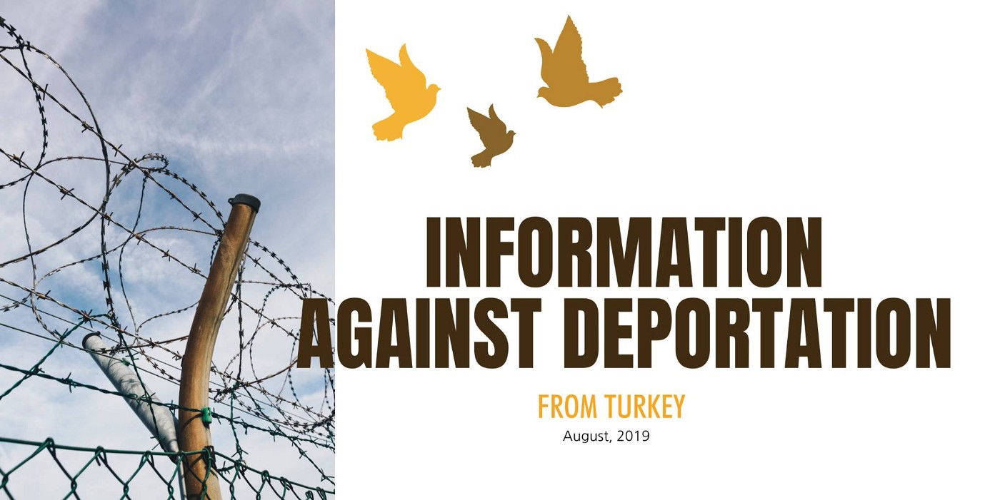
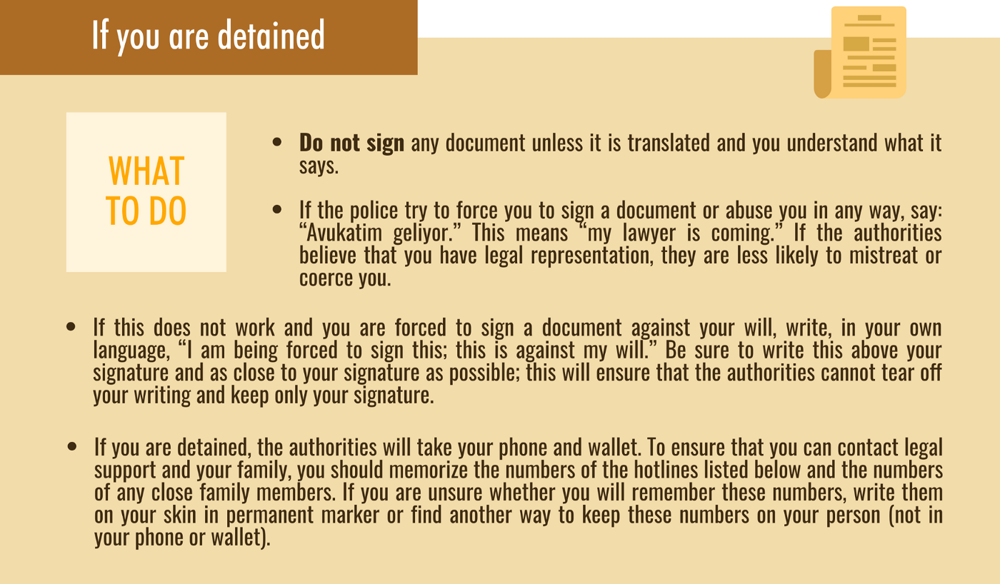
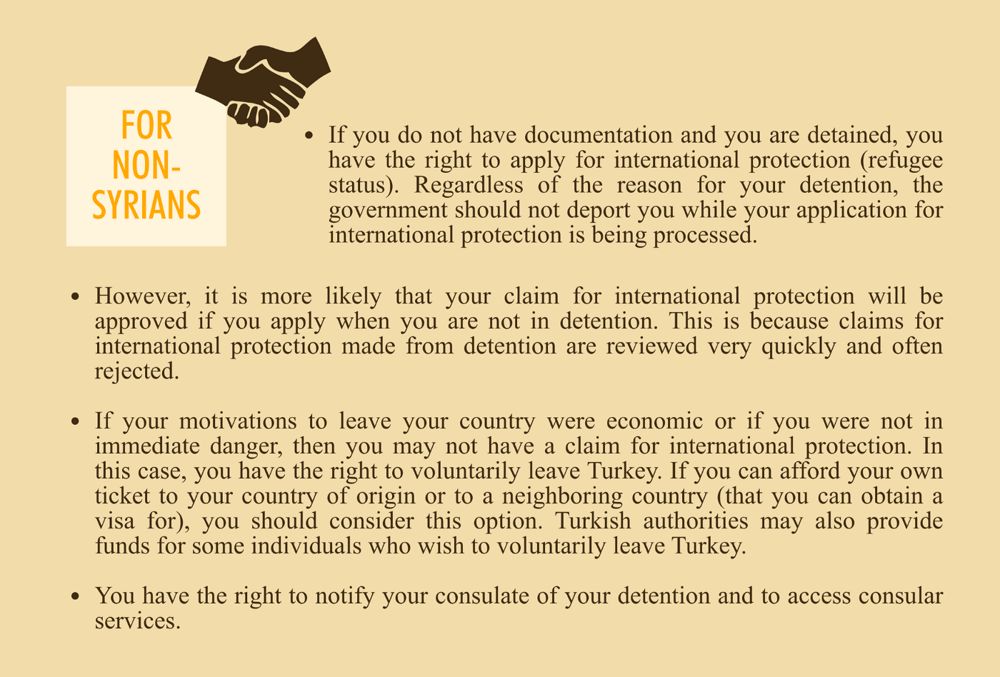
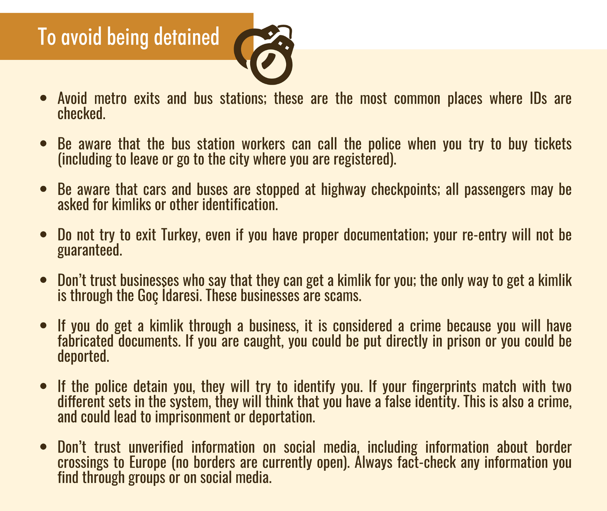
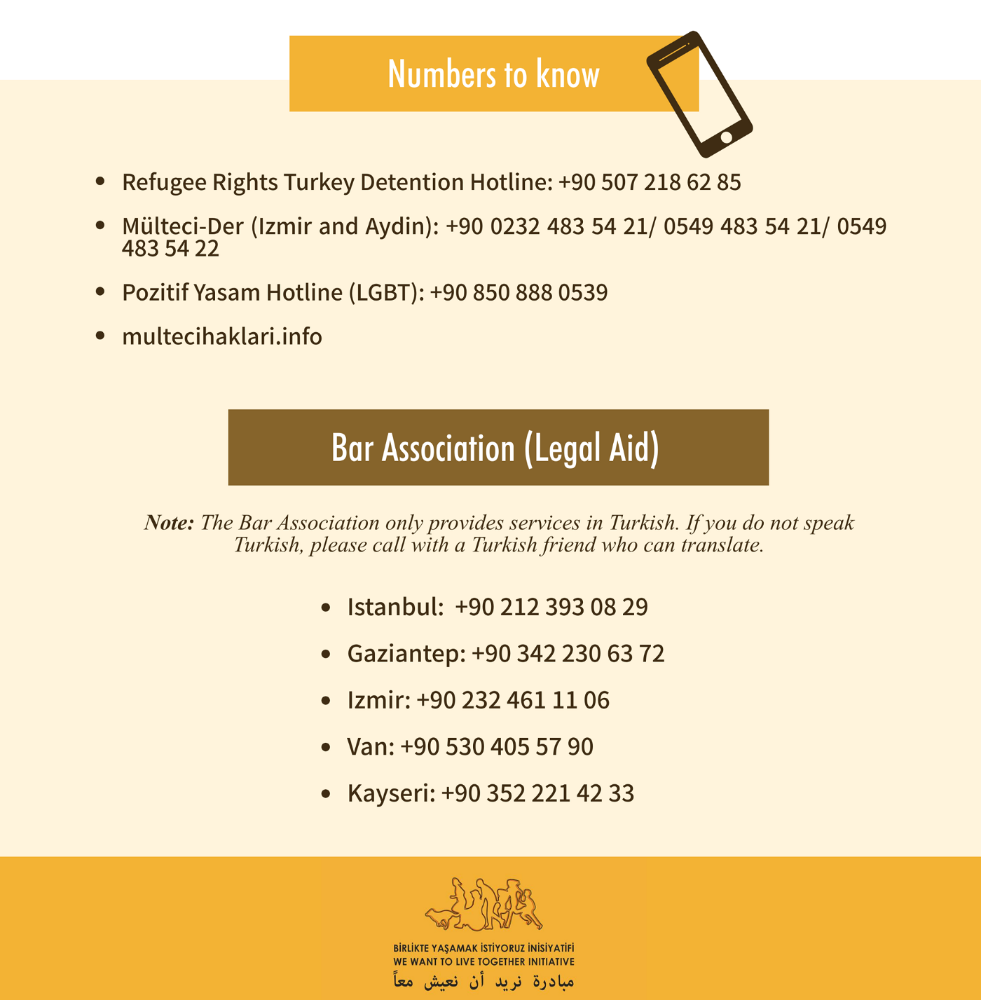
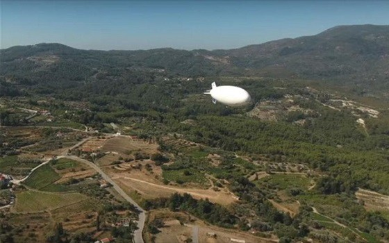
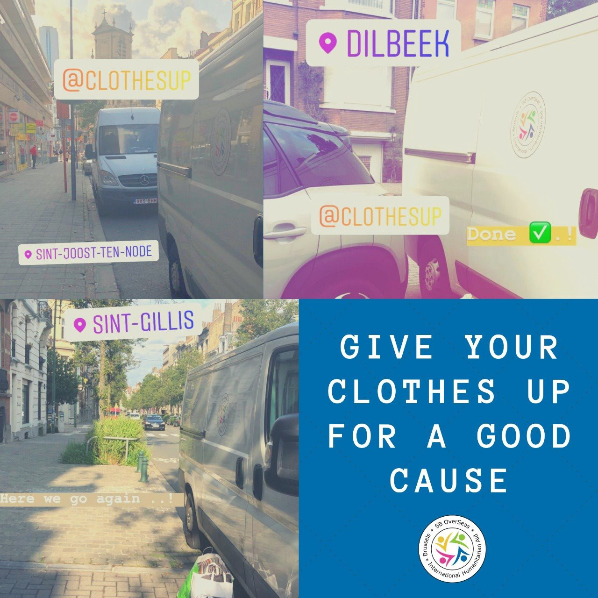

### AYS Daily Digest 27/8/19: Dreadful path of minors to UK’s recognition and chance for education
#### Information Against Deportation From Turkey / Protests in camps of Nador, Morocco / Horrible realities of children in Moria’s “safe zone” / Need for medical staff in the Aegean / As more people arrive at Symi island, help is needed / Police records in Bosnia surfaced of shots reportedly fired at people on the Bosnian side by the Croatian border police, case covered up / & more news and useful info

](assets/1d69b8c7a404/1*dRgs_KDDk4Nf3ve1MyEh0g.jpeg)

Photo by: [Sea\-Watch](https://www.facebook.com/seawatchprojekt/?tn-str=k%2AF&hc_location=group_dialog)
#### FEATURED

1450 people have been found either by British or French coast guards, trying to cross the Channel, since January this year\. That is more than double the number who attempted to cross the busy shipping channel in the whole of 2018, in order to reach the UK, according to official French figures\.

Without access to work or healthcare, they often live under precarious circumstances\. Those who dare to dream about studying in the UK find financial and bureaucratic obstacles crushing their ambitions, if before that a social worker or someone else in the line of professionals who are deciding has stated the young person’s age as over 18\.

In those cases, it is important to find them a solicitor\. If they don’t have one or are not able to contact their solicitor for whatever reason, they need to [contact one](https://righttoremain.org.uk/toolkit/lawyers/) and get proper advice on their claim as soon as possible\. The Home Office and Social Services will share information\. Many working with minors in the UK advise that it is also good to contact the Refugee Council’s age dispute project \(Age\.Disputes@refugeecouncil\.org\.uk\) \.

If the young person is declared an adult, they will be housed in a dispersal house, not with a foster family as usually happens with minors\. Also, their chances for studying decrease rapidly, with some possibilities for studying English, but there are not as many options as minors have\.

The University of London offers 20 sanctuary scholarships each year to forced migrants such as asylum seekers, refugees or trafficking victims\. It’s called the [Compass Project](http://www.bbk.ac.uk/professional-services/access/compass-project) \.

Almost all [universities in the UK offer sanctuary scholarships for refugees and asylum seekers](http://www.star-network.org.uk/index.php/resources/access_to_university) , but they are only open to students who have A\-levels or an equivalent qualification\.

> Each academic year, Birkbeck waives the equivalent of one year’s full\-time tuition fees for up to 20 asylum seekers who manage to secure a place on one of the university courses — at any academic level\. In addition, students can apply for bursaries to cover travel, material and childcare costs\. These costs are funded by private and corporate donations\. 

> Rather than a full\-blown degree, Birkbeck concentrates on offering asylum seekers a pathway into higher education that will allow them access to other UK universities\. 

Read more [here\.](https://londonist.com/london/features/this-london-university-helps-unlock-asylum-seekers-potential?fbclid=IwAR3vfp4-utqHUNqioa0vQhMORW5rop8nXW-NYaZy58j9f4M4Ldz871fAoI0)
#### LIBYA

At least 40 people were missing and feared drowned on Tuesday after the boat they were traveling on capsized in the Mediterranean Sea off Libya\. At least five bodies, including a child, were recovered near Khoms\.

For most recent direct updates from the detainees in Libya, one of the best sources is the social media account of one of the journalists who has been following the developments in Libya closely:

■■■■■■■■■■■■■■ 
> **[Sally Hayden](https://twitter.com/sallyhayd) @ Twitter Says:** 

> > Another protest in Abu Salim detention centre, where detainees haven't been given food since last year, &amp; instead must pay for their own using money sent by their (long in debt) families. They say fighting has restarted around them too. #libya https://t.co/DWpcRkOwWs 

> **Tweeted at [2019-08-26 21:41:12](https://twitter.com/sallyhayd/status/1166103325730889728).** 

■■■■■■■■■■■■■■ 

#### MOROCCO

[Association Marocaine des Droits Humains — Section Nador](https://www.facebook.com/AmdhNador/?__tn__=%2CdkCH-R-R&eid=ARCwVNWMCz4eaLVG8-zQfif7gCR0mw_gOOXv44jFzF-lVxU4TvilRT7dbLYv4Bb5Xvr1Ayt3IgcGwvFG&hc_ref=ARQFewm90trNUesbIz1F8RQBBi83MFbnQrO6v1-O0Mzhj9nD-WAuFOMdysdmAHArQpM&fref=nf&hc_location=group) reports:

The protests of migrants are growing in the camps in Nador after the violations of Moroccan authorities have reached unbearable levels: violence, unfair arrest even of women and children, the disappearance of phones and money of migrants, destruction of shelters and hunting throughout the day with a military device in addition to the auxiliary forces and the gendarmes\.
AMDH Nador denounces this repression towards migrants, calls for putting a stop to these arrest and also calls for the opening of an investigation into the theft of the property of migrants and the legal pursuit of those who are responsible\.
#### TURKEY
### What are your rights, what can you do and where can you call if you are being deported?

An ‘Information Against Deportation From Turkey’ [brochure is available](http://xn--birlikte%20yaamak%20istiyoruz%20inisiyatifi-z9h202qma/) on [Facebook](https://www.facebook.com/birlikteyasamakistiyoruz/) & [Twitter](https://twitter.com/biraradayasamak) in English, Arabic, French and Persian\. 
Here is the English version:

#### SEARCH AND RESCUE

While the EU is complicit in Libyan crimes, civil society ships bring human rights and hope back to the sea\. At the same time, some are refusing to help save lives\.

■■■■■■■■■■■■■■ 
> **[Human Rights at Sea ™️](https://twitter.com/hratsea) @ Twitter Says:** 

> > Commercial vessels avoiding duty to rescue at sea? Investigations now ongoing. Time to name &amp; shame. No more hiding. No more excuses &amp; no more corporate veil. @[hratsea](https://twitter.com/hratsea) @[shippingics](https://twitter.com/shippingics) @[IMOHQ](https://twitter.com/IMOHQ) @[LISWOfficial](https://twitter.com/LISWOfficial) @[UNGeneva](https://twitter.com/UNGeneva) @[RefugeesChief](https://twitter.com/RefugeesChief) 

> **Tweeted at [2019-08-26 18:57:12](https://twitter.com/hratsea/status/1166062051468423168).** 

■■■■■■■■■■■■■■ 

The crew aboard the Eleonore SAR vessel has helped save approximately 100 people from distress in the Mediterranean\. Many were transferred from their sinking rubber boat to the Eleonore\. The last 40 people had to be taken directly from the rubber boat, as the flotation chambers had emptied\.

The so\-called Libyan Coast Guard tried to intervene in the rescue\. The Eleonore is now heading north\.

“Malta refuses to supply us with water and food\. The supply requested for tomorrow morning by a commercial ship has been rejected\.” — Claus Peter Reisch

■■■■■■■■■■■■■■ 
> **[Seebrücke Fürth - es ist unsere Pflicht!](https://twitter.com/FurthSeebrucke) @ Twitter Says:** 

> > Breaking News
In diesen Minuten hat die #AlanKurdi abgelegt zu einem neuen Rettungseinsatz. It´s a long way to the Death-Zone!
#SeaEye #Seebrücke #Fürth https://t.co/qAYlePtqCo 

> **Tweeted at [2019-08-26 18:40:33](https://twitter.com/furthseebrucke/status/1166057862004654080).** 

■■■■■■■■■■■■■■ 

■■■■■■■■■■■■■■ 
> **[MOAS](https://twitter.com/moas_eu) @ Twitter Says:** 

> > Today marks 5 years since our first #SAR mission in the #Mediterranean. Since then we have rescued over 40,000 people at sea, treated over 90,000 patients at our aid stations &amp; delivered water safety training to thousands in #Bangladesh. [ow.ly/8Kd950vJtXi](http://ow.ly/8Kd950vJtXi) 

> **Tweeted at [2019-08-26 11:00:50](https://twitter.com/moas_eu/status/1165942173025669122).** 

■■■■■■■■■■■■■■ 

#### GREECE
### The islands

WARNING — There is a “very high risk” of forest and wild fires for several regions, including Lesvos, for Wednesday, 28 August 2019\.

#### The children’s nightmare, or, the ‘safe zone’ in Moria

> Under the broiling sun, there are a number of different voices, sounds, and children crying, _a volunteer tells their [story from inside Moria\.](https://www.drapenihavet.no/en/right-now-the-situation-in-moria-camp-for-unaccompanied-minor/?fbclid=IwAR0RYmA-MuyfFK9vNlfjzkx0YKOm6QVG4xUC6qeV1qpx8UbG2KEvyT-cwwk)_ 
 

>  There is the cloying odor of sewage, smoke from burning fires, sweat, and urine\. The smell is like a lid over the area, strong enough to give you a headache and feel nauseous\. Stray dogs and cats are running around everywhere\. 

> The total number of people held there is 9,982\. The capacity is 2,000\. 

When all the other volunteer organizations leave Moria in the evening, so do the majority of police officers working at the camp\. A young boy was murdered inside the _so\-called_ safe zone in Moria\. The safe zone is a fenced\-in area inside Moria where 72 unaccompanied children live\. Behind bars\. They are all orphaned, the youngest being only 1\.5 years old\.
Unaccompanied boys between 13–18 live in small containers, 20 boys to each room\.

](assets/1d69b8c7a404/0*lQVe2BY6vZB_ocjG.jpg)

Photo and info taken from a story by the volunteers of [Dråpen i Havet](https://www.facebook.com/groups/763313107147281/?ref=group_header)
#### University of Aegean against surveillance zeppelin

Since the end of July, a 35 metre\-long zeppelin\-type of aircraft was placed on **Samos** island, containing high\-tech surveillance systems\. The zeppelin is owned by a German company and has been rented by FRONTEX which gave it to the Greek Port Authority and the Coast Guard in order to, “oversee and record the refugee influx in the greater area of Samos and the Turkish shores”, also “to effectively guard the external borders of the E\.U\. and to tackle every form of criminal behaviour\.”

“The arrival of the zeppelin is in accordance with the context of the EU\-Turkey deal which leads to the continuation of entrapping refugees in hotspots and prisons, the increase of deportations and the intensification of repressive measures, policies which continue to be expanded by the New Democracy administration\. With the coming of the zeppelin not only the democratic and individual freedoms but also the democratic rights of citizens are becoming restricted, but the area is now getting involved in a generalized antagonism in a period where the tensions seem to climax\.

Within this political context, according to information collected by our Union, the Services of the University of the Aegean decided, following a request, to give permission to the Port Authority and Frontex and therefore the German company, to transfer data collected by the zeppelin and place their equipment on university grounds\.”

**This decision, which is very important from a political and an academic vantage point, was never made known to the university community and was not approved by the University Senate\.** Questions are being raised regarding the reasons behind this decision and the identity of the people who approved it\.

> The University of the Aegean cannot assist with border patrols and the policing of citizens, immigrants and refugees\. These are not in accordance with the purpose of academia and the educational and research missions of an institution such as a public university\. 

“We call on the administration of the University of the Aegean immediately to cancel the permission to use the network, the grounds and the facilities of the university by the Port Authority, Frontex and the German company\. This demand for immediate removal of the zeppelin, and every other device of surveillance must be considered as a matter of responsibility of all the democratic world\.”

■■■■■■■■■■■■■■ 
> **[NoBorders](https://twitter.com/Refugees_Gr) @ Twitter Says:** 

> > Από τη συγκέντρωση σήμερα στη Σάμο. 
Η ΥΓΕΙΑ ΔΕΝ ΕΙΝΑΙ ΕΜΠΟΡΕΥΜΑ. ΕΙΝΑΙ ΚΟΙΝΩΝΙΚΟ ΑΓΑΘΟ
Αντιφασιστική Κίνηση Σάμου. 
Να μην συνηθίσουμε το θάνατο!
#refugeesgr #antireport https://t.co/uWGp722Q1l 

> **Tweeted at [2019-08-27 19:02:55](https://twitter.com/refugees_gr/status/1166425881482539011).** 

■■■■■■■■■■■■■■ 

**Boat Refugee Foundation needs doctors and nurses on Lesvos\!**

Stichting Bootvluchteling/Boat Refugee Foundation is urgently looking for doctors, nurses and psychiatrists/psychologists who can come and strengthen their medical team on Lesvos in September\.
#### Symi

170 people are living and sharing one toilet in the small courtyard of one police station while 90 are on the balcony of one and sharing the toilet of the other\. They are given one meal per day, there is little shade, it’s 90 degrees even at night, and there are children, lots of children\.

According to [Rachel Weschen](https://www.facebook.com/rachel.weston) , who is currently on the island and assisting those in need, “if a space is made available, volunteers will be needed to help distribute food and goods donations from the space, and possibly help facilitate access to toilets and showers\. Also a volunteer coordinator of volunteers would be needed\.”
### Athens

People without papers were transferred to Amygdala\. There is a need for solidarity and legal support, activists report from Athens\.

Trade unions, civic movements, students’ associations and the Left are being urged to “condemn the terrorist invasion of occupations in Exarchia” and “demand that police bureaucratic operations against solidarity and refugees be stopped”\.

> This Saturday 31 August mass demonstration called for at noon at the Plateia Exarcheia\. 

[](https://l.facebook.com/l.php?u=https%3A%2F%2Fwww.efsyn.gr%2Fellada%2Fkoinonia%2F208552_gyreyan-anomia-kai-narkotika-skoypisan-oikogeneies-prosfygon%3Ffbclid%3DIwAR3jHBbJd_uddGWDBvDf7NNbss70fW-EjmbzXZ4KrudFMuFsu1I5bwLj7HA&h=AT2_AUCXDgYpIBbRpBdEgmNcOjnCQmLwoWpFn0ROlhQl7l9X8doU3M2zjSDITNOei8QO0rsgVUrnz8gYkHx9SiOMKOJaytCZanqyz4UBQWFEIo3muQK7UWpalPc-l5hCIEd0p9z5mr_vPE458h8DZaA1YOGcUDQhJI_7HeYjTIXRbaTeAfcPoO2bLsxgUPeGd_oZW1SyNWfEGoDsZm9rjgo-THDkIjcaNB53pBjVHg7qCwhNeSSFjzKCC6AG1xKzf_RP12zE81MSAKdZLSXpL9EL06wgI_mWl5B_qBbgYJZOYAf0Sm-8hDNtozHrA8WVzQQEFAaP4MyPyMeL2qDmr1Hp4oB2nONOXFFeGcYsa9BDmyj5EHXUZyHOMwcCRzBNzfbJBHTP5L9TlWShcfDFsnbHmq_lrIfwgJxqrhm64Yuv3aiKUAmfc50SQjrcs5XZSempEgcOXIIAEXYiLsNId_-z6ZWHzSV9DBysuCzTAfzZmtRvyDTplOyfrSpwJBFJUIPFZ4wPVWwFpcA3M0XkHGUwwpydHiMi5OHdcsL0o4_UuVQEonaAHcFbdAzYDubO7LUTdMtYNvJM8aSFue985mmnDXIj_9cLqGVlpFTw4RmQ47IrAb4wUJeJ3kK60Q)

Six people were killed and ten were injured when a smuggling jeep carrying them through northern Greece crashed into an irrigation ditch, media [report\.](https://l.facebook.com/l.php?u=https%3A%2F%2Fwww.keeptalkinggreece.com%2F2019%2F08%2F27%2Falexandroupolis-migrants-accident-dead%2F%3Ffbclid%3DIwAR1YOVWBdaWn7HQCSbaoGWi7LuE1moTbiUxz1t8bVKRTx8bno5mNi4oX4Hw&h=AT0Sz83HkIcWWjV9JERb7hrqr5Z4epFqIw59nRGnKXVicosEUfjuqKIPoUm60qcudB4p1LdNp4TEdZcmZ0lqyV0-zBF87mnAKV3hvyj-zO6OZSUv9T5-kokXdqkWpFtFf3tMDzIA5SvzdA)
#### BOSNIA AND HERZEGOVINA
### Witnessed, confirmed, denied and covered up—police shootings in Velika Kladuša border area

As we have already reported many times, the unlawful and dangerous activities of the armed forced working with the \(Croatian\) police in the border areas are being left unreported and uninvestigated by the responsible parties\.

A [media report](https://zurnal.info/novost/22349/hrvatski-policajci-pucali-na-kuce-u-bih?fbclid=IwAR35uaomk2uIx810ZVxBqtA3AtxzbKi3O2p6kmZvlc-dh-J6IzKwzzKUhyE) has now revealed that on 15 October 2018, the Bosnian police received complaints from the locals in the border area of Glinica\-Poljana, in Velika Kladuša county, that shots have been fired towards their family houses that are the nearest to the border with Croatia, official police report states\.

Twenty\-seven people who had been trying to cross the border \(and who were intimidated by the shooting of the Croatian police\) were then found in the area and, according to the media and police reports, they gave statements in the presence of the UN, which is interesting as they, too, said or did nothing \(publicly\) to denounce these unacceptable and illegal actions\.

> Nine uniformed police officers, one of whom was a woman, began to mistreat, physically abuse and hit the people with rifle butts, the back of their guns, and then they fired in their direction, in the air, after which the people ran towards the Bosnian territory, the police report states\. 

After they were fired at, the people arrived in front of the house of the woman who reported everything to the police\. The police took photographs of the bruised people\.

After all of these corroborating statements, the Croatian Ministry of interior sent an official response \(reportedly, in May this year\! \), claiming:

**”The Ministry of the Interior has run a check of the claims and has concluded that, as the mentioned event was nowhere officially documented, there is no official knowledge of such an incident taking place\.”**
### MALTA

420 people have disembarked in Malta over the last few days\. Another 100 will be disembarked this evening\. More reliable solutions are needed, including increased solidarity with the countries at the forefront\.
Reception capacities are now overstretched\. As many have stated, pledges of solidarity must now be swiftly acted upon in the spirit of responsibility\-sharing and a long\-term solution for a systematic approach to similar future instances must be available quickly\.
#### ITALY

182 people, including 21 minors, are staying at the hotspot of Lampedusa, which has been left with its problems, [reportedly](http://www.ansa.it/sito/notizie/cronaca/2019/08/26/nellhotspot-di-lampedusa-situazione-insostenibile_71694013-cee4-479f-827c-ce888f953213.html?fbclid=IwAR2A27W_-BR2yq5MKbpbnIVk-Jfec2B7YNRO_LrrdH8VdAPHM02cFgirCMk) , so that it could be shown as a problem within the community\.
 “The situation inside and outside the center is absolutely unsustainable,” with the shortage of hygiene kits, faulty public telephones, meals eaten outdoors because there are no canteen areas\.

\_ \_

Twenty\-four people of Tunisian origin were intercepted by Carabinieri in Pantelleria, after landing\. **Twenty\-two** **out of the 24 are minors** , they spent the night at the police station and will be transferred today to Trapani to the reception centre\.

\_ \_

Italy has grounded two planes used by NGOs to search for boats in distress in the Mediterranean, Moonbird and Colibri, which are operated by the German NGO Sea\-Watch and the French NGO Pilotes Volontaires\.
#### BELGIUM

Summer is over and now that we are all back from our holidays is time to get on with work again\! So…we need your help\!

> _Winter is due to start in a couple of months and the cold months are about to begin, so the people living in our centers will soon face harsh conditions\. Your contribution can make a great difference in their lives\. Winter will be difficult for these people, so your donations will be a great act to make winter warm for them, and they will be ready for this winter\._ 

> _For large donations \(min\. five–six bags, 60 litre bag size\) we can arrange a pick up from your location \(home, school, business\) \. For smaller\-sized donations, drop them off at our office in Schaerbeek: **Rue du Progrès 231 \(Monday to Thursday 8:30 am to 5:00 pm\) \(Friday 8:30 am to 1:00 pm\)** To arrange a pick up, call \( \+32471078086\) or email \(clothesup@sboverseas\.org\)_ 

> **_What do we NOT accept?_** 

> _Torn or dirty clothing items, furniture, electronic devices, plastic toys and toys with battery or requiring electricity\._ 

**We strive to echo correct news from the ground through collaboration and fairness\. Every effort has been made to credit organisations and individuals with regard to the supply of information, video, and photo material \(in cases where the source wanted to be accredited\) \. Please notify us regarding corrections\.**

**Apart from daily news in English, we also publish weekly summaries in Arabic and Persian\. Find specials in both languages on our [medium site](https://medium.com/are-you-syrious/ays-weekly-in-arabic-and-persian/home?source=post_page---------------------------) \.**

**If there’s anything you want to share or comment, contact us through Facebook, Twitter or write to: areyousyrious@gmail\.com\.**

_Converted [Medium Post](https://medium.com/are-you-syrious/ays-daily-digest-27-8-19-dreadful-path-of-minors-to-uks-recognition-and-chance-for-education-1d69b8c7a404) by [ZMediumToMarkdown](https://github.com/ZhgChgLi/ZMediumToMarkdown)._
