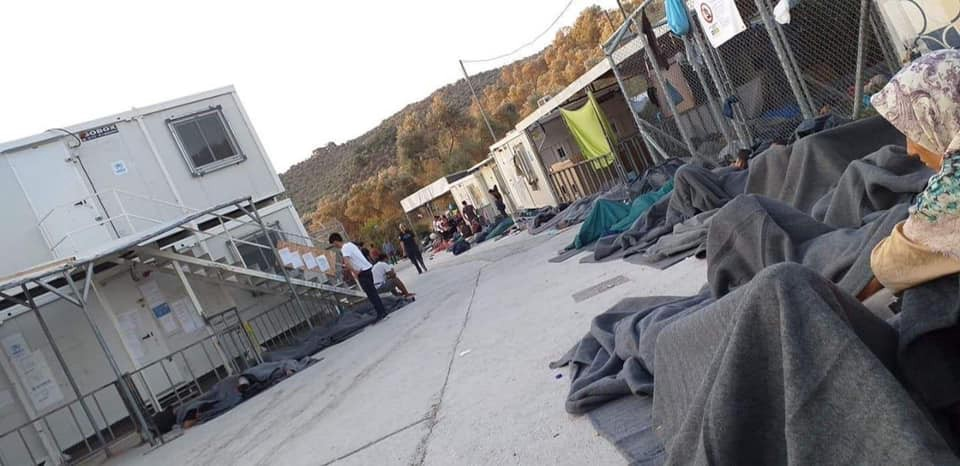
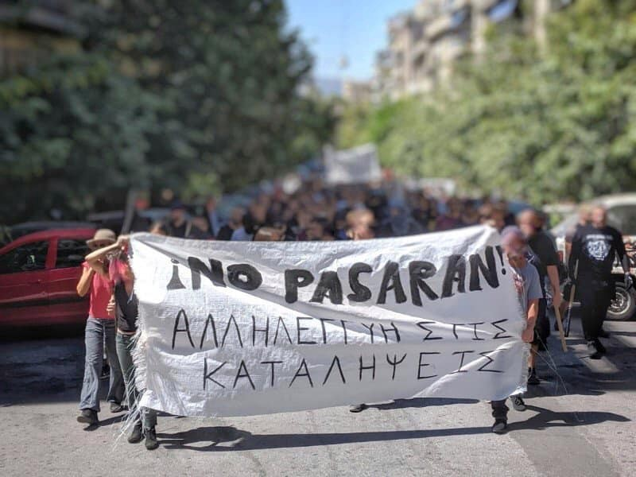
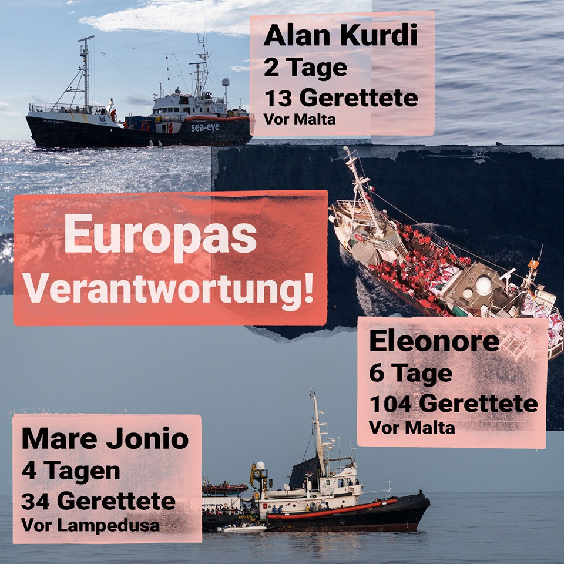

### AYS Daily Digest 31/8\- 1/9/19: New Measures in Greece do more bad than good
#### New measures in Greece // Conditions in Moria, Lesvos // Demonstrations in Exarchia, Athens // Shipwreck Canari Island: 25 people dead // News from Alan Kurdi, Eleonore, and Mare Jonio // Calls for support from France // Demonstration held in Ellebaek // Worrying situation in UK in case of no\-deal Brexit for unaccompanied minors

credit: Déguène and Aram Mbow
### FEATURE

On Saturday morning, an urgent meeting of the Government Council for Foreign Affairs and Defence was organized by the new Greek Prime Minister Kyrakos Mitsotakis\. In this meeting, a series of new measures was adopted with significant effects on the situation for refugees in Greece\. While some of the new measures can be seen as positive — like the decongestion of the hotspots, especially Moria on Lesvos; the transfer of some 366 unaccompanied minors into safer housing on the mainland or reunification with their families in other European countries; the transfer of 1002 highly vulnerable people from Lesvos to Nea Kavala \(Thessaloniki area\); and support for Lesvos medical staff — other new measures are highly disturbing\.

Not only will police controls for people with rejected asylum claims increase, but also the border surveillance will be radically expanded, in cooperation with FRONTEX, other European authorities and even NATO\. 
But the most dramatic changes will probably concern the new institutional framework of the asylum procedure\. In cases of rejected asylum applications, the second instance of reviewing appeals will be abolished\. The aim is to accelerate deportations\. According to RefuComm, Amnesty International Greece launched a statement of which the following is a part:

> _“Amnesty International is deeply concerned about today’s announcement by the Governmental Council on Foreign and Defense \(KYSEA\) that the second instance of reviewing appeals will be abolished, with the aim of — if the asylum application is rejected — to proceed immediately country from which it originated\. The reforms announced could undermine the legitimacy of the asylum procedure, and deprive asylum seekers and applicants of their right to effective protection, as guaranteed by Article 13 of the European Convention on Human Rights and Article 39 of the Asylum Directive\. Asylum Procedures\.“_ 

Other NGO’s and Human Rights activists also expressed their deepest concerns\.

More information:
### [Greece decides to decongest hotspots, change asylum procedures](greece-migrants-refugees-measures-kysea?source=post_page-----3dd9c0c6065----------------------)
### [The mass arrival of migrants and refugees on Lesvos two days ago, alerted the Greek government with Prime Minister…](greece-migrants-refugees-measures-kysea?source=post_page-----3dd9c0c6065----------------------)
#### [www\.keeptalkinggreece\.com](greece-migrants-refugees-measures-kysea?source=post_page-----3dd9c0c6065----------------------)
### GREECE

ONE PIECE OF GOOD NEWS FROM GREECE\! 
Finally, the problems of acquiring tax numbers \(ΑΦΜ\) for refugees seem to be solved\. According to Mobile Info Team, the Tax Office in Thessaloniki and the Asylum Office in Athens announced that from now on the tax numbers will be issued on the same day, if all documents are provided\. Before, people had to wait for months to get their tax numbers as they needed to be checked with the Asylum Office\. Tax numbers are necessary to rent houses, get employment or access state services\.
### [Brian Miller](?hc_location=ufi&source=post_page-----3dd9c0c6065----------------------)
### [GOOD NEWS: PROBLEMS WITH ΑFΜ \(GREEK TAX NUMBER\) FOR ASYLUM SEEKERS SOLVED Details in Arabic & English below in the…](?hc_location=ufi&source=post_page-----3dd9c0c6065----------------------)
#### [www\.facebook\.com](?hc_location=ufi&source=post_page-----3dd9c0c6065----------------------)
### Islands

News from the **Moria Camp on Lesvos** is getting worse every day, although one would think the worst was been reached a long time ago\. As the numbers of arrivals are increasing dramatically, new people have no shelter anymore in the overcrowded tents but instead have to sleep rough on the street\. Limited access to water, completely inadequate sanitary infrastructure, and long waiting queues for food distribution are still not solved\.

People sleeping on the street in Moria\. Photo credit: Refugee Support Aegean \(RSA\)

Movement on the Ground announced an emergency state for Moria:
### [Adil Izemrane](photo.php?fbid=2595556667132044&set=a.438639369490462&type=3&theater=&source=post_page-----3dd9c0c6065----------------------)
### [Emergency declaration for Moria Hotspot situation\. For the first time in the history of @Movement on the Groun we…](photo.php?fbid=2595556667132044&set=a.438639369490462&type=3&theater=&source=post_page-----3dd9c0c6065----------------------)
#### [www\.facebook\.com](photo.php?fbid=2595556667132044&set=a.438639369490462&type=3&theater=&source=post_page-----3dd9c0c6065----------------------)

An emergency needs list for Lesvos by Attika Human Support can be found here:
### [Attika Human Support](?hc_location=ufi&source=post_page-----3dd9c0c6065----------------------)
### [‼️EMERGENCY NEED LIST We need your help on getting these items as soon as possible to be able to cover the \#emergency…](?hc_location=ufi&source=post_page-----3dd9c0c6065----------------------)
#### [www\.facebook\.com](?hc_location=ufi&source=post_page-----3dd9c0c6065----------------------)

**Aegean Boat Report** has launched a new website\. Statistics and reports can be found there, but also a blog with more general news\.
### [Front page](?source=post_page-----3dd9c0c6065----------------------)
### [Aegean Boat Report is an independent Norwegian NGO, volunteer\-run media site, determined to provide neutral, detailed…](?source=post_page-----3dd9c0c6065----------------------)
#### [aegeanboatreport\.com](?source=post_page-----3dd9c0c6065----------------------)

On the weekend, 3 boats arrived in Lesvos carrying a total of 122 persons\.
### Mainland

In **Exarchia in Athens** demonstrations with 1500 to 2000 people were held against the evictions, raids and police attacks of the last days\.

Photo : Savvas Karmaniolas

This article gives a good insight into the situation in Exarchia after the new right wing government came into power\. Both as to the ideology of the new government and to the role of the police and to the interaction between the different anarchist groups and solidarities and refugees and immigrants\. The article also contains some good advice in regard to supporting the struggle in the area, and it has a section with links to further reading\.
### [The New War on Immigrants and Anarchists in Greece](the-new-war-on-immigrants-and-anarchists-in-greece-an-interview-with-an-anarchist-in-exarchia?fbclid=IwAR3hAL3PLFd9MoZi2hQBIF4Blf2tW-n4w2KRIr3CdpWhrpisyNo2SdEq3OI&source=post_page-----3dd9c0c6065----------------------)
### [Filled with squatted social centers and characterized by a combative anti\-authoritarian spirit, the neighborhood of…](the-new-war-on-immigrants-and-anarchists-in-greece-an-interview-with-an-anarchist-in-exarchia?fbclid=IwAR3hAL3PLFd9MoZi2hQBIF4Blf2tW-n4w2KRIr3CdpWhrpisyNo2SdEq3OI&source=post_page-----3dd9c0c6065----------------------)
#### [de\.crimethinc\.com](the-new-war-on-immigrants-and-anarchists-in-greece-an-interview-with-an-anarchist-in-exarchia?fbclid=IwAR3hAL3PLFd9MoZi2hQBIF4Blf2tW-n4w2KRIr3CdpWhrpisyNo2SdEq3OI&source=post_page-----3dd9c0c6065----------------------)

**Lifting Hands International** is looking for volunteers to conduct activities with Yazidi children in a summer camp during their school holidays\. The camp is about 1 hour away from Thessaloniki\.
### [Candace Thomas](?hc_location=ufi&source=post_page-----3dd9c0c6065----------------------)
### [SUMMER CAMP VOLUNTEERS NEEDED ASAP\! \* \*Lifting Hands International is looking for a Summer Camp volunteers \* \*to provide…](?hc_location=ufi&source=post_page-----3dd9c0c6065----------------------)
#### [www\.facebook\.com](?hc_location=ufi&source=post_page-----3dd9c0c6065----------------------)
### SEA

As Watch the Med — Alarmphone reports, a boat is thought to have been lost off the Canary Islands and 25 people are presumed dead\. 9 people may have been saved by the Moroccan Navy\. Another boat with 23 people was missing as of Saturday morning\. On Sunday morning, a boat with 23 people was transferred to Las Palma after being spotted by a freighter about 115 kilometres off Gran Canaria\. It had been at sea for about three days\. It has not been confirmed that this boat was the formerly missing boat\.

A boat carrying 10 people arrived at the coast of Alicante\.

On Friday 30th of August, 211 people were spotted by the Moroccan Navy in the Alboran Sea and transferred back to Morocco\.

The Sea\-Eye ship Alan Kurdi spotted in the early hours of Sunday morning a boat with 13 people in the Maltese SAR zone, amongst them 8 minors\. They are now aboard the Alan Kurdi\.

As for Sunday, the Eleonore was carrying 104 rescued persons and the Mare Jonio another 34\. Three of the 34 people on the Mare Jonio were allowed to disembark due to serious health conditions\.

Fotos: Nick Jaussi, seacoverage
### ITALY

In Trieste 55 people were arrested on August 29th and another 51 people on August 30th by Italian police\. Most of them are of Pakistani or Afghan background\. They all requested international protection\.
### [Rotta balcanica, rintracciati 51 richiedenti asilo a Dolina](dolina-rotta-balcanica-fermati-51-migranti-.html?source=post_page-----3dd9c0c6065----------------------)
### [Oggi il personale del Commissariato di San Sabba, della Polizia di Frontiera e i militari dell’Arma dei Carabinieri…](dolina-rotta-balcanica-fermati-51-migranti-.html?source=post_page-----3dd9c0c6065----------------------)
#### [www\.triesteprima\.it](dolina-rotta-balcanica-fermati-51-migranti-.html?source=post_page-----3dd9c0c6065----------------------)
### FRANCE

According to French media, 13 men were intercepted off the coast near Calais this Saturday while trying to cross the channel on a makeshift boat\. As we reported in the digest of 27/08/19 about twice as many people tried to cross the channel this year so far as in the whole of 2018\.

**Calls for support** 
Various groups in Paris call for support to continue their efforts of supporting refugees and migrants\. 
Un pas vers demain together with Paris d’Exile launched a crowd funder to help kids from families without financial support with school materials\.
### [Rentrée solidaire pour les enfants de migrants](rentree-solidaire-pour-les-enfants-de-migrants?fbclid=IwAR0MoWGRZBADyC885ucs8UPVSjPXH3Ku5-VfRabjHspiTvwLp34LTzhacZA&source=post_page-----3dd9c0c6065----------------------)
### [“L’éducation est le passeport vers le futur, car demain appartient a ceux qui le préparent aujourd’hui”\- Malcolm XUn…](rentree-solidaire-pour-les-enfants-de-migrants?fbclid=IwAR0MoWGRZBADyC885ucs8UPVSjPXH3Ku5-VfRabjHspiTvwLp34LTzhacZA&source=post_page-----3dd9c0c6065----------------------)
#### [www\.helloasso\.com](rentree-solidaire-pour-les-enfants-de-migrants?fbclid=IwAR0MoWGRZBADyC885ucs8UPVSjPXH3Ku5-VfRabjHspiTvwLp34LTzhacZA&source=post_page-----3dd9c0c6065----------------------)

Paris d’Exile Mineurs also calls for support in order to buy new public transport tickets for minors to allow them a safe passage to school\.
### [Paris d’Exil Mineurs \| HelloAsso](paris-d-exil-mineurs?fbclid=IwAR1upSZOTMGwxvxp4w_zfOITji2QKXgB096V725ti1AeNn7zO9u8b4lDcFQ&source=post_page-----3dd9c0c6065----------------------)
### [Paris d’Exil est une association qui milite pour l’accueil inconditionnel et digne de tous les exilé\.e\.s\. Notre pôle…](paris-d-exil-mineurs?fbclid=IwAR1upSZOTMGwxvxp4w_zfOITji2QKXgB096V725ti1AeNn7zO9u8b4lDcFQ&source=post_page-----3dd9c0c6065----------------------)
#### [www\.helloasso\.com](paris-d-exil-mineurs?fbclid=IwAR1upSZOTMGwxvxp4w_zfOITji2QKXgB096V725ti1AeNn7zO9u8b4lDcFQ&source=post_page-----3dd9c0c6065----------------------)

In Rennes, Association Bulles Solidaires is in urgent need of hygiene products to distribute amongst about 400 people who according to the organization were forced to live in the Parc des Gayeulles for several weeks because of a lack of proper accommodation\.
### [Association Bulles Solidaires](?type=3&__xts__%5B0%5D=68.ARD7KiJaWWdyg-bS1QRZb_f91lOH-hIqZ4Sdd0Unc7sFADydp0ae5J10yZcXZXH0Zk9v5OywadYe6RTd6TEtEWdn4EsAvjclfcr48qa0lb64dekVRPcj61gYKdUjaMJWI42r5EtojopD5HEHbNAjPTCEOhzDCyrhgNanRTgPcvJJLd5GHXrm9h4t5w_tzPiVA_KQM0J-K6OjqlNF34BPQhROmuBrH5V1Ukv2fUTgEkK_O-LnA8nIGETS3WqjdJxpvDVi84uXRnLX6xYE5jKID19HR-ZwpYGboA4mYvooFHBn_x3TF742MZg7qBchqVJmoNtvVL9D8R829ID_4pk9lzG7GGUrLIBXKYrb1TeDQAUucoIrIOHvgMRmo5xdPSRsWqtstLXOZpQUx0_X718wm2BSARY4YJj_Rdwdb2NT37YvIyyAQkFc_GoImspJ12URsN4rmJZfA1oLu_43ByU3eLwQxDqH7WI-bP4bc_7y0HFVVtZyp70KwHf1tA&__tn__=H-R&hc_location=ufi&source=post_page-----3dd9c0c6065----------------------)
### [URGENCE HUMANITAIRE Près de 400 personnes réfugiées sont forcé… es de camper depuis plusieurs semaines dans des…](?type=3&__xts__%5B0%5D=68.ARD7KiJaWWdyg-bS1QRZb_f91lOH-hIqZ4Sdd0Unc7sFADydp0ae5J10yZcXZXH0Zk9v5OywadYe6RTd6TEtEWdn4EsAvjclfcr48qa0lb64dekVRPcj61gYKdUjaMJWI42r5EtojopD5HEHbNAjPTCEOhzDCyrhgNanRTgPcvJJLd5GHXrm9h4t5w_tzPiVA_KQM0J-K6OjqlNF34BPQhROmuBrH5V1Ukv2fUTgEkK_O-LnA8nIGETS3WqjdJxpvDVi84uXRnLX6xYE5jKID19HR-ZwpYGboA4mYvooFHBn_x3TF742MZg7qBchqVJmoNtvVL9D8R829ID_4pk9lzG7GGUrLIBXKYrb1TeDQAUucoIrIOHvgMRmo5xdPSRsWqtstLXOZpQUx0_X718wm2BSARY4YJj_Rdwdb2NT37YvIyyAQkFc_GoImspJ12URsN4rmJZfA1oLu_43ByU3eLwQxDqH7WI-bP4bc_7y0HFVVtZyp70KwHf1tA&__tn__=H-R&hc_location=ufi&source=post_page-----3dd9c0c6065----------------------)
#### [www\.facebook\.com](?type=3&__xts__%5B0%5D=68.ARD7KiJaWWdyg-bS1QRZb_f91lOH-hIqZ4Sdd0Unc7sFADydp0ae5J10yZcXZXH0Zk9v5OywadYe6RTd6TEtEWdn4EsAvjclfcr48qa0lb64dekVRPcj61gYKdUjaMJWI42r5EtojopD5HEHbNAjPTCEOhzDCyrhgNanRTgPcvJJLd5GHXrm9h4t5w_tzPiVA_KQM0J-K6OjqlNF34BPQhROmuBrH5V1Ukv2fUTgEkK_O-LnA8nIGETS3WqjdJxpvDVi84uXRnLX6xYE5jKID19HR-ZwpYGboA4mYvooFHBn_x3TF742MZg7qBchqVJmoNtvVL9D8R829ID_4pk9lzG7GGUrLIBXKYrb1TeDQAUucoIrIOHvgMRmo5xdPSRsWqtstLXOZpQUx0_X718wm2BSARY4YJj_Rdwdb2NT37YvIyyAQkFc_GoImspJ12URsN4rmJZfA1oLu_43ByU3eLwQxDqH7WI-bP4bc_7y0HFVVtZyp70KwHf1tA&__tn__=H-R&hc_location=ufi&source=post_page-----3dd9c0c6065----------------------)
### DENMARK

Demonstrations in front of the Ellebæk detention center, organized by the initiative Luk Ellebæk — Close Ellebæk, were held this weekend\. The participants called for the closure of Ellebaek and proclaimed their support and solidarity to the inmates\. On Sunday morning however, the Danish prison service Kriminalforsorgen pressured them to leave the area before time:

> _“Kriminalforsorgen \(the danish prison service\) pressured us away from Ellebæk by removing the inmates rights to visits and blaming it on us even though our protest was peaceful, legal and approved by the police\.”_ 

credits: Luk Ellebæk — Close Ellebæk

The group gathered again in Copenhagen in front of the Kriminalforsorgen head office and continued demonstrating there\.
### UK

Worrying news from the UK in the case of a no\-deal Brexit, reported by the Guardian\.

> _“The Home Office is preparing to end the current system of family reunification for asylum\-seeking children if the UK leaves the EU without a deal, the Guardian has learned\._ 
 

> _The government has privately briefed the UN refugee agency UNHCR and other NGOs that open cases may be able to progress, but a no\-deal Brexit would mean no new applications after 1 November from asylum\-seeking children to be reunited with relatives living in the UK\. Even if there is a deal, the future of family reunion is not certain\.”_ 

The full article can be found here:
### [Home Office planning to end family reunion for children after Brexit](home-office-planning-to-end-family-reunion-for-children-after-brexit?CMP=Share_iOSApp_Other&fbclid=IwAR2cWsQL7bk5yGQmKn041y12dnwFr_pu3wlPhwieWOV81Ku0vtQIBzRUTw0&source=post_page-----3dd9c0c6065----------------------)
### [The Home Office is preparing to end the current system of family reunification for asylum\-seeking children if the UK…](home-office-planning-to-end-family-reunion-for-children-after-brexit?CMP=Share_iOSApp_Other&fbclid=IwAR2cWsQL7bk5yGQmKn041y12dnwFr_pu3wlPhwieWOV81Ku0vtQIBzRUTw0&source=post_page-----3dd9c0c6065----------------------)
#### [www\.theguardian\.com](home-office-planning-to-end-family-reunion-for-children-after-brexit?CMP=Share_iOSApp_Other&fbclid=IwAR2cWsQL7bk5yGQmKn041y12dnwFr_pu3wlPhwieWOV81Ku0vtQIBzRUTw0&source=post_page-----3dd9c0c6065----------------------)
### SWEDEN

In reaction to the worsening conditions on Lesvos, Team Sweden Volunteers want to send some already packed pallets that were originally scheduled for Athens directly to the island\. As deliveries to the islands are more expensive, Team Sweden Volunteers is asking for donations to finance the delivery as soon as possible\.
### NORWAY

In the Norwegian election campaign, xenophobe slogans are used by the right\-wing party Fremskrittspartiet \(The Progress Party\) \. The slogan of a current poster is “Simplifying The Day — Norway Will Not Accept Boat Migrants”\.

Read more about it on the new website of Aegean Boat Report:
### [“Simplifying The Day — Norway Will Not Accept Boat Migrants”](?fbclid=IwAR09cOfTAWqMHUwoNyGx0GozkQJLuputOXFp9Fs52-VWY-uWaZs6HbqRX8g&source=post_page-----3dd9c0c6065----------------------)
### [“Simplifying The Day — Norway Will Not Accept Boat Migrants” is now being used as a slogan for the Norwegian right\-wing…](?fbclid=IwAR09cOfTAWqMHUwoNyGx0GozkQJLuputOXFp9Fs52-VWY-uWaZs6HbqRX8g&source=post_page-----3dd9c0c6065----------------------)
#### [aegeanboatreport\.com](?fbclid=IwAR09cOfTAWqMHUwoNyGx0GozkQJLuputOXFp9Fs52-VWY-uWaZs6HbqRX8g&source=post_page-----3dd9c0c6065----------------------)

**We strive to echo correct news from the ground through collaboration and fairness\. Every effort has been made to credit organisations and individuals with regard to the supply of information, video, and photo material \(in cases where the source wanted to be accredited\) \. Please notify us regarding corrections\.**

**Apart from daily news in English, we also publish weekly summaries in Arabic and Persian\. Find specials in both languages on our [medium site](https://medium.com/are-you-syrious/ays-weekly-in-arabic-and-persian/home?source=post_page---------------------------) \.**

**If there’s anything you want to share or comment, contact us through Facebook, Twitter or write to: areyousyrious@gmail\.com\.**
### [Are You Syrious?](https://medium.com/are-you-syrious?source=post_sidebar--------------------------post_sidebar-)
#### Daily news digests from the field, mainly for volunteers and refugees on the route, but also for journalists and other parties\.

_Converted [Medium Post](https://medium.com/are-you-syrious/ays-daily-digest-31-8-1-9-19-new-measures-in-greece-do-more-bad-than-good-395ac1d3a1ba) by [ZMediumToMarkdown](https://github.com/ZhgChgLi/ZMediumToMarkdown)._
