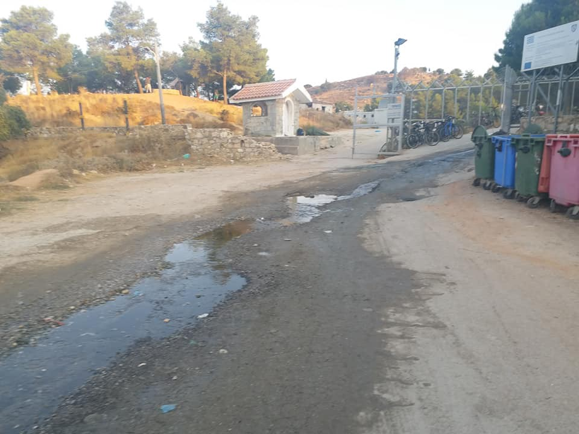
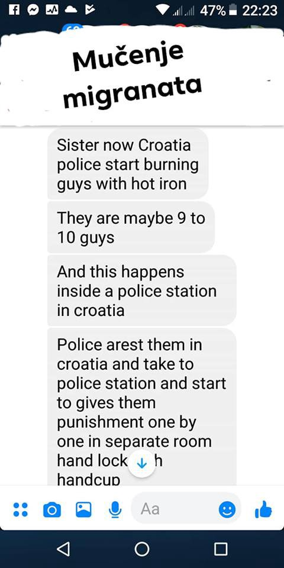

### AYS Daily Digest 4/9/2019 — Attacked on Every Front: the Rights of Refugees in Greece

Maltese government asks Sea\-Eye crew to carry out identification of the people they rescued /// New brutal methods of Croatian police revealed /// Moroccan and Spanish interior ministers meet to strengthen migration policy

 \(2018\)](assets/56889698459b/1*rSvT236CkpNWUi9yXgzjXQ.jpeg)

Collective memory is always short\-range — Artwork by [Augusto Salles](https://twitter.com/sallesino) \(2018\)
### FEATURE — Attacked on Every Front: the Rights of Refugees in Greece
#### Widespread racism

In the increasingly racist climate that surrounds migrants and refugees in Greece, where verbal abuse and physical attacks have become a sad but frequent occurrence over the last month, a member of Neo Demokratia, Theodoros Giannaros, [has insulted on Arash Hampay](https://www.keeptalkinggreece.com/2019/09/04/refugee-monkey-new-democracy-yiannaros/) on social media, a refugee and activist in Athens, calling him a monkey and telling him that he will be kicked back to where he came from\. After the comment was widely criticised on the internet, Neo Democratia expelled Giannaros on Wednesday afternoon\.
#### Institutional racism

The government however is continuing its actions in curtailing the rights of refugees and reducing space for their autonomy and freedom\. Several criticisms followed the decision to abolish the second\-level appeal for asylum application\. The decision was announced on 31 August, but has not yet come into effect\. Legal Centre Lesvos [published a press release expressing serious concerns](https://www.facebook.com/LesvosLegal/photos/a.1152003994838312/2602340806471283/?type=1&theater) , as this abolition means that “if an asylum application is rejected, they will proceed immediately with the return of the applicant to their country of origin”\. This would also produce a lack of transparency and protection against the arbitrary decisions of asylum commissions, which will become definitive\.

> This announced reform undermines the legitimacy of the asylum process and deprives asylum seekers of their right to effective protection, which is guaranteed by Article 13 of the European Convention on Human Rights and Article 39 of the Asylum Procedures Directive\. 

Legal Centre Lesvos states that this is only the last step in a “pattern of gross violations of the rights of asylum seekers in Greece”\.

> These violations include the conduct of interviews by EASO \(European Asylum Service\) with clearly specified lines of authority to reject applications on completely unjustified grounds, with unsubstantiated judgments about the credibility of asylum seekers, alongside significant errors in interpretation throughout the asylum interview\. Those of us who have been accompanying individuals through the asylum process know how many mistakes can be made in this process and how dangerous it is to reform a procedure by removing the ability to challenge wrong decisions\. 

Also the Union of Administrative Judges [expressed their opposition to the decision](https://www.efsyn.gr/ellada/dikaiosyni/209435_antithetoi-oi-dioikitikoi-dikastes-stin-katargisi-ton-deyterobathmion?fbclid=IwAR1hLUURfx6LwWjaWo2THmG850VWP59zNc4Q73wPUkvY4OoJpCVyVn2k3xg) \.

Point\-by\-point, they contested the government’s statement in support of the abolition\. The Union stated that the operations of second\-instance committees have proved successful\. “After all, the purpose of the asylum system should be to protect the rights of asylum seekers”\. The abolition will also produce an even greater contraction of refugee rights, which “is contrary to the provisions of international humanitarian law and European law”\. Furthermore, any transfer of these cases directly to the Administrative Courts “will aggravate the situation as they, with their current staffing of judges and civil servants, will have an undue burden on the speed and efficiency of their overall operation”\.

The Union concluded that the government “ **shall not seek to cover up the weaknesses in the application of the current system by abolishing the rights of refugees”** \.
#### More riot police in Exarchia

But the track\-record of the government in this first two months in charge does not inspire any trust in a change in direction\. Continuing its attack on “public enemy no\.1” — the neighborhood of Exarchia, in Athens — it has been [reported](http://www.ekathimerini.com/244186/article/ekathimerini/news/plans-to-move-scores-more-riot-police-to-exarchia-area?fbclid=IwAR0f1_K9_a5bKSvu0UTgSgcM7oCZfJmQ8hac7FMRLWwHAxGndUgm3r0xZVs) that in the coming weeks 220 officers will be moved from their positions in various police stations to riot police duty in Exarchia\. Several officers have appealed this decision and the transfer will only take place once their appeals have be heard\.
#### Misappropriation of funds

The “crisis” for refugees in Greece began long before the general elections held in July\. Since 2016 a series of articles from the British newspaper _The Guardian_ , titled “ [Secret Aid Worker](https://www.theguardian.com/global-development-professionals-network/2016/sep/13/secret-aid-worker-greece-has-exposed-the-aid-communitys-failures) _”_ , pointed out that the Greek state, the EU and the aid community had all the financial and context\-based requirements needed for supporting refugees and yet they have failed to do so\. In 2018 _Politico_ revealed that the EU Anti\-Fraud Agency \(OLAF\) was [investigating](https://www.politico.eu/article/eu-watchdog-probes-possible-misuse-of-refugee-funds-in-greece/?fbclid=IwAR1P1U4rsOo3B9KKmx750mNxjiVvZd7TMJgKnx5ru849QZ5iheyjPUsBwZc) the potential misuse of EU funds meant to provide food for refugees in Greece\. At the same time three Greek journalists were arrested for publishing an article in which they advanced similar accusations\.

While OLAF’s investigation is still ongoing, _Protagon_ , a Greek media website, [revealed](https://www.protagon.gr/themata/kolpo-ekatommyriwn-me-ta-syssitia-twn-prosfygwn-44341721456) the results of their research on the continuous discrepancy between government and UNHCR data regarding food needs and provision for refugees in Greek camps\. Since 2017, the article reports, the government’s data was inflated in the range of 50% to100%:

> The huge discrepancies between the number of guests and portions, combined with being systematically tracked from 2017 onwards, are a strong indication that caps on food volumes were a method of mismanaging European money that was probably intended to enrich those involved\. 

#### The situation in the camps

A shameful use of numbers and data to support criminal government policies is widespread throughout the whole continent, and beyond\. Turkish interior minister, Suleyman Soylu, has recently [criticised](https://www.keeptalkinggreece.com/2019/09/04/turkey-eu-greece-migration/) the EU for not caring enough about Turkey and refuted recent claims about an increase in the number of people arriving from Turkey to the Greek islands\. Soylu pointed out that in the first eight months of 2019 there was a 6% drop in arrivals from Turkey\. This number fails to disclose that in July and August arrivals were well above those of 2018 \( \+10% in July and \+30% in August, Source: [Aegean Boat Report](https://aegeanboatreport.com/monthly-reports/) \) \.

As well\-described by Refugee Support Aegean \(RSA\), in [only one month arrivals exceeded the total capacity of all facilities on the island](https://twitter.com/rspaegean/status/1169312013635469312) \. Political discourse on numbers risks concealing the \(in\)humane face of the policies they support:

■■■■■■■■■■■■■■ 
> **[RSA](https://twitter.com/rspaegean) @ Twitter Says:** 

> > Political choices continue to condemn refugees in inhuman conditions on the Aegean islands #refugeesGR #stopthetoxicdeal #opentheislands https://t.co/ZivUqYI33T 

> **Tweeted at [2019-09-04 18:08:57](https://twitter.com/rspaegean/status/1169311399719460866).** 

■■■■■■■■■■■■■■ 

At the beginning of September 1,500 people were transferred from Lesvos to the mainland \(see yesterday’s digest for more details\) \. On Wednesday 3 August, a group of 300 minors protested against the overcrowding of Moria and asked to be transferred to the mainland as well\. They occupied the gates of the camp and the road leading to it for a few hours\. Greek police responded by teargassing the teenagers\.

On the islands and on the mainland conditions of the camps are dismal, and worsened by the planned overcrowding\.

On Kos island:

 , [Kos Solidarity Volunteers](https://www.facebook.com/groups/458835327636156/) \)](assets/56889698459b/1*jZm0HutZzMiF4erj6iYXYw.jpeg)

Kos \(photo by: [عكرمة ابراهيم](https://www.facebook.com/profile.php?id=100035013870173&fref=gs&__tn__=%2CdC-R-R&eid=ARBE_qxBd77szPxszdqDewRcejt4Lg1WKBr3NjCA34WHDqgHoE4jktflPWFG_qkqMbcI8KnA1wglnggW&hc_ref=ARSanAVlgU01Sa-dWodIOddMVxUl2g9oJ7ciue5Plzht5_O_VDnW2bap8XK1dC5-pgo&dti=458835327636156&hc_location=group) , [Kos Solidarity Volunteers](https://www.facebook.com/groups/458835327636156/) \)

An [article was recently published by a former resident of Nea Kevala](https://www.globalresearch.ca/nea-kavala-camp-hell-northern-greece/5687931) , where around 1,000 people were transferred from Moria\.

> It is HELL\. 

> It is CRUEL 

> It is SH\. \.IT 

> If I had known what was waiting in this desolate camp in northern Greece I would not have moved\. They would have had to carry me there by force\. But I knew nothing of this camp\. They told me nothing\. They never asked me if I wanted to move\. 

> When you are held on the islands like Samos you get the idea that the mainland is a better place to be\. They say this a lot on Samos\. The mainland has better resources and facilities than the island\. This is what we hear\. 

> As I quickly learned **THIS IS NOT TRUE AT ALL** \. And yes, I want to shout this out\. Please listen\. 

Read the full article [HERE](https://www.globalresearch.ca/nea-kavala-camp-hell-northern-greece/5687931) \.

It is also [reported](https://www.lamiafm1.gr/%CE%AD%CE%BA%CF%81%CF%85%CE%B8%CE%BC%CE%B7-%CE%B7-%CE%BA%CE%B1%CF%84%CE%AC%CF%83%CF%84%CE%B1%CF%83%CE%B7-%CF%83%CF%84%CE%BF%CE%BD-%CE%BA%CE%B1%CF%81%CE%B1%CE%B2%CF%8C%CE%BC%CF%85%CE%BB%CE%BF/?fbclid=IwAR0vETSL4vMbI_HsE1osrUuHSUOQGPGctlYDTDiq5iFrRkKPkczknML38jc) that a group of locals in Karavomylos Stylida, near Lamia, are opposing the preparation of an old campsite for hosting 160–200 refugees from Moria\.

LIBYA

Address Libya [report](http://www.addresslibya.com/en/archives/50156?fbclid=IwAR01RvY2pdykOIuPQII645dZK1BwvQt9IXLEri8ylJl3CGePanAMg2RSAYY) that the UNHCR described its Gathering & Departure Facility \(GDF\) in Tripoli as severely overcrowded and appealed for third countries to take in more refugees\. The GDF hosts the most vulnerable people, and it is currently housing 1,000 people, despite a capacity of only 700 places\.

The GDF was set up in December 2018, and since July 2019 is hosting 400 people who survived the airstrike on the Tajoura detention centre\.

MOROCCO

AMDH Nador [report](https://www.facebook.com/AmdhNador/photos/a.1693125780899690/2406450332900561/?type=3&theater) s about the meeting between the Moroccan and Spanish interior ministers in Rabat\.

> They want to strengthen further what they call border control\. Which means more violations, more arrests, more refoulements and more repression\. Of course no words about the dead, the injured and about the suffering of migrants in the forests\.
 

> If the implementation of this repressive policy has already started in Nador with the mobilisation of the military, it is our duty, the duty of all the activist associations to continue to denounce these Moroccan\-Spanish agreements and to show their real inhuman face inhuman\. 

SEA
#### Responsibility is not a light switch

Four years after the death of Alan Kurdi on the shores of Bodrum, Turkey, the rescue vessel that adopted his name is still at sea waiting for a safe port, with 13 people on board\.

This is a message from the Sea\-Eye’s head of mission to the Maltese Prime Minister:

The video reveals the hypocrisy of the Maltese government who initially accepted responsibility for the people on the Alan Kurdi, only to deny it a few hours later\.

Even more worrisome, it reveals an attempt to co\-opt the rescue organisation by asking for their participation in the EU border regime and passport control, demanding the Sea\-Eye crew to carry out identification procedures of the people rescued\.

Europa Press [report](https://twitter.com/EPAndalucia/status/1169292734022279169?fbclid=IwAR0CQVGCj1aNG66zg9BBb1Lc4j_Zm6p5iu_mjbls10JBi5tXBKdq6C-VCa0) that a dinghy with 60 people were intercepted in the Alboran Sea by the Moroccan Navy and brought back to the north African country\.

ITALY

**Mediterranea filed a complaint against the seizure of the Mare Jonio vessel**

On 4 September 2019 Mediterranea — Saving Humans [filed a complaint](https://mediterranearescue.org/en/news-en/seven-days-of-violations-omissions-and-abuses-mediterraneas-complaint-to-the-public-prosecutors-office/?fbclid=IwAR0gghm_k-_ETcZKLO_vAaOxQHpwKxlLy4STvKbc5YBLtFGHl_qIqhaftNE) with the Court of Agrigento, Sicily and with the Public Prosecutor of Rome\. In the complaint they offer a “detailed reconstruction of all the events that took place since the dawn of 28 August, when the Mare Jonio rescued 98 people, including 22 small children, at risk of death on an overcrowded raft, until the early hours of 3 September, when their commander and their shipowner were absurdly notified with the administrative seizure of the Mare Jonio and a fine of €300,000 for violating the ban on entry into Italian territorial waters, despite having formally been authorised by the competent authorities\.”

Read more [HERE](https://mediterranearescue.org/en/news-en/seven-days-of-violations-omissions-and-abuses-mediterraneas-complaint-to-the-public-prosecutors-office/?fbclid=IwAR0gghm_k-_ETcZKLO_vAaOxQHpwKxlLy4STvKbc5YBLtFGHl_qIqhaftNE) \.

SPAIN

UNHCR published their weekly snapshot for Spain:

“Last week \(26 August–1 September\) 1,008 people arrived in Spain, totaling 19,782 in 2019 \(43% less than in 2018\) \.

■■■■■■■■■■■■■■ 
> **[ACNUR España](https://twitter.com/ACNURspain) @ Twitter Says:** 

> > La pasada semana (26 agosto-1 septiembre) llegaron a España 1.008 personas, sumando un total de 19.782 en 2019 (43% menos que en 2018).
Consulta nuestro último informe semanal de llegadas a España.👇
[ow.ly/iXED50vVWlg](http://ow.ly/iXED50vVWlg) https://t.co/w1iXtpkl0z 

> **Tweeted at [2019-09-04 09:57:47](https://twitter.com/acnurspain/status/1169187795547688960).** 

■■■■■■■■■■■■■■ 

CROATIA

The group [Udruženje Solidarnost — Bosnia](https://www.facebook.com/solidarnostbosnia/) published a conversation with a victim of police brutality in Croatia, which reveals the cruel methods of the Croatian police:

](assets/56889698459b/1*boy849hot4HZQ9zYmYv6qw.jpeg)

[Udruženje Solidarnost — Bosnia](https://www.facebook.com/solidarnostbosnia/photos/pcb.2918216744856158/2918216591522840/?type=3&theater)

FRANCE

ICELAND

[Refugees in Iceland](https://www.facebook.com/refugeesiniceland) have made a poster showing ways in which you can support Refugees in Iceland\. We are now happy to share it with you and hope people don’t forget the struggle is still on\.

](assets/56889698459b/1*ruJ4oHP0uAcMihcJ0_Fezg.jpeg)

[Refugees in Iceland](https://www.facebook.com/refugeesiniceland/photos/a.345171279429532/435818123698180/?type=3&theater)

**We strive to echo correct news from the ground through collaboration and fairness\. Every effort has been made to credit organisations and individuals with regard to the supply of information, video, and photo material \(in cases where the source wanted to be accredited\) \. Please notify us regarding corrections\.**

**Apart from daily news in English, we also publish weekly summaries in Arabic and Persian\. Find specials in both languages on our [medium site](https://medium.com/are-you-syrious/ays-weekly-in-arabic-and-persian/home?source=post_page---------------------------) \.**

**If there’s anything you want to share or comment, contact us through Facebook, Twitter or write to: areyousyrious@gmail\.com\.**

_Converted [Medium Post](https://medium.com/are-you-syrious/ays-daily-digest-4-9-2019-attacked-on-every-front-the-rights-of-refugees-in-greece-56889698459b) by [ZMediumToMarkdown](https://github.com/ZhgChgLi/ZMediumToMarkdown)._
