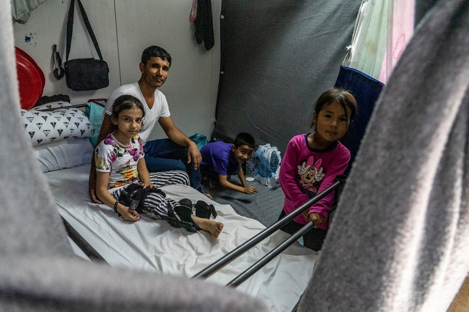

### AYS Daily Digest 06\.09\.2019: Two Thousand Police Brought out of Retirement to “secure” Croatia
#### Approximately 142 people arrived in Greece today// Turkish man illegally detained in pre\-deportation centre in Italy// 3 people on Alan Kurdi allowed to disembark on Malta//Court in the Netherlands suspends the deportation of two people to Romania…

Credit: Anna Pantelia
#### FEATURE

The Croatian Ministry of the Interior is re\-introducing 2000 retired officers to duty in order to “manage” migration\.

For the first time after the war in Croatia in the 1990’s, the Croatian Ministry of the Interior is re\-introducing 2000 retired police officers into service\. Auxiliary units are needed in the context of migration, entry into the Schengen area and preparations for the Croatian EU presidency, the Minister of the Interior Davor Božinović said in a short statement to Croatian media\.

Seeing as the EU Presidency was recently previously hosted in Bulgaria, which is renowned for its abuse and terrorizing of people on the move, it is no surprise that the anti\-migration Croatian government is taking this approach\. Another possible contributing factor that the Minister of the Interior is perhaps leaving out of the story is the possible need to reinforce the ranks of police officers due to the possible refusal of members of the police force to participate\. As regular readers can remember, the Croatian Ombudswoman published an anonymized letter sent to her by members of the police force in rural Croatia describing their horror at the systematic terrorizing of people crossing into Croatia\. A programme of horror that the Croatian government alternates between flat out denying and then justifying, depending on the weather\. The letter specifically describes how police officers are repeatedly brought from other counties and locations as their “freshness” at the position and distance from the site of the crime emboldens them\. However, we wonder how long this cycle can last\.

Is it possible that in addition to the causes referenced by the minister of the interior, that the need to call in more police has to do with dissention in the ranks? A crucial component of this story has to do with the public image of the police in Croatia\. Due to the role of the police in the Croatian war for independence, the institution has long been held in high regard\. [This is part of why the letter to the Ombudswoman of Croatia was such a noticeable development](https://twitter.com/CGTNOfficial/status/1168931664791252995) \. When reports of police abuse and violence were first surfacing as early as 2016, the initial public response was that of denial — that it was impossible that members of an institution so revered would participate in such brutality\. Then an intensive publicity campaign of demonization of people on the move was enacted slowly but surely in order to pave the way to transition from the denial of abuse, to the endorsement of it\. “Well, perhaps ‘our boys’ were doing harsh things, but it’s entirely merited in this case\.”

The leveraging of the very real EU requirements upon Croatia to “secure” its extensive border in order to gain Schengen membership has also been a key component of this campaign\. The letter from within the police force appealed to the fact that there were members of this institution who recognized the incomprehensible brutality that is ongoing\. “This is not what we signed up to do\.”\*

Within a week of the letter to the Ombudsman, another anonymous letter from a member of the police was released and published in Croatian media, from someone whose post was in a reception centre, thoroughly demonizing the residents of the centre\. Fighting fire with fire is clearly the game\. And it will only intensify, with the goal of fragmenting society and coalescing support for the powerful police institution in Croatia\.

It should be known that these kinds of testimonies and this commentary is not meant to indicate that the author of the piece is eager to justify police or erase the systemic violence of the institution as a whole\. Similar testimony by ICE agents has been published in the United States, and the author is aware that this risks opening the Pandora’s box of: ‘but what about the good apples’ in an overwhelmingly violent and oppressive structure\. What is intended in this commentary is to position the tit for tat and contextualize it in the public discourse\.
#### GREECE

Neo\-nazi Golden Dawn might be out of the Greek parliament, but the chairman of the new far\-right nationalist party, Elliniki Lysi \(The Greek Solution\), now argues that the [Greek government should send the refugees and migrants in the country to unihabited islands](https://thepressproject.gr/o-velopoulos-zita-na-staloun-prosfyges-ke-metanastes-sta-xeronisia/?fbclid=IwAR0oXWjG1M0nAVwBndLIob9jATCB5QHd-P0U7SlqSffosaSq0YQaS9AxFRc) to avoid social problems such as “rape, pedophilia, or even harassment\.”
He also emphasized that benefits to Afghan and Pakistani migrants and refugees should be terminated\.

UNHCR has now published its report on accommodation solutions provided as part of the ESTIA programm\.

By the end of August, 25,404 places in accommodation were available in 4,457 different buildings/apartments\.

> 21,616 people were accommodated as of the end of August 2019, \[…\] \. 50% of the residents are children\. The clear majority of those accommodated are families, with the average family size of five people\. 

Of the people accommodated, 17% have either serious medical conditions, are single parents or suffer from disabilities\.

Read more [here](https://reliefweb.int/sites/reliefweb.int/files/resources/71207.pdf) \.

**_Islands_**

Six boats, carrying approximately 142 people, have reached Greek coasts today\.

For a complete breakdown, read [here](https://www.facebook.com/AegeanBoatReport/photos/a.285312485325196/644298006093307/?type=1&theater) \.

Anna Pantelia reports [the story of Fatima](https://www.facebook.com/nobordersnetwork/posts/2460287214039156?hc_location=ufi) , a nine\-year\-old girl from Afghanistan, trapped now in Moria with her family:

> Fatima is 9 years old and she can’t walk\. 

> She is one of the 100 complex and chronic cases that MSF doctors in Moria paediatric clinic have referred to the local hospital for further examination and treatment since the beginning of July\. 

> “In 2015, a bomb exploded in the street where our house was\. My four\-year\-old son died and Fatima — who was outside at the time of the explosion — was thrown to the other side of the road by the blast\. Since then she has had surgery three times in Afghanistan, but we decided to leave the country to look for better treatment for her,” says Fatima’s father\. 

> A month after the explosion the family managed to enter Turkey, where they stayed for another three years before deciding to begin the dangerous journey to Greece\. “In Turkey my daughter was operated on again, but Turkish doctors told us that there was a problem with her spinal cord and there was nothing else they could do\. We had no option but to come here,” he continues\. 

> Now, in Moria camp, Fatima’s family of six is forced to live in a shipping container that they share with 11 other people\. The space where the family lives is just 4 m²; the only thing separating their space from four other families are some blankets\. 

> As Fatima cannot walk, her father has to carry her around whenever she needs to move\. Her father also told the MSF doctor that she often cries at night and has become very isolated from their other children\. 

One of the many children \(a lot of them unaccompanied\) who are now still stuck in the infamous camp\.

■■■■■■■■■■■■■■ 
> **[RSA](https://twitter.com/rspaegean) @ Twitter Says:** 

> > In July and August, 73 children were referred to @[MSFgreece](https://twitter.com/MSFgreece) teams in #Lesbos: three had attempted suicide and 17 had self-injuries. Ten of the 73 children were under the age of six, the youngest was just two. #stopethetoxicdeal #opentheislands #RefugeesGR
[lesvosnews.net/articles/news-…](https://www.lesvosnews.net/articles/news-categories/koinonia/3-apopeires-aytoktonias-kai-17-aytotraymatismoi-paidion-sti-lesbo?fbclid=IwAR2jpUoYbpnNf6qaDArlJeotkFeEALMaJAIHOJvW35pDkbwvjJ5M29A9Cgs) 

> **Tweeted at [2019-09-06 16:22:16](https://twitter.com/rspaegean/status/1170009327761055746).** 

■■■■■■■■■■■■■■ 

#### ITALY

A man from Turkey is being illegally detained in the CPR \(Centro Permanente Rimpatrio — Permanent pre\-deportation centre\) of Torino and has been on hunger strike for five days now to denounce his situation\.

After he was stopped in Piacenza two months ago, he was brought to the centre and was not offered the services of a lawyer nor an interpreter, before being forced to sign documents in Italian\.

The man was allegedly pushed to apply for asylum in Italy, against his will, under the threat of being deported back to Turkey\.

The judge decided very quickly to keep the man inside the centre even though he did provide a valid residency address, where he could have spent the period of his asylum procedure\.

He did not receive any information concerning the length of his imprisonment, which can apparently vary between 6 and 12 months\.

To protest against his illegal detention, Deniz Resit Pinaroglu started a hunger strike on 1st September, also condemning the inhuman conditions where people are forced to live: with dirty bathrooms and dining areas, which, according to him, are one single area\. For a whole month, Deniz and other prisoners were forced to eat dry chicken and cold pasta\.

Psychological pressure, mainly due to the living conditions and the uncertainty of their cases, drives people to hurt themselves and suffer from panic attacks\.

The phones’ cameras were broken on day one of their imprisonment\.

Deniz declares he will be on hunger strike until institutions move to change his situation and pay attention to the human rights violations occurring in the centre\.

Source [here](https://www.facebook.com/Blackpost2/posts/385142848840989) \.
#### SEA

After three of the thirteen people rescued by the Alan Kurdi showed signs of severe mental distress, with one minor attempting to jump overboard to commit suicide, [these three were allowed to be brought to Malta](https://timesofmalta.com/articles/view/three-evacuated-from-rescue-ship-after-child-tries-to-jump-overboard.733546) \.

Furthermore, the President of the EU Parliament officially decried the closing of ports to rescue ships, taking an overt swipe at Salvini’s ongoing war on SAR operations — first closing ports, and then additionally fining SAR ships if they are brought to port\. Additionally Juncker highlighted that Dublin reform, a long\-time point of contention across the EU, would be a high priority in the future\. Read more [here](https://www.infomigrants.net/en/post/19319/ports-cannot-be-closed-says-eu-parliament-president) \.
#### THE NETHERLANDS

A court in the Netherlands has officially overturned the impending return of a man and his brother \(a minor\) who were set to be readmitted to Romania\. The two had travelled from Iraq to Romania, where they were held in horrific detention conditions\. As their fingerprints were documented in Romania, they were set to be returned from the Netherlands to Romania under the Dublin agreement, first the man, and then, considering him “legally present” in Romania, Dutch immigration would send his brother as well\. However the court ruled that “legally present” refers to temporary or permanent residency in a country, not to applicants of subsidiary protection\. Additionally, as separation of the two would cause considerable harm to the child, the court ruled that they would suspend the return until an examination of the “best interest of the child” would be taken into consideration\.

Source: ECRE
#### OTHER

Longtime volunteer Martin Kvernbekk is helping with a new project — going West\. In his post he writes:

“ Exactly two weeks from now i will be leaving to the Colombia/Venezuela border\. I will meet up with a friend that volunteered with us in Lebanon\. Bethani King has just started a small organization called [\#onthegroundinternational](https://www.facebook.com/hashtag/onthegroundinternational?source=feed_text&epa=HASHTAG) \. My aim is to provide support with organizational development and strategy\. We hope to set up a system similar to what we did in Lebanon\. Utilize volunteers and cover the gaps\. For this task I will need my entire network of support\. We will organize the basics and ensure security before we open up for other volunteers to join\. Read up on background and donation information here: [https://www\.onthegroundnow\.org](https://www.onthegroundnow.org/?fbclid=IwAR0ctkPsi9KU02gi2qLe1ZF4B0zz6bB-tR10MqlU1a9kuJvu6BMJa5Jl5Ew)

The situation in Venezuela is dire\. They are not running from bombs but from political violence, unimaginable crime rates and slow death by starvation\. The hyper inflation has sent millions fleeing into Colombia, which is already struggling with seven million internally displaced, the FARC guerillas and drug cartels, etc\. \.”

We can’t stop — the number of people displaced globally is only going to increase\.

Please consider supporting this new project [here](https://www.facebook.com/kvernbekk/posts/10162672546220657) \.

**We strive to echo correct news from the ground through collaboration and fairness\. Every effort has been made to credit organisations and individuals with regard to the supply of information, video, and photo material \(in cases where the source wanted to be accredited\) \. Please notify us regarding corrections\.**

**Apart from daily news in English, we also publish weekly summaries in Arabic and Persian\. Find specials in both languages on our [medium site](https://medium.com/are-you-syrious/ays-weekly-in-arabic-and-persian/home?source=post_page---------------------------) \.**

**If there’s anything you want to share or comment, contact us through Facebook, Twitter or write to: areyousyrious@gmail\.com\.**

_Converted [Medium Post](https://medium.com/are-you-syrious/ays-daily-digest-06-09-2019-71be5941809f) by [ZMediumToMarkdown](https://github.com/ZhgChgLi/ZMediumToMarkdown)._
