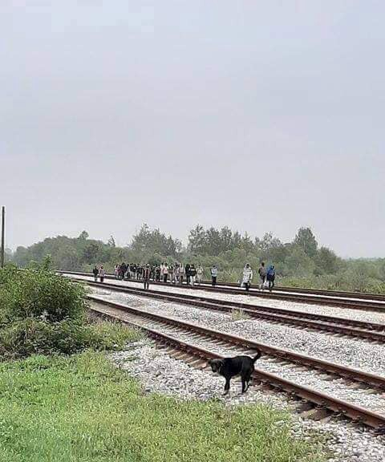
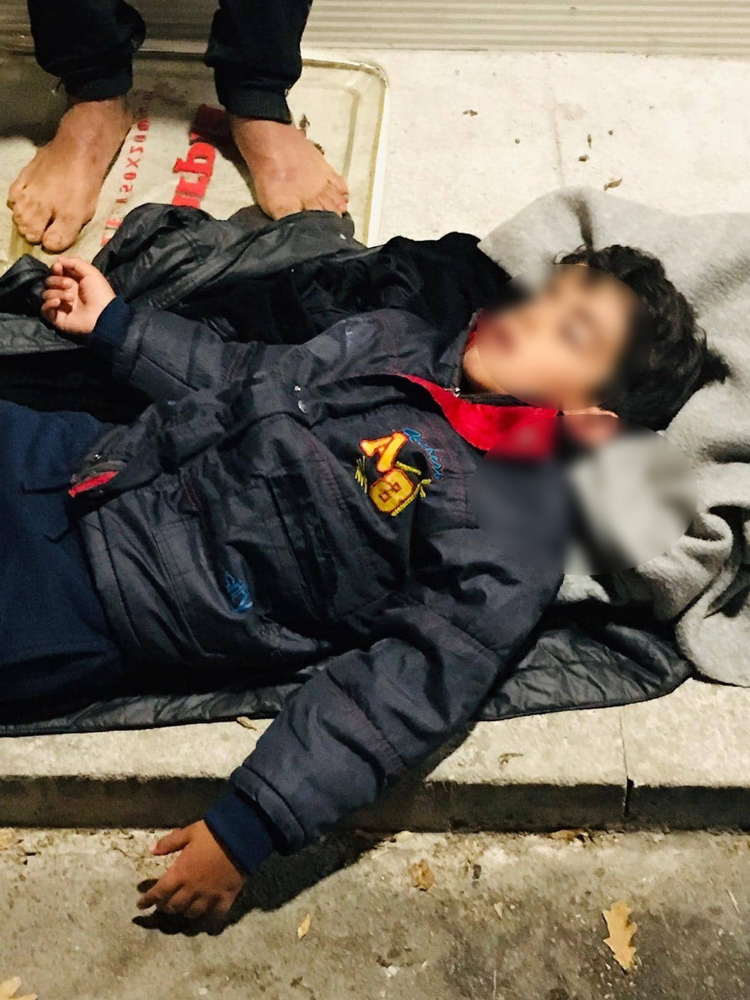

### AYS Daily Digest 9/9/19: In Tuzla, a growing number of sick children, exhausted and wounded people on the move
#### Detention more and more normalized as a step in the process which in itself is usually not communicated to the person involved with a steady rise in arrivals, Cyprus asks for help from the EU / a surge in arrivals to Tuzla, critical lack of support / deportation from Iceland,…

Kalesija, Tuzla \(Bosnia and Herzegovina\) — Photo: Senad Cupo
#### FEATURED

On Sunday night, while the local volunteers in Tuzla were distributing the evening meal at the bus station, a man arrived carrying a sick child\. He laid the child on the concrete floor, where just the night before more than a hundred people had slept\. People started panicking at first, then they called the ambulance and the police to assist him\. The boy arrived with his father, his mother reportedly died in Syria, and he was in a very bad condition upon arrival to Tuzla\. Increasingly this type of situation has been occuring, according to the locals who have made themselves available at clothes and food distributions for these the people who are arriving and passing through Tuzla\. The pressure on locals and arrivals is building up\.

This time, the volunteers were grateful that everything went well at the ER\.

In spite of more than 16 agonizing months, there is still no systematic medical aid provided to people on the move in Tuzla\. The emergency teams help, but hospitals and health centres usually don’t react to the calls for help, so it’s the volunteers who have to bring people directly to the ER\. 
There were many newly arrived people in the pastfew days, those coming from Serbia, but also those who came back after unsuccessful attemps to enter Croatia and the EU\. Among them, there are many minors and a large number of families with small children who arrive, completely exhausted\.

A group of boys from Pakistan arrived one day ago, having experienced beatings by the Croatian police, who also took away their belongings\. The volunteer group believe that more such arrivals will follow as the hardest period for everyone on the move is ahead — cold weather, bad policies and ruthless treatment\.
#### CYPRUS

6554 people had asked for asylum in Cyprus as of June of this year, according to the official statistics\. However, they expect a rise in arrivals by the end of the year\. The asylum system has a backlog of 14,000 asylum applications and the Cypriot government has [reportedly](https://www.dw.com/en/refugee-crisis-in-cyprus-close-to-tipping-point/a-50352565?fbclid=IwAR0IpUvG_l5EqgYmTUro3K8zOo4iwH_tZhvCVHWA6xYjFBMAZWmaxOwVWVA) already asked for the EU’s assistance in relocating at least 5,000 migrants [based on bilateral agreements\.](https://www.dw.com/en/cyprus-may-torpedo-eu-turkey-refugee-deal/a-19118971)
#### GREECE

1752 people arrived to Greece last week, [Attika Human Support](https://www.facebook.com/AttikaHumanSupport/?__xts__%5B0%5D=68.ARDlCkYow2y5Trj-7qqtVfgEdvhZ47j7Vve3Rk79vEfGgD4he0MwXGqZ0je0BvBl7VJ7aB5Xl6-csuOfnOQ7cspRkI8SB0TfbFbmJggSKPZzeLjtsE9N2lZ4Wzo9rELgNo_bCi9ovP_6F2z0EoJmBhZUaLLT73ZTWf9SqVa4xiKpptvMV__ChMW4U_EQ4mvyoM_M9abKNM8rt8gdv74JveWW9uq6YvsTfxK5czLI-d5N-vZzUX-DmhWR5HTIK4OZgOhaSDRdGNGuG-UD_NCm680I5gSrCOaNfYgoPmk9HqKtXpSoa0lLPPNpdme3no4gyAg7MGEfKS92vWIP-A7mT2vgjITDj9zUTPFZcfctvHLA-sD9LxLP2Q&__tn__=k%2AF&tn-str=k%2AF) reports\. On Lesvos, 25 boats arrived since last Monday Sep 2 to Sunday Sep 8 carrying 949 people\.

Over the weekend, 486 people arrived from Turkey on the Greek islands of Lesbos, Chios, Samos, Leros and Kos\.
1,577 people were transferred to mainland from Lesvos\. Moria still has more than 10,000 people staying there, approximately 3,420 of them in the Olive grove\.

Many are facing a wide range of problems, among them financial support\.

■■■■■■■■■■■■■■ 
> **[RSA](https://twitter.com/rspaegean) @ Twitter Says:** 

> > 3.000 refugees in #Lesbos wait to join cash program already. That means 5 months waiting so far. #RefugeesGr #opentheislands #stopthetoxicdeal 

> **Tweeted at [2019-09-09 11:48:50](https://twitter.com/rspaegean/status/1171027679228903424).** 

■■■■■■■■■■■■■■ 

747 people are registered as unaccompanied minors in Lesvos\.

1,168 are in Kara Tepe, and 44 people are placed in thee so called ‘pre\-removal centre’ in Moria\. Iliakhtida has 664 people and Pikpa 79\.
#### MALTA
### Detained on the south of Malta

The detained asylum seekers who are staying at the closed centre in the south of Malta started protesting\. From inside the fenced courtyards with barbed wire, groups of people were r [eportedly](https://www.google.com/amp/www.ansa.it/amp/sito/notizie/mondo/europa/2019/09/09/migranti-protesta-in-centro-a-malta_07eb46ec-4ab6-40a5-b23e-1d6dfe140e7d.html?fbclid=IwAR36icLYmolTh46FHbGWTa9GOAsVSksZQvwaeA4zU9E03NG4-yVftomlaqU) heard shouting “freedom”\. It’s the second protest inside the center in a week\. The detention is practiced on the official grounds that the people must go through medical checks before they are moved to various European countries that agreed to host them\.
According to the testimony of a person inside the facility, the living conditions inside the centre are really poor; people feel abandoned\. left to themselves, with out information and living great uncertainty about what will happen next\.
#### ‘THE BALKAN ROUTE’

In collaboration with the Croatian police, the Bonian authorities have organized a coordinated action to identify and prevent smuggling connections across the route, particularly in the area of the western part of Bosnia and Herzegovinna\. During their activities, they report that they have documented the smuggling of at least 315 people that the smugglers charged more than a €1,000 in order to get them across the border\. The Croatian side is allegedly doing a follow up on the contacts working in the same neetwork from the Croatian side fo the border\.
#### ITALY

4 men, originally from Ghana, were reportedly involved in a very bad accident in Destra Volturno, while they were going to work, [Csa Ex Canapificio Caserta](https://www.facebook.com/Csa-Ex-Canapificio-Caserta-527886284018191/?__tn__=%2CdkCH-R-R&eid=ARCEEGRYHFXTcsURGIX7qo5p_PA7moOiwXiWq0jMgq1dFOAjSx4PAQHW-ogscEfCaDjvb9EfYZntuV3-&hc_ref=ARRao6npAtrYFu9fCZHKOyl0eCO8ETMIQEU_02vvEgKRMMUCiufFucWZENHskUA0Ti0&fref=nf&hc_location=group) reports\. 3 of them were killed and one is wounded, known by all as Sisco, and is now in the Pinetagrande hospital\.
The Movement of Immigrants and Refugees of Caserta is shocked by what happened, they have published that they are doing everything to find out the identity of these workers and support their families\.

](assets/a969455285e/1*N9VcL4zPcm42wb5AygaSgQ.jpeg)

Photo: [Csa Ex Canapificio Caserta](https://www.facebook.com/Csa-Ex-Canapificio-Caserta-527886284018191/?__tn__=%2CdkCH-R-R&eid=ARCEEGRYHFXTcsURGIX7qo5p_PA7moOiwXiWq0jMgq1dFOAjSx4PAQHW-ogscEfCaDjvb9EfYZntuV3-&hc_ref=ARRao6npAtrYFu9fCZHKOyl0eCO8ETMIQEU_02vvEgKRMMUCiufFucWZENHskUA0Ti0&fref=nf&hc_location=group)
#### FRANCE
### Evictions underway

More evictions are ahead for those in the north, it has been reported from several sides\. Activists [report](http://www.gettingthevoiceout.org/voorziene-razzias-op-090…/) that the next one is taking place in the Belgian port city of Zeebrugge, with use of drones and police on horseback\.

According to activists on the ground, people in the area are on a sort of alert, many have left, “others got up very early in the morning, and the day centre of Secours Catholique, that usually opens in the afternoon, opened from 8 am to shelter people, but nothing happened, apart from the usual daily harassment of refugees by the police\.” CRS are aroud Calais, and reportedly new places in the detention centre of Coquelles were made available, according to the Auberge des Migrants\.

Over 800 people are sleeping in or around the gymnasium in Grande Synthe \(Dunkirk\), including many families with young children and unaccompanied minors\.
#### SWEDEN

Twelve people escaped from the Migration Agency’s closed deportation facility \(förvar\) in Märsta, outside of Stockholm, the night until Sunday\. They locked themselves into a room and blocked the door, before they managed to run away from the building\. According to the daily paper [Dagens Nyheter](https://www.dn.se/sthlm/rymning-fran-migrationsverket-i-marsta/?fbclid=IwAR1wRFkMpryh6w7RsSOlLFJNQhokd_aBcqrVhrUli3NkZiHxjck0c3jwdM4) at least seven people were found and brought back to the deportation camp by the police\.

Those who escaped were all facing deportation and it is very likely that the upcoming, forced, returns was the reason why they ran away\. A spokesperson for Moderaterna \(liberal/conservative party and the second biggest in Sweden, after the Social Democratic Party\) took the chance to stress the need of more surveillance, saying that people are kept in detention for a reason, the paper [Expressen](https://www.expressen.se/nyheter/rymning-fran-migrationsverkets-forvar/?utm_medium=link&utm_campaign=social_sharing&utm_source=facebook&social=fb&fbclid=IwAR0QuxVhaVBWwCkQWZCrGYzoNTaWC2CbvGSNr2UUEaq1t4H1kNbp5rvNtzU) reports\.
#### ICELAND
### Unannounced deportation in spite hunger strike

For the last 18 days an Iranian asylum seeker by the name of Amin has been on a hunger strike to protest his deportation\. He hoped that his case would be reviewed and his deportation cancelled\. In these 18 days, his health has been becoming worse and repeatedly doctors would refuse to evaluate his condition\. [Refugees in Iceland](https://www.facebook.com/refugeesiniceland/?__tn__=%2CdkCH-R-R&eid=ARDLGMWW7Ls3PfCS0SLxr3-wMhjurAoXZF283YLkCPS0osAiVrSzyhInmWf3_hT1k4_bU-sUQI9NFTB3&hc_ref=ARR1JRJsYpMMCIiABRgjJsIIHLz7u6qH_ihXGqWlvovP5jwz5nQ1BkX66fZKR-eOZes&fref=nf&hc_location=group) found out that he got arrested and was kept in a cell over night\. He was then deported\.

> All of this happened without anyone getting notified, reportedly not even his lawyer\. 

**We are open to welcome new info team members, let us know if you are willing to commit for a certain period or would like to contribute in another way\.**

**We strive to echo correct news from the ground through collaboration and fairness\. Every effort has been made to credit organisations and individuals with regard to the supply of information, video, and photo material \(in cases where the source wanted to be accredited\) \. Please notify us regarding corrections\.**

**Apart from daily news in English, we also publish weekly summaries in Arabic and Persian\. Find specials in both languages on our [medium site](https://medium.com/are-you-syrious/ays-weekly-in-arabic-and-persian/home?source=post_page---------------------------) \.**

**If there’s anything you want to share or comment, contact us through Facebook, Twitter or write to: areyousyrious@gmail\.com\.**

_Converted [Medium Post](https://medium.com/are-you-syrious/ays-daily-digest-9-9-19-in-tuzla-a-growing-number-of-sick-children-exhausted-and-wounded-people-a969455285e) by [ZMediumToMarkdown](https://github.com/ZhgChgLi/ZMediumToMarkdown)._
