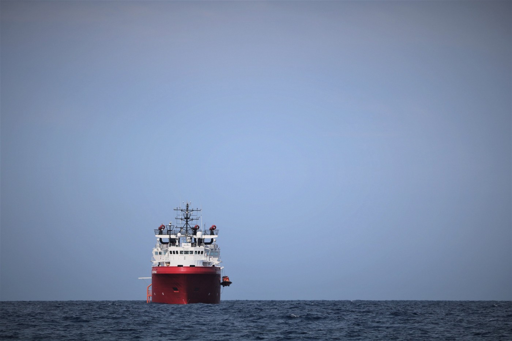
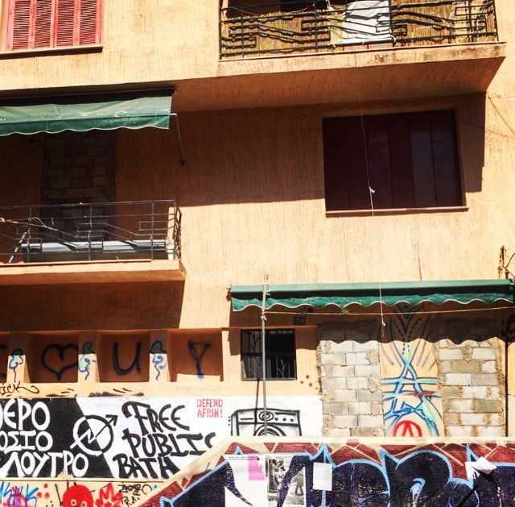

### AYS Daily Digest 13/9/19: Port of safety for Ocean Viking, a sustainable solution for SAR is urgently needed\!
#### Disembarkation for Ocean Viking / Horrible conditions for refugees in Turkey continue with detention / Children across Greek’s reception facilities missing school start over poor administration / Talks on allocation scheme / Paris volunteers need help / & more info

Photo: MSF Sea
#### FEATURED

Turkey — In Izmir, about 500 Afghan refugees have been taken to a deportation centre\. They had been living in a park for up to 5 months under poor conditions, without reliable food and sanitation\. Most of them are from the Kunduz province, large parts of which are controlled by the Taliban\. A family with three children stated that if they are sent back to Afghanistan, their lives are at extreme risk\.

Most of these people are forced to live on the streets, swindled by human traffickers\. Izmir Musicians’ Association has tried to mobilize people and institutions which they think are sensitive to human rights, but no other institution has taken any concrete steps in an effort to tackle the issue\.

In Izmir, where four million people live, not a single member of the institutions and NGOs protecting and pretending to have legal procedures for the people has come to Agora Park, a public area, to personally have an insight into the situation\. This attitude gives an indication of how sincere the institutions and people are about human and refugee rights, it is [reported](http://ilksesgazetesi.com/haberler/guncel/ggmde-ciglik-donersek-olecegiz-76302?fbclid=IwAR0bScRXsvr6uapyud1cAEURWcdIPnPdzgD0aRzNCjuXOhbm2fJH59uPdb8) \.
### Safe port for Ocean Viking, and what next?

The main news of the morning of this publication is that Italy has assigned a safe harbor to Ocean Viking, a SAR vessel of SOS Mediterranee and Doctors Without Borders, currently with 82 people on board\. They are now heading towards Lampedusa\.

> “There are 82 people who have suffered enormous trauma, we ask for a quick solution to spare them other unnecessary sufferings” — Gabriele Eminente, general manager of MSF, said the day before 

At the same time, Claus\-Peter Reisch, **captain of the Eleonore** \(rescue ship of Mission Lifeline\), **is facing a fine of 300,000 Euros** for entering Italian ports without permission\. The ship entered the port of Pozallo in Sicily on September 2 after a heavy storm in a situation of emergency\. Reisch is also being prosecuted for “assistance to illegal immigration”\. A crowdfunding to help him cover legal fees can be found here:

In the latest development regarding Europe’s plan to accept responsibility and be in solidarity with other member states, Germany and France said they were each ready to welcome 25 percent of the people landing in Italy\. On September 23, a meeting of EU member states will be held on Malta in order to find a more permanent solution for an allocation scheme\. This is certainly step forward towards the “temporary mechanism” of redistribution of people who arrive this way, a project on which the European Commission is working and on which the Italian government is definitely counting, all the while blocking the European sea and soil from asylum seekers, thus denying their lawful rights\.

We will continue reporting on the issue of what is understood as accessing elementary human rights, and what is thought of as a ‘safe harbour’, as well as questioning the EU institutions’ stance, options and responsibilities\.
### GREECE

On Friday 13th, according to **Aegean Boat Report,** three boats arrived on the Greek Islands, carrying a total of 107 people\. Two boats arrived on Lesvos, one on Chios\. For more detailed reports on arrivals on the Greek islands, please follow:

The situation on the Greek islands is resulting in depression and protests across the Aegean\. On Kos, a video was made of the camp residents protesting against the local conditions they are living in, in a protracted state of waiting for answers and next steps\.

In an attempt to relieve the islands, **two new transit centres** will be opened on the Greek mainland\. They are scheduled to start operating at the end of the month\. One of them will be situated on an abandoned military base in Karavomylos in the region of Fthiotida, the second one will be an extention to the pre\-departure centre in Corinth, Peloponnese\. 
The mayor of a town just next to Karavomylos has already claimed that, as it is located in a region depending on tourism, the area is not at all fitting for the new camp\. 
Find an article in English here:

As already reported in the Digest of 7th and 8th September and following a statement by **MSF** , three children attempted suicide in the months of July and August in Moria and 17 injured themselves\. Find the press release of MSF here:

The **Greek Council for Refugees** is concerned about the fact that, while school started on Wednesday, September 11, m **any children are not able to attend school yet** \. Especially those in the reception centers on the islands and in hosting centers on the mainland are not able to go to school, as the transport is not yet available, a ministerial decision is lacking, and the process of vaccination that is necessary before school entrance has been suspended\.
#### Athens

**Medical Volunteers International** is expressing its concerns about the situation in Exarchia with squats having been evicted and people arrested or brought to camps\. The organization is in need of medical staff to support the team in autumn:

> As the summer fades into Autumn, and Exarcheia comes to life again, the Anarchist movement has declared that this 'occupation', as they see it, will be retaliated\. We hope during this time that our Refugee friends and patients are able to stay safe, and we will certainly be keeping an eye on developments and supporting our beneficiaries medically along this journey\. 

> For this support we urgently need volunteers to fill some of the following gaps in the team: 

> \- we need 1\-2 Doctors from September 21st \- October 3rd
 

> \- we need a Doctor from October 18th \- November 1st
 

> \- we need Nurses from mid October onwards 

> If you can join our team in Athens during one of this times, please get in touch with us via the application form on our website\. [https://medical\-volunteers\.org/contact/\#volunteer](https://l.facebook.com/l.php?u=https%3A%2F%2Fmedical-volunteers.org%2Fcontact%2F%3Ffbclid%3DIwAR0e-40FD4Ag2GwA1pO5rFJ01SfL_o44vUR70dPSea8aqVHPO6ycYMpzzNg%23volunteer&h=AT0y11bqXhtJE1P2iw7JfWuyyaGESf_cNvsv0J2HCfrrER2WpF85LfUZvzsHmmfThgFS0R2HiIFuIE9yU8Ltsk1goGlAAeWGN2ZrK1Uu6pWH7NiTzgp1MP743pS-F1ftJ-8zNVM6xcKBw4r0SHrV0_SI_qjK) 

Photo: **Medical Volunteers International**

High temperatures and strong winds will cause a **very high risk of fire** for the coming days, the Greek Civil Protection warns\. The islands and parts of the mainland fall under the affected area\.

**Do your Part** is in need of a volunteer for its Communitiy Center in Oinofyta from mid September to the end of November\.

### SPAIN

In Spain in the past week 10 boats with about 200 people arrived\. As in 2018, the number of arrivals by sea has increased compared to the year before\.
### SEA

According to Italian media, **four persons are missing off the shore of Sicily\.** After three people from Tunisia were rescued by port authorities, they testified that the four persons threw themselves over board after a breakdown, trying to reach the coast clinging to empty bins\.

In the Alborán Sea, the Spanish **Salvamento Maritimo rescued 90 persons** in two operations yesterday\.

…

**We strive to echo correct news from the ground through collaboration and fairness\. Every effort has been made to credit organisations and individuals with regard to the supply of information, video, and photo material \(in cases where the source wanted to be accredited\) \. Please notify us regarding corrections\.**

**Apart from daily news in English, we also publish weekly summaries in Arabic and Persian\. Find specials in both languages on our [medium site](https://medium.com/are-you-syrious/ays-weekly-in-arabic-and-persian/home?source=post_page---------------------------) \.**

**If there’s anything you want to share or comment, contact us through Facebook, Twitter or write to: areyousyrious@gmail\.com\.**
### [Are You Syrious?](/are-you-syrious?source=post_sidebar--------------------------post_sidebar-)
#### Daily news digests from the field, mainly for volunteers and refugees on the route, but also for journalists and other parties\.

Following
#### 48

_Converted [Medium Post](https://medium.com/are-you-syrious/ays-daily-digest-13-9-19-port-of-safety-for-ocean-viking-a-sustainable-solution-for-sar-is-ab42525c4783) by [ZMediumToMarkdown](https://github.com/ZhgChgLi/ZMediumToMarkdown)._
