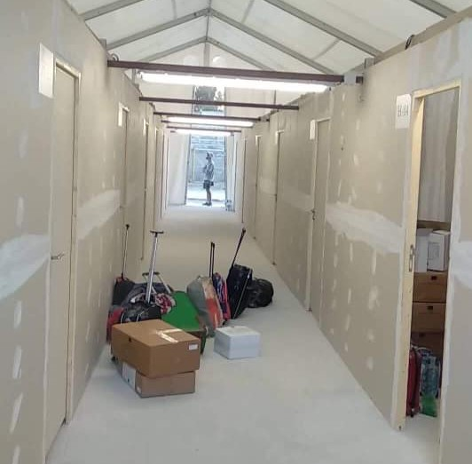
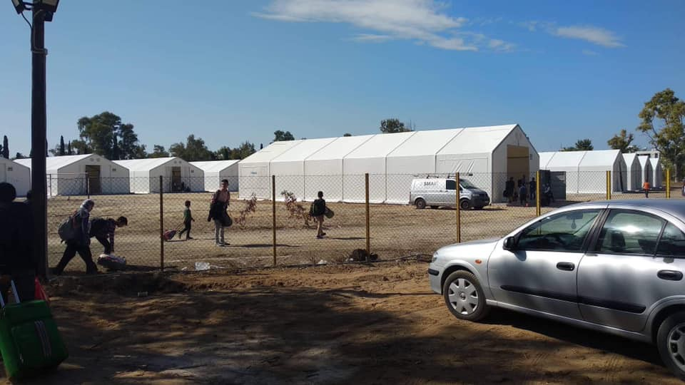
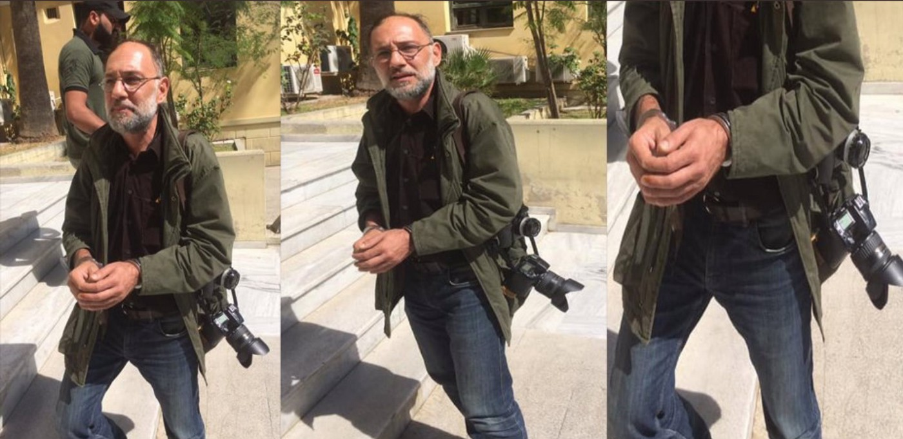
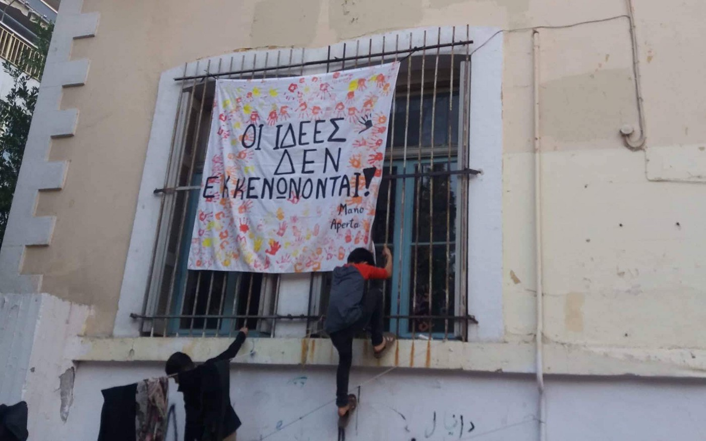
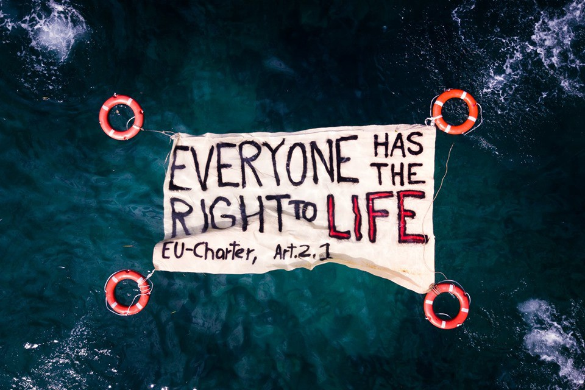
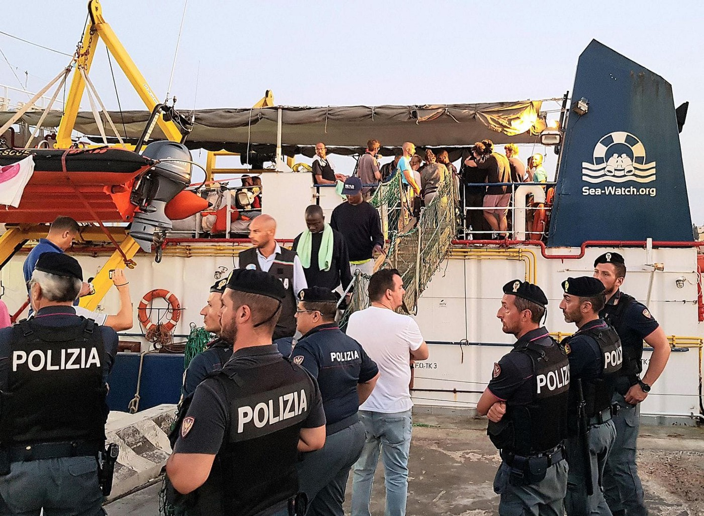
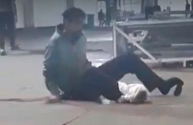
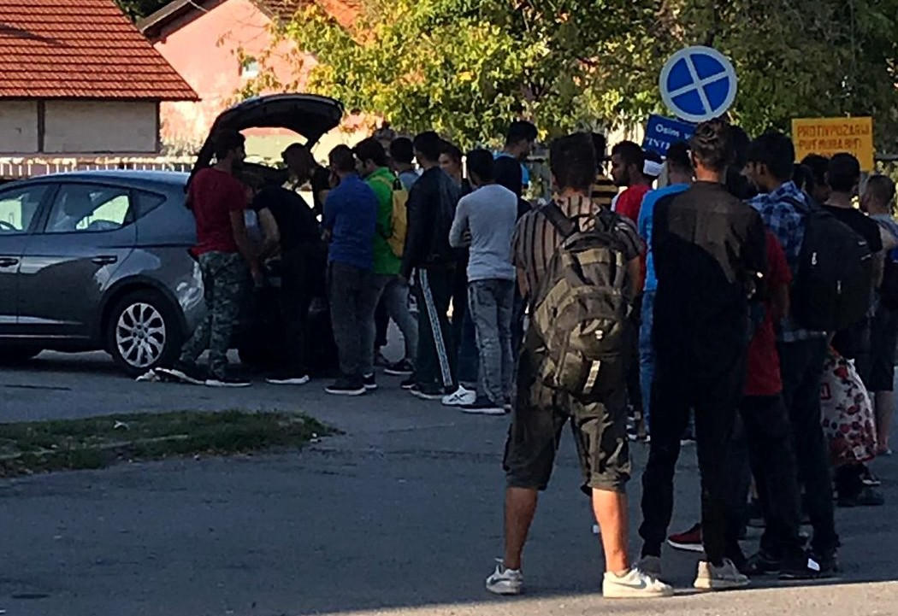
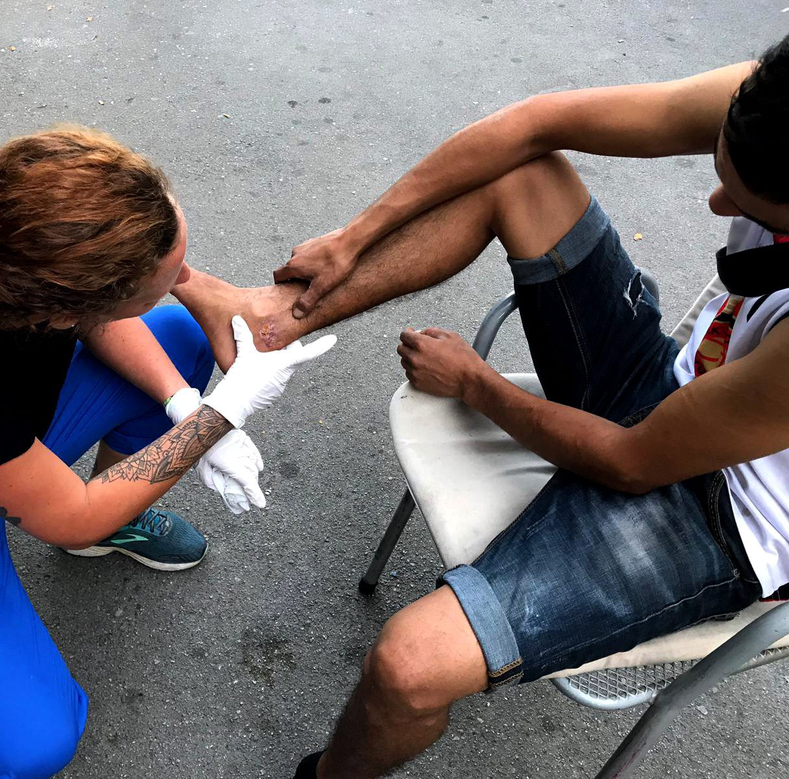
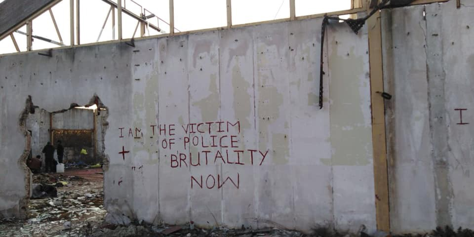

### AYS Daily Digest 23/9/19: Raid on the 5th School squat, 143 people sent out of Athens
#### The eviction happened only 4 days after 269 people have been evicted from Acharnes 22 and Jasmine School squats // Evicted families were sent to Corinthos camp, their cash cards reduced by half // Army to prevent new arrivals to Greek islands? // Malta, Italy, France and Germany agree to redistribute people rescued from the sea // A refugee dies of the long\-term consequences of being pushed back from Croatia // Solidarity movement in Tuzla, Bosnia, needs support // Refugees in Šid, Serbia intimidated by the police // People of Kent oppose right\-wing coastal patrols

](assets/d59ba8abcf37/1*8xdROw-sQuDozIT7RDe6Sw.jpeg)

130 people were taken from the city centre to the tent in the middle of nowhere\. / Photo: [Marios Lolos](https://www.facebook.com/marios.lolos.1?__tn__=CH-R&eid=ARDsrK6GdroWe0jGvEpjWkPjSDJh9ZmpOJXI9ZPZx9ucTZw1zevVbVs6vBJZXzc-RNbmgnp8tp0BIrnd&hc_ref=ARRKoxqGWRmun_bmBgjdynUygytCSS27h4bF9jJPEpzLeCWFRAgiKTcyKmQFxoqRCwU&fref=nf&__xts__%5B0%5D=68.ARBP7l8cF_maqzRQ9HfV0ttvGgQqLN0FRwSfI6VApD5BJnJYoCvtP1zyBF6pPPXVOjPSMFV4h7Cw-VobAjaIylp9oOUewSkGB3fvtUhmy5-iTUZFSgGNKZ6uYFx6Opx4P7-AgKCvhMl2ig7wbBsEOpU5yhxo4flIxWXlwJjvWQu-kUFj7TmACurBFSiJd_j6317y2mlcixZPW8fhPighw0395KIWeetzFPhnXzA_9WYY3lGIELlWDT6_vgsTx7jOFgT9KzQk7c5pb8pb7pEjlf2HN87cXABetGN6pVbAKYQg_JL7Al24gRODdkhJzQjevg6YMbkYmJboihOFnP_D2mSCqo22)
#### Humiliating expulsion from the only home they had

Today at 6AM, Greek authorities have continued their raids of squats in Athens by evicting 143 people, including 50 children and their families, from the 5th School squat\. A lot of tears and even screaming was heard in the morning, while fully\-equipped police officers were forcing people to abandon their only home and board buses, carrying whatever basic necessities they could bring with them, to be transported out of the city\. To add to the humiliation, officers were carrying sanitary masks and gloves, as if they were afraid they might be infected by the people in the building\.

> The eviction happened only 4 days after 269 people have been kicked out from Acharnes 22 and Jasmine School squats, including 46 families and 98 minors — you can read more about the previous evictions [here](ays-daily-digest-19-9-19-families-evicted-from-squats-in-athens-4fbfc4144a79) \. 

](assets/d59ba8abcf37/1*SzltfMGmrdsEPQN1qv24WA.jpeg)

Young officers with sanitary masks escorting elderly resident out of the building\. / Photo: [Marios Lolos](https://www.facebook.com/marios.lolos.1?__tn__=CH-R&eid=ARDsrK6GdroWe0jGvEpjWkPjSDJh9ZmpOJXI9ZPZx9ucTZw1zevVbVs6vBJZXzc-RNbmgnp8tp0BIrnd&hc_ref=ARRKoxqGWRmun_bmBgjdynUygytCSS27h4bF9jJPEpzLeCWFRAgiKTcyKmQFxoqRCwU&fref=nf&__xts__%5B0%5D=68.ARBP7l8cF_maqzRQ9HfV0ttvGgQqLN0FRwSfI6VApD5BJnJYoCvtP1zyBF6pPPXVOjPSMFV4h7Cw-VobAjaIylp9oOUewSkGB3fvtUhmy5-iTUZFSgGNKZ6uYFx6Opx4P7-AgKCvhMl2ig7wbBsEOpU5yhxo4flIxWXlwJjvWQu-kUFj7TmACurBFSiJd_j6317y2mlcixZPW8fhPighw0395KIWeetzFPhnXzA_9WYY3lGIELlWDT6_vgsTx7jOFgT9KzQk7c5pb8pb7pEjlf2HN87cXABetGN6pVbAKYQg_JL7Al24gRODdkhJzQjevg6YMbkYmJboihOFnP_D2mSCqo22)

Registered refugees who were forced to leave the squat in central Athens were promptly transferred to the newly established Corinthos camp in the middle of a dusty plain, where they are expected to wait for the winter\. Those without documents will be deported, according to the Alien Department of the Greek Police\.

> **People who were transferred to Corinth were also told their cash cards have been reduced by half, “because they will now be given camp food\.”** It is unclear where children will continue their education, as many of them have attended school in Athens\. 

According to volunteers on site, the camp has electricity and the large tents which were completely empty last week are now divided up inside to ensure some basic privacy\. However, the camp still lacks infrastructure and is by no means suitable for long\-term hosting of refugees\.

Camp in the making: it is being set up while people are already there\.

In terms of additional facilities, allegedly there are some shops within walking distance, but not in close proximity of the camp\.

> A resident just wrote to me that they were told they’re not obligated to stay; they can leave\. And go where? They were evicted from the home and community that they had made for themselves\. This resident, incidentally, is a ridiculously bright, motivated, multi\-lingual young man who was spending his entire day in Athens going from class to class, getting advantage of every resource available, learning every skill that he could\. He would often apologize for writing in the evenings, because he spent his days in school\. Now he is in a tent, in a dusty field in Corinth — wrote AYS volunteer Leslie Meral Schick\. 

From the central urban area to the dusty plain: who would want to stay here? / Photo: Leslie Meral Schick
#### Humanitarian assistance instead of solidarity

5th School was one of the two earliest squats in Athens; it has hosted thousands of people since its opening in 2016\. Its core purpose was to remove refugee families from the streets and provide them with safe and humane shelter\. According to our volunteers, it was a very spartan but joyful place, a community with a well organised structure, kids always playing in the courtyard, people commuting to schools, various trade and language programs, with access to the resources of central Athens\. This sort of support network is mostly found in the urban areas, while tent camps tend to be places of humanitarian assistance and cooperation of NGOs and governments instead of the basic people\-to\-people solidarity\.

Independent journalists in Athens claim that media outlets that support the current government are usually informed of such evictions beforehands\.

During this eviction, pro\-government journalists were allowed to film police officers in action, while other reporters were perceived as the problem\. According to the photographer [Savvas Karmaniolas](https://www.facebook.com/savvas.karmaniolas?__tn__=%2CdC-R-R&eid=ARBV7X230BkSq2ZK3t8xWt0mlQv56bXqmI94XJAwLUBNEpRQ3AAcmlAOxlrZQCmIzqNaN5d0RJA8gBJk&hc_ref=ARQbO-5KXrrHNmm1DrERRKwY6pVee-MiK-1PXIFli9piemmhr4pElL371ZK__xW9qc0&fref=nf) , his colleague Alexandros Stamatiou was arrested today while covering the evacuation of a squat\!

The Union of photojournalist Greece has publicly condemned the arrest\.

Photographer Alexandros Stamatiou taken from the site in handcuffs\. / Photo: Savvas Karmaniolas

Volunteers who were supporting the residents of the 5th School squat have organised a protest in front of the Foreigners Direction in the afternoon after the evictions\. At the moment, authorities seem to be very determined to continue with evictions\. They consider the tent camp in Corinth a suitable alternative, but many evicted people are hoping to go back to Athens, even if it means sleeping in she streets\. Volunteers will again do their best to find any form of sustainable solution for them\. “Ideas aren’t evicted”, says the banner which was hanged on the window bars of the 5th School squat this morning\.

Final message for the authorities: Ideas aren’t evicted\! / Photo: Mano Aperta
### Army to prevent new arrivals to Greek islands?

During an emergency meeting meeting between Defense Ministers Nikos Panagiotopoulos and Maritime Minister Giannis Plakiotakis on Sunday, it was decided to actively engage the Army and Navy in deterring the refugee/migrants influx to the islands, as well as widen the role of Frontex and NATO\.

> It is still unclear what the practical aspect of these decision might be, but Greek media is already speculating that a military zone might be introduced in the sea between Turkey and Greece in order to prevent any irregular entries\. 

It was also decided to strengthen the presence of Coast Guard vessels and personnel in the the Eastern Aegean Sea, in other words a continuation and expansion of the futile measures to decongest the islands, which are now at 300% of their reception capacities\.
#### Mediterranean
### Malta, Italy, France and Germany agree to redistribute people rescued from the sea

Today, four EU countries have reached an agreement on redistribution of refugees and migrants rescued from the sea, until a more permanent EU\-wide system is introduced\. The agreement was reached in a meeting in the Maltese town of Vittoriosa and is widely reported in the international media\.

> “Whoever lands in a European country arrives in Europe\. The redistribution of asylum seekers between all member states should happen in a regulated way and no longer on an ad hoc, voluntary basis\. These are the fundamental principles the European Parliament called for in its proposal for reform of the Dublin Regulation” said European Parliament President David Sassoli in his [first reaction](http://eptwitter.eu/qjWe) \. 

For years, EU member states have avoided taking their responsibility for refugees rescued from the sea\. / Photo: Sea Watch

Search and Rescue NGOs have applauded this meeting as the first step to finding a truly European, safe and legal solution for the people who are arriving by the sea in search of international protection\. However, they are pointing out that a lot of work needs to be done in order to bring all of the member states abroad\.

> “It seems like a step in the right direction but we need to see the details of the proposal: who exactly will be relocated, will people be detained awaiting relocation or if not eligible, what safeguards against unsafe returns? Oh, & what about continued cooperation with Libya?”, Judith Sunderland from Human Rights Watch [asked](https://twitter.com/sunderland_jude/status/1176184804636839937?fbclid=IwAR1UnVdjSA3vPigNXdNqRFu4T9goaD_3_4nmBdNShtSO8VGxlFT364k-yM0) today\. 

> “We welcome the fact that some states have decided to at least temporarily consider human rights at the EUs external border\. One thing is clear: The distribution of rescued people must be unconditional and take place ASAP in the nearest port of safety” wrote Sea Watch\. 

> “No matter how vital a disembarkation mechanism is, any conclusion from today’s meeting will remain highly symbolic until European leaders finally commit to putting lives first” added Hassiba Hadj\-Sahraoui from MSF 

Italian government was among those preventing SAR vessels from disembarking on its coast\. / Photo: Sea Watch

EU Commissioner for migration Dimitris Avramopoulos described the framework as a “predictable and structure set of temporary arrangements” which would kick in every time a migrant vessel is rescued at sea\.

Specific details of the agreement were not given, but Italian Interior Minister Luciana Lamorgese said a part of the plan was to have rescued migrants sent to various EU states within four weeks of being taken to shore\.

With her predecessor Matteo Salvini finally out of sight, it seems that the EU is gaining a new momentum to set up procedures for accepting new refugees, but also regulate its approach to search and rescue missions\. Salvini was notorious for raising criminal charges against civilian SAR missions, and prevention of their ships to disembark on Italian shores\.
#### Bosnia
### A refugee dies of the long\-term consequences of being pushed back from Croatia

Devastating news is coming from Bihać, Bosnian town where many of the refugees return after being forcibly pushed back from Croatia\. A man who lost his limbs, his sanity and his dignity after being humiliated and pushed back has died\. His name was Ali\.

Ali, crawling crippled on the concrete camp floor, weeks before his death\. Still from the video made by his friend who prefers to stay annonymous\.

> “Some very bad news\. Ali, the man who lost his feet on the Balkan route, has died\. The cause of his death is not know or not yet, but Ali was pushed back last winter by the Croatian police who took his shoes, and arrived back to his camp in Bosnia with his feet frozen after wandering for hours in the snow, barefoot\. He refused to go to hospital and refused to have his toes amputated, it is believed that for the shock he lost his mind and fell in some sort of denial, he became disconnected with reality and mentally ill\. He was briefly hospitalized in a psychiatric ward but went out\. His toes eventually fell off by themselves, bit by bit, and Ali was seen going to try the game, on crutches and with what remained of his feet, after having returned to Bihac from Sarajevo on his own\. Since then his physical condition had deteriorated severely\. DRC was also treating the voluntary return application\. He was hospitalized in Bihac and died on Saturday\. Murdered by the Croatian police and by the IOM, who did not oblige their duty of care, after an agony that lasted for months”, wrote Chiara Lauvergnac 

### **Volunteers in Tuzla need support to feed and treat people who are sleeping rough**

In Tuzla, a Bosnian city on the route between Serbia to Croatia, around 100 people are sleeping rough every night\. A group of local volunteers is coordinating food distribution in the parking lot at the bus station\. Usually around 50–75 meals are served each night, but when there are more than 100 people, the food quickly runs out\. Local volunteers are also distributing much needed blankets, sleeping bags and clothing every day\.

One of the leaders of the solidarity movement is [Senad Cupo](https://www.facebook.com/profile.php?id=1032645245) , a reliable, dedicated man who is open to accepting donations, long term volunteers and other practical forms of support\. AYS can vouch for them and we highly recommend supporting the team in Tuzla, because they don’t have any form of constant funding and average income in Bosnia is hardly enough to cater bacis personal needs, let alone to support dozens of others\.

Simple distribution from a car supports up to 100 people per day\. / Photo: Medical Volunteers International e\.V\.

At the bus stop in Tuzla, there’s also a medical team which is treating between 25 and 50 people every evening\. A doctor and nurse from Wave organization are currently supporting two local medical volunteers\.

> “One of them has been providing medical support on a daily basis since May, they look exhausted and are happy about some extra hands\. In early September, around 50 people were being treated every day, and both locals and IOM expect the number to climb again in late September and October\. Last night we saw 200 people at the food distribution including 3 families\. In the last few days, the local volunteers have rented a small space across from the bus stop to store their medical supplies, blankets, clothing etc and we helped to organise some shelving, tables etc for the space\. The local group hopes to also use this space for medical treatments during the winter months when first aid can no longer be given in the parking lot\. No other groups are present in Tuzla at the moment or providing medical attention for the migrant/refugee community, so the support of the local volunteers is necessary and helping significantly”, wrote a member of the Medical Volunteers International e\.V\. who is supporting the locals\. 

Between 25 and 50 people are being treated daily in Tuzla\. / Photo: Medical Volunteers International e\.V\.

International doctors who are supporting the local team in Tuzla are also accepting donations for their [medical team](https://www.facebook.com/donate/512909012794636/) \.
#### Serbia
### Refugees in Šid intimidated by the police

Dozens of refugee are residing in the abandoned factory in Šid, Serbia\. Most of them waiting to cross the nearby border with Croatia\. Many of them have already exerienced violent push\-backs from the EU country\. Temporary residents of the old factory are mostly young, single men\. Families reside in the nearby camps, also hoping they’d soon be able to cross the border\.

Lately, Serbian police visits the abandoned factory in Šid more often\. They enter without warning, no matter if it’s day or night, and check every corner of the building\. They don’t usually find a lot of people\. The boys are running away as soon as they hear them, afraid of police violence and/ or deportation\.

The boys in the Šid factory are too afraid of the police, both Croatian and Serbian, so they ran away as soon as they hear the officers approaching\. / Photo: AYS

> “Police harassment makes refugees live with a constant fear\. They stay watching all night long\. The cold, the tiredness, the dirt and the fear make even harder their way through the Balkans\. The volunteers of No Name Kitchen also do shifts to accompany them during the afternoon\. It gives them security to have people on their side\. The last shifts have been a meeting point, to sit around the fire and talk and drink tea, waiting to see who came before: the sun or the police”, NNK volunteers are reporting\. 

#### UK
### People of Kent oppose racist coastal patrols

](assets/d59ba8abcf37/1*5VY5OZhYorg-u3BIBeA2Lg.jpeg)

People have gathered on Sunday to spread messages of love against hate / Photo: [Andy Aitchison](https://www.facebook.com/aitchisonphotography?__tn__=K-R&eid=ARA6Uvl0lAsv9gG7pNFcCCx7sm0qKEpddGPN7cITKzeo3l5dLVsi8xBe_xl5ecreraKPKgNqx5Cldbud&fref=mentions&__xts__%5B0%5D=68.ARBSdjhlPokzxfbkuXJWelNjZE6-VouaumW-fjJRplM_TcCS3FoivZK8x_xlBxklBblwHfsqCu9p5PSVWvmmPodr_aI4Xc5gZttoRVSrmWxFQVLx_XITJgkTlBD-iWNYHqd-z2DG6hbAsBHymkmn1r6Ponnmo_uUMLhOiDoOXeA9QUGJj77pAthQlfD3QRigOfV123o28YjdLQEld3u0ZwHxhRIpHKY6-3hl3fb2GFZLaor4aWKhHYrfBKTlU7JjuA98yx9DaVNYBQLfCFzACs8nuJEmt09pIQ)

A Refugees Welcome event was held on Sunny Sands beach in Folkestone on Sunday, in response to reports that members of the far\-right were organising beach patrols to intercept people who had crossed the Channel in order to seek asylum\.

> “Some people say that the far right should be ignored\. Just ignore them, they’ll go away\. That doesn’t work\. It’s an abdication of responsibility\. Poison spreads\. Even if they are a tiny number of people we cannot allow them to infect anyone else\. And I’m so proud that all of you have come out today to be the vaccine against this threat to our communities”, said Bridget Chapman, a founding member of the Kent Anti\-Racist Network\. 

People from coastal communities including Broadstairs, Ramsgate and Deal turned up on Sunday morning to send a clear message to groups spreading messages of hate\. Well done, girls and guys\!

**If you wish to contribute, either by writing a report or a story, or by joining the info gathering team, please let us know\.**

**We strive to echo correct news from the ground through collaboration and fairness\. Every effort has been made to credit organisations and individuals with regard to the supply of information, video, and photo material \(in cases where the source wanted to be accredited\) \. Please notify us regarding corrections\.**

**Apart from daily news in English, we also publish weekly summaries in Arabic and Persian\. Find specials in both languages on our [medium site](https://medium.com/are-you-syrious/ays-weekly-in-arabic-and-persian/home?source=post_page---------------------------) \.**

**If there’s anything you want to share or comment, contact us through Facebook, Twitter or write to: areyousyrious@gmail\.com\.**

_Converted [Medium Post](https://medium.com/are-you-syrious/ays-daily-digest-23-9-19-raid-on-the-5th-school-squat-143-people-sent-out-of-athens-d59ba8abcf37) by [ZMediumToMarkdown](https://github.com/ZhgChgLi/ZMediumToMarkdown)._
