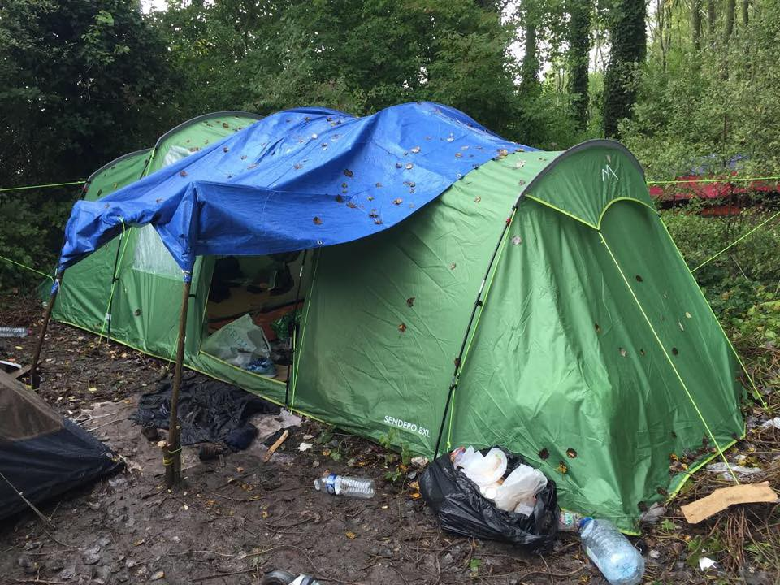

### AYS Daily Digest 24/9/19 Deal reached in Malta to create more reliable system for disembarking rescued people

_182 people on board Ocean Viking disembark // over 800 people arrive in Greece over last two days // 5 year old killed by truck outside Moria // new asylum procedures in Greece // update on Dunkirk_
### Sea

](assets/8410768a6135/1*v0_2gLoF9cAW6AMwBljdPA.jpeg)

08:30 24th of September, 182 are safe\. Photo by [Sergio Scandura](https://twitter.com/scandura/status/1176388277894635520?fbclid=IwAR0BiZjQPxW3bHmMa37yaYPiNUO-ip2bV5gRBMZxNly5FVR_7WRlk6lGxjY)

The 182 people trapped on the Ocean Viking were [FINALLY](https://twitter.com/MSF_ITALIA/status/1176447848579137537?fbclid=IwAR1Plcqki7bGi9i6UIHk7jutRcCYYdkzdcAb2vnOY-gNnlAnl92QO7MVd30) able to disembark in Messina\. [UNHCR](https://twitter.com/UNHCRItalia/status/1176446699394469889?fbclid=IwAR3ZChUmDh-oI7vc3YwHqNPlJ6AmD3yHa-f5eDvO7BIevLPj1z_X33-1p7A) in Italy noted on welcoming the people to safe harbour that this failure in speed highlights that:

> “It is necessary to restore an adequate rescue capacity in the Mediterranean, which to date this year has claimed 932 victims\.” 

#### This comes on the heals of the deal reached in Malta today, concerning a more lawful way to disembarked people rescued in the Central Mediterranean\.

The deal was reached between “the Ministers of the Interior for France, Germany, Italy and Malta, and representatives of the Presidency of the Council of the European Union and the European Commission\.” Hundreds of people are trapped in detention centres in Malta in horrible conditions, lawyers have reported to Amnesty International\. [Amnesty International](https://www.amnesty.org.uk/press-releases/malta-asylum-seeker-disembarkation-deal-shows-more-humane-approach-possible) emphasized the importance of this deal and finally encouraging direction from European leadership:

> “Details of the agreement are still to be disclosed, but we expect it to lead to the establishment of a reliable system to ensure that people rescued in the Central Mediterranean are promptly and safely disembarked in Europe, and that EU countries step up and share responsibility for them\. 

> “We hope this mechanism will put an end to the obscene spectacle of people left stranded on boats for weeks waiting to know where, or even if, they can disembark… 

> “Although limited to people rescued in the Central Mediterranean, today’s agreement is a sign that European leaders may be finally stepping up to manage migration towards Europe more responsibly and humanely\. Now it is paramount that more member states join soon\.” 

19 people were rescued at sea near the city of Ceuta and were transferred to their port\. The rescued happened very early in the morning around 03:00 and everyone was in good condition once they landed\. Learn more [here](https://www.europapress.es/ceuta-y-melilla/noticia-rescatados-19-inmigrantes-patera-trasladados-puerto-ceuta-20190924093228.html) \.
### Greece

[A 5 year old boy](http://www.ekathimerini.com/244850/article/ekathimerini/news/afghan-boy-aged-5-killed-by-truck-near-moria-migrant-camp?fbclid=IwAR0AnAoUyl_oNswb2SqeldPYCQdMOA2WmNu6WKrxGSSxujOScFlGH6CfP1s) was killed on Tuesday outside of Moria, after being accidentally run over by a truck\. He was in a cardboard box when the truck ran over the box\. The driver has been arrested and the police are investigating, but it remains unclear why the boy was in the box\.

According to [Aegean Boat Report](https://www.facebook.com/AegeanBoatReport/posts/656225224900585?hc_location=ufi) : “Since \(Monday\) at least 12 boats have arrived on the Greek Aegean Islands, 450 people\.” **The first 10 of the boats listed all went to Lesvos\.**

First boat → 37 people \(15 children, 8 women, 14 men\)

Second boat → 42 people \(11 children, 10 women, 21 men\)

Third boat → 41 people \(15 children, 9 women, 17 men\)

Fourth boat → 33 people \(19 children, 5 women, 9 men\)

Fifth boat → 28 people \(15 children, 7 women, 6 men\)

Sixth boat → 39 people \(16 children, 9 women, 14 men\)

Seventh boat → 37 people \(No breakdown available\)

Eight boat → 39 people \(No breakdown available\)

Ninth boat → 39 people \(24 children, 6 women, 9 men\)

Tenth boat → 24 people \(No breakdown available\)

Eleventh boat → **Chios** , 59 people \(21 children, 16 women, 22 men\)

Twelfth boat → **Chios** , 32 people \(1 child, 15 women, 16 men\)
#### But we know this is not all of the new arrivals\!

According to [The Greek Reporter](https://greece.greekreporter.com/2019/09/24/more-than-800-migrants-cross-into-greece-in-less-than-48-hours/?fbclid=IwAR1Q4FUw_jghFdBR1E1H0FmlaOdzexaBkoJC4x780H5PRPQ64diAdCB7hvY) , **more than 800 people** crossed into Greece over the last two days\. At least 116 people landed on Samos and about 62 people landed on Limnos Island who were later transferred to Lesvos\. More transfers are expected to happen from Samos to Piraeus on the mainland\.

> “According to data obtained by the North Aegean Police Directorate, 832 new asylum seekers were registered at reception facilities of the three islands \(Lesvos, Chios and Samos\) in less than 48 hours\.” 

Symi island has seen a growing number of arrivals recently, and the situation is getting worse\. While thankfully [400 people](https://www.facebook.com/symivolunteers/posts/2418741151514530?hc_location=ufi) were scheduled to be transferred to the mainland on Tuesday, they are still [in need of support](https://donate.giveasyoulive.com/fundraising/food-for-refugees-on-symi?fbclid=IwAR2OZ4CbSz2jPnlh8dqJUSTVBw93kWGLKiRIK7e02qwcmIqu2-Jjmln9NWI) \.

Moria can never be too far from our minds:

■■■■■■■■■■■■■■ 
> **[RSA](https://twitter.com/rspaegean) @ Twitter Says:** 

> > It has started raining in Moria and thousands of refugees in this severely overcrowded hotspot including around 5000 children try to find ways to protect themselves from the rain and cold #stopthetoxicdeal #refugeesGR https://t.co/ceE0aCPEOy 

> **Tweeted at [2019-09-24 16:10:24](https://twitter.com/rspaegean/status/1176529324809347074).** 

■■■■■■■■■■■■■■ 

For an more intensive look at the failure of how the Greek asylum process has affected Lesvos, look [here](https://openmigration.org/en/analyses/situation-on-greek-islands-showcases-the-eus-failure-on-migration/?fbclid=IwAR0AnAoUyl_oNswb2SqeldPYCQdMOA2WmNu6WKrxGSSxujOScFlGH6CfP1s) \.

[Reports](https://www.amna.gr/en/article/394884/Draft-law-on-asylum-procedure-to-be-ready-in-October?fbclid=IwAR2-1WXViYSiGVjqtNq3VMn_puqsvAsEwdYlWOs4MqFKuhaK7P5r-_RDwEM) of a draft law with changes to the asylum procedures in Greece will be ready in October:

> “According to the Athens\-Macedonian News Agency’s sources, the ministry has decided not to abolish the second\-degree asylum appeals process, where asylum\-seekers can contest primary\-level decisions denying them asylum\. Ministry sources said that the bill will focus on improving asylum procedures while respecting European law, in order to speed up the rate at which decisions are issued\.” 

### France

![**In an update on Dunkirk:** “This is the reality for hundreds of displaced people currently living in the Dunkirk area\. Just one week on from the eviction, there are approximately 500 people already sleeping rough in the area, including dozens of families with young children\. With the emergency centre now closed, people have been forced to relocate into the woodlands surrounding the city\. With so many people already returning, our teams have been on\-site for long periods each day, providing our full range of services and support\. This includes phone charging, WiFi, food packs, and distributions of basic but essential items\. Whatever the need, our volunteers strive to resolve or fulfill any problem or request they are faced with\.” **You can find Mobile Refugee Support’s donation needs [here\.](https://www.facebook.com/MobileRefugeeSupport/posts/1062449713960639)**](assets/8410768a6135/1*8H8AX8dilALpGYIBz5wLRg.jpeg)

**In an update on Dunkirk:** “This is the reality for hundreds of displaced people currently living in the Dunkirk area\. Just one week on from the eviction, there are approximately 500 people already sleeping rough in the area, including dozens of families with young children\. With the emergency centre now closed, people have been forced to relocate into the woodlands surrounding the city\. With so many people already returning, our teams have been on\-site for long periods each day, providing our full range of services and support\. This includes phone charging, WiFi, food packs, and distributions of basic but essential items\. Whatever the need, our volunteers strive to resolve or fulfill any problem or request they are faced with\.” **You can find Mobile Refugee Support’s donation needs [here\.](https://www.facebook.com/MobileRefugeeSupport/posts/1062449713960639)**

**If you wish to contribute, either by writing a report or a story, or by joining the info gathering team, please let us know\.**

**We strive to echo correct news from the ground through collaboration and fairness\. Every effort has been made to credit organisations and individuals with regard to the supply of information, video, and photo material \(in cases where the source wanted to be accredited\) \. Please notify us regarding corrections\.**

**Apart from daily news in English, we also publish weekly summaries in Arabic and Persian\. Find specials in both languages on our [medium site](https://medium.com/are-you-syrious/ays-weekly-in-arabic-and-persian/home?source=post_page---------------------------) \.**

**If there’s anything you want to share or comment, contact us through Facebook, Twitter or write to: areyousyrious@gmail\.com\.**

_Converted [Medium Post](https://medium.com/are-you-syrious/ays-daily-digest-24-9-19-deal-reached-in-malta-to-create-more-reliable-system-for-disembarking-8410768a6135) by [ZMediumToMarkdown](https://github.com/ZhgChgLi/ZMediumToMarkdown)._
