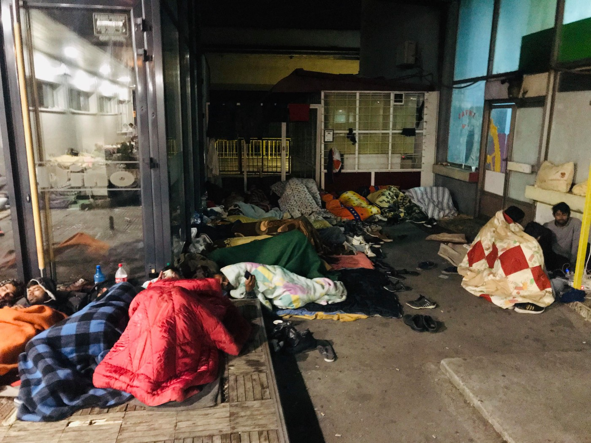

### AYS Daily Digest 1/10/19: Sweden evaluates deportations to Syria
#### Protests and new arrivals in Greece / Arrivals to Spain drop by 50 percent / Death toll in the Mediterranean reaches 1000 this year / Bombes camp in Libya still operating / UN demands to close Vučjak camp near the BiH border with Croatia / Reports of deaths in the Bosnian border area with Croatia / &more news

](assets/49a579ca30f1/1*4PfBKpW3RYxZlZRW8VQb_w.jpeg)

Protests in Sweden against deportations to Afghanistan\. Credits: [Amaso/Twitter](https://twitter.com/AmasoOrg/status/1171461231988789248)
#### FEATURED

**SWEDEN** — Last month the Migration Agency came forward with a new judicial evaluation regarding the safety situation in Syria, according to [Sveriges Radio](https://sverigesradio.se/sida/gruppsida.aspx?programid=83&grupp=24015&artikel=7311814&fbclid=IwAR0Z-IdC3qSi3UccDBaPNokR-2a5dBZH718HY_uQN_XxXsfjSUT9xvLcB0Q) \. The evaluation said that the agency now can reject asylum seekers from Syria, which in practice means that they should be deported\. This has not happened yet, and it is not clear when or how this will begin\. Up until now, more or less everyone from Syria has been granted some sort of protection — many of them temporary residency permits that has to be prolonged every third year or 13 months\.

Today the Migration Agency’s legal chief, Fredrik Beijer, said that Sweden could become the first country in Europe to work out a framework for deportations back to Syria\.

> “We are probably among the first in the line here\. Since we are not politically affected, our decisions often are faster\. I think Sweden’s assessments will be something many other countries will be looking at”, Beijer told the Swedish Radio\. 

In the first step, very few people will be affected or included\. The Migration Agency will begin by looking at the possibility to deport those who have committed crimes and been convicted in Sweden\. It is only about 10 people, Beijer said\. But the potential deportations also depends on the Syrian government, which Sweden has condemned, and how they chose to act\.

Cooperation with the Syrian authorities isn’t ”controversial” according to Said Mahmoudi, professor in International law at the University of Stockholm\. He said that it is necessary to have some sort of functional relations between all countries\. A Syrian refugee, interviewed by the radio, said that the evaluation of the situation in Syria is very simplified\. Also, the Migration Agency does not mention the political situation and the fact that as long as Assad stays in power in Syria — the country will never be safe for everyone\. Regardless of bombs or no bombs, fighting or no fighting\. Safe areas could also be divided by non\-safe areas, where there still is active conflict going on\. Fredrik Beijer from the Migration Agency especially mentioned Damascus as a safe area, where people “with resources” could find refuge\.

■■■■■■■■■■■■■■ 
> **[Statewatch](https://twitter.com/StatewatchEU) @ Twitter Says:** 

> > Sweden: Deportations on the rise and self harm widespread

[ecre.org/sweden-increas…](https://www.ecre.org/sweden-increase-in-deportations-and-self-harm-widespread/)

"In September 50 Afghan nationals were deported to Kabul in a single day. Information from the Swedish Migration Agency reveals that self-harm is wide-spread among asylum seekers in Sweden." 

> **Tweeted at [2019-10-01 12:05:00](https://twitter.com/statewatcheu/status/1179004281858465794).** 

■■■■■■■■■■■■■■ 

Also today, Ylva Johansson, from the Swedish Social Democrats, who is suggested to become the next Commissioner for Migration and Home Affairs, was interviewed by the [Swedish Radio](https://sverigesradio.se/sida/gruppsida.aspx?programid=83&grupp=24015&artikel=7311827&fbclid=IwAR0JCsA7xF89CSsy7ci3fbnu4spSggjUiyZee0zAO_dJmf2DACFNG4b2ncw) ahead of her hearing in the European Parliament\. Her mission has been deemed as “impossible”, given the current situation in the EU\. She said that she will be flexible, and also start with having bilateral meetings with all the EU\-countries\. One of the things she mentioned in the interview is the need for humanitarian corridors, given the horrible conditions in for example Libya\. In our last week’s news digest, we have also [reported about Sweden’s surge in deportations](ays-daily-digest-25-09-19-a-rise-in-deportations-from-sweden-c88cc8e20d08) \.
### Sea: 1000 deaths in 2019

IOM counted more than 1000 so far this year, after a shipwreck off Morocco\. In six years, the estimate more than 15\.000 incidents, demanding to increase sea rescue and provide safe ports\.
### Libya: Tajoura camp still in use

Despite the hit of an airstrike with 53 killed people and more than 130 injured, the Tajoura camp is still operating, IOM [highlight](https://www.iom.int/news/three-months-after-tajoura-airstrike-iom-renews-calls-urgent-action?utm_source=IOM+External+Mailing+List&utm_campaign=2612032b2c-EMAIL_CAMPAIGN_2019_10_01_08_37&utm_medium=email&utm_term=0_9968056566-2612032b2c-43645853) s\. “While we welcome the Libyan government’s plan to close the three detention centres: Tajoura, Misrata and Souq Al Khamis, this plan needs to be transformed immediately into action to avoid further tragedies like Tajoura from recurring,” said Federico Soda, IOM Chief of Mission in Libya\.

■■■■■■■■■■■■■■ 
> **[Safa Msehli](https://twitter.com/msehlisafa) @ Twitter Says:** 

> > 3 months after the #airstrike on #Tajoura detention centre that tragically killed 53 migrants &amp;left over 130 injured, vulnerable people CONTINUE to be taken there, &amp; the facility REMAINS operational.

@[UNmigration](https://twitter.com/UNmigration) renews calls for the end of #detention

👉 [bit.ly/2p3yOqo](https://bit.ly/2p3yOqo) https://t.co/DhHBdzLRjc 

> **Tweeted at [2019-10-01 17:09:46](https://twitter.com/msehlisafa/status/1179080980663013381).** 

■■■■■■■■■■■■■■ 

### Greece: Protests and new arrivals

Up to 200 people staged a protest at Katiskas today, demanding that no newcomers from the Aegean Islands will be relocated to the already overcrowded camp, reports [Infomobile](http://infomobile.w2eu.net/2019/10/01/listen-to-our-voices-tear-gas-and-protests-in-overcrowded-katsikas-camp/?fbclid=IwAR3L8Y1leZV3z36BN_2IEUCUpgpmhPc_I0Km5-EZKq0imPITRB0HG4X1qjQ) : “We are already around 1,500 people living here\. The officials say we are only 1,000, but thats not true\. There is no assistance to us\.” It is also said, that tear\-gas was used to end the demonstration\.

■■■■■■■■■■■■■■ 
> **[Petros Giannakouris](https://twitter.com/PGiannakouris) @ Twitter Says:** 

> > An Afghan family disembark from a ferry at the port of Piraeus, Oct. 1, 2019.  Authorities have accelerated efforts to move thousands of migrants deemed to be vulnerable from the overcrowded Moria camp to camps on the mainland.
#greece #refugees @[AP_Images](https://twitter.com/AP_Images) /@[PGiannakouris](https://twitter.com/PGiannakouris) https://t.co/bZK72cCGkH 

> **Tweeted at [2019-10-01 09:36:12](https://twitter.com/pgiannakouris/status/1178966836446203905).** 

■■■■■■■■■■■■■■ 

Aegean Boat Report counted 12 boats with 459 people arriving on the Greek islands until afternoon\. Five boats with some 250 people [arrived](https://twitter.com/LSpyropoulou/status/1178983922484559872?fbclid=IwAR1C6TMQ5ny8HhyGV-b97TqfZETF2iBsax8YXAenbWJplAkE-dBwuCDlqIM) almost at the same time on Lesvos, 215 were transferred to the mainland in the morning\. According to [UNHCR Greece](https://data2.unhcr.org/en/documents/download/71534) , more than 3100 people arrived on the Aegean Islands between 23th and 29th September\. More than 30\.00 are stranded there now; kids and women make 57 percent of the population\.

Meanwhile there has been another protest on Lesvos, people want the authorities to open the islands and not to lock new arrivals in the camps\. Waiting times for the asylum process can be up to three years\.

■■■■■■■■■■■■■■ 
> **[RSA](https://twitter.com/rspaegean) @ Twitter Says:** 

> > Protest now in Mytilene about the situation in #Moria #refugeesgr #opentheislands https://t.co/KkVkCV3Pqs 

> **Tweeted at [2019-10-01 17:07:40](https://twitter.com/rspaegean/status/1179080451698413568).** 

■■■■■■■■■■■■■■ 

Following the fire in Moria camp, journalist Daphne Tolis [reports](https://twitter.com/daphnetoli/status/1179027799761457152?fbclid=IwAR2N3jCrAVltF0zbu7W2xKCBD4obmUq4PfgXnO7MZAA9WjzH3jhTH4nNmhY) , that contradicting earlier statements by authorities no sign of arson was found at the site\.

A 16 years old Afghan has been [found dead](https://left.gr/news/igoymenitsa-nekros-16hronos-prosfygas-poy-eihe-kryftei-se-ntalika) inside a truck in Igoumenitsa, a harbor city with ferries heading to Italy\.
#### BOSNIA AND HERZEGOVINA
### UN calls for closing of Vučjak

The United Nations urged Bosnian authorities to stop forcing people to live at the Vučjak camp, Reuters [reports](https://af.reuters.com/article/idUSKBN1WG4G2) \. Additionally, the spot with some 800 people is not prepared for the upcoming winter season, they say\. 
As if it was prepared at all for hosting human beings and as if they didn’t know about it already, we can’t skip adding\.

The EU donated equipment to the interior ministry of Una\-Sana Canton worth some 60\.000 Euros\. This includes radios and laryngophones, ethylometre with associated printers and computers and a projector\. The project _“EU Support to Migration and Border Management in Bosnia and Herzegovina”_ is funded by the European Union with €14\.8 million and is implemented by the IOM in partnership with UNHCR, UNICEF, UNFPA and the Danish Refugee Council \(DRC\) \.

One would hope that means that even more will, albeit so very late, be spent on actual humanitarian assistance, as most of those organisations’ primary purpose is that\. While children and minors \(among others\) are getting left uncared for, being beaten, sick, and homeless, we fail to understand the prioritizing and siding along with silent approval of the situation which has clearly not resulted in better practices on the ground, as ‘means that justifies the cause’\.
### Tuzla

A large number of people are still arriving daily to Tuzla\. During the previous night, around 70 people arrived at the bus station\. At the same time, there was about a hundred more people who had been arriving during the day, and some who have been in the city for a couple of days already\.

The local volunteers remain the only organised group assisting these people\. In spite a large number of people in the street during the night \(about 200\), this was also the case today\. Many people from the town brought blankets, clothes, and food\. Women from Tuzla had prepared meals for everyone and the organisation Wave came to assist the group\. During October a large number of people are expected to arrive in Tuzla, and the already well\-exhausted volunteers \(with their own lives, jobs and families to take care of\) worry how will everything unravel in those circumstances, and if nobody comes with a viable and sustainable solution\.

The local police officers work well with the volunteers, helping with organisation during the meal distribution\. One of the big issues for all the people involved is the \(inevitable in these circumstances\) problem of scabies\. One girl was hospitalized due to developed injuries of scabies\. This is not the only case, and more people are getting sick due to the conditions they are forced to stay in\. The epidemiological service of the Health centre in Tuzla claims that they have no information on sick patients, and have not been approached by people who suffer from the illness\. They have no information because none of the responsible officials come to assess the situation, and only the volunteers bring sick people to hospitals\. Same goes for transport out of the hospital\. Even if a person has had to take a surgery, they are later on discharged — to the street, with everyone else\.

The dire need for basic accommodation in Tuzla has still not reached the top of anyone’s priority list, not the internationals organisations responsible and in charge of the refugee situation in Bosnia and Herzegovina, not the local leaders or the cantonal and federal governments\.

all photos by Senad Cupo
### New deaths on the border?

Video and photo material displaying a dead body of a man who presumably drowned in the Korana river has been sent out to multiple addresses\. We are in process of establishing facts and finding out what exactly happened to the person\. According to some information, it seems that another person has lost their life in the same period, trying to cross into Croatia, but the confirmation and circumstances of the alleged tragedy is still pending, so we are unable to provide any substantial information regarding that\.
#### SPAIN
### Less arrivals

The number of people arriving to Spain by boat dropped by almost 50 percent to some 18\.500 in the first nine months of 2019, compared to the period of the previous year, writes [Europa Press](https://www.europapress.es/epsocial/migracion/noticia-llegada-migrantes-patera-cae-493-primeros-nueve-meses-2019-20191001172436.html) \. The interior ministry counted 844 boats compared to 1449\.

**If you wish to contribute, either by writing a report or a story, or by joining the info gathering team, please let us know\.**

**We strive to echo correct news from the ground through collaboration and fairness\. Every effort has been made to credit organisations and individuals with regard to the supply of information, video, and photo material \(in cases where the source wanted to be accredited\) \. Please notify us regarding corrections\.**

**Apart from daily news in English, we also publish weekly summaries in Arabic and Persian\. Find specials in both languages on our [medium site](https://medium.com/are-you-syrious/ays-weekly-in-arabic-and-persian/home?source=post_page---------------------------) \.**

**If there’s anything you want to share or comment, contact us through Facebook, Twitter or write to: areyousyrious@gmail\.com\.**

_Converted [Medium Post](https://medium.com/are-you-syrious/ays-daily-digest-1-10-19-sweden-evaluates-deportations-to-syria-49a579ca30f1) by [ZMediumToMarkdown](https://github.com/ZhgChgLi/ZMediumToMarkdown)._
