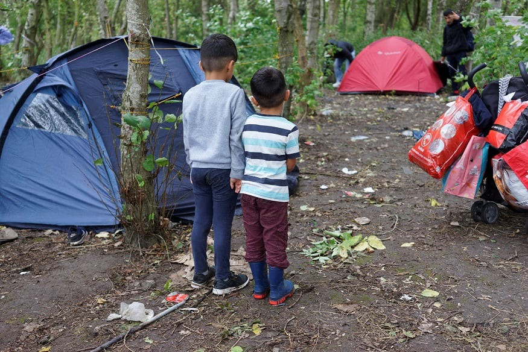
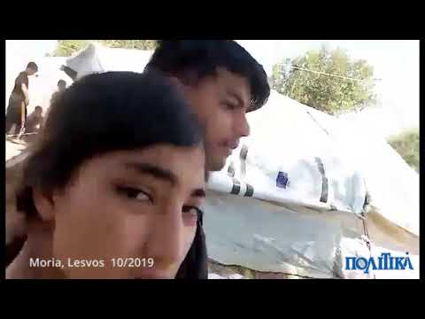
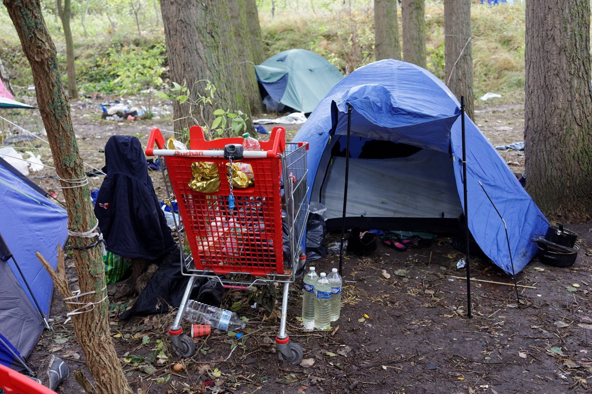
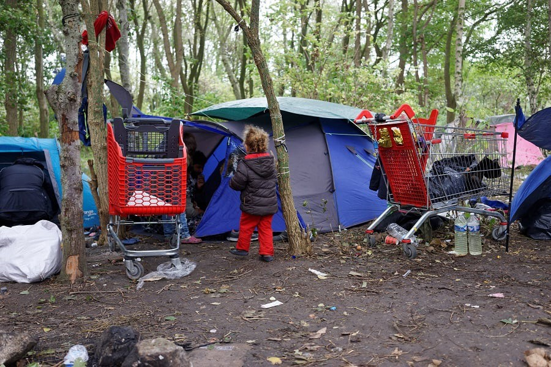
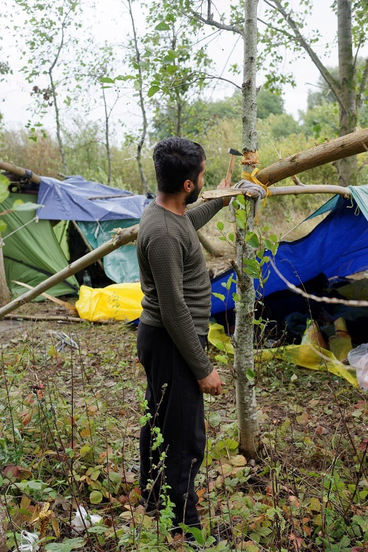
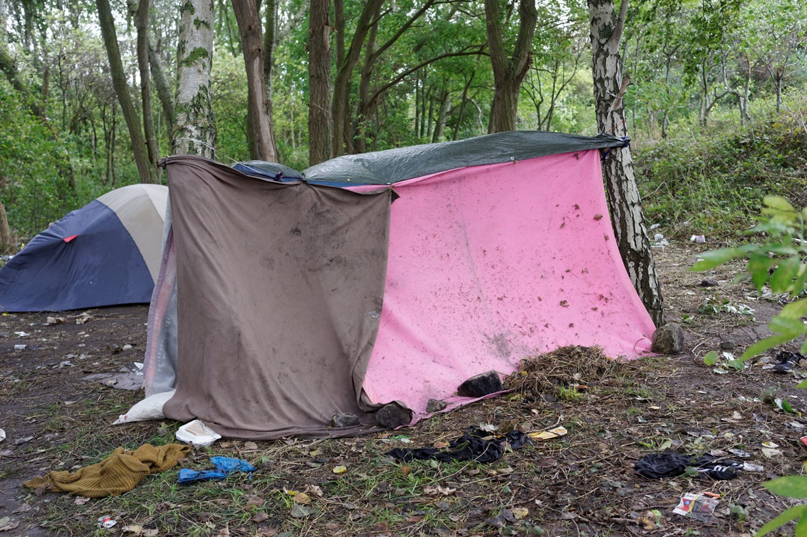

### AYS Daily Digest 3/10/19: Stranded in misery, from the Aegean sea to the Strait of Dover
#### 300 people arrive in a single day to the overcrowded island camps in Greece, the situation on verge of cracking / Turkey\-EU grey area spreading to the fourth year / about 400 people stranded in the woods of Grande Synthe

photo: Jean\-Philippe Huguet, Grande\-Synthe, Sunday, September 29, 2019\.
#### FEATURED

During the day of October 3, at least eight boats arrived on the Greek Aegean Islands, with 299 people on board, [Aegean Boat Report](https://www.facebook.com/AegeanBoatReport/?__tn__=kC-R&eid=ARCZAcTs9bsZzKGlcQ2yTiFABfgKFa9V1EU7jQkbARvk7ubtu7pE3VFDU5QBCxEoRZ-c6QJ2lucBwBkD&hc_ref=ARRw0M0tVn5towqpqYSQKcpODPK2fSWsrF4ZI9cQdzqSTtfJvURenFU04eXUDdkMhuw&fref=nf&__xts__%5B0%5D=68.ARB_r8_0g88TG2mCUJy3SBvtTP2JwBVTzkiMbeiWgrrJiHjKoi00WCCek6k9gEBeyQzSMu_E6tAsKIDb3fnN_gwumwChm4KZ3JjlgfPPamsMJwslbdHXNHZIb0YASdVjBX_JHkkGcgNCkk7uPE3b41McX0HhJRVYkvtyN7y7iaG4hRVweG-_1e9WsWG7MtdWYT012IlLwzsMYUur7Q4wr2UD5eHoQPbOKXmuV7mtWhcSX8ux8wbnYsqQ_blxK5wKNrtMlg0fiU9dwMnAPby5-2V9FFNunbNS5LKLT2djPIbfedH00zULpreW5UKAb9-I0tGF5m0H_QHUJ55SLc0vrI0) states\. More than 35,800 people had arrived this way since the begining of this year, accordinng to the UN’s statistics\. In spite all the tragedies and harsh conditions people face \(for a long time\) once they reach the Aegean islands, there is a rise in the number of those who make an attempt and reach Greece by boat from Turkey\.

](assets/7850003cb8ca/0*L6R_09DcL3gZ09VL)

Protest in Athens today with the demand to close Moria and the other hotspots and stop the toxic EU\-Turkey deal\. — by: [@rspaegean](https://twitter.com/rspaegean)

Three years after the signing of the infamous EU\-Turkey deal, Turkey is the one leading where the deal is heading and what it might become, as it seems\. In response to increasing domestic pressure by anti\-migrant currents, and as a means of political leverage to force the EU into supporting their plans for a ‘safe\-zone’ buffer in North Syria, Turkey has changed their policies and treatment of the refugees in the country, particularly of the Afghan and Syrian communities who make for the largest group there\. More than 300,000 Afghans and Iraquis in Turkey don’t have permanent resident status as non\-Syrian refugees\. That, the treatment of the people, the general atmosphere in the society and the imperative of having everyone documented \(and/or deported\) pushes people to move on to Greece\.

The number of people arriving in Greece has increased by 200% in the last five months, Greek officials are stating\. As a reaction and as a ‘taste’ of what’s to come as a result of the Turkish president’s earlier ‘threat’ that he would [“open the gates to Europe”](https://www.theguardian.com/world/2019/sep/05/erdogan-ill-let-syrian-refugees-leave-turkey-for-west-unless-safe-zone-set-up) , the German Interior Minister is in Turkey for talks now, most likely to prevent more arrivals and keep good relations with Turkey\. Yet, nobody speaks of any strategies of how to avoid the failure of the EU\-Turkey deal’s first three years\.

Although the number of asylum applications lodged in European countries has significantly dropped, the entire burden was left upon the weak and inadequate asylum systems of Greece and Turkey, a [legal analysis](http://tr.boell.org/en/2019/10/03/third-anniversary-eu-turkey-statement-legal-analysis?fbclid=IwAR3EQNUj7F0-QgF4fELgiNzlbn_SnJ4B8QkD9WB31smIFZ4_Qxwzi8fIEuU) of the Deal confirms\. Greece now reportedly plans to tighten the [asylum procedures and increase the number of returns](https://www.keeptalkinggreece.com/2019/09/30/greece-migration-plan-decongestion-returns-asylum-procedures/) to Turkey in order to discourage refugees and migrants\. As Greece wants to stem more arrivals, a delegation of the EU Commissioner for Migration along with German and the French Interior Ministers are heading for Athens as well for meetings with their Greek counterpart\. The nationalist Greek government’s rhetoric is not much different from those of their other EU counterparts, but given the situation Greece is in, theirs stands out as the ‘deal changers’ in the whole context\. A Greek minister stated that the people who arrive now are, “illegal immigrants and do not qualify for humanitarian protection\. **They have human rights, which must be respected when examining an asylum application, but only to that extent\.”**

In the meantime, more than 12,000 people are crammed in Moria alone\.

■■■■■■■■■■■■■■ 
> **[Franziska Grillmeier](https://twitter.com/f_grillmeier) @ Twitter Says:** 

> > Children account for 42% of the refugee population on #lesvos (7 out of 10 are younger than 12 y); 24% of the 14,900 asylum seekers are #women. Picture taken while women were protesting for safety outside #Moria, after the fire on Sunday. Sign says: Suffered hearts. #refugeesgr https://t.co/G5GDAoxraJ 

> **Tweeted at [2019-10-03 14:52:56](https://twitter.com/franzieire/status/1179771322089574402).** 

■■■■■■■■■■■■■■ 

The perverse mechanisms of the international community that seemingly allow everyone not to care for the most vulnerable human group on the planet currently extend past readmissions to avoid asylum procedures to keeping \(and preferring\) poor reception and housing conditions in order to push people into opting for the ‘voluntary’ returns, etc\.

> While the EU referred to the migration flow consisting of 800,000 persons in 2015 as a “crisis” and its main response was concluding a readmission deal with Turkey, when it came to assuming the legal liability of this matter, the EU only further accentuated this uncertainty by claiming “it wasn’t me\.” 

More on the situation of refugees and people on the move throughout Turkey:

### Deportation warning

[Refugee Protest Camp Vienna](https://www.facebook.com/RefugeeCampVienna/?__tn__=%2CdkCH-R-R&eid=ARDPpQKi_pPKK0QG7Yw6xRG0q7vYaaqjUxgiGsEzA5cmlS6FzgfBYNPWOE_DRfzyRD1K22ZKrdeqi7OG&hc_ref=ARR10ewRkl13nWE47FlpQoavkT1GpErQ7ECgMTnEPhaKa1LGKc_LztrVGR0BWnMEKPg&fref=nf&hc_location=group) has announced possible deportation to Afghanistan from **Austria** on October 15\.

For more updates and information on alleged and confirmed deportation announcements, especially from Austria and Germany, try to follow [Afghanistan Migrants Advice & Support Org](https://www.facebook.com/AmasoAfg/?__tn__=kC-R&eid=ARB1MQn0sYppGLwUVA3ZzUgefII_BZG7yOZu0egA0onwttgUmEFCdzSlWVIo7NGETSzVpvoCzDFVlXQ7&hc_ref=ARROM-cpwvES4tYRdMk9YlkSBqlvcV3Uvv2tHCaDvT_ix1rVEQOHHKOQg25qYoNT6Fs&fref=nf&__xts__%5B0%5D=68.ARBLm_j4E7w4VJUA_AEX9bkIpTMmsEv1BqFz8ucfepPdLke_Bcn9TUECYZSxd_GlZsB8s_qi6ZdzE5tmftfu5H0RbNHD7onM-WAzk0cr7fzji6TnhPLTlDAWyQqKypGyFVcjuUAPRUoSzWA_nyZXXlqfLihoVaAh2sUV3pVmImdcQXeBIz3a-jE4bGWWgfqdRqFkXOrCz5g9xhLJlz8yEUIxakgQsxbvXuX5gqrXh-KyH_u9TGB_6Nr2eJe8IGzNRSXQYaxXb1vc7lNCR3uynKRMsYzGWRn1brCI6Lg7vDt1LwhS8r97onF_pF0W4GE3QQReZgdoIkEw4mxxQov3FSRzAg) \.
### Hitting the bottom in Grande\-Synthe

**With no access to care, shelters destroyed, and police presence, the situation is extreme in the Grande\-Synthe area in the north of France\.**

Anger is rising among the associations active in the area, and they announced they would change the tone, [Médecins du Monde Hauts\-de\-France](https://www.facebook.com/medecinsdumondehautsdefrance/?__tn__=kCH-R&eid=ARD4bNJZmnxgOVDzSUXuW3WBVkPZVQ4843EfK2YiiHVSjS7GnUWCrhpoYRdLT9XBkeg3PP66-YOgCoTi&hc_ref=ARR6_bIWAH-5PBFeY7pR8UEej0Sjp-fO9_6mX-T_cRAo387Ysy9JmbICZje-uj9L1tE&fref=nf&__xts__%5B0%5D=68.ARDWYWxa_cofN7A9S62jF9Im1tlgRHg7hbhJ_uIIwiylxNT26LXPdPfSrAE4-Xnb8HB7u7oEsCvUwyiBahO0JkKdPLtBPJW3yxoTllNMvp4Fhxu3Qrg_ZdFUNO7_XU8uSzmR2rssegMuhQGlJCsl7QXwL5JrdWAVqEiZlJyoAv8m7GiUZ_7Er2FJpkKWOvq_IfHp_vr5uvZ73erMdK2NmYEQrBUogMTi-Y0V37dgQfTjwRiJ96lYuHV181mMf7QTCQ9-o-glB39KH2jwqxp1Me1KwPiHoeJYEEyZIr_Ux-LGdoCgnN0EsSuHqMLSp2JnrRuTimhlYtptml04CMctvK3-kqKmIvvC7eEKCNqeXOQoi1uVzklVPGV7GRcJ7A7WRMGxBPWrKu0YZrWYXHTnDEAfFSyEhYbmGQp5hcX_vM4eNA8o-xRwm3-0FdTJlp3wQF1H9IlLVGxklD8-Do0PVCIe5FKZf2U5ZqcUPgzr2BLWySPaqMJNauepVi2a) reported\.
After the expulsion of September 17, people stranded in the woods of Puythouck no longer have access to water or hygiene, shelters are confiscated or destroyed, and aid distribution is often prevented through enforced police presence\. A health hazard is additionally expected due to the fact that the people are left to bathe and use the water of the nearby lake for all their needs, including cooking\. The need for care is getting greater; “our teams can no longer cope”, organizations say\. They stress this is a result of the incompetence of the officials in the treatment of the situation: unworthy and degrading living conditions in Grande\-Synthe\.

> 400 people are still in the woods, including families with young children\! 

**If you wish to contribute, either by writing a report or a story, or by joining the info gathering team, please let us know\.**

**We strive to echo correct news from the ground through collaboration and fairness\. Every effort has been made to credit organisations and individuals with regard to the supply of information, video, and photo material \(in cases where the source wanted to be accredited\) \. Please notify us regarding corrections\.**

**Apart from daily news in English, we also publish weekly summaries in Arabic and Persian\. Find specials in both languages on our [medium site](https://medium.com/are-you-syrious/ays-weekly-in-arabic-and-persian/home?source=post_page---------------------------) \.**

**If there’s anything you want to share or comment, contact us through Facebook, Twitter or write to: areyousyrious@gmail\.com\.**

_Converted [Medium Post](https://medium.com/are-you-syrious/ays-daily-digest-3-10-19-stranded-in-misery-from-the-aegean-sea-to-the-strait-of-dover-7850003cb8ca) by [ZMediumToMarkdown](https://github.com/ZhgChgLi/ZMediumToMarkdown)._
