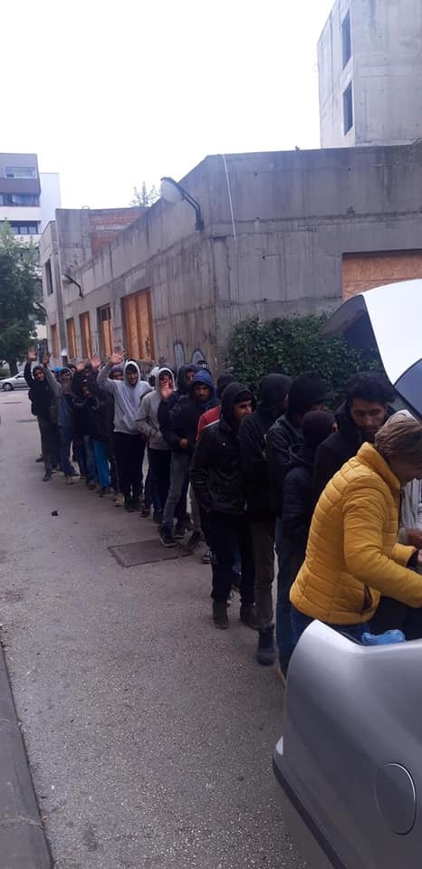
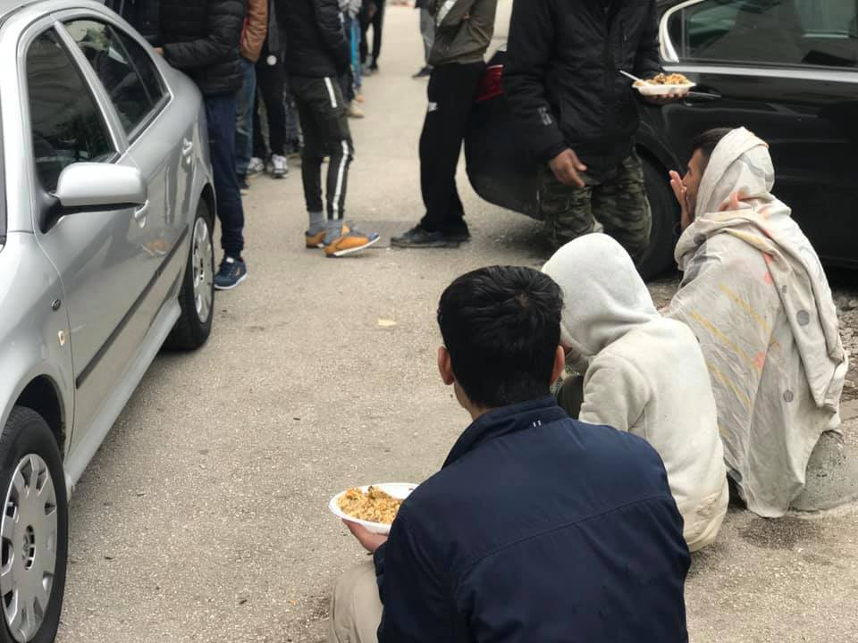
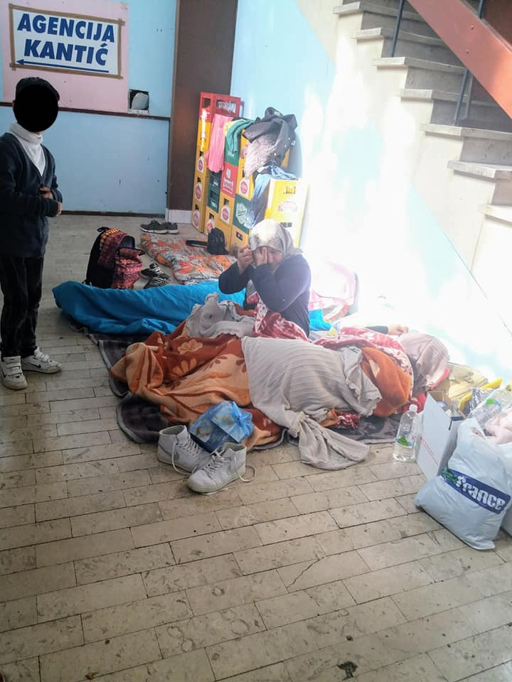
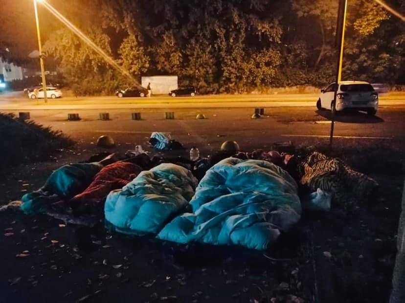
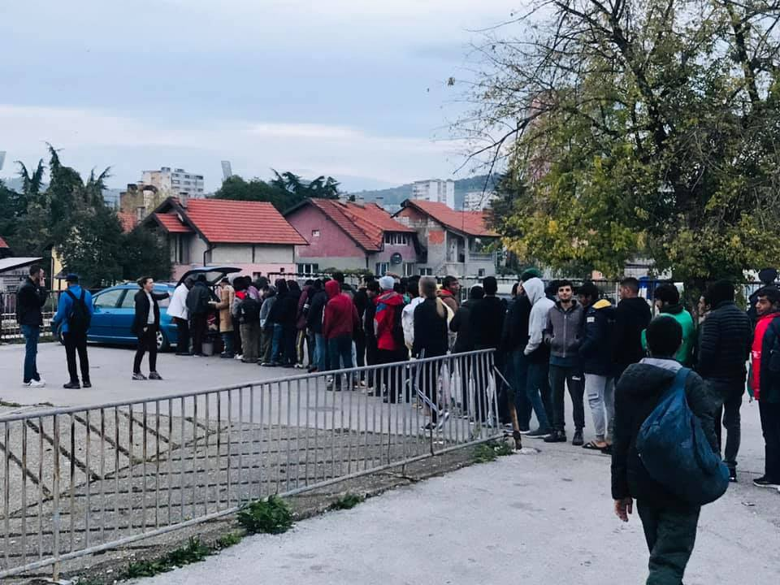
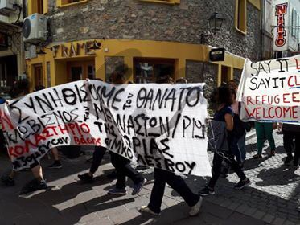
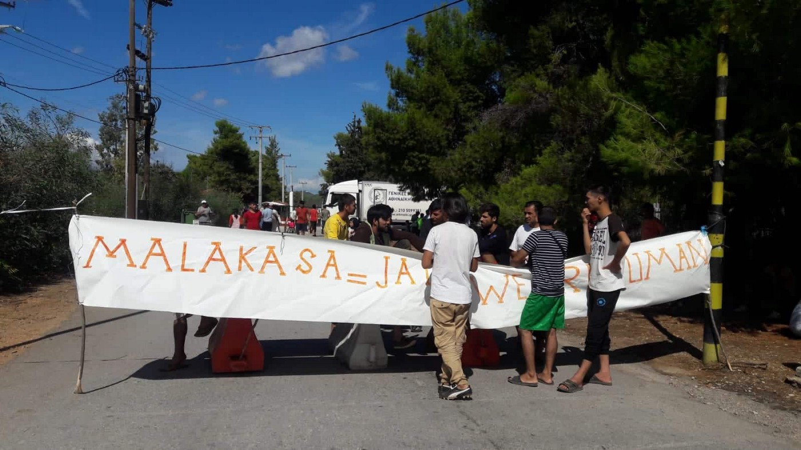
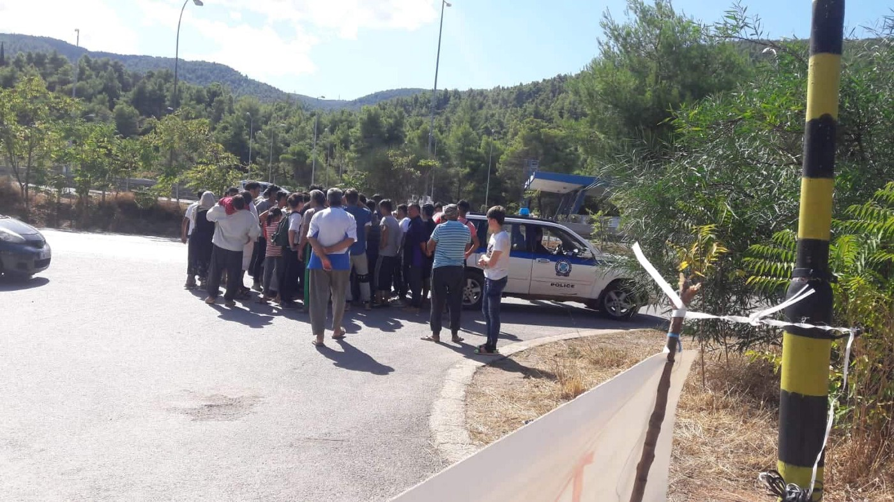
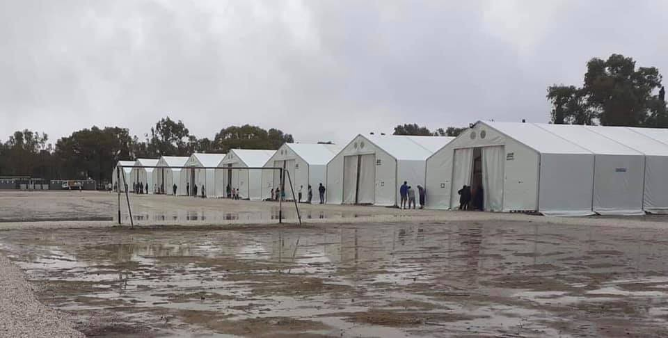

### AYS Weekend digest 5–6/10/2019 People arriving in Tuzla are abandoned by authorities

Another tragedy in the Mediterranean: a6\-year\-old lost his life in the Alboran sea /// Ahmed H\. is finally allowed back home to Cyprus /// Protests in Lesvos and Malakasa /// Report from Leros and Corinthos /// Racist attacks in Greece /// Disquieting change in management of reception centre in Udine /// Winter donations needed in Dunkirk

](assets/12b2b907d824/1*9SxwpT9g5CAtzQu87PPY6Q.jpeg)

Photo by [Off the Couch](https://twitter.com/.../status/1180467079700455424/photo/1)
#### Photo feature — People keep arriving in Tuzla, abandoned by authorities

](assets/12b2b907d824/1*TOUfrEL-Pa0hcnANOO_nEw.jpeg)

Local volunteer doing food distribution in Tuzla, photos by [Senad Cupo](https://www.facebook.com/groups/144469886266984/permalink/423102061737097/?hc_location=ufi)

 and [Selma Dzafic](https://www.facebook.com/photo.php?fbid=10219731140445776&set=gm.2582177008508551&type=3&theater&ifg=1)](assets/12b2b907d824/1*v8S_Odyi888KOek_8_axFA.jpeg)

Families finding shelter where they can, Tuzla, photos by [Suada Muratovic](https://www.facebook.com/suada.muratovic.315?__tn__=%2Cd%2AF%2AF-R&eid=ARAgAimz5JfukkFfDxdSwHTUAxFVPV8_byrmL5zSiMjPjQ6ZTsYcnFcerJ3FDuhh20pAsdNUf1FjGadP&tn-str=%2AF) and [Selma Dzafic](https://www.facebook.com/photo.php?fbid=10219731140445776&set=gm.2582177008508551&type=3&theater&ifg=1)

](assets/12b2b907d824/1*pVkgFrYaACFF45yGlk_NQA.jpeg)

More people queuing at a food distribution in Tuzla, photos by [Senad Cupo](https://www.facebook.com/groups/144469886266984/permalink/423102061737097/?hc_location=ufi)

We have reported several times on the situation in Tuzla\. People come into town every day, and local volunteers are the only people available to support them\.

According to [local volunteers](https://www.facebook.com/photo.php?fbid=10219710242323336&set=gm.2577996682259917&type=3&theater&ifg=1) , in the last few days a 6\-year\-old girl arrived in town alone, without parents\. Police had stopped her parents at the border and pushed them back to Serbia…without her\. She arrived with a fever, scared and confused\. Allegedly, now authorities are taking care of her and IOM has been informed\.

This is the point we’re at — during what is already an illegal operation, police illegally remove a child from her parents, and this becomes the responsibility first of volunteers and then of NGOs, taking up time and resources in one of the many ridiculous scenarios caused directly by the state\.

Ruhi Loren Akhtar and Refugee Biriyani & Bananas are fundraising for people stuck in Bosnia in preparation for the coming winter, support them [HERE](https://www.facebook.com/donate/468973413952576/) \.

TURKEY
#### **Updates on Turkish coast guard activity**

A state\-run news agency [reports](http://www.anews.com.tr/turkey/2019/10/05/38000-irregular-migrants-held-in-sea-in-2019-in-turkey?utm_source=twitter&utm_medium=social&utm_campaign=twitter) that the Turkish Coastguard arrested 38,467 people considered irregular migrants and detained 56 suspected human smugglers in the country’s waters in 2019\. According to the same data a total of 1,115 cases of irregular migration took place in Turkey’s waters\.

Independent observers, Aegean Boat Report \(ABR\), [calculated](https://datastudio.google.com/u/0/reporting/1CiKR1_R7-1UbMHKhzZe_Ji_cvqF7xlfH/page/A5Q0) that since the beginning of the year 70,922 people were stopped by the Turkish Coastguard and police\. Also, ABR [inform](https://www.facebook.com/AegeanBoatReport/) us that in the last five days alone, a staggering 123 boats have been stopped by Turkish Coastguard and Police, and over 4000 people have been arrested, while trying to reach the Greek Islands\.

LIBYA
#### Survivor of the attack on Tajoura detention centre attempts suicide

Human rights advocates [report](https://twitter.com/sallyhayd/status/1179682223638945792) that a man who survived the air attack on Tajoura detention centre in July has attempted to take his own life in the UNHCR\-run GDF centre in Tripoli\. His friends had to stay by his side all night, waiting for medical facilities to open in the morning\. His condition is now stable\.

M\., had fled on foot from the detention centre after the air strike and reached the Gathering and Departure facility in Tripoli managed by UNHCR in July\.

■■■■■■■■■■■■■■ 
> **[Andrea Gagne](https://twitter.com/AndreaGagne) @ Twitter Says:** 

> > M.* and the group were allowed to stay temporarily. However, UNHCR has told them they don't have space anymore, and they will not be resettled. They've been offered a small cash allowance to leave, or they'll be returned to prison if they don't comply. 

(3/6) 

> **Tweeted at [2019-10-05 20:30:23](https://twitter.com/andreagagne/status/1180581016580182019).** 

■■■■■■■■■■■■■■ 

In the past two years, M\. and his wife have been in 5 different detention centres\.

Last week, the EU delegation in Libya released a [statement](https://twitter.com/sallyhayd/status/1179682223638945792) announcing that a Post\-Tajoura working group has been created\. While all initiatives to end migrant detention in the country are welcome, the presence of the [major funders](https://www.facebook.com/EUinLibya/photos/a.348384115244307/2448289725253725/?type=3&theater) of the Libyan Coastguard in such groups raises some doubts as to its effectiveness\.

MOROCCAN / SPANISH BORDER
#### Push\-backs, changes in policies and new security measures in Spanish enclaves in Northern Africa

ECRE [report](https://www.ecre.org/spain-rights-of-asylum-seekers-deteriorating-at-border-with-morocco/?fbclid=IwAR1jJasQJ6nC4cCFZOpDy53Y5Cp8JPSuzjqGgWkM8N_-VlnWJNYUOTuKNV4) that on the 30th of August the Spanish government started to apply the “border procedure” for asylum applications in its enclaves at the Spanish\-Moroccan border, Ceuta and Melilla\.

The procedure is reserved for airports, maritime ports, land borders and migration detention centers \(CIE\) but did not [used](http://www.asylumineurope.org/reports/country/spain) to be applied in the enclaves\. Also known as “express”, the Spanish “border procedure” only concerns the admissibility of the asylum application and must be completed within a strict time limit of a maximum of eight days\. Substantially [lower recognition](https://www.ecre.org/wp-content/uploads/2019/07/Policy-Note-21.pdf) rates across different EU member states point to the arbitrary and discriminatory nature of border procedures\. **In practice, procedural safeguards required by the Asylum Procedures Directive are often undermined by short deadlines for decision\-making and appeals, a lack of information given to those seeking asylum and reduced accessibility for legal support\.**

It is reported that this was the case for 150 people who had crossed the border fence in Ceuta\.

This comes in the context of a wider attempt by the Spanish authorities to curb migration flows\. Push\-backs have been increasingly reported in the region and “upgrades” to the fencing of the enclaves are underway on both Spanish and Moroccan sides\.

SEA
#### Western Med

On Thursday a six\-year\-old child [died](https://news.yahoo.com/african-migrant-child-dies-trying-reach-spain-153046403.html;_ylt=AwrC1ChbW5hdV2UAag_QtDMD;_ylu=X3oDMTByOHZyb21tBGNvbG8DYmYxBHBvcwMxBHZ0aWQDBHNlYwNzcg--) after being rescued via helicopter from a boat that was carrying 66 people\. Authorities have not released the details of the cause of death\. The other people on the boat reached the Spanish coast near Malaga on Friday\.

143 people on 13 boats have arrived to the coast of Cartagena in the last 24 hours\.

■■■■■■■■■■■■■■ 
> **[EFE Murcia](https://twitter.com/EFE_Murcia) @ Twitter Says:** 

> > El número de inmigrantes llegados a las costas de Cartagena en las últimas 24 horas asciende a 143, en su mayoría argelinos y entre ellos varios menores, que han sido interceptados en 13 pateras por embarcaciones de la Guardia Civil, Salvamento Marítimo y patrulleras de Frontex. https://t.co/MG0H0mdALk 

> **Tweeted at [2019-10-06 10:26:28](https://twitter.com/efe_murcia/status/1180791426461904897).** 

■■■■■■■■■■■■■■ 

60 more people were [rescued](https://twitter.com/SRodrigoruiz/status/1180518894987091968?fbclid=IwAR26qmGizzag877pP-lXEmd1bpWBA25YHjrVMrGaNWhxTlnVvS9edp825C4) and brought to Motril\.
#### Central Med

In the evening of Sunday 6th, the Open Arms vessel located a wooden boat with 40 people on board, including 4 children\. They are attending to it right now, while they wait for instructions from authorities\.

■■■■■■■■■■■■■■ 
> **[Oscar Camps](https://twitter.com/campsoscar) @ Twitter Says:** 

> > La Misión 67 de @[openarms_fund](https://twitter.com/openarms_fund) localiza una embarcación de madera con 40 personas a bordo, 4 niños. La estamos atendiendo ahora mismo mientras nos mantenemos a la espera de indicaciones de las autoridades https://t.co/MPDZmtSH5H 

> **Tweeted at [2019-10-06 18:11:07](https://twitter.com/campsoscar/status/1180908359169581057).** 

■■■■■■■■■■■■■■ 

GREECE
#### Arrivals

Aegean Boat Report [inform](https://www.facebook.com/AegeanBoatReport/) us that 11 boats arrived on the Greek Aegean Islands today, carrying 387 people\.

With these last arrivals, this week 56 boats arrived to the Eastern Aegean Islands, carrying approximately 2,000 people\. The weather has been rough the last few days, this could explain the decrease from last week, when 89 boats arrived, carrying 3223 people\. \(via [Aegean Boat Report data](https://datastudio.google.com/u/0/reporting/1CiKR1_R7-1UbMHKhzZe_Ji_cvqF7xlfH/page/A5Q0) \)

Local media report that 570 vulnerable people are being transferred from Lesvos to the mainland on Sunday\. They will arrive at the port of Pireaus on Monday morning and will be brought to a camp near Thessaloniki, in the north of Greece\.
#### URGENTLY NEEDED \| Volunteers for our Support Crew on Lesvos\!

Boat Refugee Foundation is urgently looking for volunteers who can strengthen their support crew on Lesvos\. As a support crew volunteer, you will support their doctors and nurses during their shifts in the camp of Moria\. Your task would be to look after and guard the outdoor waiting area in front of the clinic, keep the atmosphere friendly, and have a clear overview of the people waiting\.

Find more info and sign up [HERE](https://bootvluchteling.nl/en/volunteering/support-crew/) \.
#### Demo on Lesvos

A few hundred people gathered in solidarity with refugees and migrants on Saturday afternoon in Mytilene\. They were reportedly stopped by the police on their way to Moria, and prevented from reaching the hotspot\.

 and [No Borders](https://twitter.com/Refugees_Gr/status/1180440111445692416/photo/1)](assets/12b2b907d824/1*i4AYjATp52sKzb3luhkBRQ.jpeg)

Protest on Lesvos, photos by [Paco Nevado](https://twitter.com/PacoSnowed/status/1180447840109244418) and [No Borders](https://twitter.com/Refugees_Gr/status/1180440111445692416/photo/1)
#### Heavy rain in Moria

On Friday night Lesvos was hit by a thundersorm\. These are the consequences for the 13,000 people in Moria:

■■■■■■■■■■■■■■ 
> **[Julian Busch](https://twitter.com/JulianBusch2) @ Twitter Says:** 

> > Heavy rain and thunderstorm in #Moria. The tents can not stand in this conditions. The winter is coming. #refugeesgr
 #lesvos https://t.co/Q3J77jPFJj 

> **Tweeted at [2019-10-04 21:20:07](https://twitter.com/julianbusch2/status/1180231148015931398).** 

■■■■■■■■■■■■■■ 

#### Beyond Moria

From Vathi, in Samos:

■■■■■■■■■■■■■■ 
> **[RSA](https://twitter.com/rspaegean) @ Twitter Says:** 

> > This is Vathy hotspot on Samos that hosts a refugee population that is nine times its official capacity #refugeesGR #stopthetoxicdeal https://t.co/l7GecqZq0i 

> **Tweeted at [2019-10-06 11:13:38](https://twitter.com/rspaegean/status/1180803294157033472).** 

■■■■■■■■■■■■■■ 

From Leros:

Leros is the smaller of the Eastern Aegean Islands and hosts 1,761 \( [Greek govt\. data, updated at October 4](https://infocrisis.gov.gr/6290/apotyposi-tis-ethnikis-ikonas-katastasis-gia-to-prosfygiko-metanasteftiko-zitima-tin-3-10-2019/) \), with a capacity of 806\.

These people live in squalid conditions at the Leros Psychiatric Hospital, along with 154 patients\. Authorities had decided to set up temporary accommodation for migrants three years ago\. [According to unionised workers](https://greece.greekreporter.com/2019/10/05/1500-refugees-live-in-squalor-at-greek-psychiatric-hospital/) , the hospital has however “gradually evolved into an open hosting structure” where, as they say, “750 people can barely fit in the premises and now the place hosts more than 1,500”\.

Moreover, in the front building of the hospital there are nursing wings where 154 mentally ill patients are treated\. In the middle of the premises, an open accommodation structure has been established, leading to an uneasy coexistence between the patients and the asylum seekers\.

“There are constantly new refugees and migrants arriving on [Leros](https://greece.greekreporter.com/tag/leros/) ,” the union statement reads, “who are now accommodated in three completely inappropriate buildings, ready to crumble, as the Technical Services has reported…”
#### Protests and dire conditions in Malakasa camp

Residents in Malakasa camp, some 50km north of Athens, [have organised a protest on Saturday](https://twitter.com/Refugees_Gr/status/1180521500174159874) \. It was triggered by the decision of the police to stop a lorry from entering the camp\. The lorry, which goes to the camp regularly, is used to deliver much needed aid and food to the residents\.

Photo by a resident of Malakasa

Conditions in Malakasa have worsened over the summer, with many new arrivals, who had to buy and put up their own tents, despite being advised to go there by authorities\. Many are unregistered and unsupported by IOM and cannot qualify for a cashcard, meaning they are completely reliant on this sort of solidarity work\. Recent rains have also made conditions in the camp even more intolerable, especially so for those living in cheap flimsy tents\. SOS Refugiados, an organisation that goes to Malakasa three times a week [reported](https://twitter.com/sosrefugiados/status/1179510954016624641) that after 8 months, some new showers have been installed, that there are no NGOs in the camp, no doctors and that even the UNHCR has disappeared\.

Having their only source of food distribution stopped has compelled some residents to act\. They blocked the lorry from leaving, whilst police insist that the lorry should be impounded and its contents ‘processed’\.

Photo by a resident of Malakasa

It seems that the decision by police to prevent the lorry from entering the camp was in response to the destruction of another delivery van that was bringing supplies to the resident run shops within the camp\. It is said that this was done by criminal groups operating in the camp, which are demanding protection money from the shop keepers\. Despite being called during this episode, police did not intervene last night, but tried to stop the free food distribution on this basis\.

As one resident said to us: “police do nothing about the real criminals, but instead make it difficult for the people who are doing good”\.

The lorry was later let in, and food was distributed\.
#### Corinthos Transit camp

The camp in Corinthos was opened recently after police evicted 550 people from squats in Athens between the 26th of August and the 23rd of September\.

[Ruhi Loren wrote about the camp](https://www.facebook.com/ruhi.akhtar.7/posts/2936722883011267?hc_location=ufi) :

> People often think they are leaving the islands for a better place but when your being moved from tent to tent or from container to tent as in the case of the young lady from Afghanistan who sent us these images, then people are still left in depressed conditions\. 

> \[…\] This camp is meant to be a transit camp and people are supposed to be moved on by the authorities however some people have been there for months\. 

](assets/12b2b907d824/1*k5fyuOZ7_YevRfORyRGmgg.jpeg)

Corinthos transit camp, photos by a resident in the camp via [Ruhi Loren](https://www.facebook.com/photo.php?fbid=2936703463013209&set=pcb.2936722883011267&type=3&theater)

> Recently some of the residents became so desperate that they started a food strike\. \[…\] 

Camp residents are also saying that it is now getting cold and they need winter aid, diapers/nappies for the children, toiletries and activities for the kids as they have nowhere to go and no school even though many were registered to attend school in Athens\.
#### Toddler drowns outside camp in West Peloponnese

Local media [report](https://www.keeptalkinggreece.com/2019/10/06/refugee-toddler-syrian-drowned-greece/) that Sharma, a 2\-year\-old child, drowned just off the beach near the camp at LM village in Myrisini, Andravida\.

According to a press release issued by the Greek Ministry for Public Order, “the toddler escaped his parents’ attention, left the accommodation center through the fence and walked to the adjoined beach where he was found drowned after a while\.” He and his family were about to leave Greece for another European country, having finally completed all the lengthy procedures for the resettlement program\.

Our thoughts are with his family as yet another child falls foul of reception conditions in Greece\.
#### Attack against homeless migrants in Crete

Local media [report](http://agonaskritis.gr/%ce%ba%ce%bf%ce%b9%ce%bd%cf%89%ce%bd%ce%b9%ce%ba%cf%8c-%cf%83%cf%84%ce%ad%ce%ba%ce%b9-%cf%83%cf%84%ce%ad%ce%ba%ce%b9-%ce%bc%ce%b5%cf%84%ce%b1%ce%bd%ce%b1%cf%83%cf%84%cf%8e%ce%bd-%ce%ba%ce%bf%cf%85/) of an attack against three homeless migrants in the area of Kum Kapi, near Chania, on Crete\. They were beaten with bats by a group of people wearing hoods\. Police arrived only half an hour after being called \(two times\) and the ambulance much later\.
#### Police officer arrested for firing his gun in front of migrant detention centre in the Evros region

Local media [report](https://www.evros-news.gr/2019/10/03/%CE%AD%CE%B2%CF%81%CE%BF%CF%82-%CF%83%CF%8D%CE%BB%CE%BB%CE%B7%CF%88%CE%B7-%CE%B3%CE%BD%CF%89%CF%83%CF%84%CE%BF%CF%8D-%CE%B1%CF%85%CF%84%CE%BF%CE%B4%CE%B9%CE%BF%CE%B9%CE%BA%CE%B7%CF%84%CE%B9%CE%BA/?fbclid=IwAR2PiXrdcYF7_sER50pR91CzDCjg4n5wuYhrvi6amw6tAql_iQloLm6gi38) that a police officer was arrested last week after having fired several shots with his service weapon in front of the migrant detention centre at Fylakio, in the Evros region\. No further details have been released yet\.
#### Looking for a flat to rent in Greece\. Some tips from Refucomm

Refucomm has published some tips to help people looking for an apartment to rent in Greece, in ten languages\. Find them [HERE](https://www.facebook.com/notes/refucomm/looking-for-an-apartment-to-rent-in-greece-here-are-some-tips-in-ten-languages/943542232664246/?hc_location=ufi) \.

ITALY
#### Disquieting change in Udine’s reception centre

The ex\-police headquarter Cavarzerani, in Udine, north\-eastern Italy, has recently undergone a change in management\. The centre, which now hosts 319 people, used to host up to 200 people until August\. It will now be run by Medihospes onlus, who obtained the contract with an extremely low bid\. According to [Mauro Chiarabba](https://www.facebook.com/mauro.chiarabba/posts/3043523795664091?hc_location=ufi) , Medihospes onlus has been involved in mafia\-related investigations, and was responsible of the management of the CARA in Borgo Mezzanone in Foggia, which was famous for particularly inhumane [conditions](http://m.espresso.repubblica.it/inchieste/2016/09/12/news/sette-giorni-all-inferno-diario-di-un-finto-rifugiato-nel-ghetto-di-stato-1.282517?fbclid=IwAR2jMH4-Gcn2JKKUBUta2M-W802n5L-L4kRiEgdB6y6V-FRSmonfuEoAACo) \.

HUNGARY
#### Ahmed H\. is finally allowed to return home to Cyprus

[Ahmed H\.](https://freetheroszke11.weebly.com/) , who was arrested in 2015 by Hungarian police after a protest at the Serbian border, has finally been able to [return](https://www.amnesty.org/en/latest/news/2019/09/hungary-syrian-man-unjustly-jailed-finally-allowed-home-to-cyprus/) home to Cyprus\. He was accused of terrorism\-related charges and sentenced, in a farce trial, to 10 years of imprisonment, later reduced to 5\.

In January 2019, having served 2/3 of his sentence, he was able to get out of prison on parole, but Cypriot authorities had [refused](https://freetheroszke11.weebly.com/) to renew his residence permit, considering him a threat to security\. Hungarian authorities, which labelled him not only a terrorist, but also an illegal migrant, moved him from prison to the Nyirbátor migrant detention centre, in the east of the country\.

In the last week, after a campaign in support of Ahmed, Cypriot authorities allowed him back home\. Finally\.

We are happy that Ahmed H\. is finally able to go back to his family, but he should have never been arrested or sentenced in the first place\.

FRANCE
#### Winter donations for Dunkirk needed

[Gent4Humanity Refugee Support](https://www.facebook.com/VZWBelgiumGent4Humanity) is organising a distribution in Dunkirk, they are in need of items for the coming winter:

> We need **beanies, scarves, neck warmers and gloves for men, women and children plus sleeping bags and blankets** \. If these items are not new they must be clean, and in good condition\. We also need warm **NEW socks and vests especially for children who are more at risk from hypothermia** \. 

If you can help, contact them [HERE](https://www.facebook.com/VZWBelgiumGent4Humanity/posts/2399517133699432) \.

EU
#### EU ministers meet on Tuesday to sign the Malta declaration

Tomorrow, Tuesday October 8th, EU interior ministers will meet in Luxemburg\. Media sources [report](https://www.france24.com/en/20191006-eu-powers-push-for-uptake-of-migrant-relocation-pilot-scheme) that France, Germany, Italy and Malta will “seek to rally the rest of the European bloc to a joint scheme they have come up with to distribute migrants saved at sea”\. It is still unclear how many other states would sign the so\-called Malta declaration reached two weeks ago\. We will not hold our breath\.

**If you wish to contribute, either by writing a report or a story, or by joining the info gathering team, please let us know\.**

**We strive to echo correct news from the ground through collaboration and fairness\. Every effort has been made to credit organisations and individuals with regard to the supply of information, video, and photo material \(in cases where the source wanted to be accredited\) \. Please notify us regarding corrections\.**

**Apart from daily news in English, we also publish weekly summaries in Arabic and Persian\. Find specials in both languages on our [medium site](https://medium.com/are-you-syrious/ays-weekly-in-arabic-and-persian/home?source=post_page---------------------------) \.**

**If there’s anything you want to share or comment, contact us through Facebook, Twitter or write to: areyousyrious@gmail\.com\.**

_Converted [Medium Post](https://medium.com/are-you-syrious/ays-weekend-digest-5-6-10-2019-people-arriving-in-tuzla-are-abandoned-by-authorities-12b2b907d824) by [ZMediumToMarkdown](https://github.com/ZhgChgLi/ZMediumToMarkdown)._
