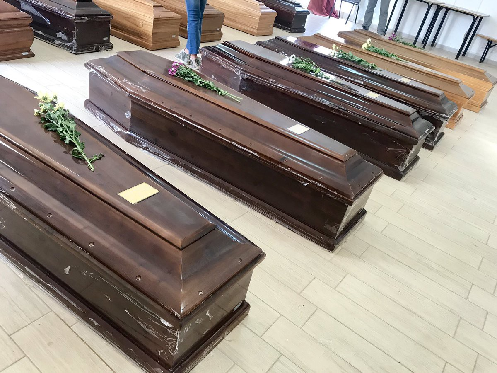

### AYS Daily Digest 08/10/19 Still no disembarkation plan after Interior Ministers’ Tuesday meeting

_Kurds in Northern Syria determined with “human shield” // proof of “rescued” people by LCG being tortured by LCG // 1071 people dead from the Mediterranean for 2019 // aftermath of Lampedusa shipwreck // and more…_
### Feature: Tuesday’s meeting between EU Interior Ministers, still no disembarkation plan

The mood of many towards the meeting of interior ministers on Tuesday, to discuss a cooperative disembarkation plan, may be encapsulated in this tweet:

■■■■■■■■■■■■■■ 
> **[Sea-Watch International](https://twitter.com/seawatch_intl) @ Twitter Says:** 

> > Yesterday, our #Moonbird crew had to search for over 25 people, whose lives were lost to the EU border regime off #Lampedusa in the night before.

Today EU ministers met in #Luxemburg to discuss the redistribution of future survivors — as a side note over lunch. Bon appétit! https://t.co/vWlrUqDp1X 

> **Tweeted at [2019-10-08 16:52:30](https://twitter.com/seawatch_intl/status/1181613347814412288).** 

■■■■■■■■■■■■■■ 

#### [The meeting came](https://www.euractiv.com/section/justice-home-affairs/news/pressure-grows-on-eu-member-states-to-agree-migrant-disembarkation-scheme/1388108/?fbclid=IwAR2RHR_h8s1wxUeNbxmCwPhyBHOWuiAA-jfNdOk4ruXESDI8fEUkyE7M1GE) due to mounting pressure for the EU to come up with a “sustainable and predictable” mechanism for disembarking those rescued throughout the three Mediterranean routes\.

[According to AP](https://apnews.com/71c03bc0abda485496b3d56c50ce46c3?fbclid=IwAR3bOdXcwJZeM8ErjNQ07Mm7FlaTLv90Z085FRlh_B3FIsJ1h7U3t8dmiPQ) : _“At a meeting of EU interior ministers, only Ireland, Luxembourg and Portugal offered to take part in the ‘fast\-track’ plan drawn up by Germany, France, Italy and Malta, which would screen migrants, relocate asylum\-seekers and return people who do not apply or qualify for asylum, all within four weeks\.”_

So [a stalemate continues](https://apnews.com/71c03bc0abda485496b3d56c50ce46c3?fbclid=IwAR3bOdXcwJZeM8ErjNQ07Mm7FlaTLv90Z085FRlh_B3FIsJ1h7U3t8dmiPQ) , but some officials are hopeful that by the end of the year, more than these 7 countries will be on board\. Human rights orgs have warned that without a stable disembarkation system, people will continue to suffer while countries deny letting them in\.

Here’s what the Council of Europe Commissioner for Human Rights, [**Dunja Mijatović**](https://www.coe.int/en/web/commissioner/-/commissioner-mijatovic-calls-for-bolder-measures-to-protect-the-human-rights-and-dignity-of-all-migrants-in-the-mediterranean) had to say in regards to agreeing on a disembarkation mechanism:

> “Solving the question of disembarkation is important, but care must be taken that this does not come at the expense of human rights protection in other areas\. Particularly, the welcome introduction of a disembarkation and relocation mechanism must not result in the expansion of member states’ actions that may lead to the return of people rescued at sea to places where they face serious human rights violations\. Today, member states have a chance to prevent further disastrous human rights and humanitarian consequences by suspending any co\-operation activities with the Libyan authorities that impact on interceptions at sea and result in returns to Libya, until clear guarantees of full human\-rights compliance are in place\. Enhancing transparency and accountability for the human rights impact of co\-operation with third countries should be central to any further development of European migration policy\.” 

> “Other crucial steps include expanding search and rescue capacity; providing safe and legal routes; co\-operating constructively with NGOs; ensuring that instructions issued by member states to shipmasters do not lead to returns to places where migrants can suffer human rights violations; and preventing the transfer of responsibility for coordinating rescue operations to authorities that clearly do not respect human rights\.” 

[As Sea Watch puts it](https://sea-watch.org/en/common-position-on-jha/?fbclid=IwAR2ehdevRGfebcUNNVuZxduubLCaAf-wEadotBBPs073se9ARzry1eIRIzw) , “the question of a fair and human needs\-based relocation mechanism remains unresolved\.” Below is a list of guidelines issued by Sea Watch and many other NGOs as to what needs to happen next:
#### “In order to meet these concerns, the signing organisations wish to share a set of guidelines in light of the Council of JHA Ministers and having as reference the Joint Declaration of 23 September 2019 resulting from the mini\-summit in Malta:”
1. Temporary relocation as an accompanying measure
2. Specific protection and human needs\-oriented criteria for relocation in full compliance with international human rights law, refugee law, and EU asylum law
3. No pre\-screenings
4. No ports’ rotation mechanism
5. Integration of merchant vessels
6. Integration of Municipalities
7. Sanction mechanism for non\-adhering countries\.
8. Debunking the “pull factor” argument
9. Review engagement with and support to the so\-called Libyan Coast Guard
10. Safe and legal routes as priority in the cooperation with third countries
11. Review rules of engagement of aerial surveillance and complement with naval assets

### Kurds in Syria
#### The Kurds are vowing to form a “human shield”…

…up against the Turkish border of Syria in order to defend themselves from Ankara’s long envisioned, “safe zone” which would be used to force the Kurdish people out\. The “safe zone” is petitioned as a way to house Syrian refugees, but would most definitely be used against the Kurds, who the Turkish government sees as terrorists\. Yet the Kurds, allies in the fight against ISIS, are currently gathering in the towns of Ras al\-Ain, Tal Abyad and Kobane to stage open ended sit ins\.

Many experts are worried that US President’s Trump’s rash decision to withdraw troops from this region will lead to Kurdish ethnic cleansing\. With the unraveling of the US President, it would be catastrophic domino effect to the whole region and refugee crisis, if the Kurdish people are harmed in his suggested appeal to Erdogan and Putin\.

For more comprehensive analyses, please look [here](https://www.truthdig.com/articles/the-domino-effect-of-trumps-syria-withdrawal/) and [here](https://www.aljazeera.com/news/2019/10/pullback-northern-syria-key-questions-answered-191007141408983.html?fbclid=IwAR2pGgSEhzq1MRoj1uXBPr5E4XYwO2EkAJ3Ls_Q-Dd4-bzC6hf_Hz1qyVzQ) \.
### Turkey

![“Yesterday **a boat with 12 people went down** west of Karaada island, Cesme, Turkey\. They managed to send out a distress message, and Turkish Coast Guard was immediately alerted\. Turkish Coast Guard sent out a helicopter and several vessels, and was able to locate 11 people, 4 children and 7 adults\. One person, the smugler who was the driver of the boat has not been found, and it’s believed that he managed to get to shore by himself\. This could have gone terribly wrong\. **Information was received in time, and was forwarded to TCG** \. Without this information they most likely would have picked up lifeless bodies from the sea\.” Photo by [Aegean Boat Report](https://www.facebook.com/AegeanBoatReport/posts/666371437219297)](assets/c8a9b0984926/1*hg8xppes_v-u1EZWnYNvZg.jpeg)

“Yesterday **a boat with 12 people went down** west of Karaada island, Cesme, Turkey\. They managed to send out a distress message, and Turkish Coast Guard was immediately alerted\. Turkish Coast Guard sent out a helicopter and several vessels, and was able to locate 11 people, 4 children and 7 adults\. One person, the smugler who was the driver of the boat has not been found, and it’s believed that he managed to get to shore by himself\. This could have gone terribly wrong\. **Information was received in time, and was forwarded to TCG** \. Without this information they most likely would have picked up lifeless bodies from the sea\.” Photo by [Aegean Boat Report](https://www.facebook.com/AegeanBoatReport/posts/666371437219297)
### Libya

[Journalist Sara Crete](https://twitter.com/saracreta/status/1181681376854188032) provides an excellent thread of resources into the limitations, self imposed and otherwise, on the registration system of UNHCR in Libya\. Only 9 nationalities are accepted for registration, in part to try to keep the numbers down\.

■■■■■■■■■■■■■■ 
> **[Sara Creta](https://twitter.com/saracreta) @ Twitter Says:** 

> > The reality is that people keep disappearing from detention centres on a daily basis. 

Registration is a right for asylum seekers &amp; refugees wherever they are, but in #Libya being registered do not offer any form of protection. 

> **Tweeted at [2019-10-08 21:22:58](https://twitter.com/saracreta/status/1181681415026597889).** 

■■■■■■■■■■■■■■ 

People have tried many means of getting UNHCR’s attention in order to have them registered, in fear that if not, they would disappear\.

■■■■■■■■■■■■■■ 
> **[Sara Creta](https://twitter.com/saracreta) @ Twitter Says:** 

> > In al-Khoms, in one week at least 100 detainees disappeared &amp; despite the closure of the centre, the #Libya-n coast guard continued to bring refugees to al-Khoms detention centre. [euronews.com/2019/10/03/unh…](https://www.euronews.com/2019/10/03/unhcr-in-libya-part-4-the-detention-centres-the-map-and-the-stories) https://t.co/xNCFcogbPx 

> **Tweeted at [2019-10-08 21:23:00](https://twitter.com/saracreta/status/1181681423155159040).** 

■■■■■■■■■■■■■■ 

New evidence of torture in Libyan detention centre Zawiyah, outside Tripoli:

](assets/c8a9b0984926/1*1Cx5Em1nSnBBIQVknXkaLA.jpeg)

Photo by sources at the detention centre, provided by [Anette Kjær Jørgensen](https://www.facebook.com/anettesaw?__tn__=%2Cd%2AF%2AF-R&eid=ARCd-q5ymCHubFFaUg_YHa6ZDUvF0zx7kOLBq9ubSJdPD8StsSng7oy3tOjthsVGgiuhFgDG8s1XtRjz&tn-str=%2AF)

> “The white pickup in the picture here just unloaded new prisoners\. The prisoners are then escorted behind the gate — which the arrows point at\. Behind the gate 40–45 prisoners are in this way tortured by human smugglers in order to get money out of them\. The victims comes directly from the Mediterranean Sea where they have been picked up by the Libyan coastguard\.” 

The people the EU is funding the Libyan Coast Guard to save, end up being tortured by their “saviors\.” Many sources have confirmed this evidence, reports [Anette Kjær Jørgensen](https://www.facebook.com/photo.php?fbid=10220604089277048&set=a.10200904910489890&type=3&theater) \.

In response to Tuesday’s JHACouncil meeting in Luxembourg, Sam Turner of MSF emphasized that the meeting “highlighted the lack of a unified approach\.”

■■■■■■■■■■■■■■ 
> **[MSF Sea](https://twitter.com/MSF_Sea) @ Twitter Says:** 

> > "Congratulatory statements on the reduction in arrivals to Europe fails to mention that the #EU’s material support to the Libyan Coast Guard has enabled the forced return of thousands of #refugees, asylum seekers and #migrants to #Libya, a country currently in conflict" : #MSF https://t.co/e1p2F7SJ0C 

> **Tweeted at [2019-10-08 20:09:55](https://twitter.com/msf_sea/status/1181663030750404608).** 

■■■■■■■■■■■■■■ 

### Sea
#### The number of Mediterranean fatalities in 2019 has risen to 1,071 people dead, after the recent shipwreck off the coast of Lampedusa, according to IOM\.

The tragedy which happened late Sunday night, early Monday morning, resulting in 30 people missing \(presumably dead\) and 13 bodies found \(all women\) \.

The 2/3 of the people who died in 2019, died in route from North Africa to Italy, otherwise known as the Central Mediterranean route\. For some data concerning routes, look [here](https://www.iom.int/news/mediterranean-fatalities-2019-rise-1071-latest-shipwreck-lampedusa?utm_source=Unknown+List&utm_campaign=8da8ba3f0f-EMAIL_CAMPAIGN_2019_10_08_08_45&utm_medium=email&utm_term=0_-8da8ba3f0f-&fbclid=IwAR3VkSSuejyjHzxLgyclG-f95y-OVV_VFyILqyy3eNg_fzxMNOiMW9YZ7LQ) \.

MSF continued to cover the Ocean Viking’s whereabouts in the face of this tragedy:

■■■■■■■■■■■■■■ 
> **[MSF Sea](https://twitter.com/MSF_Sea) @ Twitter Says:** 

> > UPDATE: Early this morning, #OceanViking resumed the relentless search in worsening weather conditions for bodies or survivors of the tragic #shipwreck off #Lampedusa, in which at least 13 women died and 4 children are still missing per Italian media reports. https://t.co/BUfxJMsggv 

> **Tweeted at [2019-10-08 09:19:26](https://twitter.com/msf_sea/status/1181499332308209665).** 

■■■■■■■■■■■■■■ 

And later Tuesday morning:

■■■■■■■■■■■■■■ 
> **[MSF Sea](https://twitter.com/MSF_Sea) @ Twitter Says:** 

> > UPDATE After 2 days searching for survivors of the latest tragedy off #Lampedusa, the #OceanViking has informed Italian authorites it would be proceeding south where we hope our presence can help prevent further loss of life. Our thoughts are with the victims &amp; their families https://t.co/QWHJDHferl 

> **Tweeted at [2019-10-08 18:37:28](https://twitter.com/msf_sea/status/1181639766036619265).** 

■■■■■■■■■■■■■■ 

[An AlarmPhone](https://twitter.com/alarm_phone/status/1181556865207017472?fbclid=IwAR0f0GJFWE9CWtwDRAZ_DBRI7bP8Y-a-5iI8YeasvSwsISd4MxwEdj3U7Ck) update on the Western Mediterranean: _“In the last 2 weeks, the Alarm Phone dealt with 5 distress cases in that region\. 2 boats were intercepted and brought back to Morocco & 3 boats made it to Spain, rescued by Salvamento Maritimo\.”_ You can find their full case reports [here](https://tinyurl.com/y5sklqbm) \.
### Greece
#### The living conditions and treatment of pregnant women on Samos may amount to degrading treatment under Article 3 of the European Convention on Human Rights \(ECHR\) \.

As [Refugee Law Clinic Berlin](https://www.facebook.com/rlc.berlin/posts/2616811991672674) reports:

> “Today, the European Court of Human Rights granted an interim measures in the case of a pregnant asylum seeker living in the camp on Samos\. Yesterday, we forwarded a request to the Court in Strasbourg on behalf of the 8 months pregnant woman that was left by the Greek authorities in the ‘jungle’ \(the forest around the camp\) on Samos\. She did not receive any support for more than 7 weeks\. Claiming that this violates her rights to be free from inhumane and degrading treatment\. 

> The judge on duty decided: ‘to indicate to the Government of Greece, under Rule 39, that they should guarantee to the applicant living conditions compatible with her state of health and to prioritize the assessment of her vulnerability status\.’” 

While this is a great step for the applicant, the Refugee Law Clinic reiterates that cases such as this one of degrading treatment are too common and more needs to be done to alleviate all forms of degrading treatment on the hotspots\.

[More than 500 people](https://www.tanea.gr/2019/10/07/greece/symi-esteilan-polemiko-ploio-na-paralavei-metanastes/) left the island of Symi on Monday afternoon to the mainland\. The infrastructure on Symi is extremely insufficient to protect refugees and asylum seekers\. Many people are living in outdoor, street camps\.

New Arrivals according to [Aegean Boat Report](https://www.facebook.com/AegeanBoatReport/photos/a.285312485325196/666379747218466/?type=1&theater) : 5 boats arrived on Tuesday with 199 people

First boat → Lesvos, 53 people \(28 children, 14 women, 11 men\)

Second boat → Lesvos, 24 people \(7 children, 8 women, 9 men\)

Third boat → Chios, 53 people \(29 children, 10 women, 14 men\)

Fourth and fifth boats were taken to port Chios → 38 people \(16 children, 7 women, 15 men\) and 31 people \(10 children, 11 women, 10 men\)

[Update from Kalymnos](https://www.facebook.com/groups/1420997938186432/permalink/2534112763541605/?hc_location=ufi) :

> “For the past several weeks, we have had weekly arrivals on the island of Kalymnos\. Upon arrival, the Port Police take them into custody before releasing them into a government\-run camp on one of the nearby islands\. Unfortunately, there are no facilities for the accommodation of so many people\. **So they are kept at the remains of what used to be the slaughterhouse\.** Only the front half of the building can be used…There are only 24 beds inside, so only the women and children may sleep inside\. Therefore, the men and unaccompanied minors sleep outside on the cement\. At any given time, we have 60–100 people… 

> To say that these people are suffering is an understatement… **They are told that they will leave in a few days but are left here for weeks on end\.** To be fair, local citizens have been doing their best \(bringing what\) they can, which is way beyond their means\. Doctors inside and outside the hospital have been providing them with medical attention, contrary to new laws that have been passed…Yesterday, Monday, nine men started a hunger strike…” 

■■■■■■■■■■■■■■ 
> **[Finn Sands Robinson](https://twitter.com/fsandsr) @ Twitter Says:** 

> > (1/2) In August and September, the Stage 2 Transit Camp, on the North Shore of #Lesvos, was being used more as temporary accommodation as the #authorities struggled to manage the influx of arrivals. #refugeesgr #receptioncrisis https://t.co/iaCsphWqUS 

> **Tweeted at [2019-10-08 09:14:43](https://twitter.com/fsandsr/status/1181498144246378496).** 

■■■■■■■■■■■■■■ 

■■■■■■■■■■■■■■ 
> **[Finn Sands Robinson](https://twitter.com/fsandsr) @ Twitter Says:** 

> > (2/2) Now, in October, as NGOs in #Moria attempt to winterize a camp 10,000 people over capacity—where many sleep outside—we have seen a transition back to almost immediate transfer times. Even today 139 people left the camp early morning. Is registration the only priority? 

> **Tweeted at [2019-10-08 09:14:45](https://twitter.com/fsandsr/status/1181498151703891969).** 

■■■■■■■■■■■■■■ 

### Italy

Aftermath of Lampedusa shipwreck:

](assets/c8a9b0984926/1*a4DfwknVX8K8O7QsCllt6A.jpeg)

“The ‘number 6’ coffin contains the youngest of 12 years\. From 1 to 13, young women\. Among the 17 missing an 8\-month\-old child out of hand to a survivor and a young man who had just warmed up with his jacket a survivor \# shipwreck \# Lampedusa \# Migrant\.” Photos by [Angela Caponnetto](https://twitter.com/AngiKappa/status/1181696029986562049?fbclid=IwAR06_EkYEee-MqZhUrN--8dYf6PjB6aweutysEdbpziUofPG4lzq6qn_0Nw)

On Thursday the the Cold Emergency Center in Via Bongioanni, managed by the Red Cross, will reopen\. They will have 6 additional places just for women\. The total number of beds is around 40 and people will have the chance to shower and have a small breakfast\. Find out more [here](https://www.lastampa.it/cuneo/2019/10/08/news/il-sottopasso-al-movicentro-di-cuneo-sara-chiuso-con-cancelli-1.37711636?fbclid=IwAR3bgPlqjNjCdK_WmUVWucBByG8nt6zcE7blDH8cnUzQSAOZzjRDPbnqd3U) \.

 is being persecuted for alleged „human trafficking” in Italy\. Now, they need your help: Did you or do you know anybody who crossed the Mediterranean Sea between 2016 and 2017 and got rescued by the rescue ship iuventa? If so, get in touch with them\!” More info at: [fb\.com/iuventa10](http://fb.com/iuventa10) Photo by Iuventa, message by [Watch the Med](https://www.facebook.com/watchthemed.alarmphone/posts/2471701189770776?hc_location=ufi)](assets/c8a9b0984926/1*iOjZdzbQmi7cEJA_RQ1g1w.jpeg)

“The crew of [Iuventa10](https://www.facebook.com/iuventa10/?__tn__=K-R&eid=ARDIof06Kx4VgKYOb4mol_oFT6XkQnxGwwsogbJ5Ojpu2hWmXgsmr86Y5z6l1YKlqO5VOrBelX1em7Re&fref=mentions&__xts__%5B0%5D=68.ARD9qAm8N-0ARPvYiqZ-DeCM09PTyvvg_1cMkFNMLvegMPuG84uBY4PwbDhAyyCNW0bWU0EuGUCdDG691WMowsJ9e4LJIyhxA5qyjLHrgnaDjd3gStkSkWXET_p4tdZgYPC3ZvCouznnl1y9y3xR5wRhx3ef_zAESuVhDiIdDGp_g3UT8ukA0-3jd2Mclgg8rD1YKz91-kFrHDNVXT26ewo7TrrLIq32h2bmSaKebu-0TB9UccYW_mxEFmGZu8IAVQ1VV25TDbH8_KE6MEuWMypx1pNS8HcguXEjmTEbhjCqRLn6uSoSXffb8FUgeeAu0nThUESeQjf0o9qU0HHxMRekrTw7) is being persecuted for alleged „human trafficking” in Italy\. Now, they need your help: Did you or do you know anybody who crossed the Mediterranean Sea between 2016 and 2017 and got rescued by the rescue ship iuventa? If so, get in touch with them\!” More info at: [fb\.com/iuventa10](http://fb.com/iuventa10) Photo by Iuventa, message by [Watch the Med](https://www.facebook.com/watchthemed.alarmphone/posts/2471701189770776?hc_location=ufi)
### Bosnia and Herzegovina

 ‎](assets/c8a9b0984926/1*iosN2l8LuBiQ69Iv6Si-dg.jpeg)

**Heartbreaking** “ A little, 6\-years old girl came alone without parents to Tuzla today\. Police stopped parents at the border and sent them back to Serbia…without her\. She came to Tuzla with a fever , scared and confused\. Authorities took care of her today and IOM is informed\!” Photo by [Selma Dzafic](https://www.facebook.com/photo.php?fbid=10219710242323336&set=gm.2577996682259917&type=3&theater) ‎
### France

[First Aid Support Team](https://www.f-a-s-t.eu/?fbclid=IwAR1rcGhGv8ClYALDJ2YsvOEM28knxApVb2OMPrgTEVcldQWbKdye3Zqwdrs) — FAST is in need of donations:

> “ → A few weeks ago on the 17th of September ‘the gymnasium’ located in Grand\-Synthe Dunkirk was evicted\. Since then hundreds of refugees have been left without shelter\. During the evictions clean water sources were also removed\. This combination of lack of shelter and clean water has led to severe conditions for refugees in Dunkirk\.
 

>  → Before the eviction took place, on average FAST provided first aid to 30–35 people at the ‘Lakeside’ camp in Grande\-Synthe, a short walk from the gymnasium\. Since evictions have taken place this has changed dramatically\. On average our team have treated 120–130 people each day\. \(Many\) refugees requir\(e\) wound care and infect\(ions are\) very common\.
 

>  → Please consider making a financial donation so that we are able to buy needed supplies in bulk or if you are a healthcare professional with time off in the coming weeks please consider coming out to volunteer with us\.” 

**If you wish to contribute, either by writing a report or a story, or by joining the info gathering team, please let us know\.**

**We strive to echo correct news from the ground through collaboration and fairness\. Every effort has been made to credit organisations and individuals with regard to the supply of information, video, and photo material \(in cases where the source wanted to be accredited\) \. Please notify us regarding corrections\.**

**Apart from daily news in English, we also publish weekly summaries in Arabic and Persian\. Find specials in both languages on our [medium site](https://medium.com/are-you-syrious/ays-weekly-in-arabic-and-persian/home?source=post_page---------------------------) \.**

**If there’s anything you want to share or comment, contact us through Facebook, Twitter or write to: areyousyrious@gmail\.com\.**

_Converted [Medium Post](https://medium.com/are-you-syrious/ays-daily-digest-08-10-19-still-no-disembarkation-plan-after-interior-ministers-tuesday-meeting-c8a9b0984926) by [ZMediumToMarkdown](https://github.com/ZhgChgLi/ZMediumToMarkdown)._
