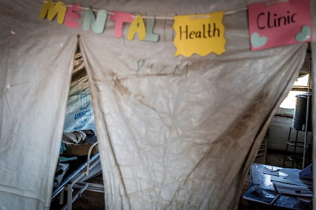
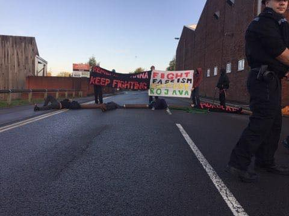
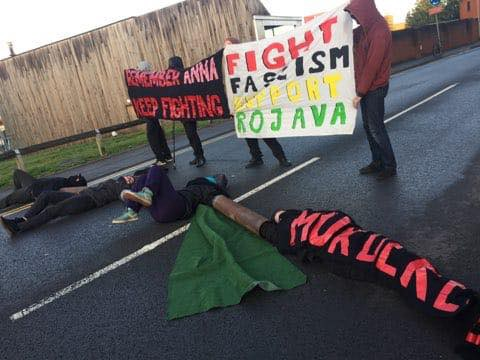
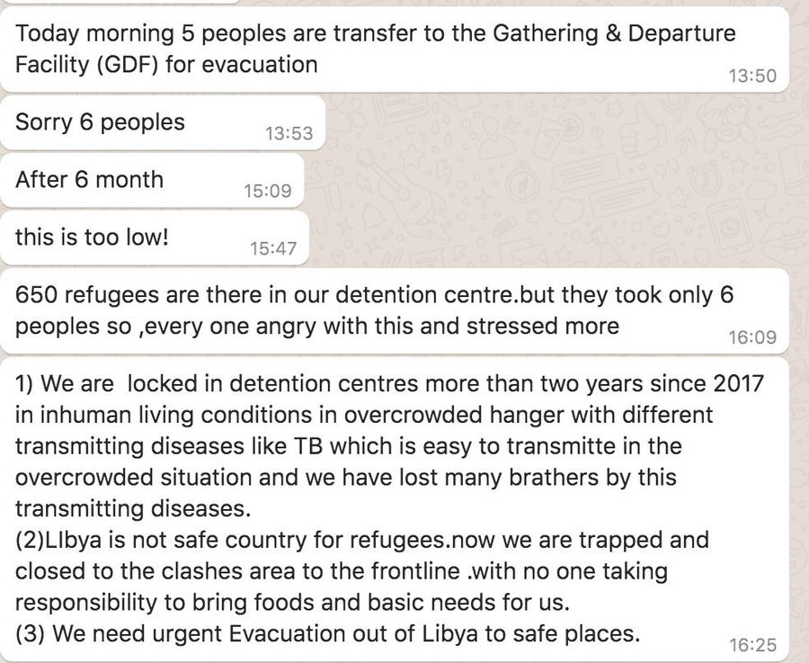
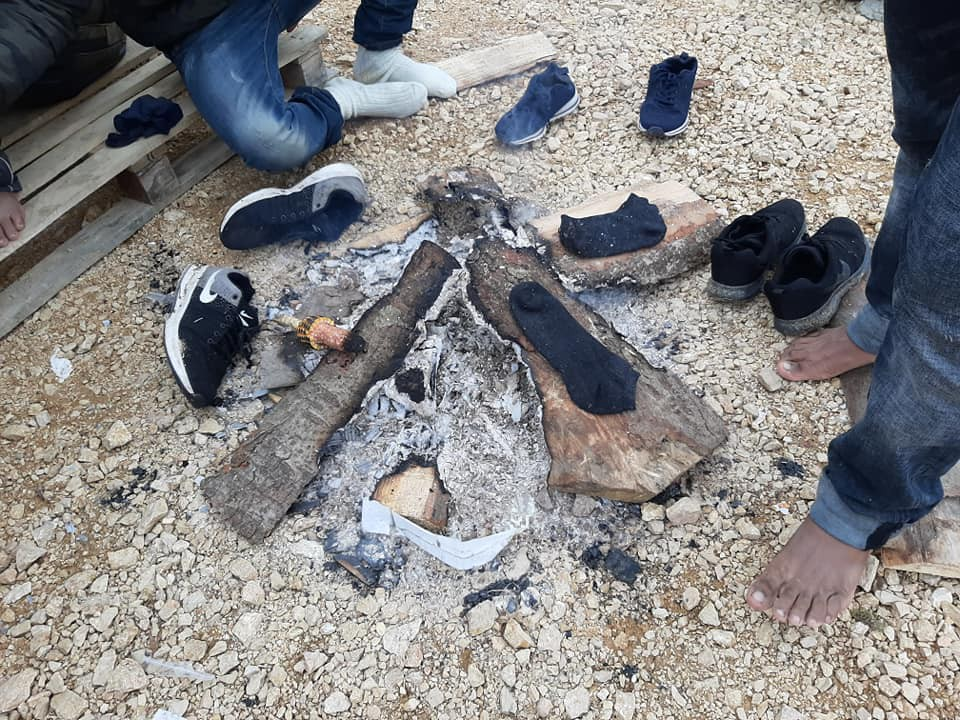
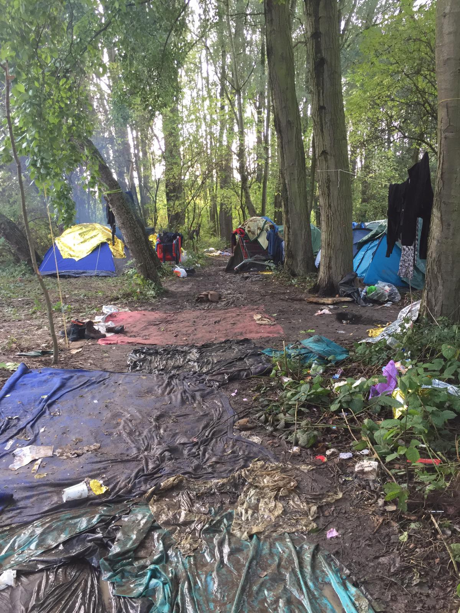

### AYS Daily Digest 10/10/19: World Mental Health Day — Psychological distress worse than ever, with new attacks, displacement and thousands stuck in inhumane conditions
#### Tens of thousands displaced people after first Turkish attacks in Syria / In Libya, UNHCR & IOM of whitewashing the deadly cost of European Union migration policy to safeguard tens of millions of euro of funding / Balkan Route still leaving scars for life on those who pass it / Need for help across France’s provisional campsites / & more news

Gael Cloarec/SOPA Images/LightRocket via Getty Images
#### FEATURED
#### More human suffering adding new displacement to what is already the largest displacement crisis in the world

Although the Nato’s secretary general and the EC president [appealed](https://www.reuters.com/article/us-syria-security-eu/eus-juncker-urges-turkey-to-halt-military-operation-in-syria-idUSKBN1WO1TD) to Turkey to avoid adding to the instability in Syria, without anyone’s direct opposition, as everyone knows, Turkey has invaded Syria\. Reportedly, among others, they are bombing Mansoura Dam in Derik which provides 2 million people with drinking water\. According to the statistics of the SOHR, the number of displaced people has exceeded 70,000 people\.

Reportedly, the **aid workers said they had been told to leave by their organisations, and most had done so reluctantly,** thus leaving unsupported the thousands of people who have been displaced multiple times during the war in Syria, having survived unsurmountable atrocities and violence\.

> In addition to the Syrian civilians in the north\-east, there are thousands of women and children living in camps across the area … who rely completely and exclusively on humanitarian aid\. Any interruption to camp services which are already overstretched would put their lives at risk\. — _Save the Children_ 

**Demonstrations and signs of opposition to the attack are present in different areas:**

In the UK, protesters in Bristol have blocked the entrance to BAE Filton, shutting down multiple businesses who trade with Turkey:

Photo: Friends of Kurdistan — Manchester

Emergency demonstrations have been scheduled for London, Tuesday in Liverpool, next Thursday in Manchester\.

 \)](assets/280c43629df8/1*p6tFLe1ZtYD5YgdTNoA08Q.jpeg)

Boycott against Turkish Airlines at Barcelona airport in support of Rojava for the invasion of Turkey \(Photo: [The Women’s Revolution in Rojava](https://www.facebook.com/WomenLifeFreedom/?tn-str=k%2AF&hc_location=group_dialog) \)

On World Mental Health Day [Side by Side : Humanitarian Aid to Refugees](https://www.facebook.com/SidebySiderefugees/?__tn__=%2CdkCH-R-R&eid=ARAdHmPigjXlP3lHAzsnuZm-pnAvu8Ojt3Q6KOK8TPeC0lT5oRL0mOMKPzkj6wrwnUTasklk-R8meCB_&hc_ref=ARTiR5teVp92mTPfPiWA-iQ57R0jfG8lSnpYCQqDAI2eiEEys70S3b40Q6vaUTD0LL4&fref=nf&hc_location=group) are extending support to include Volunteers who work both on the ground or remotely\.

> The mental health of humanitarian volunteers is vitally important\.
 

> We invite ANY Volunteer who feels they need professional help to connect with us at contact@sidebysiderefugees\.org 

■■■■■■■■■■■■■■ 
> **[MSF Sea](https://twitter.com/MSF_Sea) @ Twitter Says:** 

> > Being forced from home, having to take dangerous routes, being pushed back, detained, or held in limbo can have a dramatic impact on mental health. This world #mentalhealthday we honor all @[MSF](https://twitter.com/MSF) #migrant and #refugee patients around the world - their strength and resilience. https://t.co/Yollf47Ioe 

> **Tweeted at [2019-10-10 14:52:20](https://twitter.com/msf_sea/status/1182307886288064523).** 

■■■■■■■■■■■■■■ 

#### LIBYA

Messages from Abu Salim detention centre, Tripoli, on Monday:

Following this, at least eight people left the dc to go & find smugglers in Zuwara\. One was a 17\-year\-old, according to others still in Abu Salim, Sally Hayden reports\.

■■■■■■■■■■■■■■ 
> **[Sally Hayden](https://twitter.com/sallyhayd) @ Twitter Says:** 

> > One quote from an aid official in Libya that didn't make the final edit, when asked should the UN be representing the views of refugees &amp; what is the consequence of its inaction.
[foreignpolicy.com/2019/10/10/lib…](https://foreignpolicy.com/2019/10/10/libya-migrants-un-iom-refugees-die-detention-center-civil-war/) https://t.co/eE0lw8jMmj 

> **Tweeted at [2019-10-10 21:05:37](https://twitter.com/sallyhayd/status/1182401824940269568).** 

■■■■■■■■■■■■■■ 

> Aid workers in Libya accuse UNHCR & IOM of whitewashing the deadly cost of European Union migration policy to safeguard tens of millions of euro of funding\. 

■■■■■■■■■■■■■■ 
> **[MSF Sea](https://twitter.com/MSF_Sea) @ Twitter Says:** 

> > "In the detention centres, where they have no control over their lives, it is powerful for detainees to understand that their symptoms are a normal reaction to a very abnormal situation." - Dr. Heike Zander, #MSF Mental Health Activity Manager in #Libya 

#MentalHealthDay https://t.co/9RjsH59SAU 

> **Tweeted at [2019-10-10 18:35:52](https://twitter.com/msf_sea/status/1182364139668283394).** 

■■■■■■■■■■■■■■ 

#### MOROCCO

■■■■■■■■■■■■■■ 
> **[Ali Zoubeidi](https://twitter.com/DrAZoubeidi) @ Twitter Says:** 

> > 3 people (2 man, 1 woman ) from #Morocco were arrested ,yesterday ,  in #Tarifa  port for migrant smuggling. They used fraudulent documents to cross borders .
#migration #migrantsmuggling #borders #spain #EU #morocco 

> **Tweeted at [2019-10-10 19:46:57](https://twitter.com/drazoubeidi/status/1182382026235797504).** 

■■■■■■■■■■■■■■ 

#### SEARCH AND RESCUE AT SEA

[Salvamento Marítimo Humanitario](https://www.facebook.com/smhumanitario/?__tn__=K-R&eid=ARDOyGg68vmXuRmPvi9ZFFMUnOtEjzln3fna2GCMk0poPq74sd_1-wATS9DoJ3nQ4V5v6FnFPSRChbdh&fref=tag&__xts__%5B0%5D=68.ARCo3WbFEA0nHpIK164YkNhc_MTKO9cGvSPP7CaGw5ox220bVj4n6xQGcsLa15iwIEnJLhyI7YqV_AxPbW1KcqRcuM0Nca14lLr3YNJuyLFm6S_8GfCSVHssmqYC4IrJY7GcoHEh2KNHdw7f80eQyU0epQBflqvIPd6PEXQDKZrZiF3W90bulC1RkSXAVoqls9cEj5hdIAyIzXFc-55LTExA1dUSbPGyzhicsnQsJu7umn9ASeIOJnLRr1LsgrkFybHuCO5XVORauCntaKqcLJTVHi7_52ENU42gekDR9LAY3VRCqrhmNpGtAeh6AdjeL64hfv5dRtGh4m3WgUu2cYDSiizSX_qSzwIZhOjOjelb1BkWg_TfgkBSlaXjP4gs4LTgKCQI9tmmFasc8b5UOyjVEozIXmKl2E7YHbMJ6scQvKcko-_-5-3Ue4j40biaOMk2VuEsD70vFHPhtVDi_qQBJt3HWQL7jfd1Od_0m5bWGmOVSX92Uw) has finally received permission to proceed into the Mediterranean — without the permission to carry out rescue\.

**This is contrary to article 98 of the United Nations Convention\.**

In the past few days, the Spanish have loaded over seven tonnes of aids that they want to bring to the Greek Islands\. that they would be bringing to Lesbos next Wednesday, October 16, via Sicily\.
### WatchTheMed Alarm Phone turns 5

> 60 months during which we have come into contact with about 2,900 boats in the Mediterranean — 1,800 in the Aegean, 800 in the Western Med between Morocco and Spain, and 300 in the Central Med between Libya or Tunisia and Italy or Malta\. 1,800 days during which we were on standby 24/7\. 

> For our anniversary we are publishing a booklet, reflecting on our activities and experiences in support of thousands of travellers in the Mediterranean\. It is available in 3 languages and can be downloaded for free\! 

#### GREECE

Despite a growing body of research on how displacement impacts mental health, many people live in squalid conditions and with no to scant mental health resources\.

People stacked among trees and reeds, fields full of dirt, plastic and paper, children in the mud and soil, a sharp smell of sewage running through broken pipes, and hundreds of people scattered around private properties in the surrounding area, these are all scenes that have become more and more permanent and tragic, every day, away from the spotlights on the islands of Lesvos and Samos, [media reporters note](https://www.politischios.gr/koinonia/bi-al-otan-oi-lexeis-khanoun-to-noema-tous-mprosta-sten-eikona?fbclid=IwAR1vI1EucRcnD1TjccYIb1xCOWxKydwsdm5XfKYz_Um7rrW9Lg24meCphKg) \.

Roughly 57 % of all refugees and migrants that reached Europe in 2019 so far arrived in Greece, InfoRefugees [report](https://l.facebook.com/l.php?u=https%3A%2F%2Ftwitter.com%2FInfoMigrants%2Fstatus%2F1182256712750784512%3Ffbclid%3DIwAR3-J7Ukt09xlcPbQkLjYjHjKVpZ9fDUr8pt5JwPdWuuJLW6hywxUOviqTc&h=AT3H8_oRl2Ng82nJ2gWpd3j_I_sLh9GBqsMwQ9qNHBJKaxIoMG4iOjV356XUHHogH_KXyT4wU9FoA3XgyQpKQgHWeOjU2QVy07x-M8EojQss6r2yiZIXKdS6G30Ndi_vPVFqgRe123P4Tw) \. The month September had 55 landings of boats that had 1881 newly arrived people\. Arrivals are still in rise\.

■■■■■■■■■■■■■■ 
> **[joel hernàndez](https://twitter.com/joelhdz) @ Twitter Says:** 

> > "The dinghy they arrived on had water seeping into the back, and appeared to be deflated. At least some of the life jackets the #migrants brought with them were fake."

Thank you @RefugeeRescueUK
for the work you do.

#refugeesgr #lesvos #humanitarian
[cbsnews.com/news/greece-mi…](https://www.cbsnews.com/news/greece-migrant-crisis-16000-migrants-have-fled-to-lesbos-this-year-only-one-humanitarian-boat-left-to-help/) 

> **Tweeted at [2019-10-10 15:49:00](https://twitter.com/joelhdz/status/1182322144006623233).** 

■■■■■■■■■■■■■■ 

The psychological distress is worsening for 12,800 children, women, and men who face overcrowded conditions in Moria\. Reportedly, only five schools in Mytilene received refugee children into schools for secondary education\.
### ECHR decides on the detention of unaccompanied minors

The ARISIS\-Social Youth Support Organization filed the application for interim measures, complaining of “conditions that constitute inhuman and degrading treatment” in the case of the 20 young people detained on 20 September in AT Kolon — 14 of them were held for reasons of protective custody and 6 for administrative expulsion\.

The European Court of Human Rights today, on 10 October 2019, issued a ruling on interim measures pursuant to Article 39 of the European Convention on Human Rights \(ECHR\), in which it points out to the Greek Government:

• the transfer of unaccompanied minors detained to police stations and brought to the ECtHR in appropriate accommodation facilities;

• ensuring that the minors are accommodated in accordance with Article 3 of the ECHR and their special status\.

Furthermore, the ECtHR set a deadline for the Greek Government until 11:00 tomorrow to reply:

• Conditions of detention of unaccompanied minors transferred from the Police Departments to the Pre\-Trial Detention Center in Amygdaleza and the impact of such detention on their psychosomatic development

• The actions of the Greek authorities for the transfer of the above minors to appropriate minors and their relative transfer time\.

In addition, the ECtHR seeks a response to the actions taken by the Authorities so far to appoint a Commissioner to all children who have applied to the ECtHR, and to ensure the reception of such children in accordance with Article 3 of the ECHR, including a child who has has already been transferred to a “safe zone” at the Reception Center in Ritsona Attica\.

ARISIS [says](https://www.efsyn.gr/ellada/dikaiomata/214244_asfalistika-metra-kata-tis-kratisis-asynodeyton-anilikon-apofasizei-edda) that in addition to the unaccompanied minors who are still detained in the Kolonos Police Department, many minors are also detained in other police stations, and in addition to the 70 unaccompanied minors still held in PROKEKA Amygdaleas\.
### Thessaloniki

Greek police [say](http://www.ekathimerini.com/245363/article/ekathimerini/news/vehicle-crammed-with-migrants-crashes-near-thessaloniki-3-dead?fbclid=IwAR3rsIp8BsfKYYsCJ58lfOHKetq02vUtiPmaNXdLv04XJ_cILdfEd9XIPyo) three people have been killed in northern Greece and another 12 were injured when “a vehicle crammed with migrants crashed into an oncoming car and fell off a cliff”\.
#### BOSNIA AND HERZEGOVINA

> When Nour’s transit group was apprehended in a Croatian forest, he saw his friend being severely beaten on the head by Croatian police officers which resulted in a bleeding wound\. Nour stopped running and tried to convince the officers to not beat him, telling them about his asthma\.
 

> “I showed my ventolin spray to them when they approached me with their batons, I showed it so they spare me\. I was afraid of having my head smashed\. They hit my friend and another one, and two others\.” — [_Border Violence Monitoring Network_](https://www.facebook.com/borderviolencemonitoring/?__xts__%5B0%5D=68.ARDUoDwGrHzHPD7EGNUY-Ett9xzaswYT8GSgyYRauKv2VaWwRq2xXxamHF3U1TuYPgJUyCac0kY9xV6pfHGLnYW9VEBscKg7FxKN0tEd0eMdmzs2SR7WfPqf4BLhPuoyl-GVduQQrDPx9yzTR2OS6c9FJMmviLFNnrXEWAlyrh-VELEit8z69cEmEA4wL0nQrydXd4G7H50rzK6YKr03fqhgLjQb6lWntQ0_z33rwihYjU2EnActQbUOqSXdi_bmpcY3eqbf-sq77npWMYc_noNz-TQAiX2gH1aYEZ_xtps-SEDk20ikm7NiwkWNPenfC70AUmfabBAal6JH4XwLSRM&__tn__=k%2AF&tn-str=k%2AF) _reports_ 

In Velika Kladuša, local media reported a death of a person they think was a refugee migrant\. The person was reportedly hit by a car in an accident that happened close to Podzvizd\.

Ključ, Bosnia and Herzegovina — still one of the most desperate stations on the route to the west\. Photo: Sanella L\.
#### ITALY

](assets/280c43629df8/1*57GgmiIOgF_00UhMBKuAeQ.jpeg)

In Trieste \(Italy\) peeople arrive with new wounds after having passed the ‘Balkan Route’ — Photo: [Lorena Fornasir](https://www.facebook.com/lorena.fornasir?__tn__=%2Cd%2AF%2AF-R&eid=ARDFNU0msZz-KbnHmyPZVEUe9tSEP1n6u0GIH7ehUJJ7HhWZjVu_7IEYYwwX-c1-W3z3d3yNrAtAyV3E&tn-str=%2AF&hc_location=group_dialog)

Prosecutors have criticised over jailing of Eritrean man wrongly identified as human trafficker, read the story [here](https://www.theguardian.com/world/2019/oct/10/italian-judges-find-serious-neglect-in-mistaken-identity-case?fbclid=IwAR3-7_CqDZ64FEkKTzFlB2FJb7GCpvYPMIykqajML9ajH7JUpmj_GDr5hDM) \.
#### FRANCE
### RWC and Mobile Refugee Support’s urgent fundraiser

“We are collecting funds to buy tents and sleeping bags for displaced people sleeping rough in Grande\-Synthe\. Following the recent eviction and dispersal of around 1000 women, men and children from municipal shelter, hundreds have returned to the area\. Most are sleeping rough without any access to stable shelter, sanitation or safe drinking water\. The eviction, a very ’temporary’ intervention, has created great uncertainty for the community with many not knowing what will happen to them from one day to the next\.
It has also put an immense strain on aid organisations, who are working tirelessly to meet people’s needs\. The weather has taken a turn for the worse; it is windy, rainy and cold\. People are sleeping on wet ground\. Adults and children are wrapping themselves in cling film to stay warm\.

Since the eviction on the 27th of September RWC has distributed over 90 tents, an average of 6 tents a day, and of course this has rapidly exhausted our stock\.”

**£8 can buy a 1\-man tent\.** 
**£18 can buy a 4\-man tent\.** 
**£14 can buy a winter sleeping bag**

](assets/280c43629df8/1*5H6PQKx619z-Cmqz_xyE0A.jpeg)

Photos: [Refugee Women’s Centre](https://www.facebook.com/refugeewomenscentre/?tn-str=k%2AF&hc_location=group_dialog)

**If you wish to contribute, either by writing a report or a story, or by joining the info gathering team, please let us know\.**

**We strive to echo correct news from the ground through collaboration and fairness\. Every effort has been made to credit organisations and individuals with regard to the supply of information, video, and photo material \(in cases where the source wanted to be accredited\) \. Please notify us regarding corrections\.**

**Apart from daily news in English, we also publish weekly summaries in Arabic and Persian\. Find specials in both languages on our [medium site](https://medium.com/are-you-syrious/ays-weekly-in-arabic-and-persian/home?source=post_page---------------------------) \.**

**If there’s anything you want to share or comment, contact us through Facebook, Twitter or write to: areyousyrious@gmail\.com\.**

_Converted [Medium Post](https://medium.com/are-you-syrious/ays-daily-digest-10-10-19-world-mental-health-day-psychological-distress-worse-than-ever-with-280c43629df8) by [ZMediumToMarkdown](https://github.com/ZhgChgLi/ZMediumToMarkdown)._
