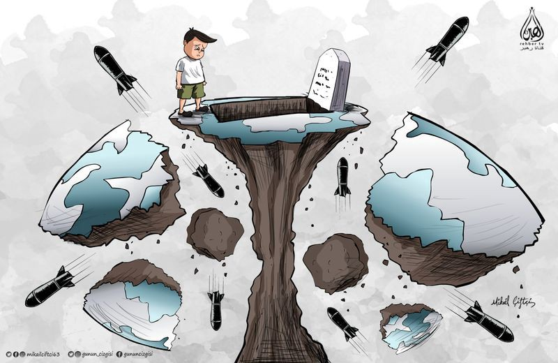

### AYS Weekend Digest 12–13/10/2019: Inadequate relocation from Libyan hell
#### New tragedy off the Turkish coast /// 176 people rescued by Ocean Viking /// 110 people forcibly returned to Tunisia /// Critical conditions in Messina hotspot /// Another “code of conduct” for NGOs in the Central Med?

Today is the 7th day since the start of the Turkish invasion in Northern Syria\. While many European countries still sell weapons to Erdogan’s regime, the military operation has already forced more than 130,000 people to flee their homes, killed more than 200 people, targeted camp hospitals, doctors and civilian convoys, and allowed more than 800 ISIS prisoners to escape\. Turkish\-backed Syrian paramilitary groups are already suspected of war crimes\. \(Artwork by by Mikail Çiftçi\)
### Featured: LIBYA — Inadequate relocation from hell

According to [UNHCR](https://www.unhcr.org/uk/news/briefing/2019/10/5da040054/second-life-saving-evacuation-vulnerable-refugees-libya-lands-rwanda.html) , 123 people have been evacuated from Libya to Rwanda, 59 of whom are children under the age of 18, including one boy who had been held in detention for 2 and half years\. They state that 3,740 people are still in detention having been “rescued or intercepted” by the Libyan Coast Guard\.

However, [MSF](https://twitter.com/MSF_Sea/status/1182928891700101120?fbclid=IwAR0EWwSkPnetf3lCyoXvYBRvaBvtAtMDsgr01KmORdG_knKw720aMceq6fM) put the figure of those in detention at over 5000\. It is of course difficult to get accurate figures from an active war zone\. One which the EU and Libyan Coast Guard returns people to almost every day\.

Those “rescued” then end up in diabolical and often life threatening situations\.

\(Video Credit: Giulia Tranchina\)

[Reports](https://web.facebook.com/rastajuly/posts/10157010326288621) from Libya also question the assessment process for relocation to Rwanda and state that UNHCR has given no explanation as to the criteria being used in choosing who is evacuated\.

> _132 registered in 2017 are still abandoned in \#Zintan\. All refugees are similarly vulnerable sick & traumatised\. How is UNHCR choosing? Is it based on bribes to the Libyan police, or totally random, or on requests by the Libyan bosses of the centre,…? EU governments are deporting thousands and thousands of refugees back to torture rape and slavery in Libya and evacuating tiny numbers\. It’s a disgusting hypocrisy and full responsibility in crimes against humanity\._ 

[UNHCR](https://www.unhcr.org/uk/news/briefing/2019/10/5da040054/second-life-saving-evacuation-vulnerable-refugees-libya-lands-rwanda.html) say that they use a vulnerability assessment\.

> _The number of available evacuation and resettlement places is not enough to meet the needs, so efforts are made to prioritise those most in need, often including unaccompanied children, survivors of torture and other abuses, people in need of medical treatment, amongst others\._ 

Yet all of these vulnerabilities can simply come about through exposure to detention in Libya\. Further reports from Sabaa attest to the slave like conditions\.

At the same time, Ethiopians who were moved from detention centres to the UNHCR GDF \(Gathering and Departure Facility\) centre have [reportedly](https://twitter.com/sallyhayd/status/1183033810985848832?fbclid=IwAR2EhmC6z60BkyxlmwFWevB4pLlAsDsDqLjmNSN5V1H0AzR56ZeCbqvHo7k) been told they must return to Ethiopia\. It is unclear if anyone has reviewed their asylum claims\.

Still a mess\. Still illegal\. Still deadly for people seeking safety\.

EASTERN MEDITERRANEAN ROUTE

Alarmphone received a distress call on Sunday night about a boat capsizing in Turkish waters\. They informed both Turkish and Greek Coast Guards\. The boat was rescued by Turkish authorities but one child died and one infant is still missing\.

We at AYS want to express our solidarity with those who were trying to reach safety during this latest avoidable tragedy\.
### Open Arms is back on the Eastern Aegean sea

“Again in Greece, now with the Astral, on a mission through the Aegean, sailing between the islands of Rhodes, Samos, Kos, Kalimnos, Chios and Lesvos\.”
### Arrivals in Greece

Aegean Boat Report [informs](https://web.facebook.com/285298881993223/posts/669271890262585/?_rdc=1&_rdr) us that at least 12 boats reached the Greek eastern islands on Saturday 12th, carrying 125 people\.

According to [government data](https://infocrisis.gov.gr/6380/national-situational-picture-regarding-the-islands-at-eastern-aegean-sea-10-10-2019/?lang=en) this was the situation of the major islands on Friday: 13,364 people in Moria, Lesvos \(capacity: 2,840\); 4,039 in Vial, Chios \(capacity: 1,014\); 5,747 in Vathy, Samos \(capacity: 648\); 2,076 in Leros Hotspot \(capacity: 860\); 3292 in Kos Hotspot \(capacity: 816\) \.

In stark contrast to the plain numbers released daily by authorities, both MSF Italia and the Hope Project, who are present in Moria, have published updates on the harrowing situation in the camp and its surroundings:

> _Moria camp alone has over 14\.000 people_ 
 

> _It’s capacity is 3\.000\! \! Over 4000 children\!_ 

> _In the Olive Grove are approximately 550 unaccompanied children who are fending for themselves, some as young as 10\!_ 

> _\[…\] Everyday unaccompanied boys are turning up at The Hope Project, along with urgent cases referred to us by MSF as well as assisting all the medical groups with the ongoing treatment of scabies\. \( [The Hope Project](https://web.facebook.com/HopeProjectKempsons/photos/a.1666442723636853/2448983168716134/?type=3&theater) \)_ 

As [reported](https://twitter.com/MSF_ITALIA/status/1182781908306026496) by MSF, children do not go to school, and the overcrowding of the camp means that people have to queue for hours to get food, often “a bag with an egg, a tomato and a snack”\. Food runs out everyday\. As a consequence, MSF are treating more and more people with [chronic health issues](https://twitter.com/MSF_ITALIA/status/1182773198527647745?fbclid=IwAR1mqsdaa2GHmce30yoUxk-oPJL8PHs2trG2RCGNgK2m5cZbyUAlum_g6wY) \.

The Hope Project need your help\. Read more and support them [HERE](https://www.justgiving.com/44e6360a9c?fbclid=IwAR1GuMJaZZCoSBCMpd-iK1IG3xUe7pdFfYu1MdNhFtWWEVONd9wwgg_Tbr4) \.
### Transfers to the mainland

Greek media [report](http://www.ekathimerini.com/245360/article/ekathimerini/news/despite-talks-migrant-flows-continue?fbclid=IwAR2n5ZrmN8q8v8H-hDIPuhSbDMWL1GfbqDcvmDcoZq_1iYDGZZd8N7AK7yM) that 389 people were “ferried to Piraeus port Wednesday from the island of Symi in the southeastern Aegean and were transferred by bus to six camps on the mainland — in Corinth, Thiva, Doliana, Filippiada, Skaramanga and Koutsohero — as part of an ongoing plan to decongest island camps”\. Political calculations are nonetheless putting this very plan at risk\. Special Secretary for Reception Manos Logothetis reportedly stated that speeding up transfers from Symi to the mainland will risk an increase in the flow of people from Turkey to the island\. There are plans to open a temporary structure to host people arriving to the island, who have so far been sleeping rough\.
### CENTRAL MEDITERRANEAN ROUTE

Thanks to the activity of [Alarm Phone](https://twitter.com/alarm_phone) , Ocean Viking rescued two boats respectively [40](https://twitter.com/MSF_Sea/status/1183373679276843008) and [50](https://twitter.com/MSF_Sea/status/1183155170093535234) miles off the Libyan coast, carrying 176 people who are now on board the MSF and SOS Mediterraneé vessel\. They all seem to be in a stable condition\.

Two media reports \( [1](https://www.independent.com.mt/articles/2019-10-13/world-news/176-migrants-rescued-off-Libya-110-others-turned-back-6736214733?fbclid=IwAR3ynDSLzax-6n-NnVTqJXmEQHCnsrAEgQc_58cL2fyKbCabIYoXMEo5psI) and [2](https://www.repubblica.it/cronaca/2019/10/13/news/migranti-238419053/?fbclid=IwAR1J6tz1fdxdeXSlQj2qvEorfQsEF5jJpCzqr4QCxGj-rAk6v8KFhZfjZFE) \) state that one more boat, carrying 110 people was stopped by Tunisian authorities off the coast around Sfax and was forcibly returned to the North African country\. People trying to flee to Europe put up a strenuous resistance, but Tunisian authorities sent 8 coast guard vessels to force them back\.
### Arrivals in Italy

Mediterranean Hope, Alarm Phone and Italian media report \( [1](https://twitter.com/Medhope_FCEI/status/1183400225697943552?fbclid=IwAR1faNfxJ_TVsanMpPzD4bM618zHbNW4F5Die2SEKvdB2YBS51ciYudenLg) , [2](https://twitter.com/Medhope_FCEI/status/1183399979982958594?fbclid=IwAR3zj6bjidvkHGjQaW7oEmBewnbj7IDxgakROofwZaLYF-FP2wWYL7pwno0) , [3](https://twitter.com/alarm_phone/status/1183642063604191232) , [4](https://www.repubblica.it/cronaca/2019/10/13/news/migranti-238419053/?fbclid=IwAR1J6tz1fdxdeXSlQj2qvEorfQsEF5jJpCzqr4QCxGj-rAk6v8KFhZfjZFE) \) that during the weekend at least 6 boats reached Lampedusa\. Three landed autonomously, and one was rescued not far from the island\. They carried around 160 people\. Two of the boats reportedly set sail from Tunisia, while at least one came from Zuwarah in Libya\.
### Critical conditions in Messina hotspot

Three associations — [ASGI](https://www.asgi.it/) , [Borderline Sicilia](https://www.borderlinesicilia.org/) and [ActionAid](https://www.actionaid.it/) — published an [open letter to Italian authorities](https://www.borderlinesicilia.org/hotspot-di-messina-criticita-nella-redistribuzione-dei-migranti-la-denuncia-di-asgi-borderline-sicilia-e-actionaid/?fbclid=IwAR3_28fBAC8gGTckVrv0pKHwI7Qh-HRaK1FYN6vnXD1pLGE1EMn2zeO_YSs) regarding the situation in Messina hotspot, in Sicily, after having been allowed inside to monitor living conditions\.

The associations stress the need to guarantee private and family life, with separate accommodation for couples, single women and minors\.

Access to food, water and hygiene items also need to be improved\.

Residents need to be registered with the national health system in order to guarantee full access to health care and to allow much needed referrals to hospitals\. They need to be able to access psychological support services, both inside and outside the hotspot\.

Legal assistance was also found lacking, especially during the “redistribution” proceedings\. The associations stressed the importance of providing a proper interpretation service\. Too often, it is only available for a few languages or through the support of other residents, which raises privacy and deontological issues\.
### A new code of conduct of humanitarian SAR organisations?

In a interview with an Italian newspaper, Luciana Lamorgese, the new interior minister, proves she is not going to change the approach to migration started by Minniti in 2017\. While affirming that she wants to start a dialogue with humanitarian rescue organisations, she also stated that this dialogue will have to start from the code of conduct proposed by the ex\-minister Minniti in 2017\. **What Lamorgese forgot to mention in her interview is that none of the organisations active today signed that code, those who opposed it more loudly \(Jugend Rettet, for example\) saw their vessel seized and are still facing serious charges in Italian tribunals, those who did sign it have moved away from the Central Mediterranean route\.**
### WESTERN MEDITERRANEAN ROUTE

76 people were [rescued](https://www.europapress.es/andalucia/almeria-00350/noticia-trasladan-almeria-76-personas-ellas-12-menores-rescatadas-patera-alboran-20191013102848.html) by Salvamento Maritimo in the Alborean sea and were transferred to Almeria, Spain\. Another boat was [rescued](https://twitter.com/112canarias/status/1182934204000145411?fbclid=IwAR13W5DLQoN70G19pnoAgTW6tuQcOqTqHs0F9wgfXrYsvK1UASMQlyKd0lU) off the Canary Islands, but at the time of writing no details have been published\.

**FRANCE**

[Refugee Community Kitchen](https://web.facebook.com/donate/2482883698465104/2321274398089920/) are fundraising to buy new vans so that they can continue their mobile distribution\. An invaluable service for those who depend on them for hot meals\.

> _Refugee Community Kitchen relies on its vehicles\. The perpetual evictions \(five days a week\) by the local police mean that we must be mobile and able to serve people where ever they can find brief moments of safety\. Furthermore, that ongoing harassment has lead to miserable, dangerous conditions which means that our teams must be able to evacuate at a moment’s notice\. Fully functioning vans are absolutely essential to our operations\!_ 

**Apart from daily news in English, we also publish weekly summaries in Arabic and Persian\. Find specials in both languages on our [medium site](https://medium.com/are-you-syrious/ays-weekly-in-arabic-and-persian/home?source=post_page---------------------------) \.**

**If you wish to contribute, either by writing a report or a story, or by joining the info gathering team, please let us know\.**

**We strive to echo correct news from the ground through collaboration and fairness\. Every effort has been made to credit organisations and individuals with regard to the supply of information, video, and photo material \(in cases where the source wanted to be accredited\) \. Please notify us regarding corrections\.**

**If there’s anything you want to share or comment, contact us through Facebook, Twitter or write to: areyousyrious@gmail\.com\.**
### [Are You Syrious?](https://medium.com/are-you-syrious?source=post_sidebar--------------------------post_sidebar-)
#### Daily news digests from the field, mainly for volunteers and refugees on the route, but also for journalists and other parties\.

_Converted [Medium Post](https://medium.com/are-you-syrious/ays-weekend-digest-12-13-10-2019-inadequate-relocation-from-libyan-hell-8ae1f7bbfb2c) by [ZMediumToMarkdown](https://github.com/ZhgChgLi/ZMediumToMarkdown)._
