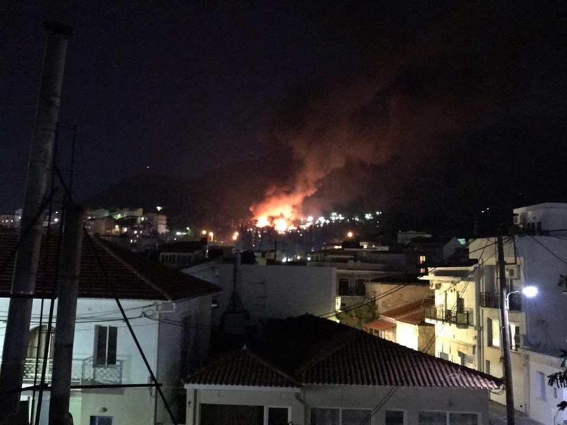
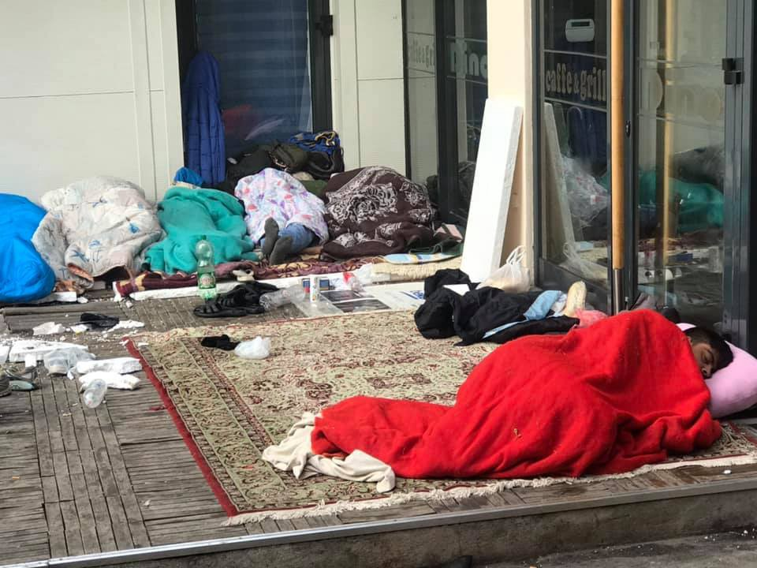
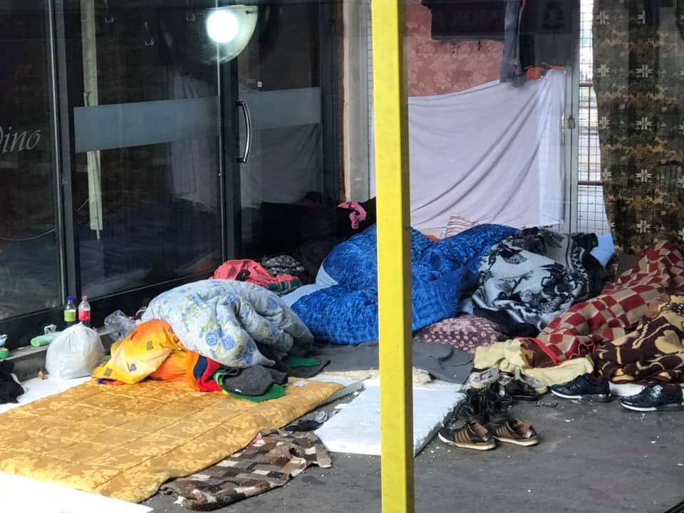

### AYS Daily Digest 14/10/19: Residents in Samos evacuated after intense fire breaks out
#### More children losing their lives while trying to reach Europe// Videos of horrible living conditions in Chios// Rising number of people transiting through western Serbia// Safe port assigned to Ocean Viking// 285 people reached Italian coasts\. \.

Credit: Omar Alshakal\.
#### FEATURED STORIES

Reports of a fire breaking out in Vathy, Samos, have been published in the evening\.

Apparently, the fire started as a consequence of a fight between residents of different nationalities, which resulted in three men sustaining injuries\. When asylum seekers started to exit the camp holding up pieces of wood to continue the action, riot police and locals rushed to the spot in order to “contain” them\. Police used tear gas\.

Original source [here](https://www.keeptalkinggreece.com/2019/10/14/samos-hot-spot-fire/) \.

One young unaccompanied boy was also allegedly stabbed during the fights\. Official confirmation of this information is still missing\.

It is clear that [forcing around 6000 people to live in a camp designed for 650](https://twitter.com/TihomirSabchev/status/1183834335650156544?fbclid=IwAR0OUK-I3yp18QRYeKC36Kwj_oI9kJJHpl2YXptPgc5-MQyxw4CErYL7I5o) is a crime\. There are almost no safety measures in place for the people\.

Especially with winter approaching, authorities should know, by now, that people need alternatives to keep themselves warm and should not be lighting fires in such environment\.

Thousands of people have been evacuated and are now on the streets with no safe place to go to\.

Those in need of medical help should be directed to Med’EqualiTeam\.

More videos of the tragedy can be found [here](https://www.facebook.com/omar.alshakal/posts/762625567511689?hc_location=ufi) and [here](https://www.facebook.com/24samos/videos/469012020365853/?hc_location=ufi) \.

Despite the horrible news of [the fire in Moria](ays-weekend-digest-28-29-9-2019-e6cb7231c9a9) , where one woman lost her lives, no one lifted a finger to change the living conditions in Vathi hotspot\.

Early this morning, one child and one infant died when the boat they were travelling on capsized off the Turkish coast, around Aivali\. 33 people were rescued and are now undergoing treatments\.

■■■■■■■■■■■■■■ 
> **[IOM Türkiye](https://twitter.com/IOMTurkiye) @ Twitter Says:** 

> > Two children drown off the coast of Ayvalık, Turkey this morning. 33 other migrants and refugees were rescued alive from the sinking boat by the #TCSahilGuvenlik. Some were taken to a local hospital for treatment. https://t.co/PgWqCHFEGC 

> **Tweeted at [2019-10-14 08:00:25](https://twitter.com/iomturkey/status/1183653772423323648).** 

■■■■■■■■■■■■■■ 

As stated by Aegean Boat Report:

> This is the third drowning in three weeks, when will enough be enough\. \. 

A second shipwreck was, thankfully, avoided when a boat carrying 25 people was stopped by the Turkish Coast Guard before reaching Lesvos\. All of the people on board were not wearing a life jackets\.

#### MORNING UPDATES FROM SAMOS

The fire was extinguished soon after midnight and there is no clear estimation of the damage caused and injures sustained, yet\.

More than 250 people, including women and children, [found refuge](https://www.facebook.com/govoninicolo/posts/2506930529397853?hc_location=ufi) for the night at Mazì, an education centre on the island\.

More updates will follow during the day\.
#### EASTERN MEDITERRANEAN

**_Greece_**

UNHCR has published an updated version of their report on Greece, concerning the latest developments on the situation for unaccompanied minors in the country from January until September 2019\. So far, 12,900 children have arrived to Greek coasts, of which 2,100 unaccompanied\. See full report [here](https://data2.unhcr.org/en/documents/download/71703) \.

Moreover, [Amnesty International calls on the Greek government](https://www.amnesty.org/download/Documents/EUR2512132019ENGLISH.PDF) to take concrete steps to ensure that asylum seekers, unaccompanied minors and children have guaranteed access to health care\.

**_Arrivals_**

According to [this source](http://www.ekathimerini.com/245475/article/ekathimerini/news/more-than-120-migrants-rescued-in-east-aegean-on-monday-morning?fbclid=IwAR23wN1LyW7I9R3jwPUrHPcr3v6v8B4LptZJVg18H6auD6U3yA6AuRqJaG0) , 121 people have been rescued by the GCG this morning, in two separate incidents\. By the end of the day, [8 boats had reached Greek soil](https://www.facebook.com/AegeanBoatReport/posts/670738806782560?hc_location=ufi) , carrying 336 people in total\.

**_Lesvos_**

■■■■■■■■■■■■■■ 
> **[Franziska Grillmeier](https://twitter.com/f_grillmeier) @ Twitter Says:** 

> > In the last 7 days, 21 boats arrived to #Lesvos carrying 791 asylum seekers. Over 13,500 in #Moria (among them 1,000 unaccompanied minors). The camp was initially equipped as a transfer camp + never changed since, while new arrivals get interviews scheduled in 2021. #refugeesgr 

> **Tweeted at [2019-10-14 10:45:00](https://twitter.com/franzieire/status/1183695190424461312).** 

■■■■■■■■■■■■■■ 

[A group of locals prevented an Open Arms’ vessel to dock](https://www.efsyn.gr/node/214767) at the Skala Sykamia’s port today, throwing stones at the boat\. Police did not investigate the case\.

**_Chios_**

Videos of conditions inside hotspot\.

■■■■■■■■■■■■■■ 
> **[Law&order.gr](https://twitter.com/Lawandordergr) @ Twitter Says:** 

> > 🎥 Αυτοψία του «L&amp;O» στο κέντρο κράτησης της Χίου. Δείτε αποκλειστικά πλάνα από τις άθλιες συνθήκες διαβίωσης των μεταναστών-προσφύγων.

#Refugeesgr #Χιος #μεταναστευτικο #προσφυγικο #lawandorder https://t.co/b9SbSLTVGk 

> **Tweeted at [2019-10-14 09:42:50](https://twitter.com/lawandordergr/status/1183679548916936704).** 

■■■■■■■■■■■■■■ 

■■■■■■■■■■■■■■ 
> **[Law&order.gr](https://twitter.com/Lawandordergr) @ Twitter Says:** 

> > 🎥 Το "L&amp;O" βρέθηκε στη δομή καταυλισμού μεταναστών-προσφύγων της Χίου και κατέγραψε αποκλειστικές εικόνες από το εσωτερικό του!

#Refugeesgr #Χιος #hotspot #Syria #Συρια #μεταναστευτικο #προσφυγικο #lawandorder https://t.co/bL0Upj3jwG 

> **Tweeted at [2019-10-14 09:44:24](https://twitter.com/lawandordergr/status/1183679940597833728).** 

■■■■■■■■■■■■■■ 

A total of [55 people landed](https://www.facebook.com/groups/421759534684819/) on the island in the late evening and early morning, including 25 children\.

**_Athens_**

[Music activities for children and women’s choir](https://www.facebook.com/events/2369147076636965/) are taking place on Wednesday 16th October\. Join Musikarama for these workshops\!

**_The Balkans_**

Border Violence Monitoring has published today their [September report](https://www.borderviolence.eu/wp-content/uploads/September-2019-Report-1.pdf) \.

> Dog attacks, and the rising use of K9 units by border officials across the route illustrated some of the most brutal elements now common place within the pushback apparatus\. Analysis of Croatia and Hungary’s persistent use of dogs in apprehending and attacking transit groups revealed multiple cases of serious abuse, including the hospitalization of bite victims\. Alongside this, the use of border rivers to enact pushbacks was identified as a consistent method\. Fifty percent of direct pushbacks recorded this month from Croatia included the use of rivers to immerse transit groups in cold water\. These cases often included people being stripped of clothing by the police, and connect up to a common pool of torture\-like practices which were covered this month, such as the use of a child’s swimming pool to humiliate a transit group apprehended in Hungary\. 

[More than 100–150 people are stuck in **_western Serbia_**](https://www.facebook.com/AzilUSrbiji/photos/a.183319961827854/1352773958215776/?type=3&theater&ifg=1) , at the border with BiH, most of them being families with children and unaccompanied minors\. The numbers are raising everyday, despite the harsh living conditions and the extreme lack of services, as people have nowhere to sleep and are forced to stay in abandoned buildings or outside, on the streets\. [APC/CZA](https://www.facebook.com/pg/AzilUSrbiji/posts/) is offering legal service to help them lodge asylum applications and potentially gain access to reception structures\.

Shoes siezed 40 to 45 and socks are needed in **_Tuzla_** \. [Get in touch](https://www.facebook.com/permalink.php?story_fbid=108986593850646&id=108916427190996&hc_location=ufi) if you can help\.

Tuzla in the morning of 15/10\. Credit: Senad Cupo\.
#### CENTRAL MEDITERRANEAN

Criminal practices deployed by European institutions at sea, as [75 people intercepted by Maltese authorities are left stranded](https://www.facebook.com/watchthemed.alarmphone/posts/2476801532594075?hc_location=ufi) with no food nor water\.

Meanwhile, [a second boat with 80 people has lost contact](https://twitter.com/alarm_phone/status/1183863481747066880?s=21&fbclid=IwAR1d-nwRyZwosqJOGD32O2LS60sA_9vxrjq6gdeEb6M3e2IaR9qMuOJ1d8c) with Alarm Phone\.

■■■■■■■■■■■■■■ 
> **[MSF Sea](https://twitter.com/MSF_Sea) @ Twitter Says:** 

> > BREAKING: the Italian authorities have assigned the port of Taranto, south #Italy, as a place of safety to the #OceanViking. 
We’re relieved that the 176 survivors will reach safety without unnecessary delay &amp; we urge the #EU leaders to agree on a stable disembarkation mechanism https://t.co/X5bwc2LxJm 

> **Tweeted at [2019-10-14 17:51:50](https://twitter.com/msf_sea/status/1183802609934749699).** 

■■■■■■■■■■■■■■ 

**_Italy_**

[177 people were rescued](https://twitter.com/AngiKappa/status/1183647710966173696?fbclid=IwAR2hy0JLkDKFsdPgaugc4x39YMc6w35NCVykp5Z9YxAp4Md0SFZueQztSr0) and taken to Lampedusa by the ICG and the Guardia di Finanza, while 108 reached the country through the Jonio sea\.

Intersos published a very comprehensive report about their work in the informal settlements around Foggia, Puglia, where field workers are exploited by the mafia system for cheap labour and no rights\. The NGO offers medical check\-ups, social health orientation and individual employment orientation to the workers\.

> From the social\-health and employment data collected in the INTERSOS Capitanata project a picture emerges of the living conditions of the inhabitants of the settlements, a young population where the age bracket most represented are 18–29\-year\-olds \(59%\) \. 

> \[…\] in the age bracket of young adults the quota of new adults \(18–21\-year\-olds\) is very significant, representing a full 34% of the 18–29\-year old age bracket\. Of the new adults, 70% arrived in Italy as minors, a figure that rings as a defeat for the pathways earmarked for the safeguarding and insertion of minors\. 

**Apart from daily news in English, we also publish weekly summaries in Arabic and Persian\. Find specials in both languages on our [medium site](https://medium.com/are-you-syrious/ays-weekly-in-arabic-and-persian/home?source=post_page---------------------------) \.**

**If you wish to contribute, either by writing a report or a story, or by joining the info gathering team, please let us know\.**

**We strive to echo correct news from the ground through collaboration and fairness\. Every effort has been made to credit organisations and individuals with regard to the supply of information, video, and photo material \(in cases where the source wanted to be accredited\) \. Please notify us regarding corrections\.**

**If there’s anything you want to share or comment, contact us through Facebook, Twitter or write to: areyousyrious@gmail\.com\.**

_Converted [Medium Post](https://medium.com/are-you-syrious/ays-daily-digest-14-10-19-fire-in-samos-causes-destruction-and-death-7d6871df56d3) by [ZMediumToMarkdown](https://github.com/ZhgChgLi/ZMediumToMarkdown)._
