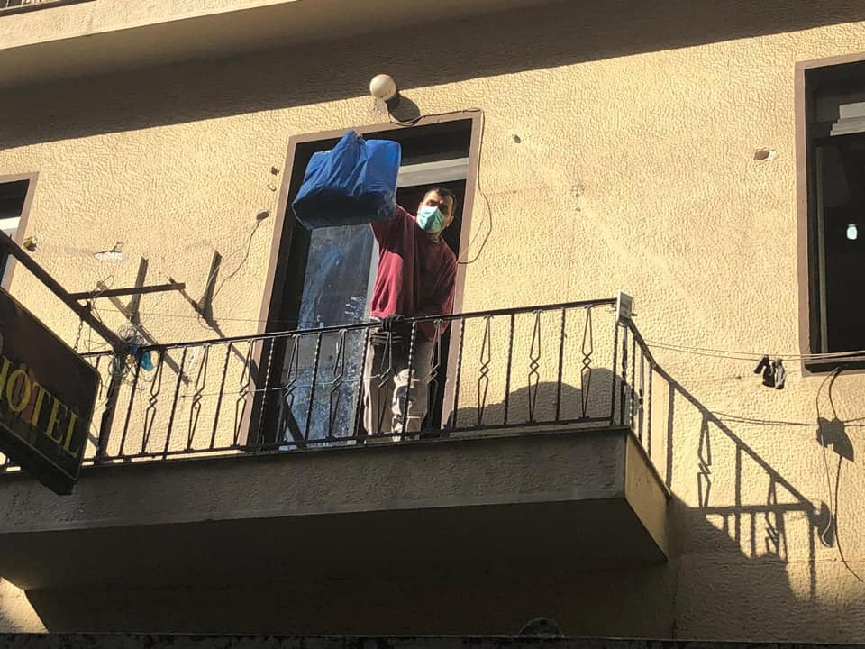
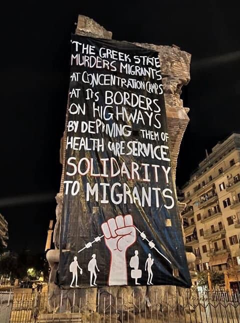
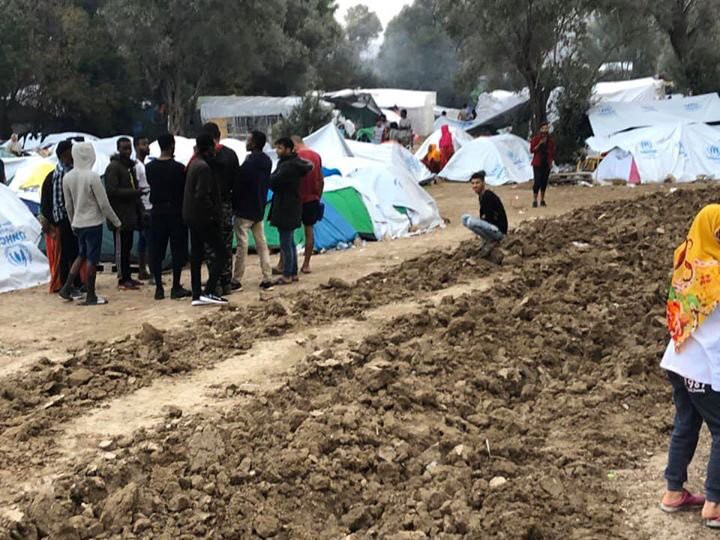
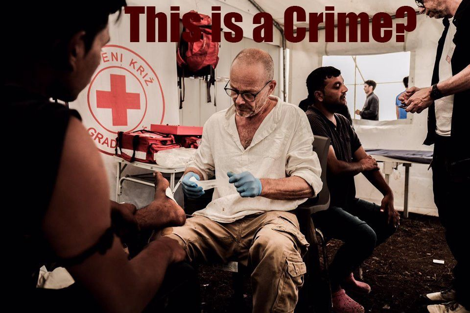

### AYS Daily Digest 16/10/19: Displaced by the war in Syria, and later evicted in the European Union

_The fighting in northeastern Syria is causing huge civilian suffering / EU puts more pressure on Greece to improve conditions in camps and speed up asylum / 33,120 people on the Greek islands now, according to the Aegean Boat Report / In Sweden municipalities pressure the state about lack of funding / Reports of violence on the French\-Italian border / And more news…_

Two new evictions in Athens happened on Wednesday morning\. Photo: NoBorders
### FEATURE: Displaced by the war in Syria, and later evicted in the European Union

The night between Tuesday and Wednesday was a busy one in Athens when police again decided to evict refugees living in two different squats\. There is information coming from NoBorders about how **policemen pointed their automatic guns at the refugees, forced them onto the ground and also punched a man in the stomach\.**

There has been a clear increase in the police repercussions in Greece since the right\-wing New Democracy\-led government won the elections in early July this year\. **As seen in the tweet below, straight up lies are being spread in the media** \. At the same time, there has been a sharp increase in arrivals to the Greek islands and the Turkish president and his ministers have threatened to “open the gate” to the EU\.

■■■■■■■■■■■■■■ 
> **[NoBorders](https://twitter.com/Refugees_Gr) @ Twitter Says:** 

> > This photo used today by mainstream media supporting government and police evictions of refugee squats in Athens, is NOT from the Oneiro hotel eviction which hosted people (it’s from an abandoned building). Do not trust their propaganda. #refugeesgr 

> **Tweeted at [2019-10-16 17:11:11](https://twitter.com/refugees_gr/status/1184517153308979206).** 

■■■■■■■■■■■■■■ 

**But let us have a look at the developments on the other side of the Aegean Sea, beyond the Turkish border with Syria\.** The fighting in northeastern Syria following the Turkish invasion on 9 October has forced 130,000 to 200,000 people to leave their homes\. Of them, at least 70,000 are children, according to [UNICEF\.](https://www.unicef.org/press-releases/nearly-70000-children-displaced-violence-escalates-northeast-syria) **Reaching Greece, or even Turkey, won’t be easy\. And is Greece even equal to safety anymore?**

**The use of guns against those escaping war zones on European soil is just disgusting\.** They have had enough of European guns already, as many European countries only recently stopped their weapon and munition exports\.

**The Turkish president Erdogan’s aim is, according to himself, to create a safe zone, a so\-called buffer zone, in the areas in northeastern Syria\.** Rojava, which is the name of this region, was declared independent in 2013\. It has since then been under the control of the Kurds, where YPG is the armed branch\. Rojava is the Syrian area of Kurdistan — a still not officially recognized state consisting of four different and much\-discussed areas in mainly Iraq, Syria, Iran, and Turkey\.

**By placing 2 million Syrians in the “safe” buffer zones Erdogan wants to create in northeastern Syria, he would not only get them out of Turkey— but they would also be farther away from Europe\.** The thing is though, that most of the Syrians now living in Turkey did not live in these areas before they fled\. Instead, it’s a well\-thought\-out way of changing the demographics in the area, according to [analysis in many papers](https://www.haaretz.com/middle-east-news/.premium-trump-is-complicit-in-erdogan-s-ethnic-cleansing-of-the-kurds-in-syria-1.7963502) \.

**Several papers and analysts have labeled the plan as ethnic cleansing\.** Erdogan’s desire is not to end the war in Syria peacefully\. [The Washington Post](https://www.washingtonpost.com/opinions/2019/10/11/international-community-must-stop-turkeys-ethnic-cleansing-plans-northern-syria/) calls the information that Turkey is taking over the fight against ISIS “dangerous propaganda”\. **Erdogan’s aim is to return many of the 3\.6 million Syrians currently residing in Turkey** , of whom the lion’s share came from other parts of Syria to northeastern Syria\. By doing so he will make sure that the Kurds, Turkeys long\-time enemies, disappear from the Turkish border areas\. Instead, he will place Sunni\-Muslim Syrians there\. Where the Kurds will go is not yet sure — some speak of their mass displacement in the region\.

**Meanwhile, many EU governments have announced over the past days that they have stopped arms exports to Turkey** \. They have been proud of this — and this has been seen as a statement\. Some have stopped ongoing affairs, and some have stopped any further requests of munitions\. **Unfortunately, guns and other products produced for war live long lives\.**

For example, the Swedish government has not exported munitions for fighting \(such as actual guns\) to Turkey since 2017, while the export of other kinds of strategic products, which could mean surveillance systems and ammunition, was not stopped until Tuesday this week\. **By the time** **countries decide to end their export of arms during an ongoing war, a lot of the damage is already done\. But of course, this is better than nothing\.**

Now Syria is burning again\. **And this time the EU and other parties “have done enough” already\.**
### SEA
#### Ocean Viking returning

Ocean Viking will soon be back in the SAR zone, after disembarking 176 people in the port of Taranto in southern Italy\. As you can read in previous tweets — many suffered physical violence in Libya\. [Here is the whole thread](https://twitter.com/MSF_Sea/status/1184433162031640576?fbclid=IwAR3iOMPbac3hrTcBg1LOO0aVfD0S8cnQvSOKut0opstzhncMQEZJeGhUMGo) where the recently disembarked people’s experiences are described\.

■■■■■■■■■■■■■■ 
> **[MSF Sea](https://twitter.com/MSF_Sea) @ Twitter Says:** 

> > UPDATE: the #OceanViking is heading back south to the central #Mediterranean to pursue its life-saving mission, as hundreds of people continue to risk their lives at sea to flee #Libya regardless of the increased danger with fast-changing weather conditions. https://t.co/xir8jdcIT7 

> **Tweeted at [2019-10-16 16:31:37](https://twitter.com/msf_sea/status/1184507195876085765).** 

■■■■■■■■■■■■■■ 

#### Left at sea

Another boat was left drifting in the waters between Libya and Lampedusa, according to reports [on Twitter](https://twitter.com/AngiKappa/status/1184559667810316291?fbclid=IwAR0reV7qZH6AU7v9GjUUR1FYhmtmG2E8-4rbR-PdWCehIA4mzU44M72Z1hM) \. On board were 70–80 people, but the Libyan coast guard did not respond to the calls\.
#### EU’s Operation Sophia is questioned

Since March this year, Operation Sophia, or EUNAVFOR MED, hasn’t had any naval patrols in the central Mediterranean — said to be the deadliest waters in the world\. Instead, they have been patrolling from the air\. When a boat in distress is discovered, EU’s Operation Sophia alerts the competent authorities, including the Libyans\.

The journalist Zach Campbell has written a lot on the topic before, and in this thread, he questions Operation Sophia and its spokespersons\. _Sophia’s argument for supporting the Libyan coast guard is that they just pass off locations to what they consider to be the competent rescue authority, but don’t actually participate in the return of people to Libya,_ Campbell writes\. In fact, this in breach with the principle of non\-refoulment — but by using a proxy the defenders of Operation Sophia are getting away with it\. Whole thread below\.

### GREECE

The EU commission is putting more pressure on Greece to speed up the asylum procedure and to improve conditions in the camps\. “Urgent action” by the Greek authorities is needed, the Commission stated on Wednesday\. They also announced more support to Cyprus, since the country is facing an increased number of arrivals\.

_While the EU\-Turkey statement continues to deliver concrete results, renewed migratory pressure in Turkey and instability in the wider region continues to cause concern\. In view of this, urgent action must be taken to improve reception conditions, increase transfers to mainland Greece from the islands and increase returns under the statement,_ the statement said according to [Ekathimerini\.](http://www.ekathimerini.com/245570/article/ekathimerini/news/eu-urges-greece-to-improve-conditions-in-migrant-camps-speed-up-asylum)

Protest in solidarity with refugees in Thessaloniki\. Photo: NoBorders
#### Information about the new asylum law

There are reports coming from organizations and NGOs that the Greek government's new asylum law will be implemented soon\. The time frame for human rights experts to examine and comment on it is only until 21 October\. We hope to share more information about this very soon as many people on the move in Greece will be affected\.
#### Arrivals — 33,120 people on the islands now

Over the past 15 days, the daily average of departures from Turkey towards Greece has been 980 people and 28 boats per day, [Aegean Boat Report](https://www.facebook.com/AegeanBoatReport/?__tn__=kC-R&eid=ARB500wtQdD52D1mFZhq18sIsdnziaBgPwSh2q9I29hMSMjM_Dwhw9dl2CLINK_BTay2Prt6-HZDg-WK&hc_ref=ARTj-ybsXHbILOM2aIUnX2LT4LXWIs-Yfihsxz3bidK6Fh14aqcUhpS0UXjf2MPy_ww&fref=nf&__xts__%5B0%5D=68.ARBqh9IKNULXjFwX5NBg17VAr_By_MSyWMpGfHYnKXKNb1qGEj_AaLYdXTteqwQoX4v0sgvEzca6u-xOFirKKopgzD7-O0tydYzmzBs8Z8MidwKQghDbFHCiosCYw1AF69k4Luhk13UN2j7QhkcNdSzXzUSi0Hv_DIW7nC9qVOnG2J_o-isR9n5hyPTd-RPIopWINvedSjZfih8wO6lx_tFyhtREbIOZUkUsEZ6_WFmy01D_jKbOVw_7dXDxVNUZbdbwEk0LFMYGiEI--QI74EuFo44_viV-Mv8-fgc1O5zkGkmNh-Rs3YLISU9VKICJTWOXOJ-lXrxBWt4ekM3QULw) reports\. Not all of them arrive\. While 14,711 attempted to reach the Greek islands — only 4,655 arrived on the Greek shores\.

So far this year 119,152 people tried to leave Turkey\. Of those, 41,237 have arrived in Greece\. In other words, more than twice as many people as those who succeed are willing to risk their lives in a small boat\. There were 162% more arrivals during the first 15 days of October this year than there were last year\.

As is also mentioned in today’s feature, [Aegean Boat Report](https://www.facebook.com/AegeanBoatReport/?__tn__=kC-R&eid=ARB500wtQdD52D1mFZhq18sIsdnziaBgPwSh2q9I29hMSMjM_Dwhw9dl2CLINK_BTay2Prt6-HZDg-WK&hc_ref=ARTj-ybsXHbILOM2aIUnX2LT4LXWIs-Yfihsxz3bidK6Fh14aqcUhpS0UXjf2MPy_ww&fref=nf&__xts__%5B0%5D=68.ARBqh9IKNULXjFwX5NBg17VAr_By_MSyWMpGfHYnKXKNb1qGEj_AaLYdXTteqwQoX4v0sgvEzca6u-xOFirKKopgzD7-O0tydYzmzBs8Z8MidwKQghDbFHCiosCYw1AF69k4Luhk13UN2j7QhkcNdSzXzUSi0Hv_DIW7nC9qVOnG2J_o-isR9n5hyPTd-RPIopWINvedSjZfih8wO6lx_tFyhtREbIOZUkUsEZ6_WFmy01D_jKbOVw_7dXDxVNUZbdbwEk0LFMYGiEI--QI74EuFo44_viV-Mv8-fgc1O5zkGkmNh-Rs3YLISU9VKICJTWOXOJ-lXrxBWt4ekM3QULw) points out that:

> Turkey's new offensive in Syria is forcing more people to flee for their lives\. Erdogan threatens to open the gates to Europe for the 3\.6 million refugees living in Turkey, and the camps on the Greek Islands are burning\. You don’t need to be a rocket scientist to see where this is going\. 

[More details here\.](https://www.facebook.com/AegeanBoatReport/posts/672001443322963)

](assets/35d8e3279881/1*rBttYQ2qIKaG7o8AY4Ke2w.jpeg)

Photo: [Aegean Boat Report](https://www.facebook.com/AegeanBoatReport/?__tn__=%2CdkCH-R-R&eid=ARBtyJOpgk8QjmYKbOQeGoTI1dOH2bgYIq_fvQH5FU1F2ITA-XupW7qUomtJ3CQ-sHCQtpF0SrSVYVYU&hc_ref=ARRyqTRciZDVpx71zUzL-_UnI3kNBja8ES_gaj5eJdDvhe2hhuG6V1dKoCyvUfGRiHw&fref=nf&hc_location=group)
#### Samos mayor: Move people to better conditions

After a fire broke out at the hotspot in Samos two days ago, the island’s mayor today gave the central government in Athens 48 hours to move refugees and migrants to better living conditions, off the island\. More [here](https://l.facebook.com/l.php?u=http%3A%2F%2Fwp.me%2Fp90JIO-2Kl5%3Ffbclid%3DIwAR1vKAE7Y23nCAXN1LhOBegikqSgOW5ttD4CNmMsWHg91ITjaaVZFPrjgfg&h=AT0PL6JiqwlBdz3ZMKAHOP1bqn_2dwjSEJYFHdNXXBU9XH5DxSpZ_ZuudDr0pcjb9cuRCV8p5f4XU_YSgkFOpdsMMZ-joGVDp_uVaEsaDUDCiRto7ynN_C-sOj5sIvqGvEBL522rZclbBpD3x10) in Greek\.
#### Chios — forced to move tents

In Chios, the owners of the fields surrounding the Vial hotspot started plowing their fields with tractors\. The refugees living here due to the overcrowding in the camp were thereby forced to move their tents\. More information [here\.](https://twitter.com/Refugees_Gr/status/1184537404113412103)

Photo: NoBorders
#### Human Rights Watch arriving at Lesvos

Human Rights Watch researcher Eva Cosse comments on how much Moria has grown since before the summer when she was there last time\. It is “an open\-air prison”\. As [Aegean Boat Report](https://www.facebook.com/AegeanBoatReport/?__tn__=kC-R&eid=ARBDwBj4MJzXiFJBcETC9zYzsNLegGkhb9ImyJfPPDUbk9JMQAQtBPkHgquWEejUCyPS__2uC2lDrTua&hc_ref=ARTecyegRaUD4OpxZLO4NXjq2_z0zp9L5HsNQKf6svOU-jiAJuQ-rJZbxU4__mllMPE&__xts__%5B0%5D=68.ARAvGkYtsPD-VhXNNMTzjW8Dejp4zZAVp5vTdwqiJoP1MTNCrUrQyR--SAxs1uz1afKVvaNmF4hax1__sp76X_eqVCJFLpv-edzelZ79ZNsFH3cEBW-RGlBhkU16On9o0etGOUexE09_5uOe7KKWBEF3rkyGFG8ZJdWsJB0is2O_yGdHXnGYKgrynBOs_pQWvfszbbqcYSsZ1_NbZy_4EdtbXEGkXZI-Ydg7l7S3PHyoZYFMI1Mkces78EwxQk-9FKeP7PBbrek12SYDUhV229W2ldnwsb5XbChjXG8_CsD5COf4BCg_Os5SwQWY9ZTnBz4xNJJgCjmu-AAxWLdzxe4) noted: 2,494 people have been transferred to the mainland so far in October, and during the same period another 4,655 people arrived\. The Greek government's aim at speeding up transfers cannot keep up with the increase in arrivals from Turkey\.

■■■■■■■■■■■■■■ 
> **[Eva Cossé](https://twitter.com/Eva_Cosse) @ Twitter Says:** 

> > I arrived in Moria this morning. Shocked with how the camp has expanded from last time I was here, just before the summer. Countless tents and a never-ending refugee camp on an island that has turned in an open-air prison. https://t.co/9bIvKkTqns 

> **Tweeted at [2019-10-16 12:15:08](https://twitter.com/eva_cosse/status/1184442652898549761).** 

■■■■■■■■■■■■■■ 

### ITALY–FRANCE

Violent and unlawful deportations from France to Italy have been observed by Kesha Niya, a volunteer group based in Ventimiglia \(Italy\) and Menton \(France\) \. The past month they noted a new record and counted to 1,536 individuals\. Of them, 59 were unaccompanied minors and 46 women, some pregnant\. Kesha Niya denounces any statement claiming that the situation at the border has calmed down and that very few people are being turned back to Italy once they have reached the French side\. This month nine French police officers severely beat two young Moroccans in the back of a container, for example\.

Every day there are reports about how the French police use violence\. It can be to use pepper spray in closed spaces, insults, slapping and also denying someone much\-needed medical treatment\. People with diabetes or heart conditions have been refused medicine\. Thefts, sometimes several hundreds of euros, are also common practice\.

[More information here](https://www.facebook.com/KeshaNiyaProject/photos/a.427307434280796/1019305835080950/?type=3&theater&ifg=1) and a map of the area, below\.

](assets/35d8e3279881/1*wCvGYSa9_0heZnsj3QJRbA.jpeg)

Photo: Dan Archer/ [Lost in Europe](https://www.facebook.com/LostinEurope.org/?__tn__=kC-R&eid=ARDAOTJrji2hy76yNEHzWpFm8iVD0cDw3NrA80GhuOQ1v7MxLGRFnbI5rHN2RWGFYWCuTighyur8KsbW&hc_ref=ARRJKUyeyr4Fu8G_pyLEkcJIYP7tUAvXEF3xzdn4ySekrG6jQKz9MNxGg1XPLtgaLp4&fref=nf&__xts__%5B0%5D=68.ARDNdLNNoSqmcnzx5711diPhFwFbYnuWus_7ZSwXdjktS7vHrVkhcY7HJ90ID_4XoZ82i0bulKvkTZtEJ5nzrjpZ0yIeAhBMiVwz-hG7Qua4E9l4dw72_alwyG3G2zelPeS_4awL8y5uf3ir47tUkZXvaJNPlD4khXbL5iSEw-97qLyDNMjciOBXKzjs4a93s0okJbVgPpbuKXI8506k197g6punYwhDbTrcRmwpEadA_qK1l4-IRf6DkavXYKiGewo9DULd19dFeQBYvbgGuZ8Wh-UDVn8AOBHk7QjvexvrbVUSUZVuTSTtYNxfni8IMU-mizHWuz2ofr8y8HE)
### BOSNIA
#### Emergency call for health care at Vucjak camp

In Bosnia the situation is getting worse\. The journalist and volunteer Dirk Planert reports that he has learned that people who want to leave Vucjak camp are beaten\. He has written a letter to the European Parliament, addressed to Bettina Vollath, Dietmar Köhler and Erik Marquardt\. He also addresses EU’s Ambassador in BH, Johannes Sattler, and Michael Brand, Chairman of the Committee on Human Rights\.

In the letter, he explains the situation in the Una\-Sana Canton, where people since 14 June have been dumped in an old junkyard — now Vucjak camp\. He also describes how without any success he has met with the local police after he and his team of medical volunteers were expelled from working at the camp\.

_This means that people have now been without any medical care for 19 days\. The clinic set up by the Canton in the village of Zavalje, about a mile before Vucjak, is ridiculous\. They worked only on Tuesdays and Fridays from 12–14 pm\. The local Red Cross had instructions to bring only 30 patients per shift\. That’s 60 patients a week\. My team had 200 a day, 1400 treatments a week,_ he writes in the letter, [also published on Facebook](https://www.facebook.com/photo.php?fbid=10219971643709823&set=a.4781903873893&type=3&theater&ifg=1) \.

Now another 1500 people have been moved to Vucjak\. That brings the total number of people living in the junkyard to 2500 individuals\. From Monday there will be no water in the camp, Planert writes\. The local Red Cross has according to his info said that they will stop working in the camp\.

Photo: Dirk Planert
### SWEDEN
#### Municipalities demand more money for the extra costs

The economy in many municipalities is strained\. The money allocated by the state for the municipalities to be used for asylum seekers and newly arrived people is not enough\. Since the beginning of 2018, the number of court cases has increased as a result of this\. The administrative courts have in total received 3000 appeals from municipalities who sue the responsible authority, the Migration Agency, for money\.

The conflict is about whose responsibility it is to pay for the extra costs — the state’s, or the municipality’s?

The municipalities have turned to the administrative courts after rejecting applications for financial support\. In Sweden, there are 290 municipalities — of these, 247 have filed an appeal since the beginning of 2018\. Many of the appeals are about increased costs in the schools which come after an increased number of students\. In some cases, they need to build barracks to fit all of the students and, according to the municipalities, the Migration Agency should allocate more money for this\.

[More information in Swedish here\.](https://sverigesradio.se/sida/artikel.aspx?programid=83&artikel=7322841)
#### No new decisions for people from northeastern Syria

Due to the escalated fighting in northeastern Syria, [the Migration Agency said that they will pause all decisions for people from this area](https://sverigesradio.se/sida/artikel.aspx?artikel=7323331) \. In early October the Migration Agency said that deportations to this area could be a possibility soon\. Now the same region, the Al\-Hasakah province, is under attack by Turkish forces\. If Sweden starts deportations to Syria they would be the first EU country to do so\.

“It is very difficult to predict what will happen in the future\. Therefore, we have today decided to stop the decision\-making for Syrian citizens from this province\. We will not make any decisions about rejections and we will not grant any permits at this time either\. We must wait and see in which direction this is going,” Fredrik Beijer, the Migration Agency’s legal chief, told the Swedish Radio\.

**Apart from daily news in English, we also publish weekly summaries in Arabic and Persian\. Find specials in both languages on our [medium site](https://medium.com/are-you-syrious/ays-weekly-in-arabic-and-persian/home?source=post_page---------------------------) \.**

**If you wish to contribute, either by writing a report or a story, or by joining the info gathering team, please let us know\.**

**We strive to echo correct news from the ground through collaboration and fairness\. Every effort has been made to credit organizations and individuals with regard to the supply of information, video, and photo material \(in cases where the source wanted to be accredited\) \. Please notify us regarding corrections\.**

**If there’s anything you want to share or comment, contact us through Facebook, Twitter or write to: areyousyrious@gmail\.com\.**

_Converted [Medium Post](https://medium.com/are-you-syrious/ays-daily-digest-16-10-19-displaced-by-the-war-in-syria-and-later-evicted-in-the-european-union-35d8e3279881) by [ZMediumToMarkdown](https://github.com/ZhgChgLi/ZMediumToMarkdown)._
