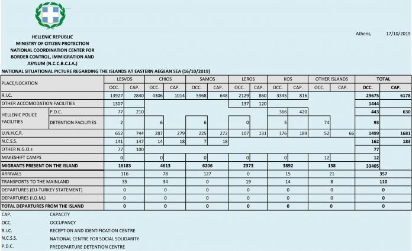
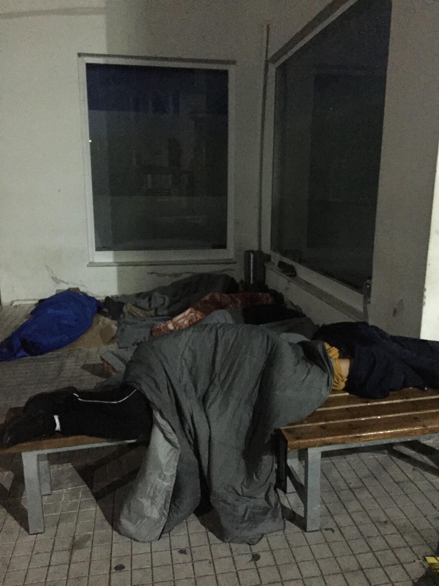
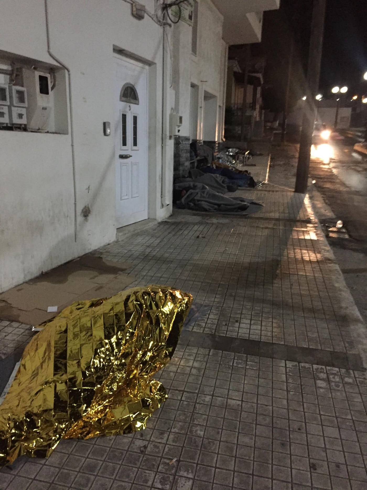
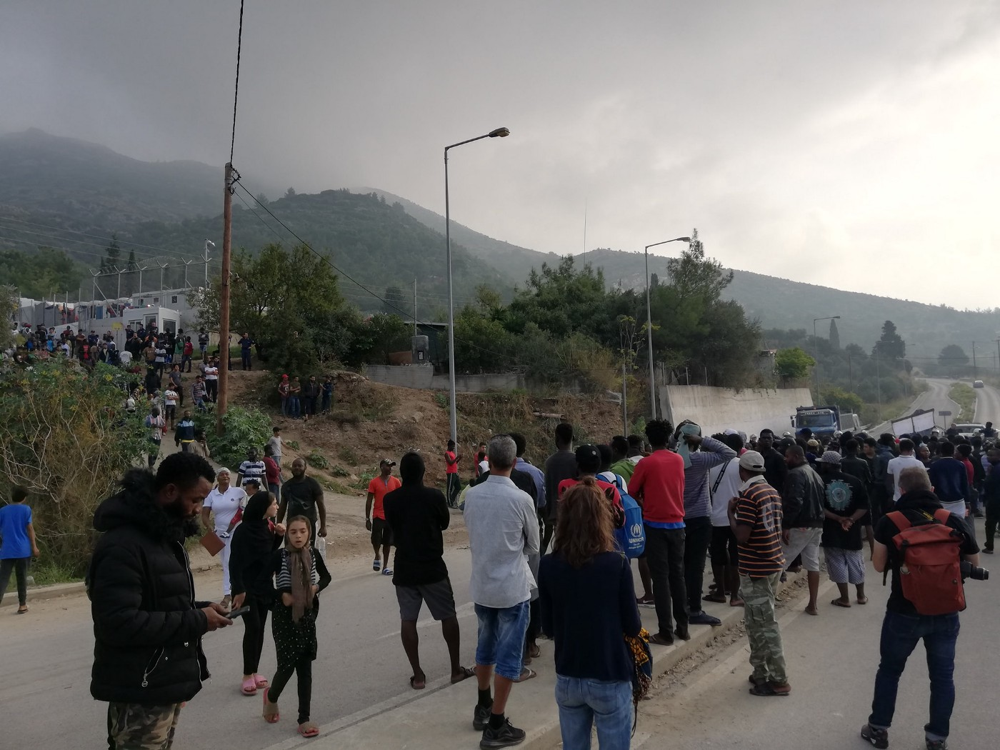
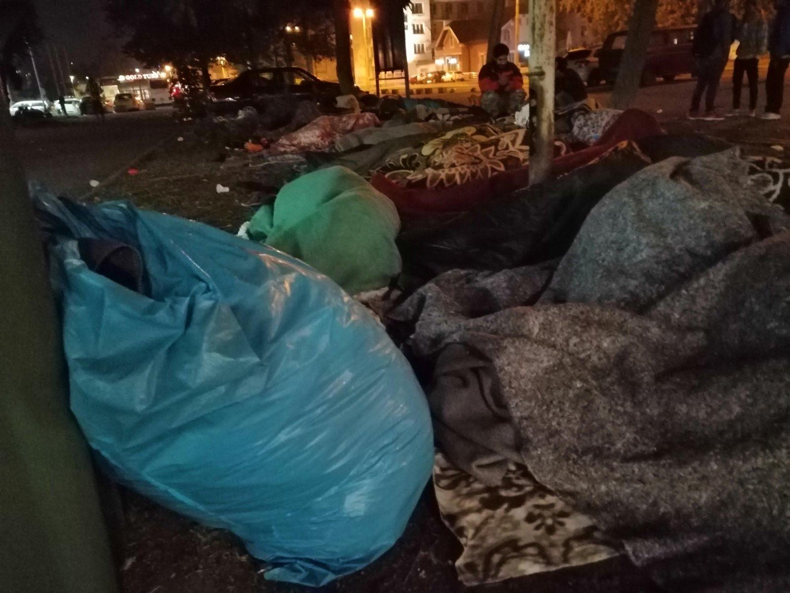
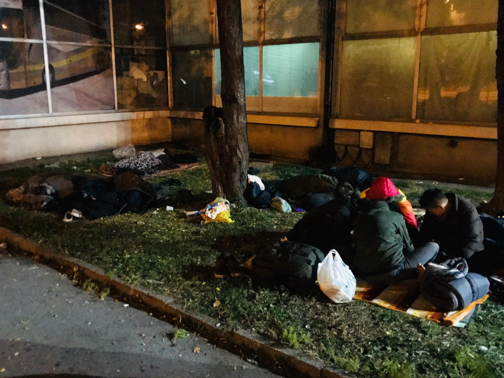
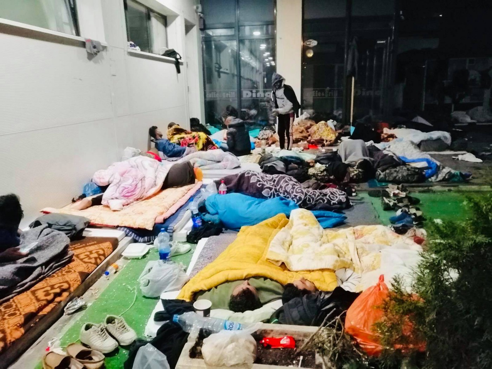
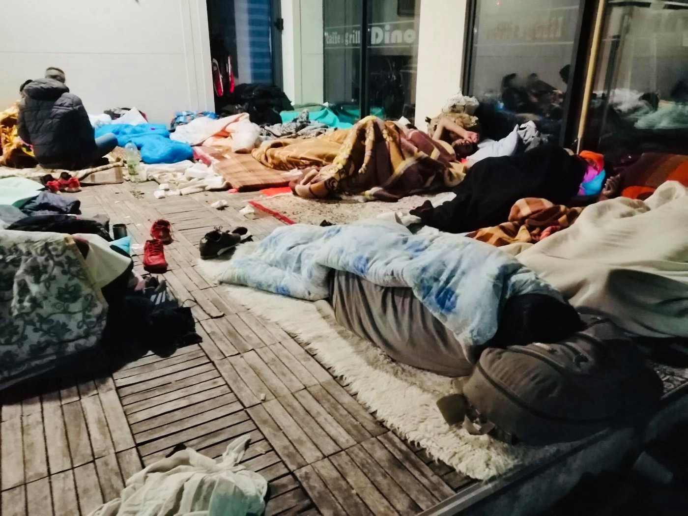
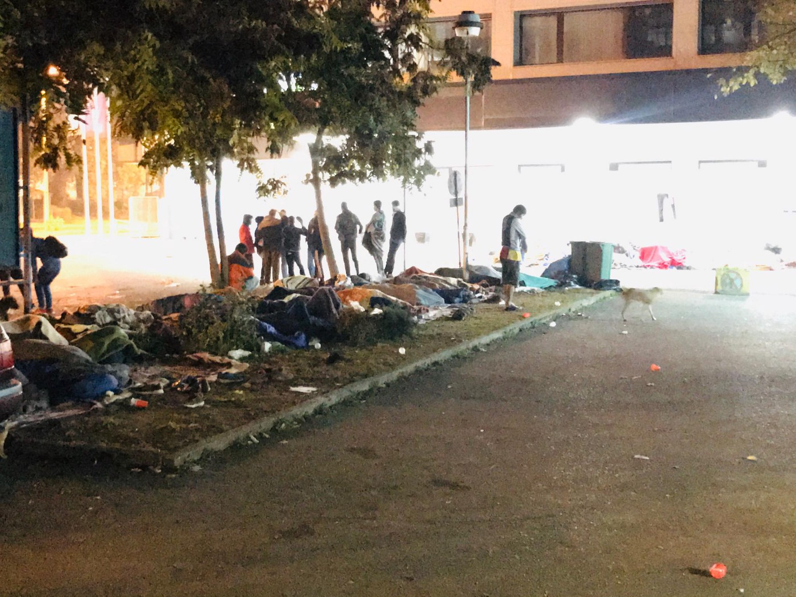

### AYS Daily Digest 17/10/19: Hundreds sleeping rough at this very moment, perhaps in your city too
#### Fire in Attica, aftermath on Samos reveals hardships shared by more people arriving / Help Iuventa collect info to face politically charged accusations / Hard times in Bosnia and Herzegovina as the cold weeks arrive / calls for help & other news

 \)](assets/935c26c92874/1*ZV_pt60Do99PDfnpJXrCZg.jpeg)

Samos \(Photos: [Sarah Griffith](https://www.facebook.com/sarah.griffith.54738?__tn__=%2Cd%2AF%2AF-R&eid=ARDcInjn2UqovVhmel0OUNKWvXIbN2x2YN6j_uawyinPqNfIS7Z45mKLBn4uolmni_Q4X9qaxnNFfx5Q&tn-str=%2AF&hc_location=group_dialog) \)
#### FEATURED

A fire broke out shortly before 12\.30pm at the so\-called ‘predeparture centre’ \(aka prison\) in Athens\. Amygdaleza has been highly criticised by human rights organisations over the years for its conditions\.

The fire was quickly extinguished, according to the [official statement](https://l.facebook.com/l.php?u=https%3A%2F%2F3pointmagazine.gr%2F%CE%BA%CE%AC%CE%B7%CE%BA%CE%B1%CE%BD-%CE%B4%CF%85%CE%BF-%CE%BA%CE%BF%CE%BD%CF%84%CE%AD%CE%B9%CE%BD%CE%B5%CF%81-%CE%B1%CF%80%CF%8C-%CF%86%CF%89%CF%84%CE%B9%CE%AC-%CF%83%CF%84%CE%BF-%CE%BA%CE%AD%CE%BD%2F%3Ffbclid%3DIwAR0og_jtXsKgq1iAFsIN2DFGq2shRaS8DHc2-SwaJxKyr1bNHIHivdpSark&h=AT35yQRNloa2zDIYyIL4lne5ejjwXB1yjfim-PUnWSmX80oQMEFkD1We_4skcUk8pHj4S_L-SQa1pyAjkt0tSbQbfPSYd2CnxnmXVvsQD6mswN3Ns-3CieJ6M4CjY-hBo04_12qGoCueQQ) of the fire brigade, it started due to an uninhabited container and expanded to a second one, where unaccompanied minors were staying, but no one was injured as they were removed early\. The cause of the fire is being investigated\.

On Samos, the aftermath after a fire and in the midst of the current difficult situation has only underlined the many issues people are facing daily\.

■■■■■■■■■■■■■■ 
> **[Teacher Dude](https://twitter.com/teacherdude) @ Twitter Says:** 

> > "Mice were biting us, we had nowhere to sleep". Accusations by pregnant woman in  government run refugee camp on Greek island of #Samos. #refugeesgr #Refugees 

> **Tweeted at [2019-10-17 09:10:36](https://twitter.com/teacherdude/status/1184758599630893059).** 

■■■■■■■■■■■■■■ 

Activists document many people sleeeping rough across the island —

> Three days after the fire that destroyed part of the Samos hotspot, the exiles stranded on this Greek island near Turkey continue to mobilize\. This afternoon, Africans blocked for a while the road leading to the entrance of the camp to denounce their conditions of confinement, then began a demonstration that ended at the port\. 

> In addition, since Tuesday evening, 15/12, more than 150 Syrian exiles have occupied a main square in the centre of Vathy\. Men, women and children are protesting against the confinement that the agreement between the European Union and Turkey has in store for them and are demanding to be able to leave the island and reach Athens\. 

Since yesterday at least eight boats have arrived on the Greek Aegean Islands, 217 people, Aegean Boat Report team reported\.

Here is the official report on the capacities on the Aegean islands:

![I am not really quite sure where to start\. The situation here on Samos is reaching a critical level last night \(…\) we passed many people sleeping on the streets\. I have been told this has not happened here before\.
Walking passed people with nothing lying on the ground with simply a blanket or sleeping bag took me straight back to The Jungle in Calais and the streets of Paris\.
Apparently there are around 700 people without any shelter of any description after the fire so this would explain the situation\! — Photos by [Sarah Griffith](https://www.facebook.com/sarah.griffith.54738?__tn__=%2Cd%2AF%2AF-R&eid=ARDcInjn2UqovVhmel0OUNKWvXIbN2x2YN6j_uawyinPqNfIS7Z45mKLBn4uolmni_Q4X9qaxnNFfx5Q&tn-str=%2AF&hc_location=group_dialog)](assets/935c26c92874/1*h0vwzxfL0H1dvUlc_KcLTw.jpeg)

I am not really quite sure where to start\. The situation here on Samos is reaching a critical level last night \(…\) we passed many people sleeping on the streets\. I have been told this has not happened here before\.
Walking passed people with nothing lying on the ground with simply a blanket or sleeping bag took me straight back to The Jungle in Calais and the streets of Paris\.
Apparently there are around 700 people without any shelter of any description after the fire so this would explain the situation\! — Photos by [Sarah Griffith](https://www.facebook.com/sarah.griffith.54738?__tn__=%2Cd%2AF%2AF-R&eid=ARDcInjn2UqovVhmel0OUNKWvXIbN2x2YN6j_uawyinPqNfIS7Z45mKLBn4uolmni_Q4X9qaxnNFfx5Q&tn-str=%2AF&hc_location=group_dialog)

At least 167 people have reportedly arrived during the week, in the aftermath of the recent horrific events, activists report\.

■■■■■■■■■■■■■■ 
> **[RSA](https://twitter.com/rspaegean) @ Twitter Says:** 

> > According to greek media still hundreds of #refugeesgr in #Samos sleep in the streets and parks 3 days after the fire. Many of them fear to go back to the #hotspot  because there is still tension  [ethnos.gr/ellada/67174_s…](https://www.ethnos.gr/ellada/67174_samos-ekatontades-astegoi-metanastes-koimoyntai-stoys-dromoys-pics) 

> **Tweeted at [2019-10-17 18:12:07](https://twitter.com/rspaegean/status/1184894878544793601).** 

■■■■■■■■■■■■■■ 

The situation has exceeded capacities of the ground NGOs, and now desperately and very obviously hangs on a thread of the political will, or lack there of\.

](assets/935c26c92874/1*1u1m5GsS35Y-Zc4qpEgqAQ.jpeg)

Photos: [Samos24\.gr](https://www.facebook.com/24samos/?tn-str=k%2AF)

Also, activists warn that the new asylum law on international protection for [r](https://www.facebook.com/hashtag/refugeesgr?hc_location=ufi) efugees is published \(in Greek\) for comments and discussion until October 21 without enough time to be examined by human rights experts\.

■■■■■■■■■■■■■■ 
> **[Alarm Phone](https://twitter.com/alarm_phone) @ Twitter Says:** 

> > In 1 case a group of ppl was picked up by the Turkish CG after they had sent us a position in Greek waters. When we provided the Greek CG with that pos., they said it was wrong &amp; the ppl actually in Turkish waters! 
Sadly, we couldn't yet get back in touch with the travellers. 

> **Tweeted at [2019-10-17 15:46:18](https://twitter.com/alarm_phone/status/1184858182134439936).** 

■■■■■■■■■■■■■■ 

#### LIBYA

“Many Eritrean, Ethiopian, Somali and Sudanese refugees in the GDF have been “rejected” by UNHCR\. They have been told that they will not be evacuated, they should go back to their own countries\. No right to appeal or review\. Vulnerable and traumatised young men, women, children who have suffered years of atrocities in Libya now condemned by UNHCR to homelessness and starvation upon exit from the GDF, huge risks of being abducted and tortured for ransom or detained, enslaved and left to die of hunger and TB with no hope of evacuation\. This is all unbearable,” [Giulia Tranchina](https://www.facebook.com/rastajuly?__tn__=%2Cd%2AF%2AF-R&eid=ARDgsTq4znOC6y4Bn0cDUXPMa_8LYRpEnf2i4ALBW1SVY8vq0bC9yc6ODXcbchzLBghv9TwYXJtF85Wm&tn-str=%2AF&hc_location=group_dialog) reports\.

](assets/935c26c92874/1*DtG7XpllX-mJehRdcJ-DoA.jpeg)

Photo: [Giulia Tranchina](https://www.facebook.com/rastajuly?__tn__=%2Cd%2AF%2AF-R&eid=ARDgsTq4znOC6y4Bn0cDUXPMa_8LYRpEnf2i4ALBW1SVY8vq0bC9yc6ODXcbchzLBghv9TwYXJtF85Wm&tn-str=%2AF&hc_location=group_dialog)

■■■■■■■■■■■■■■ 
> **[Charlie Yaxley](https://twitter.com/yaxle) @ Twitter Says:** 

> > In September, departures from Libya to Europe where nearly twice as high on days when NGO  rescue boats were NOT operating. Weather a bigger influence.

Meanwhile, nearly 30 died off Lampedusa.

NGO boats are NOT a pull factor but they do SAVE LIVES 

> **Tweeted at [2019-10-17 06:42:23](https://twitter.com/yaxle/status/1184721301287641089).** 

■■■■■■■■■■■■■■ 

#### SEARCH AND RESCUE

iuventa10 team is looking for people who were rescued by the
Iuventa between July 2016 and August 2017 while trying to cross the
Mediterranean Sea on a dinghy or wooden boat\. After the ship Iuventa of the NGO “Jugend rettet” was seized by the Italian authorities under flimsy pretexts in the summer of 2017, a 10 members crew is now under investigation for “aiding illegal immigration”\. In the case of a conviction they would be facing up to 20 years of imprisonment\.

> The iuventa crew has never colluded with human traffickers\. This trial
 

> is politically motivated and part of Europe’s ruthless closed\-door
 

> policy\. It is not only about the freedom of the iuventa10, but about
 

> nothing less than the right to life — for all people\. 

A conviction would have fatal consequences not only for the accused 10 — it
would possibly set a precedent for all coming trials against people
acting in solidarity — and in its consequence would aggravate the
situation of refugees and migrants in the Mediterranean\.

> In order to win this process, we would like to make contact with
 

> refugees and migrants who have made such crossings via the sea, so that
 

> they can give evidence and tell their story themselves\. 

> For this we need you\! 

> You could help us
 

> • by talking to us if you have crossed the Mediterranean Sea during
 

> this period and have been rescued by iuventa
 

> • by spreading our call on your social channels
 

> • by putting up our call in your gathering and meeting points
 

> • by drawing the attention of people who have come across the
 

> Mediterranean to our call 

> **How?** 

> We prepared our call in Arabic, English, Farsi, French, German, Italian
 

> & Tigrinya as 

> 1\. DinA4 to print out, put up and hand out \(black and white & in
 

> colour\) 

> 2\. PDFs and JPGs in the right format for twitter, instagram,
 

> facebook and messenger \* 

> 3\. DinA2 poster with all languages to order and get delivered for
 

> free 

> → You can find all the material to download here:
 

> [https://daten\.solidarity\-at\-sea\.org/s/jsRSGz4LAdnkSZR](https://daten.solidarity-at-sea.org/s/jsRSGz4LAdnkSZR) 
 

> < [https://daten\.solidarity\-at\-sea\.org/s/jsRSGz4LAdnkSZR](https://daten.solidarity-at-sea.org/s/jsRSGz4LAdnkSZR) > → You can order
 

> the DinA2 with all languages for free and get it directly delivered to
 

> you\. For this, please write an e\-mail with the desired number and your
 

> address to: [contact@solidarity\-at\-sea\.org](mailto:contact@solidarity-at-sea.org) 

■■■■■■■■■■■■■■ 
> **[Charlie Yaxley](https://twitter.com/yaxle) @ Twitter Says:** 

> > In September, departures from Libya to Europe where nearly twice as high on days when NGO  rescue boats were NOT operating. Weather a bigger influence.

Meanwhile, nearly 30 died off Lampedusa.

NGO boats are NOT a pull factor but they do SAVE LIVES 

> **Tweeted at [2019-10-17 06:42:23](https://twitter.com/yaxle/status/1184721301287641089).** 

■■■■■■■■■■■■■■ 

■■■■■■■■■■■■■■ 
> **[Lighthouse Relief](https://twitter.com/LighthouseRR) @ Twitter Says:** 

> > At 10am this morning, we were informed of a dinghy that had landed in a rocky area of coastline on the north shore of #Lesvos. The #LighthouseRelief landing team distributed dry food and water to 67 people, including 24 children. #refugeesgr #solidarity #greece https://t.co/n3wYxmZsC1 

> **Tweeted at [2019-10-17 13:54:55](https://twitter.com/lighthouserr/status/1184830151726718976).** 

■■■■■■■■■■■■■■ 

#### BOSNIA AND HERZEGOVINA
### Tuzla

Even though the situation in Tuzla cannot be compared to the one in Bihać, city that bears the biggest burden of the crisis in Bosnia and Herzegovina, this town also sees at least 200 people arriving from Serbia\. Everyone needs a lot of support after arriving, and apart from the document stating their intention to seek asylum, there is nothing else for them in this city\.

It has been 18 months that the government is failing to properly react to the issue, and the cantonal, as well as the city authorities have been acting as if nothing has been going on all the while\. On the other hand, a small group of volunteers, with help from several NGOs, still stands firm in their efforts to ease the difficult situation for those passing through Tuzla\.

The people on the move usually stay for a couple of days, while a small group of people have been staying in the city for several months\. Most of them want to go back to Greece after having attempted to many times to pass border with Croatia, with no success\.

The last couple of days have been extremely difficult because most of the people sleep rough, and the temperature in Tuzla has reached very low levels\. On Tuesday, 200 people slept under the open sky\. It is important to mention that no person who arrived to Tuzla has fallen asleep hungry or without a cover\.

What mostly worries the volunteers is a rising number of people on the move who have scabies\. There is a medical volunteer team, but it is very difficult to properly treat the patients, especially given the living conditions\. All work is done in the streets\.

On the other hand, people are in more and more difficult psychological state and they feel helpless\. They are forced to ask for money for the tickets, begging is a permanent practice across the city whose citizens aren’t living an easy life themselves\.

#### FRANCE

Mobile Refugee Support needs help\!

> We need your support now more than ever\. In order to maintain the services we have been providing, we need your help to fund our operations\. 

Find out more on their [social media\.](https://www.facebook.com/MobileRefugeeSupport/posts/1081127212092889?hc_location=ufi)

**Apart from daily news in English, we also publish weekly summaries in Arabic and Persian\. Find specials in both languages on our [medium site](https://medium.com/are-you-syrious/ays-weekly-in-arabic-and-persian/home?source=post_page---------------------------) \.**

**If you wish to contribute, either by writing a report or a story, or by joining the info gathering team, please let us know\.**

**We strive to echo correct news from the ground through collaboration and fairness\. Every effort has been made to credit organisations and individuals with regard to the supply of information, video, and photo material \(in cases where the source wanted to be accredited\) \. Please notify us regarding corrections\.**

**If there’s anything you want to share or comment, contact us through Facebook, Twitter or write to: areyousyrious@gmail\.com\.**

_Converted [Medium Post](https://medium.com/are-you-syrious/ays-daily-digest-17-10-19-hundreds-sleeping-rough-at-this-very-moment-perhaps-in-your-city-too-935c26c92874) by [ZMediumToMarkdown](https://github.com/ZhgChgLi/ZMediumToMarkdown)._
