### AYS Weekend Digest 19–20/10/2019: Olive season in Western Sicily — slavery and ghettoes promoted by local institutions

Protests in Libyan detention centre Abu Selim /// Updates from camps around Greece /// Aita Mari ready to sail back to the Aegean /// Vucjak camp at a breaking point /// Journalist who investigated human trafficker known as Bija has been put under protection in Italy /// New report published “children in migration”

 \)](assets/c943504a95c/1*WUFNDgrLFl1mX44p1F29sQ.jpeg)

Moria camp, Lesvos, October 2018 — _Winter is coming and the children of some lower God will suffer_ \(Photo by [Nasim Lomani](https://www.facebook.com/photo.php?fbid=10157584419762497&set=a.10151529381012497&type=3&theater) \)
#### Feature story — Olive season in Western Sicily: slavery and ghettoes promoted by local institutions

 \)](assets/c943504a95c/1*Edkk-jeCP8Z1QfJZ3phTLQ.jpeg)

Ex\-cement factory in the outskirts of Campobello, western Sicily, 2019 \(Foto by [Alberto Biondo, Borderline Sicilia](https://www.borderlinesicilia.org/campobello-2019-una-nuova-raccolta-di-olive-allinsegna-dello-sfruttamento/?fbclid=IwAR0CgvloMDJ4ohuU8yATtQvYp5Yh9s0R8tDmzM7QXKSfBTgb1MZgn14jAFw) \)

> “What shall I say, we come every year and the working situation is worse and worse, and this year there are no olives, which makes everything more complicated\. \[…\] You keep doing, how do you call them, “technical tables”, but we are even more slaves, we are laughed at if we talk about contracts, we are blacks good only for picking olives, and then we disappear, closed inside this cement factory, hidden to the eyes…” _\(Moussa, migrant worker in Campobello, Trapani\)_ 

Borderline Sicilia [report](https://www.borderlinesicilia.org/campobello-2019-una-nuova-raccolta-di-olive-allinsegna-dello-sfruttamento/?fbclid=IwAR0CgvloMDJ4ohuU8yATtQvYp5Yh9s0R8tDmzM7QXKSfBTgb1MZgn14jAFw) that the olive season has just started in the area of Campobello, Trapany county, western Sicily, but workers are already experiencing problems\.

The exploitation of migrant workers during the olive harvest is not new, it has been going on for 25 years\. For a time, until three years ago, local associations — led by Libera, the national anti\-mafia association — had stepped up, and organised a camp to host workers\. Living conditions were still below standard, but the dynamics were more solidarity\-based\. In the last few years, however, local institutions have excluded the associations, and in 2019 they presented a plan developed by a technical task\-force which negotiated with land\-owners and unions\. Associations have so far failed to propose and foster an alternative to the widespread exploitation of workers, but institutions are not doing any better\.

 \)](assets/c943504a95c/1*WJoaE2oIp7-oYYDffLeQeQ.jpeg)

Associations\-run camp, western Sicily, 2017 \(foto by [Alberto Biondo, Borderline Sicilia](https://www.borderlinesicilia.org/i-nuovi-schiavi/) \)

A camp was built, only for documented people, with a capacity of 240 beds\. Managed by the Red Cross, it has toilets and showers, but no food is provided\. In 2018 a catering service was offered in exchange for an entry fee to the camp, but most people left due to the excessive costs which took too much from their very low wages\. The task\-force also regulated the hosting of workers in the farms they work for, but implemented no control, meaning that conditions have already been reported as far below any human standard \(unhygienic, without toilets or showers, overcrowded…\) — with many people opting to live in makeshift camps, or abandoned buildings\. Even more, one company \(Varvaro\) which contracts workers for the farms in the area, has opened a receptive structure that workers have to pay for, so it can make money from them twice\.

The actions of the task\-force were aimed to empty makeshift camps, and ghettoes, but the ex\-cement factory in Campobello, which has been used as a shelter for years, still hosts 600 people, documented and undocumented\. As Borderline Sicilia report, it is riddled with safety and hygiene issues\. A group of women forced into prostitution live and work there, water and access to huts is expensive and controlled by criminal groups, the sewage is open and runs next to the building, the building is full of asbestos, etc\.

 \)](assets/c943504a95c/1*Edkk-jeCP8Z1QfJZ3phTLQ.jpeg)

ex\-Cement Factory, Campobello, 2019 \(foto by [Alberto Biondo, Borderline Sicilia](https://www.borderlinesicilia.org/campobello-2019-una-nuova-raccolta-di-olive-allinsegna-dello-sfruttamento/?fbclid=IwAR0CgvloMDJ4ohuU8yATtQvYp5Yh9s0R8tDmzM7QXKSfBTgb1MZgn14jAFw) \)

Contracts are also a problem, despite the statements of the institutions most contracts are fake and nothing more than a scam against workers and a smoke\-screen to protect employers\. As Moussa notes: “with these fake contracts I won’t be able to ask for unemployment benefits, which is my right\.”

In a territory where the influence of Cosa Nostra is very strong, this regularisation of slave\-like conditions, hailed as a victory by the institutions, has worsened the situation for many workers in the area, but also attracted people working in other areas of the country\. In a year where the harvest seems to be low, this will lead to even worse conditions for workers\.

EASTERN MEDITERRANEAN ROUTE

■■■■■■■■■■■■■■ 
> **[maydayterraneo](https://twitter.com/maydayterraneo) @ Twitter Says:** 

> > Ready to sail to Aegean sea #AitaMari!!

Listos para zarpar hacia el #Egeo #AitaMari

#ElimpulsodeUnPueblo #solidaridad https://t.co/ALmL51Wa6W 

> **Tweeted at [2019-10-20 08:21:45](https://twitter.com/maydayterraneo/status/1185833469361963012).** 

■■■■■■■■■■■■■■ 

#### Arrivals

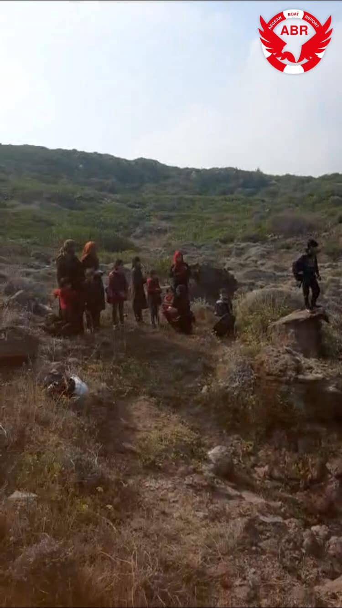

 \)](assets/c943504a95c/1*UnZN3k4IEyUL1lZPYKGWhg.jpeg)

\(Photo Credit: [Aegean Boat Report](https://www.facebook.com/AegeanBoatReport/posts/674326593090448?hc_location=ufi) \)

According to [Aegean Boat Report](https://www.facebook.com/AegeanBoatReport/posts/674326593090448?hc_location=ufi) at least 17 boats have arrived on the Greek Aegean Islands over the weekend, carrying 520 people\. For a detailed breakdown visit their [page](https://www.facebook.com/AegeanBoatReport/photos/a.285312485325196/675730679616706/?type=3&theater) \.
#### Transfers to mainland Greece

It is [reported](https://twitter.com/BrunoTersago/status/1185929901712596992?fbclid=IwAR2PE_EVUOI2SleLDhNagpC0KoaB2EwvaWJSavWH6PqQV2NacEu8Sc7T1tE) that a total of 700 asylum seekers are expected to be transferred on Monday from Samos to the port of Piraeus and from there to hosting facilities in the mainland\. Both locals and residents of the camps have been [protesting](https://greece.greekreporter.com/2019/10/20/situation-on-samos-deteriorates-as-migrant-flows-continue-to-arrive/?fbclid=IwAR2XR7kbwi2yLyEm4_BHWh1dX6MyfAltk4hiVULulw8J03hV-YxXqZitQhc) against the conditions there and for relocation from the island\.
#### Updates from Moria, Europe’s largest refugee camp

There are now 14,000 people present in the camp and conditions are worsening in the build up to winter while arrivals still far outstrip transfers\.

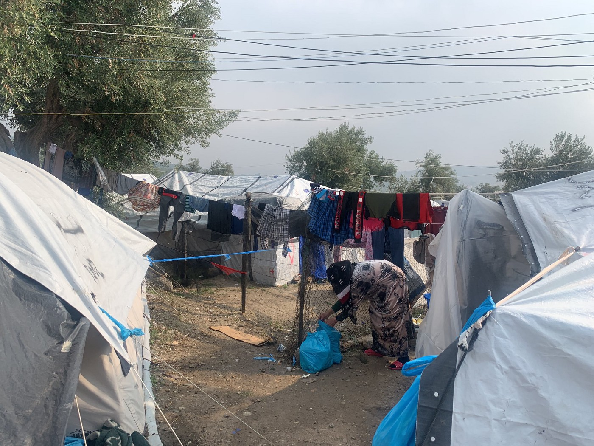

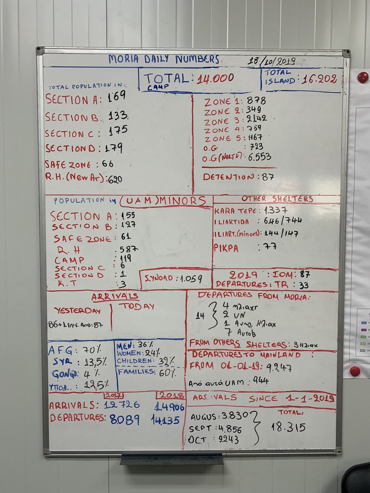

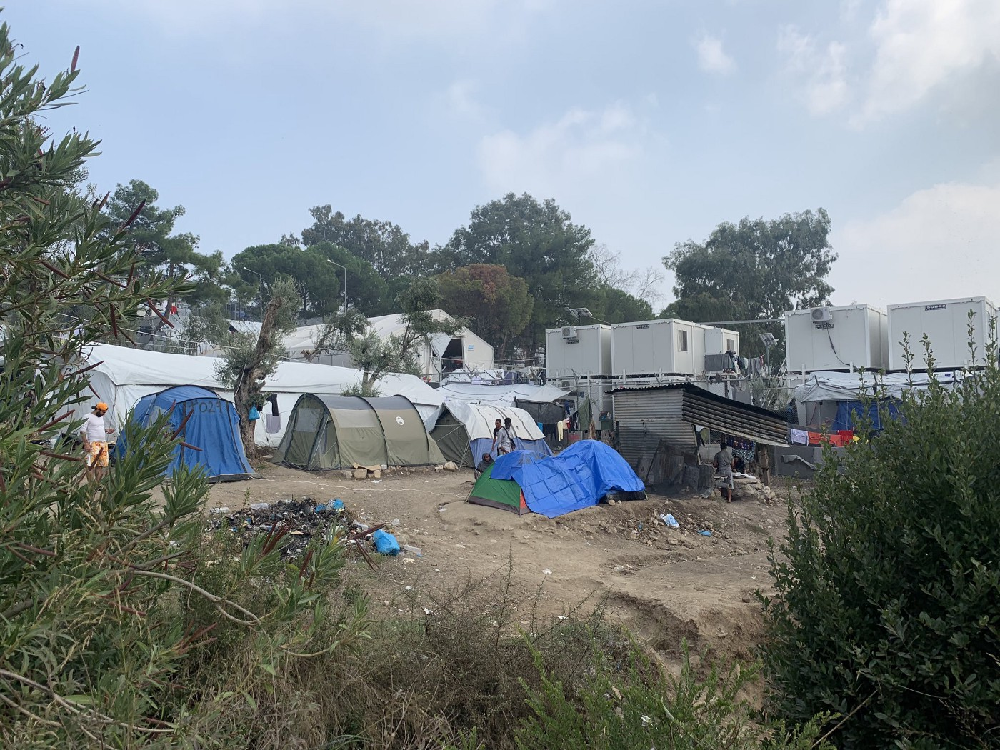

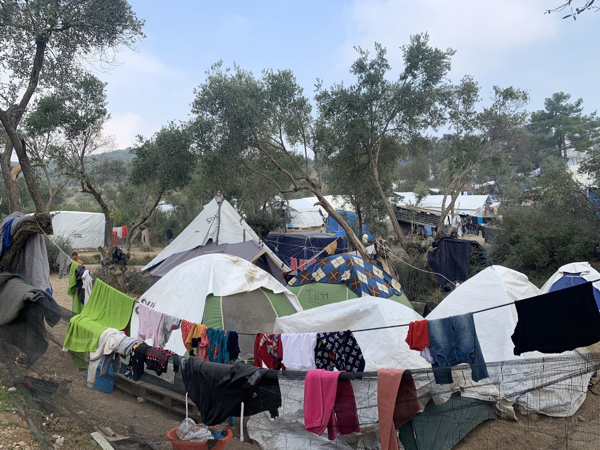

 \)](assets/c943504a95c/1*Hpq0-q6NXTpuqpgue1HfRA.jpeg)

\(Photo Credit: [Miguel Urban Crespo](https://twitter.com/MiguelUrban/status/1185579670483460096?fbclid=IwAR0ARMC_R9XSdYYuVZRBFs3zawdyivNC_-72HJmiBRZjPdO23BoY3CLedUM) \)
#### Update from Korinthos

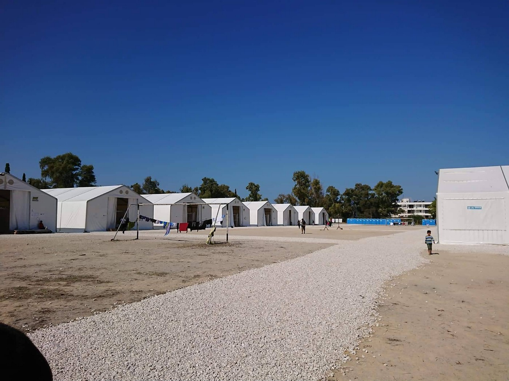

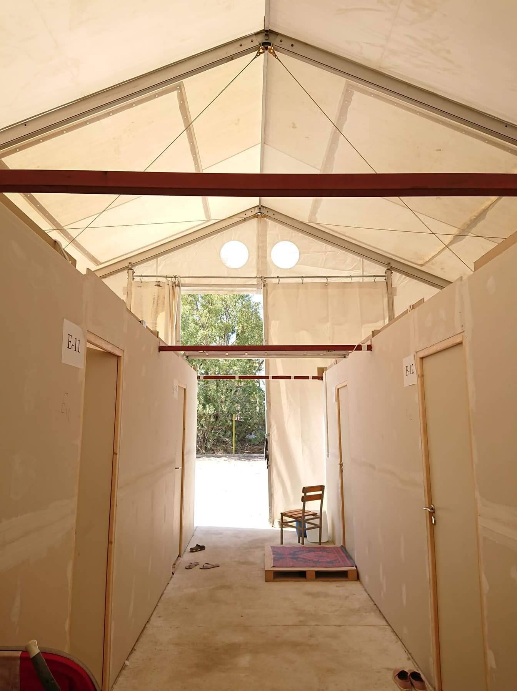

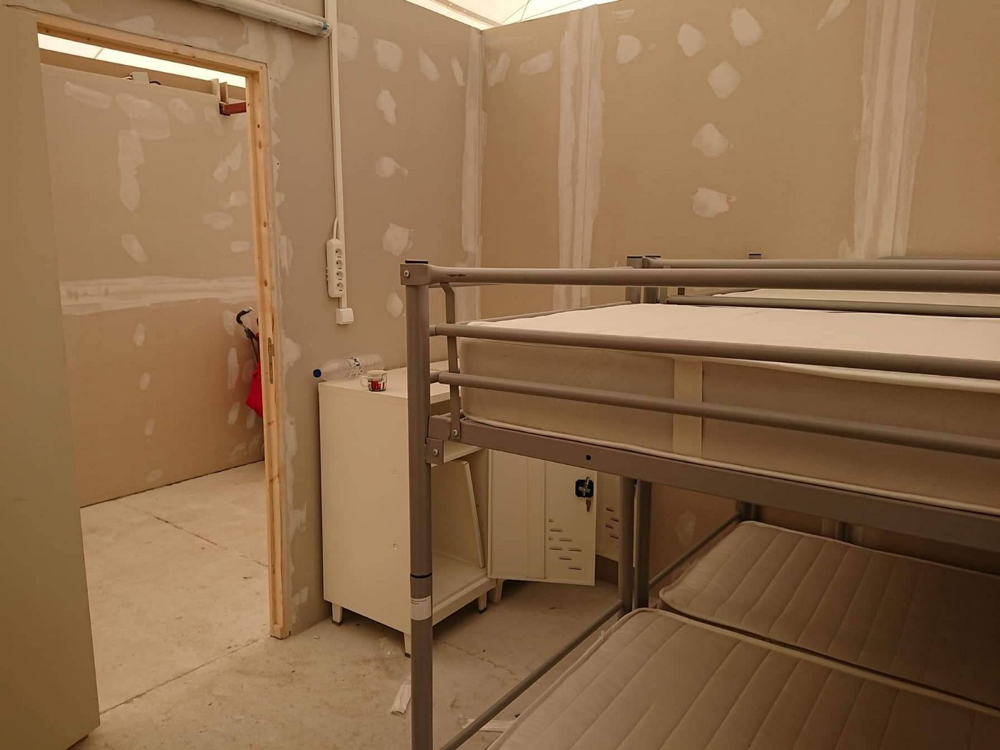

 \)](assets/c943504a95c/1*nY369aMcF7708Wo6m6NvKg.jpeg)

\(Photo Credit: [Chrisa Douzeni](https://www.facebook.com/photo.php?fbid=10219788231038229&set=pcb.10219788443883550&type=3&theater) \)

[Reports from the ground](https://www.facebook.com/photo.php?fbid=10219788231038229&set=pcb.10219788443883550&type=3&__tn__=HH-R&eid=ARDpEu7HMA_w0CWisqhP5kJrfuz5DpyvWcFVG85MMOaZAw5qAs2gl9NJjt1IMfdMgWwmq8EAVZxy9Xei) state there are currently around 700 people in Korinthos, a mix of people who were evicted in Athens and transfers from the islands\.

> Among them are 97 small children under 4 years old as well as 120 minor children, with no hope of attending school, but no other opportunity for creative time other than the solidarity educators from Corinth who sometimes visit, without the materials that will help with their work and without the required support from IOM that despite all their calls for a tent to be given to teachers, the children have not been given space\. 

As you can see from the photos the camp has not been fully built yet, there is no hot water and the electricity cuts out every 5 minutes\. There are obvious concerns as to how people will manage to survive in winter if they can not heat their rooms or adequately wash themselves or their children\.

> As the camp is in considered to be transit and the refugees are supposed not to stay there for long, they are not provided with sheets or blankets, but only a blanket for every person, so people sleep on a common mattress, with a blanket not enough to warm up\. They also have no clothes or shoes\. 

Of course many people did have their own blankets and clothes but when they were evicted they were not allowed to bring any of their own possessions\.

There is also no medical presence, putting at risk people with health problems, especially those without an AMKA, children, pregnant people, and breastfeeding mothers\.

> We stand in solidarity with them and unite our voices with their own voices to address these serious problems that honour neither our country nor Europe, nor ourselves\. 

#### Update from Patras

 \)](assets/c943504a95c/1*tiKLnmJtECuBgdcgNgDPKg.jpeg)

\(Photo Credit: [No Name Kitchen](https://www.facebook.com/nobordersnetwork/posts/2545386755529201?hc_location=ufi) \)

[No Name Kitchen](https://www.facebook.com/NoNameKitchenBelgrade/posts/819053281826291) report that the situation in Patras is still difficult\. There was no medical support for 10 days and in the squats there have been new cases of scabies\. A boy is currently in hospital awaiting an operation on his wrist after being hit by a car while trying to access the port\. Police are still making people’s lives harder with raids on squats, document checks and harassment during food service\.
#### Situation in Vučjak, Bosnia, at breaking point

[Human Rights Watch](https://www.hrw.org/news/2019/10/19/bosnia-should-immediately-close-inhumane-migrant-camp?fbclid=IwAR3qLbII8N4rPSHy2Pa8-EY-RFt6HKKs4E4kdapsZemcoAvWCXayAAVnLc8) are again calling for the closure of Vučjak on the Bosnian/Croatian border after 1700 people were transferred there on the 16th of October\. There are now approximately 2400 people living in tents\. IOM pulled out due to the bad conditions in January 2019, the Red Cross remain, but may now also leave\. The local authorities are threatening to cut off electricity and sanitation\. The dire living conditions, combined with the continued violence faced by people attempting to cross the border, have created a human rights emergency\.
#### New arrivals in Tuzla

[Volunteers continue](https://www.facebook.com/permalink.php?story_fbid=116644359751536&id=108916427190996&hc_location=ufi) to provide food and blankets as more people arrive and street homelessness increases\.

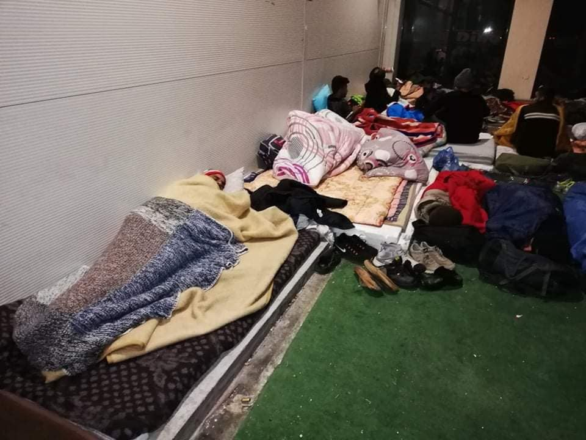

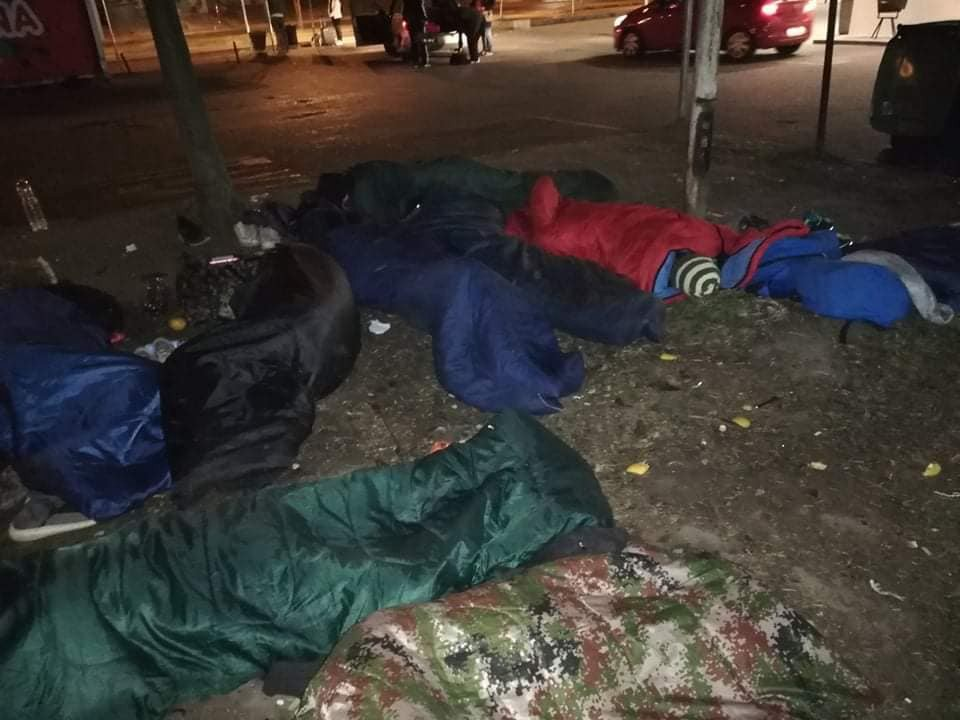

 \)](assets/c943504a95c/1*rBPBHk6wj6Gt9vgmX7xArg.jpeg)

\(Photo Credit: [Tuzlanski volonteri](https://www.facebook.com/permalink.php?story_fbid=116644359751536&id=108916427190996&hc_location=ufi) \)

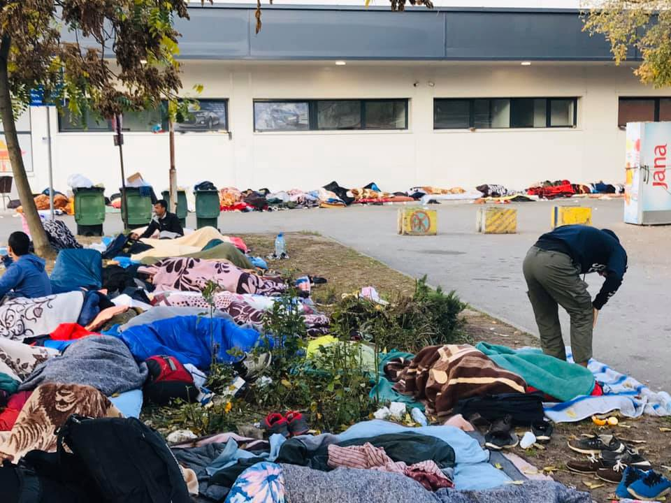

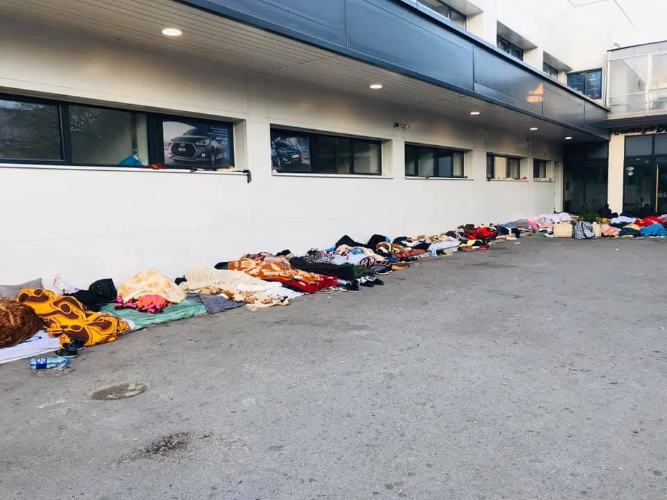

 \)](assets/c943504a95c/1*jdTjVMzFt1u_ApxYqUm8gA.jpeg)

\(Photo Credit: [Help to Refugees in Bosnia and Herzegovina](https://www.facebook.com/groups/144469886266984/permalink/431719270875376/?hc_location=ufi) \)

CENTRAL MEDITERRANEAN ROUTE
#### Protest at Abu Selim detention centre, Libya

#### SEA: EU coast guards keep ignoring distress calls and inviting LCG in EU territorial water

While [more and more bodies are found](http://www.ansa.it/sicilia/notizie/2019/10/20/naufragio-lampedusa-recuperati-altri-due-cadaveri_80acb98e-57d5-4959-ba15-66c42c81de79.html) following last week’s shipwreck off the coast of Lampedusa, Alarmphone reported a new boat in distress in the Central Med and — again — both Italian MRCC and Maltese RCC refused to respond or activate any kind of rescue\. Luckily the 45 people on the boat reached the coasts of Lampedusa by themselves\.

■■■■■■■■■■■■■■ 
> **[Alarm Phone](https://twitter.com/alarm_phone) @ Twitter Says:** 

> > We sent the GPS position to the authorities 4 times, informing them of the urgent distress, including the serious condition of pregnant women and children. While European authorities in #Malta &amp; #Italy were unresponsive for hours, the #migrants reached #Lampedusa by themselves. https://t.co/Ns4oxXcgGk 

> **Tweeted at [2019-10-20 09:12:25](https://twitter.com/alarm_phone/status/1185846219173777408).** 

■■■■■■■■■■■■■■ 

**On [Friday](https://twitter.com/AngiKappa/status/1185545611644489728)** : One rubber boat was rescued by Malta, with 82 people on board\. 4 boats were instead intercepted by the Libyan coast guard and brought back\. One of these actions was done in Maltese waters, after [coordination between Italian MRCC and LCG](https://twitter.com/AngiKappa/status/1185547125897211904) \. 4 boats arrived in Lampedusa autonomously\.

**Weekend** : Libyan media report that between Saturday and Sunday 237 people in four different sea operations were brought back to Libya\.

One more rubber boat was rescued by Italian commercial vessel Asso29\. 68 people will be [transferred](https://twitter.com/AngiKappa/status/1185939111242285056) to a military boat and brought to Pozzallo \(Sicily\) on Monday\.

OceanViking is still [waiting](https://sosmediterranee.com/press/press-release-it-is-easier-to-drown-at-sea-than-to-live-in-libya-104-rescued-people-onboard-the-ocean-viking-in-need-of-a-place-of-safety-21102019/) for a port of safety, after having rescued 104 people on October 18th\.
#### App to help migrants find cancer screening in the Marche region, central Italy

Infomigrants [report](https://www.infomigrants.net/en/post/20235/app-helps-migrants-find-free-cancer-screenings-in-marche-region-italy) that the project “The service takes care of you”, active in the Marche region has launched an app aimed to convince and support migrants to enroll in breast, cervical and colorectal cancer screening programs\. The app is available in 12 languages\. It is so far the only program of this kind active in Italy\.
#### Journalist Nello Scavo under protection after investigating relationships between EU, Italian institutions, Libyan warlord and human trafficker

■■■■■■■■■■■■■■ 
> **[Filippo Grandi](https://twitter.com/FilippoGrandi) @ Twitter Says:** 

> > Solidarity with @[nelloscavo](https://twitter.com/nelloscavo), an Italian journalist under close protection after receiving threats for investigating human trafficking. We hear so much about “breaking the traffickers’ business model” - we see so little being actually done to stop them, worldwide. 

> **Tweeted at [2019-10-20 05:57:38](https://twitter.com/refugeeschief/status/1185797199701200901).** 

■■■■■■■■■■■■■■ 

While it’s somehow incredible that the UN High Commissioner for Refugees lament about “so little being actually done to stop” human traffickers, we as AYS want to join Baobab Experience and other grass\-roots initiatives in expressing our solidarity with Nello Scavo and Nancy Porsia\.

On the role of UNHCR is playing in Libya, read more [here](https://l.facebook.com/l.php?u=https%3A%2F%2Fwww.euronews.com%2F2019%2F10%2F02%2Funhcr-in-libya-part-1-from-standing-withrefugees-to-standing-withstates%3Ffbclid%3DIwAR2OATV9o7QzRQTaPlLrrpPWzwnyXEpORB0IxtbIe5d_9qO70FqX3yq9Dj4&h=AT30kBbogL0gu-jlOf0nqKHS6EJzQU_B91ruafDrYWuEBja2O0LzAjAcIfpAvgwxH4TdDjiv5nYcTJ1Jg972rW1HHMtmgWLp0GDW5UyD1tyvqO2NHcMCK7CeLTcQr0JZtFIAR5viC20lxdCE6vaiEWk77wRcUf06eKPuTcQCAOtjnuGBHxt8br3nfUHJsA_KrHml2KMTB_B5g7hTLtek8yObUs8YPtOviRcnKl_Tv242Oo_GkRtRCJOWkme0CgV-PuGjYR7T0uUeQuOV-1vvfoEnt5Ilzd4wG15dEqNNln3eNb947HQEA-7wPTT_dGZOB8WjrAvNL89BiI7KsC3a3MUPmMtbn_SfDIm11kMxou_Ck6FTHTSgjvKiNM78m2vxRcI0ZEtbVOTVQ_fjwaBVM15TXtAL536TDoH9OJ-H2RsbdXTw17T8GzM0CkxWkRhQ56w7dxovzBaUoTy_ZunXSrs34eJ1MgmaEoRXacCWTSJKrLJTAMLjPt2Qkajg4o0y-5IEiPiqs5XJ87XVXZ7QVwcfDyR3_7Ch-XiJ2oRQz9bdPxr_zgygUpM4ZmWBZnwHKL4cfSSeudDftJBlc-8gZvJzxWsrtAazum3W9dltF3_CCdIyeXarJQcy2DaHJWArtT6Pk0ry) \.

Read more about Scavo’s and Porsia’s investigations \(in [Italian](https://www.avvenire.it/search/bija) , in [English](https://www.theguardian.com/world/2019/oct/04/human-trafficker-at-meeting-italy-libya-migration-abd-al-rahman-milad) \) \.

■■■■■■■■■■■■■■ 
> **[Baobab Experience](https://twitter.com/BaobabExp) @ Twitter Says:** 

> > Tutta la nostra solidarietà a @[nelloscavo](https://twitter.com/nelloscavo) e @[nancyporsia](https://twitter.com/nancyporsia)!
Giornalisti veri, studiosi. Quello che hanno fatto e che continuano a fare sul tema delle migrazioni è un lavoro inestimabile. Baluardi contro le narrazioni tossiche che invadono i media italiani.

 [avvenire.it/attualita/pagi…](https://www.avvenire.it/attualita/pagine/nello-scavo-sotto-tutela-solidariet-unanime?fbclid=IwAR0xRxERs6i1t7p9JeasZFJ8818Nsk01DyOVZzuRHRGwd5SpDlc-o2auN8A) 

> **Tweeted at [2019-10-20 18:31:41](https://twitter.com/baobabexp/status/1185986965738610688).** 

■■■■■■■■■■■■■■ 

WESTERN MEDITERRANEAN ROUTE
#### Rescues off the Canary islands

[Reports from the ground](https://twitter.com/DrAZoubeidi/status/1186031088461848576?fbclid=IwAR0-mhDtGnWG7n06FrbTYYTEw0c4Hau9j_DQAfcY9fmoq4U-3W60FakuM20) state that 365 people arrived this week from Morocco to Spain\.

A boat which reached the Canary Islands [is said to have been](https://twitter.com/txemita/status/1186031066664128512?fbclid=IwAR1l-C8pYAAh6CiXn45BWnoanhpn0ecRQC1uQSXzwtG5FUVpxrkdu9lNC28) carrying at least 8 women, two children and 22 men \(a further report can be found [here](https://www.efe.com/efe/canarias/sociedad/rescatada-una-patera-a-150-kilometros-de-gran-canaria-con-33-personas-bordo/50001312-4091416) which puts the total number of people at 33\) \. So far this October approximately 150 people have arrived on the islands, this seems to be a steep increase as only 900 people have arrived in the whole of 2019\.

FRANCE
#### Volunteers needed in Dunkirk

[FAST](https://www.facebook.com/FASTFirstAidSupportTeam/posts/792363077865717) \(First Aid Support Team\) need volunteers in October and November\. They also need donations and medical supplies\. More info [here](https://www.f-a-s-t.eu/?fbclid=IwAR29OO8jC-oDWlv-F7Z4Ps51Wsa3zNTGEUFPJko7jmePsVmF7NCrtve2OXs) \.

GENERAL
#### MSF published medical guidelines and app

The guidelines are the collaborative work of several experienced medical practitioners and specialists, and were developed for non\-specialised medical staff\. The MSF Medical Guidelines mobile app allows users to browse, save and download content in high and low quality resolutions to view remotely in the field\. It was developed to improve access to the latest medical guidelines for field workers across MSF projects, also serving as a useful tool for training medical staff on mission\. The guidelines are used by a number of other international organisations, such as WHO and UNICEF\.

#### “Data on Children in migration” report published\.

■■■■■■■■■■■■■■ 
> **[Bruno Tersago](https://twitter.com/BrunoTersago) @ Twitter Says:** 

> > Number of asylum applications of children per 100.000 inhabitants. "The top 4 countries (in 2018) alone (Germany, France,  Greece  and Spain) received about 3/4 of all asylum applications of children." More info: [publications.jrc.ec.europa.eu/repository/bit…](https://publications.jrc.ec.europa.eu/repository/bitstream/JRC113025/data_on_children_in_migration_v2.6d_%28pdf%29.pdf) https://t.co/aPwv6SePVS 

> **Tweeted at [2019-10-20 10:27:32](https://twitter.com/brunotersago/status/1185865122704744448).** 

■■■■■■■■■■■■■■ 

Amongst all migrants, children form a particularly vulnerable group that need special attention\. [The Knowledge Centre on Migration and Demography \(KCMD\)](https://ec.europa.eu/jrc/en/publication/data-children-migration) , in its mission to support the European Commission’s overall response to the opportunities and challenges related to migration, has developed a comprehensive collection of data and related information on migration in general, and in particular on migrant children\. The first report on this subject, called “The Basics”, provides an overview about the current content of the KCMD repository on data and knowledge\.

Read the report [HERE](https://publications.jrc.ec.europa.eu/repository/bitstream/JRC113025/data_on_children_in_migration_v2.6d_%28pdf%29.pdf) \.

**Apart from daily news in English, we also publish weekly summaries in Arabic and Persian\. Find specials in both languages on our [medium site](https://medium.com/are-you-syrious/ays-weekly-in-arabic-and-persian/home?source=post_page---------------------------) \.**

**If you wish to contribute, either by writing a report or a story, or by joining the info gathering team, please let us know\.**

**We strive to echo correct news from the ground through collaboration and fairness\. Every effort has been made to credit organizations and individuals with regard to the supply of information, video, and photo material \(in cases where the source wanted to be accredited\) \. Please notify us regarding corrections\.**

**If there’s anything you want to share or comment, contact us through Facebook, Twitter or write to: areyousyrious@gmail\.com\.**

_Converted [Medium Post](https://medium.com/are-you-syrious/ays-weekend-digest-19-20-10-2019-olive-season-in-western-sicily-c943504a95c) by [ZMediumToMarkdown](https://github.com/ZhgChgLi/ZMediumToMarkdown)._
