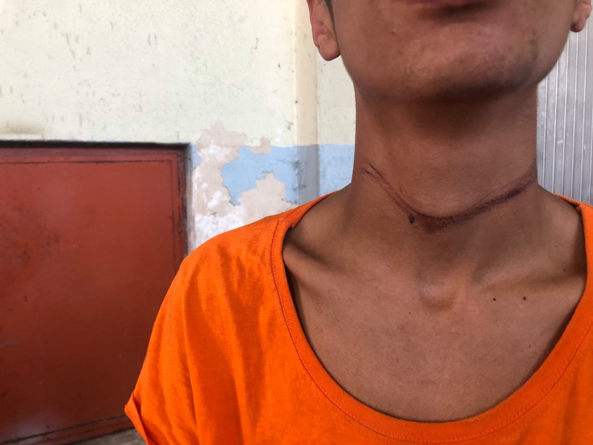
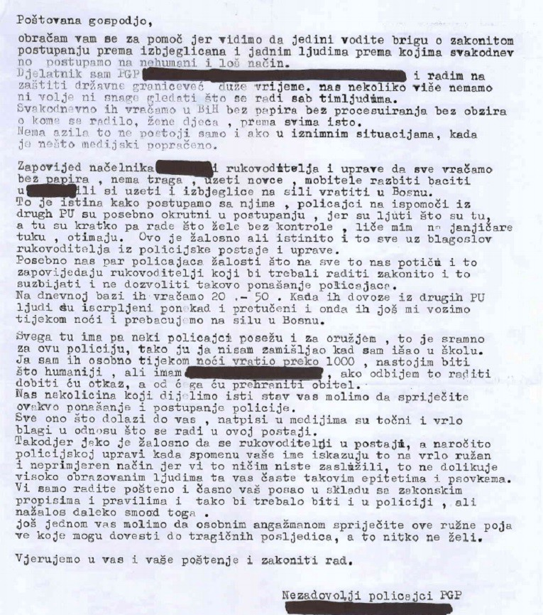
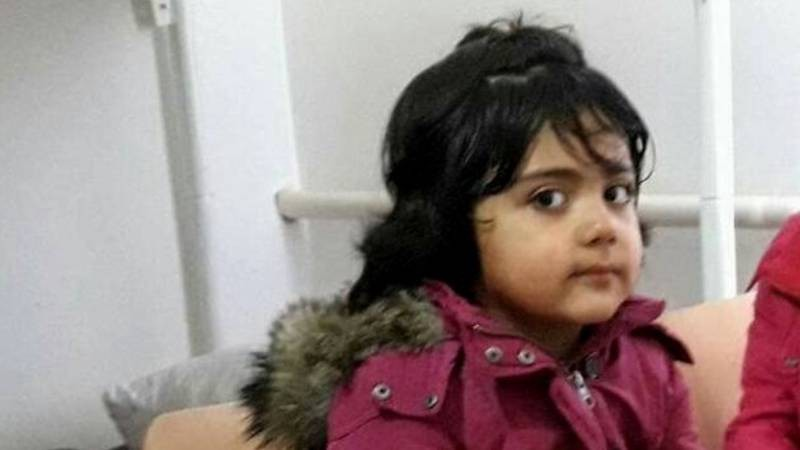

### **NGOs: Croatia’s Schengen membership should be halted until human rights are respected**
#### Open letter signed by groups and NGOs working with the victims of border violence in Bosnia, Serbia and Croatia strongly indicates that Croatia is still not ready to maintain its borders while observing international legal standards and the Schengen aquis

Marks from strangling after the violent push\-back from Croatia, green\-lighted by the European Comission to become Schengen area member\. Photo: No Name Kitchen

Today, Croatia recieved the green light from the European Commission to enter the border\-free Schengen Area\. While we agree that expanding the Schengen space could be a positive and much\-needed move towards improvement of free movement inside the European Union, Croatia’s Schengen membership should be made conditional on the immediate end to the Croatian Government’s illegal and violent push\-back of migrants\. Such practice at the soon\-to become Schengen border not only directly violates provisions of the Schengen Border Code, but represents a violation of international and EU law, including the Geneva Convention on the Status of Refugees\. \.

For the past three years, civil society organisations and activists from Croatia \(Welcome Initiative, Are You Syrious, Centre for Peace Studies\), institutions such as the Ombudsperson’s Office together with many international governmental and non\-governmental actors \( [UN Special Rapporteur on the human rights of migrants](https://www.ohchr.org/EN/NewsEvents/Pages/DisplayNews.aspx?NewsID=25088&LangID=E) , [Council for Europe Commissioner for Human Rights](https://rm.coe.int/09000016808d7db3) , [Human Rights Watch](https://www.hrw.org/news/2018/12/11/croatia-migrants-pushed-back-bosnia-and-herzegovina) , [Amnesty International](https://www.amnesty.org/en/documents/eur05/9964/2019/en/) , [Medecins Sans Frontieres](https://www.msf.org/sites/msf.org/files/serbia-games-of-violence-3.10.17.pdf) , [Asylum Protection Center](http://www.apc-cza.org/en/apc-cza-publikacije.html) \) have been warning about the illegal and violent police practices towards refugees and migrants trying to enter Croatia from the borders with Serbia and Bosnia and Herzegovina\. Activists and volunteers of [Border Violence Monitoring Network](https://www.borderviolence.eu/about/) present in the border areas in Serbia and Bosnia and Herzegovina are collecting testimonies from refugees and migrants, and publishing reports — which describe these illegal actions and define trends\. These are planned, structural and intentional actions of the police who is denying people entry to the territory of the Republic of Croatia and is pushing them back to neighbouring countries outside of any established procedures or access to international protection system, often using force and violence\. There are no monitoring mechanisms of police conduct in place, there exists a total lack of official supervision of officer behavior and the [National Preventive Mechanism](https://www.ombudsman.hr/en/ombudswoman-warned-the-mi-to-grant-npm-access-to-data-on-irregular-migrants-treatment/) has been essentially disabled\. The police practice remains unsanctioned by the responsible bodies, even after [published letter](https://www.ombudsman.hr/en/no-institutional-reaction-to-alleged-illegal-police-treatment-of-migrants/) of anonymous police officers that have, from their own experience, confirmed illegal practice\.

A letter to the Ombudsperson signed by Croatian police officers\. Photo: ombudsman\.hr

However, mentioned practice has been taken into consideration within a more international context — an administrative court in Switzerland has [suspended](https://www.asylumlawdatabase.eu/en/content/switzerland-suspension-dublin-transfer-croatia-due-summary-returns-border-bosnia-herzegovina) a Dublin transfer to Croatia due to the current practices of summary returns\. Also an important case, [M\.H\. and others v Croatia](https://www.asylumlawdatabase.eu/en/content/ecthr-communicated-cases-against-romania-croatia-and-netherlands) concerning an Afghan family — whose child was hit by a train and died while the family was being pushed back from Croatia to Serbia, is pending before the European Court of Human Rights\.

These should be taken into consideration upon reaching the decision whether Croatia has fulfilled all conditions to join the Schengen area\. As a country candidate, one must undergo the Schengen evaluation which includes all parts of the Schengen _acquis_ \. Croatia is not respecting nor applying relevant international law standards and the Schengen Border Code \(SBC\) \. In particular, Croatia is violating Article 13 of the SBC which provisions: “A person who has crossed a border illegally and who has no right to stay on the territory of the Member State concerned shall be apprehended and made subject to procedures respecting Directive 2008/115/EC”\.

Madina Hussiny, a 6\-year old Afghan girl who died minutes after she was pushed back from Croatia\. Photo: AYS

Procedures of the mentioned Directive are envisaged to ensure a fair and efficient asylum system is in place to **respect the principle of non\-refoulement** ; and placement in **specialised facilities** in a **humane and dignified manner** with respect for fundamental rights and in compliance with international and national law\.

International and national legislations are not violated only on the borders, but also across the breadth of the Croatian territory\. Testimonies of refugees and migrants regarding detention facilities in Korenica and Zagreb, along with the systematised techniques used in pushback procedures, show that Croatia is still not ready to maintain its borders while observing international legal standards and the Schengen _aquis_ — and therefore should not have the approval to join the Schengen area until the above mentioned practice is stopped and sanctioned\.

We hope that Croatian government and the Ministry of Interior will demonstrate true political will to respect the human rights of refugees and migrants, and that the Croatian border will become a Schengen border as soon as these obstacles are removed\.

Signed by groups and NGOs working with the victims of border violence:

> Border Violence Monitoring 

> Centre for Peace Studies Zagreb 

> Are You Syrious 

> No Name Kitchen 

> Welcome\! Initiative 

> Rigardu 

> Refugee Aid Serbia 

> Mobile Info Team 

> Re:ports Sarajevo 

> Asylum Protection Center APC / CZA 

_Converted [Medium Post](https://medium.com/are-you-syrious/croatias-schengen-membership-should-be-halted-until-human-rights-are-respected-6062df8ccb14) by [ZMediumToMarkdown](https://github.com/ZhgChgLi/ZMediumToMarkdown)._
