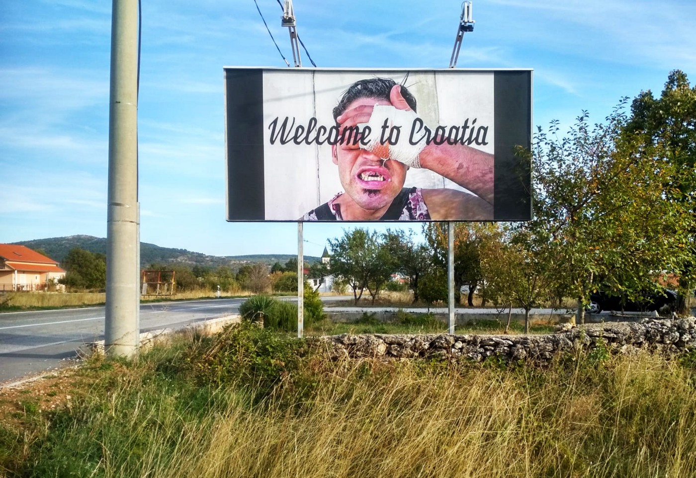
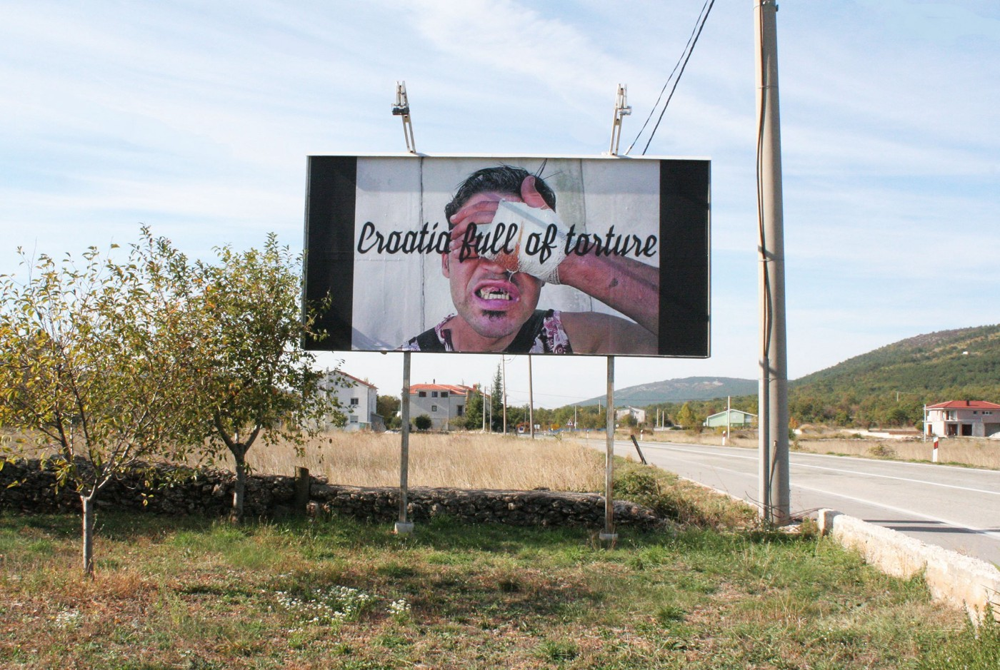

### AYS Daily Digest 28/10/19: ‘ _Welcome to Croatia_ — _Croatia Full of Torture’ billboards “_ welcoming” people along the border
#### Horrid examples of the EU’s failed choice in collaborations, employment and trust put in organisations and officials dealing with people on the move / Calls for help and action / SAR actions continue / New laws in Sweden complicate matters even more, changes in education laws affecting people’s right to work and stay / & more news

#### FEATURED

**Croatia** _— Welcome to Croatia_ and _Croatia Full of Torture_ — using the language of tourist slogans, are the latest billboards set up in Cista Provo municipality, where artists have intervened in public space for more than a decade through billboards, highlighting various social issues\.

Billboards were put up at this location, not far from the Croatian border with Bosnia and Herzegovina, a few days after the European Commission announced that Croatia had fulfilled the conditions to join the Schengen area\. “People who are beaten up and insulted every day, people who truly know pain, hunger, and fear, speak much more accurate about our country than the worn\-out tourist slogans,” said the activists behind the action\.

In the name of joining Schengen, Croatia has normalized and institutionalized violence, which remains unacceptable\. Illegal pushbacks and incarceration of refugees and migrants, and police violence, abuse, and torture of individuals and groups, men and women, adults and children have been [reported](https://l.facebook.com/l.php?u=https%3A%2F%2Fwww.borderviolence.eu%2Fviolence-reports%2F%3Ffbclid%3DIwAR1JX7yI7aFaHm37YhsFUuNFJ8Ti8ZaPM4SKRnRcGZDvhymYuZ7qMUnXshY&h=AT3lVjB4W6lOX0_3sq-0OsXz4cNc05dxaoi6CzypTwk2ncefu4SufaQfOThvSt7Tdu4AShKLux65Yj-tcfllHdC9a1wWYfgw40QeSoOCSYu7ggB4IXjTMASHp56xXGF9Va4ZMdySEPSoDzy7XHo) for years\.

> Who is accountable? 

**Egypt** — The UN\-backed government in Libya has ordered the arrest of a man described as one of the world’s most notorious human traffickers, who was this month revealed to have attended meetings between Italian officials and a Libyan delegation to discuss controls on migration flows from north Africa, well\-informed sources confirm\.

■■■■■■■■■■■■■■ 
> **[Sara Creta](https://twitter.com/saracreta) @ Twitter Says:** 

> > A #Libya-n lawyer working at the Ministry of Justice confirmed me that the Libyan prosecutor has issued the order although this was never implemented. I wrote about this on my piece from #Libya for @[euronews](https://twitter.com/euronews).
[euronews.com/2019/10/03/unh…](https://www.euronews.com/2019/10/03/unhcr-in-libya-part-4-the-detention-centres-the-map-and-the-stories) 

> **Tweeted at [2019-10-28 18:49:44](https://twitter.com/saracreta/status/1188890610616410112).** 

■■■■■■■■■■■■■■ 

In a note released on Monday by the interior ministry in Tripoli, authorities said Abd al\-Rahman Milad, described by the UN security council as a ruthless human trafficker suspected of drowning dozens of people, was “a wanted man and an arrest warrant was issued against him”\.

> Who is accountable? 

#### LIBYA

Survivors of the deadly Tajoura airstrike, which has provoked an international outcry, are pleading for help from the UN\. The attack has been labeled as a war crime, but nothing concrete has been done so far\.

■■■■■■■■■■■■■■ 
> **[Sally Hayden](https://twitter.com/sallyhayd) @ Twitter Says:** 

> > More frantic messages from people who say they are being asked to leave UNHCR's GDF centre in Tripoli, after having their cases for evacuation rejected. The group includes women &amp; children, &amp; they have all spent months or years in detention centres before this. #libya https://t.co/i0afRgJUYQ 

> **Tweeted at [2019-10-28 15:53:23](https://twitter.com/sallyhayd/status/1188846230790688771).** 

■■■■■■■■■■■■■■ 

Survivors in Tripoli have asked for protection & evacuation to safety\.

■■■■■■■■■■■■■■ 
> **[MSF Sea](https://twitter.com/MSF_Sea) @ Twitter Says:** 

> > All the 104 survivors on #OceanViking have transited through #Libya.

Many report to have been trapped there for several years. Some say they fled because of the active fighting.

#EU leaders must step up &amp; offer a place of safety for all onboard!

[twitter.com/BBCWorld/statu…](https://twitter.com/BBCWorld/status/1186959987760873472) 

> **Tweeted at [2019-10-28 16:00:00](https://twitter.com/msf_sea/status/1188847893542768640).** 

■■■■■■■■■■■■■■ 

#### SEARCH AND RESCUE

■■■■■■■■■■■■■■ 
> **[sea-eye](https://twitter.com/seaeyeorg) @ Twitter Says:** 

> > „Wenn eine Kapitänin Menschen rettet, dann droht ihr die Verhaftung. Wenn libysche Milizen ein deutsches Rettungsschiff attackieren, dann bleibt es bei der Äußerung von Besorgnis und im besten Fall bei einer Ermahnung der Partner.“

Was die Besatzung der #AlanKurdi erlebte. https://t.co/21adJooVI4 

> **Tweeted at [2019-10-28 21:15:48](https://twitter.com/seaeyeorg/status/1188927368158744577).** 

■■■■■■■■■■■■■■ 

■■■■■■■■■■■■■■ 
> **[SOS MEDITERRANEE](https://twitter.com/SOSMedIntl) @ Twitter Says:** 

> > 🔴PRESS RELEASE: @[SOSMedIntl](https://twitter.com/SOSMedIntl) &amp; @[MSF_Sea](https://twitter.com/MSF_Sea) call on a broad coalition of European States to:

- urgently facilitate the assignment of a port to #OceanViking

- finally put in place the predictable disembarkation mechanism the #EU discussed in the past 4 months
[bit.ly/2NhbZYO](https://bit.ly/2NhbZYO) 

> **Tweeted at [2019-10-28 06:24:50](https://twitter.com/sosmedintl/status/1188703148896129025).** 

■■■■■■■■■■■■■■ 

#### MALTA

A number of Libyan nationals were made to pay for medical visas for treatment in Malta, a treatment that was meant to have been given free of charge under a bilateral agreement to treat Libyans wounded in the hostilities in their homeland\. [They were made to make payments to government official Neville Gafà](https://www.independent.com.mt/articles/2016-08-21/local-news/Government-official-was-netting-up-to-150-000-a-month-in-medical-visas-scam-6736162687) \. In a case that sparked outrage \(as if that’s not been happening elsewhere, too\), the Maltese media report that one of the witnesses said that he had been informed by Gafa’s interpreter that if he wanted to stay in Malta for medical treatment he would have to pay money\. He refused to pay\.

We support and invite all those who have been done wrong by the authorities AND the international organizations, regardless of the area, to come forth if they want to tell their story anonymously or on the record\. Everyone must stand against this growing exacerbation of a malicious system across the old continent\.
#### FRANCE
### A crisis in accommodation in Rennes — Open letter

This summer, the official city of Rennes has stopped 115 asylum seekers from getting lodged\. Parallel to that, a growing number of asylum seekers have been placed under the Dublin procedure, more and more families are in additional danger of having their rights denied, single asylum seekers have a few chances to reach accommodation during their procedure of examining the request for international protection\. The state intentionally ignores the Article L345–2–2 of the Code of social action for the families, stipulating that all people without lodging in a situation of distress, with medical issues, psychological or social problems, must have an access, at all times, to a number of emergency accommodation sites\.

Those and other huge issues and denial of rights of people concerned are a reason why a number of organisations are raising questions addressing them firstly to the city of Rennes officials in an open letter signed by:

Action Culture Entreprise — ATTAC Comité de Rennes — Bienvenue \! — CCFD\-Terre Solidaire 35 — CRIDEV — Ensemble 35 — GAT Réfugiés Migrants FI 35 — LDH Section de Rennes — MRAP 35 — PCF Section Rennes Métropole — Planning Familial 35 — RESF 35 — UL CGT 35 — Un Toit c’est Un Droit — Utopia 56 Rennes

Read the entire letter [here\.](https://www.facebook.com/untoitestundroit35/posts/2604606299760514)
#### SPAIN

Six people were detained after arriving by boat to the coast in CATE of Motril\. At the same time, EFE has reported that Salvamento Marítimo transferred to Melilla the 36 people who arrived on Sunday by sea to the Chafarinas Islands\.
#### SWEDEN

**In the past weeks, there have been several reports that Säpo \(the security agency/special police\) has been targeting and [pointing out](https://www.aftonbladet.se/…/ingen-utvisningshotad-har-fatt…) more aliens than earlier as a threat to national security\.**

There are no huge numbers: since the late ’90s 40 cases have been reported, but most of the cases are from the past few years\. None of the individuals who appealed against the accusations won the appeal\. According to Säpo they are doing thorough investigations, but he said it’s difficult for individuals of concern to prove their potential innocence\. The level of evidence needed for Säpo is low\.

People who are convicted of crimes can also be sentenced to deportation\. Every year, about 600 people are sentenced to deportation from Sweden because of criminal accusations\. But some of them cannot be expelled, due to unrest or fighting in their countries of origin, or because of other obstacles that make deportation impossible to schedule\. If that is the case, they can stay in Sweden, but they lack basically all rights\. The migration minister Morgan Johansson told the radio that he thinks this is good since it only applies to criminals\.

**The new so\-called high\-school law is also making life difficult for those concerned\.** 
The [law went into effect](https://sverigesradio.se/sida/artikel.aspx…) on the 1st of July 2018 and said that those who are enrolled in high school studies, and get a job shortly after, can get a permanent residence permit\. As long as the studies are ongoing, the newly arrived student have to prolong their temporary residence permit\. If they fail to get a job — the person won’t get a prolonged residence permit\. That means **rejection and then deportation\.** However, it is not so easy that all studies count\. They have to be “qualified” — a term that is hard to interpret\.

SKL, the umbrella organization for Swedens municipalities and counties, said that [the situation is getting untenable](https://sverigesradio.se/sida/artikel.aspx?programid=78..) \. The pressure on both students and teachers is incredibly big, since someone's future in Sweden depends on school results and the choice of high school education \(in Sweden you can choose more hands\-on professions, such as different kinds of crafts, which are likely to not count as “qualified” since it won’t make the individual eligible for the University\)… Teachers and those responsible for the students in question demand better guidelines and frameworks\.

_Converted [Medium Post](https://medium.com/are-you-syrious/ays-daily-digest-28-10-19-welcome-to-croatia-croatia-full-of-torture-billboards-welcoming-15c5bb833a7b) by [ZMediumToMarkdown](https://github.com/ZhgChgLi/ZMediumToMarkdown)._
