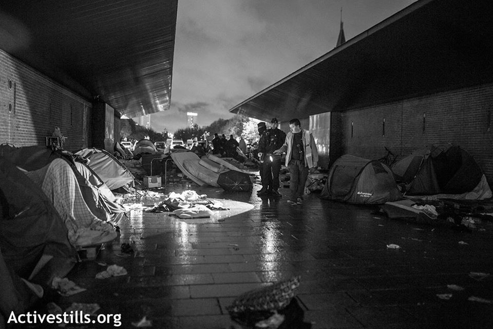
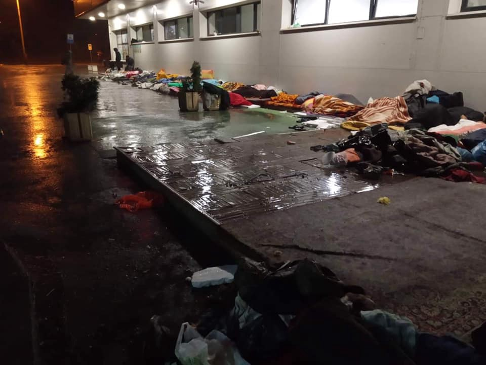
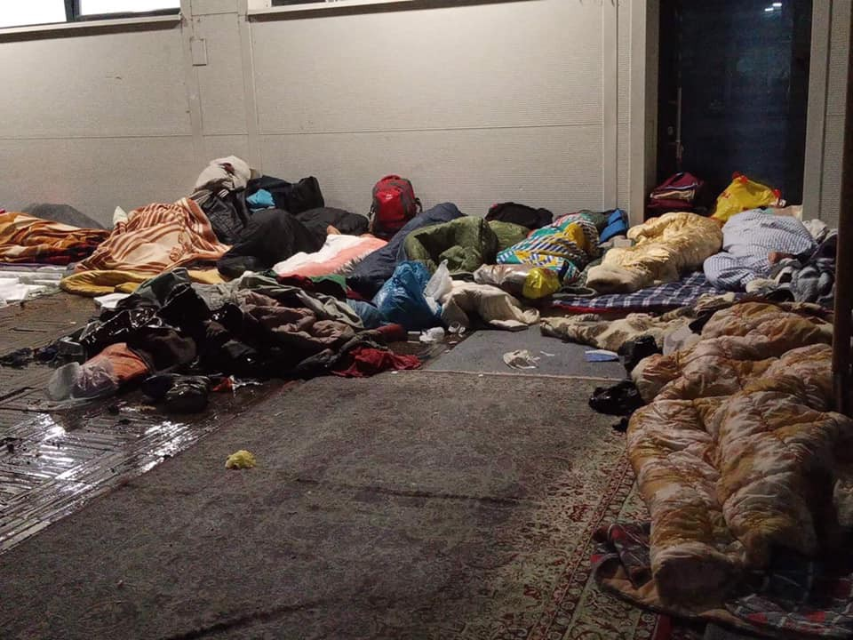

### AYS Daily Digest 7/11/2019 — 1,600 people evicted in Paris

Tougher measures for asylum seekers voted by French Parliament /// Moria: worse place for rights in Europe /// More right\-wing demos in Greece /// Deportations to Afghanistan from Germany reach 758 /// Updates from Bosnia /// EU to offer 50 million € to Turkish Coast Guard

 , Activestills\.org\)](assets/e3c5d9ae0b8a/1*I4qL84Dg_UtE7jw4ytSYIg.jpeg)

Eviction in Avenue Wilson, St\.Denis, Paris \(Photo by [Anne Pak](https://www.facebook.com/anne.paq.7/posts/2407594612839809) , Activestills\.org\)
#### FEATURE STORY — On the day France introduces tougher measures for asylum seekers, 1,600 people are evicted from two makeshift camps in Paris

Two makeshift camps in northern Paris were evicted yesterday, for a total of 1,600 people\. 15 gyms are going to be used for the next few days and weeks to host the evictees, but with no concrete plans for the future\.

■■■■■■■■■■■■■■ 
> **[La Cimade](https://twitter.com/lacimade) @ Twitter Says:** 

> > #PorteDeLaChapelle
L'évacuation du campement s'est déroulée ce matin. Depuis 2015, environ 40 opérations de démantèlement ont eu lieu dans le nord de Paris. À quand une politique qui prévoit un nombre de places d'hébergement équivalent à la demande ?
[lemonde.fr/societe/articl…](https://www.lemonde.fr/societe/article/2019/01/25/evacuation-de-300-migrants-d-un-campement-a-saint-denis_5414246_3224.html) 

> **Tweeted at [2019-01-25 09:01:45](https://twitter.com/lacimade/status/1088723587136135169).** 

■■■■■■■■■■■■■■ 

Solidarité migrants Wilson [report](https://www.facebook.com/permalink.php?story_fbid=1270804153120354&id=598228360377940&__tn__=K-R) that on Thursday a large contingent of police units arrived to evict the camp in avenue Wilson, in Saint Denis\. The eviction was [announced](https://www.facebook.com/anne.paq.7/posts/2407594612839809) one day earlier\. Police was ordered to throw away and destroy all tents\. One local volunteers said that when she saw the scene, she started to cry and was told by a police officer: “but what is it, lady, are you crying? This neighbourhood\! It’s not possible\. Everyone is crying this morning\!”\. Welcome to avenue Wilson\!

 , Activestills\.org\)](assets/e3c5d9ae0b8a/1*Zze_75ca9xIIxKn34sDGMA.jpeg)

Eviction in Avenue Wilson, St\.Denis, Paris \(Photo by [Anne Pak](https://www.facebook.com/anne.paq.7/posts/2407594612839809) , Activestills\.org\)

On site, some people have been working since very early to preserve this “ridiculous and precious treasure” made of tents and sleeping bags\. Many people, including pregnant women were sleeping on the ground in the cold and in the rain\. When the police arrived, they seized the precious tents and threw them into the rubbish trucks to be destroyed\. People on site tried to prevent this action but police forbade any negotiation, as all the equipment had to end up in the dumpster\.

People who were sleeping in avenue Wilson are again sent to find another hidden spot, with no support from the authorities\. “Tactical cameras” and physical barriers have been installed in several areas of the city to discourage any relocation attempts\. According to a [media report](https://www.theguardian.com/world/2019/nov/05/france-migrant-workers-quotas-rightwing-voters-marine-le-pen-emmanuel-macron) , Michel Cadot, the head of Paris’s police force, stated that there would be a permanent police presence there “to stop these camps reforming\. That is the new element compared to all the measures taken in the past,” he said\.

But not everyone was crying: Some residents of the area actively [cooperated](https://www.facebook.com/permalink.php?story_fbid=1270804153120354&id=598228360377940&__tn__=K-R) with the police in denouncing everyone who was trying to flee\.

Most people were boarded on buses to gyms for temporary shelter\. Authorities reportedly promised that the situations of each migrant/refugee would not be verified, but it leaves some activists skeptical\.

 , Activestills\.org\)](assets/e3c5d9ae0b8a/1*_Zc3a28-pnTar7kQDVFogg.jpeg)

Eviction in Avenue Wilson, St\.Denis, Paris \(Photo by [Anne Pak](https://www.facebook.com/anne.paq.7/posts/2407594612839809) , Activestills\.org\)

Words keep being twisted into new uses, with the risk of becoming meaningless\. Cadot described the eviction as “taking back public spaces”\. Other police authorities described it as a “humanitarian” operation\. While it is obvious that these makeshift camps are not the solution, there is nothing “humanitarian” in destroying tents and forcing people into temporary centres from which they will be sent out in a few days or weeks\. Too often we hear statements describing such police operations as “evacuations” instead of “evictions”\. This choice of term is far from neutral\. It is inscribed in this meaning shift, which aims to frame such actions as “humanitarian” and for the wellbeing of refugees and migrants\. This hides the forceful and violent character of removing people from a place, of destroying their belongings, of depriving them of any kind of autonomy over their own lives\.

These evictions come on the day in which French MPs [approved government amendments to the finance bill for the year 2020](https://www.lacimade.org/reforme-de-lacces-aux-soins-des-etrangers-des-mesures-fondees-sur-un-rapport-sans-substance/) , reforming access to state medical aid \(AME\) and health insurance for people seeking asylum\. These measures are intended to protect the health\-care system from ‘ _misuse’_ , “so as to purportedly provide better access to care for honest people”\. It allows for more controls and delays access to health care for many people\.

The amendments voted on yesterday are part of a wider set of measures the government wishes to introduce:
- to require people to appear in person at the counter of the primary health insurance fund \(CPAM\);
- to introduce a three\-month waiting period before asylum seekers can access health insurance;
- to allow cross\-file checks between CPAM, the consulates and the police at the borders;
- to tighten access to benefits for asylum seekers;
- to introduce migrant workers quotas\.

According to [La Cimade](https://www.lacimade.org/reforme-de-lacces-aux-soins-des-etrangers-des-mesures-fondees-sur-un-rapport-sans-substance/) , the amendments follow a report by the General Inspectorate of Social Affairs and Finance\. The problem is that this report is said to be unfounded: “it does not contain any convincing data, and is limited to making mere assumptions” about frauds against publics health services and the “eternal fantasy of medical tourism”\.

The approval of these measures was anticipated by a heated debate in Parliament\. Many [observers](https://www.france24.com/en/20191106-live-french-pm-unveils-immigration-plan-as-government-moves-to-implement-quotas?fbclid=IwAR1awiYuOySJ1C1S1jpnFkm3B-ZZELkDOrErSF9fM2ewAZvECYBfRla9e8s) have harshly criticised Macron’s and Philippe’s new provisions as a bid to attract right\-wing voters\. Philippe especially is spearheading the government tough line on migration, using anti\-migrant and nationalist rhetorics and misconceptions\.

GREECE
#### Moria condemned by EU’s Fundamental Rights Agency

Confirming what we all know, [Moria is the place most devoid of fundamental human rights in the entirety of Europe\.](https://l.facebook.com/l.php?u=https%3A%2F%2Feuobserver.com%2Fmigration%2F146541%3Ffbclid%3DIwAR2n5PK_4iF4ys_b3ISTg1IBRFT3MajaULlGEC8DACkAwif1OnS-_KgyDmk&h=AT0_UFNXzqpUSVts8OKDbjPNfasGxT3Nkl1TzcdyigTugv271li2b1EfnKs0dE6STL_bY496OzMCUijZiOkB13Pto3wc7LdhVJW4kTGCCRBrwX8CGYDvP3c22OGjcM3d9_tpzADKbp2-kQ#) **The result of this situation is that children under ten have tried to commit suicide\. Self harm is rife\. Teenagers are turning to sex work to survive\.**
#### End the illegal Detention of Children

[RSA report](https://rsaegean.org/en/european-court-of-human-rights-asks-greece-to-transfer-two-unaccompanied-boys-detained-in-police-station-to-suitable-shelter/) that on the 4th of November 2019, the European Court of Human Rights informed the Greek Government that they should transfer two unaccompanied brothers to appropriate accommodation\. They had been detained for almost 15 days in police station cells under the umbrella of ‘protective custody’ and are still detained at the time of writing —

> in degrading conditions detrimental to their mental health ; in cells that are completely inappropriate for detention longer than few hours, in premises where adults, including detainees under criminal law procedures/provisions are held, with no yarding, no natural light and fresh air, no access to doctor and proper hygiene conditions, no outdoor or indoor activities, no access to the outside world, no way to communicate with their family members and no information about the duration of their detention\. 

This is their second period of detention as they were previously detained for about 12 days upon arrival\. Their treatment contravenes national, EU and international law\.

> RSA further emphasizes that apart from the minors represented by our organization, many more unaccompanied children remain detained in police stations, and Pre\-Removal Centers in similar conditions\. In particular, according to statistics of the National Centre for Social Solidarity, as of 30 September, there were 238 unaccompanied children in protective custody\. Not to mention that, in the same police station concerning the application before the Court, more children remain in detention at the time of the publication of this statement\. 

#### Hunger Strike Continues

It’s now [day 6 of the hunger strike](https://athens.indymedia.org/post/1600863/#antireport#Refugeesgr) in Petrou Ralli\. 9 of the 16 strikers are women from Syria and Palestine\. On the 6th of November they also started a thirst strike\. Yesterday a woman fainted but a police officer still refused to transfer her to a hospital\.

We stand in solidarity with the hunger strikers and ask the Greek Government to end it’s policy of arbitrary detention\.
#### More Right Wing demonstrations

According to [local media](https://www.keeptalkinggreece.com/2019/11/07/greece-racism-giannitsa-pupils/) , school children in Macedonia have been protesting against children from refugee families attending school\. Also in Northern Greece, in the village of Karitsa, some fully grown adults have prevented the housing of 40 unaccompanied children\.

**Good night white pride\.**
#### Last Day of ABR Fundraiser

One of the few sources of accurate arrivals numbers\. If you can support them, further info [HERE](https://www.facebook.com/AegeanBoatReport/posts/690260171497090) \.

BOSNIA AND HERZEGOVINA
#### Situation in Tuzla deteriorates as heavy rains arrive

 \)](assets/e3c5d9ae0b8a/1*-1nk6pE0JntU2W3FolNn8g.jpeg)

Tuzla \(Photo Credit: [Stefan von Ortenburg](https://www.facebook.com/stefan.vonortenburg?__tn__=%2Cd%2AF%2AF-R&eid=ARBsIh7YwPSLvisDczyA01olrILlJzs8xkBxuMLDil98K2TJ4-fEWRHp8ot6m4J92pqEFP54oHnjc4yf&tn-str=%2AF&hc_location=group_dialog) \)
#### Fights in [**Vučjak**](https://translate.googleusercontent.com/translate_c?depth=1&rurl=translate.google.com&sl=auto&sp=nmt4&tl=en&u=https://avaz.ba/tag/69081/vucjak&xid=17259,15700021,15700186,15700190,15700256,15700259,15700262,15700265,15700271,15700280,15700283&usg=ALkJrhiTdduRrf94uLZt38z8R0N5lYz1Ug)

[Local media report](https://avaz.ba/vijesti/crna-hronika/527724/masovna-tuca-u-vucjaku-izmedu-pakistanaca-i-afganistanaca-trojica-ranjena-nozem?fbclid=IwAR1Lvak2nfYMCapej-O_WcGShf1BB4DOZC4ulAnhVxvMvNJpRiiutGH75WQ) that a fight broke out between people from Pakistan and Afghanistan this morning\. Four people were injured, 3 with a knife and the 4th was severely beaten\. 4 people have been arrested\.

Living in these conditions will always lead to tensions as people are under severe levels of stress\.

GERMANY
#### Deportations to Afghanistan continue

> Friday morning in Afghanistan, an airplane lands with people who were looking for protection in Germany\. They are threatened by what the social scientist Friederike Stahlmann described in a [recent report](https://www.ecoi.net/en/file/local/2017434/AM19-8-9_beitrag_stahlmann_vorab191009.pdf) : stigma, impossibility to start a new business, violence\. _\( [Saechsischer flüchtlingsrat](https://www.saechsischer-fluechtlingsrat.de/de/2019/11/07/pm-stigmatisiert-und-wieder-im-krieg-schweisser-nach-afghanistan-abgeschoben/?fbclid=IwAR01RMfyHByuChUNZHvW0waawiTNOh-XSAWacOsPW7VBWnlOc4CqRfM3vfY) \)_ 

Saechsischer flüchtlingsrat — The Saxon Refugee Council \(SFR\) [report](https://www.saechsischer-fluechtlingsrat.de/de/2019/11/07/kurzinfo-drei-personen-aus-sachsen-am-06-november-nach-afghanistan-abgeschoben/?fbclid=IwAR1aj4fHtDaVAOicyBi9t63k-xyr6CXzqOnj8z1xFsdK_oqb3tKXkhT6Aew) that since October 2017, 31 have been deported to Afghanistan from Saxony\. Three people were deported from the airport Leipzig / Halle to the war in Afghanistan on the 6th of November\.

**German authorities have deported758 people since December 2016 to the country\. In Afghanistan civilian casualties have [reached](https://www.upi.com/Top_News/World-News/2019/10/17/UN-report-Civilian-casualties-in-Afghanistan-reach-record-high/6281571337583/) a new high in 2019\.**

SFR adds that Zaidullah A\., who lived in the Vogtlandkreis \(southwest Saxony\) was picked up from work, despite being eligible for a “employment toleration”\. His application had already been submitted and the immigration authority had been requested not to deport him until the end of the year\.

The “employment toleration” was adopted with the so\-called “migration package” in the summer of this year\. It is designed to protect people from deportation, if they can secure their own livelihood\. However, it will not come into effect until January 1, 2020\. A decree, which would have allowed for a grace period until the new year, was not approved by the Saxonian parliament\.

On Wednesday local authorities brought Zaidullah to the airport anyway\. Despite an emergency appeal he was deported\.

**The Working Group on Asylum Seekers, Saxon Switzerland / Eastern Ore Mountains has launched a petition: [We do not do that anymore\! Bring them back to us\!](https://www.openpetition.de/petition/online/gegen-den-abschottungs-und-abschiebewahn-bringt-unsere-freundinnen-zurueck)** The association demands the return of a family deported on the 10th of September\! This requires the removal of the entry and residence ban, the swift issue of a visa and the cancellation of all costs incurred due to the deportation\.

FRANCE
#### Volunteer calls

[Calais Light](http://www.calaislight.com/) , is looking for volunteers to support projects in Calais such as Help Refugees UK, Care4Calais & Refugee Community Kitchen in Calais\.

Read more and sign up [HERE](http://www.calaislight.com/?fbclid=IwAR07Bwmt8xG-ECxlvknqfpojKdNnAiYuG6_qfh1ssHLlnotgfbtpXzhy_aI) \.

EU
#### EU to offer Turkey €50m

[Reports suggest](https://euobserver.com/tickers/146548?fbclid=IwAR1D7H-JhWhzfTL5hsCzwJCpuxhplbukhzpTHSCzBW6P9kSsMnyTOJ-lOOc) that the EU is preparing a new package for Turkey in order to boost the capacity of the coast guard despite the fact that their military operations in Syria have recently displaced thousands of people\.

**Apart from daily news in English, we also publish weekly summaries in Arabic and Persian\. Find specials in both languages on our [medium site](https://medium.com/are-you-syrious/ays-weekly-in-arabic-and-persian/home?source=post_page---------------------------) \.**

**If you wish to contribute, either by writing a report or a story, or by joining the info gathering team, please let us know\.**

**We strive to echo correct news from the ground through collaboration and fairness\. Every effort has been made to credit organizations and individuals with regard to the supply of information, video, and photo material \(in cases where the source wanted to be accredited\) \. Please notify us regarding corrections\.**

**If there’s anything you want to share or comment, contact us through Facebook, Twitter or write to: areyousyrious@gmail\.com\.**

_Converted [Medium Post](https://medium.com/are-you-syrious/ays-daily-digest-7-11-2019-1-600-people-evicted-in-paris-e3c5d9ae0b8a) by [ZMediumToMarkdown](https://github.com/ZhgChgLi/ZMediumToMarkdown)._
