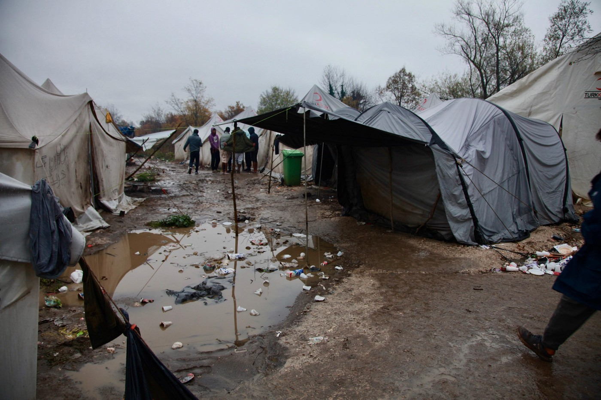
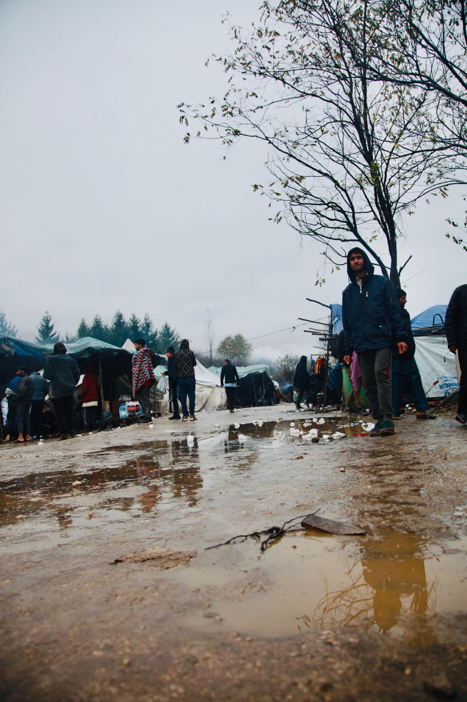
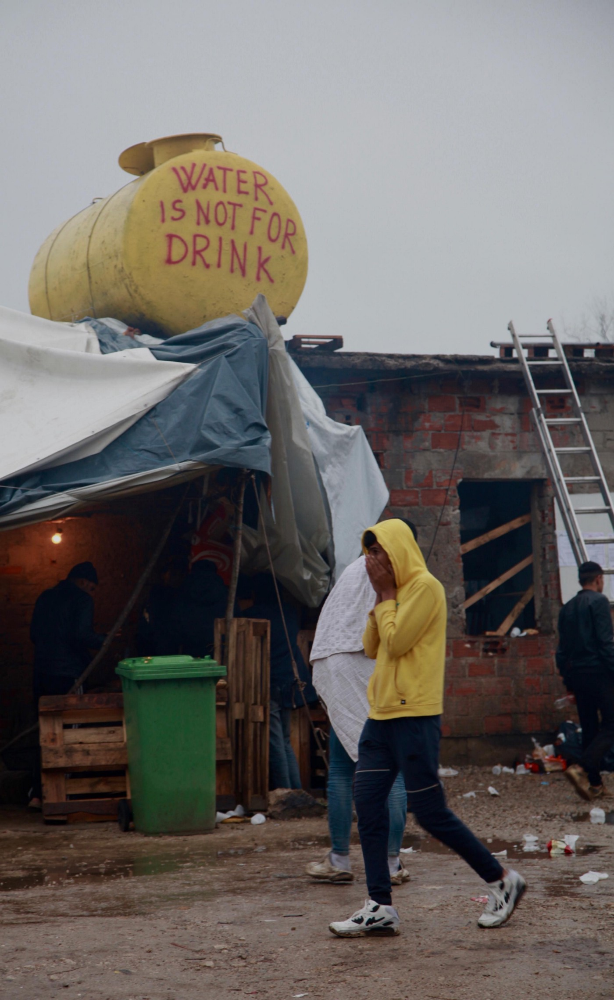
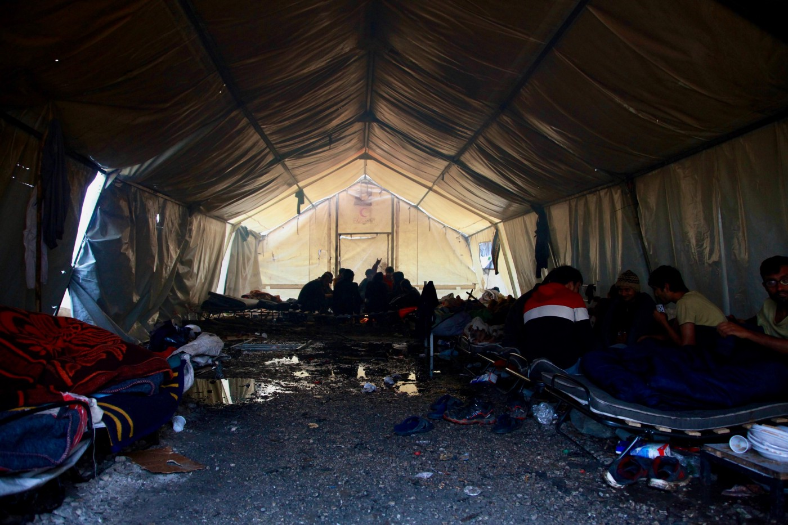
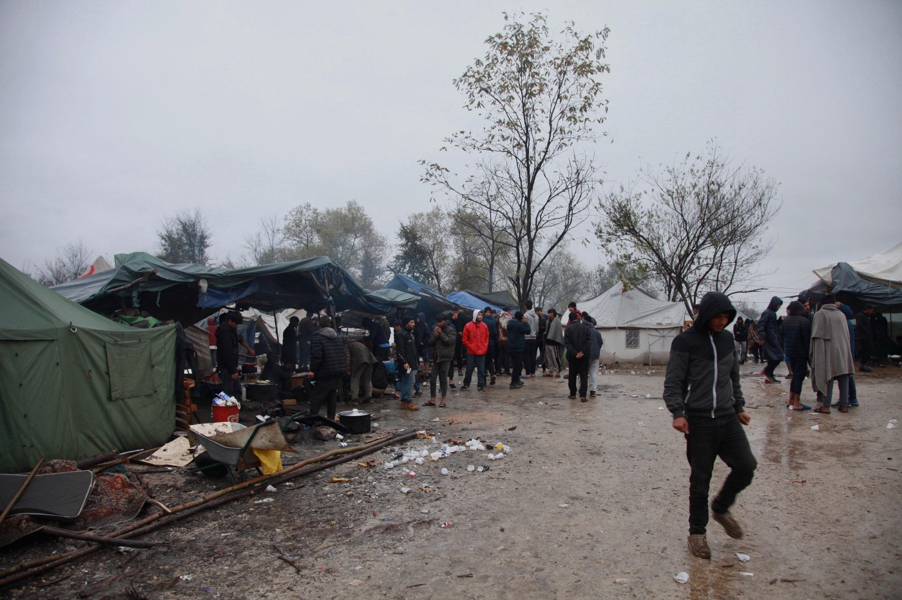
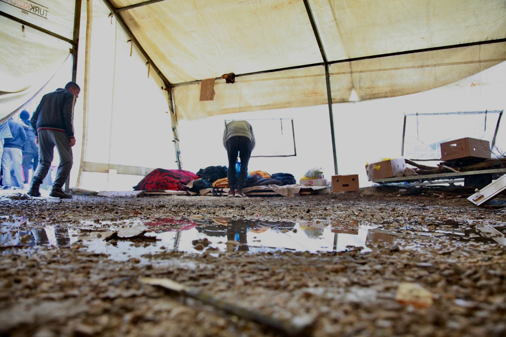

### AYS Daily Digest 12/11/19: Slovenian activists demand action after the recent deaths reported in the area
#### An update from Vučjak / Reaction from Slovenian activist to the recent deaths / A young man dies in detention centre in Paris, another one takes his own life in Italy, ahead of aprobable deportation / Situation deteriorating in the north of Paris / updates from Bulgaria / & more news

Vučjak, November 11 \(Photo by: Arye Wachsmuth\)
#### FEATURED

> Slovenian police has been systematically violating basic international law with the practice of illegal denial of right to asylum procedure and cooperation in conducting chain pushbacks of migrants from Slovenia to Croatia and from there on to Bosnia and Herzegovina\. 

After having pulished the results of an investigation of practices of the Slovenian police at the border, during which we found out that the Republic of Slovenia is systematically preventing migrants access to the asylum procedure, the Slovenian activist group InfoKolpa published a statement after the recent deaths in the border area, reminding that the Slovenian police is complicit with the systematic malversation of official procedures at the border\.

> People who are detained because of irregular border crossing are denied the right to seek asylum by Slovenian police\. After the detention people are then subjected to unlawful collective expulsions, and exposed to the risk of torture after the deportation to Croatia\. According to official data, the Slovenian police handed over almost 8,000 persons to Croatia by the end of September this year under the readmission agreement, out of the officially reported 11,800 who were caught on the basis of irregular border crossing\. We assume that the instructions for such conduct by the Slovenian police are included in the police directive issued on the 25th of May 2018, which is still not accessible to the public in full\. The illegal actions of the Croatian and Slovenian police are the main reasons why persons seeking protection do not seek the help with the state authorities, but spend several days in the forests and crossing dangerous rivers in hopes of finding a safe place to live\. 

Between September and November last year, through an emergency pone number established to monitor what was happening, the group was contacted by 106 people who crossed to Slovenia, of whom only 27 were able to ask for asylum, 39 were pushbacked to Bosnia and Herzegovina after police in Slovenia readmitted them to Croatia, and one was able to apply for asylum in Croatia\. They lost contact with 39 people after the police were notified of their location\. Due to the continued systematic violation of human rights by the police, they stopped operating the emergency number\.

> If we wish to prevent new deaths at the border, it is imperative to establish an emergency number that would have institutional support in overseeing police procedures and helping people on the way\. 

> The wider Kolpa river area has become an invisible cemetery, the Schengen “defense moat”, operating outside legal and humanitarian norms\. 

Ten days ago, two people drowned in Kolpa, and recently a 20\-year\-old Syrian citizen died from cold and exhaustion at Ilirska Bistrica\. These deaths are not accidental, but are a **direct consequence of the repressive border regime of the Republic of Slovenia and the European Union\.** Death is merely the final scene of the systematic violence summarized in the concept of the “Fortress of Europe” that migrants have to face daily in the Balkans\.

Further on, they write:

> As we wait for clarifications and answers about the recent tragic events in Kolpa river and in the forests at Ilirska Bistrica, let us remember last year’s November when an Algerian man drowned in the Reka River\. A group of 11 people were spotted by the police and some decided to hide themselves in the river\. One escaped, the other stayed in the water, and the third, who was a non\-swimmer — despite the attempts of firefighters to revive him — drowned\. A friend of the deceased, who went to seek help for the drowning person, was then expelled to Croatia within a few hours and was then violently pushed to Bosnia and Herzegovina\. In 2015 people were able to cross borders at official crossings, but today the situation is different\. Fear of the police, extradition to Croatia and return to BiH compels people on the path to impulsive decisions and risky behavior\. With no options to cross the borders legally, migrants are forced to choose more and more dangerous routes and are increasingly more exposed to mortal dangers\.They share the fate of many migrants who travel across the Sahara, the Mediterranean, across the deserts and rivers of North America, or in refrigerated trucks trying to cross to England\. Migrant deaths along the way are a global problem\. This grim statistics of deaths are also enhanced by cases from the territory of the Republic of Slovenia, located on one of the global humanitarian hotspots\. 

> On the day of Remembrance of the Dead, the Slovenian Government prepared a memorial at the Monument to the Victims of All Wars in Congress Square\. The fact that migrants come from areas that have also been destabilized by the post\-colonial appetites of NATO members should not be overlooked\. NATO is a defense pact, whose members often act not defensively, but as aggressors without serious obstacles and international support\. Investing in military and security capabilities, expensive and dangerous surveillance technology and erecting fence panels will not solve the problem of migration, but will only aggravate, escalate and militarize it at the expense of new deaths\. The least we can expect from a national summit is the realization that the victims of all wars must also include those who have silently drowned on the borders of the European Union, including the wider area of Slovenia’s southern border\. 

**Their demands are:**
- **Immediate stopping of collective expulsions to Croatia under the pretext of the 2006 Readmission Agreement, immediate suspension of this Agreement and respect for the fundamental right to international protection and the dignity of human life;**
- **Institutional support for the immediate introduction of monitoring and emergency assistance telephone number for migrants;**
- **Full disclosure of the content of the disputed police instructions dated 25\.5\.2018 and initiation of investigations against responsible at the top police and Ministry of Internal Affairs;**
- **Investigations against individual police officers in cases where the use of excessive physical force against persons treated at individual border police stations has been identified\.**

Find more information \(in Slovenian\) [here](https://radiostudent.si/politika/balkan-ekspres/v-nebesih-ni-meja?fbclid=IwAR1HE3wqBWVjd2Qt7go6XyQdbzyqgALnlHJnFBYp7HJjzvWgMRrQKByGoFg) \.
#### BULGARIA

[Border Monitoring Bulgaria](https://bulgaria.bordermonitoring.eu/) reports:

In the first 10 months of 2019, the Bulgarian Border Police officers prevented [2,122 attempts at ‚illegal‘ entry at the Bulgarian\-Turkish border and 3,795 attempts at the border with Greece](https://www.novinite.com/articles/201535/Nearly+400+Illegal+Migrants+Are+Detained+on+the+Bulgarian+Border+with+Greece+and+Turkey) \. This was statet by the Bulgarian Ministry of Interior \(MoI\) \. In September 2019 the number of people who were trying to attempt the Greek\-Bulgarian border was rising\. Due to the Bulgarian MoI Mladen Marinov [further police](http://bnr.bg/en/post/101164579/interior-minister-mladen-marinov-attempts-by-migrants-to-enter-bulgaria-from-greece-are-up) units were installed at the border\. The Bulgarian premier Boiko Borissow stated that at the moment around a daily amount of [150 migrants are being caught in the border region](http://bnr.bg/en/post/101165589/bulgaria-continues-to-be-candidate-for-membership-in-schengen-area) \. During a meeting with Alexander Dobrindt in Berlin Borissov statet that he was not sure anymore if a membership of Bulgaria in the Schengenarea during the current times [would be meaningful, because of the possible ‚danger‘ of more migrants coming from Greece](https://www.schengenvisainfo.com/news/bulgaria-doesnt-want-to-join-schengen-zone-for-now-due-to-fear-of-migrant-invasion/) \. Already a few days later Borissov [relativized his statement](https://www.bnt.bg/en/a/pm-borissov-bulgaria-has-not-given-up-on-joining-schengen) and demanded more support\. The European Comission [declared that it is aware of the increase of the numbers](https://www.euractiv.com/section/justice-home-affairs/news/commission-aware-of-increase-of-migrants-to-greece-bulgaria/) , but the numbers are a lot lower than before the EU\-Turkey deal\.

The German broadcoast ARD produced Report München, the British Guardian and the research network Correctiv reported about the Europeans Border Guard’s acceptance of [human rights abuses](https://www.ardmediathek.de/ard/player/Y3JpZDovL2Rhc2Vyc3RlLmRlL3JlcG9ydCBtw7xuY2hlbi9mOTdjNzAyNS1iNDI4LTRiNTAtODg4Mi0yMjZiMjkxYWQwYWM/) by national Bulgarian officers\. The Bulgarian MoI Marinov [declared to the accusation](https://www.zeit.de/politik/ausland/2019-08/fluechtlingspolitik-bulgarien-menschenrechte-verstoesse-balkanroute-mladen-marinov) that “physical violence is only used, if the situation will require it“\. He further stated that this was only happening during attacks against the Bulgarians border guards\. FRONTEX declared that it has “no authority towards the behaviour of national border guards and no authorization for launching investigations on the territory of EU\-member states“\.
#### BOSNIA AND HERZEGOVINA
### Vučjak

Conditions are getting worse by the hour at the so\-called camp Vučjak, local and international activists, as well as organisations warn\.

“Heavy rain showers always turn the camp into a mud pool”, an activist reports from Vučjak:

> Many tents don’t withstand these conditions and are flooded\. A friend and others had to sleep on cardboard pieces and chunks of wood in a sitting position so that they could stay a bit dry\. 

Photos: Arye Wachsmuth

> Fewer people went on ‘the game’ than the previous days, so the camp is now even more crowded\. During the day at least three big police busses deported around 70 „new“ people to the camp\. People who are squatting in empty industrial buildings in Bihać told me later that the **police raided these places several times during the day** \. They are now on high alert when one approaches the premises\. In the camp, no water was available for the inmates yesterday\. I was able to find out why **people always tell me that they don’t get food, although organizations claim otherwise\.** A van with food did come yesterday and soon many went in line\. We counted 120 one by one, after a while some more joined in, so round about 170 or more in total\. The queue was slow and it was heavily raining\. After 50 people got 2 pieces of bread and a stew the rest got nothing\. 900 or more people are living in the camp, so no wonder the most say that there is no food except for the bread and canned food in the morning\. People were angry but as it seemed they were used to it so they just complained mildly for a minute after giving up\. 

> They only cried their hearts out by telling me that it is always like that and that they just do not understand why this is even possible\. As reported earlier hopelessness is the only way to describe what people feel here\. 

Also, you will find no one that does not have a story to tell about **the immense brutality of the Croatian police** \. We also collected interviews and photos on that issue during our stay these days\. According to many, violence is also brought upon innocent refugees by the Bosnian police, making the people even more insecure and vulnerable\.

A man told me in camp „oh cold now\. \. winter here“\. I am afraid he doesn’t know that during this time of year or a bit later snow can reach 1\-meter height in Vučjak — now that the EU and several political quarrels in Bosnia about what or how they will save the people is yet undecided it is getting more likely to happen\. I wonder who will take the responsibility for the deaths that are now closer to become reality than ever before, Arye Wachsmuth writes from Vučjak\.

All photos: Arye Wachsmuth
#### FRANCE
### Racism of the City of Light

[Solidarité migrants Wilson](https://web.facebook.com/Solidarit%C3%A9-migrants-Wilson-598228360377940/) reports that 985 tents and 5,000 blankets were confiscated to be crushed in last weeks actions that we wrote about in AYS News Digest\. It was called a “humanitarian operation” in the words of Préfet Lallement who gave the orders, they say\.

> No reason to worry since we are informed that this 59th evacuation is this time “final” … Curious, however, tonight we met the first people put on the street after a wonderful weekend in a gym …
 

> Tonight we also met some of the 150 people transferred in convoy from the Porte de la Chapelle after being deprived of their tent\. 

Meanwhile, the police asked the activists for their “permission” \(sic\) to give food and forbid vehicles to enter the park\. “People we know told us how in the day the platform of the Porte d’Aubervilliers had been banned people of color \(“migrants”\)“, the activists report\.

> For three years, we have seen, one after another, several hundred people sink into madness\. One because he was denied asylum, the other because he had been unable even to get an appointment, another because suddenly he was told that he and his pregnant wife had \(for legally incomprehensible reasons\) more right to the “material conditions of reception”\. Others because they had been told ten times the story of the torments suffered to finally treat them as liars\. Others because they were told that they older, even with papers that prove the opposite, and that they were sent back to the dark night\. 

The raids of the last days, the people who are arrested while they come to get food, those who receive an OQTF \(obligation to leave the territory\) before being able to apply for a wing, the upcoming evictions around Porte d’Aubervilliers, all of this is the current reality in France’s capital, and with no solution in sight\.
### A boy died in detention centre in Paris

A 19 years old boy from Tunisia died last Friday in a detention center in Paris, rtbf\.be [reports](https://www.rtbf.be/info/monde/detail_france-mort-d-un-jeune-tunisien-dans-un-centre-de-retention-de-migrants?id=10362635&utm_source=rtbfinfo&utm_campaign=social_share&utm_medium=fb_share&fbclid=IwAR2NCGXNgZuLSkGCTm99bZw5sN-bQd1fQwrJ0G3fV4wtBuqDRNhJMIhBovY) , referring to AFP information\. He was found dead in his bed, according to an unnamed source\. Toxilogical analysis has still to be made, but it seems, that he consumed drugs and narcotics\. Already in August a man from Romania had died in the detention center with 235 places\.
Constant warnings by the international health organisations of poor healthcare for the young people on the move who have been through traumatic experiences and find themselves without a solution, care, system or options, often leaning towards other solutions to live through the day, while abused, hungry and forgotten in many detention centres and ‘camps’ across the continent\. This must change\.
#### ITALY
### A young man threatened with deportation takes his own life

In Viterbo, a 24 years old man from Sudan committed suicide in the Mammagialla prison\. According to [roma\.fanpage\.it](https://roma.fanpage.it/detenuto-simpicca-al-mammagialla-di-viterbo-aveva-solo-ventanni-soffriva-di-problemi-mentali/) , he hanged himself on Moday\. He is said to have had mental problems\. He was detained since March and about to be released in 2020\. Activists complained, there was no support for him and other people who are threatened with deportation\.

**Find daily updates and special reports on our [Medium page](https://medium.com/are-you-syrious) \.**

**If you wish to contribute, either by writing a report or a story, or by joining the info gathering team, please let us know\.**

**We strive to echo correct news from the ground through collaboration and fairness\. Every effort has been made to credit organizations and individuals with regard to the supply of information, video, and photo material \(in cases where the source wanted to be accredited\) \. Please notify us regarding corrections\.**

**If there’s anything you want to share or comment, contact us through Facebook, Twitter or write to: areyousyrious@gmail\.com\.**

_Converted [Medium Post](https://medium.com/are-you-syrious/ays-daily-digest-12-11-19-slovenian-activists-demand-action-after-the-recent-deaths-reported-in-9bff1d276c6b) by [ZMediumToMarkdown](https://github.com/ZhgChgLi/ZMediumToMarkdown)._
