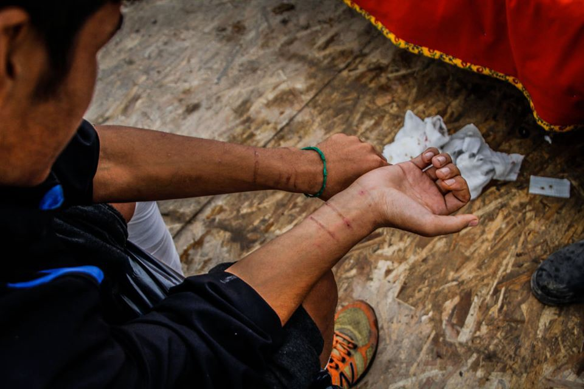
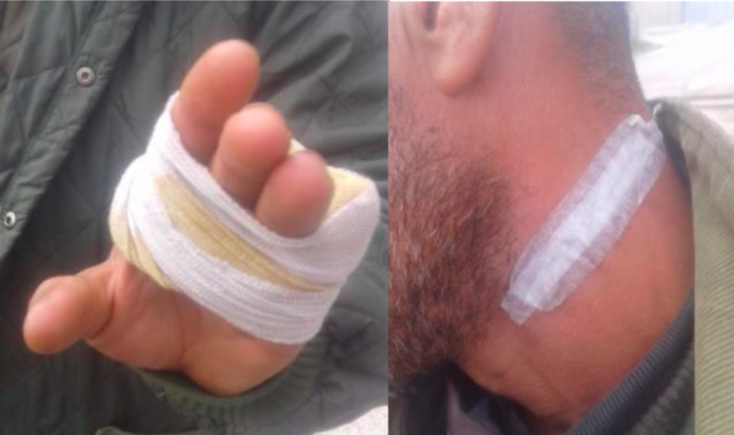
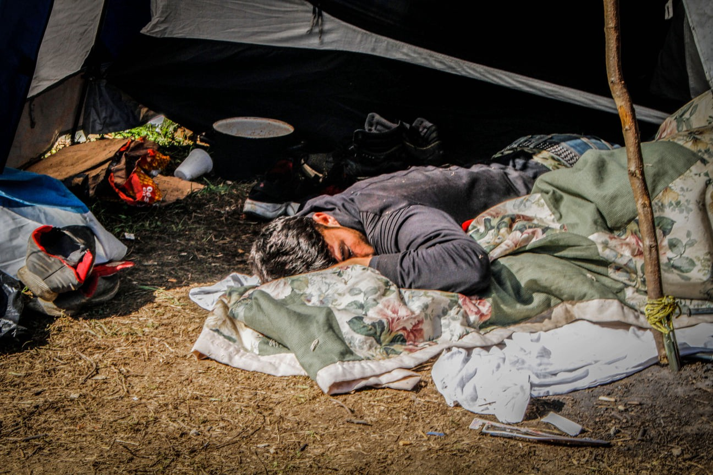
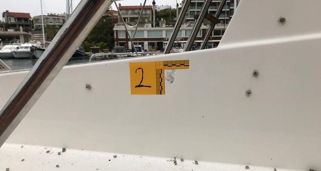
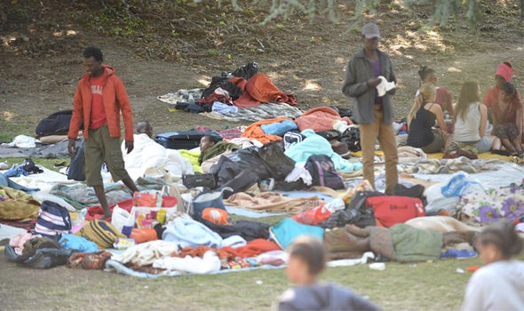

### AYS digest 14/11/19: Croatian MEP says “pushbacks are fake news”
#### Over the past 2 days, reports from Border Violence Monitoring Network, Human Rights Watch and Are You Syrious were quoted heavily in the European Parliament / Syrian refugees say Greek coast guard opened fire at them, bullet holes found on boat / Vial camp is drowning as people wait for relocation to the mainland Greece / European Court of Justice rules that no asylum seeker should be left in the street, Italy ignores

Marks from handcuffs used by the police officers before the person was pushed back from Croatia to Bosnia\. Photo: Dean Blažević
#### Featured Story
### In the heated debate in the European Parliament, Croats claim NGOs “made up stories about pushbacks for their political gain”

After the SAR resolution of the European Parliament [miserably failed](ays-digest-25-10-19-rejected-by-eu-23-people-die-in-libyan-detention-2a47398c010c) , the international focus is shifting again towards the situation on the Balkan route\. Yesterday, around 50 Members of the Parliament and their staff members attended the event dedicated to situation in Bosnia, namely the Una\-Sana canton and the notorious Vučjak camp\.

Findings and photographs of the Vučjak camp by volunteers Dean Blažević and Dirk Planert were presented, as well as the [latest report on pushbacks](https://www.borderviolence.eu/wp-content/uploads/September-2019-Report-1.pdf) published by the Border Violence Monitoring Network \(BVMN\) and the [report on Vučjak camp](ays-special-documenting-human-rights-violations-in-vučjak-camp-923607ace85d) published by the Are You Syrious \(AYS\) \.

Representative of the BVMN, Simon Campbell, presented the latest findings of NGOs monitoring violent pushbacks from Croatia\. The data were used in the Parliamentary [debate today](https://www.europarl.europa.eu/plenary/en/debate-details.html?date=20191114&detailBy=date) , with the migrant situation in Bosnia high on the Parliament’s agenda\.

Injuries sustained during the “fake news” pushback from Croatia to Bosnia\. Photo: BVMN

MEPs such as Dietmar Köster, Cornelia Ernst and Romeo Franz have justly warned that situation in Bosnia is a direct result of illegal pushbacks from Croatia, which triggered Croatian MEPs, led by the young Karlo Ressler, to counter\-attack\.

> “Recently we are facing attempts of political pressure because of our commited protection of European borders\. There are completely false unconfirmed allegations of inhumane treatment towards the migrants\. We should not give up to this pressure because we have the duty towards all EU citizens to protect the longest terrestrial border of the EU”, said Ressler, who is representing Croatia’s ruling party \(Christian Democrats\) in the European Parliament\. 

> “There is no proof for this\! No authority found any confirmation of the allegations of the NGOs who are doing this for their own political gain\! Show us the proof\!”, added his party colleague Tomislav Sokol later in the debate\. 

> “There is more than enough proof\. I can show you this report, you can read it\. It shows exact times and locations of pushbacks”, replied Romeo Franz of the Group of the Greens/European Free Alliance , waving our reports in his hand\. 

Despair in Vučjak camp is a direct result of Croatian violations of human rights\. Photo: Thom Davies

While Croatian MEPs, encouraged by the European Comission, are insulting the international community by denying the obvious, BVMN has recently published [600th report](https://www.borderviolence.eu/600th-pushback-report-made-by-the-border-violence-monitoring-network/) of the illegal, collective pushbacks in the Balkans\. Last week, [Human Rights Watch](https://www.hrw.org/news/2019/11/08/eu-address-croatia-border-pushbacks) also presented their latest findings to the Parliament\. How much more proof do they need?
#### Aegean Sea Pushbacks
### Syrian Refugees: Greek Coast Guard Fired on Us\!

Twenty\-seven refugees claimed the Greek Coast Guard opened fire on them on Thursday \(14/11/2019\) as they attempted to reach the Greek island of Chios from Çeşme, a Turkish resort town in the western province of İzmir\.
Multiple bullet holes were visible on the boat that was towed to the port by the Turkish Coast Guard\. Refugees were discovered aboard the boat by Turkish soldiers patrolling the area\. Among them were 17 Syrian and 10 Somali migrants, while authorities arrested one smuggler helping them\.

Bullet holes on the boat that was carrying refugees from Izmir to Greece\. Photo: Daily Shabah

Baz Muhammad, a Syrian refugee told [the media](https://www.efsyn.gr/ellada/koinonia/218984_pyrobolismoi-apo-limeniko-kata-barkas-poy-metefere-metanastes) that they left for Greece on Wednesday night and approached Chios about 30 minutes later\. He said they stopped the boat some 20 meters away from the island when they spotted by the Greek Coast Guard\.

> “They had no light on their boat and then they turned on their lights about 200 meters away from our boat\. They started firing into the air but we kept moving\. They fired on us when we approached the island\. It lasted for about 20 minutes and I counted about 100 rounds fired on us,” he said\. 

#### At Least 36 People Deported from Greece to Turkey in December

According to the [Deportation Monitoring Aegean](https://dm-aegean.bordermonitoring.eu/) , at least 26 people were deported from Greek islands to Turkey in December, including 4 from Pakistan, 8 from Syria, 1 from Bangladesh, 6 from Iraq, 1 from Iran, 5 from Egypt, 2 from Nigeria, 3 from Cameroon and 6 of unknown nationality\.
#### Severe Flooding Has Hit Vial Hotspot on Chios, Greece

](assets/4df451704db5/1*GaZSkj3_asTpxcWhmvS6cA.jpeg)

Photo credit: [Elena Depi De Piccoli](https://web.facebook.com/elena.depiccoli?__tn__=lC-R&eid=ARBVZhc02POKcR8TVx7ZDNutncDaZ77A5CEUzajuG8Xj9CWRnRS9LF7VZ99phh43_Y8k3xY5DWFbl-OL&hc_ref=ARTv6vnfXvxt026ErCVysypMVo_9ZZOlY-t6ZPcByE30xFvh2BF6e09xk0KS1wa635w&__xts__%5B0%5D=68.ARBo-0tYcloL5NHG1eirSA4rXV_STIl51HFe-F4VKKQeyMNqhjuF0Y3DQEX1_JxR7wcoR3_UatGswKlkCv5DUTLpbgz5fctPq26CX3KSk9XkqDLX7VB_AJR9PZ0JAf09D4geM40yHe52P__wKDLSe_Xn10M1HiaDYzucXBlL0U_JP-8_1yd0Pi7OQIZuibmm9rwYbu6Q-RVP5BKGi-bVNkUt125dKENYeuWwtt0dKiLHSegs1fTi6t_fn7Zs97qBBrCBBpY)

After years of reporting on the horrific conditions in Greece, it’s tragic yet not unexpected that the terrible conditions have been exacerbated by the poor weather\.

Hundreds of people are trapped in these debilitating circumstances, and are later blamed and demonized for their wish to go elsewhere\.

If you had a family, would you consider this a “safe third option”?

We are now on year four of warning about dire winter conditions, and those warnings have only expanded…

■■■■■■■■■■■■■■ 
> **[Եհҽմɾցíɑ_ցօҽԵíɑ ⛧](https://twitter.com/Theurgia_Goetia) @ Twitter Says:** 

> > ΒΙΑΛ σήμερα. Τα ίδια κάθε χρόνο.
VIAL "hotspot" of #Chios after the rain.
Nothing changed all these years.
#Refugeesgr #Refugees https://t.co/J858Y1FnTt 

> **Tweeted at [2019-11-14 13:49:15](https://twitter.com/theurgia_goetia/status/1194975585967263746).** 

■■■■■■■■■■■■■■ 

The European Court of Auditors published a report highlighting the inadequacy of EU support for refugees and relocation in Italy and Greece\. Greece\.

_“Of the initial target of 160,000 migrants, EU countries legally agreed to relocate 98,256\. However, only 34,705 \(21,999 from Greece and 12,706 from Italy\) were relocated\. The auditors say the schemes underperformed mainly owing to the very low share of potentially eligible migrants registered for relocation, as both countries’ authorities were initially unable to identify all potential candidates and successfully channel them towards applying for relocation\. Once migrants were registered for relocation, efforts were more successful\. Nevertheless, the auditors identified a number of operational weaknesses in the relocation process\._

_In Greece, an increased capacity for processing asylum applications was still not sufficient to tackle the increasing backlog\. The 2016 EU\-Turkey statement has had a major impact on arrivals\. However, its cornerstone, the fast\-track border procedure for examining asylum applications, is not swift enough: in 2018, instead of a few days, it took on average 215 days from an application to the first instance decision\. Issues such as a shortage of doctors to conduct vulnerability assessments on Greek islands were a key factor in these delays\. For the accelerated and regular procedures, the situation was even more problematic, with interview dates set for as late as 2021 and 2023 respectively\. Moreover, a large caseload of negative first\-instance decisions is moving to the already overloaded appeals stage\.”_

Report from [EUreporter](https://www.eureporter.co/frontpage/2019/11/14/migration-time-to-step-up-action-to-address-disparities-in-greece-and-italy-say-eu-auditors/) \.

It’s clear that these programs have had serious amounts of financing, yet the incompetence, lack of will to act, and pervasive corruption and foot dragging end up resulting in nightmarish situations on the ground\.

Time for a REBRAND\!

According to Ekathimerini, the previously titled “Protecting our European Way of Life,” portfolio related to migration given to Greek politician Margaritis Schinas, will now be named [“Promoting the European Way of Life\.”](http://www.ekathimerini.com/246419/article/ekathimerini/news/commissioner-schinas-portfolio-to-be-renamed) Judging from Schinas’s political affiliations, however, we expect that the previous, non\-PC name is a bit more transparent\.

■■■■■■■■■■■■■■ 
> **[NoBorders](https://twitter.com/Refugees_Gr) @ Twitter Says:** 

> > #refugeesgr Πρόσφυγας από Λαϊκή Δημοκρατία του Κονγκό, τέθηκε σε διοικητική κράτηση παρότι νεφροπαθής τελικού σταδίου, παρέμεινε σε κράτηση χωρίς να γίνει καμία ενέργεια από την αρμόδια Α.Ε.Μ.Υ. , κατέρρευσε διακομίσθηκε στο νοσοκομείο σε κρίσιμη για τη ζωή του κατάσταση #Lesvos https://t.co/iVM8i84Z4O 

> **Tweeted at [2019-11-14 11:45:51](https://twitter.com/refugees_gr/status/1194944530384117762).** 

■■■■■■■■■■■■■■ 

Translated “ [\#refugeesgr](https://twitter.com/hashtag/refugeesgr?src=hashtag_click) A refugee from the Democratic Republic of the Congo, was placed in administrative detention despite a kidney failure, remained in detention without any action by the competent AEMY\. , collapsed and was hospitalized in a critical condition for his life [\#Lesvos](https://twitter.com/hashtag/Lesvos?src=hashtag_click) ”

Ah, promoting the European Way of Life\.
### European Court of Justice Rules that No Asylum Seeker Should be Left in the Street, Italy Ignores

Refugees sleeping rough in Lecco, near the fancy Lake Como tourist resort\.

> On the 12th of November the European Court of Justice [\(C\-233/2018\) ruled](http://it.ly/2OaL15y) that “a Member State cannot, among the sanctions that may be imposed on an applicant for serious breaches of the rules of the accommodation centres as well as seriously violent behaviour, provide for a sanction consisting in the withdrawal, even temporary, of material reception conditions \(…\), relating to housing, food or clothing, in so far as it would have the effect of depriving the applicant of the possibility of meeting his or her most basic needs” 

This decision intervenes in the same days in which an increasing anomalous behavior is registered on the part of managers of centers, in several parts of Italy, who permanently withdrawed the reception of asylum seekers for being absent for just one day\.

Due to the expiration of the housing project contracts, hundeds of asylum seekers will have to leave their current accomodation in Lecco, Northern Italy, at the end of December\. No alternative solution is available, not even for mothers with children, psychiatric patients and other vulnerable cases whose time is now running out\.
### Italian Supreme Court Overrules Salvini’s Anti\-Migrant Security Measures

Yesterday, the Italian Supreme Court ruled that all humanitarian protection applications filed before 5 October 2018, when the 1st security decree was introduced by ex\-minister Salvini, have to be evaluated according to the previous law\. According to the [local press](https://www.fanpage.it/politica/cassazione-smonta-il-decreto-sicurezza-sui-migranti-ma-salvini-non-lo-capisce-ed-esulta/) , this ruling will be immediately valid, opening new window of hope for those who were caught up in the populist anti\-migrant fenzy\.

Italy could be held partially accountable for human rights abuses of migrants and refugees due to their cooperation with Libya\. Based on the case from 2012 where the European Court of Human Rights condemned Italy’s return policy \(interception and return to Libya which had been practice since 2008 at least as per agreements between first then leader Gaddafi’s government and then the subsequent Libyan officials after the overthrow\) \. For more on the current court case being lodged against Italy, go [here](https://www.amnesty.org/download/Documents/EUR3013922019ENGLISH.pdf) \.

**FINLAND**

In Finland there was an important ruling related to a case of voluntary return wherein one of the voluntary returnees was killed after returning to Iraq\. Authorities were not found to have been absolved of responsibility in spite of the fact that it was a “voluntary return” \(in this case a voluntary return wherein the other option was expulsion\); furthermore, Finnish authorities were found to have not carried out their due diligence in assessing previous threats to the deceased while executing the “voluntary return\.”

For a technical summary, go [here](https://twitter.com/EricFripp/status/1194974278405513217) \.

**Find daily updates and special reports on our [Medium page](https://medium.com/are-you-syrious) \.**

**If you wish to contribute, either by writing a report or a story, or by joining the info gathering team, please let us know\.**

**We strive to echo correct news from the ground through collaboration and fairness\. Every effort has been made to credit organizations and individuals with regard to the supply of information, video, and photo material \(in cases where the source wanted to be accredited\) \. Please notify us regarding corrections\.**

**If there’s anything you want to share or comment, contact us through Facebook, Twitter or write to: areyousyrious@gmail\.com\.**

_Converted [Medium Post](https://medium.com/are-you-syrious/ays-digest-14-11-19-croatian-mep-says-pushbacks-are-fake-news-4df451704db5) by [ZMediumToMarkdown](https://github.com/ZhgChgLi/ZMediumToMarkdown)._
