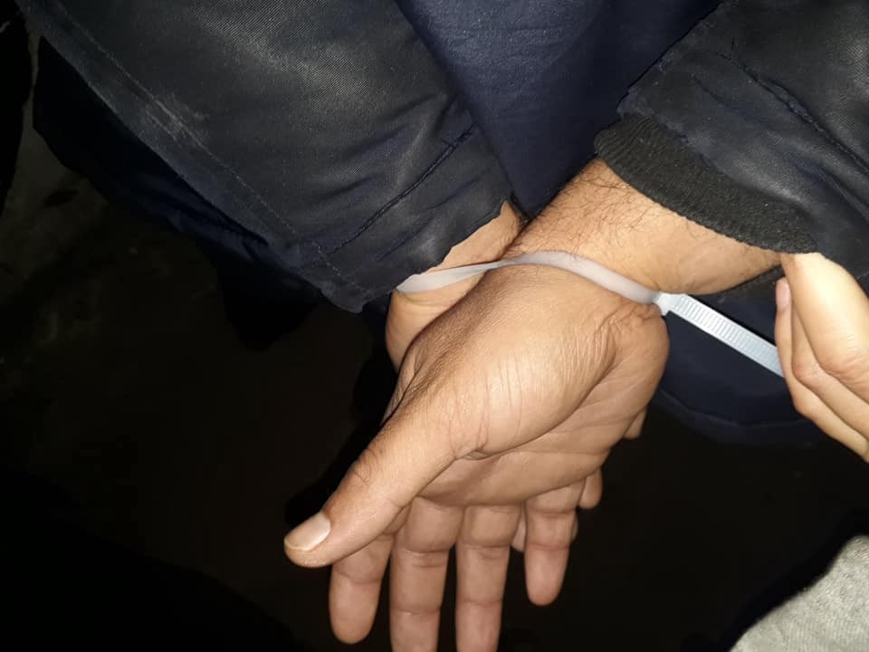
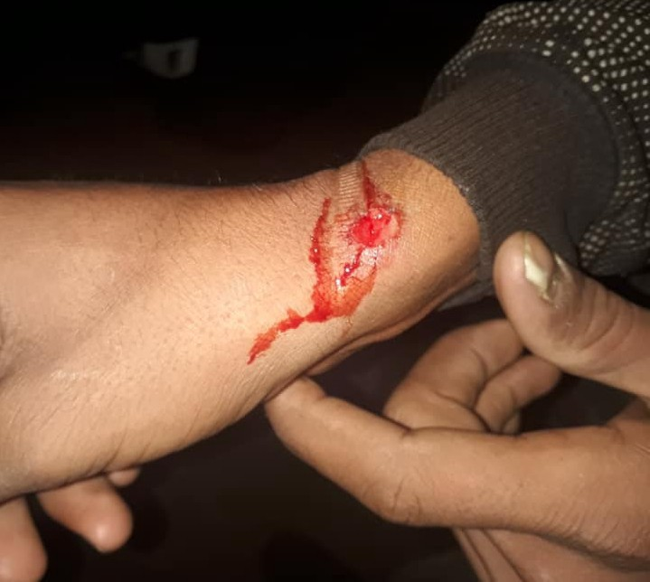
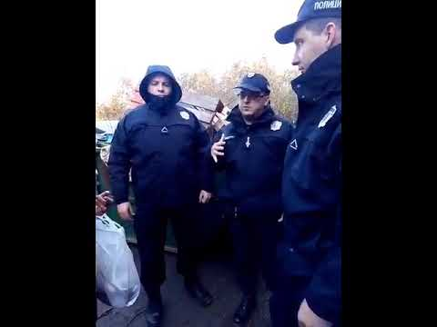
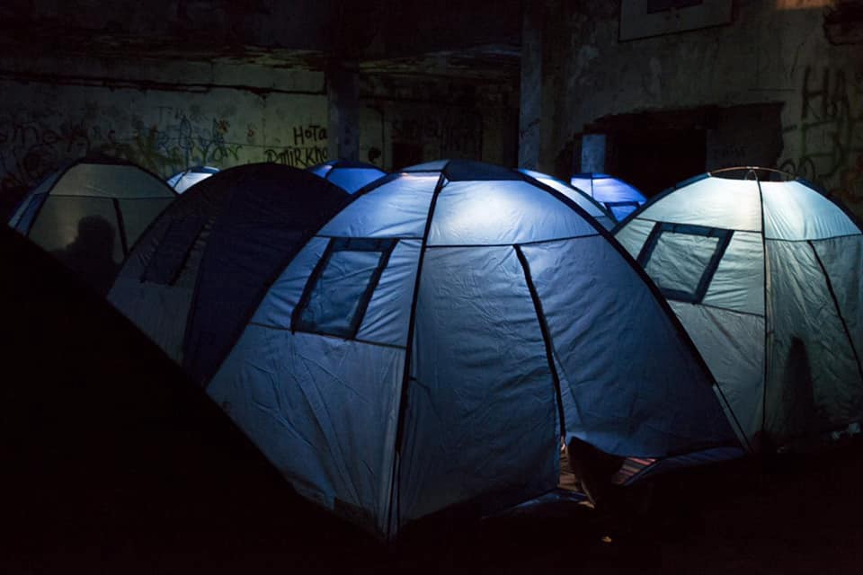
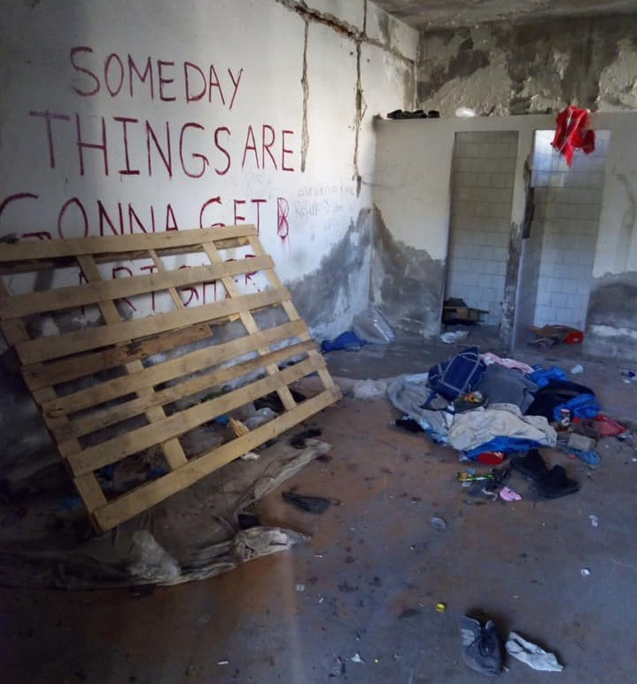

### AYS Special: A large\-scale police operation sweeps refugee squats in Northern Serbia
#### The largest eviction of people was carried out at the settlement in the former Grafosrem industrial facility, but was accompanied by the clearance of multiple other smaller squats throughout the city of Šid / The Deputy Head of the Municipality of Šid, Mr Zoran Semenović was also in attendance, declaring the abandoned factory site to be his property, loudly insulting NNK volunteers that were present and — together with police — removing these witnesses from the area

People have been cuffed and removed from the squats in the Šid area\. Photo: Davy Jones
### **Undocumented people taken from the streets**

In the early hours of Friday, 22nd November 2019 a large\-scale police eviction took place in Šid, Serbia\. Some might recall the illegal burning of a migrant encampment close to the border of October 20th, among many others\.

Sweeping all squats and unofficial settlements, the recent operation aimed to remove all undocumented people in transit from the streets of Šid\. The action targeted approximately 150 people in and around Šid\. The largest eviction of people was carried out at the settlement in the former Grafosrem industrial facility, but was accompanied by the clearance of multiple other smaller squats throughout the city\. Authorized by municipality of Šid and supported by regional police, as well as units from Sremska Mitrovica and Belgrade, the apprehensions started at 06:00 am\.

Injuries sustained by the plastic cuffs used by police officers\. Photo: Davy Jones
### A politician removed witnesses from the area

Outwardly justified as a measure to meet the security concerns of the local population, the operation is clearly part of a larger scheme of internal displacement being realized throughout Serbia during the past week\. Volunteers of No Name Kitchen present on site strongly condemn the forced removal of systemically marginalised communities, and the ruthlessness used during these operations\. Their belongings, as well as the equipment provided by different individuals and groups such as AYS, was also removed from the squats\.

Concerning the eviction of the Grafosrem squat, there was no official notice given or information on a relocation operation\. While around 50 officers conducted the physical apprehension of the ca\. 110 people living there, the Deputy Head of the Municipality of Šid, Mr Zoran Semenović was also in attendance, declaring the abandoned factory site to be his property, loudly insulting NNK volunteers that were present and — together with police — removing these witnesses from the area\.
### People’s belongings bulldozed away

The removal of the inhabitants was followed by the “cleansing” of the grounds — making use of a bulldozer, two forklift trucks, and around 30 workers of the municipality, along with multiple transport vehicles\. Under the eyes of the media present, the entirety of the people’s belongings such as cell phones, power banks, clothing, electricity supply, personal money, 40 tents, over 200 blankets and sleeping bags were confiscated by city workers\.

Gone in the eviction: tents, blankets, power grid… Photo: NNK

The flattening of the Grafosrem surroundings lasted until nightfall\.
No information on the confiscated possessions was given to NNK, despite requests by volunteers\. It is likely these items — provided by NNK and charitable donations from across the region — were destroyed by the authorities, when the hundred plus people were forcibly removed from the site\. Similar actions were carried out at various other smaller squat settlements \(this time only by police authorities\) \. Persons apprehended did not receive preliminary eviction notices and were conveyed to the local police station to give their information before being removed to reception camps, such as Kikinda and Pirot\. Minors were reported to have been taken to Sjenica or housing around Belgrade\.

Remains of the squat in the abandoned Grafosrem building\. Photo: Davy Jones
### Unknown people filming volunteer’s house

In the days after the operation, volunteers in Šid have been under constant scrutiny\. Private people have been observed monitoring the volunteer’s house and filming use of the organisations vehicle\.

> **Even the mayor himself began to harass volunteers with his car when they were documenting the remains of the settlements\.** 

Several key questions arise following Fridays events\. Do fundamental rights still exist for Serbia’s transit population? What awaits these people in the camps across the country to which they have been forcibly removed? And locally, did Zoran Semenović act in an official capacity when claiming to be the owner of Grafosrem? What will happen to the confiscated possesions of the people expelled in this operation? Will they be returned or wilfully destroyed? We’ll keep you updated\.

**_Written for AYS by Davy Jones, a Border Violence Monitoring Network volunteer currently present with the NNK in Šid_**

_Converted [Medium Post](https://medium.com/are-you-syrious/ays-special-a-large-scale-police-operation-sweeps-refugee-squats-in-northern-serbia-ea664effe8cd) by [ZMediumToMarkdown](https://github.com/ZhgChgLi/ZMediumToMarkdown)._
