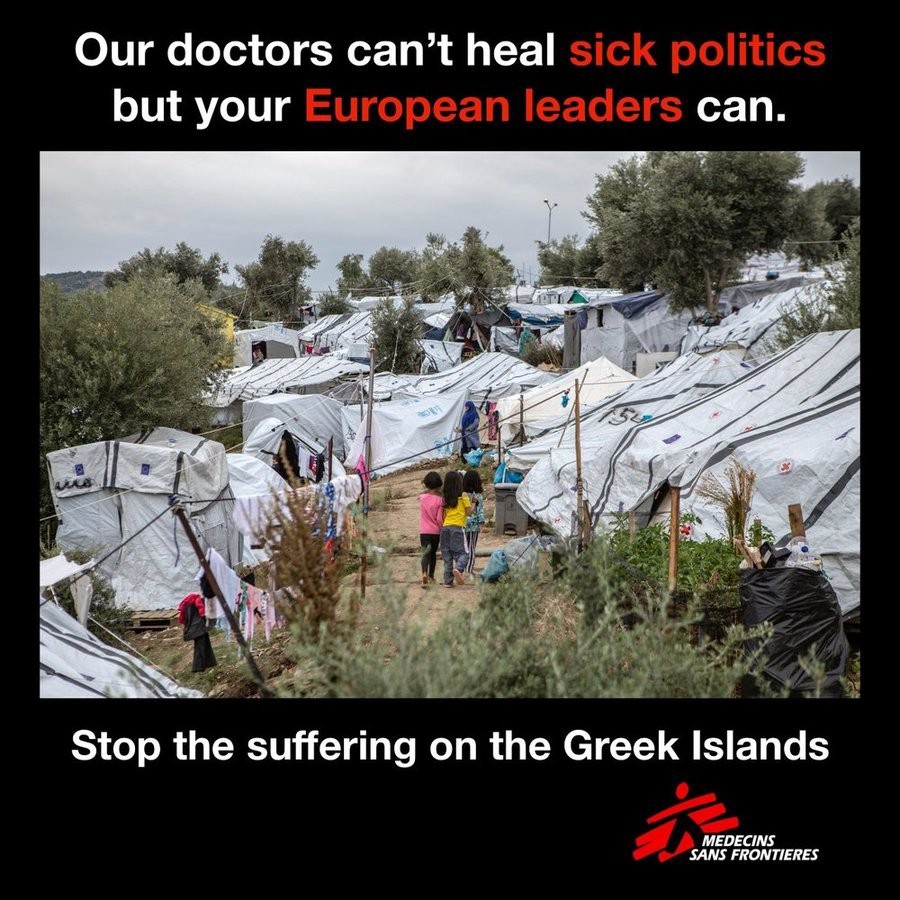
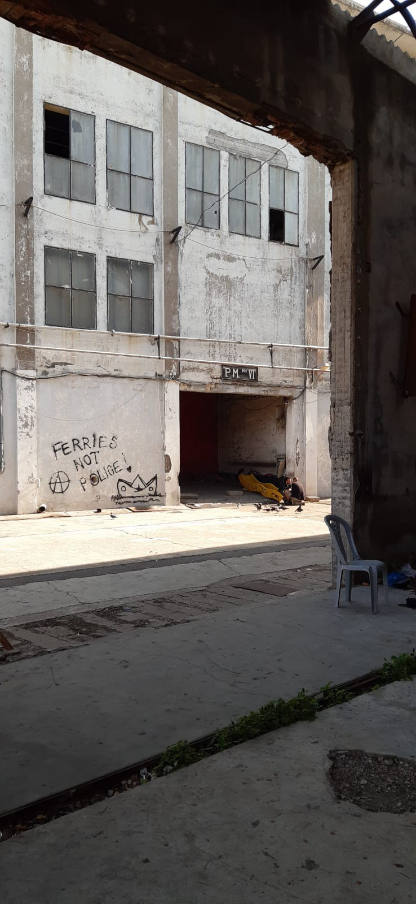
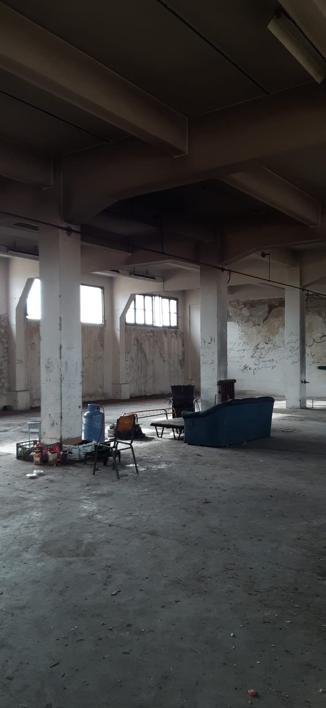
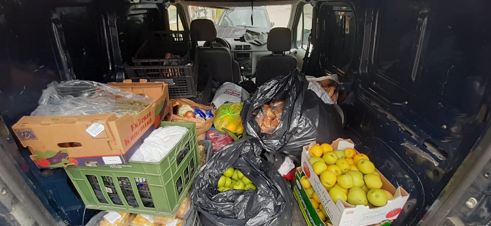

### AYS Daily Digest 27/11/19 Evros Pushbacks Report: Human Rights Abuses at Greece/Turkey Border

_Eight deaths, 16 missing and one boat lost in Mediterranean // Nearly 40,000 people trapped on Greek islands // MSF and UNHCR decry situation on Islands // Update from Patras // Only low skilled jobs for refugees in Germany // Deportations to Afghanistan_

 \)](assets/dec9c89045fe/1*aZ8whpFEHvfq2fRkpS-Utg.jpeg)

\(Moria, Lesvos\. Photo Credit: [Aris Messinis, Art Against](https://www.facebook.com/artagainstproject/) \)

**FEATURE**

> I could not see their faces, only the eyes\. They were covered with black masks\. They were talking with us in hand signs, pointing at us to scare us, and they forced us to look down and to not look up\. They checked each of us and took besides our phones also the bags, the clothes inside the bags, and even our shoes from us\. Eventually they would give us back our documents, the passports and money — but that’s all\. They dropped our other stuff, phones and bags, in the river\. My son was crying\. And they took my son from me\. I took my son back, and then they hit me\. Two of them; one caught me from behind and the other started to hit me\. They tried to make me silent\. I begged those militaries, to at least give us some clothes for my son, because the clothes from my son were completely wet\. Then they pushed us back over the river\. We went to the Turkish land without even our shoes\. — S\.S\. 

Mobile Info Team have published a [new report](https://static1.squarespace.com/static/597473fe9de4bb2cc35c376a/t/5dcd1da2fefabc596320f228/1573723568483/Illegal+Evros+pushbacks+Report_Mobile+Info+Team_final.pdf?fbclid=IwAR2824qpEiQfOlr5PgB7bu9HzwQqsv0fryn4lHB-qvqpe_UJ6tSgA8dzH3k) on pushbacks from Greece to Turkey in the Evros region\. They have been gathering data since August 2018 and have brought together 27 testimonies from people who have experienced this illegal practice\.

The procedure is similar in all cases\. Firstly, arrest and capture by Greek police inside Greek territory, then detention and confiscation of personal property, followed by coordinated handoffs/transfers to authorities and finally, collective expulsion across the Evros River in small boats\.

> The violent practices of Greek police are of critical concern\. Established legal procedures stipulate that Greek police would meet asylum seekers on Greek land, escort them to police stations, take their personal data and register their requests for asylum\. Their reported actions however ranged from complicit handovers to unidentified ‘commando’ groups, to perpetrating acts of violence and theft themselves\. 

Many of the testimonies are deeply disturbing, although all pushbacks are illegal regardless of whether an individual or group is subjected to violence\. Often people reported the deprivation of food and water, theft of property, detention in dirty and cramped spaces, unprovoked violent beatings and even electric shocks\.

To flee war, for this…

**SEA**

[Reports from the ground](https://www.facebook.com/permalink.php?story_fbid=161741051879569&id=116047946448880) state that four people died, four other serious cases are still in the hospital and 58 others were rescued from a boat in distress near Melilla\. A video of the emergency services as they try to save the lives of those brought to hospital can be seen in the original Spanish [HERE](https://www.facebook.com/jose.palazon.9/videos/vb.100000441082165/2835884033102938/?type=2&theater) \.

[Salvamento Marítimo](https://twitter.com/Cahora/status/1199809198772633601?fbclid=IwAR3GsqeYt7397eHuG85kx_QBnTKptuuTsuhAWUsGeJ2EXlb1K2ERHMhD7WY) have rescued 88 people in three boats in the waters near Gran Canaria\. Among the occupants there are four babies, another four minors and six pregnant women\. [Another source](https://www.facebook.com/NewsfromtheMed/posts/812696502517281?hc_location=ufi) puts the number of those rescued at 116\.

[From one of the boats](https://twitter.com/euronewses/status/1199775054277619717?fbclid=IwAR3dkTeBPWOILQH08HIBSwgzQCVenmDbIB0G4bmjdKxCrt1rAreMD9Ktm1c) four people are known to have died and 16 are missing\.

[Another boat](https://twitter.com/HelenaMaleno/status/1199770296947019777?fbclid=IwAR0cxvdKVqnKjf0cShtTrl8gqQulrT6_VWBcj8PLe1C_ri4Kiu0WfpgBg9M) carrying 73 people is still thought to be missing, lost at sea for two days\.

**SOS MEDITERRANEE are currently holding a fundraiser to continue SAR operations over Christmas\.**

> The Ocean Viking is currently the only civil rescue ship in the central Mediterranean that is large and stable enough for winter use in storm and storms\. 

**You can support them [HERE](https://www.facebook.com/donate/2390909231169360/) \.**

**GREECE**

**Arrivals**

At least eight boats have arrived carrying 306 people\. For a full break down visit [Aegean Boat Report](https://www.facebook.com/AegeanBoatReport/photos/a.285312485325196/706569323199508/?type=3&theater) \.

There are now nearly **40,000** people trapped on the Greek islands\!

**MSF decry situation on Greek Islands**

MSF have published an [open letter](https://www.msf.org/european-leaders-must-stop-punishing-asylum-seekers-greek-islands) to European leaders asking them to end containment in the Greek islands and held a [press conference](https://www.facebook.com/msf.english/videos/2528325414065146/?hc_location=ufi) to announce it’s publication\.

> The situation is comparable with what we see in war zones in other parts of the world\. It is outrageous to see these conditions in Europe and to know that they are the result of deliberate political choices\[…\] 

> Rather than acknowledging the human cost of your approach, you continue to call for a more forceful implementation of the EU Turkey deal\. You even consider more brutal measures, like the Greek government’s recently announced plans to convert the hotspots into mass detention centres, and to accelerate deportations\. 

> Stop this madness\. 

We couldn’t agree more\.

[UNHCR have also called](https://www.keeptalkinggreece.com/2019/11/27/unhcr-grandi-greece-refugees/) for increased support to be given to reception countries, especially Greece\.

**Update from Patras**

 \)](assets/dec9c89045fe/1*-uZkFeqIF_JvmLgoMhofBA.jpeg)

\(Photo Credit: [No Name Kitchen](https://www.facebook.com/NoNameKitchenBelgrade/posts/850519122013040?hc_location=ufi) \)

No Name Kitchen continue to cook for the young people living in Patras Port and are looking for Health Volunteers from 12 December\. Contact them if you can help\.

info@nonamekitchen\.org

\+34 664803202

**GERMANY**

**Low\-skilled jobs don’t mean low\-skilled workers**

Most refugees who have found employment in Germany work in very low\-paid jobs meaning that they will not be able to support themselves in old age, [info migrants report](https://www.infomigrants.net/en/post/21141/not-good-for-the-economy-german-official-warns-against-long-term-poverty-for-refugees-and-asylum-seekers?preview=1574864265005&fbclid=IwAR3dAasLBj-1_UoFuQVoRn_YvbXJkeJ-SGUQd_yPrPh_8n6_FmD9zU7ap1k) \. Even though the number of asylum seekers applying has dropped drastically and there is a relatively low acceptance rate \(35–38%\), the president of Germany’s Federal Office for Migration and Refugees, Hans\-Eckhard Sommer, would like to see numbers drop further\. It is a shame that he would not instead like to concentrate on supporting people out of poverty\. Many people arrive with professional qualifications which are not recognised in Europe and the US, surely pathways towards professional employment should be the first step, as recently suggested by [UNESCO](https://en.unesco.org/themes/higher-education/recognition-qualifications/global-convention) \.

**Deportations to Afghanistan**

The next deportation to Kabul, Afghanistan will take place on 3 December\. More information on the [website of the Bavarian Refugee Council](http://According to the information available, we expect that the next collection deportation to Kabul / Afghanistan will take place on December 3. th. More information on the website of the Bavarian Refugee Council)

**Find daily updates and special reports on our [Medium page](https://medium.com/are-you-syrious) \.**

**If you wish to contribute, either by writing a report or a story, or by joining the info gathering team, please let us know\.**

**We strive to echo correct news from the ground through collaboration and fairness\. Every effort has been made to credit organisations and individuals with regard to the supply of information, video, and photo material \(in cases where the source wanted to be accredited\) \. Please notify us regarding corrections\.**

**If there’s anything you want to share or comment, contact us through Facebook, Twitter or write to: areyousyrious@gmail\.com**

_Converted [Medium Post](https://medium.com/are-you-syrious/ays-daily-digest-27-11-19-evros-pushbacks-report-human-rights-abuses-at-greece-turkey-border-dec9c89045fe) by [ZMediumToMarkdown](https://github.com/ZhgChgLi/ZMediumToMarkdown)._
