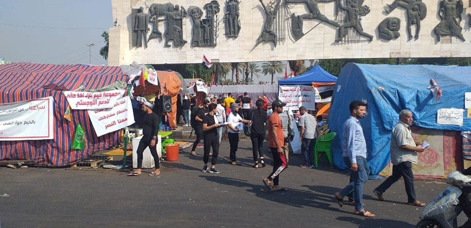
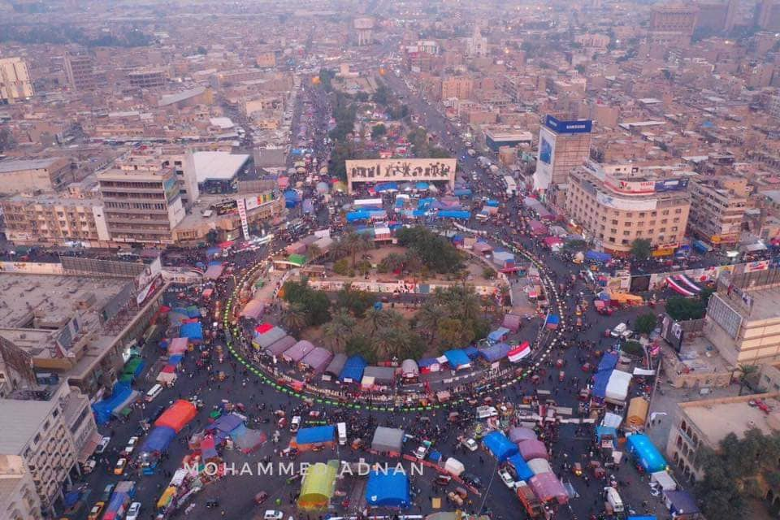
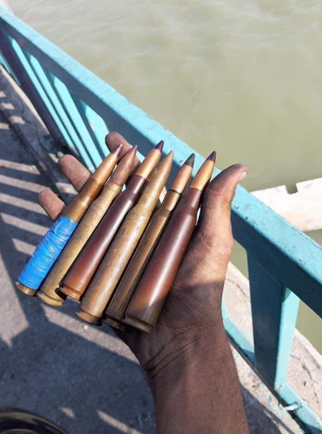
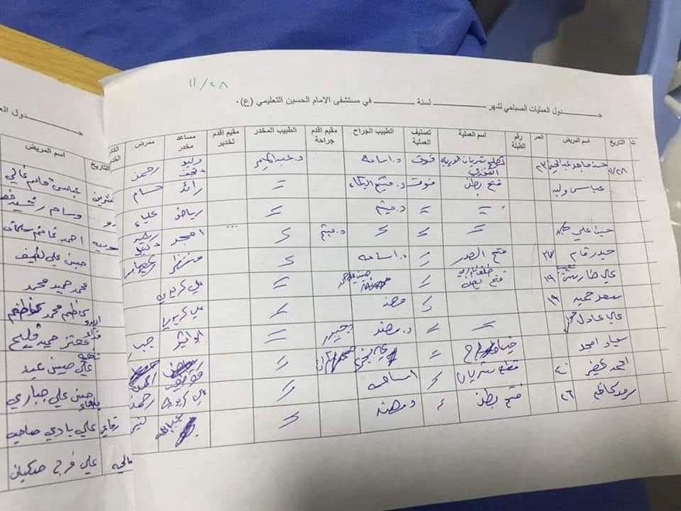
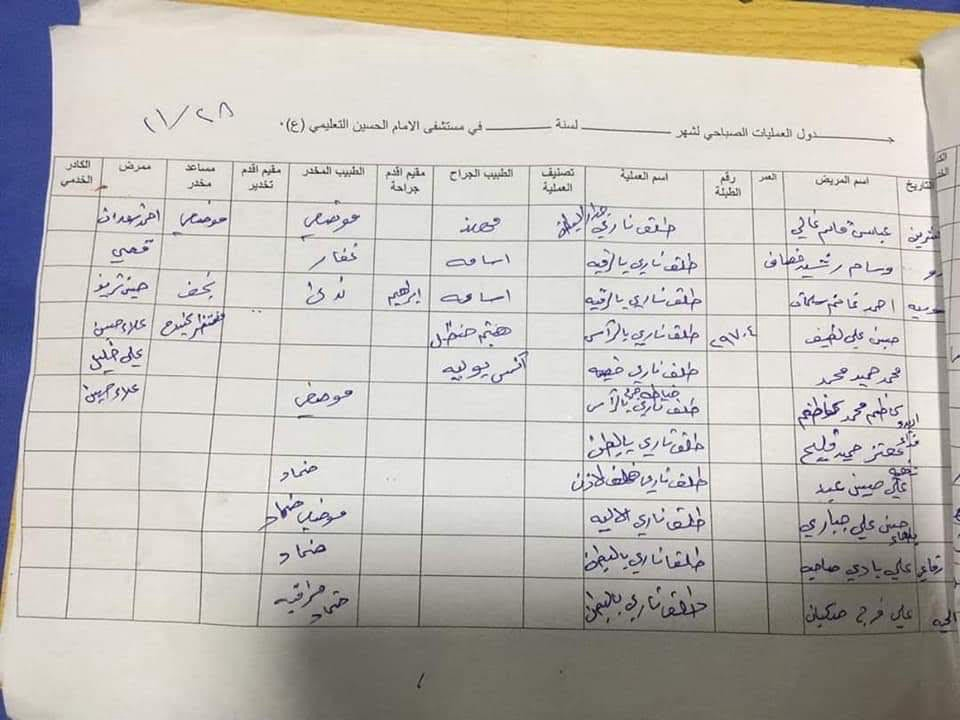
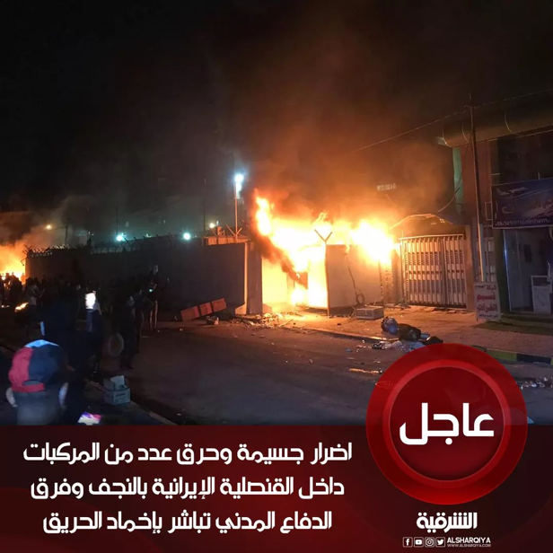
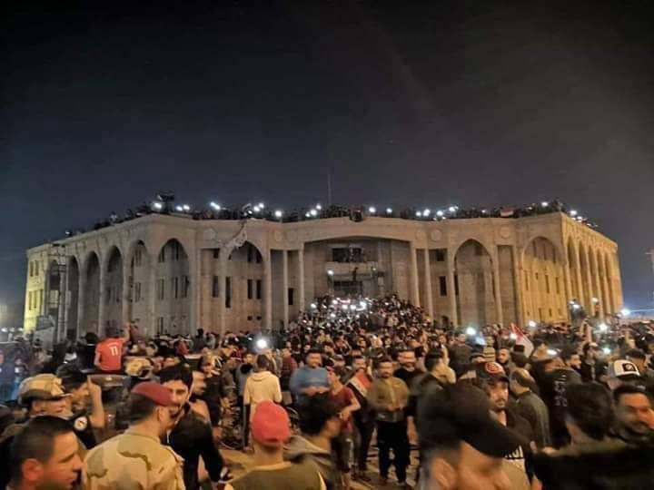

### AYS Special: Updates from local activists on the uprisings in Iraq
#### A summary of the events concerning the uprisings in October and November from the perspective of young activists in Baghdad\.

 \. November 2019\.](assets/9ac3116198ac/1*4TE9T0Tp10_o1h_3oJKvNw.png)

Credit: Re\-post from [عمال ضد الطائفية — workers against sectarianism](https://www.facebook.com/WOAGSE/) \. November 2019\.

**LATEST UPDATE: On Friday 29th November, Iraqi PM resigned from his position \(find statement in Arabic [here](https://m.facebook.com/story.php?story_fbid=2859442144120307&id=233558516708696) \) \. Following the resignation of the PM, the Secretary of PM’s Office resigned as well as the police chief of Nasiriyah\.**

Updates to follow\.

Since the 1st of October 2019, a series of protests and violent demonstrations have swept public spaces in Iraq, with demonstrators demanding access to employment, an end to corruption at governmental level and an improvement of public services\.

Women and men’s demands were met with violence and cruelty by armed forces and silence by the government\. Western media outlets have been turning a blind eye on the continuous brutality used by police and security forces against those occupying the streets to fight for the future of their country\.

AYS has reached out to local activists in Baghdad in order to spread their voice to the unresponsive Western countries\. As of now, we have managed to retrieve data and information, concerning the uprising, for the month of October, as well as brief updates for the month of November\.
#### 1st of October — Bab al\-Sharqi/al\-Tahrer square \(Baghdad\):
- Est\. 2000–2500 demonstrators were present in the square \(70–100 women; 150–200 minors\) \.
- Est\. 150–200 the number of armed forces present in the same area, equipped with automatic machine guns, CS gas grenade \(tear gas\) and sound bombs; 2 police vehicles with water cannons and some armoured vehicles\.
- Protestors were throwing small rocks\.
- 10–25 people were arrested\.
- Est\. 400 \+ protestors were injured \(mainly as they were hit by sound bomb fragments\) \.
- Est\. 5 people died during the protests in the same day \(3 from gunfire injuries and 2 as they were hit by sound bomb fragments\) \.

> Demonstrators gathered with more than 2,000 people in Tahrir Square, demanding real government reform after one year of the government, without any progress, and stopping the assault on the graduates and the poor who live in areas where there is a clear housing emergency\. They headed towards the Green Zone at 1 pm and across the bridge of the Republic and in the gates of the Green Zone were confronted violently by armed forces\. They used live ammunitions, tear gas grenades and sound bombs directly on the people\. Three protestors were killed and the others were followed for two kilometres while they were running away\. In the meantime, 400 people were injured, some of them would remain permanently disabled\. 

- The government did not admit to suppressing the protests and said the demonstrators were “Zaatout”, which means the little one who does not understand\.
- Some members of the police patrol in Tahrir were suffocated by tear gas and withdrew from their barracks; the demonstrators took them to the closest ambulance\.
- With 5 killed, 400 injured and young people arrested, this first day of the uprising resulted in public outrage in all of Iraq’s provinces and served as a call to come out against government repression and disenfranchisement\.

 \. November 2019\.](assets/9ac3116198ac/1*p1--fMqELFr2GArBPW15_A.png)

Credit: Re\-post from [عمال ضد الطائفية — workers against sectarianism](https://www.facebook.com/WOAGSE/) \. November 2019\.
#### 2nd of October — Bab al\-Sharqi/al\-Tairan square \(Baghdad\):
- Est\. 4000–5000 demonstrators were present in the square \(5–10 women; 250–400 minors\)
- Est\. 300–500 the number of armed forces present in the square, equipped with automatic machine\-guns, tear gas canisters and sound bombs; 2 police vehicles with water cannons and some armoured vehicles
- Protestors were throwing small rocks
- 10–25 people were arrested
- Est\. 300 \+ were injured \(mainly as they were hit by sound bomb fragments or suffered asphyxiation after inhaling tear gas\)
- Est\. 7 people died during the day \(due to gunfire injuries, sound bomb fragments, excessive inhalation of tear gas or [tear gas grenades shattering the human skull](https://www.amnesty.org/en/latest/news/2019/10/iraq-gruesome-string-of-fatalities-as-new-tear-gas-grenades-pierce-protesters-skulls/) \)

> Protestors gathered more than 4,000 people near the public square, trying to push the combined forces back and be able to demonstrate freely, but they were faced with excessive violence\. Authorities used live ammunitions, tear gas and sound bombs directly at the demonstrators\. Seven protesters were killed and some protesters arrested\. In the meantime, 300 people were injured, some of them with permanent physical damages\. After that, Internet was cut in all of Iraq for four days, except the Kurdistan region\. 

- The government commented: “The overthrow of the regime is not a legitimate requirement”\. This vision was supported by other political parties\.
- Citizens went out and sought revenge for the martyrs\. Others contributed by providing drinking water and Pepsi to mitigate the impact of the tear gas\.
- As the government continued to deal with the demonstrators violently, the Iraqi people declared that its status was illegitimate, and that they should be removed from power and put on trial for corruption and crimes\.

 \. November 2019\.](assets/9ac3116198ac/1*wwVEm0oKY0E-cwW8PRc5Lw.jpeg)

Credit: [الحزب الشيوعي العمالي العراقي](https://www.facebook.com/WCPIRAQ/) \. November 2019\.
#### 25th/27th October — Bab al\-Sharqi/al\-Tahrer square \(Baghdad\):
- Est\. 6000–8000 demonstrators were present in the square \(300–500 women; 500–600 minors\) \.
- Est\. 300–500 the number of armed forces present in the square, equipped with automatic machine\-guns, tear gas canisters and sound bombs; 2 police vehicles with water cannons and some armoured vehicles\.
- Protestors were throwing small rocks\.
- 10–25 people were arrested\.
- Est\. 1000 people were injured \(mainly as they were hit by sound bomb fragments or suffered asphyxiation after inhaling gas\) \.
- Est\. 100 people died during this timeframe \(due to fire\-gun injuries, sound bomb fragments, excessive inhalation of tear gas or tear gas grenades shattering the human skull\) \.

> A week before \(mid October\), a gathering of demonstrators was announced for the 25th day of the revolution, after Iraq had to mourn over the loss of the victims of the repression, which had reached by then a total of 140 dead and 2,000 wounded\. The people decided to hold a demonstration against the ruling parties that used the Iraqi security forces against the civilians\. The people decided that there would be no return, they had to fight for change and expel all parties from Iraq\. Protestors, though, were faced by the use of excessive violence, \[allegedly\] expanding bullets and other deadly equipment to cause them severe damages, if not causing their death\. Authorities aimed at the heads and bodies of the demonstrators directly\. On this day, the tuk\-tuks drivers took part in the liberation for the first time\. People flooded the streets with more and more motivation, tents were erected and the people of Baghdad began to supply the protesters with water and food\. Attacks toward demonstrators continued by the hand of the authorities, but with the presence of the media and the horrific death of a martyr, the attacks diminished day after day\. 

- The government commented: “We have formed law enforcement forces to protect demonstrators and public property and have not deployed machine guns\. We did not kill demonstrators and did not use violence against them\. \[…\] \. We will have reforms in three months\!”
- The UN [expressed concern](https://news.un.org/en/story/2019/10/1048582) over [the escalation](https://news.un.org/en/story/2019/10/1050221) of the situation; Iran, via Khamenei, asked the Iraqi government to crack down on protesters because they are against [the regime that Iran and its pro\-Iranian allies have created](https://www.aljazeera.com/news/2019/11/iraqi-protesters-leaks-confirm-iran-191119160040623.html) ; US State Department asks to settle the matter between the parties _\[source of this last comment could not be found, ndr\]_

> Despite the presence of women and minors in Tahrir Square, chanting slogans peacefully, police forces, about 700 meters away, targeted the demonstrators with live ammunition and tear gas, not caring if they hit people\. In these days, most of the deaths were caused by bullets hitting people’s head and gas grenades penetrating the skull\. There is even gunnery targeting communities 1\.5 kilometers away\. These gunnery destroyed buildings and burnt some of them\. The government did not accept the demonstrators’ demands to resign\. The parties are discussing ways to cooperate to resolve the situation and share power again\. 

As a consequence of these events, sit\-ins were organised in all central and southern provinces of the country, with unified demands of rejection of Iran’s intervention and control of the country\. Solidarity among people reached unprecedented peaks, showing a great strive for freedom and rejection of tyranny\.

The conflict between the government, which imposed a curfew that was rejected by the people, and the citizens remains high\. Children, women, men and the elderly continue to show a strong will to oppose the ruling class and fight for liberation, until their goals are achieved\.

 \. November 2019\.](assets/9ac3116198ac/1*0SHGgikrX_7cRYJqlnjFNQ.png)

Credit: Re\-post from [عمال ضد الطائفية — workers against sectarianism](https://www.facebook.com/WOAGSE/) \. November 2019\.
#### Military gas grenades are causing deaths among protestors in Iraq, denounces Amnesty International\.

The NGO also calls for an independent investigation on the use of these previously unused type of gas grenades \(fabricated in Iran, Bulgaria and Serbia mainly\), which are used to kill rather than disperse crowds, and to hold accountable police forces for the use of unlawful practices, including firing directly at protestors\.

> The organization’s Digital Verification Corps geolocated and analyzed video evidence from near Baghdad’s Tahrir Square documenting the fatalities and injuries — including charred flesh and “smoking” head wounds\. Its military expert identified the types of tear gas grenades being used as two variants from Iran and Serbia that are modelled on military grenades and are up to 10 times as heavy as standard tear gas canisters, resulting in horrific injuries and death when fired directly at protesters\. 

Find more on this inhumane weapons and practices [here](https://www.amnesty.org/en/latest/news/2019/10/iraq-gruesome-string-of-fatalities-as-new-tear-gas-grenades-pierce-protesters-skulls/) \.
#### UN Special Report on Iraq with more detailed updates on lethal weapons used, data on arrests, detentions and abductions can be found [here](http://www.uniraq.org/index.php?option=com_k2&view=item&id=11995:human-rights-violations-ongoing-un-second-special-report-on-protests-in-iraq&Itemid=605&lang=en) \.

Credit: Mohammed Adnan\.
#### 30th October — 25th November, major updates from the ground:

Sit\-ins and protests organised by students and other professionals have continued sweeping Iraq’s provinces from October 27th under the slogans “Mako Watan — Mako Dawa” \(no homeland \. \. no classes, no homeland \. \. no work\) \.

On October 30th, the number of demonstrators began to increase, occupying the public space in al\-Tairan square, al\-Tahrer and al\-Khellani square, with a large participation of Iraqi families, children and women, who engaged actively with cheers, activities and provision of supplies\. With this momentum and the spontaneous gathering between al\-Khellani and al\-Tahrer, young people tried to surprise the governmental forces and cross the Al\-Sinak bridge, with the intent to proceed to the gates of the Green Zone \(al\-Khadra\) \. Some protesters tore down the first concrete barriers that were blocking the bridge and crossed it, but as they did so they were directly targeted by tear gas and sound bombs\. Riot police surrounded more than 30 people and beat them severely, to the extent that some of the them had to throw themselves from the bridge in order to escape from the massive use of dispersion weapons and the beatings\. Paramedics reached some of the wounded ones, reporting broken bones as a result of severe beatings\.

Clashes lasted for a week between demonstrators and government forces, accompanied by burning tires to block major streets\. \[…\] On one occasion, gunnery that was shot to sedate a protest penetrated the third floor of a government building, burning it down\.

On November 21st, [clashes broke out again](https://www.reuters.com/article/us-iraq-protests/at-least-seven-killed-as-iraq-seeks-to-quell-uprising-idUSKBN1XV0UT) between protestors and security forces near the Liberation bridge, with seven more people killed during the day and 78 wounded\. **The total number of deaths reported between October 1st and up until 21st November was 325\.**

> Today, with the escalation of events, 55 days after the beginning of the demonstrations, people feel that the government does not care about the number of victims it will cause, as representatives stated that “as long as the protests will end, it does not matter if 1000 die and 50,000 are injured”\. 

So what is the possible future for those who fight for freedom in Iraq? Protestors are still coordinating demonstrations and creating joint public commissions to draft amendments to the election law and try to put an end to the corrupted government, oppressing human rights and people’s fundamental freedoms\.
#### Clashes in other areas of the country — Nasiriyah and Najaf

On the 26th of November, the cities of Nasiriyah, Wasit, Babylon, and Najaf witnessed strong demonstrations, general sit\-ins and strikes in the cities, with road blockades and burning of the headquarters of corrupted political parties, in response to violent repression operated by security forces\.

As a result, military chiefs were appointed to take administrative and military control of some of the provinces and crisis units\. This lead to unprecedented brutal repression\.

**On the 28th November, more than [30 people were shot dead](https://www.reuters.com/article/us-iraq-protests/iraqi-forces-kill-35-protesters-after-iranian-consulate-torched-idUSKBN1Y20WX) by Iraqi forces, after they stormed into the Iranian consulate in Baghdad overnight\.**

**In Nasiriyah, 29 people lost their lives \(although local activists claimed that casualties had reached 47\) as they were hit by bullets while trying to occupy a bridge before dawn\.** A total of 223 people were injured as a result of police repression\. Medium and heavy weapons and light armour bullets were fired against the protestors\.

Credit: Local activist\.

Video of security forces shooting at people can be found at [this link](https://m.facebook.com/story.php?story_fbid=429715284588873&id=100026512159373) \.

This brutality gave rise to a popular uprising among Iraqis\. People in Nasiriyah went out to support their brothers, pushed the forces out, and burnt the headquarters of the military forces in revenge for the lives lost\.

At the end of the day, the Commander\-in\-chief of the armed forces, Jamil al\-Shammari, was lifted from his duties in the city of Nasiriyah\.

List of names of those killed in Nasiriyah\. The cause of death is related to shots or abdominal and chest wounds caused by sound bombs hitting the protestors\. Credit: Local activist\.

**On 27th November, protestors in Najaf burned the Iranian consulate and two military vehicles in the proximity\.**

Crowds were dispersed with the use of bullets and live ammunition\. One demonstrator was killed and 16 were injured\.

Escalation of violence is, unfortunately, to be expected\.

**On Friday 29th November, the Sunni\-majority provinces that were under the control of ISIS in 2014 witnessed demonstrations against the government and solidarity with the martyrs of Nasiriyah\.**

Credit: Local activists\.
#### For consistent updates on the uprising in Iraq from local sources, follow [عمال ضد الطائفية — workers against sectarianism](https://www.facebook.com/WOAGSE/) and [الحزب الشيوعي العمالي العراقي](https://www.facebook.com/WCPIRAQ/) \.

**Find daily updates and special reports on our [Medium page](https://medium.com/are-you-syrious) \.**

**If you wish to contribute, either by writing a report or a story, or by joining the info gathering team, please let us know\.**

**We strive to echo correct news from the ground through collaboration and fairness\. Every effort has been made to credit organisations and individuals with regard to the supply of information, video, and photo material \(in cases where the source wanted to be accredited\) \. Please notify us regarding corrections\.**

**If there’s anything you want to share or comment, contact us through Facebook, Twitter or write to: areyousyrious@gmail\.com**

_Converted [Medium Post](https://medium.com/are-you-syrious/ays-special-updates-from-local-activists-on-the-uprisings-in-iraq-9ac3116198ac) by [ZMediumToMarkdown](https://github.com/ZhgChgLi/ZMediumToMarkdown)._
