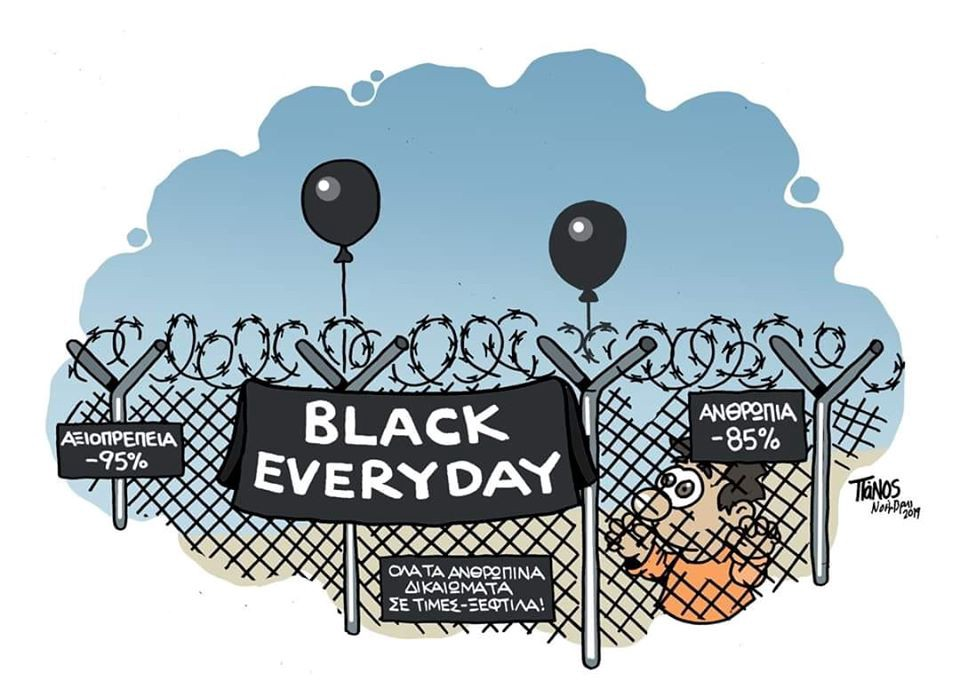

### AYS Daily Digest 29/11/19: What is happening in the UNHCR facility in Tripoli?

By Panos Zacharis
### Follow up on yesterday’s news about the situation in Tripoli Gathering and Departure Facility \(GDF\)

The Guardian journalist Sally Hayden, who is in continuous contact with people detained in Libyan detention centers and people in UNHCR facilities, published an article in The Guardian after having received internal documents from UNHCR whistle\-blowers\. The documents and the testimonials of people in the gathering and departure facility in Tripoli prove that the UNHCR has decided to deprive people of food in order to get them to leave the compound\.

On the evening of November 28th, the UNHCR released a statement on this subject\. It explains that the GDF in Tripoli was established about one year ago “as a transit facility for vulnerable refugees and asylum seekers, mostly women and unaccompanied children at heightened risk in detention and for whom solutions outside Libya had been identified\.”\.

Following the airstrikes on the Tajoura detention centre in July in which 53 people died, hundreds of former detainees went to the Tripoli GDF in search of help\. In October, another group of about 400 people arrived in the Tripoli GDF from Abu Salim detention center\. “They are part of a broader population of asylum seekers, refugees, and migrants who are vulnerable and exposed to risks in Libya — but have not been prioritised for evacuation or resettlement,” says the UNHCR statement\. The facility with a capacity of 600 people is therefore now hosting about double its capacity\.

UNHCR states that in order for it to be able to carry out resettlements for the original population of GDF, the new arrivals should leave the facility\. UNHCR wants to increase support for them by offering urban assistance, including emergency cash and relief items\. As of the beginning of January, food distribution will be phased out also for the survivors of the Tajoura airstrike, as it was about some weeks ago for the former detainees of Abu Salim detention centre\.

So far most people have refused to leave the relatively safe compound of the GDF Tripoli, as they are afraid of being subjected to torture, human trafficking and forced labour in the streets of Tripoli\. In view of the fact that many of them refuse to leave the compound although they have been without food for many weeks now, we can imagine how justified their concerns are\. Libya is not a safe country\.

For sources and further information see here:

The Guardian Article by Sally Hayden:

Twitter Thread by Sally Hayden:

Twitter Thread by UNHCR Spokeperson Charly Yaxley:

Official UNHCR press release:

Informative article on the current situation by InfoMigrant:

### GREECE
### Official visit to Greece by UN experts on arbitrary detention

Three members of the UN working group on Arbitrary Detention will carry out an official visit to Greece at the beginning of December\. As the UN Human Rights Office of the High Commissioner stated, the three representatives will meet Government officials, civil society groups and other relevant stakeholders\. “The experts will also visit a variety of places where people are held, including prisons, police stations and institutions for juveniles, migrants and people with psychosocial disabilities, to gather first\-hand information which will form part of their overall assessment” reads the UN announcement\. The group will share their observations at a press conference on December 13th at 12:00 local time, \(at the Electra Hotel Athens, 5 Ermou street, Athens\) \. A final report will be published in September 2020\.

The Working Group on Arbitrary Detention was first established in 1992\. Its mandate includes the investigation of instances of alleged arbitrary deprivation of liberty and the issue of administrative custody of asylum\-seekers and immigrants\.

For more information and media registration for the press conference:

### Alarm Phone Aegean Sea

The Alarm Phone for the Aegean Sea hast been alerted to 17 distress cases in the Aegean Sea in the past two weeks\. While some of the boats made it to Greece on their own or by being rescued by the Greek coast guards, other were interecepted or rescued by Turkish coast guards and taken back to Turkey\. Apparently violent attacks against the boats are on the rise\. Alarm Phone has been informed about three cases of violent attacks\. The team is investigating these cases\.

One of the cases is reported by Alarm Phone as follows:

> “On 11 November our shiftteam was alerted to two cases in the Aegean Sea:
 

>  At 9:30h CET we were informed about a boat with 30 travellers close to Chios\. They had just crossed the borderline to Greece when they called for help\. At 9:34h our shiftteam reached out to the Greek coastguard\. At 9:48h the people on the boat reported that they had just been attacked by a boat\. The attackers took their petrol canister and pushed them towards Turkey\. After that the contact to the travellers broke down and could not be re\-established so far\. We assume that the people ended up back in Turkey\. We are investigating the case\.“ 

find all the reports here:

### The father of a family from Vial Camp dies in hospital

A father in his fourties died on Thursday morning in a hospital on Chios Island\. He had been living in Vial Camp on Chios lately, together with his wife and six children\. Apparently he had severe health problems stemming from diabetes\. He had a leg amputated and was bound to a wheelchair\. According to a Greek newspaper, the man had not been feeling well the day before and asked police officers to call an ambulance\. As this did not happen, he later had to take a taxi to the hospital\. Another death that could easily have been avoided — another widow left behind and six half\-orphans\.

Find the full article in Greek here:

### ITALY
### Fourth Meeting of rescue NGO’s and civil society organisations held in Bologna

On November 28–29 the fourth meeting of the Palermo Charter Platform Process was held in Bologna\. The Palermo Charter Platform Process is a Platform of rescue NGO’s, civil society organisations, activists and solidarity cities\. The aim of the meeting was to strengthen the common work in the Mediterranean Sea and transnational collaboration between solidarity cities in Europe\. The participating organizations were, inter alia, Mediterranea, Alarm Phone, Welcome to Europe, Sea\-Watch, Open Arms, Iuventa10/Solidarity at Sea, Civilfleet, Seebrücke, borderline\-europe, Inura, and representatives of several European cities and municipalities
### SEA

Under harsh weather conditions, the crew of the **Ocean Viking** rescued 60 people from an unstable and overcrowded vessel on the night from Thursday to Friday\. Most of the people are from Bangladesh, Eritrea and Mali\. On the day before, the **Sea\-Eye \(Alan Kurdi\)** rescued, in two separate rescue campaigns, a total of 84 people \(see yesterday’s digest\) \. Seven of these people, among them two new\-borns and a toddler, have been allowed to disembark\.

**Alarm Phone** also received a call from a vessel in distress\. Italian and Maltese authorities were informed, but apparently did not undertake any efforts to save the people\. The Alan Kurdi, with 77 people already on board, went on its way to rescue\.

IOM also reported that over 200 people have been returned to the Libyan shore by the Libyan Coat Guards\.

■■■■■■■■■■■■■■ 
> **[IOM Libya](https://twitter.com/IOM_Libya) @ Twitter Says:** 

> > 🚨 Breaking: Over 200 migrants were just returned to Libyan shore by the coast guard. 
While our staff are at the disembarkation point to provide needed emergency assistance, we reiterate that #Libya is not a safe port. https://t.co/k9LM4raGa1 

> **Tweeted at [2019-11-29 22:30:45](https://twitter.com/iom_libya/status/1200542641307443200).** 

■■■■■■■■■■■■■■ 

A boat with 24 people on board reached the coast of Gran Canaria\.
### MOROCCO
### Follow up on violent arrests and detentions of sub\-Saharan refugees

As we reported in the Daily Digest of Novemebr 25th and following the reports of the Moroccan Association for Human Rights \(AMDH\), about 59 women and about 100 men have been violently arrested after raids in camps and houses in the region of Nador\. The women were, together with their children, transferred to the interior of the country\. Their husbands and other men, about 100 in total, were detained in the Arekmane detention centre\. Families have been torn apart\. Apparently the women and children were released close to Marrakesh without any help, after a bus trip of more than 800 kilometres on which they were provided with nothing but plain bread and water\. The men are currently being held illegally in the detention center\. According to AMDH, the men will be deported to their countries of origin, with the complicity of the representatives of their embassies in Morocco, who apparently visited the Arekmane centre\.

**Find daily updates and special reports on our [Medium page](https://medium.com/are-you-syrious) \.**

**If you wish to contribute, either by writing a report or a story, or by joining the info gathering team, please let us know\.**

**We strive to echo correct news from the ground through collaboration and fairness\. Every effort has been made to credit organizations and individuals with regard to the supply of information, video, and photo material \(in cases where the source wanted to be accredited\) \. Please notify us regarding corrections\.**

**If there’s anything you want to share or comment, contact us through Facebook, Twitter or write to: areyousyrious@gmail\.com\.**

_Converted [Medium Post](https://medium.com/are-you-syrious/ays-daily-digest-29-11-19-what-is-happening-in-unhcr-facility-in-tripoli-70ee767cd2e7) by [ZMediumToMarkdown](https://github.com/ZhgChgLi/ZMediumToMarkdown)._
