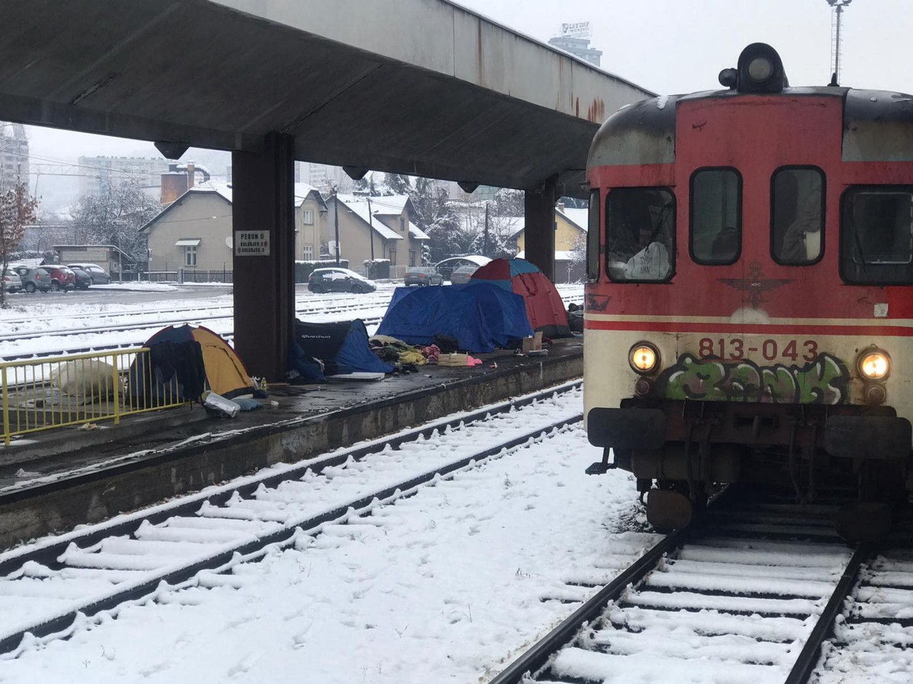
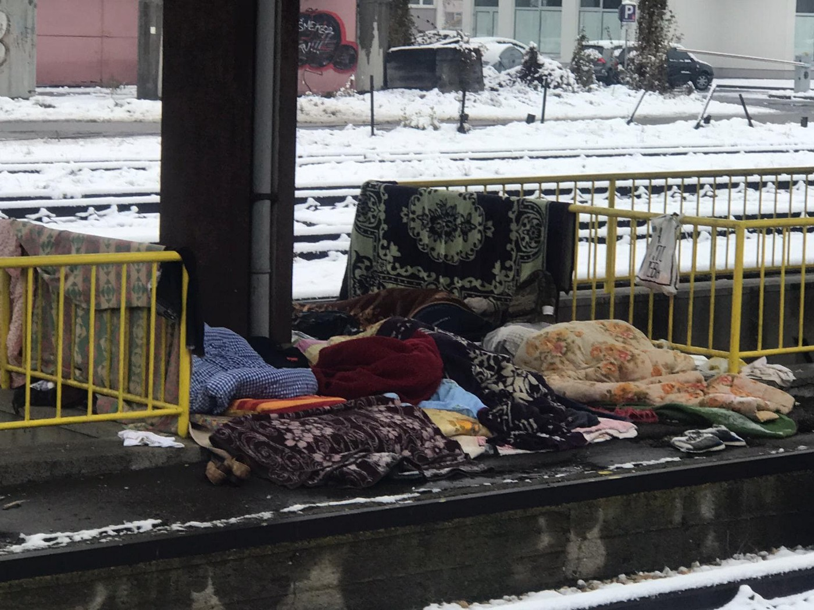
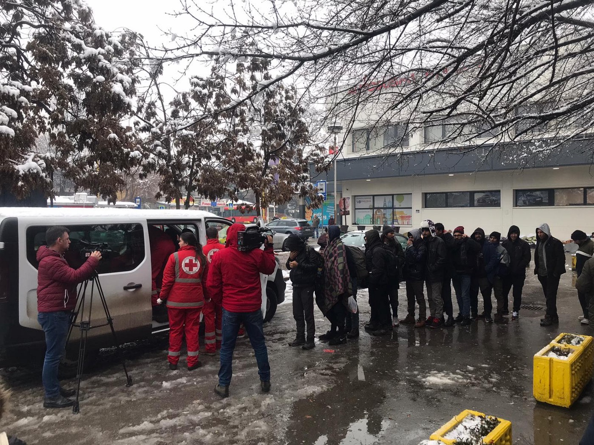
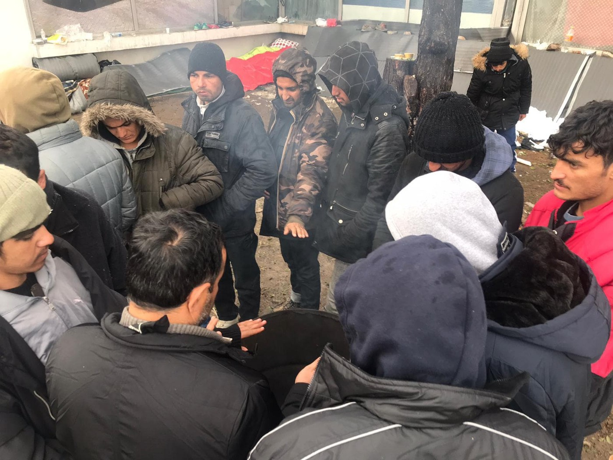
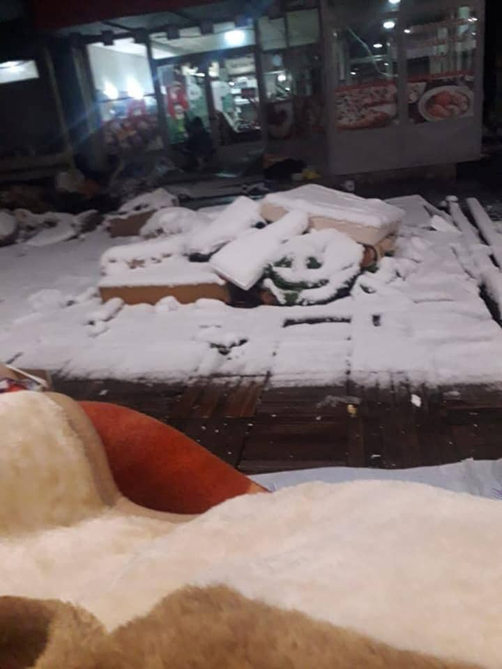
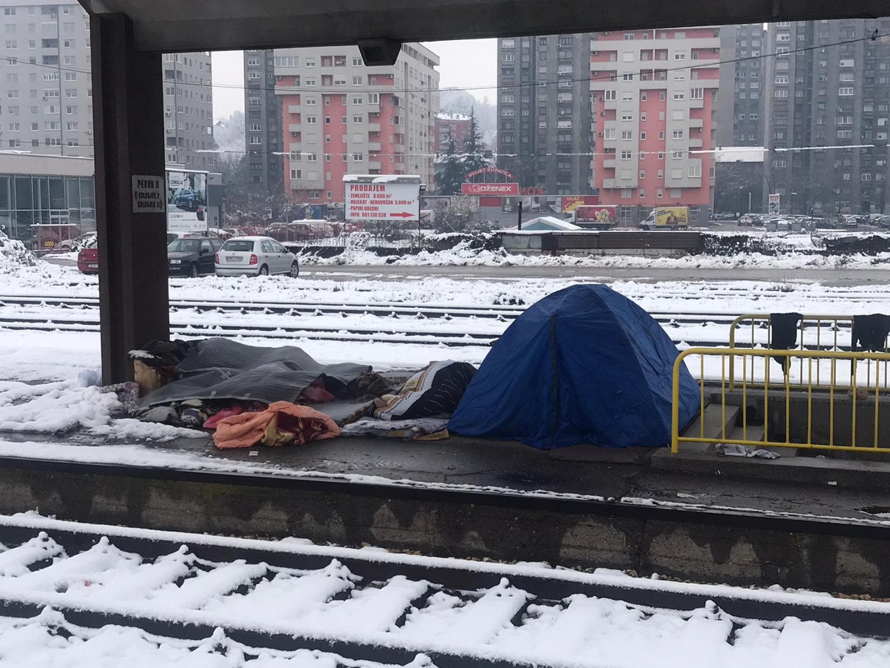

### AYS Daily Digest 2/12/19: Left\-to\-Die Trial: a reminder that many are left to die tonight, too
#### Despair at the borders of the European Union grows — thousands freezing across fields and streets / Commissioner for Human Rights visits Vučjak and IOM run camps in BiH / Beatings in Vial, electric fence to be placed along Evros / Documented brutality at the French\-Italian border / & more news

Tuzla, Bosnia and Herzegovina — December 2, 2019 \(Photo: Senad Pirić\)
#### FEATURED

Six years after one of the biggest sea disasters due to negligence of the Italian and Maltese officials, the case of a deliberately delayed rescue operation is being examined before a criminal court in Rome\.

> On the 11th of October 2013, over 250 died at sea\. Many women, men and children drowned, even though the Italian and Maltese coastguard had been alerted several times to the impending disaster\. From the boat in severe distress, a Syrian doctor pleaded desperately via satellite phone for rescue, but the authorities did not react adequately to his SOS calls\. Instead, and over hours, the Italian and Maltese authorities argued over whose responsibility it would be to rescue\. When rescue vessels arrived five hours later, the boat had already capsized and many people had already drowned, _AlarmPhone reports\._ 

According to their report, several officers of the Italian coastguard, the navy, and also politicians stand accused\. Besides the delay in coordinating rescue, an Italian navy vessel had been in the vicinity of the drama but failed to intervene\. Several of the survivors, who lost family members, have joined the legal action\. They hope that this injustice and deadly act of non\-assistance will not remain unpunished\.

> This trial of a past case of non\-assistance should be a signal to all those who fail to assist in cases of distress today, those who hold responsibility for the ongoing mass dying in the Mediterranean\. 

Today, the situation at sea is worse than in 2013\. Distress calls are often ignored, delays in rescue have become a usual and expected thing, while the pullbacks to Libya happen every day\.

> So far this year, one person has died on the central Mediterranean for every 15 that have reached Italian shores\. 

We join the Alarm Phone team in the hopes that this trial can shed light on the ongoing, daily, and criminal acts of non\-assistance in the Mediterranean, and the brutality of the EU border regime not only at sea, but also in the, nowadays formalized securitisation that goes beyond every aspect of the Charter of fundamental rights of the EU, any other law regarding human rights, and beyond common sense\.

■■■■■■■■■■■■■■ 
> **[sea-eye](https://twitter.com/seaeyeorg) @ Twitter Says:** 

> > The news from our vessel #ALANKURDI has just reached us that today alone two people on board have collapsed unconscious.

Still, no state coordination centre feels responsible for the 69 rescued persons.

We are running out of superlatives for this ignorance. https://t.co/g228o1eoSt 

> **Tweeted at [2019-12-02 13:25:19](https://twitter.com/seaeyeorg/status/1201492542199611395).** 

■■■■■■■■■■■■■■ 

■■■■■■■■■■■■■■ 
> **[Lorenzo D'Agostino](https://twitter.com/lorenzodago) @ Twitter Says:** 

> > @[MSF_Sea](https://twitter.com/MSF_Sea) The story of this latest Lampedusa shipwreck might be more complicated than the one we've been told 👇🏼

[twitter.com/lorenzodago/st…](https://twitter.com/lorenzodago/status/1201467477739397121?s=19) 

> **Tweeted at [2019-12-02 16:14:12](https://twitter.com/lorenzodago/status/1201535042230661120).** 

■■■■■■■■■■■■■■ 

You can now also join German activists in pushing the new president of the European Commission to do something regarding search and rescue operations at sea\. Find info [here\.](https://www.proasyl.de/material/wir-brauchen-eine-plan-das-sterben-im-mittelmeer-stoppen-sofort/?fbclid=IwAR0VCq00WnKxE-3j4IO0dltbERmQTeoSHQoXO19sYnRGUWFwmzLWfyEDmcI)
#### MOROCCO

[Association Marocaine des Droits Humains — Section Nador](https://web.facebook.com/AmdhNador/?__tn__=%2CdkCH-R-R&eid=ARAAacOaUiaGApTjN937Ayrk0E_Nxcprt7La5gck2bzY9oZUsYe2aQVEAdsKaxIzO48kArh7v24g3t0v&hc_ref=ARTRkCVfxzJ3mV5MXkXkg-u2F40dC1uQUkyUrwsKsM7RO5ETXhALiAOuzn093SZFtQE&fref=nf&hc_location=group) reports on the situation in Morocco and the state of the people who are in transit there, documenting unlawful practices by the authorities\. In their latest post they reported that without Judicial order, the armed forces entered and searched the cases and bags of migrants and confiscated personal belongings\. See more [here](https://web.facebook.com/AmdhNador/photos/a.1623335837878685/2481602365385357/?type=3&__xts__%5B0%5D=68.ARDuBszDSgrxEwizt1EEfxayD1NOg5BWzGLqcrLeu1s_fHmu7fDAZp9IJ2DF8tjDbneCceHN48Wo8ZI-yNfOBm40j-a8oAOaLRDLTujTPW9DfTq_Z8zn8ItfUYzbGpoUegMlzD-JukBkKhjjgb_dJR7oGWwZ4Yvg7o0FgavFp8GdCAdrBIsmQLwkc78ijVrhn13737jJ3lJjDNX5OzWXDvQyvJt6AOuoADInRSLQS0mBbRLYvzkHIrTsda-zfFj8Gty1HAc6cK9L1hVYQ7Cj6iykc7RE_EibheoCtykpcQoxAh3nzYxA28dG-NfLdHV8G7jKLYv7rvSQaCtfs_MV1sKkwPDa&__tn__=-R) \.
#### GREECE

Escalation of despair and dissatisfaction in ‘camp’ Vial on Chios is reaching new heights, demonstrated by the very big fights between the people stuck there, in the outside area of the camp\.

> Extensive [incidents began](https://astraparis.gr/ektetamena-epeisodia-metaxy-antimachomenon-omadon-stin-vial/?fbclid=IwAR0DCpJSLyj5fm7RKhVVbDajK-IKAc7CDbgRoxpOaKEJYsIcc203T7fWbkA) shortly after 8pm on Sunday, December 1, 2019, at Vial\. The fighters were throwing stones and other objects at each other, with episodes unfolding in various parts of Vial, and police intervened from the very beginning, leading to arrests\. 

Reportedly, people who are staying in tents did not dare to go to sleep\. They felt they had to stay awake to keep safe\.

The Greek Helsinki Monitor has filed two lawsuits against the former prime minister, Antonis Samaras, and cthe urrent shipping minister, Yannis Plakiotis, for “spreading false news on racist motives and public incitement to discrimination and hatred against refugees\.”

In the meantime, the so\-called ‘security meausres’ continue to take prefernce over human lives\. An electronic fence along the Evros \(Greek\-Turkish border\), with cameras, is [being prepared](https://web.facebook.com/refucomm/posts/993090411042761?hc_location=ufi) by the Department of Citizen Protection in a further effort to prevent people from border\.
State\-of\-the\-art cameras will be deployed at the border for better immigration and border security\.
### Athens

### Want to help?

**Lifting Hands International** is looking for volunteers to join their team in Serres, Northern Greece\. Their community center includes a women’s safe space, a child friendly space, arts & recreation space, an educational center and a warehouse\. They have an urgent need for volunteers to join the team from January and February onward\. They are looking for:

\-English Teachers

\-German Teachers

\-Piano Teachers

\-Guitar Teachers

\-Children Friendly Space Volunteers

\-Female Friendly Space Volunteers

They ask for a minimum time commitment of 30 days and can offer housing at their volunteer apartment in the centre of Serres for €5 per night\. The minimum age is 19\. For more information on the project please email their volunteer coordinator at : greecevolunteer@liftinghandsinternational\.org

**Mobile Info Team** is looking for a long\-term coordinator \(6\-months min\) to start in the end of January 2020 with experience in managing a team \(especially in the humanitarian field\) and fundraising, outreach, administration and accountancy\. You would work alongside the founder of MIT to coordinate all non legal related issues of running the team; legal experience is welcome, but not compulsory\.

Profile Requirements:

\-Prior experience running a volunteer team

\-Prior fundraising experience

\-Recruitment experience

\-Knowledge of how to develop the capacity of an NGO

\-Strong organisational and communication skills

\-Confidence with social media tools \(Facebook, Instagram and Google Adwords\)

\-Networking skills

\-Excellent English writing and IT skills

\-Ability to react quickly to the ever\-shifting needs of the refugee situation

\-Precision and reliability

If you are interested, please send a CV and short motivation letter to: contact@mobileinfoteam\.org

You can find more information about us on their website [www\.mobileinfoteam\.org](https://l.facebook.com/l.php?u=http%3A%2F%2Fwww.mobileinfoteam.org%2F%3Ffbclid%3DIwAR2pHPFnPypFeIQhoTPQCQyEvfSrZjajWH5eWg8-RFxgxpGIivUngOYDqhg&h=AT2W_6nHGgi3wP5UMG5rp66MCCjuaAsGV18tnjPESmGa-d32zhcqMgB_0sre-MkxbbKfYaMzEhiLCQRIQB3udJUhpHuAoNN9hcngB-kiTRdKfd39p2qxqXmphTCQNaL9DMyyIFezbmjuazof174) , or on this video which gives a quick insight into the work they do: [https://www\.youtube\.com/watch?v=907caDfm3Qs](https://www.youtube.com/watch?v=907caDfm3Qs&fbclid=IwAR1qeKCX59oQ8jRNSmnGXHVq31V-u4c_WqX75IaiTGqK6LC7xS7BbDHYQkk)
#### **BOSNIA AND HERZEGOVINA**
### Tuzla

An ongoing disaster of growing proportions is unraveling in Europe, at the doors of the European Union, as the first snow supported by strong winds arrives to the fields and streets of a country that is hesitant to open the existing facilities that could serve as a temporary shelter, for the people in transit throughout Bosnia and Herzegovina\. 
In Tuzla, with the arrival of snow, the local citizens volunteering since the first days when people on the move started passing through their town are now receiving people in their homes, bringing blankets, warm clothes and tents to those still outside in the cold during the entire night, only to find the people and everything they had provided completely wet in the morning\. There were more than 150 people outside around the bus and train stations spending the night sleeping rough in temperatures far below zero\. There is absolutely no adequate way of protecting the people from the wind, rain and snow\.

People are understandably very frustrated, disappointed and worried\. Many are also ill and all are very sleep deprived\. In these conditions, it is beyond unacceptable and impossible to expect anything from these people, as they are literally fighting to stay alive\. 
There is still no concrete answer or action of help from the authorities and the city officials\. Due to the lack of political will to overcome the general dispersion of responsibility, it is very likely more and more people will become ill, the emergency unit will be overwhelmed with work, as will the local hospital\.

On the morning of this publication, Tuesday 02\.11\.19, the Red cross distributed breakfast at 9:00 a\.m\., while at noon small organisations distribute lunch, and at 4:15 p\.m\. local volunteers and Merhamet kitchen prepare and distribute dinner\. None of this is right\. 
Furthermore, it evident that the lack of no strong international pressure on the Bosnia and Herzegonvina government, allows them to continue to stand idley by\.

In the meantime, people who are on the verge of exhaustion and freezing each night await for the authorities to act, or for a more serious episode to begin start unraveling… it’s only when lives are lost that any action is taken, only then the funds begin to find their way to helping the people\. Action is required right now\.

Photos: Tuzla volunteers

The Commissioner for Human Rights Dunja Mijatović visited Vučjak, and also to the IOM run camps Bira in Bihać and Sedra in Cazin, as well as Borići in Sarajevo\. She insisted Vučjak must be closed immediately\.

According to a number of sources active in Vučjak, the plan is for it to be closed and emptied and the people will be sent to Blažuj, Sarajevo, but that is yet to be confirmed and put into practice officially\. These announcements happen from time to time, but nothing so far has changed\.

Dear foreign journalists, we are not fixers\. However, to those of you with serious intentions but lacking information regarding whom to pressure for answers, how to reach those in power, or what they could possibly do to change the current situation, ourselves and other informed people in the area are more than willing to give you the tools and conacts to inform the world what is happening\. It is a crisis and it is in no mainstream publications\. The people need your help\.
#### ITALY
### Documented brutality at the French\-Italian border

In their recent weekly report, Kesha Niya team report that among a group of 24 unaccompanied minors they encountered a 17\-year\-old who suffers from diabetes but was not carrying the required medicine at the time\. He reached them with a very swollen foot, which is most likely due to his lack of medical care\. Another **17\-year\-old reported that he had been pepper sprayed during his detention in the containers** \.

631 people who had been arrested by the French police and deported to Italy\. This is by far the largest number since the data was collected, numbers are increasing very fast these last weeks, they say\. They were told about three cases in which the police kept people between 21 and 22 hours in the containers\. Many more between 10 and 16 hours\.

> We met a pregnant woman with a big bruise on her forehead\. She said she was beaten by a French policeman\. 

> Another person told us that a French policeman insulted him after he asked for water\. It was his second night in detention, the day before he got punched… 

The report documents worrying practices of the French officials, find the entire report [**here**](https://web.facebook.com/groups/1652972374920129/?ref=bookmarks) \.
#### FRANCE

[European Council on Refugees and Exiles \(ECRE\)](https://web.facebook.com/TheECRE/?__tn__=%2CdkCH-R-R&eid=ARDWalzP4aDxCma6mFyFmpN06evIc7Pf5CQxvuA0IOd1JWrsfrh2fssjqYGj0BsNBXXg5aMSDcm_f9sL&hc_ref=ARRl-5FCfXy5WXApPYfmJnvSKtaXxoVS0SWDWbA_KAJOfwzu86OAKT3Bt3Eu7qy7d74&fref=nf&hc_location=group) reports: France abandons plans to deliver 6 boats to so\-called Libyan coast guard in response to pressure and legal action from Amnesty International France, Asgi \(Associazione per gli Studi Giuridici sull’Immigrazione\), La Cimade, Gisti, Ligue des droits de l’Homme, Médecins Sans Frontières France, Migreurop and Civil Society — a victory for the people returned by them to Libya on a daily basis\. [Read more](http://bit.ly/35V0ygS)
#### GERMANY
### Bayerischer Flüchtlingsrat warns of a possible deportation tomorrow, Tuesday the 3rd:

> Several sources indicate that the next deportation to Kabul is expected to take place on Tuesday, 3\.12\.2019\. **We advise all Afghans who are obliged to leave to urgently consult a counseling center or a lawyer\.** We especially recommend that the immigration authorities are informed about upcoming apprenticeships as well as other integration services\. 

The months\-long threat of the intension to increase the number of deportations to Afghanistan, made by the Federal Government, were implemented after years of de facto deportation stop into action\. Deportations have occured rom Germany to Afghanistan almost every month since December 2016\. A large part of the deported Afghans come from Bavaria\. For many people, deportations could be suspended by administrative courts\. Many of the affected people had been living in Germany for a number of years and had had a permanent job\.
### Solidarity with Protesters Across the Middle East&North Africa

_In light of the protests occurring across the Middle East and North Africa and their spread beyond nation\-state borders, we, the international community in Berlin, stand in solidarity with all those who have taken to the streets to demand freedom, economic, political and social justice\. We stand in support of their calls to end corruption, sectarianism, authoritarian rule, occupation and refuse the imposed austerity measures which have come hand\-in\-hand with state violence\. We stand united in condemning the repression of political practice, the disrespect of human rights and the erosion of basic civil liberties\. We stand in sympathy, to express our condolences and commemorate those who have lost their lives demanding dignity and freedom\._

**Find daily updates and special reports on our [Medium page](https://medium.com/are-you-syrious) \.**

**If you wish to contribute, either by writing a report or a story, or by joining the info gathering team, please let us know\.**

**We strive to echo correct news from the ground through collaboration and fairness\. Every effort has been made to credit organizations and individuals with regard to the supply of information, video, and photo material \(in cases where the source wanted to be accredited\) \. Please notify us regarding corrections\.**

**If there’s anything you want to share or comment, contact us through Facebook, Twitter or write to: areyousyrious@gmail\.com\.**

_Converted [Medium Post](https://medium.com/are-you-syrious/ays-daily-digest-2-12-19-left-to-die-trial-a-reminder-that-many-are-left-to-die-tonight-too-1ac48e89cce2) by [ZMediumToMarkdown](https://github.com/ZhgChgLi/ZMediumToMarkdown)._
