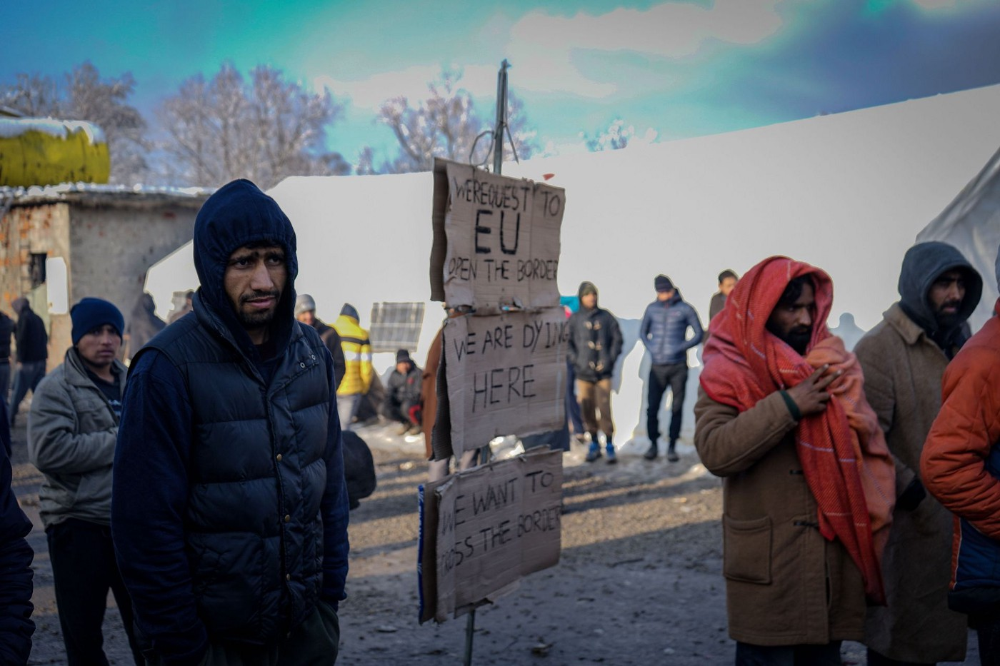
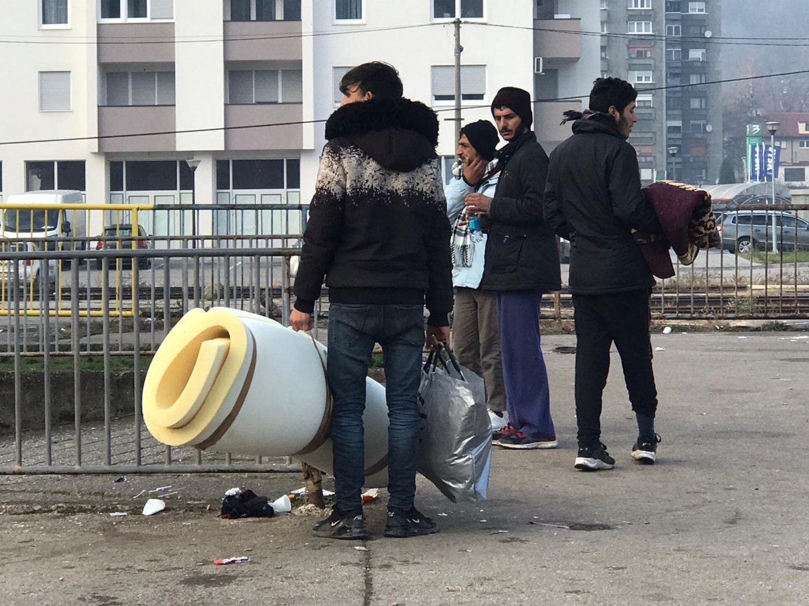
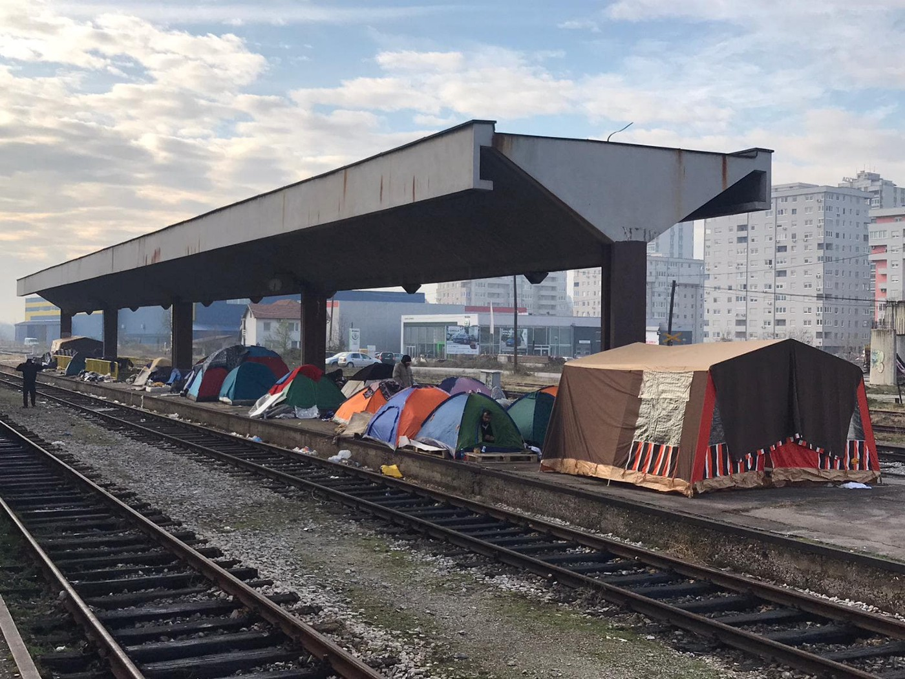

### AYS Daily Digest 6/12/19: Swedish municipalities warn about the potential housing crisis
#### As a result of the so\-called School Act, many young Afghans face possible evictions / Lack of will to solve basic issues of people stuck outside any reception facilities across Bosnia and Herzegovina / hotspot in Lampedusa in worse condition than before / Hundreds of vulnerable refugees were taken and are now making their way back to Calais through the rain, wind, and freezing cold, medical workers warn

](assets/6d634e19d74b/1*pTnGAapVwuk0PBtUZSv3Lw.jpeg)

Vučjak, photo source: [Dirk Planert](https://www.facebook.com/dirk.planert?__tn__=%2Cd%2AF%2AF-R&eid=ARCvGkTXjVsAHoWIricYmN9zlfQjRGKJIQ7ld9mEwPv5TnxaWf0EttY72xHz5fSR4vrTqVM_cutLdTwP&tn-str=%2AF&hc_location=group_dialog)
#### FEATURED

Sweden — An estimated 750 people will have to leave their accommodations in less than two months, most of them young Afghans who have been granted temporary protection according to the high\-school act\. It is a law that gives asylum seekers who arrived before 24th November 2015 the right to remain in Sweden because of high school studies —however, it has been severely criticized from many sides\.

The reason behind this is a new interpretation of the Migration Agency’s responsibility to offer this group accommodation following a court ruling\. The people of concern have been rejected by the Migration Agency but because of the high school act, they got a new chance to stay in Sweden\. The Migration Agency no longer recognizes that they are responsible for accommodating this group, and the municipalities are worried that their costs will increase when the responsible authorities kick people out\. This information first came a few weeks ago, and now some municipalities have sent out a warning about a potential crisis\.

In the municipality of Vänersborg, where approximately 125–150 of the affected people live, this will cause an emergency\. It is an impossible task, according to Vänersborgs municipality\. They will not manage to find new housing alternatives for the people who are forced to leave the Migration Agency’s accommodation in the municipality\. The people will need to find new homes close enough to their schools, since their temporary protection status depends on their studies\. If they fail to do so on their own — which is very likely — the municipalities will have to help them\.

The municipalities of Vänersborg and Halmstad have contacted Morgan Johansson, the Minister of Migration, asking for help\. When this article was published they had not received any answer\. If no help is provided by the state, the municipalities say there will be a crisis\. Not only for them — the main concern is the wellbeing of the people forced to leave the state accommodation\.

BiH — The power games across Bosnia and Herzegovina are continuing, both between the different levels of political power, but also between the well\-funded international organizations, which have not been very agile in proposing and advocating for an optimal solution for those in dire conditions\.

The public was led to believe the Vučjak camps would close and people would be transferred to different locations in Sarajevo until the Blažuj army barracks in Sarajevo were prepared\. However, in the meantime, another solution was proposed, that extra containers and beds would be prepared and added inside the Bira camp in Bihać, which, according to our sources, is not completely full in spite of IOM’s statements\. But, in these games of stubbornness and power, the local authorities and police did not allow the technical equipment to be installed in the camp, so now another operational plan is in place for the early morning on Monday\. All of these solutions are harming those most vulnerable, who are in no position to exercise their rights, make decisions about their lives or move freely\.

#### GREECE

■■■■■■■■■■■■■■ 
> **[NoBorders](https://twitter.com/Refugees_Gr) @ Twitter Says:** 

> > ¡No pasarán! Lesvos island, anti authoritarian demo 5/12 against state oppression and in solidarity with squats and #refugeesgr #antireport 

> **Tweeted at [2019-12-06 10:44:47](https://twitter.com/refugees_gr/status/1202901693333147654).** 

■■■■■■■■■■■■■■ 

> “We will continue to do what our conscience and medical ethics dictate\. We will continue to treat patients regardless of color, race, religion\. “ 

OENGE [took a stand against a government decision](https://www.oengegr.com/post/%CE%B8%CE%B1-%CF%80%CF%81%CE%BF%CF%83%CF%86%CE%AD%CF%81%CE%BF%CF%85%CE%BC%CE%B5-%CF%80%CE%B5%CF%81%CE%AF%CE%B8%CE%B1%CE%BB%CF%88%CE%B7-%CF%83%CE%B5-%CF%80%CF%81%CF%8C%CF%83%CF%86%CF%85%CE%B3%CE%B5%CF%82-%CE%BA%CE%B1%CE%B9-%CE%BC%CE%B5%CF%84%CE%B1%CE%BD%CE%AC%CF%83%CF%84%CE%B5%CF%82-%CE%B1%CE%BA%CF%8C%CE%BC%CE%B1-%CE%BA%CE%B9-%CE%B1%CE%BD-%CE%B4%CE%B5%CE%BD-%CE%AD%CF%87%CE%BF%CF%85%CE%BD-%CE%B1%CE%BC%CE%BA%CE%B1) that requires refugees and immigrants to have a mandatory AMKA or Aliens Health Care Card \(CPC\) in order to be examined without paying in public hospitals\.

Doctors have come out against the new law and said they will continue to treat non\-documented migrants and refugees regardless of whether they have health coverage or not because their conscience would not let them do otherwise\.
#### BOSNIA AND HERZEGOVINA
### Tuzla

Though the media are reporting there will be no camp in Tuzla, the camp is already here\. A ‘silent deal’ between the state, canton and the city has resulted in a place for the camp, to be opened in the shortest possible time\. The citizens have once again shown great solidarity, having brought pallets, insulation material, tents, blankets, and three meals a day, which are secured for all the people in need\.

Photos: Senad Pirić
#### ITALY

Volunteers around Trieste in Italy report meeting people they had previously encountered while volunteering in Tuzla and in Velika Kladuša, Bosnia and Herzegovina\. The wounds on their bodies depict the realities they face along the route leading them through difficult terrain and many violent rejections by the ‘EU’s guards’, the Croatian police\.

](assets/6d634e19d74b/1*BmZHtJeTJcjuX2fwJIdKLQ.jpeg)

Photo: [Lorena Fornasir](https://www.facebook.com/lorena.fornasir?__tn__=%2Cd%2AF%2AF-R&eid=ARBaYNV4i0kyByNrYGqjC8DEYclaiI4QZYhsdYgAJteY7PKv5Sv6fJQlWPeAWVubpClIZugp_vTlOWhL&tn-str=%2AF)

In the Italian hotspot in Lampedusa, the conditions have not improved and the latest footage from the facility shows the current situation:

The media have reported that three of the people on board the Alan Kurdi were suspected smugglers who were apprehended by the Italian police, pending further investigation\.
#### FRANCE
### Calais

Last week, several camps were cleared by police\. The police forces intervened in the provisional camps in the industrial zone of Dunes, where several hundred people were staying\. The operation mobilized many CRS forces who entered the area very near the old ‘jungle’ of Calais\. No journalists were allowed to enter the parameter of about a kilometre from the evacuation area\.

Hundreds of vulnerable refugees were taken and are now making their way back to Calais through the rain, wind, and freezing cold, [First Aid Support Team — FAST](https://www.facebook.com/FASTFirstAidSupportTeam/?ref=gs&__tn__=%2CdkCH-R-R&eid=ARDDkyW2pRgXzjiSDnHv7wFNteDGm_UpEpMAvQWw96psB8uR_Zp0fy2Pb-mjp7ftCdcBafENKFVDPPVX&hc_ref=ARRkwGhfcgdkWtxZzmu-oYCBNkRWXdVmDzhxspANZjz21aotBCnLY14OWKOv7X2DQW4&fref=gs&dti=1628341497445694&hc_location=group) reports\.

Seven people were discovered in a refrigerated truck, two in a state of hypothermia, many of them suffering from lack of oxygen, northern French media reported\. Medical relief was sent to the site and some people had to be transported to hospital\.
The truck driver was reportedly taken into custody but released again after it was established that he did not know that people had entered his truck\.

**Find daily updates and special reports on our [Medium page](https://medium.com/are-you-syrious) \.**

**If you wish to contribute, either by writing a report or a story, or by joining the info gathering team, please let us know\.**

**We strive to echo correct news from the ground through collaboration and fairness\. Every effort has been made to credit organizations and individuals with regard to the supply of information, video, and photo material \(in cases where the source wanted to be accredited\) \. Please notify us regarding corrections\.**

**If there’s anything you want to share or comment, contact us through Facebook, Twitter or write to: areyousyrious@gmail\.com\.**

_Converted [Medium Post](https://medium.com/are-you-syrious/ays-daily-digest-6-12-19-swedish-municipalities-warn-about-the-potential-housing-crisis-6d634e19d74b) by [ZMediumToMarkdown](https://github.com/ZhgChgLi/ZMediumToMarkdown)._
