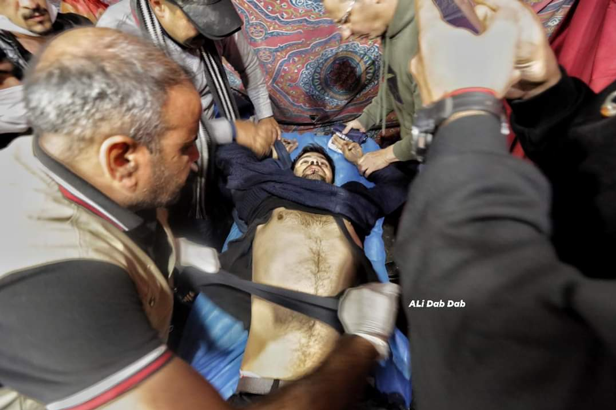
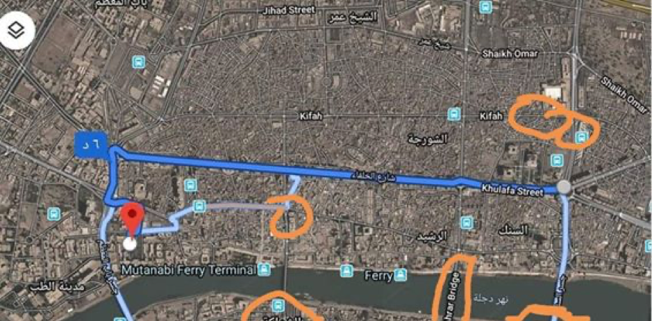
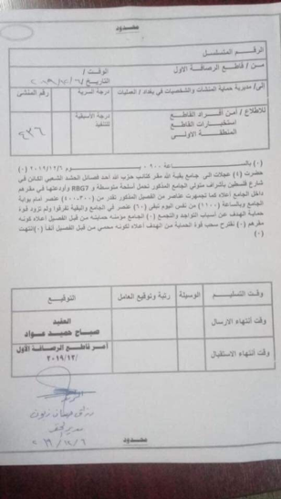

### AYS Special: Updates from Baghdad \(1\)

Main highlights concerning the first week of December\.

Ahmed Al\-Muhanna is a photographer who participated as a war journalist in the operations to liberate Iraq against ISIS from 2014 until 2016, but ISIS’ terrorist bullets could not kill him\. He was killed by militias of Islamist parties holding power in Iraq in the attack of al\-Khalani square\. Credit: Ali Dab Dab\.

December 5th\. **Knife attack on demonstrators\.** Early on Thursday in Tahrir Square, protesters were suddenly attacked by 70 people carrying knives, who had not identified themselves\. They stabbed and terrorized people\. The demonstrators believe that they are Iranian militias, trying to break up the demonstrations by force and dragging people into a civil war that will put old parties in power again\. Activists in the demonstrations believe that the attackers are members of the Asa’ib Ahl al\-Haq militia led by Hadi al\-Amiri and Qais Khazali\. The attack ended with 3 women and 20 men injured, some of them fatal injuries \(please refer to our comment for the first hand update\) \.

The same day, a group of 400 people gathered near Al\-Nakhil Mall, where Asa’ib Ahl al\-Haq \(Shi’a paramilitary group\) and the factions affiliated with Al\-Amri \(former Minister of Transportation and head of the military wing of the Supreme Islamic Iraqi Council\) have most of their supporters gathered\. Then they moved to Tahrir Square where protests were ongoing, after the stabbing attack occured\. These people affiliated with paramilitary and military groups took part to the protests only for 2 hours, but they made a major impact as they were carrying banners in support of al\-Sistani \(religiuos leader of Shia Muslims\) and chanted slogans like “death to America, Israel, and Saudi Arabia”, very different from the core values and motifs of the demonstrations that have been ongoing for two months and that call instead for the end of Iran’s influences in Iraq, the end of corruptionand the fall of the criminal repression by the government\.

But public opinion interpreted their presence as an attempt to ride the wave of change and impose themselves on the people as a party willing to take over in the next government\. The next day, Al\-Sistani stated that he did not accept the raising of banners for him or the use of his name from any party\.

December 6th\. New list by the US representatives was announced, including sanctions for four actors: Qais Al\-Khazali, Laith Al\-Khazali, Hussein al\-Lami, \(accused of giving direct orders to shoot protetors with the intervention of snipers, from October 3 to 15\), and Khamis al\-Khanjar\. That evening, in al\-Khulani square, **armed men in civilian clothes, carrying automatic weapons and RBG7 weapons, created panic as they drove cars towards the crowd on the streets, attacking the protesters in one of the public garages on the square and burning the upper floor of the garage\.**

They killed 10 people and wounded dozens\.

Credit: Ali Dab Dab\.

The gunmen continued firing until 3 am of the following day, then the militants withdrew completely from al\-Khulani at 5 am\. All the time, the security forces did not move to stop them, even though the Ministry of Defense was a 6\-minute drive from the site of the attack\. Even a group called the “Blue Hats” decided two hours after the attack to go to the square and make a human line, and they were also attacked and some people were wounded\.

In orange, the locations of the Federal Police and the army, who never acted against the attackers\. Credit: local activists\.

A document leaked from Facilities Protection signed by an officer with the rank of major, stating that security was informed earlier of this militants’ gathering\. In it, the request to withdraw the members of the group from area surrounding the mosque\.

Credit: local activists\.

France, Germany and the UK [condemned the attack](https://www.facebook.com/WOAGSE/photos/pcb.748219762343522/748219672343531/?type=3&theater) and said that what had happened was a deliberate murder\. As for the Canadian embassy in Iraq, it commented saying that “It is not permissible in a sovereign country to allow the militants to go around freely”\.

The Iraqi security forces stated that they were unable to identify the attackers\.

**Author: Local activists based in Baghdad\.**

**Find daily updates and special reports on our [Medium page](https://medium.com/are-you-syrious) \.**

**If you wish to contribute, either by writing a report or a story, or by joining the info gathering team, please let us know\.**

**We strive to echo correct news from the ground through collaboration and fairness\. Every effort has been made to credit organizations and individuals with regard to the supply of information, video, and photo material \(in cases where the source wanted to be accredited\) \. Please notify us regarding corrections\.**

**If there’s anything you want to share or comment, contact us through Facebook, Twitter or write to: areyousyrious@gmail\.com\.**

_Converted [Medium Post](https://medium.com/are-you-syrious/ays-special-updates-from-baghdad-1-caf4159ce913) by [ZMediumToMarkdown](https://github.com/ZhgChgLi/ZMediumToMarkdown)._
