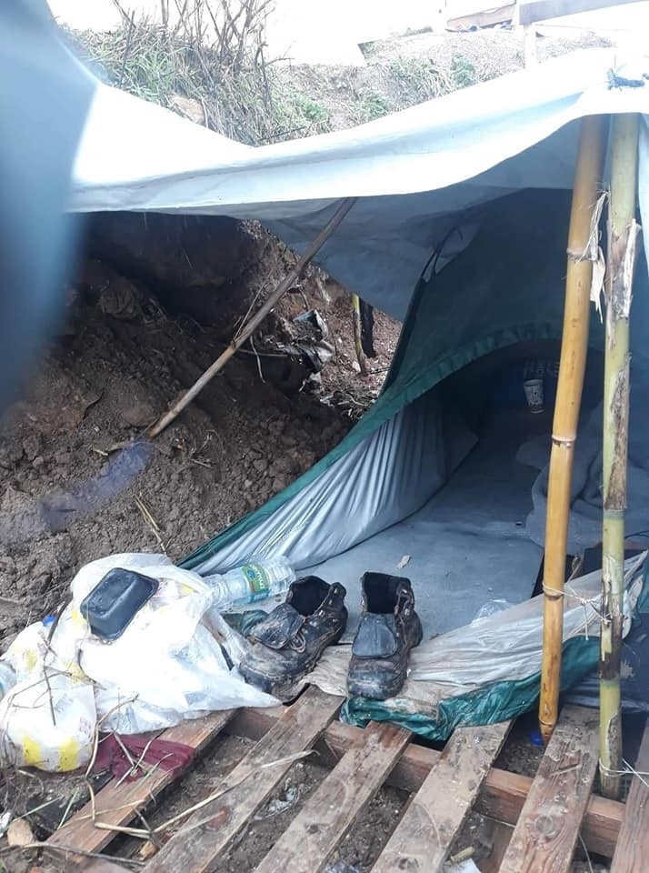
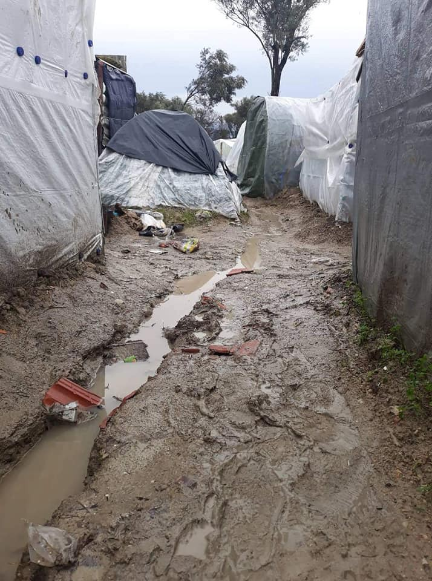
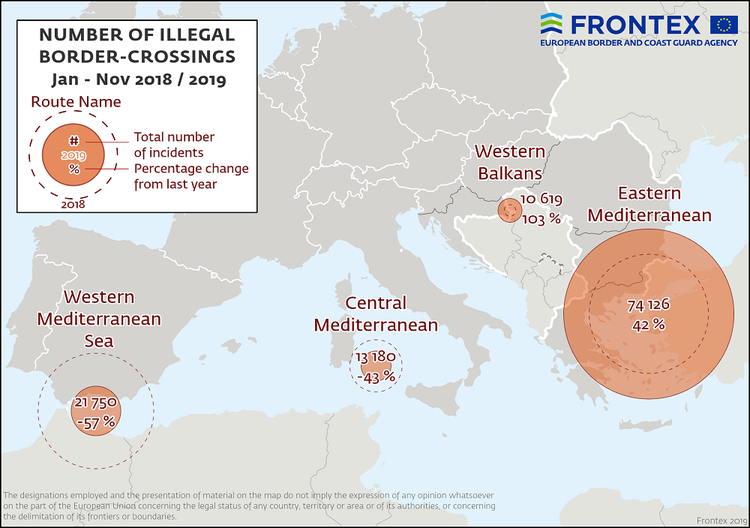

### AYS Daily Digest 12/12/19 First video footage released by Der Spiegel showing Greek police pushbacks to Turkey on Evros

_Re\-locations in Denmark // new EU funding for Morrocco and MENA // update on the Alldeen case // what’s next for people in Vujak // and more…_

](assets/294bcb961e8/1*EudHgqLKdDb1hB0t-xTbHw.jpeg)

People trying to cross the Evros River to Greece from Turkey\. Photo provided by the [Greek Reporter](https://greece.greekreporter.com/2018/08/02/ten-thousand-migrants-crossed-greeces-evros-border-in-2018/)
#### FEATURED

[Videos](https://www.youtube.com/watch?v=AtHiOYjuN7s) released on Thursday by German weekly Der Spiegel, shows Greek law enforcement wearing masks pushing back over a dozen people to inside the Turkish border\. Der Spiegal interviewed retired and serving law enforcement officers that this practice has been going on [for years](https://www.aa.com.tr/en/europe/greece-s-illegal-pushback-of-refugees-caught-on-video/1672144?fbclid=IwAR0CZXt-ZODSNJleoeIGzgXzOu7ikRKcpCJXUb3KYNPl2MR_TgsD4bjOoGI) \. For long whilethis practice has been speculated, but this is the first time it’s been caught on camera:

[Der Spiegal](https://www.spiegel.de/politik/ausland/griechenland-videos-zeigen-mutmasslich-illegale-abschiebung-von-migranten-a-1300891.html) says:

> “Now, videos leaked to SPIEGEL and evaluated by the research collective Forensic Architecture show for the first time such a presumed pushback on the Evros\. Six active and former police officers and soldiers also told the SPIEGEL that Pushbacks on the Evros would be carried out systematically\. 

> The material consists of a total of eleven videos\. In pictures of a surveillance camera, which is mounted on the Turkish side of the Evros, masked men are seen in some military\-looking clothes without insignia\. They transport groups of people from the Greek side of the border river to the Turkish side\.” 

#### GREECE
### Lesvos

Recent reports from Moria state that currently there are 17,800 people in [M](https://web.facebook.com/hashtag/moria?source=feed_text&epa=HASHTAG) oria\. “Unprecedented number of people trapped in \( \+ around\) the old military base with capacity for 3,000 people\. Dire need of blankets, medicine, legal help, diapers, wheelchairs — basics that are NOT given\.”

> People are in severe danger in and outside Moria\. Fights reported at night over wooden panels and blankets\. Not enough resources, not enough tents\. Afghan family of 4 who arrived yesterday doesn’t have anything to fix tent, no shovel, no toilet, no safety\. No electricity, no light\. Family had to stay outside, it was raining\. 

> Fire is the only source of light at night\. And the night starts at 4:30pm now\. 

](assets/294bcb961e8/1*lH-IdV0rWmUkcxCLv3m13A.jpeg)

Photo: [Franziska Grillmeier](https://web.facebook.com/franzi.grillmeier?__tn__=%2Cd%2AF%2AF-R&eid=ARBSYxM3cwxlWpQRvUzOidzN2zzBhluTc74Uo4cOw-9lyKn3lJhYM28BzB_Ja_KRynCy8lsgHVX9ORrk&tn-str=%2AF)
### Chios

In Vial, many tents collapsed last night due to torrential rain\. 
The people spent the night exposed to cold and rain\. All their clothes are soaked\.

 ‎](assets/294bcb961e8/1*MLrLBYGQobUHH9B7rF8t7w.jpeg)

Photos: ‎ [Jenny Zinovia Kali](https://www.facebook.com/jenny.kali.1?fref=gs&__tn__=%2CdCH-R-R&eid=ARCQ7aPpCJliG7gvVWcMGokBJYdHG0AXkl7Fw5c8BtrEYm1xptRBkP9CeCyq_RuiX9LeUwn1f-zcwLQi&hc_ref=ART9LrORs7KUyjkRg6CAcNr-S4DqL4kBeB1PRK22o5rNCA76lbGSUlnBGRpHvMOLgDM&dti=1508309029486384&hc_location=group) ‎

The old recycling facility sits empty and padlocked on the grounds of Vial\. People could be accommodated indoors there, at least during such weather, but the building is not in use\.

> All estimates converge that the situation will become extremely dangerous when the temperature drops, since any protection of people, especially infants, children and the elderly or the sick, becomes impossible within these accommodation, without even minimal heating\. 

> The Chios Police Department is at the disposal of the recycling building on the property of Vial, but only for emergencies and for an absolutely temporary stay, which the municipal authority was forced to seal under intense protests and a general outcry that triggered an uprising\. seal by welding\. 

#### Updates on the Aldeen case

According to the latest information, the authorities will deport [Salam Aldeen](https://www.facebook.com/sk.aldeen.3?__tn__=K-R&eid=ARDtGs8ORAerJxPuqXGMwKLjxBGSis_RSA4hhiGtPDFUHJwVDNCGZrl8xN76uDW8QokZP7Pe3mnZZpAt&fref=mentions&__xts__%5B0%5D=68.ARCzldk0-DIvOO86D0PFBJK1j49zWCnZrMi9CRAPdNawHF9nQNJGx8JhUc0SwTxqcIixGq0RkKtq4DXV6-Z5UGrBuL-goH7jxRzg8roLMpuFFg-FYdp9owOVnNi5qOtdokka5k4GrP_p2p3MVaigs7jVZ_ZOUhabpxmOJFo9ALoTd-QByaZjCNxSXyFpF4DlwF4dlDJWe96Wtq4PSqZHieCH0NTZ4rii4z_sdSiP0KTd3Z7hpcaQsT6385sCr4-sfXwArtcrkI5nBzkBLjoDsEkULvNcsEn_g9P7rTqZyD_TopdxO_b7ks3oaW5JLXWGGphimgmP1lytFHIFwQBcfbZxrQ) and give him entry bans for at least 2 years, [Team Humanity](https://www.facebook.com/TeamHumanityDK/?__tn__=kC-R&eid=ARAAWGs_l4dQhad2ACW699ecoto4RbI0lkBlU-jeXr3APvKi4C0hfACqwMbIGylCPRaS1rPfNRGcSw8P&hc_ref=ARQKw1x85LqN9kdMJe8ReFbsX2xNbDMMCxJzs57sjuqp60fljEHT3GZHhMOHatWLsvs&__xts__%5B0%5D=68.ARCzldk0-DIvOO86D0PFBJK1j49zWCnZrMi9CRAPdNawHF9nQNJGx8JhUc0SwTxqcIixGq0RkKtq4DXV6-Z5UGrBuL-goH7jxRzg8roLMpuFFg-FYdp9owOVnNi5qOtdokka5k4GrP_p2p3MVaigs7jVZ_ZOUhabpxmOJFo9ALoTd-QByaZjCNxSXyFpF4DlwF4dlDJWe96Wtq4PSqZHieCH0NTZ4rii4z_sdSiP0KTd3Z7hpcaQsT6385sCr4-sfXwArtcrkI5nBzkBLjoDsEkULvNcsEn_g9P7rTqZyD_TopdxO_b7ks3oaW5JLXWGGphimgmP1lytFHIFwQBcfbZxrQ) reports\.

> We need financial support to pay for the lawyers and we need you to share our message with friends, politicians, the media and others who can help us help Salam and Team Humanity\. 

Danish emergency worker Salam Aldeen has been arrested in Greece on charges of “public threat” because he works as a humanitarian emergency worker in Lesbos, where there is currently 20,000 refugees\. Salam Aldeen has been detained and will be imprisoned until he is deported from Greece\.

The Jaffa foundation in Athens needs volunteers\! Learn more [here](https://www.facebook.com/JafraFoundationinGreece/photos/a.1346437128724632/2569418683093131/?type=3&theater) \.

> Jafra Foundation runs a free, social & education center with over 200 students a week and we need volunteers to support this huge task\. If you are passionate about refugee education and dedicated to empowering people through study we need you\! 

#### SERBIA

The camp Presevo reopened amid the rising number of refugees arriving to the country\. The former transit camp in the south was initially closed by the government last year, but they now see that people need somewhere to stay during this winter\. Learn more [here](http://rs.n1info.com/Vesti/a551937/Raste-broj-migranata-u-Srbiji-ponovo-otvoren-kamp-u-Presevu.html?fbclid=IwAR2J9opzGOavi-L36140ZdzpEKorRtiDqYwKtaf6iO88Q3_ZtE8SmxIivZc) \.
#### BOSNIA AND HERZEGOVINA

After the closing of Vučjaka, many discussions and questions have come up, firstly about the next steps regarding the lodging of people transferred to Sarajevo, but also about the future treatment of those who arrive to the city\. At a press conference that followed the camp evacuation, the prime minister of the Una Sana canton said they still insist that any arrivals to the canton should be prevented, but he also stated that he suggested to the police to restrict movements for those relocated from Vučjak to Blažuj, and to prevent them from traveling back to the Una Sana canton\. He stated the plan was to stop any further arrivals in the future, explicitly saying they plan to stop the people whom they encounter arriving to the cantonal area\. Not mentioning any intention to provide other options or reception ideas, the prime minister thus confirmed that they would continue with the police pressure, ignoring any humanitarian aspect of the situation, along with the federal and international laws concerning it\.
#### AUSTRIA

Austrian lawmakers on Wednesday passed a bill suspending deportations of asylum seekers while they are carrying out apprenticeships, countering the previous right\-wing government’s hard line on immigration\.

There are currently around 800 asylum seekers in apprenticeships, many in the hospitality industry\. [However,](https://uk.reuters.com/article/uk-austria-politics-asylum-idUKKBN1YF273?fbclid=IwAR1rCBQCDqojDpJ8HMmNBehfOnv0EmURXXTSlvqCbtNbo-KtxcdeMewDLGo) one of the political parties, the OVP, has said that apprenticeships should not offer a “back door” to asylum\.
#### DENMARK

Families with children from the exit center Sjælsmark will now be relocated to the Avnstrup center located close to the city of Lejre in mid\-Zealand\.

Center Avnstrup today functions as another exit center where rejected asylum seekers are accommodated, but from the spring of 2020 it will only serve as a center for families with children without legal residence in Denmark\.

The change comes in the wake of the political agreement between the new Social Democratic government and its supporting parties\.

The families will in future have access to a nursery and have improved kindergarten and leisure facilities, just as the children will no longer live behind a fence\.

It was a report from the Danish Red Cross that put the focus on the living conditions at center Sjælsmark\. A report that showed, among other things, that over half of the children are in such a bad condition that they would qualify for a psychiatric diagnosis\. Earlier this year, a lot of outrage arose on social media and among left\-wing parties in Parliament from the very restrictive rules at the center, meaning for example that residents were not allowed to have their meals in their own rooms\. These rules have later been loosened\.
#### EU

In a press release from earlier this week, [the EU](https://ec.europa.eu/commission/presscorner/detail/en/IP_19_6744) makes clear it is trying to get a better grip on the increasing number of people trying their luck on the Western Mediterranean route\. Via the Emergency Trust Fund for Africa, North Africa Window, the EU **“adopted four new migration\-related actions totaling €147\.7 million that will support Morocco” as well as continued focus on Libya and MENA as a region\.**

1 → “€101\.7 million to support Moroccan efforts to combat human smuggling and manage irregular migration”

2 → “€17 million to support communities and vulnerable children in Libya through the German Development Agency \(GIZ\) and UNICEF\.”

3 → “€24 million for Voluntary Humanitarian Returns from Libya and protection measures”

4 → “€5 million to foster economic opportunities and expand labour migration in North Africa\.”

Information obtained by the EUobserver indicates that there has been “little to no evidence” of terrorism or migration pressure to justify increased internal border checks\. The EUobserver received the the notification reports sent to the European Commission “from Austria, Denmark, Germany, Sweden, and Norway dating from 2016 to mid 2019\.” Imposing internal controls in the borderless Schengen area is a major concern\. More [here](https://euobserver.com/investigations/146897?fbclid=IwAR1K_kofLPYoSoT562NG0a4eDi-LFuM8-9ezsJgdkApBwAyTs8cj24erixU) \.

In a [Frontex](https://frontex.europa.eu/media-centre/news-release/migratory-situation-in-november-detections-fall-by-a-quarter-from-previous-month-Ghh6Wv?fbclid=IwAR0InV42MrA38Ss9QZPn-Jt9DMW7BIrnUk8M3zjlSDbxA0FNE2veLFb0oCg) news release:

> “In November, the number of detections of illegal border crossings on Europe’s main migratory routes fell 25% from the previous month to around 14 400\. The total on all European migratory routes for the first 11 months of 2019 was 10% lower at close to 124 600\* \.” 

**Find daily updates and special reports on our [Medium page](https://medium.com/are-you-syrious) \.**

**If you wish to contribute, either by writing a report or a story, or by joining the info gathering team, please let us know\.**

**We strive to echo correct news from the ground through collaboration and fairness\. Every effort has been made to credit organisations and individuals with regard to the supply of information, video, and photo material \(in cases where the source wanted to be accredited\) \. Please notify us regarding corrections\.**

**If there’s anything you want to share or comment, contact us through Facebook, Twitter or write to: areyousyrious@gmail\.com**

_Converted [Medium Post](https://medium.com/are-you-syrious/ays-daily-digest-12-12-19-first-video-footage-released-by-der-spiegal-showing-greek-police-294bcb961e8) by [ZMediumToMarkdown](https://github.com/ZhgChgLi/ZMediumToMarkdown)._
