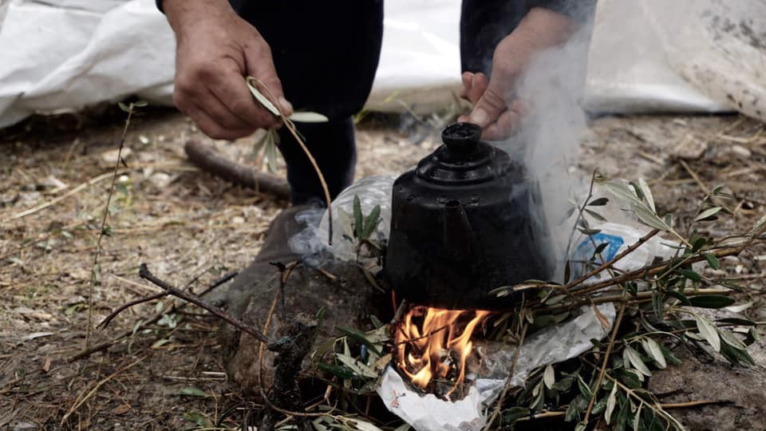
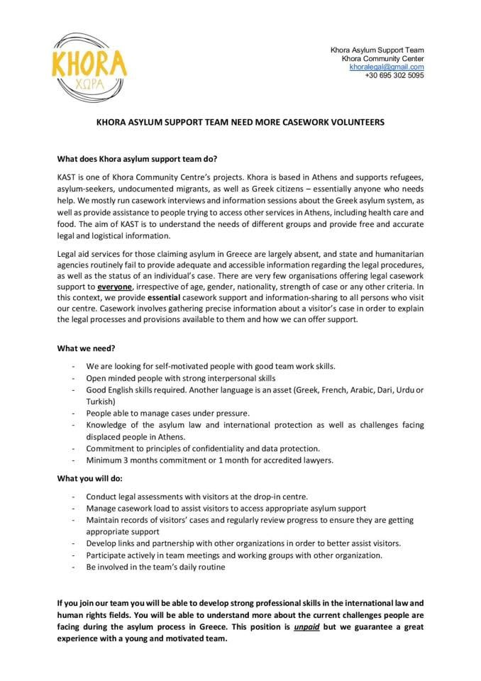

### AYS DAILY DIGEST 13/12/2019: France “reaching out” with a paltry offer

[Are You Syrious?](@AreYouSyrious?source=post_page-----30dc2ce2713d----------------------)

[Dec 14](ays-daily-digest-13-12-2019-france-reaching-out-their-hands-with-a-paltry-offer-30dc2ce2713d?source=post_page-----30dc2ce2713d----------------------) · 7 min read

Number on Greek Islands over 40,000 in spite of xenophobia and anti migration sentiment — pull factor? // Volunteer needs in Greece // November report on violent pushbacks in the Balkans // More…

Photo Credit: [Franziska Grillmeier](https://web.facebook.com/franzi.grillmeier?__tn__=%2Cd%2AF%2AF-R&eid=ARCr7fZ78tpuX2dCJyREznw8zxEjvurgduhN9yeztguH4_iZN5KjewuYwlay7c3byXUIl6_x5yeY6caE&tn-str=%2AF&hc_location=group_dialog)

Nearly 70,000 people arrived in Greece over 2019, InfoMigrants points out\. In response to this, there has been a response from France\. France has not accepted any relocations from Greece since 2017 \(interesting, considering the number of EU protocols insisting on the responsibility of France and other EU countries to participate in relocation from Greece\) \. And they have truly stormed out of the gate with an offer of… [400 people from Greece](https://www.infomigrants.net/en/post/21529/france-declares-readiness-to-accept-400-asylum-seekers-waiting-in-greece) \. They also noted that they would be sending “counter smuggling” experts to Greece along with doctors and other support staff\.

Lest we forget, the current track record for France as regards its own population of people on the move is less than stellar, with regular clearing of informal camps, and a severe under\-resourcing of support for people throughout the country\. Many people who have been rejected from Sweden \(mostly from Afghanistan\) end up in France, and there is more bad news as the Swedish church in Paris will stop working with and helping asylum seekers from Sweden, the paper [Dagen](https://www.dagen.se/nyheter/svenska-kyrkan-ger-upp-arbetet-med-flyktingar-i-paris-1.1631912?paywall=true) \(with a Christian profile\) reports\. Several thousand rejected asylum seekers from Sweden, most of them young Afghans, live in the streets of Paris following their negative answer in Sweden\.

In recent years, anti\-Migration sentiment has been on the rise and the right\-leaning party Swedish Democrats has been gaining steady ground\. It is clear that xenophobic sentiment is on the rise throughout Europe, with previous allies of newcomers considering including anti\-migration protocols in their platform in a bid to court participants from the right\. However, many analysts warn that this is a losing battle, as trying to reframe one’s platform often opens one up to accusations of hypocrisy\. It is more important that parties that support migrants and newcomers redouble their support and outreach in explaining the importance of standing up for human rights\.
### More than 40,000 people on Greek Islands — is this a pull factor?

The number of people on the Greek islands has surpassed 40,000; with more than half of these being on Lesvos\. The capacity of the centres on these islands is only a fraction of this, leaving people vulnerable and exposed\. Although the Greek government has made plans to open new centres with capacities of [between 5,000 to 7,000](http://www.ekathimerini.com/247460/article/ekathimerini/news/island-migrant-numbers-climbing) , there is opposition to these centres opening\. The argument is that this will not truly reduce congestion but will also essentially create a pull factor\. The absurdity of this is that if there is one thing that can be observed in recent trends for people on the move, it is that the “pull factor” is largely outdated\. It is radically apparent that the barriers to entering Europe are getting raised higher and higher\. Many are aware that the conditions facing people are horrible\. In fact, recent news shows that a significant number of people previously deported from Germany have made a second journey back\. Surely, if anyone is aware of the treacherous conditions, it is they\. What has been changing in the past several years is the number of “push” factors\. It is becoming evident that these home countries or “safe third countries” are neither safe nor stable\.

It has been four days since Salam Aldeen has again been imprisoned in Greece\. According to [Team Humanity](http://Team Humanity) :

_“He is detained because, as a humanitarian relief worker, he obviously poses a national security threat?????_ 
_We find it extremely sad but also extremely worrying that emergency workers are being criminalized because of their humanitarian efforts\. We are working at high pressure to get Salam released and to avoid him being expelled from Greece\. Team Humanity keep on working tiredlessly even though we miss our strong fixed rock in our center\. It is raining heavily in Moria and several tents collapsed tonight\. We have brought many refugees to safety and our center has been converted into emergency kitchens and shelter for the most needy\. Camp Moria sails in water and waste\. Many children suffer\. We continue the work because nobody flees for fun\.”_

Boat Refugee Foundation has posted an urgent call for doctors\.

_“Our medical team provides primary care to around 200 patients per day\. We work \(night\)shifts seven days a week, in a medical clinic in Moria refugee camp on Lesvos\. We also offer help during riots and other emergencies\. We work with residents from Moria who help in our clinic as translators\._

_👉 Are you a…_

_… Doctor?_

_… Doctor in training?_

_… Nurse?_

_… Psychiatrist or psychologist?_

_And are you available for at least 2 weeks in December/January? Then come and strengthen our team\! With the current population on Lesvos and the many arrivals of new refugees, we can really use your help\. Register now via the form on the website: [https://bootvluchteling\.nl/en/volunteering/volunteer\-medical\-mission\-2/](https://bootvluchteling.nl/en/volunteering/volunteer-medical-mission-2/?fbclid=IwAR1kL1QdVfP0RmUWO6VgzPDAyURK23tfqNkISDCesI1mOWiokROYZgG8IkI)_

_We appreciate it if you would share this vacancy within your network\. Thanks a lot\! 🙏”_

Khora as well is seeking volunteers\. Submit your application to khoralegal@gmail\.com

> _Aegean Boat Report notes that in the last two days, 16 boats have landed with 595 people\._ 

[Source](https://web.facebook.com/AegeanBoatReport/posts/720324961823944?hc_location=ufi) \.
### November report for violent pushbacks in the Balkans

The Border Violence Monitoring Network’s November report has been published\. In addition to documenting and summarizing general trends on pushbacks and police violence against people\-on\-the\-move, it more thoroughly explores the media and governmental attacks on the most recent shooting victims of Croatian police brutality\.

> _“On 16th and 27th November people\-in\-transit were shot by Croatian police in the Gorski Kotar region close to the Slovenian border\. On 16th November a man was injured in the chest, stomach and spine area, remaining in a critical condition in hospital as a result\. As outlined in the beginning of this report, these shootings come in the context of many more cases of firearm abuse by Croatian police against people\-in\-transit, pointing to the systematic use of live weapons as part of the border regime\. In response to these violent incidents three complementary narratives have emerged from the Croatian police\. First, firearm usage is framed as “accidental\.”_ 

> _In response to the incident on 16th November, Croatian Minister of the Interior, Davor Božinović, stated that: “What I could possibly say at this point is that it has not been established that the use of the firearm was directed at a specific person with the intention of acting against a person\.” A subsequent report by the Interior Ministry found that the police officer who shot the person\-in\-transit was separated from his team and slipped on the wet ground which was said to have contributed to the shooting\._ 

> _Second, Croatian police claim that people\-in\-transit are resisting arrest or even attacking police officers\. For instance, in response to the 16th November incident, Božinović said he could not confirm whether the group was armed, and during the 27th November incident people\-in\-transit were said to have resisted police officers\. In fact, the person\-on\-the\-move who was shot on 27th November is charged with “coercing an official,” which could result in a prison sentence of up to eight years\. In a similar vein, a whistleblower, which BVMN discussed in last month’s report, claimed that people\-in\-transit regularly carry knives\. These accounts form a narrative which implies that aggressive behavior by people\-in\-transit warrants, or at least excuses, the use of firearms\._ 

> _Finally, Croatian police claim that firearms were used in ways which do not qualify as “coercion” under Article 93 of the Law on Police Affairs and Powers\. This argument is necessary because Article 62 of Croatian police law restricts the use of firearms for coercive means to self\-protection and catching serious criminals who would face multi\-year prison sentences if convicted\. People\-in\-transit who, even if they were tried for illegal immigration would face a maximum sentence of 30 days, are clearly not a category of people against whom the coercive use of firearms is legally permissible\. Describing the use of firearms against people\-in\-transit as “non\-coercive” is a rhetorical sham, and under this poorly formed pretext people\-on\-the move have been shot and seriously wounded\.”_ 

Additionally, they noted that the number of arrivals from Serbia into Bosnia and Herzegovina spiked in late autumn, up to 7,000 over the monthly average of 2,300\. This could be due to weather factors, as many wish to move before winter sets in; however there additionally could be contributing factors in that the administration of border monitoring changed to the Gendarmarie of the Republika Srpska, which in unofficial police statements has noted a decrease in interceptions\.

For more, please see the full report\. It’s worth a [read](https://www.borderviolence.eu/balkan-region-report-november-2019/) \.

> [_Vijesti iz Tuzle i tuzlanske regije_](https://web.facebook.com/vijestiztuzle/?__tn__=%2CdkCH-R-R&eid=ARDglCmkh2WlKSVFRMJ79BdyHx_rWj9lnN02gTipMiKlx08bunJefEYcqjCNppMvX6B7XfNwkQPHNqvu&hc_ref=ARR2V8Oo3kT45QyP36xlmPJjO1ng7sl8zqj0uF-Sw_jrgES9skBYdKytozCnfaVsKfU&fref=nf&hc_location=group) _noted that several individuals teamed up to distribute food around Tuzla to people on the move there\. On working days, breakfast, lunch, and dinner are provided\. On weekends, lunch and dinner\. Follow the link to learn more\._ 

### A total of 72 people resettling to Romania from Libya

According to the UNHCR update from Libya, nearly 9,000 people have been intercepted and sent back to Libya\. Additionally, 72 people were resettled from Libya to Romania in December\. A total of 846 people have been resettled from Libya in 2019\. It is clear this is unsustainable\. For more check out the document below\.

Meanwhile, a boat with seven people has been located off the coast of Ceuta\.

**We strive to echo correct news from the ground through collaboration and fairness\. Every effort has been made to credit organizations and individuals with regard to the supply of information, video, and photo material \(in cases where the source wanted to be accredited\) \. Please notify us regarding corrections\.**

**If there’s anything you want to share or comment, contact us through Facebook or write to: areyousyrious@gmail\.com**

_Converted [Medium Post](https://medium.com/are-you-syrious/ays-daily-digest-13-12-2019-france-reaching-out-with-a-paltry-offer-cc5caac05aad) by [ZMediumToMarkdown](https://github.com/ZhgChgLi/ZMediumToMarkdown)._
