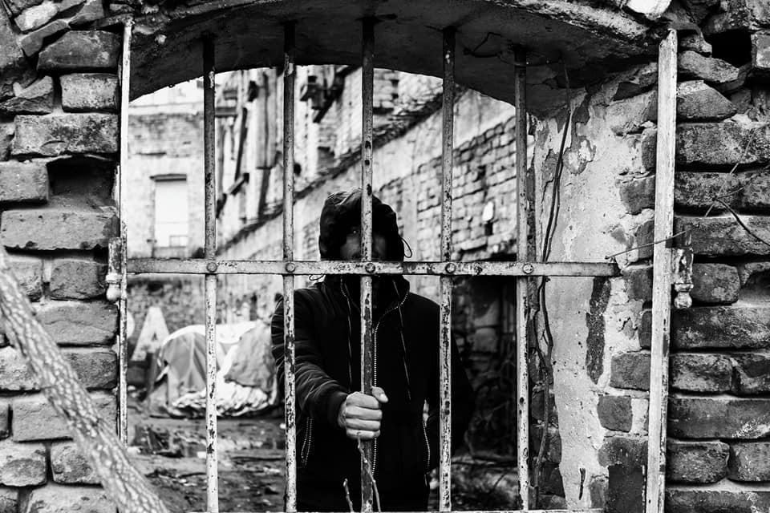

### AYS Weekend Digest 14–15/12/19: A focus on the reception system in Milan in the aftermath of Salvini’s Decree
#### A new body to be introduced to supervise Greek land and sea borders // New account from Chios // Cases of labour exploitation in Italian fields // Over 70 squats evacuated in 6 months around Bordeaux // 400 guards along the land border along the Evros River // & legal and other updates

Belgrade, December 2019\. Credit: [Igor Čoko](https://igorcoko.net) \.
### NAGA Onlus has recently published the third of a series of reports on the changes in the Italian reception system, after the entry into force of the Salvini Decrees in 2018 and 2019, with a specific focus on the area around Milan\.

The major changes introduced by the laws concern the definite closure of small second level reception centres, part of the so\-called Sprar network, which forced hundreds of people to find other accommodation or sleep on the streets \(people hosted in these structures could temporarily stay until the definition of their status\), the cancellation of the permit for humanitarian reasons \(same as above\) and the reduction of the daily quota per person these structures could use to secure basic services from 35 to 19–26 euros\. In particular, in Milan, cooperatives which hosted up to 50 people were allocated 18 euros per person per day, while those with the capacity up to 300 people were allocated 21\.5 euros\. This means that **all the basic services have been drastically cut, as well as language classes, medical and legal support\. People hosted in reception centres will not be able to receive psychological support anymore** , with the exception of those hosted in hotspots and CPRs \(deportation centres, where people can be imprisoned for up to 180 days with the uncertainty of whether they will be freed or deported back to their country of origin\) \. Health assistance is guaranteed by a doctor who should be available for 4 hours a day \(for the total number of people hosted\), while the figure of the legal assistant within the structure is completely abolished, leaving people on the move on their own when it comes to understanding the complicated legislation on asylum \(NGOs are voluntarily offering legal assistance\) \. Until 31st July, 2,586 people were housed in centres for extra\-ordinary reception around Milan; nationwide, at the same time, 105,142 people were registered within the reception system\.

The report also underlines the incapacity of the system to guarantee accommodation for those who do not explicitly state that they are in need and cannot afford accommodation on their own\. Both the information given by the Questura and the material the applicant has to submit are lacking any information or direction on how to request a place in the accommodation centres, as it is not directly provided to those who apply for protection\.

> _As of today, around 3,000 people are estimated sleeping rough in the city\._ 

The reasons why people are kicked out of the structures vary; the most problematic one concerns the fact that even those who do not reach the centre in time at night “to be counted as present” will be immediately revoked the guarantee of a place; flexibility is absent even for those who have to work late nights\. Moreover, from June 2018 until May 2019, a total of 64,454 applications were rejected and this means more people in the streets unless they appeal\. Expulsion orders, just in Milan, in 2019, reached the number of 2,800\. A new CPR in Via Corelli will be open in the next weeks\.

The report also analyses the forms of informal settlements around the city, mainly former industrial buildings, open spaces like parks and former construction sites, abandoned housing complexes, all of them subject to different forms of evictions and destruction of personal belongings\. From March 2018, NAGA has been reporting and listing these evacuations that happen with similar characteristics:
- absence of notice;
- social workers should be present when there are minors involved \(which was not the case for at least two of the evictions\);
- there is no alternative housing solution offered;
- there is no possibility to dialogue and discuss the evacuation itself and the procedures;
- poverty, vulnerability etc\. seem not to be important characteristics for the authorities when it comes to protecting those evacuated\.

There are, however, some realities that offer housing solutions for those in need, namely “collettivo Noi ci siamo\!”, “Residence Sociale aldo dice 26X1”, “Comunità di Sant’Egidio” and “Diaconia Valdese”\.

The report includes also an analysis of the residency issue for asylum seekers and a series of proposals to make the whole bureaucratic procedure easier to navigate and more respectful of basic human standards\.

Find the original report \(in Italian\) [here](https://naga.it/wp-content/uploads/2019/12/Report_Senza-scampo_Naga-5.pdf?fbclid=IwAR2pMcdDA8iphxdIhJT0bc4sWQhuMRLK0VMwM6BTYdN2dLJ89X6L1pFk2fI) \.
### On Tuesday 17th December, the new CPR \(permanent centre for repatriations\) will open in Gradisca d’Isonzo, Friuli Venezia Giulia\.

People in solidarity will picket the area from 8\.30 AM, join them if you can\!
### [Two asylum seekers arrested](https://www.facebook.com/AmdhNador/posts/2493141917564735) in Melilla after protesting against the living conditions in the overcrowded centre where they are secluded\.
### GREECE

As part of the recent externalization plans of the EU, the Greek authorities will add 400 guards to the land border along the Evros River in a bid to keep more people from trying to make the perilous crossing\.

Four closed pre\-departure centers, three in Eastern Macedonia and Thrace and one in the Thessaloniki area, will keep those arrested while the government also is considering whether to also **extend a barbed wire fence** at Orestiada along the entire length of the Evros River, the media [reported](https://www.thenationalherald.com/274095/greece-will-post-400-guards-on-evros-river-border-with-turkey/?fbclid=IwAR2mMtR3HJWNUIEMRuv3gvbVzqUc509plg_rQ8NYFEtapku4Y7ZLkfdekNE) \.
### New national coordinator to tackle the emergency situation in Lesvos

According to a new law passed this Friday, [a “senior coordinator” will lead a team of specialists](http://www.ekathimerini.com/247552/article/ekathimerini/news/bill-foresees-new-body-to-tackle-migration?fbclid=IwAR3EOfEqg-6VWX5VkLAlcEImAQPogz_EC-0STh-3kE68wVyagGmRFuhF1MM) that will have the task to find a solution to the ongoing crisis on the island of Lesvos\. The body will respond directly to the prime minister Kyriakos Mitsotakis, and will have both political and military powers, but will be an independent entity\.

> _The new body would be tasked with coordinating the supervision of the country’s land and sea borders and would be staffed with both military and political officials\._ 

The proposal raised doubts on the efficiency of the body itself and criticism from other members of Parliament as it considered a last minute solution that will create more damage than good\.

According to [UNHCR](https://data2.unhcr.org/en/situations/mediterranean/location/5179) , 55,189 people arrived by sea in 2019 and are currently stuck on the Aegean islands\. Around half of them \(24,472\) arrived just on Lesvos, the island that is actually [hosting 20,060 individuals](https://infocrisis.gov.gr/7122/national-situational-picture-regarding-the-islands-at-eastern-aegean-sea-12-12-2019/?lang=en) \. **People in Moria were recently hit by heavy rains and an extreme drop of temperature\.** The picture coming from the island is not different from the ones of the past years: families forced to live in mud, with no shelter and no protection from the harsh winter to come\. An image that Europe knows too well, sadly\.
### Meanwhile, in Chios…

> _Hassan came to Greece from Aleppo, Syria, to continue his studies\. They gave him a summer tent from Vial that sank into the mud 4 days ago\. He asked for a new tent from the police and the reception center\. No one responded, as he told me\. He has no money to buy a tent\. He came to the city of Chios on foot and stayed on a bench for 4 days with a thin blanket\. When it rains, he moves under the sheds of the buildings\. At least five other people are sleeping around in fear that the police will come and arrest them\._ 

Original source [here](https://www.facebook.com/groups/1508309029486384/permalink/2428150784168866/?hc_location=ufi) \.
### Weekly arrivals to [Lesvos](https://www.facebook.com/AegeanBoatReport/) and [Chios](https://www.facebook.com/chiosesrt/posts/2550561925012976?__tn__=K-R)
### Initiatives that need your support

A great initiative by Becky’s Bathhouse, which will soon [install dryers](https://www.facebook.com/beckysbath/posts/2466584056743147) in their premises on Lesvos, so that residents in Moria will be able to wash and dry their clothes in one go\! Please, support them if you can\!
### SERBIA

In Šid, the NNK volunteers report the gradual return of people after the recent eviction of the city’s squats\. The police took the people who lived in squats by force to the fields near the borders of Romania and Bulgaria, which meant a hard setback for them on their way to the EU\. 
During evictions, the police reportedly kept the people’s mobile phones, money and other belongings\.

> _The tents that offered shelter to more than a hundred people before the evictions were destroyed, and also all the blankets that protect them minimally from the cold during the nights\._ 
 

> _We are now organizing to recover a little what we lost\. We have returned to provide a hot meal a day inside the squat, under the attentive look of the authorities that have been present every day since the eviction took place, trying to prevent people from settling back in the building\._ 

### ITALY
### 19 field workers deprived of their rights in Saluzzo

The [19 workers were exploited in the fields in Northern Italy](http://www.targatocn.it/2019/12/13/leggi-notizia/argomenti/cronaca-1/articolo/presunto-caporalato-nel-saluzzese-in-sette-rinviati-a-giudizio.html?fbclid=IwAR3HbIKWT-X5wo4tphwZuyboBsm0fmZ7hQ7sbOi4rpWo5FfzdVfhca6hc68) for 5 €/hour \(2\.5 € less than the legal minimum wage\), with super short contracts, renewed constantly, having therefore no job security\. The workers had to be available at any time during the day and during the night, as they were considered “on call”, and had to work exhausting 10/12 hours shifts, even though, on paper, they were working for 5/6 hours a day\.

Not only the working conditions, but also the living conditions were absolutely inhumane, as 40 people were forced to live in the same room with very precarious hygiene conditions\. As if this was not enough, the workers had to pay rent for this sort of accommodation \(money that was taken directly from their wage\) \. The workers were instructed to lie and pretend to not understand Italian in case of random controls by the authorities\.
### FRANCE
### In Bordeaux, the growing population of people on the move found accommodation by squatting empty buildings, a temporary solution to take people off the streets\.

However, in the past 6 months, an aggressive campaign of the local Prefect resulted in the massive evacuations, with over 70 squats shut down in this period of time\.

> _The Zone Libre is a former home for the elderly and was opened up as a squat on November 9 by several local associations, including Médecins du Monde \(Doctors of the World\), RESF, Bienvenue \(Welcome\) and the Collectif Migrants Bordeaux \(Bordeaux Migrants’ Collective\) \. Bernie, who volunteers at Bienvenue \(Welcome\) — the group which operates the squat — says the facility currently houses 271 people, including 158 adults and 113 children\._ 

> _In the squat, each family group is allocated one small room\. In all, there are 81 accommodation units, and they are all full\. Single men and women have to share rooms\. “There are seven of us in one room\. The three youngest of my children have to sleep on the floor because there aren’t beds for everyone,” Ikhlass says\. “We don’t have a fridge either, so it’s not easy to handle meals\. The living conditions are far from ideal but we have a roof over our head and the people from the associations help us a lot,” she says\._ 

Local people were also very helpful when it came to support those in need, opening their houses if possible\.

But in mid\-April, local Prefect, Fabienne Buccio, the one responsible for the evacuation of Calais in 2016, was tasked with applying the “Calais model” to evacuate the squats’ area in Bordeaux, resulting in 70 evacuated buildings and 73 others currently undergoing legal proceedings\. Even though authorities claim the assess the cases individually, “according to local associations, no housing solutions have been offered to illegal migrants or people who have had their asylum applications rejected\. According to the associations, this is a serious breach of the principle of unconditional reception”\.

Read more about the situation in the city and the various forms of solidarity [here](https://www.infomigrants.net/en/post/21478/living-from-day-to-day-in-bordeaux-s-migrant-squats?fbclid=IwAR0aWFYooW-eESnGn3Ymohhfsl5zT03deeGoPT9YenGfGomlV8IvX5g7_lg) \.
### GERMANY

The number of police officers accompanying deportation flights in Germany has nearly doubled in four years, despite overall deportations decreasing\.

There were nearly 11,000 police officers on deportation flights in 2018, compared with 5,841 in 2014 — a jump of 5,639 in a four\-year period, reported the German [media](https://l.facebook.com/l.php?u=https%3A%2F%2Fwww.dw.com%2Fen%2Fgermany-police-presence-on-migrant-deportation-flights-nearly-doubles%2Fa-51668256%3Ffbclid%3DIwAR3m2pv76khwJmqzrutV6h_DaVPq6rgbL5j5uha4E6KhXgW4h5x6kJeBJD8&h=AT0ftrtYFMONGmyoeWiV8bRT1k9OUlOwHtMMML2nNK-q3gxbJcNaudwJ4GcdMPA_d4aWIqhR16OyMK-hI523ChCxUPnOeI3T1bNOfSn7fkAl4c-IBQjPfEgdt1UV0tFyyd1mYukgt6o7cQ) \.
### LEGAL
### Detention order of unaccompanied minor deemed unlawful following improper age assessment

On 1 November 2019, the Secretary of State imposed a detention order of an unaccompanied child pending Dublin transfer\. The applicant claims to be a child, and argues that he was wrongfully detained as an adult following an age assessment that was conducted not in accordance with the law\.

> _The detention of unaccompanied minors is permitted only in extreme cases and must be for the shortest possible time\. Grounds justifying detention include: on suspicion of a crime; the return of the applicant can be arranged within 14 days; and the applicant presents a risk of absconding\._ 

The Court of The Hague published its [judgment](https://uitspraken.rechtspraak.nl/inziendocument?id=ECLI:NL:RBDHA:2019:12811) on this unlawful detention of an applicant claiming to be an unaccompanied minor following an improper age assessment\.
### The Human Rights Committee on deportations to Afghanistan

On 18 November 2019, the Human Rights Committee published its [views](https://tbinternet.ohchr.org/_layouts/15/treatybodyexternal/Download.aspx?symbolno=CCPR%2fC%2f126%2fD%2f2603%2f2015&Lang=en) concerning the risk of inhuman and degrading treatment in the event of deportation to Afghanistan\.
The risk of treatment contrary to Article 7 must reach a high threshold and be personal\. Past ill treatment provided a strong indication of a future real risk of ill treatment in cases where a generally coherent and credible account of events has been presented\.
In the case of an Afghan national who previously worked for Afghanistan intelligence forces and the National Directorate of Security \(where he trained with Afghan and US forces to apprehend the Taliban,…\) the State had failed to conduct an individualised assessment which took into account the real and personal foreseeable risk of ill treatment by both the Taliban and Afghan authorities\. It therefore found that the applicant’s removal to Afghanistan would amount to a violation of Article 7 ICCPR\.

**Find daily updates and special reports on our [Medium page](https://medium.com/are-you-syrious) \.**

**If you wish to contribute, either by writing a report or a story, or by joining the info gathering team, please let us know\.**

**We strive to echo correct news from the ground through collaboration and fairness\. Every effort has been made to credit organizations and individuals with regard to the supply of information, video, and photo material \(in cases where the source wanted to be accredited\) \. Please notify us regarding corrections\.**

**If there’s anything you want to share or comment, contact us through Facebook, Twitter or write to: areyousyrious@gmail\.com\.**
### [Are You Syrious?](/are-you-syrious?source=post_sidebar--------------------------post_sidebar-)
#### Daily news digests from the field, mainly for volunteers and refugees on the route, but also for journalists and other parties\.

Following
- [Refugees](/tag/refugees)
- [Migration](/tag/migration)
- [Europe](/tag/europe)
- [Human Rights](/tag/human-rights)
- [Italy](/tag/italy)

_Converted [Medium Post](https://medium.com/are-you-syrious/ays-weekend-digest-14-15-12-19-a-focus-on-the-reception-system-in-milan-in-the-aftermath-of-8830d90abfda) by [ZMediumToMarkdown](https://github.com/ZhgChgLi/ZMediumToMarkdown)._
