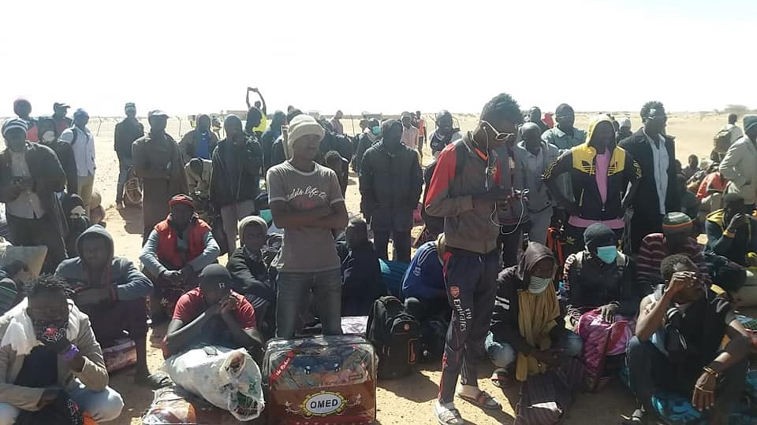
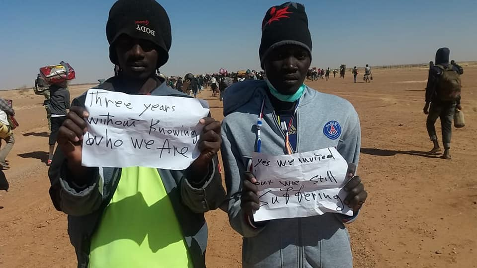
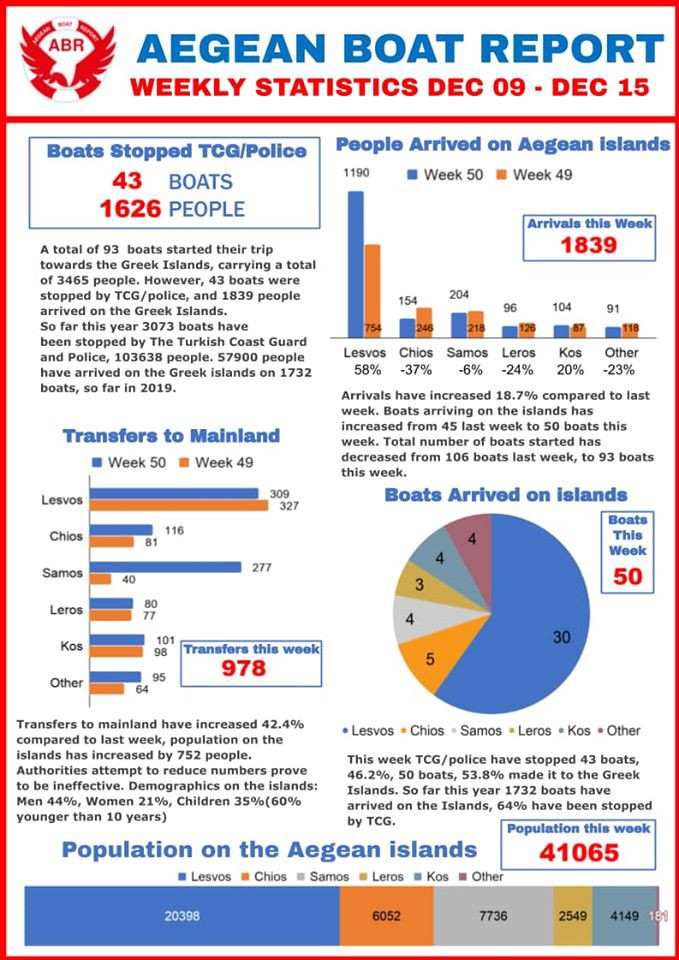

### AYS Daily Digest 16/12/19 Over 1000 people protest the UNHCR Niger office under growing turmoil

_Possibly a combined total of 100 people have disappeared in the Med // Violent Attacks in Nador // Updates on Salam Aldeen’s case // and more…_

](assets/e0b2ef90ed40/1*ews780ETrigp-MRMX6N8Zg.jpeg)

Niger 2019: European promises\. Photo by [Alarm Phone Sahara](https://www.facebook.com/AlarmePHONESahara/photos/pcb.2205413069768604/2205412973101947/?type=3&theater)
### Feature: Niger — The EU

We turn our attention to the growing issue of externalizing asylum procedures and Europe’s borders\. Journalist Sara Creta wrote an excellent thread describing the recent turmoil in Niger for the 2,900 people evacuated to the country by UNHCR as a safety measure\. They were promised to be resettled in EU countries:

■■■■■■■■■■■■■■ 
> **[Sara Creta](https://twitter.com/saracreta) @ Twitter Says:** 

> > By August, only 59 %, (1,723 people) have been resettled, but what will happen to those that do not meet resettlement requirements remains unclear. 

Without access to resettlement these people are left in a limbo rather than with a sustainable solution. 

> **Tweeted at [2019-12-16 13:51:08](https://twitter.com/saracreta/status/1206572469760516096).** 

■■■■■■■■■■■■■■ 

2 camps have opened: one by UNHCR in which people have “protested the dire conditions in the new transit centres, including food and water\-shortages and a lack of medical care” and another where the so\-called ‘self\-evacuated’ Sudanese refugees are hosted\.” It’s like “being dumped in the middle of the desert\.” This is what happened on Monday:

■■■■■■■■■■■■■■ 
> **[Sara Creta](https://twitter.com/saracreta) @ Twitter Says:** 

> > Today, a thousand people, mainly Sudanese originally from Darfur, decided to march to @[UNHCRNiger](https://twitter.com/UNHCRNiger) office in #Agadez.  They are worried about their future as many of them say they are just a "case number" at the UNHCR. https://t.co/CyIefofFKp 

> **Tweeted at [2019-12-16 13:51:21](https://twitter.com/saracreta/status/1206572523623718912).** 

■■■■■■■■■■■■■■ 

Some have been left in limbo for years with the promise of reaching Europe under no durable solutions\.

](assets/e0b2ef90ed40/1*zcQvJOtJ7H-NPt1LTxRhBQ.jpeg)

Photos by [Alarm Phone Sahara](https://www.facebook.com/AlarmePHONESahara/photos/pcb.2205413069768604/2205412973101947/?type=3&theater)

For more of an in depth look from volunteers in Niger read our AYS Special: [How the EU externalized its border into Niger\.](ays-special-how-the-eu-externalized-its-border-into-niger-afe7fa3de009)

On another subject matter which you won’t regret checking out is AYS’s updated Special on [last week’s event in Iraq](ays-special-updates-from-baghdad-2-aa711055b5c5) \. Kidnappings of demonstrators and activists are on the rise…\.
### Morocco

Updates from [Association Marocaine des Droits Humains — Section Nador](https://www.facebook.com/AmdhNador/photos/a.1693125780899690/2495185240693736/?type=3&theater) \. Many refugees were injured Sunday night during attacks in Nador:

> “7 are dead, 22 injured were received in the nador hospital\. Only 5 women and 3 injured men are still in the hospital\. The other 14 were arrested by the police once they received the care\. The most important point of this drama is the death of a mother who left a 7\-Month\-old baby who was rescued\. Amdh Nador also found testimonies that confirmed that the cause of this wreck was the fire that spread quickly in the zodiac because of the winds\. Migration policies kill, but traffickers who organize a conveyed of 91 migrants in these weather conditions are real criminals\.” 

### Sea
#### There have been several shipwrecks and people missing in the Mediterranean in the last day\.

■■■■■■■■■■■■■■ 
> **[Alarm Phone](https://twitter.com/alarm_phone) @ Twitter Says:** 

> > This morning, we were alerted by a boat off #Nador, carrying about 90 people, incl. many women &amp; several children. They were in panic &amp; said they were capsizing. After this call we lost contact &amp; don’t know what happened to them. Authorities in #Morocco &amp; #Spain are informed. https://t.co/MPZ9rJLyCc 

> **Tweeted at [2019-12-16 12:30:03](https://twitter.com/alarm_phone/status/1206552063259353088).** 

■■■■■■■■■■■■■■ 

■■■■■■■■■■■■■■ 
> **[Alarm Phone](https://twitter.com/alarm_phone) @ Twitter Says:** 

> > +++ Shipwreck confirmed +++ At 14.48h CET we spoke to MRCC Rabat #Morocco again who confirmed a shipwreck - 63 people were rescued, 7 people died &amp; 20 people are missing. We believe it’s the boat that alerted us earlier. We are devastated and hope more survivors will be found. 

> **Tweeted at [2019-12-16 14:10:49](https://twitter.com/alarm_phone/status/1206577423451611136).** 

■■■■■■■■■■■■■■ 

Also: _“ More than **60 people disappeared** in the [\#Mediterraneo](https://twitter.com/hashtag/Mediterraneo?src=hashtag_click) when a raft was wrecked when they tried to reach [\# Spain](https://twitter.com/hashtag/Espa%C3%B1a?src=hashtag_click) \. There are 22 survivors in Nador 7 bodies recovered\. Moroccan vessels are in the area with the plane of the [\#SAR](https://twitter.com/hashtag/SAR?src=hashtag_click) Spanish\.”_ — [Sergio Rodrigo](https://twitter.com/SRodrigoruiz/status/1206595013376970754?fbclid=IwAR1hYzMZlcIdlnyPGYzF5MMgJQUXlCr-nTOeifWojWZA_yZzkW3srqP7l74)

](assets/e0b2ef90ed40/1*u3Bt-aetEzh0rXXDRA53KA.jpeg)

Over a hundred people are missing from these two boats\. Photo by [Sergio Rodrigo](https://twitter.com/SRodrigoruiz/status/1206713755029118977)

■■■■■■■■■■■■■■ 
> **[SOS MEDITERRANEE](https://twitter.com/SOSMedIntl) @ Twitter Says:** 

> > 🎥In November, as winter was setting in, the #OceanViking rescued 275 people in 4 operations.

People continue to flee Libya on flimsy boats, despite adverse weather conditions.

The #OceanViking is now heading back to the Central Med, ready to assist potential boats in distress. https://t.co/qjy4mXjX4I 

> **Tweeted at [2019-12-16 16:19:48](https://twitter.com/sosmedintl/status/1206609884969684993).** 

■■■■■■■■■■■■■■ 

### Greece

[Team Humanity](https://www.facebook.com/TeamHumanityDK/posts/1510908049078200) provided this update on their founder Salam Aldeen’s case \(who was arrested on Wednesday on charges that he was a “public threat” by the Greek police\):

> “Salam still sits behind bars at Lesvos, now on the 6th day\. Fortunately, we have some good lawyers on the case, in Lesvos but also Athens\. A Danish lawyer was also contacted\. The Foreign Ministry in Denmark says that they are working on the case\!? We want to thank everyone for your support…Thanks also to all the Danish media who have referred to the case\. We hope that all of this will put pressure on the Greek authorities to release Salam\. We send warm thoughts to Salam\. We will continue to work in our center\. We are needed in Moria camp\. Furthermore, we send a loving thought to Salam’s family in Denmark\. We will do everything we can to take good care of him and get him free\.” 

Please sign the petition here to free [Salam](https://www.change.org/p/ask-the-greek-government-to-release-refugees-activist-salam-aldeen-now-and-not-deport-him?signed=true) \.

[200 refugees](https://twitter.com/Refugees_Gr/status/1206556925896396800?fbclid=IwAR351sl0WQs1WjNczLaFLWM0BA7CtMIYbcve3r3QdYxxpGaNlWJdjp1I_yQ) were arrested on the Evros border area just in the past week… [2 women](https://twitter.com/maria_louka/status/1206536662555267073) were found dead, frozen in the Evros river on Monday… the number of people coming, mostly from Turkey, has [more than doubled](https://www.infomigrants.net/en/post/21536/inside-europe-a-new-migrant-crisis-in-greece) since July…people keep coming and Greece cannot handle it alone\.

[2 Moroccan refugees/activists](https://www.facebook.com/LesvosLegal/posts/2828550537183641?hc_location=ufi) will face court on Tuesday for human trafficking charges\. They entered Greece on the 22nd of July and were abandoned by their smuggler along the Evros river\. They are being charged for “illegal transfer” of others even though their is no evidence\. Both men were imprisoned in Morocco many times for their human rights activism\. More [here](https://morningstaronline.co.uk/article/w/moroccan-political-activist-turned-refugee-to-appear-in-court-accused-of-human-trafficking-in-greece?fbclid=IwAR1DOPFiu3tbho29shnK5bSmjW0A2ShdY_aKrZRFLkWMSd3D1Fv-22PTinE) \.

Just a reminder:

■■■■■■■■■■■■■■ 
> **[Bruno Tersago](https://twitter.com/BrunoTersago) @ Twitter Says:** 

> > 41,065 refugees &amp; migrants on Greek islands
Lesvos 20,398 - Moria 18,213 (cap 2,840)
Chios 6,052 - Vial 5,769 (cap 1,014)
Samos 7,736 - Vathy 7,438 (cap 648)
Leros 2,549 - camp 2,305 (cap 860)
Kos 4,149 - camp 3,774 (cap 816) 

> **Tweeted at [2019-12-16 19:34:01](https://twitter.com/brunotersago/status/1206658758404952065).** 

■■■■■■■■■■■■■■ 

New Arrivals by [Aegean Boat Report](https://www.facebook.com/AegeanBoatReport/photos/a.285312485325196/722935691562871/?type=1&theater) for Monday: _“At least nine boats have arrived on the Greek Aegean Islands, carrying **316 people** \.”_

Lesvos with 5 boats: 34 people; 48 people; 32 people; 48 people; 42 people\.

Chios with 4 boats: 39 people; 27 people; 7 people; 39 people\.

Also for Sunday, 191 people came in five boats\.

 \!** “Barely halfway through December, Lighthouse Relief has already assisted 1,225 people arriving on the north shore of \#Lesvos\. Over 600 of these passengers crossing the sea on flimsy rubber boats were children — many of them infants or toddlers, arriving soaking wet in the arms of their parents\. Upon landing and in Stage 2 transit camp, our volunteers have been working tirelessly to provide blankets, dry clothes, nappies and baby bottles to the families arriving day and night — small gestures to make them feel welcome\.”](assets/e0b2ef90ed40/1*rbcQJg6W40YnE0LJ9diD1w.jpeg)

**Come volunteer with [Light House Relief](https://www.facebook.com/lighthouserelief/posts/2581446461977879?__tn__=-R&fbclid=IwAR0B1O-TG__qKrvk_4UuIhrEECWvwPf7GgfEzPlh4qOjMBY0vF4D6mhHAMI) \!** “Barely halfway through December, Lighthouse Relief has already assisted 1,225 people arriving on the north shore of \#Lesvos\. Over 600 of these passengers crossing the sea on flimsy rubber boats were children — many of them infants or toddlers, arriving soaking wet in the arms of their parents\. Upon landing and in Stage 2 transit camp, our volunteers have been working tirelessly to provide blankets, dry clothes, nappies and baby bottles to the families arriving day and night — small gestures to make them feel welcome\.”

](assets/e0b2ef90ed40/1*ZugHwoVKEg9YxEfNpU8Zdg.jpeg)

“Still no electricity” Moria\. Photo by [Franziska Grillmeier](https://twitter.com/FranziEire/status/1206580656245002241)
### Italy

A court convicted 6 Nigerian men for gang raping a woman in the South of Italy\. The woman was raped first in Libya and then again once arriving in Italy in 2017\. She living in a protected facility and their sentences range from 5 to 9 months\. More [here](https://www.infomigrants.net/en/post/21563/court-convicts-6-nigerians-in-gang-rape-case-at-italian-migrant-center) \.
### Spain

A human trafficking trial on Monday laid out how a 25 year old man “patronized” a boat where 3 people died and 17 could have gone missing\. Learn more [here](https://www.europapress.es/andalucia/almeria-00350/noticia-juzgan-lunes-almeria-presunto-patron-patera-tres-fallecidos-17-desaparecidos-20191215101432.html) \.
### France

There is an URGENT need for medical volunteers in Calais and Dunkirk\. Learn more [here](https://www.facebook.com/groups/FASTCalais/) \.
### Germany

> “Open call — we are looking for you / you for our nationwide network: reasons or become part of a mov Europe\! Local group in your city\! We are from migration \_ together and would like to introduce you to you in the following mov Europe\! \- Mobility for refugees in Europe and ask you to further expand the project in Germany\. 

> Mov Europe\! Is a German\-Italian pilot project that we founded in 2017 with the aim of providing legal migration routes to Germany with a residence permit in Italy through visa procedures for educational purposes \(residence § 17\), such as internships, voluntary services and training\. Legally, the project is already elaborated\. More info about mov Europe\! [You can find us on our website](https://migrationmiteinander.de/?fbclid=IwAR1BQSaYIWhXgTP7lCqVFZM069a-8E7We8tC_EftbxuWQ4Cg5inUSI3QMfk) \.” 

### Sweden

 \. Photo by [Charly Vestli](https://www.facebook.com/photo.php?fbid=2644600095656214&set=a.364246073691639&type=3&theater&ifg=1)](assets/e0b2ef90ed40/1*VqGv_s3Sy91bp01WFm6ytg.jpeg)

URGENT A young woman is being sent back to Greece alone\. “After she spent some time in foster care in Athens, she went to her aunt and cousins in Sweden\. In Sweden, she applied for asylum, which got denied because she already received asylum in a safe country \(Greece\) \. She has appealed several times, but with no success\. She now has to go back to Greece\. Alone\.” She just turned 18\. Please refer [here for a fundraiser to help](https://www.facebook.com/photo.php?fbid=2644600095656214&set=a.364246073691639&type=3&theater&ifg=1) \. Photo by [Charly Vestli](https://www.facebook.com/photo.php?fbid=2644600095656214&set=a.364246073691639&type=3&theater&ifg=1)
#### **Find daily updates and special reports on our [Medium page](https://medium.com/are-you-syrious) \.**

**If you wish to contribute, either by writing a report or a story, or by joining the info gathering team, please let us know\.**

**We strive to echo correct news from the ground through collaboration and fairness\. Every effort has been made to credit organizations and individuals with regard to the supply of information, video, and photo material \(in cases where the source wanted to be accredited\) \. Please notify us regarding corrections\.**

**If there’s anything you want to share or comment, contact us through Facebook, Twitter or write to: areyousyrious@gmail\.com\.**

_Converted [Medium Post](https://medium.com/are-you-syrious/ays-daily-digest-16-12-19-over-1000-people-protest-the-unhcr-niger-office-under-growing-turmoil-e0b2ef90ed40) by [ZMediumToMarkdown](https://github.com/ZhgChgLi/ZMediumToMarkdown)._
