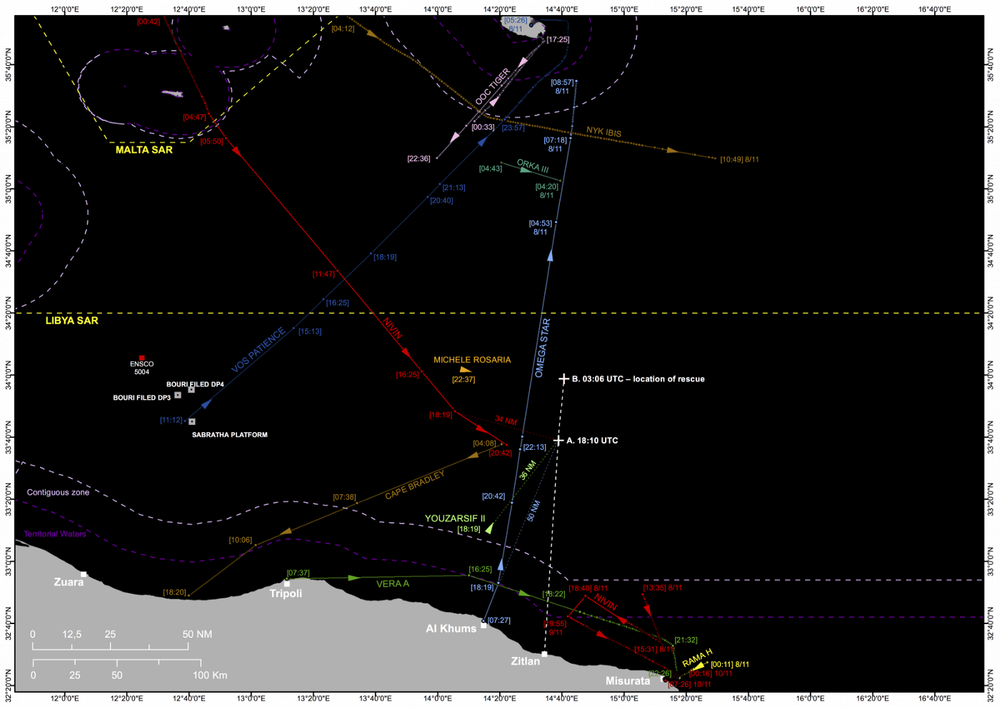
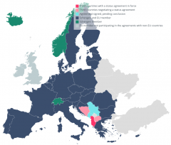

### AYS Daily Digest 18/12/19: What’s behind the “Flexible Operational Activities” of Frontex
#### Frontex sets up further its “global mission plan” in the Balkans / 63 people rescued off the Spanish coast / A report on the so called ‘privatized push\-backs’ / Possible drowning in Italy / In police raids at Athens squats, police allegedly assaulted and tied up neighbors who refused to let them into their homes without a warrant / Deportations from Sweden — Do you know what you are sending the children to?/ & more news

Synthetic map of the 7 November 2018 Nivin incident on the basis of georeferenced positions and AIS data\. \(Forensic Oceanography\) — see the report on ‘privatized push\-backs
#### FEATURED

Arrivals were falling in the western and central Mediterranean and growing in the eastern Mediterranean as well as the Balkans, according to their latest “report on migration developments in Europe”\. That’s why the EU countries have conveniently now masked their dispersion of responsibility in a new plan to employ Frontex forces even more in the Balkans, with the Balkan countries themselves being in charge to do the “dirty work” of deportations etc\.

> **After Albania and Montenegro, the EU Commission has concluded a Frontex status agreement with Serbia, to be followed by Northern Macedonia and Bosnia\-Herzegovina\. A first deployment of the EU border troops has meanwhile been increased\.** 

It is important to keep in mind that all countries concerned are considered candidates for EU membership and the agreement to the Frontex operations is intended to facilitate the negotiations\.

Officially, Frontex claims their main goal is to “control migration flows, cross\-border crime, including smuggling, human trafficking and terrorism, and strengthening European cooperation on the land border between Albania and Greece “\. In the recently announced plan that the border police stationed at the outer EU borders would stop and turn back people arriving from other EU countries, new contracts were signed that would introduce their measures “to build regional border control capacities” and the exchange of operational information and “best practices” across the outer EU border areas, Frontex signed the deal with Serbia, Montenegro — pending for approval by the EP, as well as Albania\.

The operation there is based on a status agreement on border cooperation between the European Union and Albania, the first such agreement with a non\-EU country\. According to Frontex, the governments in Austria, Croatia, Czech Republic, Estonia, Finland, France, Germany, Latvia, the Netherlands, Romania, Poland and Slovenia sent officers, as well as 16 patrol vehicles and a thermo\-vision vehicle\.

> The border police officers sent by Frontex from the EU Member States receive a special identity card from the country of deployment and wear their own uniforms with a blue Frontex armband\. They will also carry weapons, ammunition and equipment from their sending state and may use force\. 

> The troops enjoy immunity during Frontex operations\. If a criminal offence is found, it will be prosecuted by the jurisdiction of the Member State of origin\. Frontex team members also enjoy full protection against civil and administrative prosecution in the State of operation\. The latter will also be liable for any damage caused by a member of the team during „all acts performed in the exercise of the official functions“\. — _From reports on Frontex by [Matthias Monroy](https://digit.site36.net/author/digit/)_ 

The name of the Frontex operation in Albania is “Joint Operation
**Flexible Operational Activities — Western Balkans** 2019 in Albania”\.
The Albanian police are set to be responsible for all border police measures, while Frontex is coordinating the operation in their three support offices \(see
link from previous mail\) \.
The global mission plan for the Albanian\-Greek border is agreed with
Greece\. The Greek authorities are taking part in the daily exchange of operational information and assessments\. Measures on the Greek side of the border are reportedly also in place\.
These are “closely” agreed with Greek authorities\. According to the
operational plan, the authorities claim that no deportations are foreseen \(that means: **deportations are carried out by Albania and are solely Albanian responsibility** \) \.
When asked about it, the German government has no idea if Frontex plans already for Serbia and Montenegro\. However, the reason why Kosovo is the only western Balkans country without a status agreement, in spite of being on the so\-called Route, is the fact that it has no border with an EU member state\.
#### „No knowledge“ if the Albanian NGOs will be involved

> The measures taken by Frontex should be observed by a Fundamental Rights Officer, among others\. Frontex has also set up a [Consultative Forum](https://frontex.europa.eu/fundamental-rights/consultative-forum/general/) with non\-governmental organisations to advise the Agency on how to prevent infringements\. 

> For „Joint Operations“ in third countries, the Consultative Forum recommends involving human rights groups active there in the operational plan\. However, the German Federal Ministry of the Interior, which sends eleven officers to Albania, has [„no knowledge“](http://dipbt.bundestag.de/doc/btd/19/116/1911678.pdf) of the involvement of Albanian non\-governmental organisations\. 

#### SEARCH AND RESCUE AT SEA

Six babies and two children, who were part of a group of 63 people traveling in two boats, have been rescued by Maritime Rescue 60 miles \(111 kilometers\) from Gran Canaria, according to a Red Cross spokesman\.
### Delegating an “outsourced” push back

A recurrent practice referred to as **‘privatized push\-back** ’ is a relatively recent strategy that has been implemented by Italy, in collaboration with the LYCG, since mid\-2018, as a new modality of delegated rescue, intended to enforce border control and contain the movement of migrants from the Global South seeking to reach Europe\.

> Using georeferencing and AIS tracking data, Forensic Oceanography reconstructed the trajectories of the migrants’ vessel and the Nivin\. Tracking data was cross\-referenced with the testimonies of passengers, the reports by rescue NGO [WatchTheMed](http://www.watchthemed.net/) ‘s ‘Alarm Phone’, a civilian hotline for migrants in need of emergency rescue; a report by the owner of the Nivin, which he shared with a civilian rescue organisation, the testimonies of [MSF\-France](https://www.msf.org/france) staff in Libya, an interview with a high\-ranking LYCG official, official responses, and leaked reports from EUNAVFOR MED\. 

This [report](https://content.forensic-architecture.org/wp-content/uploads/2019/12/2019-12-18-FO-Nivin-Report.pdf) is an investigation into this case and new pattern of practice\.

It is the basis for a legal submission to the [United Nations Human Rights Committee](https://www.ohchr.org/EN/HRBodies/CCPR/Pages/CCPRIndex.aspx) by [Global Legal Action Network \(GLAN\)](https://www.glanlaw.org/) on behalf of an individual who was shot and forcefully removed from the Nivin\.

Read GLAN’s report [here\.](https://www.glanlaw.org/nivincase)

■■■■■■■■■■■■■■ 
> **[Forensic Architecture](https://twitter.com/ForensicArchi) @ Twitter Says:** 

> > Forensic Oceanography's latest investigation into Italy’s privatised push back of migrants in the Mediterranean is now available to view on our website. Read the full investigation here: [forensic-architecture.org/investigation/…](https://forensic-architecture.org/investigation/nivin) 

> **Tweeted at [2019-12-18 11:20:43](https://twitter.com/forensicarchi/status/1207259393454157828).** 

■■■■■■■■■■■■■■ 

#### GREECE
### Ongoing disaster on the islands waits for a liable solution

In the last two days at least 15 boats have arrived on the Greek Aegean islands, carrying 522 people\. Ten of these boats have arrived on Lesvos, 313 people, [Aegean Boat Report](https://www.facebook.com/AegeanBoatReport/?__tn__=kC-R&eid=ARDvy0Do9Trrk10s9rpTN91x9B9Q6j7z8GJRhH-7Azu_I0BZOz8cJJlfP-0YYGiheCh5hlnjYCqh59Vu&hc_ref=ARSUJh_wiHIu29y2lZdgy6sWZYt2OBueIedIJuR39YxuGD3G4xfL_i9gLVU3xoAuVms&fref=nf&__xts__%5B0%5D=68.ARBetyIIvesQp7r8gFrDFxmZ8dj1jMIZDKR2uPLmlQdVVjmArxzysMhUl8DT1lIfEkwKSqCtlrIabOuPbVBCFqd79f-b3Nn0TJ-50aJZ5VAOBGrYOHIW1uAf4A-kZJ9Xma8nAZzeSMiwjPbjsTDru3PmJ7Ul6daJ7c4i0aOSufHM6kjZZbBTAJqPAI0NewjjECAvvtJHDyB-fjIczYco1KNIQIcqfT5P1qrI6R1hXknihFNfVlVtoq8Aa_0V3Da7_ytuLxMMU4A7He53zKScThUtcYxPl6uTkNsWSoPpr6JrUDGxNUmDqoro6w8rFswVZj--9yVH4VmKA0ANroVhimg) team wrote\. Follow their page for more details on the arrivals\.

■■■■■■■■■■■■■■ 
> **[Bruno Tersago](https://twitter.com/BrunoTersago) @ Twitter Says:** 

> > There are now 41,363 #refugees and #migrants on the Greek islands.
Today is International Migrants Day. 

> **Tweeted at [2019-12-18 16:21:27](https://twitter.com/brunotersago/status/1207335072761831424).** 

■■■■■■■■■■■■■■ 

More than 41,000 people waiting at the ’camps’ on the islands [Lesvos \(Moria\) and Samos \(](https://www.dw.com/en/lesbos-hellish-conditions-for-refugees-in-moria/a-50384674) [Vathy](https://www.dw.com/en/lesbos-hellish-conditions-for-refugees-in-moria/a-50384674) \) \. According to the Greek government — this is the highest number since the EU\-Turkey refugee pact came into force in 2016\. The Greek government wants to deport 10,000 asylum\-seekers to Turkey, but to do so the country will need 270 asylum case reviewers\. According to the information provided by EU Asylum office Easo, the Funk\-media group reports that during this year Germany sent \(only\) a total of 80 asylum experts from BAMF, the German office for migration and asylum compared with 124 in 2018 and 130 in 2017\.

Greece is [predicting](https://www.infomigrants.net/en/post/21609/greece-expects-100-000-more-migrants-in-2020) up to 100,000 asylum\-seekers will arrive on its islands from Turkey in 2020\.
### Police in Athens once again fire flash grenades and tear gas at people

Shocking details from an operation against a squat are emerging\. Police allegedly assaulted and tied up neighbors who refused to let them into their homes without a warrant\. A woman was dragged out of her home, hood over her head, and tied\-up\.

When the squatters defied police orders to vacate the buildings, police fired flash grenades and tear gas as the occupants hurled fire extinguishers and furniture at them\.

> “We will die here,” _someone inside the building is [reported to](https://www.keeptalkinggreece.com/2019/12/18/tension-tear-gas-flash-grenades-as-athens-police-clear-more-squats/) have shouted\._ 

During the raid on one of the buildings, police reportedly stepped on to the rooftop of a neighbouring building\. Hearing footsteps, the residents of that building went to see what was going on\. When they asked the police if they had a warrant, they were handcuffed and put on the ground\. The mother of one of the men told reporters that she saw police pressing her son’s head to the ground\. Both the son and his father were among those arrested\.

However, the Greek media report that police have given different versions of the allegations and photos of MAT attempts to invade Koukaki’s home for a search because it was next to an occupation evacuated Wednesday morning\. The first version transmitted by the Athenian agency, citing police officers, as “the roof is a public place” according to police unionist Stavros Balaska, was “reacted” to “squatters” who fled to their neighboring building and were taken to a nearby police station\. for example the ELAS headquarters\.
#### ITALY

55 Iraqi and Iranian asylum seekers were intercepted just outside Italian territorial waters of Calabria\. Reportedly, three Ukrainian nationals were arrested on suspicion of smuggling\.
### Possible drowning

A young man slipped into the Isonzo river\. He was with another asylum seeker, who immediately threw himself into the water to save him, without success\. The friend was taken to hospital in a state of hypothermia but the young person who fell in the water has not yet been found\.
He is a Pakistani boy who has been living in the Cara camp of Gradisca, aged 25\. A search operation [is in process](https://www.google.com/amp/s/ilpiccolo.gelocal.it/trieste/cronaca/2019/12/18/news/migrante-cade-nell-isonzo-ricerche-in-corso-1.38228511/amp/?fbclid=IwAR1qg9Ev9NlwymXC3dYGp83m7borT1sa5ydn6JtzcXWEin3K_S0XqhyveDk) \.
#### SWEDEN

When the Swedish PM Stefan Löfven held a Christmas speech in Visby, Gotland, people took the possibility to do a visible protest against deportations at the same time\.

### Be aware of what you are sending the children back to\!

Before sending their students back to Kabul the headmasters and schools should know what they are sending the students back to, volunteers and activists in Kristinehamn think\. Therefore they have started a campaign to raise money for a study trip to Kabul, so that those in charge of schools and education in the municipality can see for themselves\.

](assets/9826467660ca/1*5tkvG_Eo5NPLrs0GseiJaQ.jpeg)

Photos: [Ariana Esfandiari\-Doroudian](https://www.facebook.com/ariana.esfandiaridoroudian?fref=gs&__tn__=%2CdlCH-R-R&eid=ARCDx30ItTj2WrMbiWqbMi-jvBVlx6zdhVZUmtJGopDxYAqTUHrRkbuFgcTCWRzq1Yt1OpVN49RqJy5u&hc_ref=ARQNWbk8hFy-bCR1LXeBU0kkA49EHOuQ0LtaM2ZRiect5rXg9zYEpGmq8vYlsbfXz2g&dti=808057209336108&hc_location=group)

According to the post the municipality of Kristinehamn is violating the School Act by not letting young inhabitants in the region finish their studies — with the result that some of them are deported to Kabul after their 20th birthday\.

The situation in Kristinehamn is a result of the new interpretation of the Migration Agency’s responsibly to offer those with temporary residency because of the \(new\) High school act accommodation\. It’s a catch\-22 situation: you need to study to be granted temporary residency, you need to find accommodation by yourself near enough your school and now the municipalities say they don’t have to offer students above 20 SFI \(Swedish For Immigrants\) \. The municipalities have asked the state for more help and funding — but in the meantime a lot of young people will be badly affected, worst case scenario they’ll lose their temporary residence permits since the rules are so complicated and it’s almost impossible to meet them…

Find daily updates and special reports on our [Medium page](https://medium.com/are-you-syrious) \.
#### If you wish to contribute, either by writing a report or a story, or by joining the info gathering team, please let us know\.

**We strive to echo correct news from the ground through collaboration and fairness\. Every effort has been made to credit organizations and individuals with regard to the supply of information, video, and photo material \(in cases where the source wanted to be accredited\) \. Please notify us regarding corrections\.**

**If there’s anything you want to share or comment, contact us through Facebook, Twitter or write to: areyousyrious@gmail\.com\.**

_Converted [Medium Post](https://medium.com/are-you-syrious/ays-daily-digest-18-12-19-whats-behind-the-flexible-operational-activities-of-frontex-9826467660ca) by [ZMediumToMarkdown](https://github.com/ZhgChgLi/ZMediumToMarkdown)._
