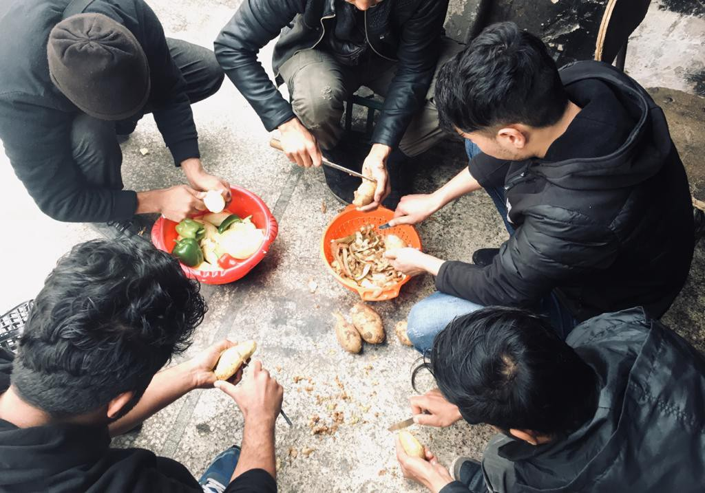

### AYS Daily Digest 19/12/2019: It’s “just a word” — the power of Language
#### New report analyses the situation for people on the move in Belgium//Salam Aldeen still imprisoned//New law in Sweden will penalise those who live in most socio\-economically “challenging” areas//

Photo Credit: No Name Kitchen

Pernille Vermund, the leader of the right\-wing “New Right” party in Denmark was first caught and the later proudly brandished her use of a racial slur on a a documentary aired on public television\. The term used was “P\*rker” which according to Wiktionary possibly came from the combination of the term for “Persian” and the term for “Turk” and is strongly racially discriminatory\. If the origin of this term is any indication, the explanation is fairly elementary — grouping all people from a wide area under a broad commonality which in the Western European Construct is “united in being Islamic” \(ignoring the diversity of cultural, religious, and political history of the region\) \. Ms\. Vermund “corrected” herself to a less loaded term yet, curiously or rather not so curiously, defended her original use of the term stating that she’s “not one to be politically correct” and dragging out the standby “they call themselves that\.”

It’s nearly 2020, and we still need to be having conversations on why a slur being reclaimed by members of the group has, in their own instances, liberatory connotations, yet is still discriminatory for people who are not a member of this oppressed group to use? I suppose we do\. The “well why can’t I say it, they use it themselves” defense has a long history of being brandished to deflect any attempt to hold a person to account for their language\.

Ms\. Vermund also stated,

**“Let’s call things what they are\. If you’re a negro, you’re a negro; if you’re a _p\*rker_ , you’re a _p\*rker_ , if you’re an immigrant, you’re an immigrant\.”**

Trying to shift blame or rather accountability for what is being IMPLIED by what is said into “well the mean mean PC police just want me to lie to you and I’m so tough that I am not going to cave” is truly a sophomoric and oft\-trotted out argument\. \(The Source also noted that the term used in Danish that is translated as “a negro” is ambiguous in Danish and can connote the n\-word in Danish as well\)

A better way to counteract this is to simply ask — why? Why are these distinctions relevant? This will likely lead to a tirade explaining that certain groups are committing crimes x, y, or z or are not integrating\. For more clarity, understand that the term for “immigrant” Ms\. Vermund used often specifically refers to people who were born or largely raised in Denmark, but who are of _foreign origin_ \. Again, the more crucial focus when encountering this conversation is to interrogate the person to reveal what their “no holds barred” language choice means\. The whole “PC not PC” discussion remains a fig leaf that is used to push the spotlight onto “mean freedom\-speech repressors” vs\. “brave and truthful truthtellers\.”

It is important to engage in these discussions as the entire rhetorical jig comprises so much of the xenophobia and anti\-solidarity action\. For example, Lauren Southern and the so called “alt\-right” and Identitarian movement which have close connections to most right\-leaning European political entities continue to frame search and rescue operators as “human smugglers\.” An attitude which was handily employed by Salvini’s government in order to crack down and attempt to legally persecute SAR operators\.

> However, these cases are being turned over slowly and steadily, for example Sea Watch 3’s case was just resolved by a court in Palermo, freeing them\! 

■■■■■■■■■■■■■■ 
> **[Sea-Watch International](https://twitter.com/seawatch_intl) @ Twitter Says:** 

> > 🔴🔴 #SeaWatch has won the appeal to the Civil Court of Palermo: #SeaWatch3 is free! 

After more than 5 months of blockade in the port of Licata, we are preparing to return at sea.

Justice triumphs over the (former) Security law. https://t.co/nSvuAeCfrQ 

> **Tweeted at [2019-12-19 14:13:05](https://twitter.com/seawatch_intl/status/1207665157360508928).** 

■■■■■■■■■■■■■■ 

Although the cases are often being thrown out, the extent to which empty, hateful rhetoric can throw up barriers \(taking precious time from life saving action\) and inform legal precedent over time is why we cannot back down on confronting these ideas wherever we are\.

For more on this case in Denmark, go [here](https://www.thelocal.dk/20191219/danish-party-leader-uses-ethnic-slur-in-tv-documentary) \.
#### No Name Kitchen calls for Medical Volunteers in Greece

> News from Patras, Greece / call for medical volunteers\! 

> The situation here is becoming increasingly precarious\. The number of people in transit in Patras keeps growing due to enhanced police control and violence in and around the port\. As a consequence, entering ships that are going to Italy becomes extremely difficult and dangerous, and people’s chances to apply for asylum and seek a safe future diminish\. A lot of people trying to enter the port area get beaten up severely by not only police, but also port security\. 

> More injuries arise from the attempt to climb the security walls surrounding the port\. Many people hurt their hands or break their bones when falling down from them\. Because of that, we currently have a lot of severe medical cases here in Patras\. 
 

>  Every single day we need to bring five boys living in an abandoned factory to the hospital to cure their injuries as we are lacking medical staff\. 

> This is why at the moment, we are in desperate need of volunteers with a medical background\! So if you have some time to spare in the upcoming weeks, please consider supporting NNK in Patras\! 

> If you want to help, you can send an email to info@nonamekitchen\.org 

#### [Three boats have reached Lesvos](https://www.facebook.com/AegeanBoatReport/photos/a.285312485325196/725454621310978/?type=1&theater) today, carrying a total of 93 people\.
#### GERMANY

When asked if Germany should accept the more than 5000 unaccompanied minors on Greek Islands, Chancellor Merkel is now evasive and jumping around the question, citing that Germany is not the only one that is responsible and discussing how there is work being done in Bosnia\. See for yourself, in German [here](https://www.facebook.com/watch/?v=453013985627043) \.
#### BELGIUM

A [recently published report](https://refugee-rights.eu/wp-content/uploads/2019/12/Belgium-2019-v3-web.pdf?fbclid=IwAR3E3XDGINMuULK_IhAOaj0JV9T7UdXC_WZgBqKC9zMzmo2NrplZua3Xg4M) by Refugees Rights Europe shines a light on the abuses and human rights violations faced by refugees and people on the move in the country\. In Brussels, around 1\.000–1\.200 people were estimated to live in temporary shelters, parks and camps in mid 2019\.

The document highlights inadequate living conditions and a constant lack of food for those in the city, who rely heavily on the presence of grassroots NGOs to be guaranteed a meal a day\. Lack of accommodation and legal/medical support to those who want to lodge their application in the country, as well as the consequences on the physical and mental health of displaced persons, are as well presented as crucial points in the report\.

> There are also alarming reports that incorrect information has been circulated that seems to be designed to deter people from claiming asylum in Belgium\. Any information that is made available will not necessarily be presented in an accessible language or format, rendering it useless to many of the people who need it\. Interpreting services when provided have been wholly inadequate in many reported cases of individuals attending interviews in connection with their asylum claims\. 

Additionally, illegal refoulements and forced returns are occurring on a regular basis\. Minors do not enjoy better conditions, unfortunately, as reportedly they have to undergo unclear age assessment procedures and could face detention without having their age checked at all\.

> There are reports of beatings taking place in public areas as well as at the police station following arrest\. Inhumane treatment has also been recorded, including the use of aggressive tactics in removing people from their sleeping spaces and confiscating personal possessions\. 

> Arbitrary arrests, the injection of sedative drugs without consent and excessive physical force employed during forced removals have all been reported\. 

Read the entire report for more details and first hand testimonies collected from unaccompanied minors forced to face such a discriminatory system\.
#### SWEDEN

Starting from July 2020, [new regulations](https://www.dagensjuridik.se/nyheter/nya-regler-asylsokande-far-inte-bosatta-sig-i-utsatta-omraden/?fbclid=IwAR1-4vR5foD8AOcZ-GdKHQdDiyUKFu6jrjhE5gDaOmn5LVy3zQ3wfk2r070) will come into force concerning the asylum seekers who would want to arrange their own accommodation\. In fact, the asylum seekers who reside in a socio\-economically vulnerable area risk losing their daily allowance, as the Swedish Migration Committee’s goal is to “motivate” people to choose and live in areas where “there are conditions for a socially sustainable reception”\.

Swedish authorities will have to define which areas are considered no\-go areas for applicants, as too poor, and in that they will be helped by local municipalities which will inform State authorities about the more “challenging” areas in their territory, specific streets or postal codes for example\.

The Migration Committee will then publish a list of the areas that are “available” to anyone who plans to arrange their own accommodation\.

Currently, around 17\.000 asylum seekers live in State financed residences around the country, while 22\.500 asylum seekers have chosen to arrange their own accommodation\.

Anyone who already lives in an area that is considered “challenging”, as of 1 July 2020, will not be affected by the change in the law\.

**Find daily updates and special reports on our [Medium page](https://medium.com/are-you-syrious) \.**

**If you wish to contribute, either by writing a report or a story, or by joining the info gathering team, please let us know\.**

**We strive to echo correct news from the ground through collaboration and fairness\. Every effort has been made to credit organizations and individuals with regard to the supply of information, video, and photo material \(in cases where the source wanted to be accredited\) \. Please notify us regarding corrections\.**

**If there’s anything you want to share or comment, contact us through Facebook, Twitter or write to: areyousyrious@gmail\.com\.**

_Converted [Medium Post](https://medium.com/are-you-syrious/ays-daily-digest-19-12-2019-its-just-a-word-the-power-of-language-af7eb22a9aca) by [ZMediumToMarkdown](https://github.com/ZhgChgLi/ZMediumToMarkdown)._
