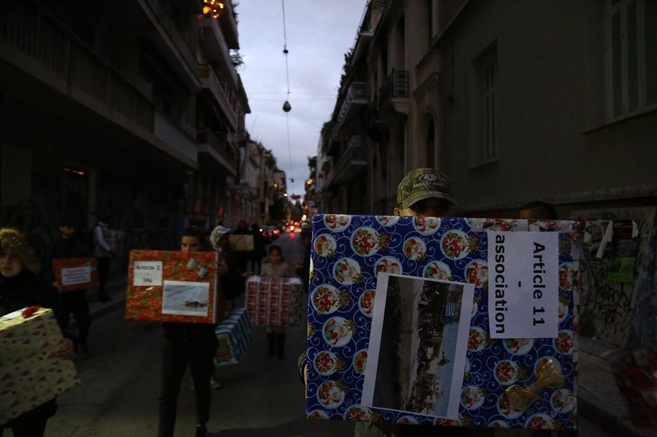

### AYS Daily Digest 25/12/2019: Athens refugee squat reminds Europe of European values

22 people rescued off Gran Canaria /// People forced to sleep rough around Calais while winter shelters remain closed …

 \)](assets/d74d3482d881/1*ov_7upTmJNjUxY_9Zqf2wQ.jpeg)

\(Artwork by [Marian Kamensky](https://www.facebook.com/humorkamensky/photos/a.390878934331468/2620280751391264/?type=1&theater) \)
#### Feature story — Athens’ refugee squat reminds Europe of European values

 \)](assets/d74d3482d881/1*YXqjBuRzR5wrEoZDDxW_pA.jpeg)

Syntagma Square, Athens \(photo by [Notara26](https://www.facebook.com/permalink.php?story_fbid=1601197050020235&id=645186555621294&hc_location=ufi) \)

> “We are not three and we are not kings and we didn’t come to iconize a new born person\. We are thousands, we refuse kingdoms and idols, and we are craving for a society with respect and equal rights for everybody\. Even if we are coming from same regions than the mythological three guys 2019 years ago, the reasons for our journeys are totally different\. We escaped wars, authoritarian dictatorships, torture, ethnic or gender\-based discrimination and famine\. We came here in order to find worth living conditions\. \( [NOTARA26](https://www.facebook.com/permalink.php?story_fbid=1601197050020235&id=645186555621294&hc_location=ufi) \) 

On the afternoon of the 24th of December, the community of the refugee housing squat Notara26 [marched](https://www.facebook.com/permalink.php?story_fbid=1601197050020235&id=645186555621294&hc_location=ufi) together towards the christmas tree in Syntagma square, in the centre of Athens, in order to bring back the European values to the European people\.

18 big parcels were left under the tree representing the 18 articles of the European convention of human rights, to remind Europe of what has been written on paper\. In contrast, pictures showing how these ‘rights’ work out in reality were used to decorate the tree\.

 \)](assets/d74d3482d881/1*NWzXZdiuryzU4DXzx39oqg.jpeg)

Notara26 protest in Syntagma square, Athens \(photos by [Notara26](https://www.facebook.com/permalink.php?story_fbid=1601197050020235&id=645186555621294&hc_location=ufi) \)

> Even if we know that most of the tragedies in our homelands were starting and being controlled from the western world and Europe, we hoped that when we finally arrive in these ‘holy lands’ here we would be treated as human beings\. But the institutions supposedly created to protect ‘human rights’ are the worst\. The European Union, Frontex and the nations states already imprison us in the Maghreb states through the agreements they have signed, tolerate our slavery in Turkey and Libya, let us drown or even drown us in the Mediterranean sea, push us back without any legal frame, put us in concentration camps, isolating us socially as well as psychologically\. Plus, some politicians scapegoating us which stirs up hatred and racist violence\. \( [NOTARA26](https://www.facebook.com/permalink.php?story_fbid=1601197050020235&id=645186555621294&hc_location=ufi) \) 

On the same day, Germany’s interior minister proved once more that European politicians honour human rights only as long as they remain written on paper\. German media [report](https://www.dw.com/en/brussels-calls-on-germany-to-take-children-from-greek-migrant-camps/a-51786883?fbclid=IwAR1gCInktuOAEKoQMeAzXJkdBI-E8tjn4TAFpaEI5FtkZMbv4tMlQcMM2g0) that minister Seehofer rejected the EU commission call to take unaccompanied children from Greek camps, where they live in squalid and unsafe conditions\.

■■■■■■■■■■■■■■ 
> **[RSA](https://twitter.com/rspaegean) @ Twitter Says:** 

> > Christmas in mud and rain for hundreds of #refugeesgr in #Moria hotspot and the other hotspots in Greece #opentheislands #stopthetoxicdeal   [stonisi.gr/post/5925/kalw…](https://www.stonisi.gr/post/5925/kalws-hrthate-sth-moria-pics#.XgMKniDv1Bo.facebook) 

> **Tweeted at [2019-12-25 23:28:05](https://twitter.com/rspaegean/status/1209979155208704002).** 

■■■■■■■■■■■■■■ 

As of November 2019, 5,276 children were registered in Greece, only a small number of them are accommodated in minors’ shelters\.

SEA

Local media [report](https://twitter.com/EFE_Canarias/status/1209901390740566017?fbclid=IwAR26f-4T95E3TeKPL2Y3bUUw0qvt35z4pujGtZvnLmuciyBDumUO4UHuYnk) that on Wednesday morning 22 people were rescued off the island of Gran Canaria\.

Also, today both the [Alan Kurdi](https://twitter.com/seaeyeorg/status/1209769205039542272) and [Ocean Viking](https://twitter.com/SOSMedIntl/status/1209892897929269248) have sailed back to the Central Med\.

GREECE
#### Notara26 residents’ symbolic protest in Syntagma square, Athens

From the statement of Notara26 squat:

> In their statement the European states claim to honor these values, but the people are wondering where to find them\. 

> They left their gifts under the Christmas tree and left hoping that at some point we, “humans” will be able to find again our lost values and principles, so to become Humans again\. 

FRANCE
#### Prefect of Calais refuses to answer to calls for opening winter shelters

 \)](assets/d74d3482d881/1*5BJZasVdbh7i_TEjMJpPAQ.jpeg)

The Wall of Shame \(photo by [L’auberge des migrants](https://www.facebook.com/AubergeMigrants/photos/pcb.10157465230820339/10157465226290339/?type=3&theater) \)

The Auberge des Migrants [reported](https://www.facebook.com/AubergeMigrants/photos/a.10152514841565339/10157463765325339/?type=3&eid=ARDU2xQODPDBA0uXZ7gYzexj0kP6LtaOgb8mKE4dWyLPvrnN6xZf0w7ho8epMW68BQeFDbKgnri5FvsB&ifg=1) that two buildings, which have been selected to be used as winter shelters, are now ready in Calais, with a capacity of 115 beds\. Nonetheless, the prefect of the city is refusing to answer associations’ calls to open such shelters\. People are forced to seek shelter in the woods around the town in makeshift encampments made of donated tents and canvas to protect from rain, that are constantly destroyed by the police\.

 \)](assets/d74d3482d881/1*cgi9VoZWFq9TjJO_7OMzaA.jpeg)

Calais \(photo by [L’auberge des migrants](https://www.facebook.com/AubergeMigrants/photos/pcb.10157465230820339/10157465226290339/?type=3&theater) \)

While the only real and long term solution is demanding unconditional accommodation for the homeless, L’Auberge is supporting people on the move with donations of tents and canvas\. Help them [HERE](https://www.facebook.com/AubergeMigrants) if you can\.

**Find daily updates and special reports on our [Medium page](https://medium.com/are-you-syrious) \.**

**If you wish to contribute, either by writing a report or a story, or by joining the info gathering team, please let us know\.**

**We strive to echo correct news from the ground through collaboration and fairness\. Every effort has been made to credit organizations and individuals with regard to the supply of information, video, and photo material \(in cases where the source wanted to be accredited\) \. Please notify us regarding corrections\.**

**If there’s anything you want to share or comment, contact us through Facebook, Twitter or write to: areyousyrious@gmail\.com\.**

_Converted [Medium Post](https://medium.com/are-you-syrious/ays-daily-digest-25-12-2019-athens-refugee-squat-reminds-europe-of-european-values-d74d3482d881) by [ZMediumToMarkdown](https://github.com/ZhgChgLi/ZMediumToMarkdown)._
