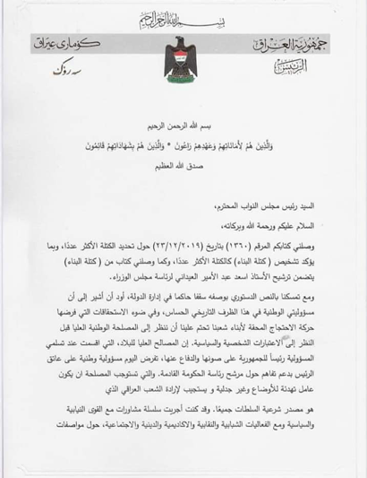
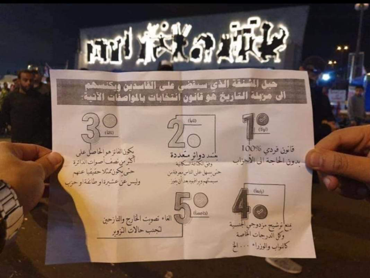
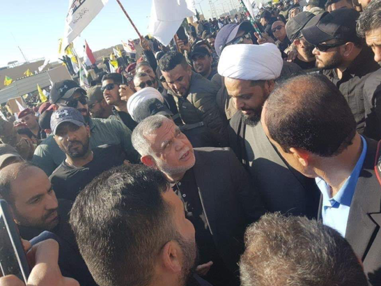
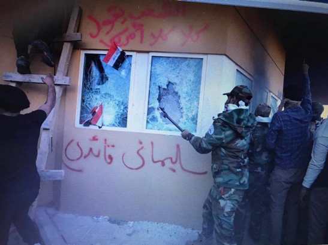

### AYS Special: Updates from Baghdad \(4\)
#### Main events concerning the uprisings for the week 23rd\-31st December

Part of Saleh’s document to Parliament, which states the formal apology for nominating Al\-Aidani and put the option to resign in the hands of Parliament\. Re\-post from local activists\.
#### Adoption of a new election law\. The third party \(those with authority in government and militias\) threatens the President of the Republic and burns parts of the American embassy\.

On December 24th, the Iraqi parliament held a session to propose and vote a new electoral law — a law that did not mirror and represent the demands and needs of the protestors\. The law approved by the Parliament does not take into consideration the demands of the public:
- in the previous legislation, the winner was the one with the highest percentage of votes, be it 20% or less\. This means that a party or group can easily win at the expense of 80% of the electorate who did not vote for it\. The people of Iraq demand a radical change, meaning that the winner would be the one who receives 50 \+ 1 of the total percentage of votes;
- the second point that demonstrators demand to change regards the distribution of electoral districts based on population density, therefore protestors demand to adopt a population ratio \(100\.000 people = 1 district\) instead of an administrative division\.

**An additional request by the people on the streets concerns the abolition of the military vote, the vote of displaced people and the adoption of a civil vote allowance for their constituency\.** The reason being that, since 2010, every election witnessed the rigging of all votes of the members of the military forces, of internally displaced persons and of refugees outside Iraq\. This demand was also completely ignored by the Iraqi parliament\. **Moreover, the demonstrators called for an additional change in the law to prevent dual nationals from running as candidates: they must first give up their non\-Iraqi citizenship and then run\.** This point was also ignored by the Parliament\.

A protester in front of the liberation monument holds a paper with the five paragraphs/demands for the election law; most of them were not approved by Parliament\. Credit: local activists\.

> After his rejection by the Iraqi uprising street, [Qusay Al\-Suhail apologizes to the largest bloc “Al\-Binaa” for his candidacy](https://www.facebook.com/solidarityinitiative.icssi/posts/2811613358899244) for the post of prime minister, and Al\-Binaa, in turn, nominates Basra Governor Asaad Al\-Eidani\. While Al\-Tahrir demonstrators hang a picture of Asaad Al\-Eidani on Uhud Mount confirming their rejection of his candidacy\. 

On December 26th, President Saleh places his resignation in the hands of Parliament, in solidarity with protestors, saying that “he is ready to resign instead of accepting a candidate against the will of protesters” \(see cover image\) \.

Parliamentary blocs drafted a statement refusing to accept the resignation\.
#### The past week witnessed great security tensions\. Kidnappings, assassinations and threats persist among activists taking part to demonstrations\.

An attack by a Shiite group over a church in an attempt to destroy it is an example of the extremely tensed atmosphere, despite the great solidarity shown by Christians \(who cancelled their celebrations\) in and outside of Iraq with the families of the martyrs of the October uprisings\. The attacker was first arrested and released, but he tried to commit the same action again\. He was arrested for the second time and since then no more details are available\.

On December 28th, an American contractor was killed and another one was wounded in a missile attack on the K1 base in Kirkuk\.

**Leaked files proved that Hezbollah carried out an [armed attack on the demonstrators in Al\-Khilani Square](https://www.hrw.org/news/2019/12/16/iraq-state-appears-complicit-massacre-protesters) on December 6th, in which dozens were killed and injured\.**
#### In the evening of December 29th, US air strikes hit the headquarters of the Hezbollah Brigades in Iraq and Syria\.

The 45th Brigade of the Popular Mobilization in al\-Qaim city was subjected to missile bombing, a brigade that includes more than 22 armed factions loyal to Iran\. As a result of the attack, a commander of the Brigade was killed, together with other 25 people; 50 civilans were injured by the bombing\.

Religious leader Abu Ali, known for his loyalty to the Iranian leader Khamenei, was posting on his Facebook page opinions against the protesters and considered them “Jokers” and agents of America and Saudi Arabia\. \(The Joker is a term coined by those holding power to describe demonstrators, meaning they are Americans\) \.

#### In the morning of December 31st, a group of protestors holding the Hezbollah flags and led by Qais Khazali, leader of the Asaib Ahl al\-Haq militia, head towards Al\-Khadra \(Green Zone\) from the side of the Suspension Bridge, which is usually not a common area for protests, stormed in the area, attacked the American embassy, destroyed and set fire to ​​the main gate and its outer wall\. The protesters carried pictures of Khamenei and wrote the words \(Soleimani our leader\) on the walls of the embassy\.

Credit: re\-post from local activists\.

As a result, according to Reuters sources, the ambassador and the Embassy staff were evacuated after the attack\.

Armed forces were deployed to protect the Embassy and disperse the crowd\.

Trump stated that Iran is coordinating an attack on the Embassy and that Iraqi forces were expected to protect the American premises\.

Qais Khazali stated that “the American embassy is the place representing the support to the American Joker and from there decisions are taken and managed”\.

Demonstrators of Al\-Tahrir Square were faced with repression, deliberate attacks and death when they tried to protest inside Al\-Khadra in October, resulting in the death of 30 people and more than 1,000 people wounded\.
#### Full daily summaries by ICSSI Solidarity Initiative can be found at [this link](https://www.facebook.com/solidarityinitiative.icssi) \.

**Author: Local activists based in Baghdad\.**

**Find daily updates and special reports on our [Medium page](https://medium.com/are-you-syrious) \.**

**If you wish to contribute, either by writing a report or a story, or by joining the info gathering team, please let us know\.**

**We strive to echo correct news from the ground through collaboration and fairness\. Every effort has been made to credit organizations and individuals with regard to the supply of information, video, and photo material \(in cases where the source wanted to be accredited\) \. Please notify us regarding corrections\.**

**If there’s anything you want to share or comment, contact us through Facebook, Twitter or write to: areyousyrious@gmail\.com\.**

_Converted [Medium Post](https://medium.com/are-you-syrious/ays-special-updates-from-baghdad-4-93342eb4345b) by [ZMediumToMarkdown](https://github.com/ZhgChgLi/ZMediumToMarkdown)._
