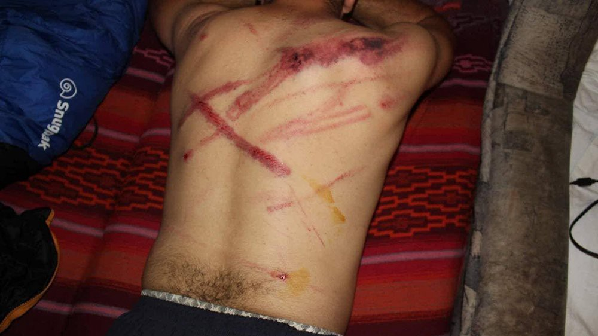
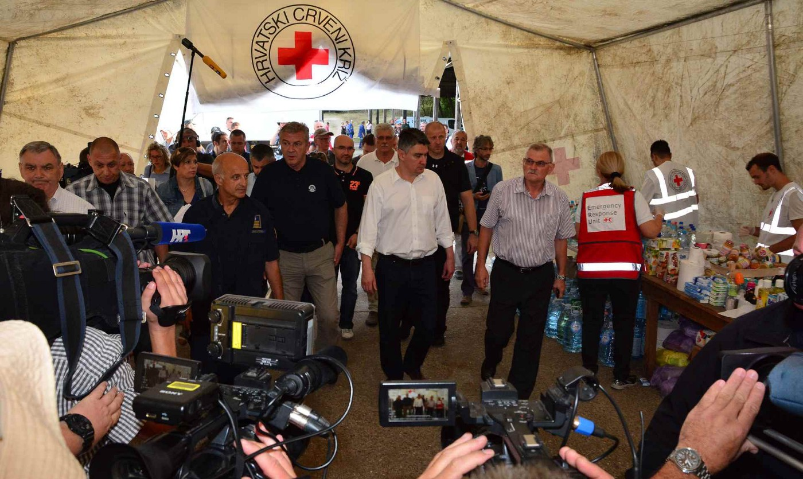
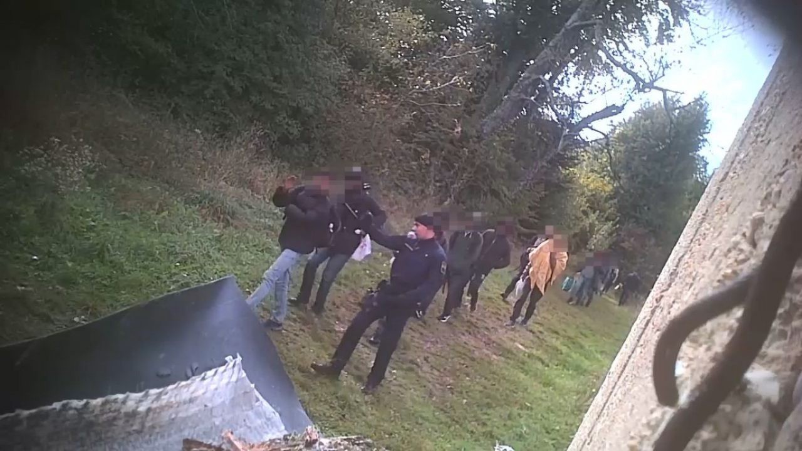
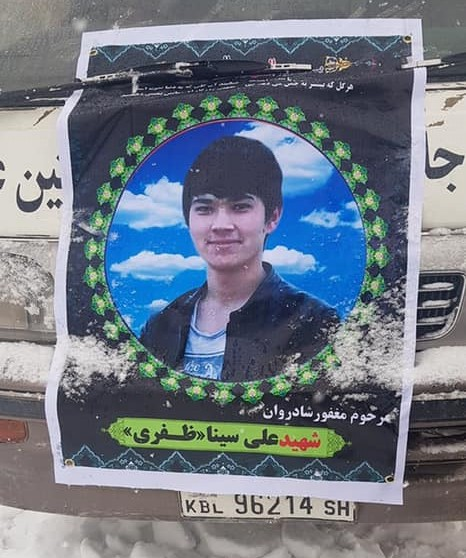

### AYS Daily Digest 6/1/20: Can Croatia’s new president help refugees?
#### Young men who’ve been deported back from EU countries face street violence in Kabul / Tragedy in Moria: a 31\-year old man found hanged in the removal center / 50 women intimidated and humiliated in Petrou Ralli detention center in Attica / Research: Turkish media violate privacy and reinforce negative stereotypes about refugees / A dramatic decrease in successful crossings of the central Mediterranean / Footage shows violence against refugees in an IOM\-ran Bira camp / Spanish government tries to cover up a pushback / Denmark introduces a new deadline for family reunification of children

A victim of Croatian border violence\. Photo: Border Violence Monitoring
#### Feature
### Zoran Milanović kept the border open in 2015\. Can he do anything to stop the violence now?

Following a five\-year presidential term of the conservative Kolinda Grabar Kitarović, Croatia elected a new president, social democrat Zoran Milanović\. Milanović was Croatian prime minister in 2015, when the refugee route shifted from Hungary towards Croatia\. His government kept a “fast forward” policy, allowing thousands of people to enter the country on daily basis\. They were put on trains at the border with Serbia and taken to Slovenia, strategically discouraging their longer stay on Croatian soil to avoid “becoming a hot spot”\. In this period, Zoran Milanović’s government kept insisting on having a safe humanitarian corridor from Greece through ex\-Yugoslavian countries towards Germany\. They seldomly added anyone’s fingerprints to Eurodac, in order to prevent future Dublin returns to Croatia\.

Then Prime Minister Zoran Milanović visiting a transit centre in Croatia, 2015\.

> According to official data, 558,724 people passed through Croatia in late 2015\. In January 2016, new conservative government came to power and they almost immediately started reducing the number of people who were allowed to pass, by introducing more and more racial profiling and in the end completely closing the route in March 2016, following the agreement with Austrian and Slovenian governments\. By then, **658,068 passed legally through Croatia** \. Humanitarian corridor was replaced by systematic border violence that remains a burning issue: **over 20\.000 illegal pushbacks happened in 2019\. alone, with over 90 victims claiming they were beaten and/or robbed** by Croatian police officers\. Over a third of them were children or minors\. 

### In 2020, the narrative is changing again

Croatian president Kolinda Grabar Kitarović was a member of the same conservative party that closed Croatian borders in 2016\. She built her reputation as a trigger\-happy ex\-NATO official who spread misinformation and prejudice against refugees while defending Croatian border violence\. In an interview for a Swiss TV, she even admitted violations of human rights in Croatia\. “Of course a little bit of violence is needed when doing a pushback”, she [famously said](https://www.hrw.org/news/2019/07/15/croatia-president-admits-unlawful-migrant-pushbacks) \. Therefore it is not surprising border management was one of the key issues in the recent presidential campaign\.

In the campaign, Zoran Milanović insisted that keeping the border open was a good decision, but not for humanitarian reasons\.

> “Angela Merkel wanted us to keep 100\.000 people in Croatia”, he claimed several times in the past weeks\. 

Presidential duties in Croatia are largely representative, while most of decision\-making is in the hands of the center\-right PM Andrej Plenković\. When he assumes presidential office, Zoran Milanović will become commander in\-chief of the military and chief representative of the Republic of Croatia both within the country and abroad\. Having in mind he is an experienced diplomat, he may try to negotiate a new migration deal with European counterparts\. Milanović already announced he intends to cooperate with the current government, but the PM said it will be a “hard cohabitation”\.

Illegal pushbacks are happening daily at Croatian borders\. Photo: BVM

It is extremely hard to believe the new president might stop the border violence, but if he remains dedicated to safeguarding human rights, a topic that had a big role in his campaign, he might work towards de\-escalating the toxic public narrative against the refugees\. As an NGO officially registered in Croatia, AYS will continue working towards having the governmental officials accountable for human rights violations at the border\. We hope the new president might become a pragmatic counterpart in this conversation\.
#### Afghanistan
### Young men who’ve been deported back from EU countries face street violence in Kabul

According to [Abdul Ghafoor](https://www.facebook.com/abdul.ghafoor.378?__tn__=%2CdC-R-R&eid=ARC8QKlojWPezaWTuXfb189zDF2Tb6tL85DhUbh1QCXI_oJBH0R3svialuUblDRJRuq_qC900NRxaryK&hc_ref=ARRPkRu0dV9-qAvZza7deP2cJEz-3XWMS-gTc4TAabXv3Fo1sbYgPWTAj4p3w3bqdwo&fref=nf) from the [Afghanistan Migrants Advice & Support Org](https://www.facebook.com/AmasoAfg/?eid=ARDmdPa5bqPqaxj-i5_ApVO2zjQKjC7YmCteY_3HZY6pOyYiKF8YOQrn11R4tZUVq8llMj4pEzYYqsdg&timeline_context_item_type=intro_card_work&timeline_context_item_source=636337972&fref=tag) , several people have have been killed and injured on the streets of Kabul in 70 different incidents around the city in the past 15 days\. One of the latest victims of such crime was a 22\-year old American University Student, Ali Sina Zafari\. He was stopped on the way home, his laptop, smart phone and cash was snatched by the robbers and he was stabbed several times after he resisted the robbers\.

Street crimes has become one of the biggest challenges along with the fear of explosions and suicide attacks in Kabul\. Police have failed to provide protection to the citizens and are often helping the robbers carry out their operations\. Even if they are caught, they are released the following day because of the non\-existence of a law to follow up such crimes, Ghafoor says\.

A student was killed after he tried to resist robbery in Kabul\. Photo: Afghanistan Migrants Advice & Support Org
#### Turkey
### Research: Media violate privacy and reinforce negative stereotypes about refugees

The Media and Refugee Rights Association released its fourth report on the media representation of refugees in Turkey\. They report that between December 28th and January 3rd, **641 news reports** were found to have language and/or pictures that violated the rights of refugees\.

_“The analyzed news reports contained hate speech, hostile expressions, unconfirmed false information, criminalizing discourse towards refugees and false, while it was also seen that facts about refugees were distorted or exaggerated…\.Photographs that clearly show faces of refugee children were also published in the media, without their security being taken into consideration, the report stressed\.”_ [More here](https://bianet.org/5/195/218167-report-media-blames-syrian-refugees-for-citizens-who-cannot-receive-healthcare?fbclid=IwAR30fFm9XmmZINTjgPIa22tFeNkDc_tAgMJQRY4hyDEHZ4VKjn_wazcC8Ss) \.
#### Sea
### A dramatic decrease in successful crossings of the central Mediterranean

In their last biweekly report published on 2/1/2020, [AlarmPhone](https://alarmphone.org/en/2020/01/05/central-mediterranean-regional-analysis/?post_type_release_type=post) states:

> “In 2019, fewer than 15,000 people succeeded in crossing the central Mediterranean Sea\. Merely around 11,500 people reached Italy by boat, and about 3,300 Malta, mostly fleeing from Libya or Tunisia\. These figures highlight a dramatic decrease — from 181,436 arrivals in 2016, 119,369 in 2017, and 23,370 in 2018\. This decrease reflects not a diminishing need to escape but instead the growing ability of Europe and its African allies to close down migration routes and to violently prevent departures or capture those at sea and force them back to North African coasts\.” 

#### Greece
### Tragedy in Moria: a 31\-year old man found hanged in the removal center

A 31\-year\-old asylum seeker from Iran was found hanged in the pre\-removal detention centre at the reception & identification centre in Moria on Lesvos\. 85 people are held in the camp’s pre\-removal centre\.
### 50 women intimidated and humiliated in Petrou Ralli detention center in Attica

](assets/8fee1862ad4d/1*ppglibcNoCOXkIkwoHejIA.jpeg)

“Notary women themselves having experienced uprooting, persecution, and oppression until they came here to shout out the idea of ​​emancipation, expressed their sympathy for the refugees and migrant women held in Peter Ralli’s abyss\.” Photo by [Maria Louka](https://twitter.com/maria_louka/status/1214120846635229184?fbclid=IwAR2q6CwNbY0wVeRn44u-qhFtOrHtlIFlbJ_1U1G-LGibUri10YFVvEPWmB0)

In the announcement of the initiative “ [Women’s House for Empowerment & Empowerment](https://www.efsyn.gr/ellada/dikaiomata/225643_frikiastikes-martyries-gynaikon-apo-tin-petroy-ralli) ” and the letter from prisoners, the group discusses their last visit to Petrou Ralli detention center on December 19th:

> “Once again the number of prisoners had increased to 50 women from 15 different countries… In our attempt to speak with them, some police officers were so close that they prevented women from freely expressing themselves about the situations they are experiencing\. The behavior of some police officers was also provocative towards us\. 

> A typical testimony: “We were forbidden to wear our headscarves and they said, ‘Out of here you can be Muslims, here NO\! Here you are Christians … ” 

> Another testimony: “When Georgia came out of Albania two or three times out of the shower, the blue\-eyed policeman who always watched us through the small entrance window shouted: ‘Throw down your towel\. I want to see your body\.’” 

Sexual harassment on the pretext of food distribution, abuses, beatings and assaults are reported by women living in detention\.
#### Bosnia
### Footage shows consequences of violence against refugees in an IOM\-ran Bira camp

For a long time, migrants have been raising alarms against private security guards in IOM\-ran camps Bira and Miral in Una Sana Canton, Northern Bosnia and Herzegovina\. AYS has been reporting about it several times, despite strong objections of the IOM officials\. Today, a new footage was released by a man covered in blood, who claims guards of the Bira camp beat him up\. On several occasions, AYS volunteers have witnessed increased tensions between guards in Bira and people who try to enter the overcrowded camp, which is officially not accepting new residents\.

#### Spain
### Government tries to cover up a pushback

The Spanish NGO Caminando Fronteras accused Spanish authorities in a statement that on Friday they illegally returned 42 people to Morocco from the Spanish Chafarinas islands\. They allegedly returned the 42 people just hours after they landed\. The government says that while they did return spme 40 people on that day; they were rescued at sea and never set foot on the islands\.

There is photographic evidence, however, from Helena Maleno, a member of Caminando Fronteras, of a man shivering under plastic, trying to protect himself from the wind after landing\. More [here](https://www.infomigrants.net/en/post/21912/spanish-ngos-accuse-spain-of-illegal-migrant-push-back?fbclid=IwAR14soMLj285zopxYcBeQzl4wCItRImbSCMZPnk7mJaYVkHrADXBzyXe044) \.

](assets/8fee1862ad4d/1*Kegdc4KhNprbZdN3VKxfuQ.jpeg)

Photo by [Helena Maleno Garzón](https://twitter.com/HelenaMaleno/status/1213118183865044992/photo/1?ref_src=twsrc%5Etfw%7Ctwcamp%5Etweetembed%7Ctwterm%5E1213118183865044992&ref_url=https%3A%2F%2Fwww.infomigrants.net%2Fen%2Fpost%2F21912%2Fspanish-ngos-accuse-spain-of-illegal-migrant-push-back)
#### Denmark
### New deadline for family reunification

Parliament passed a new law on the first of January which abolished an unnecessary integration rule which targeted school aged children, but unhelpfully also enacted a new deadline for family reunification, addressing cases of children who are still outside Denmark\. Michala Clante Bendixen from Refugees DK says:

> “There will now be **a time limit of 3 months** to send in an application, counting from the day when the parent living in Denmark gets a residence permit or the from the day the child is born \(…\) Parents normally wish to be with their children, and if they don’t apply immediately, there are usually good reasons for it \(…\) Many refugees will not get the information about the deadline before it’s too late\. That information will drown in the sea of new information, and the newly arrived do not understand Danish yet” 

There is no practicable reason for the law, other than to confuse newly arrived refugees and immigrants\. Read more [here](http://refugees.dk/en/news/2020/january/new-deadline-for-family-reunification-with-children-is-unfounded/?fbclid=IwAR1xBHW-tPcOHBQPZCYDZfM7Eoqp3QlebzY7zHUuHUIyEjfGlZZOrBoSe0c) \.

**Find daily updates and special reports on our [Medium page](https://medium.com/are-you-syrious) \.**

**If you wish to contribute, either by writing a report or a story, or by joining the info gathering team, please let us know\.**

**We strive to echo correct news from the ground through collaboration and fairness\. Every effort has been made to credit organizations and individuals with regard to the supply of information, video, and photo material \(in cases where the source wanted to be accredited\) \. Please notify us regarding corrections\.**

**If there’s anything you want to share or comment, contact us through Facebook, Twitter or write to: areyousyrious@gmail\.com**

_Converted [Medium Post](https://medium.com/are-you-syrious/ays-daily-digest-6-1-20-can-croatias-new-president-help-refugees-8fee1862ad4d) by [ZMediumToMarkdown](https://github.com/ZhgChgLi/ZMediumToMarkdown)._
