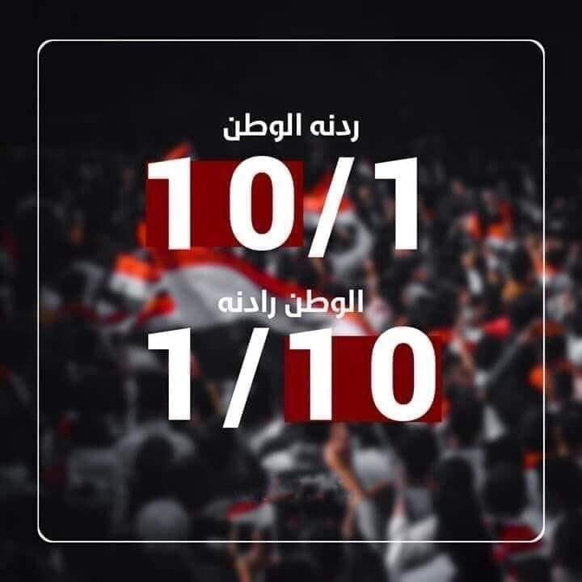
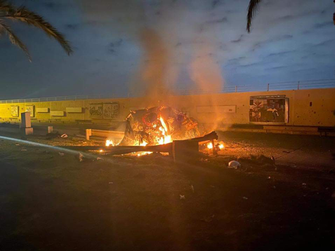
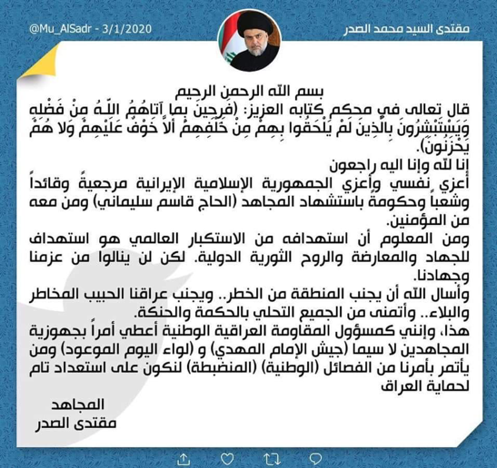
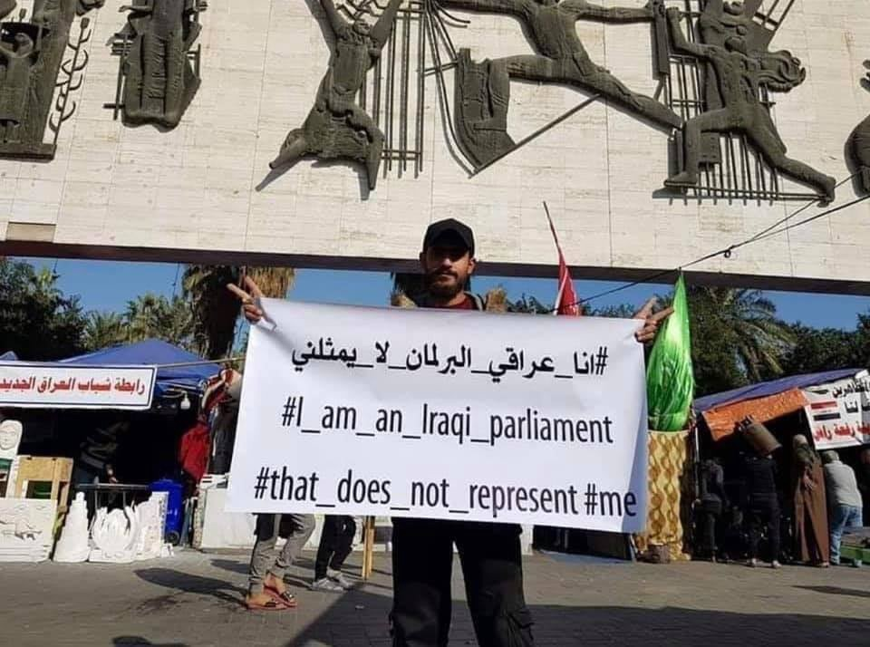

### AYS Special: Updates from Baghdad \(5\)
#### Main events concerning the uprisings for the week 1st–7th January\.

“1/1 our response is homeland and 10/1 the homeland wants us”\. Credit: Ali Dab Dab\.
#### The killing of Soleimani is a new turn that revealed a lot about the true face of the Iraqi government and created tension and division in the region\. It has become the greatest threat to the ongoing Iraq uprising and has prevented its goals from being achieved\.

A car burning after the missile strike that killed Soleimani\. Re\-post from local activists\.

At 1 am Baghdad time on January 3\. Baghdad International Airport sirens went off as a result of missiles falling on one of its subsidiary roads\. Two hours later, the government media announced the killing of General Qassem Soleimani, the husband of his daughter, Hajj Samer Abdullah, and the deputy head of the Popular Mobilization Forces \(PMF\), Abu Mahdi Al\-Muhandis\. The Green Zone in Baghdad was heavily monitored by American helicopters flying over the area\. Three hours after the attack, a US official stated that American intervention targeted two strategic points closely linked to Iran\. The Iranian Revolutionary Guard confirmed the killing of its leader, Soleimani, while Trump published the image of the American flag all over his Twitter account\.

Since the first unconfirmed news of Soleimani’s death, the Iraqi people have been celebrating on social media platforms and in Tahrir Square, while maintaining a clear stand against a conflict that will see US and Iran fighting in Iraqi soil\.

Qais Khazali, founder of the AAH, now part of the Popular Mobilization Forces, and Hadi Al\-Amri, head of the Badr Organization, military wing of the Supreme Islamic Iraqi Council, were under the threat of arrest by American forces, given that they represent Soleimani’s puppets in the country, together with Abu Mahdi Al\-Muhandis, the killed leader of the PMF\. It is important to remember that Abu Mahdi, Qais Khazali, Hadi Al\-Amri and Al\-Fayadh participated together and [led protests in front of the American embassy](ays-special-updates-from-baghdad-4-93342eb4345b) , ​​which later turned into an attack on the embassy itself\.

Iraqis felt liberated by the Iranian domination to a certain extent, celebrating the death of Soleimani\. However, Sadrist Movement’s and militias’ leader Muqtada al\-Sadr, stated his loyalty to Soleimani as a figure of leadership and power\. In his statement, he referred to him as “martyr” \(“shahid”\) \.

The statement of Muqtada al\-Sadr\.

**In his statement, he also highlighted how his militias were ready to start a jihad against the Americans\.**

Despite [the great calls from the squares](https://www.iraqicivilsociety.org/archives/11214?fbclid=IwAR2qqCixs7PzrsgqQWqrsCjaclEZQukzOU6oYKTIRjLuj7bq1qPRmGJlMMo) , over a week, not to drag Iraq into a conflict between America and Iran, al\-Sadr is the first leader to call for the formation of a unified faction and to push to enter this conflict without considering the desire of the people looking for change, freedom and stability\. This statement created major divisions and fear among political leaders and the great instability generated by this environment resulted in demands to remove the American presence from Iraq\. These demands were presented by Qais Khazali, Al\-Sadr, and other members of Parliament that have major interests in the matter\.

#### January 4th\.

[Two rockets landed on Balad Air Force Base](https://www.reuters.com/article/us-iraq-security-military/multiple-rockets-fall-in-green-zone-baghdad-air-base-iraqi-military-idUSKBN1Z30JP) , leaving no casualty\. At the same time, a missile was dropped in the proximity of the US embassy in Baghdad and another one in the Jadriya area adjacent to the Green Zone, which resulted in the destruction of a house and the injury of 5 civilians\.

President Trump stated that US had identified 52 Iranian sites that could be targeted if Iran launched an attack\.

**The Iraqi parliament held its session in the presence of the resigned Prime Minister and the absence of Kurds and Sunnis from the sessions\. They proposed a law to cancel Iraqi\-American security agreement and to end the presence of US forces in Iraq\.** Subsequently, experts and independent government officials stated that this pronouncement to vote to cancel the security agreement was a complete mistake, as it included actions and policies to fight ISIS in Iraq, benefiting the country and its citizens\. Also, even if the Americans would be notified by the government to leave the country, it would still take a year to implement the decision\. But, given the circumstances and the resigning government, there were attempts by different politicians to re\-nominate Adel Abdel Mahdi as Prime Minister\. Hundreds of victims and wounded are apparently not enough to change the order of things\.

Credit: ICSSI Solidarity Initiative\.
#### January 5th\.

Once again, two rockets landed near the American embassy, ​​and a third in Jadriya killed an entire family\.

Trump threatened sanctions on Baghdad after the vote for American troops to leave the country\.
#### January 6th\.

Monday witnessed a sharp increase in oil prices up to 4% and investors resorting to safe goods like gold for fear of an escalation towards war\. The price of the US dollar against the Iraqi dinar also rose to 123,000 dinar, while it was stable at 120,000 dinar two years ago\. This manoeuvre put markets in fear of increasing prices for goods and services\. The Central Bank of Iraq stated that they could curb the high dollar exchange rate in the markets, however, it is unknown for how long\.

**On the same day, there have been declarations from the different factions involved and from European and International actors, either calling for a political solution, or officially taking sides and supporting their alleys\.**

Ismail Qani was appointed commander of the Iranian Revolutionary Guards in place of Soleimani\. Hadi al\-Amiri was appointed as the deputy head of the Popular Mobilization Forces, with no official mandate from the citizens of Iraq\.

[Many employees of foreign oil companies were evacuated from Basra\.](https://www.facebook.com/solidarityinitiative.icssi/posts/2839313642795882)

The Pentagon agreed to send an additional 3,000 soldiers as a precaution\.
#### Words from demonstrators\.

> The subject of public opinion’s transformation is important, and I hope it will be published\. I just woke up and heard that there was an airstrike\. I followed the situation and the public opinion in regards to this attack closely, and with a high concentration, reading news and shifts of opinions and considerations\. Public opinion was independent, Soleimani and Abu Mahdi were considered dead, we killed them by revolting against the system in the name of the martyrs of Iraq\. \[…\] However, the leaders of the factions and the government turned the public opinion 180 degrees with their statements, their manipulation of words against the simple people, and the pushing forward with their opinions condemning the attack\. All America demands in order to withdraw is to crush Iranian militias and their leaders in Iraq\. This is what I see clearly, but it is difficult for everyone to see\. Although we know that America is safeguarding its best interests, it is also looking for a political change in Iraq, without respecting the demonstrators’ desire for independent political change\. Today, however, we see clearly the length of Iran’s destructive actions over our uprising and its attempts to break up sit\-ins in all provinces, putting protestors at risk\. 

> New campaigns have been launched entitled “I am an Iraqi parliament that does not represent me”, to express our rejection against our government\. Today, new demonstrations are being planned on 10th January under the title “1/1 our response is homeland and 10/1 the homeland wants us” in reference to the start of the demonstrations on the first of October 2019\. **We want a homeland and we demand a honest, independent and impartial government, distant from the sectarian quota system, a fair election law, a fair commission, a fair and impartial justice system, disarmament, cancellation of militias, job opportunities, or social guarantees for the unemployed, security and freedom…** Today, the homeland needs to be rescued from the authority of the Iranian government, which leads us towards the abyss and the factions war, and from their leaders, al\-Sadr and Khazali, which lead us towards a clash with America and another civil war\. 

#### Between Tuesday 7th and Wednesday 8th, [Iran targeted two Iraqi military bases hosting US troops\.](https://www.aljazeera.com/news/2020/01/iran-fires-rockets-forces-iraq-latest-updates-200107235228432.html)
#### Full daily summaries by ICSSI Solidarity Initiative can be found at [this link](https://www.facebook.com/Iraq.CivilSocietySolidarity.Initiative.ICSSI/) \.

**Author: Local activists based in Baghdad\.**

**Find daily updates and special reports on our [Medium page](https://medium.com/are-you-syrious) \.**

**If you wish to contribute, either by writing a report or a story, or by joining the info gathering team, please let us know\.**

**We strive to echo correct news from the ground through collaboration and fairness\. Every effort has been made to credit organizations and individuals with regard to the supply of information, video, and photo material \(in cases where the source wanted to be accredited\) \. Please notify us regarding corrections\.**

**If there’s anything you want to share or comment, contact us through Facebook, Twitter or write to: areyousyrious@gmail\.com\.**

_Converted [Medium Post](https://medium.com/are-you-syrious/ays-special-updates-from-baghdad-5-e09336254498) by [ZMediumToMarkdown](https://github.com/ZhgChgLi/ZMediumToMarkdown)._
