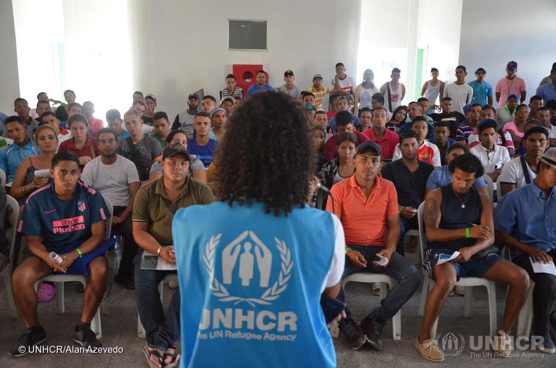

### AYS Daily Digest 10/01/20: Hints of corruption in UNHCR resettlement program
#### Update from Idlib / Mayors protest new camps on Aegean islands / Sea Watch rescued 119 people at sea / Captain Reisch leaves Lifeline / Norway to relocate 800 people

Credits: Twitter/@CanadaDev/UNHCR/Alan Azevodo
### Uganda: Hints of corruption in UNHCR resettlement program

There are hints that the resettlement program of UNHCR is corrupted, as the magazine Stern [found out](https://www.stern.de/politik/ausland/unhcr--hinweise-auf-korruption-beim-un-fluechtlingshilfswerk-9078146.html?fbclid=IwAR3donBXXIu_bikPWC7IxkB9O_JZKLA9bqBY58UjfkT3ywXwBujYFsQ69LM) \. Workers of the UN body in Uganda enabled people to be relocated by taking money — around 2500 US $ — from them\. The reporters speak about fake documents being issued and even the identities of other people who were waiting to be transferred to a safe place, and faked medical reports\. The headquarters in Geneva confirmed that it is investigating these reports from Uganda and Kenya\. Meanwhile the agency is using methods like fingerprints and photos to prevent any manipulation of the process\.
### Syria

More than 300,000 people have fled their homes in southern Idlib, as the fighting in the area intensify\. “The [displaced people](https://www.msf.org/refugees-idps-and-people-move) are frightened, uprooted and vulnerable; and overcrowding, limited shelter options, cold winter temperatures in the mountains,” [warns](https://www.msf.org/new-movement-displaced-northwest-syria-after-intense-military-offensive?fbclid=IwAR3dvbs0NYjWT_avClM463DJYupztK39INcRfaIV8jc7_z_lL1Y_EGkl8PM) MSF\. Still, people were afraid of the sun as it means bombs could be dropped\.
### Greece

As recent plans develop to open new closed camps on the Aegean islands, protests against this are increasing\. Several mayors came together on Friday to discuss this, Ekathimerini [reports](http://www.ekathimerini.com/248263/article/ekathimerini/news/more-protests-against-new-island-centers-on-the-way?fbclid=IwAR35RS2pjZ-uePFkvRw6PNlsEv47NvNv4kk1tilaKeAuQoi9oRvnsVpjx7U) \. West Lesvos Mayor Taxiarchis Verros, for example, objects to the new site, which is located next to a waste transfer station and a wind farm\. He added, the area is dry and lacks water supply\. Meanwhile some 54 people arrived in two boats, one at Chios and one at Samos, [according to](https://www.facebook.com/AegeanBoatReport/posts/745179149338525?hc_location=ufi) info from the Aegean Boat Report\.
### Sea

The Sea Watch 3 rescued 119 people in distress off the Libyan coast in the last hours, the team reported on Twitter\. The Open Arms rescued 44 people, who were at sea for two days already\.

After his trial in Malta was finished, captain Claus\-Peter Reisch decided to leave the Mission Lifeline team\. In an [interview](https://www.zeit.de/gesellschaft/2020-01/claus-peter-reisch-kapitaen-seenotrettung-lifeline/komplettansicht?fbclid=IwAR3IWWZ-Q0-lTOdVzniDcMgS3ARXoDSOimpPlU4ItUn-RezWvmPb8lHzZss) with Die Zeit he said, he does not like their political agitation and criticized their statement about Austrian chancellor Sebastian Kurz as Baby\-Hitler\. “For me this is about sea rescue and not political agitation,” he said\.
### Norway

Norway has agreed to resettle 600 people from Gashora camp in Rwanda, The Guardian [reports](https://www.theguardian.com/global-development/2020/jan/10/norway-opens-its-doors-to-600-people-evacuated-from-libya-to-rwanda?fbclid=IwAR3LiyHDdaM29Vh_pZe04sNJMcav-c1NWHZrACnOo_tIu2kKiiE50ejAQvw) \. The people there had been transferred from Libyan detention centres\. Sweden has agreed to accept seven people so far\. The Norwegian government agreed to resettle 3000 people from UN camps\. Aftenposten [adds](https://www.aftenposten.no/norge/i/P92lB7/norge-skal-hente-800-libya-flyktninger-fra-rwanda-og-romania-i-aar?fbclid=IwAR0nuaxOVekujTSDkFDTtJ9ZU3wksKtXg72hGOIw4wkmPaLSB6a_gv0o2l8) , that 200 people will be relocated from Romania\.
### France

Undocumented postal workers in France have won their right to live and work in the country, after a 7\-month strike\.

A child has been found dead in the undercarriage of a plane, which landed in Paris on Wednesday\. The plane departed from the Ivory Coast, [writes](https://www.thelocal.fr/20200108/child-found-dead-at-paris-airport-in-undercarriage-of-air-france-plane?fbclid=IwAR2M4qbzsKYCVvj9buUUyFocj3D5KjfWUuX9NZ0UzTFyG4yW859un9xcmOw) The Local\.
### Denmark

Activists against the Ellebæk detention center have locked themselves to the entrance of the Christiansborg Parliament building\. The keys have been deposited with the two responsible ministers, Nick Hækkerup and Mattias Tesfaye\.

**Find daily updates and special reports on our [Medium page](https://medium.com/are-you-syrious) \.**

**If you wish to contribute, either by writing a report or a story, or by joining the info gathering team, please let us know\.**

**We strive to echo correct news from the ground through collaboration and fairness\. Every effort has been made to credit organisations and individuals with regard to the supply of information, video, and photo material \(in cases where the source wanted to be accredited\) \. Please notify us regarding corrections\.**

**If there’s anything you want to share or comment, contact us through Facebook, Twitter or write to: areyousyrious@gmail\.com**

Following
- [Refugees](/tag/refugees)
- [Unhcr](/tag/unhcr)
- [Uganda](/tag/uganda)
- [Corruption](/tag/corruption)

_Converted [Medium Post](https://medium.com/are-you-syrious/ays-daily-digest-10-01-20-hints-of-corruption-in-unhcr-resettlement-program-2f15385f3fa) by [ZMediumToMarkdown](https://github.com/ZhgChgLi/ZMediumToMarkdown)._
