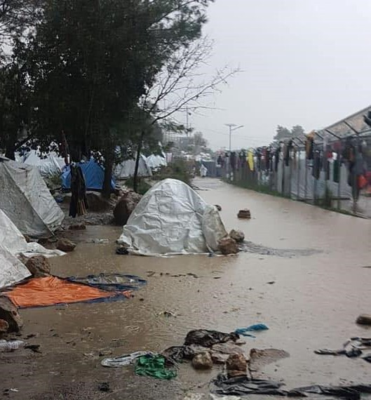
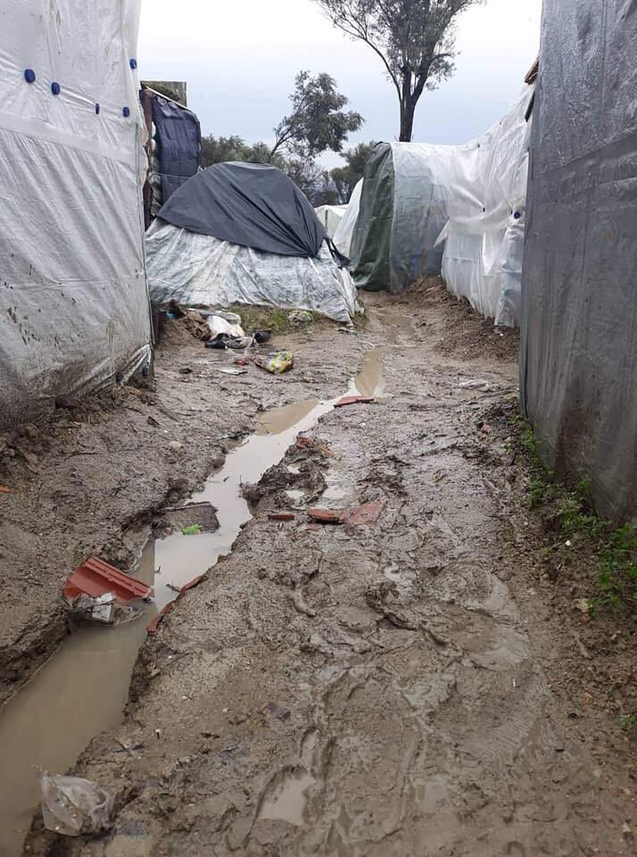
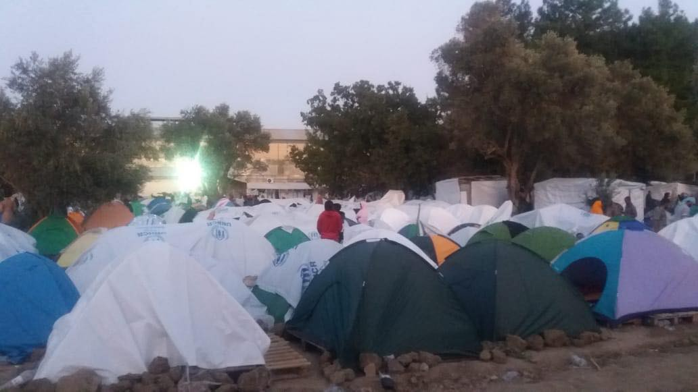
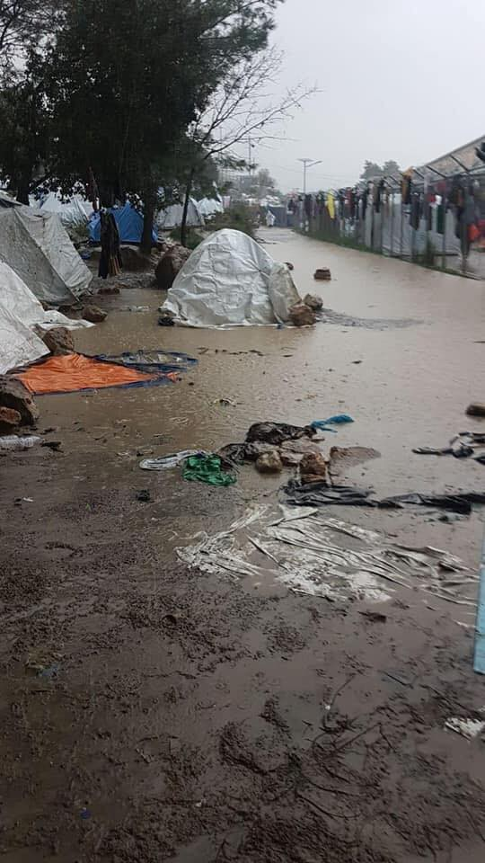

### AYS Special — Chios: From shoreline to the olive grove\. A reflection of life on the Greek island of Chios in 2019
#### Chios island has become a prison\. A prison inhabited by almost 6,000 people seeking refuge but finding instead a new sort of existence that forces them back to the basics\. This is survival, a decision born not by choice\.

People arriving by dinghy via the dangerous Aegean smuggling route cannot legally leave the island while they await their asylum decision; this can take months, sometimes years\.

The Vial camp is spilling out onto muddy fields and it is here that people must wait in limbo\. Driving past the unofficial ‘jungle’ camp, you see families huddled around fires, men walking back from olive groves with wood bundled on their backs, and children playing with stones amongst mounds of plastic\. As far as you can see, you will see tarpaulin\-covered structures of various shapes and sizes; ingenious constructions made from very little resources\.

> Life goes on here\. Babies fall asleep to the sound of strangers, teenage girls gossip, children fight with their siblings, women peg up washing on barbed wire fences, men smoke and keep watch over their ‘homes’\. Life goes on but life is harsh, unforgiving and unrelenting\. 

For thousands of people, 2019 was a year shaped by displacement and destitution\. Let’s take a look back…

In 2019 around 66,000 refugees landed on the Greek Aegean Islands; double the figure from 2018\. Throughout the year roughly 8,000 people arrived to the island of Chios, on 246 boats\. This autumn there was a sharp increase in the number of boat landings\. Just since October, 3,773 people reached Chios’s shoreline\. Figures show that on one fortnight alone, there were over 1000 new arrivals\. Boat landing scenes on the island were familiar to those of 2015 and 2016 before the EU Turkey deal was implemented and border control was increased\. In 2019, although many people safely reached European shores, hundreds of boats were also stopped and returned to Turkey\.

> Overall, in 2019 it is estimated that 10,7981 people were intercepted by the Turkish Coast Guard and the Police trying to reach the Aegean islands, and sent back\. 

It is claimed that some individuals swam the dangerous sea crossing from Turkey to reach Chios; this begs the question of how many other attempts have been made and deaths unreported\. Tragically, the Aegean Boat Report documented numerous fatalities in 2019\. On 13 August a 31\-year\-old man from Syria drowned off the coast of Chios when the flimsy dinghy he was traveling in came into difficulty near the coastline\. The other 41 people landed on a rocky shore and were picked up by the Coast Guard\. On 27 September seven people drowned after their boat capsized near Oinousses Island heading for Chios\. These are just two of many stories that ended in death; the hard, tragic truths of the Aegean route\.

> The extreme and unmanageable overcrowding here has reached a dangerous peak\. Refugees arriving to Chios now face the worst conditions ever seen\. 

At present, approximately 5,800 refugees live inside Vial camp\- a space with a capacity of only 1,100\. Most residents live in the squalid jungle area outside the camp\. The intention to help is there; the capacity simply is not\. It seems that there is an insufficient amount of resources and inadequate support from other EU actors\. Greece, burdened with its own financial turmoil, is unable to find a solution without support and external assistance\.

> **In the unofficial jungle, there is no water, no electricity, toilets, sanitation, showers, or washing facilities\. Children are often marked with visible injuries from accidents when families attempt to heat water in plastic bottles over fires\. In the spring a six\-year\-old girl suffered serious burns to her face and hands and was rushed to hospital after a gas bottle exploded in her tent\.** 

The people living in Vial are endangered by an inefficient waste disposal system which causes toxic sewage to spill out into their living quarters\. It is common to see maggots, rats and human faeces\. In a place where access to healthcare is extremely limited and often provided by volunteers, the likelihood of disease spreading is rife\. Camp residents talk about queuing for numerous hours to receive an inadequate supply of bottled water and food which is inedible due to poor taste\. The camp is littered with plastic containers, bottles and rotting meals\. Restricted access to basic hydration and nutrition in Europe in these modern times is shameful\. Many refugees are forced to spend the whole night outside the camp’s info point, queuing in the cold to ask a single question or to access basic information\. Staff inside the camp are mostly willing, but appear overwhelmed at the sheer amount of residents needing support\. Medical services are hard to access and reports of TB and scabies in the camp are frequent\.

Weather conditions have challenged camp residents throughout the year\. Sweltering temperatures in the summer meant many residents suffered from heatstroke and there were reports of people fainting in the distribution lines\. Ramadan was an extremely challenging time and tensions were high due to fatigue and dehydration, combined with dire living conditions\. Recent heavy rains on the island mean the camp has become extremely muddy\. Wastewater from the toilets spills onto the camp pathways that many tread every day, wearing inadequate footwear\. Children wade through filth and mud in broken flip flops\. After numerous severe storms in the winter, shelters and tent structures were battered, broken and worn down\. People toil on a daily basis to fix their ‘homes’ by stringing together cardboard and tarps; the repairing of one’s tent without enough materials has become part of every person’s daily routine\.

In order to keep warm in the cold weather, people have resorted to cutting down olive trees on private land to burn in order to keep warm\. This has led to further deterioration of local community relations\. By the end of 2019, aggravated tensions between the local community and camp residents had reached a breaking point\. After the influx of new arrivals to Chios in the autumn, and the resulting sudden overpopulation of the camp, many local people protested against the ‘occupation of their private land’\. The population of Chalkios, \(a village near the camp\) is just 300, so many people feel their village has been negatively affected yet they are not receiving any support or learning of a long\-term solution\. The mayor of Chios recently openly stated ‘Our way of life has been lost\.’ Locals witness the environmental impact the overpopulated camp is having on their land: excessive plastic waste, loss of ancient olive trees and damaged fields\.

> There are thousands of children inside the camp trying desperately to learn, grow, play and explore the world — all steps which are vital for healthy development into adulthood\. Depressingly, in grossly overcrowded living conditions, many minors are exposed to violence, and can be seen replicating this behaviour\. Children wander the camp without adult mentorship\. They are at serious health risk from the piles of human excrement in the fields where they sleep and play\. Groups of children chase each other dangerously close to the road — every game of tag is risky\. 

In summer 2019, figures showed only 60 children were registered in Greek school\. Locals recently protested to demand that all refugee children must be vaccinated before attending classes in local schools\. This presented a barrier to many refugee children’s ability to access education, as vaccinations were not available at the time\. Vaccination programmes thankfully reached Chios by the end of the year\. Another issue is that many families don’t want their children to go to local Greek schools as they worry this will delay their asylum claim\. There are some parents who, out of fear for their child’s welfare, will not let them out of their tent\. This means some families are trapped inside their shelters out of a desire for basic safety\.

> Over 100 unaccompanied minors are living in the ‘safe zone’ and other emergency spaces inside the official camp\. It is known that there are many more unaccompanied minors living in the jungle area of the camp without their parents, but with support from relatives\. 

UNHCR houses some vulnerable people in apartment blocks around the island but these have now reached capacity\. This means that there are many people classified as ‘vulnerable’ who are living in unsuitable conditions inside Vial, and also in the overspill jungle \(eg, the disabled, sick, elderly, mentally ill, pregnant women, etc\. \) \. Camp residents report that on 28 November a man died after complaining of shortness of breath and suffering health complications due to diabetes; just like the numerous deaths from boat crossings, this **death could have easily been prevented with appropriate access to services for vulnerable people** \. Recent figures say there are roughly 1,500 women at the camp\. Many single women are forced to live in a hostile, male\-dominated space\. The toilet facilities and pathways are not well lit, leading to increased female SGBV risk at night\.

Many, particularly single men, have been trapped on Chios Island for more than one year\. Most of the Community Centres and Language Centres are at capacity with long waiting lists; therefore it is becoming increasingly difficult to find solace from the grim reality of camp life\. People are so frustrated from endlessly waiting with no information that conflicts naturally arise\. In November disagreements between members of different nationalities resulted in fights and fires on the camp\. Camp residents, too afraid to return to their tents after learning of these incidents, resorted to sleeping in Chios Square without any form of shelter\.

It has been officially announced that this month the construction of a large facility, likened to a detention centre, will begin\. All people from Vial will be transferred to the facility\.

Residents will be forbidden to move freely in and out of the camp, say officials, but will instead be locked up until they are either granted official refugee status and relocated to the mainland or rejected and sent back to Turkey\. There will, of course, be restricted access for NGOs to enter\.

> A baby boy was recently delivered inside the camp\. He was named Mohammed\.
 

> At the moment of his birth, stray dogs barked in the olive groves and rubbish blew across the mountains around the camp\. 

Welcome to the world, little one, welcome to Europe\.

_All information about boat landings gathered from Aegean Boat Report Online\._

**Find daily updates and special reports on our [Medium page](https://medium.com/are-you-syrious) \.**

**If you wish to contribute, either by writing a report or a story, or by joining the info gathering team, please let us know\.**

**We strive to echo correct news from the ground through collaboration and fairness\. Every effort has been made to credit organisations and individuals with regard to the supply of information, video, and photo material \(in cases where the source wanted to be accredited\) \. Please notify us regarding corrections\.**

**If there’s anything you want to share or comment, contact us through Facebook, Twitter or write to: areyousyrious@gmail\.com**

_Converted [Medium Post](https://medium.com/are-you-syrious/ays-special-chios-a-baby-was-born-in-vial-surrounded-by-stray-dogs-and-rubbish-flying-around-cf4d81f15f73) by [ZMediumToMarkdown](https://github.com/ZhgChgLi/ZMediumToMarkdown)._
