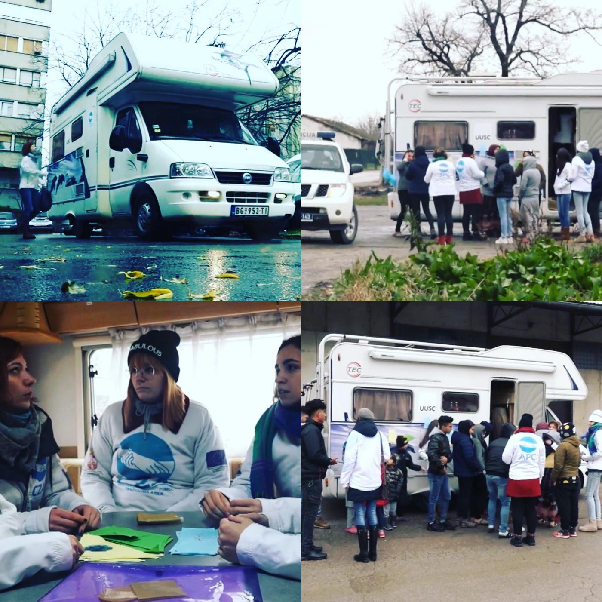

### AYS Daily Digest 22/1/20: The UK doesn’t want children to join their families, while the Greek islands are heating up
#### Legal experts warn: It is impossible for people on the islands to access the office in order to renew an asylum seeker card, leading up to a number of other issues and disrespect of the laws and rights / Relocation of 400 people from Greece to France is expected to start in summer / Mobile legal team set up to work across Serbia / UK overturned the Dubs Amendment

 of the reactions to today’s vote against Amendment 17 of the Brexit Bill, regarding child refugees](assets/6a397dc06257/0*7b0api5qOe_mztFj)

[Some](https://twitter.com/PatriciaNicol/status/1219607027405803521) of the reactions to today’s vote against Amendment 17 of the Brexit Bill, regarding child refugees
#### FEATURED

On top of tight political relations, thousands of Greek islanders have gathered in main squares early morning this Wednesday demanding “decongestion of the islands in the East Aegean Sea and oppose the government plans to build closed accommodation centers for thousands of refugees and migrants”, media reported\.

3,000 protesters gathered in Mytilene, Lesvos’s capital, while another 1,500 demonstrators were in the centre of Samos\.

There are many concerns rising from these protests, and all of the risk ends up being borne by people who have no free will or freedom of movement at the moment\. 
This thread speaks about some of the concerns:

■■■■■■■■■■■■■■ 
> **[RSA](https://twitter.com/rspaegean) @ Twitter Says:** 

> > 2. The main tone is that the local population is angry with the situation and the negligence of the government. In ##Chios &amp; in Lesvos a lot of people participated in the protests. The officials' speeches were pointing the need to stop the new centers and this inhuman situation https://t.co/mRdDnc9vRk 

> **Tweeted at [2020-01-22 11:47:58](https://twitter.com/rspaegean/status/1219949824696557569).** 

■■■■■■■■■■■■■■ 

> “No more prisons for human souls in the North Aegean”, said one of the protest banners\. 

We have written extensively about the hardships of people trapped unwillingly on the islands\.

[**Read our recent AYS Special from the island Chios\.**](ays-special-chios-a-baby-was-born-in-vial-surrounded-by-stray-dogs-and-rubbish-flying-around-cf4d81f15f73)

There is the other side to the human misery they live every day, the bureaucracy\. In their January Report on Rights Violations and Resistance from Lesvos, the Lesvos Legal Centre explains some of the most problematic issues more than 20,000 people are currently facing\.

> Total population of registered asylum seekers and refugees on Lesvos: 21,268 

> Registered population of Moria Camp & Olive Grove: 19,184 

> Unaccompanied minors: 1,049 

> Total Detained: 88 

> Total Arrivals in Lesvos from Turkey in 2020: 1,015 

The report reads:

> _Over 19,000 people are now living in Moria Camp — the main refugee camp on the island of Lesvos — yet the Camp lacks any official infrastructure, such as housing, security, electricity, sewage, schools, health care, etc\. While technically, most individuals are allowed to leave this camp, it has become an open\-air prison, as they must spend most of their day in hours\-long lines for food, toilets, doctors, and the asylum office\. Sexual and physical violence are common — and three people have died as a result of violence and desperation in as many weeks\. The Greek government also implemented a new asylum law 1 January 2020 with draconian measures that restrict the rights of migrants\. This new law expands the grounds on which to detain asylum seekers, increases bureaucratic hurdles for appeals, and removes previous protections for vulnerable individuals who arrive to the Greek islands\. Specifically, all individuals who arrive from Turkey are now prohibited from leaving the islands until their applications are processed, unless geographic restrictions are lifted at the discretion of the authorities\. These changes ultimately will lead to an increased population of asylum seekers trapped on Lesvos, and an increasing number of people trapped here who have had their asylum claims rejected and face deportation to Turkey\._ 

Given the large number of asylum seekers currently on Lesvos, the team explains that it is nearly impossible for all of them to access the office in order to renew an asylum seeker card that is expiring\.

> Some have reported they have to pay \(€20\) to other asylum seekers who are ‘controlling’ the line just to get a spot on line, where they must wait overnight in extreme weather conditions\. 

Apparently, the assistance of a lawyer is needed just to book an appointment or get in the door\. The consequences of failing to renew an asylum seeker card result in asylum seekers having to appear at the asylum office within one day of the expiration date, otherwise the card ceases to be valid\.

The team has also documented the following violations in the first few weeks of 2020, and procedural and practical complications in the implementation of the new law\. These include:

**1\.Right to Work Denied:** it is practically impossible for asylum seekers who have not already obtained an AMKA \( “temporary insurance number and healthcare of foreigners”\) to work and have access to healthcare, despite having the right to do so\.
 **2\. Access to Asylum Procedure Effectively Denied** : because of the number of asylum seekers currently living in Lesvos, many cannot access the asylum office on the day they are scheduled to register, as there are always hundreds of people waiting outside — and the asylum office is heavily guarded by the G4S private security company\. This could lead to many people missing the deadline and being denied the right to apply for asylum\. As a result their asylum cases could be closed, and they could face detention and deportation\.
 **3\. Risk of Rejection of Asylum Claims Due to Inability to Renew Asylum Seeker ID Card:** receiving a final decision on the merits means that they would need to appeal this denial to the Appeals Committee, rather than simply request the continuation of their case
 **4\. Prioritization of Claims Filed in 2020:** they have prioritized the processing of the asylum claims of new arrivals, at the expense of the thousands of asylum seekers who arrived and applied for asylum on Lesvos in 2018/2019
 **5\. Delay in Designation of Vulnerabilities Results in Continued Imposition of Geographic Restrictions for pre\-2020 arrivals:** “just in the past two weeks we have met with survivors of torture, sexual assault and people suffering from serious illnesses who arrived on Lesvos months ago, but have not been designated vulnerable due to a lack of a thorough medical assessment\. If designated vulnerable in 2020, the State is currently applying the new law to these individuals, and continues to process their claims under the border procedures, rather than lifting geographic restrictions and referring to the regular asylum procedure\.”
 **6\. Insurmountable Hurdles to Appeal Negative Decisions:** asylum applicants who receive a negative decision must describe specifically the grounds on which they are making an appeal in order for their appeal to be admissible by the Appeals Committees\. This is practically impossible without a lawyer\. Although the state is obligated to provide a lawyer on appeal, this right has been denied for over two years on Lesvos\.
**7\. Denial of Interpreter for Detained Asylum Seekers Speaking Rare Languages at Every Stage of the Procedure —**

> The lasting effects of colonization — also a driving factor in continued migration from Africa to Europe — has continued to haunt these individuals, as even after they have managed to make it into Europe, they are now expected to explain their eligibility for asylum in their former colonizer’s language\. 

“Despite the hostile political environment on Lesvos, a few significant successes confirm the importance of continued monitoring, litigation, and coordination with other actors in advocating for migrant rights on Lesvos\.”
Read their entire monthly newsletter [here](http://legalcentrelesvos.org/category/news/monthly-reports/) \.

> “Europe regards arrival countries such as Greece as a convenient parking spot for refugees and migrants\. Is that European solidarity? No\! I will no longer accept this”, said the Greek prime minister\. 

With the tensions rising on the islands, the surge of arrivals and lack of a proper system, and with the recently announced move to closed facilities, the government seeks to send a message to those arriving in the future who are hoping to reach their shores that they will be definitely constrained once in Greece\.
Also, among other restraining changes, post\-traumatic stress disorder \(PTSD\) has been withdrawn from the vulnerability criteria and this will prevent the affected people from seeking the medical attention that they desperately need and it will only get worse due to the treatment in the camps\. 
Once again, it is the people on the move for finding a refuge who will suffer the consequences of no solidarity between the EU Member states and the politics of the right\-wing governments\.

 \)](assets/6a397dc06257/1*QkT-FSCqQYv5OrBp522nhA.jpeg)

Moria, 2020 \(Photo: [Dimitris Tosidis](https://www.facebook.com/holden.belane?__tn__=%2Cd%2AF%2AF-R&eid=ARDNVJC0B8W8r_XTmnwWh9BRuV1v9-mRPV3RMq285WG4AvYpB5_5SBLvxlaNMPLqS-tUM5OAyWzlCmp_&tn-str=%2AF) \)
#### AFGHANISTAN
### Afghans deported into displacement

In total, more than 900,000 Afghans were displaced or returned home to conflict in 2019\.
Conflict continues to kill and injure thousands of civilians each year\. Many Afghans return to find their homes behind conflict lines, and a stumbling economy and job shortages mean many end up worse off than they did living as refugees in other countries, it is [reported](https://www.thenewhumanitarian.org/maps-and-graphics/2020/01/20/Afghanistan-Iran-Pakistan-US-migration-returns?utm_source=facebook&utm_medium=social&utm_campaign=social&fbclid=IwAR2rTEsI4IbUjOROgo6W9cdtDfn49TIN4nzxufKN4sGHFjTgT5RqiKLBZkw) \.

“The majority of returnees from abroad live a life of internal displacement,” noted the Geneva\-based Internal Displacement Monitoring Centre in a January report\.

> “They are either unable to return to their areas of origin or become displaced again once back in Afghanistan\.” 

#### GREECE

17 humanitarian organizations sent a joint letter to the Greek Migration and Asylum Minister urging him to address the incredible fact that thousands of asylum seekers and their children have no access to public health care\. They **opposed the recent decision to stop granting social security numbers \(AMKA\) to newly arriving people** \. However, they reportedly backed the government’s pursuit of more burden\-sharing from other EU states in managing the reception and distribution of asylum seekers\.
The organisations who engaged in this ‘fight’ were: ActionAid, Arsis, Doctors of the World, the Danish Refugee Council, The Network for Children’s Rights, The Center for Research on Women’s Issues “Diotima,” the Greek Council for Refugees, Elix, Hellenic League for Human Rights, the International Rescue Committee, HIAS Greece, HumanRights360, Bee Network, Praksis, Refugee Support Aegean, Solidarity Now, and Terre Des Hommes Hellas\.
### France will take 400 asylum seekers from Greece

[Mobile Info Team for refugees in Greece](https://www.facebook.com/mobileinfoteam/?__tn__=kC-R&eid=ARAUgcC_YrPSGW1s4LnNcEXyaEsb4QN9gB99GPVL4HcZfahg0kSMqsGEZrn-_y-EbuagyRR-Pbw4wU6c&hc_ref=ARQKvfQqFgj4qLGAduMRHmiNk2C-vLPmwAbgmfIKzwFs33LIZDuYJLMgFC-wF28zWqA&fref=nf&__xts__%5B0%5D=68.ARBSEfCf9tu_RujhQG2Y0p0DxAd81wkDCjKjSINM7ExDxavZYSGzGsyG0NVzcnffZtggeUro0r6iE31bfa3cVf72e7Fb71h0BEHPyVx8zwpuMhNFnaV9agSjwY3Od7hRRHcg4NolvAFKdHj7kvjm65x22o7EHzcR4SHke3LovbOHl92Fsrq68HFQQrWMlVuLMOgz-8b72_bcV5zTi2C6d1pOEDrTMlYraR2c1rz0stfv32ijzUEFd5tFdZwGmGvF76uRSQIFyJs2CXCzfX6-GPMZnEnRWysD55rUH8Ol-KccyX021voXJ4S9InFGbfaYO2xVUbL7Th6NL8t9-ZetVbTC2cOa) reports that priority will be given to families and other vulnerable asylum seekers\. First, France will send several asylum experts, who will prepare the start of the relocation\. The relocation itself is supposed to start in summer of this year\. This is undeniably good news\. But it should also be remembered that 400 is a relatively small number, compared to the 90,000 asylum seekers and migrants who are currently residing in Greece, hence the chances to be chosen will be very small\. France is the third country after Serbia and Portugal who agreed to relocate asylum seekers from Greece\. In December Serbia agreed to take around 100 unaccompanied minors from Greece\. Already in March 2019, an agreement was made to relocate between 100 and 1,000 asylum seekers from Greece to Portugal\. However, this agreement has so far not been implemented\.
#### SERBIA

The APC [Asylum in Serbia](https://www.facebook.com/AzilUSrbiji/?tn-str=k%2AF&hc_location=group_dialog) mobile team is now active across Serbia and along its borders as a safe place for people seeking to get more information on their legal options and current situation\. The teams work both with people on the move currently in Serbia, asylum seekers or not, as well as with the local population, with the aim of raising awareness and ultimately an atmosphere of acceptance as a precondition for common life\.

Photos: APC
#### UK
### No country for the most vulnerable ones

■■■■■■■■■■■■■■ 
> **[Alf Dubs](https://twitter.com/AlfDubs) @ Twitter Says:** 

> > It is bitterly disappointing that after a victory in the Lords the government have voted down my amendment in the Commons. What could be more humane than asking that unaccompanied child refugees stranded in Europe be able to join relatives in this country? 

> **Tweeted at [2020-01-22 17:11:32](https://twitter.com/alfdubs/status/1220031254990639112).** 

■■■■■■■■■■■■■■ 

The British Government overturned a Lords amendment which would have required the UK to continue working with EU to maintain rights of unaccompanied child refugees to join family in the UK\.
Why somebody would be against a child joining their family members is beyond us\.

> Conservative MPs just blocked family reunion for lone refugee children\. ⁣⁣This is a terribly sad day, but we have to keep fighting\. We can keep up the pressure on our politicians to do the right thing\. ⁣And we can keep supporting the incredible volunteer groups working flat\-out to provide food, clothing, education and psychological support to refugee children sleeping rough and stuck in grim camps across Europe\.⁣ ⁣Thank you for all the help you have given so far\. These children may have been abandoned by our politicians, but together we can show them that they’re not alone\. — [Choose Love](https://www.facebook.com/HelpRefugeesUK/?tn-str=k%2AF) 

**Find daily updates and special reports on our [Medium page](https://medium.com/are-you-syrious) \.**

**If you wish to contribute, either by writing a report or a story, or by joining the info gathering team, please let us know\.**

**We strive to echo correct news from the ground through collaboration and fairness\. Every effort has been made to credit organisations and individuals with regard to the supply of information, video, and photo material \(in cases where the source wanted to be accredited\) \. Please notify us regarding corrections\.**

**If there’s anything you want to share or comment, contact us through Facebook, Twitter or write to: areyousyrious@gmail\.com**

_Converted [Medium Post](https://medium.com/are-you-syrious/ays-daily-digest-22-1-20-the-uk-doesnt-want-children-to-join-their-families-while-the-greek-6a397dc06257) by [ZMediumToMarkdown](https://github.com/ZhgChgLi/ZMediumToMarkdown)._
