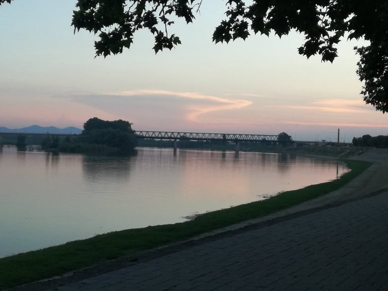

### AYS Daily Digest 4/2/20: An estimated 2\.9 mil\. people in Syria left without healthcare in the midst of violence
#### A lack of access and medicine, insufficient hygiene, chaos and mass displacement in Syria poses a significant risk of outbreaks of measles, diarrhoea and other diseases / traffickers arrested in Northern Macedonia / reports of Serbian police stealing from people sleeping rough in Belgrade; psychological help cut out from the government’s official camps in Serbia / more pushbacks from Croatia / fires in Italy and France / more news from other countries

Northern Syria — camps for displaced people, during freezing winter\. People continue to flee and gather in tent camps to escape war and terror\.
Photo by Belal Khaled
#### FEATURED

**Syria\-** The World Health Organization raises alarm over critical health threats facing hundreds of thousands of Syrians forced to flee due to intensified hostilities in northwest Syria and attacks on health care\.

As of 31 January, at least 53 health facilities had suspended services since 1 January due to insecurity, threats of attacks or the simple fact that entire areas have been deserted by civilians seeking refuge from violence and daily bombardments, the WHO [reported](http://www.emro.who.int/syr/syria-news/northwest-syria-who-raises-alarm-as-more-than-50-health-facilities-are-forced-to-cease-operations-amid-mass-displacement-and-hostilities.html) \.

Syrian families on the run now have even more limited access to basic health care, an increasing lack of basic medicine and less protection against communicable diseases as a fragile immunization network, put in place by WHO and partners, is now disrupted — coinciding with a mass displacement, further increasing the risk of outbreaks\.

**Northern Macedonia** — A group of 12 people from India, Afghanistan and Pakistan were allegedly imprisoned by a gang of four men in Northern Macedonia\. The victims, two of whom were children, were trapped inside a house with the windows covered so they lost all sense of time for almost two weeks in October 2019\. Authorities in North Macedonia announced this week that they had filed criminal charges against the four males, one Macedonian and three Pakistanis\.

> The alleged traffickers “gave \[the migrants\] food only once a day and physically abused them \[…\] If they tried to leave, the Pakistani members of the gang would beat them with truncheons and threaten to kill them with knives,” \( [Republika](https://english.republika.mk/news/macedonia/macedonian-pakistani-gang-charged-with-torturing-migrants-on-the-border-with-serbia/) \) 

According to the prosecution, the accused were caught after one of the people being held managed to contact relatives who reported the case to Serbian authorities, who in turn informed police in North Macedonia\. The Pakistani males are in custody awaiting trial, whilst the Macedonian male — who owns the house where the migrants were allegedly kept — is currently under house arrest\. The gang is also accused of demanding ransom money from the people’s relatives in other European countries\.

The house was reportedly in the village of Vaksintse, near the border with Serbia\.

> _T_ he majority ethnic Albanian border villages are main staging areas along the Balkan migrant route \(…\) \. At this section, they pay smugglers for accomodation and assistance in crossing the Macedonian — Serbian border and then continuing north toward Hungary or Croatia\. 

North Macedonia, which has applied to join the European Union, is on the so\-called Balkan route taken by many people on the move from Greece towards northern Europe\. In January, Interpol announced that they had [arrested more than 200 individuals suspected of smuggling and trafficking migrants in the Balkan region](https://www.infomigrants.net/en/post/22296/interpol-deals-blow-to-trafficking-and-smuggling-rings-in-balkans) stating that they had rescued 89 victims of trafficking during the operation\.
#### GREECE
### **Locals are angry, asylum seekers exhausted — both groups have reached their limits**

50 Moria village residents symbolically occupied the building of the General Secretariat of the Aegean & Islands Policy yesterday morning after a group of some 300 asylum seekers had passed through the village post\-protest in the capital Mytilene\. This amounts to 16% of the population of Moria who [stood in protest](https://www.keeptalkinggreece.com/2020/02/04/lesvos-moria-locals-asylum-seekers-protests/) against what they describe as ‘a tragic situation’\.

On Monday, the people trapped on Lesvos had protested in favour of being transferred to the mainland and to be granted humane living conditions\. Their actions were described by the chairman of the Moria community, Giannis Mastrogiannis as “provocative”\. Mastrogiannis went further accusing NGOs for the protests from migrants, linking the protest with the registration bill for the NGOs submitted to the Parliament on the protest day\.

Locals on Lesvos, Chios and Samos all demand decongestion of their islands\. During the protest in Lesvos, residents complained about the overcrowded Moria hotspot nearby\. In a town of only 300 people, the influx in numbers has incited fear and resentment\.

> _According to latest data, there are currently 19,505 people living inside and outside the Moria hot spot\._ 

Amidst resident calls to get their village back, a group of Afghans gathered outside the Municipality Theater in Mytilene [reportedly](https://www.stonisi.gr/post/6689/nea-diamartyria-afganwn-sto-dhmotiko-theatro-pics-updated) chanting “Lesvos people, we are sorry\!”

### **Chios is massively under\-resourced and overpopulated as people survive in primitive shelters**

_Snapshots taken on camp show waste overspills, battered tents in soaking, filthy conditions, extreme overcrowding in unsanitary surroundings, people heating themselves around unsafe, self\-made fires and the broken, summer shoes of refugees existing in harsh, windy, cold winter climates\._

All reveal the shocking humanitarian need present on Chios’s Vial Camp, conditions which often go unreported\.

_As the weather is set to decline dramatically in Greece, with snowfall, powerful rainfalls and thunderstorms all forecast on the Aegean islands, the hardships and insufferable living conditions are only going to worsen for all residents on camp — especially for the most vulnerable, such as children, pregnant women, those who are sick and the elderly\._

Be sure to catch up on the AYS? Special from Chios: What is life really like in a Greek Refugee Camp:

#### **Alarmphone’s Aegean Regional Analysis is a troubling read as conditions worsen and dangers rise for refugees travelling to Greece and living in hotspots**

■■■■■■■■■■■■■■ 
> **[Alarm Phone](https://twitter.com/alarm_phone) @ Twitter Says:** 

> > In 2019, 223 boats in distress called the #AlarmPhone in the #Aegean Sea. Also in 2020 the struggle to cross to the #Greek islands continues. Read our new regional analysis on developments in the #Aegean, covering the period 8 June 2019 - 19 January 2020. [alarmphone.org/en/2020/02/03/…](https://alarmphone.org/en/2020/02/03/aegean-regional-analysis/) 

> **Tweeted at [2020-02-04 09:34:56](https://twitter.com/alarm_phone/status/1224627387138301952).** 

■■■■■■■■■■■■■■ 

Alarmphone’s [new analysis](https://alarmphone.org/en/2020/02/03/aegean-regional-analysis/?fbclid=IwAR0cFCT_erhP5KAOUJdBOdb13QSkqSEM12kqz_l-iVVClxIVRwvL08doYDo) reveals that 223 boats in the Aegean sea contacted them in a state of distress during 2019\. In fact, the Eastern Mediterranean route was once again the source for Alarmphone’s largest number of emergency calls — emphasising the danger that people are prepared to face in order to flee the conditions at home\.

> “Most of the travellers called us from the sea, when their engines had stopped, water was entering the boat and they were afraid of drowning\. Sometimes people had fallen into the water during the landing and were in life threatening situations due to the cold”\. 

Shocking accounts from the Alarmphone team report several cases of illegal push\-backs and pull\-backs and other human rights violations at sea, such as refugees and migrants being attacked by masked men at sea who disabled their engines and left them adrift in distress at sea\.

> _When we consider the high number of children coming to Greece \(about 40% of all arrivals\), these incidents recorded by Alarmphone at sea become even more despicable and grim to learn about…_ 

We want to share in full \(another\) shocking personal story that goes to say how far the hatred and facism has come in Europe of today\.

> Stopped at Lesvos port by Greek police and asked for my documents\. Told them I was British\. They laughed and told me to stand with the rest of my people, the refugees\. 

> Told to put our bags on the ground for dogs to check\. I asked why we’d been stopped\. 

> \- Told to shut my mouth \- 

> I asked if I should put down my baby’s changing bag\. 

> \- Told to shut my mouth \- 

> I asked if my husband could put them down as my baby was attached to me\. 

> \- Told to shut my damn mouth \- 

> All of our 14 bags were checked\. 5 police officers went through all of our personal things\. My makeup was smashed\. They took out my underwear one by one, held it up, spoke in Greek and laughed\. They took out my sanitary pads and laughed\. They shoved them all back in so bad the suitcases wouldn’t close\. 

> They checked my baby’s clothes\. His toys\. His books\. His nappies\. Asked them to please be careful with his toys\. 

> \- Got told to shut my mouth or I’ll be sent BACK TO WHERE I CAME FROM \- 

> Again\. Asked about my nationality\. Told them I have a british passport\. They laughed and mimicked my British accent\. They asked where I’m REALLY from\. I said the UK\. 

> They got so frustrated and shouted: WHERE ARE YOUR PARENTS FROM\. I said Iran\. 

> They laughed and said I look Iranian, not British\. I explained I have no documents from Iran, and only the UK\. Got told to stop speaking\. Then asked why my husband is Afghan… 

> During this time, Azad’s shoes had been removed, all of his clothes checked, searched\. They shouted at him about his wife not cooperating and told him to make me shut my mouth\. 

> Breastfed my baby in the little hut they had put us in to calm him down\. They stared at my breasts, pointed and laughed\. 

> This was 3 days ago\. I don’t remember everything that was said, but what I wrote above I wish I could forget\. It’s been 3 days and I’m still shaking every time I think about it\. 

> Our IDs, our legitimate work, our baby, our money, nothing mattered\. The colour of our skin meant we had to be stopped and harassed\. 

> 22 years out of my 30 living in Europe\. — [Tifa Givian](https://www.facebook.com/tefa.givian?__tn__=%2CdlC-R-R&eid=ARAoashnuNo92jHud7RpEX8SoQgn_7kuovfeQ3YhSALZu-MXc-MbMLJmaWB24YQt14Dmpt6t336sghfg&hc_ref=ARRws0A7rO12TBAY5On3QOpLTudBwGrMgtEdYSMbbRDVtLC7eN52AYF26hJngpEau-g&ref=nf_target) 

### **A hardening of stance against NGOs operating in Greece**

As the frustration of Greek citizens rises amid the worsening of camp conditions and the increased numbers of people in hotspots and overspills, there has been increasing anger and suspicion directed at NGOs and volunteers working with refugees in Greece\.

Athens\-Macedonian News Agency [quoted sources](https://l.facebook.com/l.php?u=https%3A%2F%2Fwww.euractiv.com%2Fsection%2Fjustice-home-affairs%2Fnews%2Fgreece-passes-new-law-to-better-monitor-ngos-dealing-with-migration%2F%3Ffbclid%3DIwAR0iI_fk_nrW_OX5SFEevmqsKHx_EzkbbGMGgTdYDnndRftCIWRu_l1BqJU&h=AT1Bd6cCm8EkHc2Z2dw_L3GegaSF0l5kidYhPh4eQwKp_z2IVGwI6M42D9mYVbNwt8a9CodJhFoMXxYDgPz-by08Dzyj1ywfq5FaIE9e7P9qPccc3KmXaVH4V8SzBg6AJ0xiL0pCRPuWXA) from the prime minister’s office as saying that “already registered NGOs will have to register individual members, personnel and partners within three months\.

Responding to concerns, Greece’s Migration and Asylum Ministry has now submitted an amendment to Parliament requiring all non\-governmental organizations involved in the field of migration to submit a record of all their members and employees in a bid by the government to have a clearer picture of their activities\.

> According to the legislation, those NGOs who do not meet these demands will not be allowed to continue operating in Greece _\._ 

Special funding has also been pledged, to the amount of 25 million euros, for municipalities hosting reception centres and camps in a bid to help local authorities cope with additional hosting costs without having to raise municipality taxes\. Furthermore, the amendment calls for pre\-deportation centres to be set up in certain categories of public and municipal properties, as well as in disused military bases and camps\.
#### HUNGARY

■■■■■■■■■■■■■■ 
> **[HunHelsinkiCommittee](https://twitter.com/hhc_helsinki) @ Twitter Says:** 

> > Today we had to obtain another #rule39 interim measure from ECtHR to ensure that our client held in the transit zone is provided with food. He is the 28th person starved by the Hungarian authorities since August 2018. A list of all starvation cases [docs.google.com/spreadsheets/d…](https://docs.google.com/spreadsheets/d/10V84xAVREKSscFwz4ME_2kfpBRV_CPqCr7SUKitE2o8/edit#gid=0) 

> **Tweeted at [2020-02-04 17:19:53](https://twitter.com/hhc_helsinki/status/1224744395553083392).** 

■■■■■■■■■■■■■■ 

#### SERBIA

In their weekly newsletter, the Info Park team from Belgrade reported that as of 27 January, The Serbian Commissariat for Refugees and Migration \(SCRM\)
started applying new conditions for accommodating new arrivals into the centers\.
SCRM stated that they are no longer able to direct anyone to the centers without police registration paper\. In case there is no registration available at the Police Department for Foreigners at Savska, the SCRM will need a written confirmation that there was no registration paper before referring new arrivals to the centers\. On the following day, 28 January, SCRM team in Belgrade was referring new arrivals to the centers without registration\.

> According to the latest update, the number of refugees, asylum seekers and all other migrants accommodated in government run centers is close to 5,500 while the total number of refugees and migrants in Serbia at any given time was over 6,500 — the highest number since winter 16/17\. 

They have also reported cases of robbery by Serbian police\. Allegedly, an unaccompanied boy from Afghanistan stated that **police officers** 
**stole** 280 euro from he and his two friends\. Additionally, five men from Afghanistan stated that the Serbian police stole 300 euros from them, but also two mobile phones\. However, there were reportedly no use of physical violence\. All the alleged robbed men had been sleeping rough in Belgrade under the nearby bridges\.
The police is doing rounds at the building Staklenac in Gavrila Principa street occasionally and throwing them out\. Yet, majority of persons sleeping
rough are doing so under the nearby bridges\.

The Ministry of Health is no longer providing financial resources for employment of psychologists within asylum and reception centers; hence this service will no longer be available within the government run accommodation facilities\.
#### **CROATIA**
### **Volunteers report more illegal collective expulsions — pushbacks**

AYS was recently contacted by a family who was detained in a police station in Slavonski Brod, where they wanted to express the intention to seek asylum, but this was not allowed for them and, without having any legal aid, without any documents given to them, the people were pushed back to Bosnia and Herzegovina, out of the EU and away from an opportunity to seek safety and continuation of a more\-less normal life via the legal option of seeking international protection in an EU Member State\. This happens literally eery day\. Let’s not forget, the EU was a peace project in the beginning…

On the left side of the bridge is Bosanski Brod, part of the Republic of Srpska and Bosnia and Herzegovina, while on the right\-hand side lies Slavonski Brod, a tranzit town in Croatia, region of Slavonia, EU \(Photo: AYS\)

The recent [January report](https://www.borderviolence.eu/violence-reports/january-20-2020-1100-near-katinovac-croatia/?fbclid=IwAR14068ZnvWlEEXkBYy5my2uelSM-Up__-pxIt_3OVB2v_0eYFmZBgQF7gY) compiled by the Border Violence Monitoring Network, documented by No Name Kitchen volunteers details the account of two men who were [**illegally pushed back across the Croatian\-Bosnian border**](https://www.facebook.com/NoNameKitchenBelgrade/posts/908895026175449).) **\.**

Two Algerian men, aged 29 and 44, left a wooden area in Glina \(a small Croatian town\) in which they were hidden to ask for help as the older male had fallen ill with severe pain from kidney stones\. Having stopped several cars to ask for an ambulance, and with the unwell male lying on the street unable to move, a police car finally arrived at their location, reportedly laughing at the immobile man’s condition\. Both men were then transported to Glina Police Station\. Here they spent the night in only t\-shirts and underwear, with very little water and a single blanket between them\.

During their time with the police, the sick, older Algerian man was taken to a first hospital where he was refused assistance and then to a second hospital where he was treated but not allowed to speak directly with the doctor\. He was injected with a medicine which was not revealed to him, nor told any of his medical test results\. Upon his return to the police station, both men were questioned by police, had their fingerprints taken and promised transport to Zagreb in order to make their asylum application the next day\.

Ultimately, this promise was unfulfilled and their rights unrealized\. The following day, both men were put in a van with two agents in balaclavas who drove them to the Bosnia\-Herzegovina border\. Once there, the youngest man was beaten with batons, kicked by the agents and they were forcibly told to return to Bosnia and Herzegovina\.
#### ITALY

One person was run over and then denounced to the police, one was arrested and violently beaten, several police charges\.

10 expulsion orders from several towns and charges were pressed against 12 people for ‘unauthorized protests’ — This is the first balance of the response of the state and institutions to the strikes of farmworkers since December 6\.

Read more:

### Fires broke out in San Ferdinando and Borgo Mezzanone

One more night in the fire for the workers of the Italian countryside, [Comitato Lavoratori delle Campagne](https://www.facebook.com/comitatolavoratoridellecampagne/?__xts__%5B0%5D=68.ARAzQMpv9sFn14rs-miLBkHqCzfFtiGp6lEOQZz0nzW2LenZ5_ITTpeYW9eL0Q_t_pLEsiyErNjGpxpAfQlnFtS0VSAXpGblpxmm8F6EmblWTis9lwwK_U5VNpmLQ0GApGXrHMwUYlEuyA-hZRLFIlI0pfZTByB-Bm3WmXhaKo75uuik6bBf8Q-N6CJqEBLSSQv9p2C-O7XrVEBY7MU4fqcpR8f7vnKRuYJWyq7m9I5qQC84mrmXtIysYQNk46WPCFHAE8Y519BPcn8i9-Cvrs-b4Em5jBKLdR0NIrLiDBswI6r_-qlNdl7nm0ktyXuC1403N4YGzGDYdnbC0vRLVd-dLA&__tn__=k%2AF&tn-str=k%2AF) reports\.

At the ghetto of Borgo Mezzanone and San Ferdinando the umpteenth flames blazed by gas tank, stove or candle\. The affected people were moved urgently to the hospital of Bari\.

> What does it matter anyway? The fire, the race to extinguish it, the burnt ones, happen in isolated places, and even if their existence is known to all, who cares about some ordinary flames, especially since this time we did not even escape the dead\. This is the day\-to\-day administration for those who live in these ghettos and who, after such a night, go to work in the countryside the next day\. And what do the institutions do? set up the usual ridiculous answers, among other things without being ashamed to represent them as optimal\. In San Ferdinando, after months in which the workers, in the middle of the citrus harvest, asked to enter the state tents \(the last ones prepared after the great eviction of March 2019\) just last week the mayor and the police made the recordings, but only to 40 people were issued the necessary badge for access, and leaving out as many with a form of entry ban without any reason\. In the province of Foggia government has just finished preparing containers for the Grand Ghetto, as an emergency solution following the big fire last December\. Ghettos instead of ghettos, with multiple exclusion lists, control systems at every entrance and exit, unable to cook independently\. These, for years, are the optimal solutions that the institutions are proud to present, mocking every death or every fire that occurs periodically\. And there are also those who show these solutions on social media as conquests finally achieved, as they have no shame to be the USB union, always ready to practice their own looting on the skin of workers\. You go there to live in containers and tents, since the houses available there are, as well as the resources, also coming from European funds, dedicated to the workers engaged in the Italian countryside\. The workers have no intention of remaining silent and will continue to fight as they have always done\. You will continue to find us in the streets until you give us what we deserve\! 

](assets/805c72f10169/1*achRxacB8_4Xo3ww2HAvsg.jpeg)

Photo: [Comitato Lavoratori delle Campagne](https://www.facebook.com/comitatolavoratoridellecampagne/?__xts__%5B0%5D=68.ARAzQMpv9sFn14rs-miLBkHqCzfFtiGp6lEOQZz0nzW2LenZ5_ITTpeYW9eL0Q_t_pLEsiyErNjGpxpAfQlnFtS0VSAXpGblpxmm8F6EmblWTis9lwwK_U5VNpmLQ0GApGXrHMwUYlEuyA-hZRLFIlI0pfZTByB-Bm3WmXhaKo75uuik6bBf8Q-N6CJqEBLSSQv9p2C-O7XrVEBY7MU4fqcpR8f7vnKRuYJWyq7m9I5qQC84mrmXtIysYQNk46WPCFHAE8Y519BPcn8i9-Cvrs-b4Em5jBKLdR0NIrLiDBswI6r_-qlNdl7nm0ktyXuC1403N4YGzGDYdnbC0vRLVd-dLA&__tn__=k%2AF&tn-str=k%2AF)
### Mediterranea: the Court of Palermo orders the release of Mare Jonio

The Civil Court of Palermo has granted the appeal lodged by Mediterranea Saving Humans against the impoundment of Mediterranea’s ship Mare Jonio\. The authorities involved have been ordered to immediately release the vessel, which was seized on Sept\. 3, Mediterranea [reported](https://mediterranearescue.org/en/news-en/mediterranea-the-court-of-palermo-orders-the-release-of-mare-jonio-our-ship-is-finally-free-the-safety-decrees-have-been-invalidated/?fbclid=IwAR1KVkfpoCyTeNzIis_Zr2-oy46pGOxA5ITr43pc0Hj6WWV4N8PpDklwSF0) \.

> This decision also saves us, as well as the other ships of the civil society, from toxic and criminal decisions such as renewing the agreement with Libya\. But to carry on our mission, we need all the support from our ground crews\. 

#### BELGIUM

](assets/805c72f10169/1*4DAgFfvXYLWmvqp0SZ_TFA.jpeg)

There are well over 1000 displaced people in Brussels, including families and unaccompanied minors\. Many people are effectively homeless with no guarantee of shelter, whilst others are living in refugee camps\.
Learn more:
[https://refugee\-rights\.eu/…/uploads/2019/12/Belgium\-2019\-v3…](https://refugee-rights.eu/wp-content/uploads/2019/12/Belgium-2019-v3-web.pdf?fbclid=IwAR0-cUHVXnRHW-nI2Dq9PiE0C7WDFzA8dsROv9RallFYHDVgykDgkjbZbMk)
#### FRANCE

In Toulouse, there was a fire in progress at the squat at 44 avenue de Muret welcoming more than 400 people, mostly undocumented and having already lost everything\. Follow this thread for more coming updates and connections to previous similar accidents:

■■■■■■■■■■■■■■ 
> **[CAMé](https://twitter.com/cametoulouse) @ Twitter Says:** 

> > Le squat est sous le coup d'une expulsion. Elle est possible à tout moment donc, malgré la trêve hivernale. Cet accident pourrait justifier la fermeture et la condamnation du bâtiment, voire sa destruction, comme on l'a déjà vu par le passé :

[came2016.wordpress.com/2019/04/04/fin…](https://came2016.wordpress.com/2019/04/04/fin-de-la-treve-hivernale-debut-des-expulsions-end-of-winter-truce-beginning-of-the-evictions/) 

> **Tweeted at [2020-02-04 14:39:19](https://twitter.com/cametoulouse/status/1224703987355672578).** 

■■■■■■■■■■■■■■ 

#### SPAIN
### 26 suspected smugglers, who earned at least 1\.5 mil\. euros in 2019, arrested

\[Photo of small boat carrying migrants from link input\]

A series of six raids across Almeria and Alicante rounded up 26 suspected smugglers and led to police confiscating 17 vehicles\. The smuggling network stretched from Algeria across the Mediterranean to southeastern Spain; mostly in the provinces of Alicante and Almeria\.

The suspected smugglers are thought to have operated with powerful speedboats and charged migrants around €2,500 per head in order to bring the mostly Algerian migrants from the port of Oran, in Algeria, to Spain\.

> “Anyone \[trafficked person\] who didn’t pay, or couldn’t pay the full amount would be “dumped along the way or held hostage until their families covered the amount owed\.” 

#### **GERMANY**
### **New Calls from German politicians to take in UAMs from Greece**

Several German leaders from different political parties have now declared their willingness to accept unaccompanied children and minors\. Federal states such as Berlin and Thuringia, the Green’s side of the government of Baden\-Wurttemberg and Lower Saxony’s SPD Interior Minister have all spoken in favour of this action affirming a commitment that is country wide and across the political spectrum,

■■■■■■■■■■■■■■ 
> **[Daphne Tolis](https://twitter.com/daphnetoli) @ Twitter Says:** 

> > After the clashes between asylum seekers &amp; riot police that took place on Lesbos today, Lower Saxony’s Interior Minister @[borispistorius](https://twitter.com/borispistorius) reiterated his position urging Germany to allow the willing states to take in unaccompanied minors from #Greece. - @[welt](https://twitter.com/welt)

 #refugeesGr 

> **Tweeted at [2020-02-03 21:11:03](https://twitter.com/daphnetoli/status/1224440182214033408).** 

■■■■■■■■■■■■■■ 

Half of the people who arrive to Germany as refugees find jobs in 5 years:

#### SWEDEN

Deportations continue from Sweden, but so do the protests of the locals against the deportations:

 ‎](assets/805c72f10169/1*jsh-jDQWn4GIyrC52PUp6Q.jpeg)

Photo: [Christina Gyllenger](https://www.facebook.com/christina.gyllenger?fref=gs&__tn__=%2Cd%2AF%2AF-R&eid=ARDKenFmvprZEsCaYG3Vd3yt47-garYiJFVSwaNoF4IrWNnBHuhYldCIjyU5FvwDGw6ghodSapGzibaP&tn-str=%2AF&dti=212935029139489&hc_location=group_dialog) ‎

**Find daily updates and special reports on our [Medium page](https://medium.com/are-you-syrious) \.**

**If you wish to contribute, either by writing a report or a story, or by joining the info gathering team, please let us know\.**

**We strive to echo correct news from the ground through collaboration and fairness\. Every effort has been made to credit organisations and individuals with regard to the supply of information, video, and photo material \(in cases where the source wanted to be accredited\) \. Please notify us regarding corrections\.**

**If there’s anything you want to share or comment, contact us through Facebook, Twitter or write to: areyousyrious@gmail\.com**

_Converted [Medium Post](https://medium.com/are-you-syrious/ays-daily-digest-4-2-20-an-estimated-2-9-805c72f10169) by [ZMediumToMarkdown](https://github.com/ZhgChgLi/ZMediumToMarkdown)._
